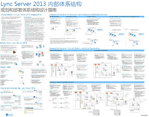
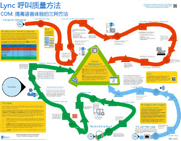
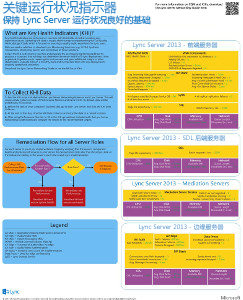
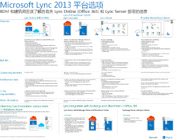

---
title: Lync Server 2013 技术图示
TOCTitle: 技术图示
ms:assetid: 7b6da49b-ac72-4ab0-8957-166e330b38fa
ms:mtpsurl: https://technet.microsoft.com/zh-cn/library/Dn594589(v=OCS.15)
ms:contentKeyID: 61170969
ms.date: 12/10/2016
mtps_version: v=OCS.15
ms.translationtype: HT
---

# Lync Server 2013 技术图示

 

_**上一次修改主题：** 2016-12-08_

**概要：** 这些图提供了适用于 Lync 2013 的建议的解决方案的可视表示。

这些资源采用 Visio (.vsd) 格式（Visio 2010 或 Visio 2013）和 PDF 格式。有关如何打印文档的信息，请参阅有关打印招贴的提示。

您可能需要使用其他软件才能查看这些文件。有关详细信息，请参见下表。

<table>
<colgroup>
<col style="width: 50%" />
<col style="width: 50%" />
</colgroup>
<thead>
<tr class="header">
<th>文件类型</th>
<th>软件</th>
</tr>
</thead>
<tbody>
<tr class="odd">
<td>
.vsd
</td>
<td>
Visio 2010、Visio 2013 或<a href="http://go.microsoft.com/fwlink/?linkid=393676">免费 Visio viewer</a>

如果您使用 Visio viewer，请右键单击 VSD 链接，单击“目标另存为”，将文件保存到您的计算机，然后从您的计算机打开文件。
</td>
</tr>
<tr class="even">
<td>
.pdf
</td>
<td>
任何 PDF 查看器，例如 <a href="http://go.microsoft.com/fwlink/?linkid=393675">Adobe Reader</a>
</td>
</tr>
<tr class="odd">
<td>
.zip
</td>
<td>
任何文件压缩工具。Windows 7 和 8 本身可以打开这些文件。
</td>
</tr>
</tbody>
</table>

## 招贴

这些招贴详细描绘了特定的技术领域，旨在与 TechNet 上的相应文章或下载中心提供的内容配合使用。

<table>
<colgroup>
<col style="width: 50%" />
<col style="width: 50%" />
</colgroup>
<thead>
<tr class="header">
<th>标题</th>
<th>说明</th>
</tr>
</thead>
<tbody>
<tr class="odd">
<td>
<strong>Lync Server 2013 本地体系结构</strong>

<a href="http://go.microsoft.com/fwlink/?linkid=392974">使用 Microsoft 提供的 Zoom.it 将招贴放大到显示全部细节</a>（最适合台式机或便携式计算机）

<a href="http://go.microsoft.com/fwlink/?linkid=392578">PDF 版本</a>（最适合移动设备或平板电脑）

<a href="http://go.microsoft.com/fwlink/?linkid=392579">Visio 版本</a>（最适合使用 Visio 的用户）
</td>
<td>
招贴：提供用于规划和部署的体系结构指南。该招贴包含如下信息：Lync Server 的通用组件、规划部署时使用的技术、新功能、服务器角色、安装概述。此外该招贴还包含关于灾难恢复和提升高可用性的示例体系结构，以及小型、中型和大型示例拓扑。

大小：34 × 44 英寸

此招贴是使用 Visio 2013 创建的。应该无需针对特定环境进行修改。
</td>
</tr>
<tr class="even">
<td>
<strong>Lync 呼叫质量方法</strong>

<a href="http://go.microsoft.com/fwlink/?linkid=392972">使用 Microsoft 提供的 Zoom.it 将招贴放大到显示全部细节</a>（最适合台式机或便携式计算机）

<a href="http://go.microsoft.com/fwlink/?linkid=391841">Visio 和 PDF 版本一起压缩到 .zip 文件中</a>
</td>
<td>
招贴：描绘 Lync 系统故障排除，特别是针对影响企业语音质量的问题的故障排除。将此招贴与以下内容一起使用：

<ul>
<li>
<a href="http://go.microsoft.com/fwlink/p/?linkid=390677">Lync Server 网络连接指南</a>
</li>
<li>
<a href="lync-server-2013-poster-lync-call-quality-methodology.md">Lync 呼叫质量方法</a>（辅助功能文章）
</li>
<li>
<a href="lync-server-2013-poster-key-health-indicators.md">关键运行状况指示器</a>（辅助功能文章）
</li>
</ul>

大小：34 × 44 英寸

此招贴是使用 Visio 2010 创建的。应该无需针对特定环境进行修改。
</td>
</tr>
<tr class="odd">
<td>
<strong>关键运行状况指示器</strong>

<a href="http://go.microsoft.com/fwlink/?linkid=392971">使用 Microsoft 提供的 Zoom.it 将招贴放大到显示全部细节</a>（最适合台式机或便携式计算机）

<a href="http://go.microsoft.com/fwlink/?linkid=391838">Visio 和 PDF 版本一起压缩到 .zip 文件中</a>
</td>
<td>
招贴：描绘适用于 Lync 实施中的基本服务器运行状况和给定服务器角色的服务器故障排除指标。将此招贴与以下内容一起使用：

<ul>
<li>
<a href="http://go.microsoft.com/fwlink/p/?linkid=390677">Lync Server 网络连接指南</a>
</li>
<li>
<a href="lync-server-2013-poster-lync-call-quality-methodology.md">Lync 呼叫质量方法</a>（辅助功能文章）
</li>
<li>
<a href="lync-server-2013-poster-key-health-indicators.md">关键运行状况指示器</a>（辅助功能文章）
</li>
</ul>

大小：17 × 22 英寸

此招贴是使用 Visio 2010 创建的。应该无需针对特定环境进行修改。
</td>
</tr>
<tr class="even">
<td>
<strong>Lync 2013 平台选项</strong>

<a href="http://go.microsoft.com/fwlink/p/?linkid=391840">使用 Microsoft 提供的 Zoom.it 将招贴放大到显示全部细节</a>

<a href="http://go.microsoft.com/fwlink/p/?linkid=391837">PDF 版本</a>（最适合移动设备或平板电脑）

<a href="http://go.microsoft.com/fwlink/p/?linkid=391839">Visio 版本</a>（最适合使用 Visio 的用户）
</td>
<td>
此招贴描绘 Lync 2013 的可用平台选项 - 关于客户可从 Lync Online with Office 365、混合 Lync、本地 Lync Server 和托管 Lync 选择的 BDM 和体系结构。此招贴包含每种体系结构选项的详细信息，其中包括每种体系结构最理想的方案、许可证要求、IT 专业人员责任。

大小：34 × 44 英寸

此招贴是使用 Visio 2013 创建的。应该无需针对特定环境进行修改。
</td>
</tr>
<tr class="odd">
<td>
<strong>Microsoft Lync Server 2013 协议工作负载</strong>

<a href="http://go.microsoft.com/fwlink/?linkid=392970">使用 Microsoft 提供的 Zoom.it 将招贴放大到显示全部细节</a>

<a href="http://go.microsoft.com/fwlink/?linkid=392512">PDF 版本</a>（最适合移动设备或平板电脑）

<a href="http://go.microsoft.com/fwlink/?linkid=392513">Visio 版本</a>（最适合使用 Visio 的用户）
</td>
<td>
可下载此招贴以了解 Lync 2013、Lync Phone、Lync Web App、Lync for Mac、Lync Mobile 的功能和要求。了解 Lync Server 工作负载为在组织范围内进行通信提供了怎样的便利。

大小：24 × 36 英寸

此招贴是使用 Visio 2013 创建的。应该无需针对特定环境进行修改。
</td>
</tr>
</tbody>
</table>

## 打印招贴的提示

如果有绘图仪，您可以按全尺寸打印这些招贴。如果没有绘图仪，请按以下步骤打印在较小的纸张上。

**在较小纸张上打印招贴**

1.  在 Visio 中打开招贴。

2.  在“文件”菜单上，单击“页面设置”。

3.  在“打印设置”选项卡上，在“打印机纸张”部分中选择要使用的打印纸张大小。

4.  在“打印设置”选项卡上，在“打印缩放比例”部分中单击“调整为”，然后输入“1 张长乘 1 张宽”。

5.  在“页面大小”选项卡上，单击“调整大小以适应绘图内容”，然后单击“确定”。

6.  在“文件”菜单上，单击“打印”。

