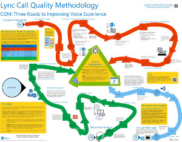
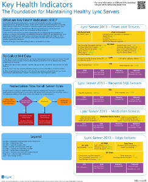

# Lync Server 2013 的技术图

 

_**主题上次修改时间：** 2014-03-14_

**摘要：** 这些图表提供适用于 Lync 2013 的推荐解决方案的可视表示形式。

这些资源在 Visio （.vsd）格式（Visio 2010 或 Visio 2013）和 PDF 格式中可用。 有关如何打印文档的信息，请参阅Tips for printing posters。

您可能需要使用其他软件才能查看这些文件。有关详细信息，请参见下表。

<table>
<colgroup>
<col style="width: 50%" />
<col style="width: 50%" />
</colgroup>
<thead>
<tr class="header">
<th>文件类型</th>
<th>软件</th>
</tr>
</thead>
<tbody>
<tr class="odd">
<td>
.vsd
</td>
<td>
Visio 2010、Visio 2013 或免费的<a href="http://go.microsoft.com/fwlink/?linkid=393676">visio viewer</a>

如果您使用 Visio viewer，请右键单击 VSD 链接，单击“<strong>目标另存为</strong>”，将文件保存到您的计算机，然后从您的计算机打开文件。
</td>
</tr>
<tr class="even">
<td>
.pdf
</td>
<td>
任何 PDF 查看器，如<a href="http://go.microsoft.com/fwlink/?linkid=393675">Adobe Reader</a>
</td>
</tr>
<tr class="odd">
<td>
.zip
</td>
<td>
任何文件压缩工具。 Windows 7 和 8 8 以本机方式打开这些文件。
</td>
</tr>
</tbody>
</table>

## 招贴

这些招贴详细描绘了特定的技术领域，旨在与 TechNet 上的相应文章或下载中心提供的内容配合使用。

<table>
<colgroup>
<col style="width: 50%" />
<col style="width: 50%" />
</colgroup>
<thead>
<tr class="header">
<th>标题</th>
<th>描述</th>
</tr>
</thead>
<tbody>
<tr class="odd">
<td>
<strong>Lync Server 2013 本地体系结构</strong>

<a href="http://go.microsoft.com/fwlink/?linkid=392974">通过 Microsoft 的 Zoom.it 以完整的方式放大海报</a>（最好在台式计算机或笔记本电脑上）

<a href="http://go.microsoft.com/fwlink/?linkid=392578">PDF 版本</a>（适用于移动设备或平板电脑）

<a href="http://go.microsoft.com/fwlink/?linkid=392579">Visio 版本</a>（适用于具有 visio 的用户）
</td>
<td>
海报提供规划和部署的体系结构指南。 海报包含有关 Lync Server 的通用组件、规划部署、新功能、服务器角色和安装概述时使用的术语的信息。 此外，海报还包含用于提高高可用性和灾难恢复的示例体系结构，以及小型、中型和大型示例拓扑。

大小：34 × 44 英寸

此海报是使用 Visio 2013 创建的。 应该无需针对特定环境进行修改。
</td>
</tr>
<tr class="even">
<td>
<strong>Lync 通话质量方法</strong>

<a href="http://go.microsoft.com/fwlink/?linkid=392972">通过 Microsoft 的 Zoom.it 以完整的方式放大海报</a>（最好在台式计算机或笔记本电脑上）

<a href="http://go.microsoft.com/fwlink/?linkid=391841">在 .zip 文件中一起使用 Visio 和 PDF 版本</a>
</td>
<td>
描述 Lync 系统疑难解答的海报，尤其适用于影响企业语音质量的问题。 在以下情况下使用此海报：

<ul>
<li>
<a href="http://go.microsoft.com/fwlink/p/?linkid=390677">Lync Server 网络指南</a>
</li>
<li>
<a href="lync-server-2013-poster-lync-call-quality-methodology.md">Lync Server 2013 中的 Lync 呼叫质量方法</a>（辅助功能文章）
</li>
<li>
<a href="lync-server-2013-poster-key-health-indicators.md">Lync Server 2013 中的关键运行状况指示器</a>（辅助功能文章）
</li>
</ul>

大小：34 × 44 英寸

此招贴使用 Visio 2010 创建。 应该无需针对特定环境进行修改。
</td>
</tr>
<tr class="odd">
<td>
<strong>关键运行状况指示器</strong>

<a href="http://go.microsoft.com/fwlink/?linkid=392971">通过 Microsoft 的 Zoom.it 以完整的方式放大海报</a>（最好在台式计算机或笔记本电脑上）

<a href="http://go.microsoft.com/fwlink/?linkid=391838">在 .zip 文件中一起使用 Visio 和 PDF 版本</a>
</td>
<td>
描述服务器故障排除指标的海报，适用于基本服务器运行状况和 Lync 实现中的给定服务器角色。 在以下情况下使用此海报：

<ul>
<li>
<a href="http://go.microsoft.com/fwlink/p/?linkid=390677">Lync Server 网络指南</a>
</li>
<li>
<a href="lync-server-2013-poster-lync-call-quality-methodology.md">Lync Server 2013 中的 Lync 呼叫质量方法</a>（辅助功能文章）
</li>
<li>
<a href="lync-server-2013-poster-key-health-indicators.md">Lync Server 2013 中的关键运行状况指示器</a>（辅助功能文章）
</li>
</ul>

大小：17英寸至22英寸

此招贴使用 Visio 2010 创建。 应该无需针对特定环境进行修改。
</td>
</tr>
<tr class="even">
<td>
<strong>Lync 2013 平台选项</strong>

<a href="http://go.microsoft.com/fwlink/p/?linkid=391840">通过 Microsoft Zoom.it 最详细地放大海报</a>

<a href="http://go.microsoft.com/fwlink/p/?linkid=391837">PDF 版本</a>（适用于移动设备或平板电脑）

<a href="http://go.microsoft.com/fwlink/p/?linkid=391839">Visio 版本</a>（适用于具有 visio 的用户）
</td>
<td>
此海报介绍了适用于 Lync 2013 的适用于 Bdm 的平台选项，并且架构师客户可以使用 Office 365、混合 Lync、Lync Server 本地和托管 Lync 从 Lync Online 中进行选择。 该海报包括每个体系结构选项的详细信息，包括每个体系结构选项最理想的方案，包括许可证要求和 IT 专业人员责任。

大小：34 × 44 英寸

此海报是使用 Visio 2013 创建的。 应该无需针对特定环境进行修改。
</td>
</tr>
<tr class="odd">
<td>
<strong>Microsoft Lync Server 2013 协议工作负荷</strong>

<a href="http://go.microsoft.com/fwlink/?linkid=392970">通过 Microsoft Zoom.it 最详细地放大海报</a>

<a href="http://go.microsoft.com/fwlink/?linkid=392512">PDF 版本</a>（适用于移动设备或平板电脑）

<a href="http://go.microsoft.com/fwlink/?linkid=392513">Visio 版本</a>（适用于具有 visio 的用户）
</td>
<td>
下载此海报以了解 Lync 2013、Lync Phone、Lync Web App、Lync for Mac 和 Lync Mobile w 的功能和要求。 了解 Lync 服务器工作负荷如何促进组织间的通信。

大小： 24 x 36 英寸

此海报是使用 Visio 2013 创建的。 应该无需针对特定环境进行修改。
</td>
</tr>
</tbody>
</table>

## 打印海报的提示

如果您有绘图仪，则可以按其完整大小打印这些海报。 如果您没有绘图仪，请使用以下步骤在较小的纸张上打印。

**在较小纸张上打印招贴**

1.  在 Visio 中打开招贴。

2.  在“**文件**”菜单上，单击“**页面设置**”。

3.  在“**打印设置**”选项卡上，在“**打印机纸张**”部分中选择要使用的打印纸张大小。

4.  在“**打印设置**”选项卡上，在“**打印缩放比例**”部分中单击“**调整为**”，然后输入“**1 张长乘 1 张宽**”。

5.  在“**页面大小**”选项卡上，单击“**调整大小以适应绘图内容**”，然后单击“**确定**”。

6.  在“**文件**”菜单上，单击“**打印**”。

 

