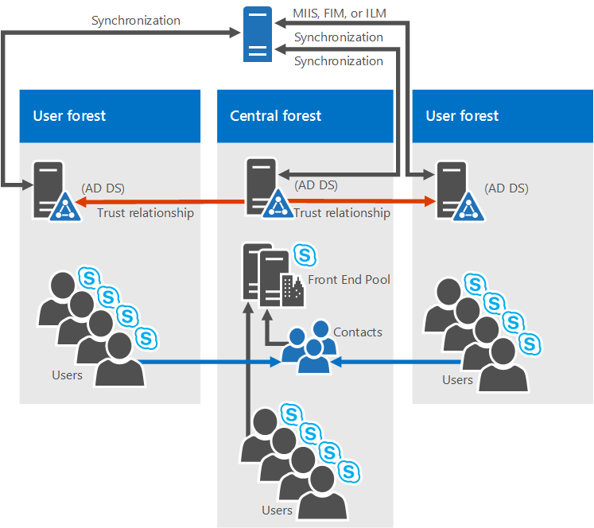

# <a name="system-requirements-for-skype-for-business-server-2019"></a>Skype for business Server 2019 的系统要求
 
**摘要：** 使用此主题准备安装 Skype for Business Server 2019。 此处介绍了硬件、OS、软件、数据库、证书、活动 Diretory、DNS 和 fileshares。 此处的所有系统要求和建议可帮助确保成功安装和部署服务器场。
  
如您所料，开始部署 Skype for Business Server 2019 之前，还需要做一些准备工作。 本文将指导您规划以下内容：
  
- [硬件](system-requirements.md#Hardware)
  
- [操作系统](system-requirements.md#OS)
  
- [软件](system-requirements.md#Software)

- [后端 SQL 数据库](system-requirements.md#DBs)
  
- [Active Directory](system-requirements.md#AD)
  
- [域名系统 (DNS)](system-requirements.md#DNS)
  
- [证书](system-requirements.md#Certs)
  
- [文件共享](system-requirements.md#Fileshare)

  
## <a name="hardware-for-skype-for-business-server-2019"></a>Skype for business Server 2019 的硬件
<a name="Hardware"> </a>

将拓扑关闭后（如果不是，请查看[Skype for Business Server 2019 主题的拓扑基础知识](../../SfbServer/plan-your-deployment/topology-basics/topology-basics.md)），现在可以考虑服务器。 Skype for Business Server 2019 服务器需要64位硬件。 我们的硬件建议如下。 这些不是要求，但它们反映了实现最佳性能所需的要求。 我们有容量规划文档，它将根据您的环境，帮助您确定是否需要更多。
  
适用于 Standard Edition 服务器的建议硬件：

|**硬件组件**|**适合**|
|:-----|:-----|
|CPU  <br/> |英特尔至强 2673 v3 双处理器，6核，2.4 千兆位（GHz）或更高。  <br/> Skype for business Server 2019 角色不支持 Intel Itanium 处理器。  <br/> |
|内存  <br/> |32千兆字节（GB）。  <br/> |
|磁盘  <br/> |请  <br/> •8个或更多 10000 RPM 硬盘，至少有 72 GB 的可用磁盘空间（两个磁盘使用 RAID 1，6个磁盘使用 RAID 10）。  <br/> OR  <br/> •稳定状态驱动器（Ssd）能够为 8 10000 RPM 机械磁盘驱动器提供相同的可用空间和类似的性能。  <br/> |
|网络  <br/> |1个双端口网络适配器，1 Gbps 或更高（2个网络适配器可以使用，但需要使用一个 MAC 地址和一个 IP 地址进行分组）。  <br/> 前端服务器、后端服务器和 Standard Edition 服务器**不**支持双宿主或多宿主配置。 <br/> 只要不向操作系统公开并使用它来监视和管理服务器硬件，您就可以使用带外管理系统，如 DRAC 或 ILO。 此方案不构成多穴服务器，并且受支持。  <br/> |


适用于前端服务器和后端服务器的建议硬件：
  
|**硬件组件**|**适合**|
|:-----|:-----|
|CPU  <br/> |英特尔至强 2673 v3 双处理器，6核，2.4 千兆位（GHz）或更高。 <br/> Skype for business Server 2019 角色不支持 Intel Itanium 处理器。  <br/> |
|内存  <br/> |64千兆字节（GB）。  <br/> |
|磁盘  <br/> |请  <br/> •8个或更多 10000 RPM 硬盘，至少有 72 GB 的可用磁盘空间（两个磁盘使用 RAID 1，6个磁盘使用 RAID 10）。  <br/> OR  <br/> •稳定状态驱动器（Ssd）能够为 8 10000 RPM 机械磁盘驱动器提供相同的可用空间和类似的性能。  <br/> |
|网络  <br/> |1个双端口网络适配器，1 Gbps 或更高（2个网络适配器可以使用，但需要使用一个 MAC 地址和一个 IP 地址进行分组）。  <br/> 前端服务器、后端服务器和 Standard Edition 服务器**不**支持双宿主或多宿主配置。 <br/> 只要不向操作系统公开并使用它来监视和管理服务器硬件，您就可以使用带外管理系统，如 DRAC 或 ILO。 此方案不构成多穴服务器，并且受支持。  <br/> |
   
适用于边缘服务器、独立中介服务器和控制器的推荐硬件：
  
|**硬件组件**|**适合**|
|:-----|:-----|
|CPU  <br/> |英特尔至强 2673 v3 双处理器，6核，2.4 千兆位（GHz）或更高。  <br/> Skype for business Server 2019 角色不支持 Intel Itanium 处理器。  <br/> |
|内存  <br/> |32 gb。  <br/> |
|磁盘  <br/> |请  <br/> •4个或更多 10000 RPM 硬盘，至少有 72 GB 的可用磁盘空间（磁盘应采用 2x RAID 1 配置）。  <br/> OR  <br/> •稳定状态驱动器（Ssd）能够为 4 10000 RPM 机械磁盘驱动器提供相同的可用空间和类似的性能。  <br/> |
|网络  <br/> |1个双端口网络适配器，1 Gbps 或更高（2个网络适配器可以使用，但需要使用一个 MAC 地址和一个 IP 地址进行分组）。  <br/> 视频互操作服务器和控制器**不**支持双宿主或多宿主配置。 <br/> 边缘服务器需要两个分别为双端口网络适配器、1 Gbps 或更高（或两个配对的网络适配器）的网络接口（或两个配对的网络适配器），每个端口包含一个 MAC 地址和一个 IP 地址，共有两对。  <br/> 在独立中介服务器上，支持安装额外的网络接口卡（Nic），以允许配置特定的 PSTN IP 地址。  <br/> |


> [!NOTE]
> 无论服务器角色如何，我们还建议为 Skype for business Server 2019 提供以下硬件设置（这可能因你购买的硬件品牌而异，请参阅制造商文档了解详细信息）：
> - BIOS 配置-应设置为 "单层" 和 "NUMA"。
> - 启用超线程。
> - "RSS 队列" 设置应设置为8个 "队列"。

   
## <a name="operating-systems-for-skype-for-business-server-2019"></a>适用于 Skype for business Server 2019 的操作系统
<a name="OS"> </a>

准备好硬件之后，你将需要安装操作系统（OS），该操作系统将允许你安装并成功使用 Skype for Business Server 2019。
  
|||
|:-----|:-----|
|Windows Server 2019 <br/> |
|Windows Server 2016 <br/> ||
||
   
除此处列出的操作系统之外的任何操作系统都不会正常工作。请勿尝试安装 Skype for Business Server 2019。 例如，未列出服务器 Core 选项，因此不受支持。

> [!NOTE]
> Lync Server 2013 不支持 OS 就地升级。 您必须部署单独的池，并将用户迁移到具有不同 OS 的新池。 池中的所有服务器必须具有相同的 OS 版本。

> [!NOTE]
> 
> 如果要在 Windows Server 2019 计算机上安装 Windows 管理中心2019，它会提示您要侦听的端口。 有一个 liklihood 可以选择端口443，但是如果该计算机上安装了 Skype for Business Server 2019 或要将 Skype for business Server 2019 安装在该计算机上，则必须选择其他端口号。
> 
>为什么要如此？ 如果 Windows 管理中心2019在端口443上运行，您将无法使用 Skype for Business 控制面板连接到服务器，也不能连接到服务器上运行的任何内部 web 服务（通讯簿 Web 服务、自动发现服务、Web 票证服务等）。  事实上，你将无法连接到任何内部 Web 服务 URL。 如果需要，请选择其他端口，或者希望在使用 Skype for Business Server 2019 的服务器上放置 Windows 管理中心2019。
> 

  
## <a name="software-that-should-be-installed-before-a-skype-for-business-server-2019-deployment"></a>在 Skype for business Server 2019 部署之前应安装的软件
<a name="Software"> </a>

您需要为运行 Skype for Business Server 2019 的任何服务器安装或配置一些内容。 下面列出了这些操作，后面还有针对特定服务器角色的其他要求。

> [!IMPORTANT]
> Skype For Business 2019 支持 .Net Framework 4.8。 
  
 **所有服务器：**
  
|**软件/角色**|**Details**|
|:-----|:-----|
|Windows PowerShell 3.0  <br/> |所有 Skype for Business 服务器服务器都需要安装 Windows PowerShell 3.0。  <br/> •默认情况下，应安装 Windows Server 2016。<br/> |
|Microsoft .NET Framework  <br/> |WCF 服务是一种作为 Windows 功能安装的**功能**，在**服务器管理器**下，最初不需要下载。 <br/> •您需要确保在安装此功能时，或者如果已安装此功能并对其进行检查，也会检查并安装**HTTP 激活**选项，如下所示： <br/>  <br/> 如果你还需要安装其他一些提示，以便安装 HTTP 激活，请不要担心。 这是正常的;单击 "确定" 并继续。 如果你没有看到此弹出窗口，则可以假定已安装并继续执行这些操作。  <br/> 安装 Windows Server 2016 时通常会安装 Microsoft .NET Framework。 Skype for business Server 需要 Microsoft .NET Framework 4.7 或4.8，因此您可能需要对其进行更新。 你可以在[此处](https://support.microsoft.com/help/3186497/the-net-framework-4-7-offline-installer-for-windows/)找到更新<br/> |
|媒体基础  <br/> |对于 Windows Server 2016，Windows Media Format Runtime 将安装在 Microsoft Media Foundation 中。  <br/> 所有前端服务器和用于会议的 Standard Edition 服务器要求 Windows Media Format Runtime 运行 Windows Media 音频（.wma）文件，这些文件是呼叫寄存、公告和响应组应用程序，用于通知和音乐。  <br/> |
|Windows Identity Foundation  <br/> |我们需要 Windows Identity Foundation 3.5 以支持 Skype for business Server 2019 的服务器到服务器身份验证方案。  <br/> •对于 Windows Server 2016，无需下载任何内容。 打开 "**服务器管理器**"，然后转到 "**添加角色和功能向导**"。 **Windows Identity Foundation 3.5**在 "**功能**" 部分下列出。 如果选择此选项，则是个合适的。 否则选择它并单击 "**下一步**"，进入 "**安装**" 按钮。 <br/> |
|远程服务器管理工具  <br/> |角色管理工具： AD DS 和 AD LDS 工具  <br/> |
   
 **前端服务器和 Standard Edition server 还需要：**
  
|**软件/角色**|**Details**|
|:-----|:-----|
|Internet Information Services (IIS)  <br/> |在所有前端服务器和所有 Standard Edition 服务器上都需要使用 IIS，并选择以下模块：  <br/> •常见的 HTTP 功能：默认文档、HTTP 错误、静态内容  <br/> •运行状况和诊断： HTTP 日志记录、日志记录工具、跟踪  <br/> •性能：静态内容压缩、动态内容压缩  <br/> •安全性：请求筛选、客户端证书映射身份验证、Windows 身份验证  <br/> •应用程序开发： .NET 扩展性3.5、.NET 扩展性4.5、ASP.NET 3.5、ASP.NET 4.5、ISAPI Extension、ISAPI 筛选器  <br/> •管理工具： IIS 管理控制台、IIS 管理脚本和工具  <br/> 请注意，还需要匿名访问，但在安装 IIS 时，您没有在列表中选择它的位置。  <br/> |
|Windows Media Format Runtime  <br/> | 对于 Windows Server 2016，你需要在**服务器管理器**中安装**媒体基础**功能。 实际可以启动 Skype for Business Server 2019 安装，但不需要这样做，但在 Skype for Business Server 2019 安装继续之前，系统将提示您安装它，然后重新启动服务器。 最好提前执行此操作。 <br/> |
|Silverlight  <br/> |你可以在[此处](https://www.microsoft.com/silverlight/)安装最新版本的 Silverlight。  <br/> |
   
为了帮助您完成此过程，您可以运行以下示例 PowerShell 脚本来自动执行此操作：
  
```PowerShell
Add-WindowsFeature RSAT-ADDS, Web-Server, Web-Static-Content, Web-Default-Doc, Web-Http-Errors, Web-Asp-Net, Web-Net-Ext, Web-ISAPI-Ext, Web-ISAPI-Filter, Web-Http-Logging, Web-Log-Libraries, Web-Request-Monitor, Web-Http-Tracing, Web-Basic-Auth, Web-Windows-Auth, Web-Client-Auth, Web-Filtering, Web-Stat-Compression, Web-Dyn-Compression, NET-WCF-HTTP-Activation45, Web-Asp-Net45, Web-Mgmt-Tools, Web-Scripting-Tools, Web-Mgmt-Compat, Windows-Identity-Foundation, Server-Media-Foundation, Telnet-Client, BITS, ManagementOData, Web-Mgmt-Console, Web-Metabase, Web-Lgcy-Mgmt-Console, Web-Lgcy-Scripting, Web-WMI, Web-Scripting-Tools, Web-Mgmt-Service
```

 **控制器还需要：**
  
IIS 中，选择以下模块：
  
- 常见的 HTTP 功能
    
  - 默认文档
    
  - HTTP 错误
    
  - 静态内容
    
- 运行状况和诊断
    
  - HTTP 日志记录
    
  - 日志记录工具
    
  - 追踪
    
- 性能
    
  - 静态内容压缩
    
- 安全性
    
  - 请求筛选
    
  - 客户端证书映射身份验证
    
  - Windows 身份验证
    
- 应用程序开发
    
  - .NET 扩展性3。5
    
  - .NET Extensibility 4.5
    
  - ASP.NET 3。5
    
  - ASP.NET 4。5
    
  - ISAPI 扩展
    
  - ISAPI 筛选器
    
（如果您想知道，它与前端服务器和 Standard Edition 服务器的模块集相同，动态内容压缩和管理工具将被留给。）
  
此外，我们还提供了下面的一些 PowerShell 代码：
  
```PowerShell
Add-WindowsFeature RSAT-ADDS, Web-Server, Web-Static-Content, Web-Default-Doc, Web-Http-Errors, Web-Asp-Net, Web-Net-Ext, Web-ISAPI-Ext, Web-ISAPI-Filter, Web-Http-Logging, Web-Log-Libraries, Web-Request-Monitor, Web-Http-Tracing, Web-Basic-Auth, Web-Windows-Auth, Web-Client-Auth, Web-Filtering, Web-Stat-Compression, NET-WCF-HTTP-Activation45, Web-Asp-Net45, Web-Scripting-Tools, Web-Mgmt-Compat, Server-Media-Foundation, Telnet-Client
```

## <a name="back-end-databases-that-will-work-with-skype-for-business-server-2019"></a>将与 Skype for Business Server 2019 配合使用的后端数据库
<a name="DBs"> </a>

安装 Skype for Business Server 2019 Standard Edition 时，将拥有 SQL Server 2016 Express （64位版本）。

Skype for Business Server 2019 Enterprise Edition 将需要完整的 SQL Server，如下所示（仅64位版本; 请勿使用32位版本）：
  
||||
|:-----|:-----|:-----|
|Microsoft SQL Server 2019 （64-bit edition），您必须运行最新的更新。  <br/> |Microsoft SQL Server 2017 （64-bit edition），您必须运行最新的更新。  <br/> |
Microsoft SQL Server 2016 （64-bit edition），您必须运行最新的更新。|
 |

如果您在此处看不到要使用的 SQL Server 版本，则不能使用它。
  
> [!NOTE]
> 此外，还需要为监视服务器角色安装 SQL Server Reporting Services。 
  
### <a name="sql-clustering-and-sql-always-on"></a>SQL 群集和 SQL Always On

支持使用 Skype for Business Server 2019 的 SQL 群集。 如果要设置 SQL 群集，则在 SQL Server 中执行此操作。
  
请确保您具有 SQL 群集的主动/被动配置，这是受支持的。 不要与任何其他 SQL 实例共享被动节点。
  
您可以对故障转移群集使用以下各项：
  
双节点：
  
- Microsoft SQL Server 2019 Standard （64-bit edition），我们建议使用最新的 service pack 运行。
- Microsoft SQL Server 2017 Standard （64-bit edition），我们建议使用最新的 service pack 运行。
- Microsoft SQL Server 2016 Standard （64-bit edition），我们建议使用最新的 service pack 运行。

十六节点：
  
- Microsoft SQL Server 2019 企业版（64版），我们建议使用最新的 service pack 运行。
- Microsoft SQL Server 2017 企业版（64版），我们建议使用最新的 service pack 运行。
- Microsoft SQL Server 2016 企业版（64版），我们建议使用最新的 service pack 运行。

支持 SQL Always On，并且可以在[Skype for Business Server 2019 的后端服务器高可用性](../../SfbServer/plan-your-deployment/high-availability-and-disaster-recovery/back-end-server.md)中阅读更多相关信息。
  

###  <a name="additional-server-installation-recommendations"></a>其他服务器安装建议：
  
请勿在任何前端服务器或独立中介服务器上安装任何 Microsoft Internet 安全性和加速（ISA）服务器客户端软件或任何其他 Winsock 分层服务提供程序（LSP）软件（此处将包含任何第三方防火墙或防病毒网络检查软件）。 安装该软件时，会看到较差的媒体流量性能。
  

## <a name="active-directory"></a>Active Directory
<a name="AD"> </a>

虽然服务器和服务的大部分配置数据存储在 Skype for Business Server 2019 中央管理存储中，但仍有一些内容存储在 Active Directory 中：
  
|**Active Directory 对象**|**对象类型**|
|:-----|:-----|
|架构扩展  <br/> |用户对象扩展  <br/> |
||Skype for business Server 2015 和 Lync Server 2013 的扩展，以保持与以前支持的版本的向后兼容性  <br/> |
|Data  <br/> |用户 SIP URI 和其他用户设置  <br/> |
||应用程序的 Contact 对象（如响应组应用程序和会议助理应用程序）  <br/> |
||为实现向后兼容而发布的数据  <br/> |
||中央管理存储的服务控制点（SCP）  <br/> |
||Kerberos 身份验证帐户（可选计算机对象）  <br/> |
   
### <a name="os-for-domain-controllers"></a>适用于域控制器的操作系统

可以使用以下域控制器操作系统：
  
- Windows Server 2019

- Windows Server 2016
    
- Windows Server 2012 R2
    
- Windows Server 2012
    
您将 Skype for business Server 2019 部署到的任何域的域功能级别，以及将 Skype for Business Server 2019 部署到的任何林的林功能级别必须为以下项之一：
  
- Windows Server 2016
    
- Windows Server 2012 R2
    
- Windows Server 2012
    
在这些环境中是否可以拥有只读的域控制器？ 当然，只要还有可写域控制器也是如此。
  
了解 Skype for Business Server 2019 不支持单标签域，这一点非常重要。 它们是什么？ 如果您有一个名为 "contoso. 本地" 的根域，这将是完好的。 如果您有一个仅命名为 local 的根域，则不会起作用，因此不支持。 有关这方面的详细信息，请参阅[本知识库文章](https://support.microsoft.com/kb/300684/)。
  
Skype for Business Server 2019 也不支持重命名域。 如果确实必须重命名域，则需要卸载 Skype for Business Server 2019，执行域重命名，然后重新安装 Skype for Business Server 2019。
  
最后，您可能会使用锁定的 AD DS 环境处理域，这一点很好。 有关如何将 Skype for Business Server 2019 部署到部署文档中的锁定的 AD DS 环境的详细信息，请参阅。
  
### <a name="ad-topologies"></a>AD 拓扑

Skype for Business Server 2019 中支持的拓扑为：
  
- 具有单个域的单林
    
- 具有单个树和多个域的单林
    
- 具有多个树和互不连接的命名空间的单林
    
- 中央林拓扑中的多林
    
- 资源林拓扑中的多林
    
- 具有 Exchange Online 的 Skype for Business 资源林拓扑中的多个林
    
- 具有 Skype for Business Online 和 Azure Active Directory Connect 的资源林拓扑中的多个林
    
我们有图示和说明，可帮助您确定您的环境中的拓扑，或者安装 Skype for Business Server 2019 之前可能需要设置的内容。 为简单起见，我们还包括一个键：
  

  
#### <a name="single-forest-with-single-domain"></a>具有单个域的单林


  
它不会比此更简单;它是一个通用拓扑的单域林。
  
#### <a name="single-forest-with-a-single-tree-and-multiple-domains"></a>具有单个树和多个域的单林


  
此图再次显示了一个林，但它还具有一个或多个子域（在此特定示例中有三个）。 因此，在其中创建用户的域可能不同于将 Skype for business Server 2019 部署到的域。 为什么要考虑这一点呢？ 请务必记住，在部署 Skype for business Server 前端池时，池中的所有服务器都需要位于单个域中。 您可以通过 Skype for Business Server 支持 Windows 通用管理员组来实现跨域管理。
  
在上面的关系图中，可以看到一个域中的用户能够从同一个域或不同域访问 Skype for Business Server 池，即使这些用户位于子域中也是如此。
  
#### <a name="single-forest-with-multiple-trees-and-disjoint-namespaces"></a>具有多个树和互不连接的命名空间的单林


  
您可能具有类似于此图表的拓扑，其中您有一个林，但在该林中是多个域，每个都有单独的 AD 命名空间。 在这种情况下，此图是一个很有效的说明，因为它包括访问 Skype for Business Server 2019 的三个不同域中的用户。 实线表示他们在自己的域中访问的是 Skype for Business Server 池，而一条虚线指示他们将转到其他树中的池。
  
正如您所看到的，同一个域中的用户、相同的树，甚至不同的树可以成功访问池。
  
#### <a name="multiple-forests-in-a-central-forest-topology"></a>中央林拓扑中的多林


  
Skype for Business Server 2019 支持在中央林拓扑中配置多个林。 如果你不确定这是什么，拓扑中的中央林将使用其中的对象来表示其他林中的用户，并为林中的任何用户承载用户帐户。
  
这是如何工作的？ 目录同步产品（如 Forefront Identity Manager 或 FIM）在其所有存在中管理组织的用户帐户。 从林中创建或删除帐户时，该更改将同步到中央林中的相应联系人。
  
很显然，如果你的 AD 基础结构已准备就绪，移到此拓扑可能不是很简单，但如果你已经存在，或者仍在规划林基础结构，这可能是一个不错的选择。 您可以将 Skype for Business Server 2019 部署集中在单个林中，用户可以在任何林中搜索、通信和查看其他用户的状态。 将使用同步软件自动处理所有用户联系人更新。
  
#### <a name="multiple-forests-in-a-skype-for-business-resource-forest-topology"></a>Skype for Business 资源林拓扑中的多个林
<a name="BKMK_multipleforestopology"> </a>


  
此外，还支持资源林拓扑;在这种情况下，林专用于运行服务器应用程序，如 Microsoft Exchange Server 和 Skype for business Server 2019。 此资源林还托管活动用户对象的同步表示形式，但没有启用登录的用户帐户。 因此，资源林是用户对象所驻留的其他林的共享服务环境，它们与资源林之间存在林级信任关系。
  
请注意，Exchange Server 可以部署在与 Skype for Business Server 相同的资源林中，也可以部署在不同的林中。
  
若要在此类型的拓扑中部署 Skype for Business Server 2019，您可以在资源林中为用户林中的每个用户帐户创建一个禁用的用户对象（如果该环境中已存在 Microsoft Exchange Server，则可能会为您执行此操作）。 然后，您需要目录同步工具（如 Forefront Identity Manager 或 FIM）以通过其生命周期管理用户帐户。
  
#### <a name="multiple-forests-in-a-skype-for-business-resource-forest-topology-with-exchange-online"></a>具有 Exchange Online 的 Skype for Business 资源林拓扑中的多个林
<a name="BKMK_multipleforestopology"> </a>

此拓扑类似于[Skype For business 资源林拓扑中的多个林中](system-requirements.md#BKMK_multipleforestopology)所述的拓扑。
  
在此拓扑中，有一个或多个用户林，且 Skype for Business Server 部署在专用资源林中。 Exchange Server 可以部署在同一资源林或不同林的本地部署中，并配置为与 Exchange Online 混合使用，否则本地帐户的 Exchange Online 可能会专门提供电子邮件服务。 没有可用于此拓扑的关系图。
  
#### <a name="multiple-forests-in-a-resource-forest-topology-with-skype-for-business-online-and-azure-active-directory-connect"></a>具有 Skype for Business Online 和 Azure Active Directory Connect 的资源林拓扑中的多个林
<a name="BKMK_multipleforestopology"> </a>


  
在此方案中，有多个具有资源林拓扑的本地林。 Active Directory 林之间存在完全信任关系。 Azure Active Directory Connect 工具用于在本地用户林与 Office 365 之间同步帐户。
  
 组织还具有 Office 365，并使用[Azure Active Directory Connect](https://docs.microsoft.com/azure/active-directory/connect/active-directory-aadconnect)将其本地帐户与 Office 365 同步。 为 Skype for business 启用的用户是通过 Office 365 和 Skype for Business Online 启用的。 未在本地部署 Skype for Business Server。
  
单一登录身份验证由位于用户林中的 Active Directory 联合身份验证服务场提供。
  
在这种情况下，支持在本地部署 Exchange、Exchange Online、混合 Exchange 解决方案或根本不部署 Exchange。 （图表仅显示本地 Exchange，但还完全支持其他 Exchange 解决方案。）
  
#### <a name="multiple-forests-in-a-resource-forest-topology-with-hybrid-skype-for-business"></a>具有混合 Skype for Business 的资源林拓扑中的多个林
<a name="BKMK_multipleforestopology"> </a>

在这种情况下，有一个或多个本地用户林，Skype for Business 部署在专用资源林中，并配置为使用 Skype for Business Online 的混合模式。 Exchange Server 可以部署在同一资源林或不同林的本地部署中，并且可以为与 Exchange Online 的混合配置。 或者，电子邮件服务可能仅由 Exchange Online 为本地帐户提供。
  
有关详细信息，请参阅[配置混合 Skype For business 的多林环境](../../SfbServer/skype-for-business-hybrid-solutions/deploy-hybrid-connectivity/configure-a-multi-forest-environment-for-hybrid.md)。
  
## <a name="domain-name-system-dns"></a>域名系统 (DNS)
<a name="DNS"> </a>

Skype for Business Server 2019 需要 DNS，原因如下：
  
- DNS 使 Skype for Business Server 2019 能够发现内部服务器或池，从而实现服务器到服务器的通信。
    
- DNS 允许客户端计算机发现用于 SIP 事务的前端池或 Standard Edition 服务器。
    
- 它将会议的简单 Url 与托管这些会议的服务器相关联。
    
- DNS 允许外部用户和客户端计算机连接到边缘服务器或 HTTP 反向代理，以用于即时消息（IM）或会议。
    
- 它允许未登录的统一通信（UC）设备发现运行设备更新 web 服务的前端池或 Standard Edition 服务器以获取更新和发送日志。
    
- 使用 DNS，移动客户端可以自动发现 web 服务资源，而无需用户在其设备设置中手动输入 Url。
    
- 它在 DNS 负载平衡中使用。
    
请务必注意，Skype for Business Server 2019 不支持国际化域名（Idn）。
  
此外，请务必记住，DNS 中的任何名称与 Skype for business Server 2019 使用的任何服务器上配置的计算机名称相同。 具体来说，在环境中不能有任何短名称，并且必须具有 "拓扑生成器" 的 Fqdn。
  
这似乎是已加入域的任何计算机的逻辑，但如果您的边缘服务器未加入您的域，则它可能具有一个短名称的默认值，没有域后缀。 请确保在 DNS 或边缘服务器上或者在此情况下的任何 Skype for Business Server 2019 服务器或池上都不是这种情况。
  
绝对不要使用 Unicode 字符或下划线。 标准字符（即 A-z、a-z、0-9 和连字符）受外部 DNS 和公共证书颁发机构支持（需要将 Fqdn 分配给证书中的 SN），因此，如果你在开始时考虑到这一点，你将会有许多麻烦。
  
有关网络的 DNS 要求的进一步阅读，请参阅我们的规划文档的[网络](../../SfbServer/plan-your-deployment/network-requirements/network-requirements.md)部分。
  
## <a name="certificates"></a>证书
<a name="Certs"> </a>

在部署之前，您可以执行的最重要的操作之一是确保您的证书按顺序排列。 Skype for Business Server 2019 需要一个用于传输层安全性（TLS）和相互传输层安全性（MTLS）连接的公钥基础结构（PKI）。 通常，若要以标准化方式进行安全通信，Skype for Business Server 使用由证书颁发机构（Ca）颁发的证书。
  
以下是 Skype for Business Server 2019 使用证书的一些内容：
  
- 客户端和服务器之间的 TLS 连接
    
- 服务器之间的 MTLS 连接
    
- 使用自动发现伙伴 DNS 的联盟
    
- 远程用户访问即时消息 (IM)
    
- 外部用户对音频/视频（AV）会话、应用程序共享和会议的访问
    
- 与 web 应用程序和 Outlook Web Access （OWA）对话
    
因此，证书规划是必需的。 现在，我们来看看在请求证书时需要注意的一些事项的列表：
  
- 所有服务器证书都必须支持服务器授权（服务器 EKU）。
    
- 所有服务器证书都必须包含一个 CRL 分发点 (CDP)。
    
- 必须使用操作系统支持的签名算法对所有证书进行签名。 Skype for Business Server 2019 支持 SHA-1 和 SHA-1 系列的摘要大小（224、256、384和512），并满足或超过操作系统要求。
    
- 运行 Skype for Business Server 2019 的内部服务器支持自动注册。
    
- Skype for business Server 2019 Edge 服务器不支持自动注册。
    
> [!NOTE]
> 不支持使用 RSASSA-PSS 签名算法，这可能会导致登录和呼叫转发问题，以及其他问题中的错误。 
  
- 支持的加密密钥长度为1024、2048和4096。 建议使用大于或等于2048的密钥长度。
    
- 默认摘要或哈希签名算法为 RSA。 此外，还支持 ECDH_P256、ECDH_P384 和 ECDH_P521 算法。
    
需要考虑的事情很多，并且从 CA 请求颁发的证书具有各种舒适的水平。 我们将在下面向您提供一些进一步的指导，以尽可能轻松地进行规划。
  
### <a name="certificates-for-your-internal-servers"></a>内部服务器的证书

你将需要大多数内部服务器的证书，最可能的是，你可以从内部 CA （这是域中的 CA）获取这些证书。 如果需要，可以从外部 CA （位于 Internet 上的 CA）请求这些证书。 如果您想知道应该转到什么公共 CA，可以查看[统一通信证书合作伙伴](/SkypeForBusiness/certification/services-ssl)列表。
  
当 Skype for Business Server 2019 与其他应用程序和服务器（如 Microsoft Exchange Server）通信时，您还需要证书。 显然，这将需要成为这些其他应用程序和服务器可以以受支持的方式使用的证书。 Skype for Business Server 2019 和其他 Microsoft 产品支持用于服务器到服务器身份验证和授权的开放授权（OAuth）协议。 如果你对此感到感兴趣，我们将为 OAuth 和 Skype for business Server 2019 提供其他规划文章。
  
Skype for Business Server 2019 还包括对（无需）使用 SHA-256 加密哈希函数签名的（无需）证书的支持。 若要使用 SHA-256 支持外部访问，外部证书需要由使用 SHA-256 的公共 CA 颁发。
  
为了使事情保持简单明了，我们已将 Standard Edition 服务器、前端池和其他角色的证书要求放在下表中，并将使用虚构的 contoso.com 用于示例（您可能会在您的环境中使用其他内容）。 这些是包含不可导出的私钥的所有标准 web 服务器证书。 需要注意的一些其他事项：
  
- 当您使用证书向导请求证书时，将自动配置服务器增强型密钥用法（EKU）。
    
- 每个证书友好名称在计算机存储中必须是唯一的。
    
- 根据下面的示例名称，如果已在 DNS 中配置 sipinternal.contoso.com 或 sipexternal.contoso.com，则需要将它们添加到证书的使用者备用名称（SAN）。
    
Standard Edition 服务器的证书：
  
|**证书**|**使用者名称/常用名称**|**使用者替代名称**|**示例**|**Comments**|
|:-----|:-----|:-----|:-----|:-----|
|默认值  <br/> |池的 FQDN  <br/> |服务器池和 FQDN 的 FQDN  <br/> 如果具有多个 SIP 域并已启用自动客户端配置，则证书向导会检测并添加所有受支持的 SIP 域 FQDN。  <br/> 如果此池是客户端的自动登录服务器，而且组策略要求执行严格的域名系统 (DNS) 匹配，那么还需要 sip.sipdomain 条目（对应于您拥有的每个 SIP 域）。  <br/> |SN = se01;SAN = se01  <br/> 如果此池是客户端的自动登录服务器，而且组策略要求执行严格的 DNS 匹配，则还需要 SAN=sip.contoso.com; SAN=sip.fabrikam.com。  <br/> |在 Standard Edition 服务器上，服务器 FQDN 与池 FQDN 相同。  <br/> 证书向导会检测您在安装过程中所指定的任何 SIP 域，然后自动将它们添加到使用者替代名称中。  <br/> 您还可以使用此证书进行服务器到服务器身份验证。  <br/> |
|Web 内部  <br/> |服务器的 FQDN  <br/> |以下各项：  <br/> •内部 web FQDN （与服务器的 FQDN 相同）  <br/> AND  <br/> •满足简单 Url  <br/> •电话拨入式简单 URL  <br/> •管理员简单 URL  <br/> OR  <br/> •简单 Url 的通配符条目  <br/> |SN = se01;SAN = se01;SAN = "contoso .com";SAN = 符合 fabrikam .com;SAN = contoso .com;SAN = .com  <br/> 使用通配符证书：  <br/> SN = se01;SAN = se01;SAN =\*contoso.com  <br/> |您不能在拓扑生成器中覆盖内部 web FQDN。  <br/> 如果您有多个匹配简单 Url，则必须将它们作为 San 包含在内。  <br/> 简单 URL 条目支持通配符条目。  <br/> |
|Web 外部  <br/> |服务器的 FQDN  <br/> |以下各项：  <br/> •外部 web FQDN  <br/> AND  <br/> •电话拨入式简单 URL  <br/> •满足每个 SIP 域的简单 Url  <br/> OR  <br/> •简单 Url 的通配符条目  <br/> |SN = se01;SAN = webcon01;SAN = "contoso .com";SAN = 符合 fabrikam .com;SAN = "contoso .com"  <br/> 使用通配符证书：  <br/> SN = se01;SAN = webcon01;SAN =\*contoso.com  <br/> |如果您具有多个会议简单 URL，则必须将它们作为使用者替代名称全部添加。  <br/> 简单 URL 条目支持通配符条目。  <br/> |
   
前端服务器在前端池中的证书：
  
|**证书**|**使用者名称/常用名称**|**使用者替代名称**|**示例**|**Comments**|
|:-----|:-----|:-----|:-----|:-----|
|默认值  <br/> |池的 FQDN  <br/> |服务器池和 FQDN 的 FQDN  <br/> 如果具有多个 SIP 域并已启用自动客户端配置，则证书向导会检测并添加所有受支持的 SIP 域 FQDN。  <br/> 如果此池是客户端的自动登录服务器，而且组策略要求执行严格的域名系统 (DNS) 匹配，那么还需要 sip.sipdomain 条目（对应于您拥有的每个 SIP 域）。  <br/> |SN = eepool;SAN = eepool;SAN = ee01  <br/> 如果此池是客户端的自动登录服务器，而且组策略要求执行严格的 DNS 匹配，则还需要 SAN=sip.contoso.com; SAN=sip.fabrikam.com。  <br/> |证书向导会检测您在安装过程中所指定的任何 SIP 域，然后自动将它们添加到使用者替代名称中。  <br/> 您还可以使用此证书进行服务器到服务器身份验证。  <br/> |
|Web 内部  <br/> |池的 FQDN  <br/> |以下各项：  <br/> •内部 web FQDN （与服务器的 FQDN 不同）  <br/> •服务器 FQDN  <br/> • Skype for Business 池 FQDN  <br/> AND  <br/> •满足简单 Url  <br/> •电话拨入式简单 URL  <br/> •管理员简单 URL  <br/> OR  <br/> •简单 Url 的通配符条目  <br/> |SN = ee01;SAN = ee01;SAN = "contoso .com";SAN = 符合 fabrikam .com;SAN = contoso .com;SAN = .com  <br/> 使用通配符证书：  <br/> SN = ee01;SAN = ee01;SAN =\*contoso.com  <br/> |如果您具有多个会议简单 URL，则必须将它们作为使用者替代名称全部添加。  <br/> 简单 URL 条目支持通配符条目。  <br/> |
|Web 外部  <br/> |池的 FQDN  <br/> |以下各项：  <br/> •外部 web FQDN  <br/> AND  <br/> •电话拨入式简单 URL  <br/> •管理员简单 URL  <br/> OR  <br/> •简单 Url 的通配符条目  <br/> |SN = ee01;SAN = webcon01;SAN = "contoso .com";SAN = 符合 fabrikam .com;SAN = "contoso .com"  <br/> 使用通配符证书：  <br/> SN = ee01;SAN = webcon01;SAN =\*contoso.com  <br/> |如果您具有多个会议简单 URL，则必须将它们作为使用者替代名称全部添加。  <br/> 简单 URL 条目支持通配符条目。  <br/> |
   
Director 的证书：
  
|**证书**|**使用者名称/常用名称**|**使用者替代名称**|**示例**|
|:-----|:-----|:-----|:-----|
|默认值  <br/> |控制器池  <br/> |控制器的 FQDN、控制器池的 FQDN。  <br/> 如果此池是客户端的自动登录服务器，并且组策略中需要严格的 DNS 匹配，则还需要 sipdomain （针对每个 SIP 域）的条目。  <br/> |pool.contoso.com;SAN = dir01  <br/> 如果此控制器池是客户端的自动登录服务器，而且组策略要求执行严格的 DNS 匹配，那么您还需要 SAN=sip.contoso.com; SAN=sip.fabrikam.com。  <br/> |
|Web 内部  <br/> |服务器的 FQDN  <br/> |以下各项：  <br/> •内部 web FQDN （与服务器的 FQDN 相同）  <br/> •服务器 FQDN  <br/> • Skype for Business 池 FQDN  <br/> AND  <br/> •满足简单 Url  <br/> •电话拨入式简单 URL  <br/> •管理员简单 URL  <br/> OR  <br/> •简单 Url 的通配符条目  <br/> |SN = dir01;SAN = dir01;SAN = "contoso .com";SAN = 符合 fabrikam .com;SAN = contoso .com;SAN = .com  <br/> 使用通配符证书：  <br/> SN = dir01;SAN = dir01 SAN =\*. contoso.com  <br/> |
|Web 外部  <br/> |服务器的 FQDN  <br/> |以下各项：  <br/> •外部 web FQDN  <br/> AND  <br/> •满足每个 SIP 域的简单 Url  <br/> •电话拨入式简单 URL  <br/> OR  <br/> •简单 Url 的通配符条目  <br/> |控制器外部 web FQDN 必须不同于前端池或前端服务器。  <br/> SN = dir01;SAN = directorwebcon01 SAN = "contoso. .com";SAN = 符合 fabrikam .com;SAN = "contoso .com"  <br/> 使用通配符证书：  <br/> SN = dir01;SAN = directorwebcon01 SAN =\*. contoso.com  <br/> |
   
独立中介服务器的证书：
  
|**证书**|**使用者名称/常用名称**|**使用者替代名称**|**示例**|
|:-----|:-----|:-----|:-----|
|默认值  <br/> |池的 FQDN  <br/> |池的 FQDN  <br/> 池成员服务器的 FQDN  <br/> |SN = medsvr-pool.contoso.net;SAN = medsvr-pool.contoso.net;SAN = medsvr01  <br/> |
   
Survivable 分支机构的证书（具体来说，Survivable Branch 装置 2015 for Skype for business Server 2019）：
  
|**证书**|**使用者名称/常用名称**|**使用者替代名称**|**示例**|
|:-----|:-----|:-----|:-----|
|默认值  <br/> |设备的 FQDN  <br/> |SIP.\<sipdomain\> （每个 SIP 域仅需要一个条目）  <br/> |SN = sba01;SAN = "contoso .com";SAN = sip. .com  <br/> |
   
### <a name="certificates-for-external-user-access-edge"></a>外部用户访问的证书（边缘）

Skype for Business Server 2019 支持使用**单个公共证书**访问和 Web 会议边缘外部接口以及 a/V 身份验证服务，这是通过边缘服务器提供的。 你的边缘内部接口通常使用由内部 CA 颁发的专用证书，但如果你愿意，也可以将公共证书用于此证书（如果它来自受信任的 CA）。
  
反向代理（RP）也将使用公共证书，并使用 HTTP （或更精确地说 TLS over HTTP）将来自你的 RP 的通信加密到客户端，并将 RP 加密为内部服务器。
  
### <a name="certificates-for-mobility"></a>移动性证书

如果要部署移动性并支持自动发现移动客户端，则需要在您的证书上添加一些其他主题替代名称条目，以支持来自移动客户端的安全连接。
  
你将需要 SAN 名称以在以下证书上进行自动发现：
  
- 控制器池
    
- 前端池
    
- 反向代理
    
下表列出了这些详细信息。
  
这是一些预规划很好，但有时您已部署 Skype for Business Server 2019，而不打算部署移动性，并且以后您在您的环境中已经有证书时也会出现这种情况。 通过内部 CA 重新发起它们通常相当简单，但使用公共 CA 的公共证书可能会更 pricy。
  
如果这是您要查看的内容，并且有很多 SIP 域（这将增加 SAN 的成本），则可以将反向代理配置为对初始自动发现服务请求使用 HTTP，而不是使用 HTTPS （这是默认配置）。 "[规划移动性](../../SfbServer/plan-your-deployment/mobility.md)" 一文文章提供了有关此方面的详细信息。
  
控制器池和前端池证书要求：
  
|**说明**|**SAN 条目**|
|:-----|:-----|
|内部自动发现服务 URL  <br/> |SAN = lyncdiscoverinternal.。\<sipdomain\>  <br/> |
|外部自动发现服务 URL  <br/> |SAN = lyncdiscover.。\<sipdomain\>  <br/> |
   
您也可以使用 SAN =\*。\<sipdomain\>
  
反向代理（公用 CA）证书要求：
  
|**说明**|**SAN 条目**|
|:-----|:-----|
|外部自动发现服务 URL  <br/> |SAN = lyncdiscover.。\<sipdomain\>  <br/> |
   
此 SAN 需要分配给在反向代理上分配给 SSL 侦听器的证书。
  
> [!NOTE]
> 你的反向代理侦听器将拥有适用于你的外部 Web 服务 URL 的 SANs。 如果您部署了 Director （可选），则有些示例为 SAN = skypewebextpool01 和 dirwebexternal.contoso.com。 
  
## <a name="file-share"></a>文件共享
<a name="Fileshare"> </a>

Skype for Business Server 2019 可以对所有文件存储使用相同的文件共享。 您需要记住以下几点：
  
- 文件共享需要在直接连接存储（DAS）或存储区域网络（SAN）上，其中包括分布式文件系统（DFS）以及文件存储的独立磁盘冗余阵列（RAID）。 有关适用于 Windows Server 2012 的 DFS 的进一步阅读，请查看[此 DFS 页面](https://technet.microsoft.com/library/jj127250.aspx)。
    
- 我们建议对文件共享使用共享群集。 如果你已在使用一个，应群集 Windows Server 2012 或更高版本

> [!Note]
> **为什么要获取最新窗口？** 较旧的版本可能不具有启用所有功能的正确权限。 您可以使用群集管理器创建文件共享。 有关更多详细信息，请参阅此支持文章[如何在群集上创建文件共享](https://support.microsoft.com/help/224967)。
    
> [!CAUTION]
> 您应该知道，不支持使用网络附加存储（NAS）作为文件共享，因此请使用上面列出的选项之一。 此支持限制是由 NAS 设备的变量设计引起的，这些设备必须为访问设备共享文件系统的基于 Windows Server 的计算机提供文件系统适应性。
  


