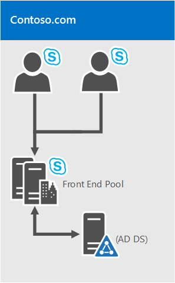

# <a name="system-requirements-for-skype-for-business-server-2019"></a><span data-ttu-id="5684b-104">For Business Server 2019 Skype 的系统要求</span><span class="sxs-lookup"><span data-stu-id="5684b-104">System requirements for Skype for Business Server 2019</span></span>
 
<span data-ttu-id="5684b-105">**摘要：** 准备要使用本主题为业务服务器 2019年安装 Skype。</span><span class="sxs-lookup"><span data-stu-id="5684b-105">**Summary:** Prepare to install Skype for Business Server 2019 with this topic.</span></span> <span data-ttu-id="5684b-106">下面介绍硬件、 操作系统、 软件、 数据库、 证书、 活动目录、 DNS 和 fileshares。</span><span class="sxs-lookup"><span data-stu-id="5684b-106">Hardware, OS, software, databases, certificates, Active Diretory, DNS, and fileshares are covered here.</span></span> <span data-ttu-id="5684b-107">所有的系统要求和建议的此处帮助确保成功安装和部署服务器场。</span><span class="sxs-lookup"><span data-stu-id="5684b-107">All the system requirements and recommendations are here to help ensure a successful install and deployment of your server farm.</span></span>
  
<span data-ttu-id="5684b-108">如预期的那样，有一些进行准备开始部署业务服务器 2019 Skype 之前。</span><span class="sxs-lookup"><span data-stu-id="5684b-108">As you might expect, there are some preparations to make before you begin deploying Skype for Business Server 2019.</span></span> <span data-ttu-id="5684b-109">本文将指导你制定以下规划：</span><span class="sxs-lookup"><span data-stu-id="5684b-109">This article will walk you through planning for the following:</span></span>
  
- [<span data-ttu-id="5684b-110">硬件</span><span class="sxs-lookup"><span data-stu-id="5684b-110">Hardware</span></span>](system-requirements.md#Hardware)
  
- [<span data-ttu-id="5684b-111">操作系统</span><span class="sxs-lookup"><span data-stu-id="5684b-111">Operating systems</span></span>](system-requirements.md#OS)
  
- [<span data-ttu-id="5684b-112">软件</span><span class="sxs-lookup"><span data-stu-id="5684b-112">Software</span></span>](system-requirements.md#Software)

- [<span data-ttu-id="5684b-113">后端 SQL 数据库</span><span class="sxs-lookup"><span data-stu-id="5684b-113">Back end SQL databases</span></span>](system-requirements.md#DBs)
  
- [<span data-ttu-id="5684b-114">Active Directory</span><span class="sxs-lookup"><span data-stu-id="5684b-114">Active Directory</span></span>](system-requirements.md#AD)
  
- [<span data-ttu-id="5684b-115">域名系统 (DNS)</span><span class="sxs-lookup"><span data-stu-id="5684b-115">Domain Name System (DNS)</span></span>](system-requirements.md#DNS)
  
- [<span data-ttu-id="5684b-116">证书</span><span class="sxs-lookup"><span data-stu-id="5684b-116">Certificates</span></span>](system-requirements.md#Certs)
  
- [<span data-ttu-id="5684b-117">文件共享</span><span class="sxs-lookup"><span data-stu-id="5684b-117">File Share</span></span>](system-requirements.md#Fileshare)

  
## <a name="hardware-for-skype-for-business-server-2019"></a><span data-ttu-id="5684b-118">为业务服务器 2019 Skype 的硬件</span><span class="sxs-lookup"><span data-stu-id="5684b-118">Hardware for Skype for Business Server 2019</span></span>
<span data-ttu-id="5684b-119"><a name="Hardware"> </a></span><span class="sxs-lookup"><span data-stu-id="5684b-119"></span></span>

<span data-ttu-id="5684b-120">您必须向下您的拓扑 （并且否则，您可以签出[的业务服务器 2019年的 Skype 拓扑基础知识](../../SfbServer/plan-your-deployment/topology-basics/topology-basics.md)主题） 后，它具有时间考虑服务器。</span><span class="sxs-lookup"><span data-stu-id="5684b-120">After you have your topology down (and if you don't, you can check out the [Topology Basics for Skype for Business Server 2019](../../SfbServer/plan-your-deployment/topology-basics/topology-basics.md) topic), it's time to think about servers.</span></span> <span data-ttu-id="5684b-121">Skype 业务服务器 2019年服务器要求使用 64 位硬件。</span><span class="sxs-lookup"><span data-stu-id="5684b-121">Skype for Business Server 2019 servers require 64-bit hardware.</span></span> <span data-ttu-id="5684b-122">下面给出了我们的硬件建议。</span><span class="sxs-lookup"><span data-stu-id="5684b-122">Our recommendations for hardware are below.</span></span> <span data-ttu-id="5684b-123">这些不要求，但它们反映所必需的最佳性能的要求。</span><span class="sxs-lookup"><span data-stu-id="5684b-123">These aren't requirements, but they reflect the requirements necessary for optimal performance.</span></span> <span data-ttu-id="5684b-124">我们的容量规划文档可帮助你根据自己的环境确定是否需要高于此要求的配置。</span><span class="sxs-lookup"><span data-stu-id="5684b-124">We have capacity planning documentation that will help you determine if you need more than this, depending on your circumstances.</span></span>
  
<span data-ttu-id="5684b-125">对于 Standard Edition 服务器的推荐的硬件配置：</span><span class="sxs-lookup"><span data-stu-id="5684b-125">Recommended hardware for Standard Edition servers:</span></span>

|<span data-ttu-id="5684b-126">**硬件组件**</span><span class="sxs-lookup"><span data-stu-id="5684b-126">**Hardware component**</span></span>|<span data-ttu-id="5684b-127">**推荐**</span><span class="sxs-lookup"><span data-stu-id="5684b-127">**Recommended**</span></span>|
|:-----|:-----|
|<span data-ttu-id="5684b-128">CPU</span><span class="sxs-lookup"><span data-stu-id="5684b-128">CPU</span></span>  <br/> |<span data-ttu-id="5684b-129">Intel Xeon E5 2673 v3 双处理器、 6 核 2.4 ghz 或更高版本。</span><span class="sxs-lookup"><span data-stu-id="5684b-129">Intel Xeon E5-2673 v3 dual processor, 6-core, 2.4 gigahertz (GHz) or higher.</span></span>  <br/> <span data-ttu-id="5684b-130">Intel Itanium 处理器不支持 Skype 业务服务器 2019年角色。</span><span class="sxs-lookup"><span data-stu-id="5684b-130">Intel Itanium processors are not supported for Skype for Business Server 2019 roles.</span></span>  <br/> |
|<span data-ttu-id="5684b-131">内存</span><span class="sxs-lookup"><span data-stu-id="5684b-131">Memory</span></span>  <br/> |<span data-ttu-id="5684b-132">32 GB。</span><span class="sxs-lookup"><span data-stu-id="5684b-132">32 gigabytes (GB).</span></span>  <br/> |
|<span data-ttu-id="5684b-133">磁盘</span><span class="sxs-lookup"><span data-stu-id="5684b-133">Disk</span></span>  <br/> |<span data-ttu-id="5684b-134">以下之一：</span><span class="sxs-lookup"><span data-stu-id="5684b-134">EITHER:</span></span>  <br/> <span data-ttu-id="5684b-135">• 8 块或更多 10000 RPM 硬盘，至少 72 GB 可用磁盘空间（2 块磁盘使用 RAID 1，6 块磁盘使用 RAID 10）。</span><span class="sxs-lookup"><span data-stu-id="5684b-135">• 8 or more 10000 RPM hard disk drives with at least 72 GB free disk space (two of the disks using RAID 1 and 6 using RAID 10).</span></span>  <br/> <span data-ttu-id="5684b-136">或</span><span class="sxs-lookup"><span data-stu-id="5684b-136">OR</span></span>  <br/> <span data-ttu-id="5684b-137">• 能够提供与 8 块 10000 RPM 机械硬盘相同的可用空间和类似性能的固态硬盘 (SSD)。</span><span class="sxs-lookup"><span data-stu-id="5684b-137">• Solid state drives (SSDs) able to provide the same free space and similar performance to 8 10000 RPM mechanical disk drives.</span></span>  <br/> |
|<span data-ttu-id="5684b-138">网络</span><span class="sxs-lookup"><span data-stu-id="5684b-138">Network</span></span>  <br/> |<span data-ttu-id="5684b-139">1 个双端口网络适配器，1 Gbps 或更高（可使用 2 个网络适配器，但需要通过一个 MAC 地址和一个 IP 地址配合使用）。</span><span class="sxs-lookup"><span data-stu-id="5684b-139">1 dual-port network adapter, 1 Gbps or higher (2 network adapters can be used, but they need to be teamed with a single MAC address and a single IP address).</span></span>  <br/> <span data-ttu-id="5684b-140">双处理器或多宿主配置是**不**支持前端服务器、 后端服务器，和 Standard Edition 服务器。</span><span class="sxs-lookup"><span data-stu-id="5684b-140">Dual or multi-homed configurations are **not** supported for Front End Servers, Back End Servers, and Standard Edition servers.</span></span> <br/> <span data-ttu-id="5684b-141">只要它们不公开给操作系统，并且正在使用监视和管理服务器硬件，您可以通过带管理系统，如 DRAC 或 ILO。</span><span class="sxs-lookup"><span data-stu-id="5684b-141">As long as they are not exposed to the operating system and are being used to monitor and manage server hardware, you can have out-of-band management systems, such as DRAC or ILO.</span></span> <span data-ttu-id="5684b-142">这种情况不会形成多宿主服务器，并且受支持。</span><span class="sxs-lookup"><span data-stu-id="5684b-142">This scenario doesn't constitute a multi-homed server, and it is supported.</span></span>  <br/> |


<span data-ttu-id="5684b-143">前端服务器和后端服务器的推荐的硬件：</span><span class="sxs-lookup"><span data-stu-id="5684b-143">Recommended hardware for Front End Servers and Back End Servers:</span></span>
  
|<span data-ttu-id="5684b-144">**硬件组件**</span><span class="sxs-lookup"><span data-stu-id="5684b-144">**Hardware component**</span></span>|<span data-ttu-id="5684b-145">**推荐**</span><span class="sxs-lookup"><span data-stu-id="5684b-145">**Recommended**</span></span>|
|:-----|:-----|
|<span data-ttu-id="5684b-146">CPU</span><span class="sxs-lookup"><span data-stu-id="5684b-146">CPU</span></span>  <br/> |<span data-ttu-id="5684b-147">Intel Xeon E5 2673 v3 双处理器、 6 核 2.4 ghz 或更高版本。</span><span class="sxs-lookup"><span data-stu-id="5684b-147">Intel Xeon E5-2673 v3 dual processor, 6-core, 2.4 gigahertz (GHz) or higher.</span></span> <br/> <span data-ttu-id="5684b-148">Intel Itanium 处理器不支持 Skype 业务服务器 2019年角色。</span><span class="sxs-lookup"><span data-stu-id="5684b-148">Intel Itanium processors are not supported for Skype for Business Server 2019 roles.</span></span>  <br/> |
|<span data-ttu-id="5684b-149">内存</span><span class="sxs-lookup"><span data-stu-id="5684b-149">Memory</span></span>  <br/> |<span data-ttu-id="5684b-150">64 千兆字节 (GB)。</span><span class="sxs-lookup"><span data-stu-id="5684b-150">64 gigabytes (GB).</span></span>  <br/> |
|<span data-ttu-id="5684b-151">磁盘</span><span class="sxs-lookup"><span data-stu-id="5684b-151">Disk</span></span>  <br/> |<span data-ttu-id="5684b-152">以下之一：</span><span class="sxs-lookup"><span data-stu-id="5684b-152">EITHER:</span></span>  <br/> <span data-ttu-id="5684b-153">• 8 块或更多 10000 RPM 硬盘，至少 72 GB 可用磁盘空间（2 块磁盘使用 RAID 1，6 块磁盘使用 RAID 10）。</span><span class="sxs-lookup"><span data-stu-id="5684b-153">• 8 or more 10000 RPM hard disk drives with at least 72 GB free disk space (two of the disks using RAID 1 and 6 using RAID 10).</span></span>  <br/> <span data-ttu-id="5684b-154">或</span><span class="sxs-lookup"><span data-stu-id="5684b-154">OR</span></span>  <br/> <span data-ttu-id="5684b-155">• 能够提供与 8 块 10000 RPM 机械硬盘相同的可用空间和类似性能的固态硬盘 (SSD)。</span><span class="sxs-lookup"><span data-stu-id="5684b-155">• Solid state drives (SSDs) able to provide the same free space and similar performance to 8 10000 RPM mechanical disk drives.</span></span>  <br/> |
|<span data-ttu-id="5684b-156">网络</span><span class="sxs-lookup"><span data-stu-id="5684b-156">Network</span></span>  <br/> |<span data-ttu-id="5684b-157">1 个双端口网络适配器，1 Gbps 或更高（可使用 2 个网络适配器，但需要通过一个 MAC 地址和一个 IP 地址配合使用）。</span><span class="sxs-lookup"><span data-stu-id="5684b-157">1 dual-port network adapter, 1 Gbps or higher (2 network adapters can be used, but they need to be teamed with a single MAC address and a single IP address).</span></span>  <br/> <span data-ttu-id="5684b-158">双处理器或多宿主配置是**不**支持前端服务器、 后端服务器，和 Standard Edition 服务器。</span><span class="sxs-lookup"><span data-stu-id="5684b-158">Dual or multi-homed configurations are **not** supported for Front End Servers, Back End Servers, and Standard Edition servers.</span></span> <br/> <span data-ttu-id="5684b-159">只要它们不公开给操作系统，并且正在使用监视和管理服务器硬件，您可以通过带管理系统，如 DRAC 或 ILO。</span><span class="sxs-lookup"><span data-stu-id="5684b-159">As long as they are not exposed to the operating system and are being used to monitor and manage server hardware, you can have out-of-band management systems, such as DRAC or ILO.</span></span> <span data-ttu-id="5684b-160">这种情况不会形成多宿主服务器，并且受支持。</span><span class="sxs-lookup"><span data-stu-id="5684b-160">This scenario doesn't constitute a multi-homed server, and it is supported.</span></span>  <br/> |
   
<span data-ttu-id="5684b-161">建议的边缘服务器、 独立中介服务器和控制器的硬件：</span><span class="sxs-lookup"><span data-stu-id="5684b-161">Recommended hardware for Edge Servers, standalone Mediation Servers, and Directors:</span></span>
  
|<span data-ttu-id="5684b-162">**硬件组件**</span><span class="sxs-lookup"><span data-stu-id="5684b-162">**Hardware component**</span></span>|<span data-ttu-id="5684b-163">**推荐**</span><span class="sxs-lookup"><span data-stu-id="5684b-163">**Recommended**</span></span>|
|:-----|:-----|
|<span data-ttu-id="5684b-164">CPU</span><span class="sxs-lookup"><span data-stu-id="5684b-164">CPU</span></span>  <br/> |<span data-ttu-id="5684b-165">Intel Xeon E5 2673 v3 双处理器、 6 核 2.4 ghz 或更高版本。</span><span class="sxs-lookup"><span data-stu-id="5684b-165">Intel Xeon E5-2673 v3 dual processor, 6-core, 2.4 gigahertz (GHz) or higher.</span></span>  <br/> <span data-ttu-id="5684b-166">Intel Itanium 处理器不支持 Skype 业务服务器 2019年角色。</span><span class="sxs-lookup"><span data-stu-id="5684b-166">Intel Itanium processors are not supported for Skype for Business Server 2019 roles.</span></span>  <br/> |
|<span data-ttu-id="5684b-167">内存</span><span class="sxs-lookup"><span data-stu-id="5684b-167">Memory</span></span>  <br/> |<span data-ttu-id="5684b-168">32 千兆字节。</span><span class="sxs-lookup"><span data-stu-id="5684b-168">32 gigabytes.</span></span>  <br/> |
|<span data-ttu-id="5684b-169">磁盘</span><span class="sxs-lookup"><span data-stu-id="5684b-169">Disk</span></span>  <br/> |<span data-ttu-id="5684b-170">以下之一：</span><span class="sxs-lookup"><span data-stu-id="5684b-170">EITHER:</span></span>  <br/> <span data-ttu-id="5684b-171">• 4 块或更多 10000 RPM 硬盘，至少 72 GB 可用磁盘空间（磁盘应采用双 RAID 1 配置）。</span><span class="sxs-lookup"><span data-stu-id="5684b-171">• 4 or more 10000 RPM hard disk drives with at least 72 GB free disk space (the disks should be in a 2x RAID 1 configuration).</span></span>  <br/> <span data-ttu-id="5684b-172">或</span><span class="sxs-lookup"><span data-stu-id="5684b-172">OR</span></span>  <br/> <span data-ttu-id="5684b-173">• 能够提供与 4 块 10000 RPM 机械硬盘相同的可用空间和类似性能的固态硬盘 (SSD)。</span><span class="sxs-lookup"><span data-stu-id="5684b-173">• Solid state drives (SSDs) able to provide the same free space and similar performance to 4 10000 RPM mechanical disk drives.</span></span>  <br/> |
|<span data-ttu-id="5684b-174">网络</span><span class="sxs-lookup"><span data-stu-id="5684b-174">Network</span></span>  <br/> |<span data-ttu-id="5684b-175">1 个双端口网络适配器，1 Gbps 或更高（可使用 2 个网络适配器，但需要通过一个 MAC 地址和一个 IP 地址配合使用）。</span><span class="sxs-lookup"><span data-stu-id="5684b-175">1 dual-port network adapter, 1 Gbps or higher (2 network adapters can be used, but they need to be teamed with a single MAC address and a single IP address).</span></span>  <br/> <span data-ttu-id="5684b-176">双处理器或多宿主配置是**不**支持视频互操作服务器和控制器。</span><span class="sxs-lookup"><span data-stu-id="5684b-176">Dual or multi-homed configurations are **not** supported for Video Interop Servers and Directors.</span></span> <br/> <span data-ttu-id="5684b-177">边缘服务器需要两个网络接口，均为双端口网络适配器、1 Gbps 或更高速度（或两个成对网络适配器，总计 4 个适配器，每一对均与单一 MAC 地址和单一 IP 地址配合使用，总共两对）。</span><span class="sxs-lookup"><span data-stu-id="5684b-177">Edge servers will require two network interfaces that are dual-port network adapters, 1 Gbps or higher (or two paired network adapters, for a total of four, each pair being teamed with a single MAC address and a single IP address, for a total of two pairs).</span></span>  <br/> <span data-ttu-id="5684b-178">在独立中介服务器，支持的其他网络接口卡 (Nic) 以允许的特定 PSTN IP 地址配置安装。</span><span class="sxs-lookup"><span data-stu-id="5684b-178">On standalone Mediation Servers, the installation of additional network interface cards (NICs) to allow the configuration of a specific PSTN IP address is supported.</span></span>  <br/> |


> [!NOTE]
> <span data-ttu-id="5684b-179">无论服务器角色，我们还建议的业务服务器 2019 Skype 的以下硬件设置 (这可能有所不同，具体取决于您已购买，这样的硬件的品牌请参考细节的制造商文档):</span><span class="sxs-lookup"><span data-stu-id="5684b-179">Regardless of the server role, we also recommend the following hardware settings for Skype for Business Server 2019 (this may vary depending on the brand of hardware you've purchased, so please refer to manufacturer documentation for specifics):</span></span>
> - <span data-ttu-id="5684b-180">单层从 NUMA BIOS config-应设置为。</span><span class="sxs-lookup"><span data-stu-id="5684b-180">BIOS config - should be set to FLAT from NUMA.</span></span>
> - <span data-ttu-id="5684b-181">启用超线程。</span><span class="sxs-lookup"><span data-stu-id="5684b-181">Enable Hyperthreading.</span></span>
> - <span data-ttu-id="5684b-182">RSS 队列设置应设置为 8 的队列。</span><span class="sxs-lookup"><span data-stu-id="5684b-182">The RSS queue setting should be set to 8 queue.</span></span>

   
## <a name="operating-systems-for-skype-for-business-server-2019"></a><span data-ttu-id="5684b-183">为业务服务器 2019 Skype 的操作系统</span><span class="sxs-lookup"><span data-stu-id="5684b-183">Operating systems for Skype for Business Server 2019</span></span>
<span data-ttu-id="5684b-184"><a name="OS"> </a></span><span class="sxs-lookup"><span data-stu-id="5684b-184"></span></span>

<span data-ttu-id="5684b-185">就地硬件后，您将需要对安装操作系统 (OS) 使您可以安装和使用业务服务器 2019 Skype 成功。</span><span class="sxs-lookup"><span data-stu-id="5684b-185">After you have the hardware in place, you'll need to the install operating system (OS) that will allow you to install and successfully use Skype for Business Server 2019.</span></span>
  
|||
|:-----|:-----|
|<span data-ttu-id="5684b-186">Windows Server 2019</span><span class="sxs-lookup"><span data-stu-id="5684b-186">Windows Server 2019</span></span> <br/> |
|<span data-ttu-id="5684b-187">Windows Server 2016</span><span class="sxs-lookup"><span data-stu-id="5684b-187">Windows Server 2016</span></span> <br/> ||
||
   
<span data-ttu-id="5684b-188">除了下面列出的操作系统不会处理正确; 的内容请不尝试使用它的 Skype 安装的业务服务器 2019年。</span><span class="sxs-lookup"><span data-stu-id="5684b-188">Anything other than the operating systems listed here won't work properly; please don't try it for installs of Skype for Business Server 2019.</span></span>

> [!NOTE]
> 
> <span data-ttu-id="5684b-189">如果您在 Windows Server 2019 计算机上安装 Windows 管理员中心 2019年，它将提示您输入侦听的端口。</span><span class="sxs-lookup"><span data-stu-id="5684b-189">If you are installing Windows Admin Center 2019 on your Windows Server 2019 machine, it will prompt you for a port to listen on.</span></span> <span data-ttu-id="5684b-190">您可以选择端口 443，liklihood，但如果该计算机的业务服务器 2019 上，安装具有 Skype，或者是要在其上安装的业务服务器 2019年具有 Skype，则必须选择不同的端口号。</span><span class="sxs-lookup"><span data-stu-id="5684b-190">There's a liklihood you might choose port 443, but if that machine has Skype for Business Server 2019 installed on it, or is going to have Skype for Business Server 2019 installed on it, then you must choose a different port number.</span></span>
> 
><span data-ttu-id="5684b-191">为什么是这种情况？</span><span class="sxs-lookup"><span data-stu-id="5684b-191">Why is this the case?</span></span> <span data-ttu-id="5684b-192">如果在端口 443 上正在运行 Windows 管理员中心 2019年，您将无法连接到服务器的业务控制面板中，使用 Skype 也能够连接到任何 （通讯簿 Web 服务的服务器上运行的内部 web 服务自动发现服务、 WebTicket 服务等)。</span><span class="sxs-lookup"><span data-stu-id="5684b-192">If Windows Admin Center 2019 is running on port 443, you will not be able to connect to the server using the Skype for Business Control Panel, nor will you be able to connect to any internal web service running on the server (Address Book Web Service, Autodiscover Service, WebTicket Service, etc).</span></span>  <span data-ttu-id="5684b-193">实际上，您将无法连接到任何内部 Web 服务 URL。</span><span class="sxs-lookup"><span data-stu-id="5684b-193">In fact, you will not be able to connect to any Internal Web Service URL.</span></span> <span data-ttu-id="5684b-194">请在事件需要或的业务服务器 2019年放置 Skype 与服务器上的 Windows 管理员中心 2019年，选择不同的端口。</span><span class="sxs-lookup"><span data-stu-id="5684b-194">Please choose a different port, in the event you need or want to put Windows Admin Center 2019 on a server with Skype for Business Server 2019.</span></span>
> 

  
## <a name="software-that-should-be-installed-before-a-skype-for-business-server-2019-deployment"></a><span data-ttu-id="5684b-195">应在业务服务器 2019年部署 Skype 之前安装的软件</span><span class="sxs-lookup"><span data-stu-id="5684b-195">Software that should be installed before a Skype for Business Server 2019 deployment</span></span>
<span data-ttu-id="5684b-196"><a name="Software"> </a></span><span class="sxs-lookup"><span data-stu-id="5684b-196"></span></span>

<span data-ttu-id="5684b-197">有一些事项是，您将需要安装或运行业务服务器 2019 Skype 任何服务器的配置。</span><span class="sxs-lookup"><span data-stu-id="5684b-197">There are some things you're going to need to install or configure for any server running Skype for Business Server 2019.</span></span> <span data-ttu-id="5684b-198">这些如下所示后, 跟特定服务器角色的其他要求。</span><span class="sxs-lookup"><span data-stu-id="5684b-198">These are listed below, followed by additional requirements for specific server roles.</span></span>
  
 <span data-ttu-id="5684b-199">**所有服务器：**</span><span class="sxs-lookup"><span data-stu-id="5684b-199">**All servers:**</span></span>
  
|<span data-ttu-id="5684b-200">**软件/角色**</span><span class="sxs-lookup"><span data-stu-id="5684b-200">**Software/role**</span></span>|<span data-ttu-id="5684b-201">**详细信息**</span><span class="sxs-lookup"><span data-stu-id="5684b-201">**Details**</span></span>|
|:-----|:-----|
|<span data-ttu-id="5684b-202">Windows PowerShell 3.0</span><span class="sxs-lookup"><span data-stu-id="5684b-202">Windows PowerShell 3.0</span></span>  <br/> |<span data-ttu-id="5684b-203">为业务 Server 服务器的所有 Skype 都需要安装的 Windows PowerShell 3.0。</span><span class="sxs-lookup"><span data-stu-id="5684b-203">All Skype for Business Server servers need Windows PowerShell 3.0 installed.</span></span>  <br/> <span data-ttu-id="5684b-204">• 这应与 Windows Server 2016 的默认情况下安装。</span><span class="sxs-lookup"><span data-stu-id="5684b-204">• This should be installed by default with Windows Server 2016.</span></span><br/> |
|<span data-ttu-id="5684b-205">Microsoft .NET Framework</span><span class="sxs-lookup"><span data-stu-id="5684b-205">Microsoft .NET Framework</span></span>  <br/> |<span data-ttu-id="5684b-206">WCF 服务是一项**功能**已安装作为 Windows 功能，在**服务器管理器**下没有所需的下载。</span><span class="sxs-lookup"><span data-stu-id="5684b-206">WCF services is a **Feature** that's installed as a Windows feature, under **Server Manager**, no downloads needed.</span></span> <br/> <span data-ttu-id="5684b-207">• 所需安装此功能，或者如果它已经安装并正在对其，检查的**HTTP 激活**选项还会检查和安装，以确保，如下所示：</span><span class="sxs-lookup"><span data-stu-id="5684b-207">• You need to make sure, when you install this feature, or if it's already installed and you're checking on it, that the **HTTP Activation** option is also checked and installed, like so:</span></span> <br/> <span data-ttu-id="5684b-208"></span><span class="sxs-lookup"><span data-stu-id="5684b-208"></span></span> <br/> <span data-ttu-id="5684b-209">如果您看到另一则弹出信息，表示要安装“HTTP 激活”，还需要安装其他某些功能，请不必担心。</span><span class="sxs-lookup"><span data-stu-id="5684b-209">Don't worry if you get an additional pop-up saying some other things need to be installed for HTTP Activation to be installed.</span></span> <span data-ttu-id="5684b-210">这是正常;单击确定，然后继续操作。</span><span class="sxs-lookup"><span data-stu-id="5684b-210">That's normal; click OK and go ahead.</span></span> <span data-ttu-id="5684b-211">如果您没有获得此弹出，您可以假定这些操作已安装并继续操作。</span><span class="sxs-lookup"><span data-stu-id="5684b-211">If you don't get this pop-up, you can assume those things are already installed and go ahead.</span></span>  <br/> <span data-ttu-id="5684b-212">安装 Windows Server 2016 时，通常安装 Microsoft.NET Framework。</span><span class="sxs-lookup"><span data-stu-id="5684b-212">Microsoft .NET Framework is usually installed when Windows Server 2016 is installed.</span></span> <span data-ttu-id="5684b-213">Skype 业务 server 适用于以下的 Microsoft.NET Framework 版本：</span><span class="sxs-lookup"><span data-stu-id="5684b-213">Skype for Business Server works with the following Microsoft .NET Framework versions:</span></span>  <br/> <span data-ttu-id="5684b-214">•.NET 3.5</span><span class="sxs-lookup"><span data-stu-id="5684b-214">• .NET 3.5</span></span>  <br/> <span data-ttu-id="5684b-215">•.NET 4.5</span><span class="sxs-lookup"><span data-stu-id="5684b-215">• .NET 4.5</span></span>  <br/> <span data-ttu-id="5684b-216">•.NET 4.6.x</span><span class="sxs-lookup"><span data-stu-id="5684b-216">• .NET 4.6.x</span></span>  <br/> <span data-ttu-id="5684b-217">•.NET 4.7</span><span class="sxs-lookup"><span data-stu-id="5684b-217">• .NET 4.7</span></span> <br/> |
|<span data-ttu-id="5684b-218">媒体基础</span><span class="sxs-lookup"><span data-stu-id="5684b-218">Media Foundation</span></span>  <br/> |<span data-ttu-id="5684b-219">对于 Windows Server 2016 Windows Media Format Runtime 安装 Microsoft 媒体基础。</span><span class="sxs-lookup"><span data-stu-id="5684b-219">For Windows Server 2016, the Windows Media Format Runtime installs with Microsoft Media Foundation.</span></span>  <br/> <span data-ttu-id="5684b-220">用于会议的所有前端服务器和 Standard Edition 服务器需要 Windows Media Format Runtime，若要运行的 Windows Media 音频 (.wma) 文件的呼叫寄存、 通知和响应组应用程序播放通知和保持音乐。</span><span class="sxs-lookup"><span data-stu-id="5684b-220">All Front End Servers and Standard Edition servers used for conferencing require Windows Media Format Runtime to run the Windows Media Audio (.wma) files that the Call Park, Announcement, and Response Group applications play for announcements and music.</span></span>  <br/> |
|<span data-ttu-id="5684b-221">Windows Identity Foundation</span><span class="sxs-lookup"><span data-stu-id="5684b-221">Windows Identity Foundation</span></span>  <br/> |<span data-ttu-id="5684b-222">我们需要 Windows Identity Foundation 3.5 对业务服务器 2019 Skype 支持服务器到服务器身份验证方案。</span><span class="sxs-lookup"><span data-stu-id="5684b-222">We need Windows Identity Foundation 3.5 to support server-to-server authentication scenarios for Skype for Business Server 2019.</span></span>  <br/> <span data-ttu-id="5684b-223">？ 对于 Windows Server 2016 没有不需要下载任何内容。</span><span class="sxs-lookup"><span data-stu-id="5684b-223">• For Windows Server 2016, there's no need to download anything.</span></span> <span data-ttu-id="5684b-224">打开**服务器管理器**，转到**添加角色和功能向导**。</span><span class="sxs-lookup"><span data-stu-id="5684b-224">Open **Server Manager**, and go to the **Add Roles and Features Wizard**.</span></span> <span data-ttu-id="5684b-225">**Windows Identity Foundation 3.5** 在**功能**部分列出。</span><span class="sxs-lookup"><span data-stu-id="5684b-225">**Windows Identity Foundation 3.5** is listed under the **Features** section.</span></span> <span data-ttu-id="5684b-226">如果选择它，您很好。</span><span class="sxs-lookup"><span data-stu-id="5684b-226">If it's selected, you're good.</span></span> <span data-ttu-id="5684b-227">否则为选择它，然后单击**下一步**到达**安装**按钮。</span><span class="sxs-lookup"><span data-stu-id="5684b-227">Otherwise select it and click **Next** to reach the **Install** button.</span></span> <br/> |
|<span data-ttu-id="5684b-228">远程服务器管理工具</span><span class="sxs-lookup"><span data-stu-id="5684b-228">Remote Server Administration Tools</span></span>  <br/> |<span data-ttu-id="5684b-229">角色管理工具：AD DS 和 AD LDS 工具</span><span class="sxs-lookup"><span data-stu-id="5684b-229">Role Administration Tools: AD DS and AD LDS tools</span></span>  <br/> |
   
 <span data-ttu-id="5684b-230">**前端服务器和 Standard Edition server 还需要：**</span><span class="sxs-lookup"><span data-stu-id="5684b-230">**Front End Servers and Standard Edition server also need:**</span></span>
  
|<span data-ttu-id="5684b-231">**软件/角色**</span><span class="sxs-lookup"><span data-stu-id="5684b-231">**Software/role**</span></span>|<span data-ttu-id="5684b-232">**详细信息**</span><span class="sxs-lookup"><span data-stu-id="5684b-232">**Details**</span></span>|
|:-----|:-----|
|<span data-ttu-id="5684b-233">Internet Information Services (IIS)</span><span class="sxs-lookup"><span data-stu-id="5684b-233">Internet Information Services (IIS)</span></span>  <br/> |<span data-ttu-id="5684b-234">IIS 的以下模块选择需要的所有前端服务器，以及所有 Standard Edition server 上：</span><span class="sxs-lookup"><span data-stu-id="5684b-234">IIS is needed on all Front End Servers, as well as all Standard Edition servers, with the following modules selected:</span></span>  <br/> <span data-ttu-id="5684b-235">• 常见 HTTP 功能： 默认文档，HTTP 错误静态内容</span><span class="sxs-lookup"><span data-stu-id="5684b-235">• Common HTTP Features: Default Document, HTTP Errors, Static Content</span></span>  <br/> <span data-ttu-id="5684b-236">• 运行状况和诊断： HTTP 日志记录，日志记录工具，跟踪</span><span class="sxs-lookup"><span data-stu-id="5684b-236">• Health and Diagnostics: HTTP Logging, Logging Tools, Tracing</span></span>  <br/> <span data-ttu-id="5684b-237">• 性能： 静态内容压缩、 动态内容压缩</span><span class="sxs-lookup"><span data-stu-id="5684b-237">• Performance: Static Content Compression, Dynamic Content Compression</span></span>  <br/> <span data-ttu-id="5684b-238">• 安全： 请求筛选、 客户端证书映射身份验证、 Windows 身份验证</span><span class="sxs-lookup"><span data-stu-id="5684b-238">• Security: Request Filtering, Client Certificate Mapping Authentication, Windows Authentication</span></span>  <br/> <span data-ttu-id="5684b-239">• 应用程序开发：.NET 扩展性 3.5、.NET 扩展性 4.5、 ASP.NET 3.5、 ASP.NET 4.5，ISAPI 扩展 ISAPI 筛选器</span><span class="sxs-lookup"><span data-stu-id="5684b-239">• Application Development: .NET Extensibility 3.5, .NET Extensibility 4.5, ASP.NET 3.5, ASP.NET 4.5, ISAPI Extensions, ISAPI Filters</span></span>  <br/> <span data-ttu-id="5684b-240">• 管理工具： IIS 管理控制台、 IIS 管理脚本和工具</span><span class="sxs-lookup"><span data-stu-id="5684b-240">• Management Tools: IIS Management Console, IIS Management Scripts and Tools</span></span>  <br/> <span data-ttu-id="5684b-241">请注意，还需要匿名访问，但在您安装 IIS，以便您无需在列表中选择一个位置时，会看到的。</span><span class="sxs-lookup"><span data-stu-id="5684b-241">Note that Anonymous Access is also needed, but you get that when you install IIS, so you don't have a place to select it on the list.</span></span>  <br/> |
|<span data-ttu-id="5684b-242">Windows Media Format Runtime</span><span class="sxs-lookup"><span data-stu-id="5684b-242">Windows Media Format Runtime</span></span>  <br/> | <span data-ttu-id="5684b-243">Windows Server 2016，您需要在**服务器管理器**中安装**媒体 Foundation**功能。</span><span class="sxs-lookup"><span data-stu-id="5684b-243">For Windows Server 2016, you'll need to install the **Media Foundation** feature in **Server Manager**.</span></span> <span data-ttu-id="5684b-244">实际可以开始业务服务器 2019年安装没有它，您 Skype 但系统将提示您安装它，然后重新启动服务器，业务服务器 2019年 Skype 之前安装继续。</span><span class="sxs-lookup"><span data-stu-id="5684b-244">You actually can start your Skype for Business Server 2019 installation without this, but you'll be prompted to install it, and then reboot the server, before the Skype for Business Server 2019 install continues.</span></span> <span data-ttu-id="5684b-245">最好不要提早制定。</span><span class="sxs-lookup"><span data-stu-id="5684b-245">It's better to do it ahead of time.</span></span> <br/> |
|<span data-ttu-id="5684b-246">Silverlight</span><span class="sxs-lookup"><span data-stu-id="5684b-246">Silverlight</span></span>  <br/> |<span data-ttu-id="5684b-247">您可以安装最新版本的 Silverlight[此处](https://www.microsoft.com/silverlight/)。</span><span class="sxs-lookup"><span data-stu-id="5684b-247">You can install the latest version of Silverlight [here](https://www.microsoft.com/silverlight/).</span></span>  <br/> |
   
<span data-ttu-id="5684b-248">为帮助您了解相关过程，我们提供了一个示例 PowerShell 脚本，您可以运行此脚本以自动执行此流程：</span><span class="sxs-lookup"><span data-stu-id="5684b-248">To help you out, here's a sample PowerShell script you can run to automate this:</span></span>
  
```
Add-WindowsFeature RSAT-ADDS, Web-Server, Web-Static-Content, Web-Default-Doc, Web-Http-Errors, Web-Asp-Net, Web-Net-Ext, Web-ISAPI-Ext, Web-ISAPI-Filter, Web-Http-Logging, Web-Log-Libraries, Web-Request-Monitor, Web-Http-Tracing, Web-Basic-Auth, Web-Windows-Auth, Web-Client-Auth, Web-Filtering, Web-Stat-Compression, Web-Dyn-Compression, NET-WCF-HTTP-Activation45, Web-Asp-Net45, Web-Mgmt-Tools, Web-Scripting-Tools, Web-Mgmt-Compat, Server-Media-Foundation, Telnet-Client
```

 <span data-ttu-id="5684b-249">**控制器还需要：**</span><span class="sxs-lookup"><span data-stu-id="5684b-249">**Directors also need:**</span></span>
  
<span data-ttu-id="5684b-250">IIS，选择以下模块：</span><span class="sxs-lookup"><span data-stu-id="5684b-250">IIS, with the following modules selected:</span></span>
  
- <span data-ttu-id="5684b-251">常见的 HTTP 功能</span><span class="sxs-lookup"><span data-stu-id="5684b-251">Common HTTP Features</span></span>
    
  - <span data-ttu-id="5684b-252">默认文档</span><span class="sxs-lookup"><span data-stu-id="5684b-252">Default Document</span></span>
    
  - <span data-ttu-id="5684b-253">HTTP 错误</span><span class="sxs-lookup"><span data-stu-id="5684b-253">HTTP Errors</span></span>
    
  - <span data-ttu-id="5684b-254">静态内容</span><span class="sxs-lookup"><span data-stu-id="5684b-254">Static Content</span></span>
    
- <span data-ttu-id="5684b-255">运行状况和诊断</span><span class="sxs-lookup"><span data-stu-id="5684b-255">Health and Diagnostics</span></span>
    
  - <span data-ttu-id="5684b-256">HTTP 日志记录</span><span class="sxs-lookup"><span data-stu-id="5684b-256">HTTP Logging</span></span>
    
  - <span data-ttu-id="5684b-257">日志记录工具</span><span class="sxs-lookup"><span data-stu-id="5684b-257">Logging Tools</span></span>
    
  - <span data-ttu-id="5684b-258">跟踪</span><span class="sxs-lookup"><span data-stu-id="5684b-258">Tracing</span></span>
    
- <span data-ttu-id="5684b-259">性能</span><span class="sxs-lookup"><span data-stu-id="5684b-259">Performance</span></span>
    
  - <span data-ttu-id="5684b-260">静态内容压缩</span><span class="sxs-lookup"><span data-stu-id="5684b-260">Static Content Compression</span></span>
    
- <span data-ttu-id="5684b-261">安全性</span><span class="sxs-lookup"><span data-stu-id="5684b-261">Security</span></span>
    
  - <span data-ttu-id="5684b-262">请求筛选</span><span class="sxs-lookup"><span data-stu-id="5684b-262">Request Filtering</span></span>
    
  - <span data-ttu-id="5684b-263">客户端证书映射身份验证</span><span class="sxs-lookup"><span data-stu-id="5684b-263">Client Certificate Mapping Authentication</span></span>
    
  - <span data-ttu-id="5684b-264">Windows 身份验证</span><span class="sxs-lookup"><span data-stu-id="5684b-264">Windows Authentication</span></span>
    
- <span data-ttu-id="5684b-265">应用程序开发</span><span class="sxs-lookup"><span data-stu-id="5684b-265">Application Development</span></span>
    
  - <span data-ttu-id="5684b-266">.NET Extensibility 3.5</span><span class="sxs-lookup"><span data-stu-id="5684b-266">.NET Extensibility 3.5</span></span>
    
  - <span data-ttu-id="5684b-267">.NET Extensibility 4.5</span><span class="sxs-lookup"><span data-stu-id="5684b-267">.NET Extensibility 4.5</span></span>
    
  - <span data-ttu-id="5684b-268">ASP.NET 3.5</span><span class="sxs-lookup"><span data-stu-id="5684b-268">ASP.NET 3.5</span></span>
    
  - <span data-ttu-id="5684b-269">ASP.NET 4.5</span><span class="sxs-lookup"><span data-stu-id="5684b-269">ASP.NET 4.5</span></span>
    
  - <span data-ttu-id="5684b-270">ISAPI 扩展</span><span class="sxs-lookup"><span data-stu-id="5684b-270">ISAPI Extension</span></span>
    
  - <span data-ttu-id="5684b-271">ISAPI 筛选器</span><span class="sxs-lookup"><span data-stu-id="5684b-271">ISAPI Filters</span></span>
    
<span data-ttu-id="5684b-272">（如果您想知道，它是设置为具有动态内容压缩的前端服务器和 Standard Edition 服务器相同模块和管理工具遗漏。）</span><span class="sxs-lookup"><span data-stu-id="5684b-272">(If you're wondering, it's the same module set as the Front End Servers and Standard Edition servers, with the Dynamic Content Compression and Management Tools left out.)</span></span>
  
<span data-ttu-id="5684b-273">我们还为此提供了以下一些 PowerShell 代码：</span><span class="sxs-lookup"><span data-stu-id="5684b-273">And we have some PowerShell code below for this too:</span></span>
  
```
Add-WindowsFeature RSAT-ADDS, Web-Server, Web-Static-Content, Web-Default-Doc, Web-Http-Errors, Web-Asp-Net, Web-Net-Ext, Web-ISAPI-Ext, Web-ISAPI-Filter, Web-Http-Logging, Web-Log-Libraries, Web-Request-Monitor, Web-Http-Tracing, Web-Basic-Auth, Web-Windows-Auth, Web-Client-Auth, Web-Filtering, Web-Stat-Compression, NET-WCF-HTTP-Activation45, Web-Asp-Net45, Web-Scripting-Tools, Web-Mgmt-Compat, Server-Media-Foundation, Telnet-Client
```

## <a name="back-end-databases-that-will-work-with-skype-for-business-server-2019"></a><span data-ttu-id="5684b-274">将用于业务服务器 2019 Skype 的后端数据库</span><span class="sxs-lookup"><span data-stu-id="5684b-274">Back end databases that will work with Skype for Business Server 2019</span></span>
<span data-ttu-id="5684b-275"><a name="DBs"> </a></span><span class="sxs-lookup"><span data-stu-id="5684b-275"></span></span>

<span data-ttu-id="5684b-276">安装时 Skype 对于业务 Server 2019 Standard Edition，您必须 SQL Server 2016 Express （64 位版本）。</span><span class="sxs-lookup"><span data-stu-id="5684b-276">When installing Skype for Business Server 2019 Standard Edition, you'll have SQL Server 2016 Express (64-bit edition).</span></span>

<span data-ttu-id="5684b-277">对于业务 Server 2019 Enterprise Edition 的 Skype 将需要完整的 SQL Server，，，如下所示 (仅 64 位版本; 请不要使用 32 位版本):</span><span class="sxs-lookup"><span data-stu-id="5684b-277">Skype for Business Server 2019 Enterprise Edition will require full SQL Server, as indicated below (only 64-bit edition; please don't use 32-bit editions):</span></span>
  
||||
|:-----|:-----|:-----|
|<span data-ttu-id="5684b-278">Microsoft SQL Server 2016 （64 位版本），并且您必须运行与最新的更新和 AlwaysOn 可用性组。</span><span class="sxs-lookup"><span data-stu-id="5684b-278">Microsoft SQL Server 2016 (64-bit edition), and you must run with the latest updates, and with AlwaysOn availability groups.</span></span>  <br/> ||
 |
   
<span data-ttu-id="5684b-279">如果您没有看到要使用此处列出的 SQL Server 版本，则无法使用它。</span><span class="sxs-lookup"><span data-stu-id="5684b-279">If you don't see the SQL Server edition you want to use listed here, you can't use it.</span></span>
  
> [!NOTE]
> <span data-ttu-id="5684b-280">您还需要安装监控服务器角色的 SQL Server Reporting Services。</span><span class="sxs-lookup"><span data-stu-id="5684b-280">You also need to install SQL Server Reporting Services for the Monitoring Server role.</span></span> 
  
### <a name="sql-clustering-and-sql-always-on"></a><span data-ttu-id="5684b-281">SQL 群集和 SQL 始终在</span><span class="sxs-lookup"><span data-stu-id="5684b-281">SQL Clustering, and SQL Always On</span></span>

<span data-ttu-id="5684b-282">支持与 Skype 的业务服务器 2019 SQL 群集。</span><span class="sxs-lookup"><span data-stu-id="5684b-282">SQL Clustering with Skype for Business Server 2019 is supported.</span></span> <span data-ttu-id="5684b-283">如果您想要设置 SQL 群集，完成在 SQL Server 中。</span><span class="sxs-lookup"><span data-stu-id="5684b-283">If you want to set up SQL Clustering, that's done in SQL Server.</span></span>
  
<span data-ttu-id="5684b-284">请确保您具有主动/被动配置 SQL 群集，这受支持。</span><span class="sxs-lookup"><span data-stu-id="5684b-284">Make sure you have an active/passive configuration for SQL Clustering, which is supported.</span></span> <span data-ttu-id="5684b-285">不与任何其他 SQL 实例共享被动节点。</span><span class="sxs-lookup"><span data-stu-id="5684b-285">Don't share the passive node with any other SQL instance.</span></span>
  
<span data-ttu-id="5684b-286">可以为故障转移群集采用以下配置：</span><span class="sxs-lookup"><span data-stu-id="5684b-286">You can have the following for failover clustering:</span></span>
  
<span data-ttu-id="5684b-287">双节点：</span><span class="sxs-lookup"><span data-stu-id="5684b-287">Two-node:</span></span>
  
- <span data-ttu-id="5684b-288">Microsoft SQL Server 2016 标准 （64 位版本），以及我们建议最新的 service pack 的运行。</span><span class="sxs-lookup"><span data-stu-id="5684b-288">Microsoft SQL Server 2016 Standard (64-bit edition), and we recommend running with the latest service pack.</span></span>
    
<span data-ttu-id="5684b-289">16 节点：</span><span class="sxs-lookup"><span data-stu-id="5684b-289">Sixteen-node:</span></span>
  
- <span data-ttu-id="5684b-290">Microsoft SQL Server 2016 企业版 （64 位版本），以及我们建议最新的 service pack 的运行。</span><span class="sxs-lookup"><span data-stu-id="5684b-290">Microsoft SQL Server 2016 Enterprise (64-bit edition), and we recommend running with the latest service pack.</span></span>
    
<span data-ttu-id="5684b-291">我们必须文章，配置 SQL Server 群集的 Skype 的业务服务器 2019，已获取就绪群集的步骤。</span><span class="sxs-lookup"><span data-stu-id="5684b-291">We'll have an article, Configure SQL Server clustering for Skype for Business Server 2019, that will have the steps for getting clustering ready.</span></span>
 
<span data-ttu-id="5684b-292">支持 SQL Always On，并且您可以阅读更多有关该产品中[的业务服务器 2019 Skype 后端服务器高可用性](../../SfbServer/plan-your-deployment/high-availability-and-disaster-recovery/back-end-server.md)。</span><span class="sxs-lookup"><span data-stu-id="5684b-292">SQL Always On is supported, and you can read more about it in [Back End Server high availability in Skype for Business Server 2019](../../SfbServer/plan-your-deployment/high-availability-and-disaster-recovery/back-end-server.md).</span></span>
  

###  <a name="additional-server-installation-recommendations"></a><span data-ttu-id="5684b-293">其他服务器安装建议：</span><span class="sxs-lookup"><span data-stu-id="5684b-293">Additional server installation recommendations:</span></span>
  
<span data-ttu-id="5684b-294">请不要安装任何 Microsoft Internet Security and Acceleration (ISA) Server 客户端软件或任何其他 Winsock 层次服务提供程序 (LSP) 软件 （任何第三方防火墙或网络防病毒检查软件应该包含此处） 上前端服务器或独立中介服务器的任何。</span><span class="sxs-lookup"><span data-stu-id="5684b-294">Please don't install any Microsoft Internet Security and Acceleration (ISA) Server client software, or any other Winsock Layered Service Providers (LSP) software (any third-party firewalls or anti-virus network inspection software would be included here) on any of your front end servers or standalone mediation servers.</span></span> <span data-ttu-id="5684b-295">安装该软件时，出现性能不佳的媒体流量。</span><span class="sxs-lookup"><span data-stu-id="5684b-295">Poor media traffic performance has been seen when that software is installed.</span></span>
  

## <a name="active-directory"></a><span data-ttu-id="5684b-296">Active Directory</span><span class="sxs-lookup"><span data-stu-id="5684b-296">Active Directory</span></span>
<span data-ttu-id="5684b-297"><a name="AD"> </a></span><span class="sxs-lookup"><span data-stu-id="5684b-297"></span></span>

<span data-ttu-id="5684b-298">尽管何种服务器和服务的配置数据存储在业务 Server 2019 中央管理存储的 Skype，有仍 Active Directory 中存储的事情：</span><span class="sxs-lookup"><span data-stu-id="5684b-298">Although much of the configuration data for servers and services is stored in the Skype for Business Server 2019 Central Management store, there are some things still stored in Active Directory:</span></span>
  
|<span data-ttu-id="5684b-299">**Active Directory 对象**</span><span class="sxs-lookup"><span data-stu-id="5684b-299">**Active Directory objects**</span></span>|<span data-ttu-id="5684b-300">**对象类型**</span><span class="sxs-lookup"><span data-stu-id="5684b-300">**Object types**</span></span>|
|:-----|:-----|
|<span data-ttu-id="5684b-301">架构扩展</span><span class="sxs-lookup"><span data-stu-id="5684b-301">Schema extensions</span></span>  <br/> |<span data-ttu-id="5684b-302">用户对象扩展</span><span class="sxs-lookup"><span data-stu-id="5684b-302">User object extensions</span></span>  <br/> |
||<span data-ttu-id="5684b-303">支持的版本业务服务器 2015年和 Lync Server 2013，以保持与以前的向后兼容的 Skype 的扩展</span><span class="sxs-lookup"><span data-stu-id="5684b-303">Extensions for Skype for Business Server 2015 and Lync Server 2013, to maintain backward compatibility with the previous supported versions</span></span>  <br/> |
|<span data-ttu-id="5684b-304">数据</span><span class="sxs-lookup"><span data-stu-id="5684b-304">Data</span></span>  <br/> |<span data-ttu-id="5684b-305">用户 SIP URI 和其他用户设置</span><span class="sxs-lookup"><span data-stu-id="5684b-305">User SIP URI and other user settings</span></span>  <br/> |
||<span data-ttu-id="5684b-306">联系人对象的应用程序 （如响应组应用程序和会议助理应用程序）</span><span class="sxs-lookup"><span data-stu-id="5684b-306">Contact objects for applications (like the Response Group application and the Conferencing Attendant application)</span></span>  <br/> |
||<span data-ttu-id="5684b-307">发布的向后兼容性数据</span><span class="sxs-lookup"><span data-stu-id="5684b-307">Data published for backward compatibility</span></span>  <br/> |
||<span data-ttu-id="5684b-308">服务控制点 (SCP) 的中央管理存储</span><span class="sxs-lookup"><span data-stu-id="5684b-308">A service control point (SCP) for the Central Management store</span></span>  <br/> |
||<span data-ttu-id="5684b-309">Kerberos 身份验证帐户 （可选计算机对象）</span><span class="sxs-lookup"><span data-stu-id="5684b-309">Kerberos Authentication Account (an optional computer object)</span></span>  <br/> |
   
### <a name="os-for-domain-controllers"></a><span data-ttu-id="5684b-310">域控制器的操作系统</span><span class="sxs-lookup"><span data-stu-id="5684b-310">OS for Domain Controllers</span></span>

<span data-ttu-id="5684b-311">可以使用以下域控制器操作系统：</span><span class="sxs-lookup"><span data-stu-id="5684b-311">The following Domain Controller operating systems can be used:</span></span>
  
- <span data-ttu-id="5684b-312">Windows Server 2019</span><span class="sxs-lookup"><span data-stu-id="5684b-312">Windows Server 2019</span></span>

- <span data-ttu-id="5684b-313">Windows Server 2016</span><span class="sxs-lookup"><span data-stu-id="5684b-313">Windows Server 2016</span></span>
    
- <span data-ttu-id="5684b-314">Windows Server 2012 R2</span><span class="sxs-lookup"><span data-stu-id="5684b-314">Windows Server 2012 R2</span></span>
    
- <span data-ttu-id="5684b-315">Windows Server 2012</span><span class="sxs-lookup"><span data-stu-id="5684b-315">Windows Server 2012</span></span>
    
<span data-ttu-id="5684b-316">Skype 部署的 Business Server 2019 到，任何域的域功能级别和 Skype 部署的 Business Server 2019 到，任何林中的林功能级别必须为下列选项之一：</span><span class="sxs-lookup"><span data-stu-id="5684b-316">The domain functional level of any domain you deploy Skype for Business Server 2019 into, and the forest functional level of any forest you deploy Skype for Business Server 2019 into, must be one of the following:</span></span>
  
- <span data-ttu-id="5684b-317">Windows Server 2019</span><span class="sxs-lookup"><span data-stu-id="5684b-317">Windows Server 2019</span></span>

- <span data-ttu-id="5684b-318">Windows Server 2016</span><span class="sxs-lookup"><span data-stu-id="5684b-318">Windows Server 2016</span></span>
    
- <span data-ttu-id="5684b-319">Windows Server 2012 R2</span><span class="sxs-lookup"><span data-stu-id="5684b-319">Windows Server 2012 R2</span></span>
    
- <span data-ttu-id="5684b-320">Windows Server 2012</span><span class="sxs-lookup"><span data-stu-id="5684b-320">Windows Server 2012</span></span>
    
<span data-ttu-id="5684b-321">这些环境中能否有只读域控制器？</span><span class="sxs-lookup"><span data-stu-id="5684b-321">Can you have read-only domain controllers in these environments?</span></span> <span data-ttu-id="5684b-322">当然，只要有还有可写域控制器。</span><span class="sxs-lookup"><span data-stu-id="5684b-322">Sure, as long as there are also writable domain controllers available.</span></span>
  
<span data-ttu-id="5684b-323">务必要了解的业务服务器 2019 Skype 不支持单标签域。</span><span class="sxs-lookup"><span data-stu-id="5684b-323">It's important to know that Skype for Business Server 2019 doesn't support single-labeled domains.</span></span> <span data-ttu-id="5684b-324">单标签域是什么？</span><span class="sxs-lookup"><span data-stu-id="5684b-324">What are they?</span></span> <span data-ttu-id="5684b-325">如果您有一个标有 contoso.local 的根域，这将为工作正常。</span><span class="sxs-lookup"><span data-stu-id="5684b-325">If you have a root domain labeled contoso.local, that's going to be fine.</span></span> <span data-ttu-id="5684b-326">如果您有刚刚名为本地的根域，将不会工作，并因此不支持。</span><span class="sxs-lookup"><span data-stu-id="5684b-326">If you have a root domain that's just named local, that's not going to work, and it's not supported as a result.</span></span> <span data-ttu-id="5684b-327">[知识库中的这篇文章](https://support.microsoft.com/kb/300684/en-us)略为详细地介绍了相关内容。</span><span class="sxs-lookup"><span data-stu-id="5684b-327">A little more about this has been written [in this Knowledge Base article](https://support.microsoft.com/kb/300684/en-us).</span></span>
  
<span data-ttu-id="5684b-328">Skype 的业务服务器 2019年也不支持域的重命名。</span><span class="sxs-lookup"><span data-stu-id="5684b-328">Skype for Business Server 2019 also doesn't support renaming domains.</span></span> <span data-ttu-id="5684b-329">如果您真正需要重命名您的域，您将需要卸载 Skype 的业务服务器 2019年执行域重命名，然后重新安装 Skype 的业务服务器 2019年。</span><span class="sxs-lookup"><span data-stu-id="5684b-329">If you really have to rename your domain, you'll need to uninstall Skype for Business Server 2019, do the domain rename, and then reinstall Skype for Business Server 2019.</span></span>
  
<span data-ttu-id="5684b-330">最后，您可能正在与使用锁定的 AD DS 环境中，域并没关系，可以。</span><span class="sxs-lookup"><span data-stu-id="5684b-330">Finally, you may be dealing with a domain with a locked-down AD DS environment, and that's alright.</span></span> <span data-ttu-id="5684b-331">我们有如何业务服务器 2019 Skype 部署到锁定的 AD DS 环境中部署文档中的详细信息。</span><span class="sxs-lookup"><span data-stu-id="5684b-331">We have more information on how to deploy Skype for Business Server 2019 into a locked-down AD DS environment in the Deployment documentation.</span></span>
  
### <a name="ad-topologies"></a><span data-ttu-id="5684b-332">AD 拓扑</span><span class="sxs-lookup"><span data-stu-id="5684b-332">AD Topologies</span></span>

<span data-ttu-id="5684b-333">支持的拓扑中的业务服务器 2019 Skype 是：</span><span class="sxs-lookup"><span data-stu-id="5684b-333">Supported topologies in Skype for Business Server 2019 are:</span></span>
  
- <span data-ttu-id="5684b-334">具有单个域的单林</span><span class="sxs-lookup"><span data-stu-id="5684b-334">Single forest with single domain</span></span>
    
- <span data-ttu-id="5684b-335">具有单个树和多个域的单林</span><span class="sxs-lookup"><span data-stu-id="5684b-335">Single forest with a single tree and multiple domains</span></span>
    
- <span data-ttu-id="5684b-336">具有多个树和互不连接的命名空间的单林</span><span class="sxs-lookup"><span data-stu-id="5684b-336">Single forest with multiple trees and disjoint namespaces</span></span>
    
- <span data-ttu-id="5684b-337">中央林拓扑中的多林</span><span class="sxs-lookup"><span data-stu-id="5684b-337">Multiple forests in a central forest topology</span></span>
    
- <span data-ttu-id="5684b-338">资源林拓扑中的多林</span><span class="sxs-lookup"><span data-stu-id="5684b-338">Multiple forests in a resource forest topology</span></span>
    
- <span data-ttu-id="5684b-339">具有 Exchange Online 的 Skype for Business 资源林拓扑中的多个林</span><span class="sxs-lookup"><span data-stu-id="5684b-339">Multiple forests in a Skype for Business resource forest topology with Exchange Online</span></span>
    
- <span data-ttu-id="5684b-340">有 Skype for Business Online 和 Azure Active Directory Connect 的资源林拓扑中的多个林</span><span class="sxs-lookup"><span data-stu-id="5684b-340">Multiple forests in a resource forest topology with Skype for Business Online and Azure Active Directory Connect</span></span>
    
<span data-ttu-id="5684b-341">我们有图表和可帮助您确定哪些拓扑中具有您的环境，或者您可能需要安装业务服务器 2019 Skype 之前设置的说明。</span><span class="sxs-lookup"><span data-stu-id="5684b-341">We have diagrams and descriptions to help you determine what topology you have in your environment, or what you may need to set up prior to installing Skype for Business Server 2019.</span></span> <span data-ttu-id="5684b-342">为了简单起见，我们正在还包括键：</span><span class="sxs-lookup"><span data-stu-id="5684b-342">To keep it simple, we're also including a key:</span></span>
  

  
#### <a name="single-forest-with-single-domain"></a><span data-ttu-id="5684b-344">具有单个域的单林</span><span class="sxs-lookup"><span data-stu-id="5684b-344">Single forest with single domain</span></span>


  
<span data-ttu-id="5684b-346">它不变得更简单比这;它是单域林，常用的拓扑。</span><span class="sxs-lookup"><span data-stu-id="5684b-346">It doesn't get easier than this; it's a single domain forest, a common topology.</span></span>
  
#### <a name="single-forest-with-a-single-tree-and-multiple-domains"></a><span data-ttu-id="5684b-347">具有单个树和多个域的单林</span><span class="sxs-lookup"><span data-stu-id="5684b-347">Single forest with a single tree and multiple domains</span></span>


  
<span data-ttu-id="5684b-349">此图表同样显示了一个林，但其中还有一个或多个子域（本例中为 3 个）。</span><span class="sxs-lookup"><span data-stu-id="5684b-349">This diagram shows a single forest, again, but it has one or more child domains as well (there are three in this specific example).</span></span> <span data-ttu-id="5684b-350">使业务服务器 2019年部署到的域中创建用户可能不同域 Skype。</span><span class="sxs-lookup"><span data-stu-id="5684b-350">So the domain the users are created in might be different from the domain Skype for Business Server 2019 is deployed to.</span></span> <span data-ttu-id="5684b-351">为什么要考虑这一点？</span><span class="sxs-lookup"><span data-stu-id="5684b-351">Why worry about this?</span></span> <span data-ttu-id="5684b-352">请记住，当您部署业务 Server 前端池的 Skype 务必，该池中的所有服务器都必须能够在单个域。</span><span class="sxs-lookup"><span data-stu-id="5684b-352">It's important to remember that when you deploy a Skype for Business Server Front End pool, all the servers in that pool need to be in a single domain.</span></span> <span data-ttu-id="5684b-353">您可以跨域管理通过 Skype Business Server Windows 通用管理员组的支持。</span><span class="sxs-lookup"><span data-stu-id="5684b-353">You can have cross-domain administration via Skype for Business Server support of Windows universal administrator groups.</span></span>
  
<span data-ttu-id="5684b-354">在上图中，您可以看到一个域中的用户能够访问 Skype 的业务服务器池从同一个域或从不同域中，即使子域中这些用户。</span><span class="sxs-lookup"><span data-stu-id="5684b-354">In the diagram above, you can see that users from one domain are able to access Skype for Business Server pools from the same domain or from different domains, even if those users are in a child domain.</span></span>
  
#### <a name="single-forest-with-multiple-trees-and-disjoint-namespaces"></a><span data-ttu-id="5684b-355">具有多个树和互不连接的命名空间的单林</span><span class="sxs-lookup"><span data-stu-id="5684b-355">Single forest with multiple trees and disjoint namespaces</span></span>


  
<span data-ttu-id="5684b-357">您可能遇到的拓扑类似于此图中，您具有一个资源林中，但在该林中是使用单独的 AD 命名空间的多个域。</span><span class="sxs-lookup"><span data-stu-id="5684b-357">You may have a topology similar to this diagram, where you have one forest, but within that forest are multiple domains, with separate AD namespaces.</span></span> <span data-ttu-id="5684b-358">在这种情况下，此图是很好的图中，因为它包含访问 Skype 的业务服务器 2019年的三个不同域中的用户。</span><span class="sxs-lookup"><span data-stu-id="5684b-358">In this case, this diagram is a good illustration, because it includes users in three different domains accessing Skype for Business Server 2019.</span></span> <span data-ttu-id="5684b-359">实线指示他们正在访问自己域中的业务服务器池的 Skype 而虚线表示它们完全转到不同树中的池。</span><span class="sxs-lookup"><span data-stu-id="5684b-359">Solid lines indicate they're accessing a Skype for Business Server pool in their own domain, whereas a dashed line indicates they're going to a pool in a different tree altogether.</span></span>
  
<span data-ttu-id="5684b-360">您可以看到，同一个域、 在同一个树或甚至不同树中的用户可以成功访问池。</span><span class="sxs-lookup"><span data-stu-id="5684b-360">As you can see, users in the same domain, the same tree, or even a different tree can access pools successfully.</span></span>
  
#### <a name="multiple-forests-in-a-central-forest-topology"></a><span data-ttu-id="5684b-361">中央林拓扑中的多林</span><span class="sxs-lookup"><span data-stu-id="5684b-361">Multiple forests in a central forest topology</span></span>


  
<span data-ttu-id="5684b-363">Skype 的业务服务器 2019年并支持中央林拓扑中配置的多个林。</span><span class="sxs-lookup"><span data-stu-id="5684b-363">Skype for Business Server 2019 does support multiple forests configured in a central forest topology.</span></span> <span data-ttu-id="5684b-364">如果您不确定这是您拥有什么，中央林拓扑中的使用对象中来表示其他林中和承载任何用户林中的用户帐户中的用户。</span><span class="sxs-lookup"><span data-stu-id="5684b-364">If you're not sure that's what you have, the central forest in the topology uses objects in it to represent users in the other forests, and hosts user accounts for any users in the forest.</span></span>
  
<span data-ttu-id="5684b-365">工作原理是什么？</span><span class="sxs-lookup"><span data-stu-id="5684b-365">How does this work?</span></span> <span data-ttu-id="5684b-366">目录同步产品 （如 Forefront Identity Manager 或 FIM） 管理它们存在整个组织的用户帐户。</span><span class="sxs-lookup"><span data-stu-id="5684b-366">A directory synchronization product (such as Forefront Identity Manager, or FIM) manages your organization's user accounts throughout their existence.</span></span> <span data-ttu-id="5684b-367">在林中创建或删除帐户时，更改将同步到中央林中的对应联系人。</span><span class="sxs-lookup"><span data-stu-id="5684b-367">When an account is created or deleted from a forest, that change is synched up to the corresponding contact in the central forest.</span></span>
  
<span data-ttu-id="5684b-368">很显然，如果您的 AD 基础结构后，将移动到这种拓扑可能不是简单，但如果您已存在，或仍规划自己林中的基础结构，这可以是一个不错的选择。</span><span class="sxs-lookup"><span data-stu-id="5684b-368">Clearly, if your AD infrastructure is in place, moving to this topology might not be easy, but if you're already there, or still planning out your forest infrastructure, this can be a good choice.</span></span> <span data-ttu-id="5684b-369">用户可搜索、 通信，并查看任何林中其他用户的状态时，您可以集中用于在一个林中，业务服务器 2019年部署您 Skype。</span><span class="sxs-lookup"><span data-stu-id="5684b-369">You can centralize your Skype for Business Server 2019 deployment within a single forest, while users can search, communicate, and view the presence of other users in any forest.</span></span> <span data-ttu-id="5684b-370">所有用户联系人更新都会通过同步软件自动得到处理。</span><span class="sxs-lookup"><span data-stu-id="5684b-370">All user contact updates are handled automatically with synchronization software.</span></span>
  
#### <a name="multiple-forests-in-a-skype-for-business-resource-forest-topology"></a><span data-ttu-id="5684b-371">Skype for Business 资源林拓扑中的多个林</span><span class="sxs-lookup"><span data-stu-id="5684b-371">Multiple forests in a Skype for Business resource forest topology</span></span>
<span data-ttu-id="5684b-372"><a name="BKMK_multipleforestopology"> </a></span><span class="sxs-lookup"><span data-stu-id="5684b-372"></span></span>


  
<span data-ttu-id="5684b-374">此外支持资源林拓扑中;是其中一个林专用于运行服务器应用程序，如 Microsoft Exchange Server 和 Skype 的业务服务器 2019年。</span><span class="sxs-lookup"><span data-stu-id="5684b-374">A resource forest topology is also supported; it's where a forest is dedicated to running your server applications, like Microsoft Exchange Server and Skype for Business Server 2019.</span></span> <span data-ttu-id="5684b-375">此资源林还承载着活动用户对象的同步表示形式，但不包含启用了登录的用户帐户。</span><span class="sxs-lookup"><span data-stu-id="5684b-375">This resource forests also hosts a synchronized representation of active user objects, but no logon-enabled user accounts.</span></span> <span data-ttu-id="5684b-376">因此资源林用作用户对象所驻留的其他林的共享服务环境，这些林与资源林之间存在林级信任关系。</span><span class="sxs-lookup"><span data-stu-id="5684b-376">So the resource forest is a shared services environment for other forests in which user objects reside, and they have a forest-level trust relationship with the resource forest.</span></span>
  
<span data-ttu-id="5684b-377">请注意，可以在同一个资源林中 Skype 业务服务器或不同的林中部署 Exchange 服务器。</span><span class="sxs-lookup"><span data-stu-id="5684b-377">Note that Exchange Server can be deployed in the same resource forest as Skype for Business Server or in a different forest.</span></span>
  
<span data-ttu-id="5684b-378">若要部署在这种拓扑的业务服务器 2019 Skype，您将在资源林中的每个用户林中的用户帐户创建一个已禁用的用户对象 （如果 Microsoft Exchange Server 已在环境中，此操作可能会为您）。</span><span class="sxs-lookup"><span data-stu-id="5684b-378">To deploy Skype for Business Server 2019 in this type of topology, you would create one disabled user object in the resource forest for each user account in the user forests (if Microsoft Exchange Server is already in the environment, this might be done for you).</span></span> <span data-ttu-id="5684b-379">然后您需要目录同步工具 （如 Forefront Identity Manager 或 FIM） 可以管理其生命周期的用户帐户。</span><span class="sxs-lookup"><span data-stu-id="5684b-379">Then you need a directory synchronization tool (like Forefront Identity Manager, or FIM) to manage user accounts through their life cycle.</span></span>
  
#### <a name="multiple-forests-in-a-skype-for-business-resource-forest-topology-with-exchange-online"></a><span data-ttu-id="5684b-380">具有 Exchange Online 的 Skype for Business 资源林拓扑中的多个林</span><span class="sxs-lookup"><span data-stu-id="5684b-380">Multiple forests in a Skype for Business resource forest topology with Exchange Online</span></span>
<span data-ttu-id="5684b-381"><a name="BKMK_multipleforestopology"> </a></span><span class="sxs-lookup"><span data-stu-id="5684b-381"></span></span>

<span data-ttu-id="5684b-382">此拓扑与 [Skype for Business 资源林拓扑中的多个林](system-requirements.md#BKMK_multipleforestopology)中所述的拓扑类似。</span><span class="sxs-lookup"><span data-stu-id="5684b-382">This topology is similar to the topology described in [Multiple forests in a Skype for Business resource forest topology](system-requirements.md#BKMK_multipleforestopology).</span></span>
  
<span data-ttu-id="5684b-383">在此拓扑中，有一个或多个用户林和 Skype 业务服务器部署在专用的资源林中。</span><span class="sxs-lookup"><span data-stu-id="5684b-383">In this topology, there are one or more user forests, and Skype for Business Server is deployed in a dedicated resource forest.</span></span> <span data-ttu-id="5684b-384">Exchange Server 可以是在本地部署中相同的资源林或另一个林和与 Exchange Online 的混合配置或可能为内部部署帐户以独占方式通过 Exchange Online 提供电子邮件服务。</span><span class="sxs-lookup"><span data-stu-id="5684b-384">Exchange Server can be deployed on-premises in the same resource forest or a different forest and configured for hybrid with Exchange Online, or email services may be provided exclusively by Exchange Online for the on-premises accounts.</span></span> <span data-ttu-id="5684b-385">目前没有该拓扑的示意图。</span><span class="sxs-lookup"><span data-stu-id="5684b-385">There is no diagram available for this topology.</span></span>
  
#### <a name="multiple-forests-in-a-resource-forest-topology-with-skype-for-business-online-and-azure-active-directory-connect"></a><span data-ttu-id="5684b-386">有 Skype for Business Online 和 Azure Active Directory Connect 的资源林拓扑中的多个林</span><span class="sxs-lookup"><span data-stu-id="5684b-386">Multiple forests in a resource forest topology with Skype for Business Online and Azure Active Directory Connect</span></span>
<span data-ttu-id="5684b-387"><a name="BKMK_multipleforestopology"> </a></span><span class="sxs-lookup"><span data-stu-id="5684b-387"></span></span>


  
<span data-ttu-id="5684b-p131">在此方案中，一个资源林拓扑中有多个本地林。Active Directory 林之间为完全信任关系。Azure Active Directory Connect 工具用于在本地用户林和 Office 365 之间同步帐户。</span><span class="sxs-lookup"><span data-stu-id="5684b-p131">With this scenario, there are multiple forests on-premises, with a resource forest topology. There is a full trust relationship between the Active Directory forests. The Azure Active Directory Connect tool is used to synchronize accounts between the on-premises user forests and Office 365.</span></span>
  
 <span data-ttu-id="5684b-395">组织还有 Office 365，并使用 [Azure Active Directory Connect](https://docs.microsoft.com/azure/active-directory/connect/active-directory-aadconnect) 将其本地帐户与 Office 365 同步。</span><span class="sxs-lookup"><span data-stu-id="5684b-395">The organization also has Office 365, and uses [Azure Active Directory Connect](https://docs.microsoft.com/azure/active-directory/connect/active-directory-aadconnect) to synchronize their on-premises accounts with Office 365.</span></span> <span data-ttu-id="5684b-396">为业务联机通过 Office 365 和 Skype 启用了用户启用了 for Business 的 Skype。</span><span class="sxs-lookup"><span data-stu-id="5684b-396">Users who are enabled for Skype for Business are enabled via Office 365 and Skype for Business Online.</span></span> <span data-ttu-id="5684b-397">Skype 业务服务器不在本地部署。</span><span class="sxs-lookup"><span data-stu-id="5684b-397">Skype for Business Server is not deployed on-premises.</span></span>
  
<span data-ttu-id="5684b-398">由位于用户林的 Active Directory 联合身份验证服务服务器场提供单一登录身份验证。</span><span class="sxs-lookup"><span data-stu-id="5684b-398">Single sign-on authentication is provided by an Active Directory Federation Services farm located in the user forest.</span></span>
  
<span data-ttu-id="5684b-399">在此方案中，支持部署 Exchange 内部部署，Exchange Online 混合 Exchange 解决方案，或没有根本部署的 Exchange。</span><span class="sxs-lookup"><span data-stu-id="5684b-399">In this scenario, it is supported to deploy Exchange on-premises, Exchange Online, a hybrid Exchange solution, or to not have Exchange deployed at all.</span></span> <span data-ttu-id="5684b-400">（此图显示了仅 Exchange 内部部署，但还完全支持的其他 Exchange 解决方案）。</span><span class="sxs-lookup"><span data-stu-id="5684b-400">(The diagram shows only Exchange on-premises, but the other Exchange solutions are also fully supported.)</span></span>
  
#### <a name="multiple-forests-in-a-resource-forest-topology-with-hybrid-skype-for-business"></a><span data-ttu-id="5684b-401">有混合 Skype for Business 的资源林拓扑中的多个林</span><span class="sxs-lookup"><span data-stu-id="5684b-401">Multiple forests in a resource forest topology with hybrid Skype for Business</span></span>
<span data-ttu-id="5684b-402"><a name="BKMK_multipleforestopology"> </a></span><span class="sxs-lookup"><span data-stu-id="5684b-402"></span></span>

<span data-ttu-id="5684b-403">在此方案中，有一个或多个内部部署用户林中和 for Business 的 Skype 专用的资源林中部署配置为混合模式与 Skype 的业务联机。</span><span class="sxs-lookup"><span data-stu-id="5684b-403">In this scenario, there are one or more on-premises user forests, and Skype for Business is deployed in a dedicated resource forest and is configured for hybrid mode with Skype for Business Online.</span></span> <span data-ttu-id="5684b-404">Exchange Server 可以是在本地部署中相同的资源林或另一个林，并且可能与 Exchange Online 的混合配置。</span><span class="sxs-lookup"><span data-stu-id="5684b-404">Exchange Server can be deployed on-premises in the same resource forest or a different forest and may be configured for hybrid with Exchange Online.</span></span> <span data-ttu-id="5684b-405">此外，可能为内部部署帐户以独占方式通过 Exchange Online 提供电子邮件服务。</span><span class="sxs-lookup"><span data-stu-id="5684b-405">Alternatively, email services may be provided exclusively by Exchange Online for the on-premises accounts.</span></span>
  
<span data-ttu-id="5684b-406">有关详细信息，请参阅[Configure hybrid for Business 的 Skype 的多林环境](../../SfbServer/skype-for-business-hybrid-solutions/deploy-hybrid-connectivity/configure-a-multi-forest-environment-for-hybrid.md)。</span><span class="sxs-lookup"><span data-stu-id="5684b-406">For more information, see [Configure a multi-forest environment for hybrid Skype for Business](../../SfbServer/skype-for-business-hybrid-solutions/deploy-hybrid-connectivity/configure-a-multi-forest-environment-for-hybrid.md).</span></span>
  
## <a name="domain-name-system-dns"></a><span data-ttu-id="5684b-407">域名系统 (DNS)</span><span class="sxs-lookup"><span data-stu-id="5684b-407">Domain Name System (DNS)</span></span>
<span data-ttu-id="5684b-408"><a name="DNS"> </a></span><span class="sxs-lookup"><span data-stu-id="5684b-408"></span></span>

<span data-ttu-id="5684b-409">Skype 的业务服务器 2019年需要 DNS，原因如下：</span><span class="sxs-lookup"><span data-stu-id="5684b-409">Skype for Business Server 2019 requires DNS, for the following reasons:</span></span>
  
- <span data-ttu-id="5684b-410">DNS 使 Skype 的业务服务器 2019 发现内部服务器或池，允许进行服务器到服务器通信。</span><span class="sxs-lookup"><span data-stu-id="5684b-410">DNS enables Skype for Business Server 2019 to discover internal servers or pools, allowing for server-to-server communications.</span></span>
    
- <span data-ttu-id="5684b-411">DNS 允许客户端可以发现的前端池或 Standard Edition server 所使用的 SIP 事务的计算机。</span><span class="sxs-lookup"><span data-stu-id="5684b-411">DNS allows client machines to discover the Front End pool or Standard Edition server being used for SIP transactions.</span></span>
    
- <span data-ttu-id="5684b-412">它会将会议的简单 URL 与托管这些会议的服务器相关联。</span><span class="sxs-lookup"><span data-stu-id="5684b-412">It associates simple URLs for conferences with the servers hosting those conferences.</span></span>
    
- <span data-ttu-id="5684b-413">DNS 允许外部用户和客户端计算机连接到边缘服务器，或 HTTP 反向代理，即时消息 (IM) 或会议。</span><span class="sxs-lookup"><span data-stu-id="5684b-413">DNS allows external users and client machines to connect to your Edge Servers, or the HTTP reverse proxy, for instant messaging (IM) or conferencing.</span></span>
    
- <span data-ttu-id="5684b-414">这会让统一的通信 (UC) 未登录的设备发现的前端池或 Standard Edition 服务器正在运行设备更新 web 服务以获取更新和发送日志。</span><span class="sxs-lookup"><span data-stu-id="5684b-414">It lets unified communications (UC) devices that aren't logged in discover the Front End pool or Standard Edition server that's running the Device Update web service to get updates and send logs.</span></span>
    
- <span data-ttu-id="5684b-415">使用 DNS 使移动客户端可以自动发现 Web 服务资源，而无需用户在设备设置中手动输入 URL。</span><span class="sxs-lookup"><span data-stu-id="5684b-415">Using DNS allows mobile clients to automatically discover web services resources without requiring users to manually enter URLs in their device settings.</span></span>
    
- <span data-ttu-id="5684b-416">它具有用在 DNS 负载平衡。</span><span class="sxs-lookup"><span data-stu-id="5684b-416">It's used in DNS load balancing.</span></span>
    
<span data-ttu-id="5684b-417">请务必注意业务服务器 2019年的 Skype 不支持国际化的域名 (Idn)。</span><span class="sxs-lookup"><span data-stu-id="5684b-417">It's important to note that Skype for Business Server 2019 doesn't support internationalized domain names (IDNs).</span></span>
  
<span data-ttu-id="5684b-418">极其重要记住，在 DNS 中的任何名称是与正在使用业务服务器 2019 Skype 任何服务器上配置的计算机名称相同。</span><span class="sxs-lookup"><span data-stu-id="5684b-418">And it's extremely important to remember that any name in DNS be identical to the computer name configured on any server being used by Skype for Business Server 2019.</span></span> <span data-ttu-id="5684b-419">具体而言，我们不能在环境中，有任何短名称，并且必须具有的拓扑生成器的 Fqdn。</span><span class="sxs-lookup"><span data-stu-id="5684b-419">Specifically, we can't have any short-names in the environment, and must have FQDNs for Topology Builder.</span></span>
  
<span data-ttu-id="5684b-420">这看起来像会逻辑的任何计算机已加入域，但是如果您有未加入您的域的边缘服务器，它可能具有默认值为短的名称，与任何域后缀。</span><span class="sxs-lookup"><span data-stu-id="5684b-420">This seems like it would be logical for any computer already joined to a domain, but if you have an Edge Server that's not joined to your domain, it may have a default of a short name, with no domain suffix.</span></span> <span data-ttu-id="5684b-421">请确保这不是这样，在 DNS 中或者对边缘服务器或任何 Skype 业务服务器 2019年服务器或池，该专家。</span><span class="sxs-lookup"><span data-stu-id="5684b-421">Make sure that's not the case, either in DNS or on the Edge Server, or any Skype for Business Server 2019 server or pool, for that matter.</span></span>
  
<span data-ttu-id="5684b-422">肯定不使用 Unicode 字符或下划线。</span><span class="sxs-lookup"><span data-stu-id="5684b-422">Definitely don't use Unicode characters or underscores.</span></span> <span data-ttu-id="5684b-423">外部 DNS 和公共证书颁发机构支持标准的字符 （A 到 Z、 a-z、 0-9 和连字符） (需要向证书中的 SN 分配 Fqdn 非常重要记住)，因此您将空闲自己大量问题如果的名称这一点自开始。</span><span class="sxs-lookup"><span data-stu-id="5684b-423">Standard characters (which are A-Z, a-z, 0-9, and hyphens) are supported by external DNS and public Certificate Authorities (you'll need to assign FQDNs to the SN in the certificate, it's important to remember), so you'll spare yourself a lot of trouble if you name with this in mind from the start.</span></span>
  
<span data-ttu-id="5684b-424">若要进一步了解网络 DNS 要求，请查看我们的规划文档的[Networking](../../SfbServer/plan-your-deployment/network-requirements/network-requirements.md)部分。</span><span class="sxs-lookup"><span data-stu-id="5684b-424">For further reading on DNS requirements for Networking, check out the [Networking](../../SfbServer/plan-your-deployment/network-requirements/network-requirements.md) section of our Planning documentation.</span></span>
  
## <a name="certificates"></a><span data-ttu-id="5684b-425">证书</span><span class="sxs-lookup"><span data-stu-id="5684b-425">Certificates</span></span>
<span data-ttu-id="5684b-426"><a name="Certs"> </a></span><span class="sxs-lookup"><span data-stu-id="5684b-426"></span></span>

<span data-ttu-id="5684b-427">在部署之前，您要做的一件最重要的事情就是确保证书有条不紊。</span><span class="sxs-lookup"><span data-stu-id="5684b-427">One of the most important things you can do before deploying is make sure you have your certificates in order.</span></span> <span data-ttu-id="5684b-428">Skype 的业务服务器 2019年需要公钥基础结构 (PKI) 的传输层安全性 (TLS) 和相互传输层安全性 (MTLS) 连接。</span><span class="sxs-lookup"><span data-stu-id="5684b-428">Skype for Business Server 2019 needs a public key infrastructure (PKI) for transport layer security (TLS) and mutual transport layer security (MTLS) connections.</span></span> <span data-ttu-id="5684b-429">一般情况下，安全地标准化方式进行通信，Skype 业务服务器使用证书颁发机构 (Ca) 颁发的证书。</span><span class="sxs-lookup"><span data-stu-id="5684b-429">Basically, to communicate securely in a standardized way, Skype for Business Server uses certificates issued by Certificate Authorities (CAs).</span></span>
  
<span data-ttu-id="5684b-430">以下是一些业务服务器 2019年的 Skype 使用证书的事情：</span><span class="sxs-lookup"><span data-stu-id="5684b-430">These are some of the things that Skype for Business Server 2019 uses certificates for:</span></span>
  
- <span data-ttu-id="5684b-431">客户端与服务器之间的 TLS 连接</span><span class="sxs-lookup"><span data-stu-id="5684b-431">TLS connections between clients and servers</span></span>
    
- <span data-ttu-id="5684b-432">服务器之间的 MTLS 连接</span><span class="sxs-lookup"><span data-stu-id="5684b-432">MTLS connections between servers</span></span>
    
- <span data-ttu-id="5684b-433">使用自动发现伙伴 DNS 的联盟</span><span class="sxs-lookup"><span data-stu-id="5684b-433">Federation using automatic DNS discovery of partners</span></span>
    
- <span data-ttu-id="5684b-434">远程用户访问即时消息 (IM)</span><span class="sxs-lookup"><span data-stu-id="5684b-434">Remote user access for instant messaging (IM)</span></span>
    
- <span data-ttu-id="5684b-435">外部用户访问音频/视频 (AV) 会话、应用程序共享和会议</span><span class="sxs-lookup"><span data-stu-id="5684b-435">External user access to audio/video (AV) sessions, application sharing, and conferencing</span></span>
    
- <span data-ttu-id="5684b-436">谈话对方 web 应用程序和 Outlook Web Access (OWA)</span><span class="sxs-lookup"><span data-stu-id="5684b-436">Talking to web applications and Outlook Web Access (OWA)</span></span>
    
<span data-ttu-id="5684b-437">因此，证书规划是必不可少的。</span><span class="sxs-lookup"><span data-stu-id="5684b-437">So certificate planning is a must.</span></span> <span data-ttu-id="5684b-438">现在，让我们看一下一些您需要申请证书时需要注意的事项列表：</span><span class="sxs-lookup"><span data-stu-id="5684b-438">Now, let's look at a list of some of the things you need to keep in mind when requesting certificates:</span></span>
  
- <span data-ttu-id="5684b-439">所有服务器证书都必须支持服务器授权（服务器 EKU）。</span><span class="sxs-lookup"><span data-stu-id="5684b-439">All server certificates must support server authorization (Server EKU).</span></span>
    
- <span data-ttu-id="5684b-440">所有服务器证书都必须包含一个 CRL 分发点 (CDP)。</span><span class="sxs-lookup"><span data-stu-id="5684b-440">All server certificates must contain a CRL Distribution Point (CDP).</span></span>
    
- <span data-ttu-id="5684b-441">所有证书必须使用操作系统支持的签名算法进行签名。</span><span class="sxs-lookup"><span data-stu-id="5684b-441">All certificates must be signed using a signing algorithm supported by the operating system.</span></span> <span data-ttu-id="5684b-442">Skype 的业务服务器 2019年支持 sha-1 和摘要式 160、SHA-2 套件大小 （224、 256、 384 和 512 位）、 和满足或超出的操作系统要求。</span><span class="sxs-lookup"><span data-stu-id="5684b-442">Skype for Business Server 2019 supports the SHA-1 and SHA-2 suite of digest sizes (224, 256, 384 and 512-bit), and meets or exceeds the operating system requirements.</span></span>
    
- <span data-ttu-id="5684b-443">为业务服务器 2019年运行 Skype 的内部服务器支持自动注册。</span><span class="sxs-lookup"><span data-stu-id="5684b-443">Auto-enrollment is supported for internal servers running Skype for Business Server 2019.</span></span>
    
- <span data-ttu-id="5684b-444">自动注册不是支持 Skype 业务 Server 2019 边缘服务器。</span><span class="sxs-lookup"><span data-stu-id="5684b-444">Auto-enrollment is not supported for Skype for Business Server 2019 Edge Servers.</span></span>
    
> [!NOTE]
> <span data-ttu-id="5684b-445">不支持使用 RSASSA-PSS 签名算法，否则可能导致登录错误、呼叫转接问题及其他问题。</span><span class="sxs-lookup"><span data-stu-id="5684b-445">Using the RSASSA-PSS signature algorithm is unsupported, and may lead to errors on login and call forwarding issues, among other problems.</span></span> 
  
- <span data-ttu-id="5684b-p141">加密密钥长度为 1024、2048 和 4096。建议使用密钥长度 2048 和更大值。</span><span class="sxs-lookup"><span data-stu-id="5684b-p141">Encryption key lengths of 1024, 2048, and 4096 are supported. Key lengths of 2048 and greater are recommended.</span></span>
    
- <span data-ttu-id="5684b-p142">默认的摘要式或哈希签名算法是 RSA。还支持 ECDH_P256、ECDH_P384 和 ECDH_P521 算法。</span><span class="sxs-lookup"><span data-stu-id="5684b-p142">The default digest, or hash signing, algorithm is RSA. The ECDH_P256, ECDH_P384, and ECDH_P521 algorithms are also supported.</span></span>
    
<span data-ttu-id="5684b-450">很多要考虑的事项，并且没有各种舒适程度使用从 CA 请求证书。</span><span class="sxs-lookup"><span data-stu-id="5684b-450">That's a lot to think about, and there are a variety of comfort levels with requesting certificates from a CA.</span></span> <span data-ttu-id="5684b-451">我们将为您提供一些进一步的指导下进行规划尽可能轻松。</span><span class="sxs-lookup"><span data-stu-id="5684b-451">We'll give you some further guidance below to make your planning as painless as possible.</span></span>
  
### <a name="certificates-for-your-internal-servers"></a><span data-ttu-id="5684b-452">内部服务器的证书</span><span class="sxs-lookup"><span data-stu-id="5684b-452">Certificates for your internal servers</span></span>

<span data-ttu-id="5684b-453">所需证书的内部服务器，大多数和很可能将从内部 CA （即位于您的域 CA） 获取它们。</span><span class="sxs-lookup"><span data-stu-id="5684b-453">You'll need certificates for most of your internal servers, and most likely, you'll get them from an internal CA (that's a CA located in your domain).</span></span> <span data-ttu-id="5684b-454">如果需要，您可以从外部 CA （位于 Internet 上的一） 请求这些证书。</span><span class="sxs-lookup"><span data-stu-id="5684b-454">If you want to, you can request these certificates from an external CA (one located on the Internet).</span></span> <span data-ttu-id="5684b-455">如果您想知道哪些公共 CA 应转到，您可以将其签出[统一通信证书伙伴](https://support.microsoft.com/kb/929395/en-us)列表中。</span><span class="sxs-lookup"><span data-stu-id="5684b-455">If you're wondering what public CA you should go to, you can check out the [Unified Communications certificate partners](https://support.microsoft.com/kb/929395/en-us) list.</span></span>
  
<span data-ttu-id="5684b-456">您还将与其他应用程序和服务器，例如 Microsoft Exchange Server 通信的业务服务器 2019 Skype 时需要证书。</span><span class="sxs-lookup"><span data-stu-id="5684b-456">You're also going to need certificates when Skype for Business Server 2019 communicates with other applications and servers, such as Microsoft Exchange Server.</span></span> <span data-ttu-id="5684b-457">这将很显然，需要将这些其他应用程序和服务器可以支持的方法中使用的证书。</span><span class="sxs-lookup"><span data-stu-id="5684b-457">This will, obviously, need to be a certificate that these other apps and servers can use in a supported way.</span></span> <span data-ttu-id="5684b-458">Skype 业务服务器 2019年和其他 Microsoft 产品支持的服务器到服务器身份验证和授权 Open Authorization (OAuth) 协议。</span><span class="sxs-lookup"><span data-stu-id="5684b-458">Skype for Business Server 2019 and other Microsoft products support the Open Authorization (OAuth) protocol for server-to-server authentication and authorization.</span></span> <span data-ttu-id="5684b-459">如果您感兴趣这，我们将其他规划文章 OAuth 和 Skype 的业务服务器 2019年。</span><span class="sxs-lookup"><span data-stu-id="5684b-459">If you're interested in this, we have an additional planning article for OAuth and Skype for Business Server 2019.</span></span>
  
<span data-ttu-id="5684b-460">Skype 的业务服务器 2019年还包括对支持 （而无需） 使用 160、SHA 256 加密哈希函数签名的证书。</span><span class="sxs-lookup"><span data-stu-id="5684b-460">Skype for Business Server 2019 also includes support for (without requiring) certificates signed using the SHA-256 cryptographic hash function.</span></span> <span data-ttu-id="5684b-461">要支持使用 SHA-256 进行外部访问，外部证书必须由公共 CA 使用 SHA-256 颁发。</span><span class="sxs-lookup"><span data-stu-id="5684b-461">To support external access using SHA-256, the external certificate needs to be issued by a public CA using SHA-256.</span></span>
  
<span data-ttu-id="5684b-462">简单起见，我们已将 Standard Edition server、 前端池和其他角色的证书要求投入下表中，使用虚构的 contoso.com 所使用的 （您可能要使用的其他内容的示例您的环境）。</span><span class="sxs-lookup"><span data-stu-id="5684b-462">To keep things straightforward, we've put the certificate requirements for Standard Edition servers, Front End pools, and other roles, into the following tables, with the fictional contoso.com being used for examples (you'll probably be using something else for your environment).</span></span> <span data-ttu-id="5684b-463">这些均为标准 Web 服务器证书，使用不可导出的私钥。</span><span class="sxs-lookup"><span data-stu-id="5684b-463">These are all standard web server certificates, with private keys that are non-exportable.</span></span> <span data-ttu-id="5684b-464">此外还应注意：</span><span class="sxs-lookup"><span data-stu-id="5684b-464">Some additional things to note:</span></span>
  
- <span data-ttu-id="5684b-465">使用证书向导请求证书时会自动配置服务器增强型密钥使用 (EKU)。</span><span class="sxs-lookup"><span data-stu-id="5684b-465">Server enhanced key usage (EKU) is automatically configured when you use the certificate wizard to request certificates.</span></span>
    
- <span data-ttu-id="5684b-466">每个证书友好名称在计算机存储中均必须是唯一的。</span><span class="sxs-lookup"><span data-stu-id="5684b-466">Each certificate friendly name has to be unique in the computer store.</span></span>
    
- <span data-ttu-id="5684b-467">按照下面的示例名称，如果您在您的 DNS 配置 sipinternal.contoso.com 或 sipexternal.contoso.com 他们需要添加到证书的使用者替代名称 (SAN)。</span><span class="sxs-lookup"><span data-stu-id="5684b-467">As per the sample names below, if you've configured sipinternal.contoso.com or sipexternal.contoso.com in your DNS, they need to be added to the certificate's Subject Alternative Name (SAN).</span></span>
    
<span data-ttu-id="5684b-468">对于 Standard Edition 服务器的证书：</span><span class="sxs-lookup"><span data-stu-id="5684b-468">Certificates for Standard Edition servers:</span></span>
  
|<span data-ttu-id="5684b-469">**证书**</span><span class="sxs-lookup"><span data-stu-id="5684b-469">**Certificate**</span></span>|<span data-ttu-id="5684b-470">**使用者名称/common 名称**</span><span class="sxs-lookup"><span data-stu-id="5684b-470">**Subject name/common name**</span></span>|<span data-ttu-id="5684b-471">**使用者替代名称**</span><span class="sxs-lookup"><span data-stu-id="5684b-471">**Subject alternative name**</span></span>|<span data-ttu-id="5684b-472">**示例**</span><span class="sxs-lookup"><span data-stu-id="5684b-472">**Example**</span></span>|<span data-ttu-id="5684b-473">**注释**</span><span class="sxs-lookup"><span data-stu-id="5684b-473">**Comments**</span></span>|
|:-----|:-----|:-----|:-----|:-----|
|<span data-ttu-id="5684b-474">默认值</span><span class="sxs-lookup"><span data-stu-id="5684b-474">Default</span></span>  <br/> |<span data-ttu-id="5684b-475">池的 FQDN</span><span class="sxs-lookup"><span data-stu-id="5684b-475">FQDN of the pool</span></span>  <br/> |<span data-ttu-id="5684b-476">池的 FQDN 和服务器的 FQDN</span><span class="sxs-lookup"><span data-stu-id="5684b-476">FQDN of the pool and FQDN of the server</span></span>  <br/> <span data-ttu-id="5684b-477">如果具有多个 SIP 域并已启用自动客户端配置，则证书向导会检测并添加所有受支持的 SIP 域 FQDN。</span><span class="sxs-lookup"><span data-stu-id="5684b-477">If you have multiple SIP domains and have enabled automatic client configuration, the certificate wizard detects and adds each supported SIP domain FQDNs.</span></span>  <br/> <span data-ttu-id="5684b-478">如果此池是客户端的自动登录服务器，而且组策略要求执行严格的域名系统 (DNS) 匹配，那么还需要 sip.sipdomain 条目（对应于您拥有的每个 SIP 域）。</span><span class="sxs-lookup"><span data-stu-id="5684b-478">If this pool is the auto-logon server for clients and strict Domain Name System (DNS) matching is required in group policy, you also need entries for sip.sipdomain (for each SIP domain you have).</span></span>  <br/> |<span data-ttu-id="5684b-479">SN=se01.contoso.com; SAN=se01.contoso.com</span><span class="sxs-lookup"><span data-stu-id="5684b-479">SN=se01.contoso.com; SAN=se01.contoso.com</span></span>  <br/> <span data-ttu-id="5684b-480">如果此池是客户端的自动登录服务器，而且组策略要求执行严格的 DNS 匹配，则还需要 SAN=sip.contoso.com; SAN=sip.fabrikam.com。</span><span class="sxs-lookup"><span data-stu-id="5684b-480">If this pool is the auto-logon server for clients and strict DNS matching is required in group policy, you also need SAN=sip.contoso.com; SAN=sip.fabrikam.com</span></span>  <br/> |<span data-ttu-id="5684b-481">Standard Edition 服务器上的服务器 FQDN 与池 FQDN 相同。</span><span class="sxs-lookup"><span data-stu-id="5684b-481">On Standard Edition servers, the server FQDN is the same as the pool FQDN.</span></span>  <br/> <span data-ttu-id="5684b-482">证书向导会检测您在安装过程中所指定的任何 SIP 域，然后自动将它们添加到使用者可选名称中。</span><span class="sxs-lookup"><span data-stu-id="5684b-482">The wizard detects any SIP domains you specified during setup and automatically adds them to the subject alternative name.</span></span>  <br/> <span data-ttu-id="5684b-483">也可将此证书用于服务器到服务器身份验证。</span><span class="sxs-lookup"><span data-stu-id="5684b-483">You can also use this certificate for Server-to-Server Authentication.</span></span>  <br/> |
|<span data-ttu-id="5684b-484">Web 内部</span><span class="sxs-lookup"><span data-stu-id="5684b-484">Web internal</span></span>  <br/> |<span data-ttu-id="5684b-485">服务器的 FQDN</span><span class="sxs-lookup"><span data-stu-id="5684b-485">FQDN of the server</span></span>  <br/> |<span data-ttu-id="5684b-486">以下各项：</span><span class="sxs-lookup"><span data-stu-id="5684b-486">Each of the following:</span></span>  <br/> <span data-ttu-id="5684b-487">• 内部 web FQDN （这是服务器的 FQDN 相同）</span><span class="sxs-lookup"><span data-stu-id="5684b-487">• Internal web FQDN (which is the same as the FQDN of the server)</span></span>  <br/> <span data-ttu-id="5684b-488">和</span><span class="sxs-lookup"><span data-stu-id="5684b-488">AND</span></span>  <br/> <span data-ttu-id="5684b-489">• 会议简单 Url</span><span class="sxs-lookup"><span data-stu-id="5684b-489">• Meet simple URLs</span></span>  <br/> <span data-ttu-id="5684b-490">• 电话拨入式简单 URL</span><span class="sxs-lookup"><span data-stu-id="5684b-490">• Dial-in simple URL</span></span>  <br/> <span data-ttu-id="5684b-491">• 管理简单 URL</span><span class="sxs-lookup"><span data-stu-id="5684b-491">• Admin simple URL</span></span>  <br/> <span data-ttu-id="5684b-492">或者</span><span class="sxs-lookup"><span data-stu-id="5684b-492">OR</span></span>  <br/> <span data-ttu-id="5684b-493">• 简单 Url 的通配符条目</span><span class="sxs-lookup"><span data-stu-id="5684b-493">• A wildcard entry for the simple URLs</span></span>  <br/> |<span data-ttu-id="5684b-494">SN=se01.contoso.com; SAN=se01.contoso.com; SAN=meet.contoso.com; SAN=meet.fabrikam.com; SAN=dialin.contoso.com; SAN=admin.contoso.com</span><span class="sxs-lookup"><span data-stu-id="5684b-494">SN=se01.contoso.com; SAN=se01.contoso.com; SAN=meet.contoso.com; SAN=meet.fabrikam.com; SAN=dialin.contoso.com; SAN=admin.contoso.com</span></span>  <br/> <span data-ttu-id="5684b-495">使用通配符证书：</span><span class="sxs-lookup"><span data-stu-id="5684b-495">Using a wildcard certificate:</span></span>  <br/> <span data-ttu-id="5684b-496">SN=se01.contoso.com;SAN=se01.contoso.com;SAN =\*。 contoso.com</span><span class="sxs-lookup"><span data-stu-id="5684b-496">SN=se01.contoso.com; SAN=se01.contoso.com; SAN=\*.contoso.com</span></span>  <br/> |<span data-ttu-id="5684b-497">无法覆盖内部 web FQDN 在拓扑生成器。</span><span class="sxs-lookup"><span data-stu-id="5684b-497">You can't override the Internal web FQDN in Topology Builder.</span></span>  <br/> <span data-ttu-id="5684b-498">如果您有多个会议简单 Url，则必须包含所有这些 as San。</span><span class="sxs-lookup"><span data-stu-id="5684b-498">If you have multiple Meet simple URLs, you must include all of them as SANs.</span></span>  <br/> <span data-ttu-id="5684b-499">简单 URL 条目支持通配符条目。</span><span class="sxs-lookup"><span data-stu-id="5684b-499">Wildcard entries are supported for the simple URL entries.</span></span>  <br/> |
|<span data-ttu-id="5684b-500">Web 外部</span><span class="sxs-lookup"><span data-stu-id="5684b-500">Web external</span></span>  <br/> |<span data-ttu-id="5684b-501">服务器的 FQDN</span><span class="sxs-lookup"><span data-stu-id="5684b-501">FQDN of the server</span></span>  <br/> |<span data-ttu-id="5684b-502">以下各项：</span><span class="sxs-lookup"><span data-stu-id="5684b-502">Each of the following:</span></span>  <br/> <span data-ttu-id="5684b-503">• 外部 web FQDN</span><span class="sxs-lookup"><span data-stu-id="5684b-503">• External web FQDN</span></span>  <br/> <span data-ttu-id="5684b-504">和</span><span class="sxs-lookup"><span data-stu-id="5684b-504">AND</span></span>  <br/> <span data-ttu-id="5684b-505">• 电话拨入式简单 URL</span><span class="sxs-lookup"><span data-stu-id="5684b-505">• Dial-in simple URL</span></span>  <br/> <span data-ttu-id="5684b-506">每个 SIP 域的 • 会议简单 Url</span><span class="sxs-lookup"><span data-stu-id="5684b-506">• Meet simple URLs per SIP domain</span></span>  <br/> <span data-ttu-id="5684b-507">或者</span><span class="sxs-lookup"><span data-stu-id="5684b-507">OR</span></span>  <br/> <span data-ttu-id="5684b-508">• 简单 Url 的通配符条目</span><span class="sxs-lookup"><span data-stu-id="5684b-508">• A wildcard entry for the simple URLs</span></span>  <br/> |<span data-ttu-id="5684b-509">SN=se01.contoso.com; SAN=webcon01.contoso.com; SAN=meet.contoso.com; SAN=meet.fabrikam.com; SAN=dialin.contoso.com</span><span class="sxs-lookup"><span data-stu-id="5684b-509">SN=se01.contoso.com; SAN=webcon01.contoso.com; SAN=meet.contoso.com; SAN=meet.fabrikam.com; SAN=dialin.contoso.com</span></span>  <br/> <span data-ttu-id="5684b-510">使用通配符证书：</span><span class="sxs-lookup"><span data-stu-id="5684b-510">Using a wildcard certificate:</span></span>  <br/> <span data-ttu-id="5684b-511">SN=se01.contoso.com;SAN=webcon01.contoso.com;SAN =\*。 contoso.com</span><span class="sxs-lookup"><span data-stu-id="5684b-511">SN=se01.contoso.com; SAN=webcon01.contoso.com; SAN=\*.contoso.com</span></span>  <br/> |<span data-ttu-id="5684b-512">如果您有多个会议简单 Url，您必须包括所有它们作为使用者替代名称。</span><span class="sxs-lookup"><span data-stu-id="5684b-512">If you have multiple Meet simple URLs, you must include all of them as subject alternative names.</span></span>  <br/> <span data-ttu-id="5684b-513">简单 URL 条目支持通配符条目。</span><span class="sxs-lookup"><span data-stu-id="5684b-513">Wildcard entries are supported for the simple URL entries.</span></span>  <br/> |
   
<span data-ttu-id="5684b-514">在前端池前端服务器的证书：</span><span class="sxs-lookup"><span data-stu-id="5684b-514">Certificates for Front End Servers in a Front End pool:</span></span>
  
|<span data-ttu-id="5684b-515">**证书**</span><span class="sxs-lookup"><span data-stu-id="5684b-515">**Certificate**</span></span>|<span data-ttu-id="5684b-516">**使用者名称/common 名称**</span><span class="sxs-lookup"><span data-stu-id="5684b-516">**Subject name/common name**</span></span>|<span data-ttu-id="5684b-517">**使用者替代名称**</span><span class="sxs-lookup"><span data-stu-id="5684b-517">**Subject alternative name**</span></span>|<span data-ttu-id="5684b-518">**示例**</span><span class="sxs-lookup"><span data-stu-id="5684b-518">**Example**</span></span>|<span data-ttu-id="5684b-519">**注释**</span><span class="sxs-lookup"><span data-stu-id="5684b-519">**Comments**</span></span>|
|:-----|:-----|:-----|:-----|:-----|
|<span data-ttu-id="5684b-520">默认值</span><span class="sxs-lookup"><span data-stu-id="5684b-520">Default</span></span>  <br/> |<span data-ttu-id="5684b-521">池的 FQDN</span><span class="sxs-lookup"><span data-stu-id="5684b-521">FQDN of the pool</span></span>  <br/> |<span data-ttu-id="5684b-522">池的 FQDN 和服务器的 FQDN</span><span class="sxs-lookup"><span data-stu-id="5684b-522">FQDN of the pool and FQDN of the server</span></span>  <br/> <span data-ttu-id="5684b-523">如果具有多个 SIP 域并已启用自动客户端配置，则证书向导会检测并添加所有受支持的 SIP 域 FQDN。</span><span class="sxs-lookup"><span data-stu-id="5684b-523">If you have multiple SIP domains and have enabled automatic client configuration, the certificate wizard detects and adds each supported SIP domain FQDNs.</span></span>  <br/> <span data-ttu-id="5684b-524">如果此池是客户端的自动登录服务器，而且组策略要求执行严格的域名系统 (DNS) 匹配，那么还需要 sip.sipdomain 条目（对应于您拥有的每个 SIP 域）。</span><span class="sxs-lookup"><span data-stu-id="5684b-524">If this pool is the auto-logon server for clients and strict Domain Name System (DNS) matching is required in group policy, you also need entries for sip.sipdomain (for each SIP domain you have).</span></span>  <br/> |<span data-ttu-id="5684b-525">SN=eepool.contoso.com; SAN=eepool.contoso.com; SAN=ee01.contoso.com </span><span class="sxs-lookup"><span data-stu-id="5684b-525">SN=eepool.contoso.com; SAN=eepool.contoso.com; SAN=ee01.contoso.com</span></span>  <br/> <span data-ttu-id="5684b-526">如果此池是客户端的自动登录服务器，而且组策略要求执行严格的 DNS 匹配，则还需要 SAN=sip.contoso.com; SAN=sip.fabrikam.com。</span><span class="sxs-lookup"><span data-stu-id="5684b-526">If this pool is the auto-logon server for clients and strict DNS matching is required in group policy, you also need SAN=sip.contoso.com; SAN=sip.fabrikam.com</span></span>  <br/> |<span data-ttu-id="5684b-527">证书向导会检测您在安装过程中所指定的任何 SIP 域，然后自动将它们添加到使用者可选名称中。</span><span class="sxs-lookup"><span data-stu-id="5684b-527">The wizard detects any SIP domains you specified during setup and automatically adds them to the subject alternative name.</span></span>  <br/> <span data-ttu-id="5684b-528">也可将此证书用于服务器到服务器身份验证。</span><span class="sxs-lookup"><span data-stu-id="5684b-528">You can also use this certificate for Server-to-Server Authentication.</span></span>  <br/> |
|<span data-ttu-id="5684b-529">Web 内部</span><span class="sxs-lookup"><span data-stu-id="5684b-529">Web internal</span></span>  <br/> |<span data-ttu-id="5684b-530">池的 FQDN</span><span class="sxs-lookup"><span data-stu-id="5684b-530">FQDN of the pool</span></span>  <br/> |<span data-ttu-id="5684b-531">以下各项：</span><span class="sxs-lookup"><span data-stu-id="5684b-531">Each of the following:</span></span>  <br/> <span data-ttu-id="5684b-532">• 内部 web FQDN （这不是服务器的 FQDN 相同）</span><span class="sxs-lookup"><span data-stu-id="5684b-532">• Internal web FQDN (which is NOT the same as the FQDN of the server)</span></span>  <br/> <span data-ttu-id="5684b-533">• 服务器 FQDN</span><span class="sxs-lookup"><span data-stu-id="5684b-533">• Server FQDN</span></span>  <br/> <span data-ttu-id="5684b-534">• Skype 业务池 FQDN</span><span class="sxs-lookup"><span data-stu-id="5684b-534">• Skype for Business pool FQDN</span></span>  <br/> <span data-ttu-id="5684b-535">和</span><span class="sxs-lookup"><span data-stu-id="5684b-535">AND</span></span>  <br/> <span data-ttu-id="5684b-536">• 会议简单 Url</span><span class="sxs-lookup"><span data-stu-id="5684b-536">• Meet simple URLs</span></span>  <br/> <span data-ttu-id="5684b-537">• 电话拨入式简单 URL</span><span class="sxs-lookup"><span data-stu-id="5684b-537">• Dial-in simple URL</span></span>  <br/> <span data-ttu-id="5684b-538">• 管理简单 URL</span><span class="sxs-lookup"><span data-stu-id="5684b-538">• Admin simple URL</span></span>  <br/> <span data-ttu-id="5684b-539">或者</span><span class="sxs-lookup"><span data-stu-id="5684b-539">OR</span></span>  <br/> <span data-ttu-id="5684b-540">• 简单 Url 的通配符条目</span><span class="sxs-lookup"><span data-stu-id="5684b-540">• A wildcard entry for the simple URLs</span></span>  <br/> |<span data-ttu-id="5684b-541">SN=ee01.contoso.com; SAN=ee01.contoso.com; SAN=meet.contoso.com; SAN=meet.fabrikam.com; SAN=dialin.contoso.com; SAN=admin.contoso.com</span><span class="sxs-lookup"><span data-stu-id="5684b-541">SN=ee01.contoso.com; SAN=ee01.contoso.com; SAN=meet.contoso.com; SAN=meet.fabrikam.com; SAN=dialin.contoso.com; SAN=admin.contoso.com</span></span>  <br/> <span data-ttu-id="5684b-542">使用通配符证书：</span><span class="sxs-lookup"><span data-stu-id="5684b-542">Using a wildcard certificate:</span></span>  <br/> <span data-ttu-id="5684b-543">SN=ee01.contoso.com;SAN=ee01.contoso.com;SAN =\*。 contoso.com</span><span class="sxs-lookup"><span data-stu-id="5684b-543">SN=ee01.contoso.com; SAN=ee01.contoso.com; SAN=\*.contoso.com</span></span>  <br/> |<span data-ttu-id="5684b-544">如果您有多个会议简单 Url，您必须包括所有它们作为使用者替代名称。</span><span class="sxs-lookup"><span data-stu-id="5684b-544">If you have multiple Meet simple URLs, you must include all of them as subject alternative names.</span></span>  <br/> <span data-ttu-id="5684b-545">简单 URL 条目支持通配符条目。</span><span class="sxs-lookup"><span data-stu-id="5684b-545">Wildcard entries are supported for the simple URL entries.</span></span>  <br/> |
|<span data-ttu-id="5684b-546">Web 外部</span><span class="sxs-lookup"><span data-stu-id="5684b-546">Web external</span></span>  <br/> |<span data-ttu-id="5684b-547">池的 FQDN</span><span class="sxs-lookup"><span data-stu-id="5684b-547">FQDN of the pool</span></span>  <br/> |<span data-ttu-id="5684b-548">以下各项：</span><span class="sxs-lookup"><span data-stu-id="5684b-548">Each of the following:</span></span>  <br/> <span data-ttu-id="5684b-549">• 外部 web FQDN</span><span class="sxs-lookup"><span data-stu-id="5684b-549">• External web FQDN</span></span>  <br/> <span data-ttu-id="5684b-550">和</span><span class="sxs-lookup"><span data-stu-id="5684b-550">AND</span></span>  <br/> <span data-ttu-id="5684b-551">• 电话拨入式简单 URL</span><span class="sxs-lookup"><span data-stu-id="5684b-551">• Dial-in simple URL</span></span>  <br/> <span data-ttu-id="5684b-552">• 管理简单 URL</span><span class="sxs-lookup"><span data-stu-id="5684b-552">• Admin simple URL</span></span>  <br/> <span data-ttu-id="5684b-553">或者</span><span class="sxs-lookup"><span data-stu-id="5684b-553">OR</span></span>  <br/> <span data-ttu-id="5684b-554">• 简单 Url 的通配符条目</span><span class="sxs-lookup"><span data-stu-id="5684b-554">• A wildcard entry for the simple URLs</span></span>  <br/> |<span data-ttu-id="5684b-555">SN=ee01.contoso.com; SAN=webcon01.contoso.com; SAN=meet.contoso.com; SAN=meet.fabrikam.com; SAN=dialin.contoso.com</span><span class="sxs-lookup"><span data-stu-id="5684b-555">SN=ee01.contoso.com; SAN=webcon01.contoso.com; SAN=meet.contoso.com; SAN=meet.fabrikam.com; SAN=dialin.contoso.com</span></span>  <br/> <span data-ttu-id="5684b-556">使用通配符证书：</span><span class="sxs-lookup"><span data-stu-id="5684b-556">Using a wildcard certificate:</span></span>  <br/> <span data-ttu-id="5684b-557">SN=ee01.contoso.com;SAN=webcon01.contoso.com;SAN =\*。 contoso.com</span><span class="sxs-lookup"><span data-stu-id="5684b-557">SN=ee01.contoso.com; SAN=webcon01.contoso.com; SAN=\*.contoso.com</span></span>  <br/> |<span data-ttu-id="5684b-558">如果您有多个会议简单 Url，您必须包括所有它们作为使用者替代名称。</span><span class="sxs-lookup"><span data-stu-id="5684b-558">If you have multiple Meet simple URLs, you must include all of them as subject alternative names.</span></span>  <br/> <span data-ttu-id="5684b-559">简单 URL 条目支持通配符条目。</span><span class="sxs-lookup"><span data-stu-id="5684b-559">Wildcard entries are supported for the simple URL entries.</span></span>  <br/> |
   
<span data-ttu-id="5684b-560">控制器的证书：</span><span class="sxs-lookup"><span data-stu-id="5684b-560">Certificates for the Director:</span></span>
  
|<span data-ttu-id="5684b-561">**证书**</span><span class="sxs-lookup"><span data-stu-id="5684b-561">**Certificate**</span></span>|<span data-ttu-id="5684b-562">**使用者名称/common 名称**</span><span class="sxs-lookup"><span data-stu-id="5684b-562">**Subject name/common name**</span></span>|<span data-ttu-id="5684b-563">**使用者替代名称**</span><span class="sxs-lookup"><span data-stu-id="5684b-563">**Subject alternative name**</span></span>|<span data-ttu-id="5684b-564">**示例**</span><span class="sxs-lookup"><span data-stu-id="5684b-564">**Example**</span></span>|
|:-----|:-----|:-----|:-----|
|<span data-ttu-id="5684b-565">默认值</span><span class="sxs-lookup"><span data-stu-id="5684b-565">Default</span></span>  <br/> |<span data-ttu-id="5684b-566">控制器池</span><span class="sxs-lookup"><span data-stu-id="5684b-566">Director pool</span></span>  <br/> |<span data-ttu-id="5684b-567">控制器的 FQDN，控制器池的 FQDN。</span><span class="sxs-lookup"><span data-stu-id="5684b-567">FQDN of the Director, FQDN of the Director pool.</span></span>  <br/> <span data-ttu-id="5684b-568">如果此池是客户端和严格的自动登录服务器的 DNS 匹配所需在组策略中，您还需条目 sip.sipdomain （每个 SIP 域必须）。</span><span class="sxs-lookup"><span data-stu-id="5684b-568">If this pool is the auto-logon server for clients and strict DNS matching is required in group policy, you'll also need entries for sip.sipdomain (for each SIP domain you have).</span></span>  <br/> |<span data-ttu-id="5684b-569">pool.contoso.com; SAN=dir01.contoso.com </span><span class="sxs-lookup"><span data-stu-id="5684b-569">pool.contoso.com; SAN=dir01.contoso.com</span></span>  <br/> <span data-ttu-id="5684b-570">如果此控制器池是客户端的自动登录服务器，并且严格的 DNS 匹配所需在组策略中，您还需要 SAN=sip.contoso.com;San = sip.fabrikam.com</span><span class="sxs-lookup"><span data-stu-id="5684b-570">If this Director pool is the auto-logon server for clients and strict DNS matching is required in group policy, you also need SAN=sip.contoso.com; SAN=sip.fabrikam.com</span></span>  <br/> |
|<span data-ttu-id="5684b-571">Web 内部</span><span class="sxs-lookup"><span data-stu-id="5684b-571">Web internal</span></span>  <br/> |<span data-ttu-id="5684b-572">服务器的 FQDN</span><span class="sxs-lookup"><span data-stu-id="5684b-572">FQDN of the server</span></span>  <br/> |<span data-ttu-id="5684b-573">以下各项：</span><span class="sxs-lookup"><span data-stu-id="5684b-573">Each of the following:</span></span>  <br/> <span data-ttu-id="5684b-574">• 内部 web FQDN （这是服务器的 FQDN 相同）</span><span class="sxs-lookup"><span data-stu-id="5684b-574">• Internal web FQDN (which is the same as the FQDN of the server)</span></span>  <br/> <span data-ttu-id="5684b-575">• 服务器 FQDN</span><span class="sxs-lookup"><span data-stu-id="5684b-575">• Server FQDN</span></span>  <br/> <span data-ttu-id="5684b-576">• Skype 业务池 FQDN</span><span class="sxs-lookup"><span data-stu-id="5684b-576">• Skype for Business pool FQDN</span></span>  <br/> <span data-ttu-id="5684b-577">和</span><span class="sxs-lookup"><span data-stu-id="5684b-577">AND</span></span>  <br/> <span data-ttu-id="5684b-578">• 会议简单 Url</span><span class="sxs-lookup"><span data-stu-id="5684b-578">• Meet simple URLs</span></span>  <br/> <span data-ttu-id="5684b-579">• 电话拨入式简单 URL</span><span class="sxs-lookup"><span data-stu-id="5684b-579">• Dial-in simple URL</span></span>  <br/> <span data-ttu-id="5684b-580">• 管理简单 URL</span><span class="sxs-lookup"><span data-stu-id="5684b-580">• Admin simple URL</span></span>  <br/> <span data-ttu-id="5684b-581">或者</span><span class="sxs-lookup"><span data-stu-id="5684b-581">OR</span></span>  <br/> <span data-ttu-id="5684b-582">• 简单 Url 的通配符条目</span><span class="sxs-lookup"><span data-stu-id="5684b-582">• A wildcard entry for the simple URLs</span></span>  <br/> |<span data-ttu-id="5684b-583">SN=dir01.contoso.com; SAN=dir01.contoso.com; SAN=meet.contoso.com; SAN=meet.fabrikam.com; SAN=dialin.contoso.com; SAN=admin.contoso.com</span><span class="sxs-lookup"><span data-stu-id="5684b-583">SN=dir01.contoso.com; SAN=dir01.contoso.com; SAN=meet.contoso.com; SAN=meet.fabrikam.com; SAN=dialin.contoso.com; SAN=admin.contoso.com</span></span>  <br/> <span data-ttu-id="5684b-584">使用通配符证书：</span><span class="sxs-lookup"><span data-stu-id="5684b-584">Using a wildcard certificate:</span></span>  <br/> <span data-ttu-id="5684b-585">SN=dir01.contoso.com;SAN=dir01.contoso.com SAN =\*。 contoso.com</span><span class="sxs-lookup"><span data-stu-id="5684b-585">SN=dir01.contoso.com; SAN=dir01.contoso.com SAN=\*.contoso.com</span></span>  <br/> |
|<span data-ttu-id="5684b-586">Web 外部</span><span class="sxs-lookup"><span data-stu-id="5684b-586">Web external</span></span>  <br/> |<span data-ttu-id="5684b-587">服务器的 FQDN</span><span class="sxs-lookup"><span data-stu-id="5684b-587">FQDN of the server</span></span>  <br/> |<span data-ttu-id="5684b-588">以下各项：</span><span class="sxs-lookup"><span data-stu-id="5684b-588">Each of the following:</span></span>  <br/> <span data-ttu-id="5684b-589">• 外部 web FQDN</span><span class="sxs-lookup"><span data-stu-id="5684b-589">• External web FQDN</span></span>  <br/> <span data-ttu-id="5684b-590">和</span><span class="sxs-lookup"><span data-stu-id="5684b-590">AND</span></span>  <br/> <span data-ttu-id="5684b-591">每个 SIP 域的 • 会议简单 Url</span><span class="sxs-lookup"><span data-stu-id="5684b-591">• Meet simple URLs per SIP domain</span></span>  <br/> <span data-ttu-id="5684b-592">• 电话拨入式简单 URL</span><span class="sxs-lookup"><span data-stu-id="5684b-592">• Dial-in simple URL</span></span>  <br/> <span data-ttu-id="5684b-593">或者</span><span class="sxs-lookup"><span data-stu-id="5684b-593">OR</span></span>  <br/> <span data-ttu-id="5684b-594">• 简单 Url 的通配符条目</span><span class="sxs-lookup"><span data-stu-id="5684b-594">• A wildcard entry for the simple URLs</span></span>  <br/> |<span data-ttu-id="5684b-595">控制器外部 web FQDN 必须不同于前端池或前端服务器。</span><span class="sxs-lookup"><span data-stu-id="5684b-595">The Director external web FQDN must be different from the Front End pool or Front End Server.</span></span>  <br/> <span data-ttu-id="5684b-596">SN=dir01.contoso.com; SAN=directorwebcon01.contoso.com SAN=meet.contoso.com; SAN=meet.fabrikam.com; SAN=dialin.contoso.com</span><span class="sxs-lookup"><span data-stu-id="5684b-596">SN=dir01.contoso.com; SAN=directorwebcon01.contoso.com SAN=meet.contoso.com; SAN=meet.fabrikam.com; SAN=dialin.contoso.com</span></span>  <br/> <span data-ttu-id="5684b-597">使用通配符证书：</span><span class="sxs-lookup"><span data-stu-id="5684b-597">Using a wildcard certificate:</span></span>  <br/> <span data-ttu-id="5684b-598">SN=dir01.contoso.com;SAN=directorwebcon01.contoso.com SAN =\*。 contoso.com</span><span class="sxs-lookup"><span data-stu-id="5684b-598">SN=dir01.contoso.com; SAN=directorwebcon01.contoso.com SAN=\*.contoso.com</span></span>  <br/> |
   
<span data-ttu-id="5684b-599">独立的中介服务器的证书：</span><span class="sxs-lookup"><span data-stu-id="5684b-599">Certificates for Stand-alone Mediation Server:</span></span>
  
|<span data-ttu-id="5684b-600">**证书**</span><span class="sxs-lookup"><span data-stu-id="5684b-600">**Certificate**</span></span>|<span data-ttu-id="5684b-601">**使用者名称/common 名称**</span><span class="sxs-lookup"><span data-stu-id="5684b-601">**Subject name/common name**</span></span>|<span data-ttu-id="5684b-602">**使用者替代名称**</span><span class="sxs-lookup"><span data-stu-id="5684b-602">**Subject alternative name**</span></span>|<span data-ttu-id="5684b-603">**示例**</span><span class="sxs-lookup"><span data-stu-id="5684b-603">**Example**</span></span>|
|:-----|:-----|:-----|:-----|
|<span data-ttu-id="5684b-604">默认值</span><span class="sxs-lookup"><span data-stu-id="5684b-604">Default</span></span>  <br/> |<span data-ttu-id="5684b-605">池的 FQDN</span><span class="sxs-lookup"><span data-stu-id="5684b-605">FQDN of the pool</span></span>  <br/> |<span data-ttu-id="5684b-606">池的 FQDN</span><span class="sxs-lookup"><span data-stu-id="5684b-606">FQDN of the pool</span></span>  <br/> <span data-ttu-id="5684b-607">池成员服务器的 FQDN</span><span class="sxs-lookup"><span data-stu-id="5684b-607">FQDN of the pool member server</span></span>  <br/> |<span data-ttu-id="5684b-608">SN=medsvr-pool.contoso.net; SAN=medsvr-pool.contoso.net; SAN=medsvr01.contoso.net</span><span class="sxs-lookup"><span data-stu-id="5684b-608">SN=medsvr-pool.contoso.net; SAN=medsvr-pool.contoso.net; SAN=medsvr01.contoso.net</span></span>  <br/> |
   
<span data-ttu-id="5684b-609">Survivable Branch Appliance (具体而言，Survivable Branch Appliance 2015 的 Skype 业务服务器 2019年) 的证书：</span><span class="sxs-lookup"><span data-stu-id="5684b-609">Certificates for Survivable Branch Appliance (Specifically, Survivable Branch Appliance 2015 for Skype for Business Server 2019):</span></span>
  
|<span data-ttu-id="5684b-610">**证书**</span><span class="sxs-lookup"><span data-stu-id="5684b-610">**Certificate**</span></span>|<span data-ttu-id="5684b-611">**使用者名称/common 名称**</span><span class="sxs-lookup"><span data-stu-id="5684b-611">**Subject name/common name**</span></span>|<span data-ttu-id="5684b-612">**使用者替代名称**</span><span class="sxs-lookup"><span data-stu-id="5684b-612">**Subject alternative name**</span></span>|<span data-ttu-id="5684b-613">**示例**</span><span class="sxs-lookup"><span data-stu-id="5684b-613">**Example**</span></span>|
|:-----|:-----|:-----|:-----|
|<span data-ttu-id="5684b-614">默认值</span><span class="sxs-lookup"><span data-stu-id="5684b-614">Default</span></span>  <br/> |<span data-ttu-id="5684b-615">设备的 FQDN</span><span class="sxs-lookup"><span data-stu-id="5684b-615">FQDN of the appliance</span></span>  <br/> |<span data-ttu-id="5684b-616">SIP。\<sipdomain\> （需要每个 SIP 域只能有一个条目）</span><span class="sxs-lookup"><span data-stu-id="5684b-616">SIP.\<sipdomain\> (you need only one entry per SIP domain)</span></span>  <br/> |<span data-ttu-id="5684b-617">SN=sba01.contoso.net; SAN=sip.contoso.com; SAN=sip.fabrikam.com</span><span class="sxs-lookup"><span data-stu-id="5684b-617">SN=sba01.contoso.net; SAN=sip.contoso.com; SAN=sip.fabrikam.com</span></span>  <br/> |
   
### <a name="certificates-for-external-user-access-edge"></a><span data-ttu-id="5684b-618">外部用户访问（边缘）的证书</span><span class="sxs-lookup"><span data-stu-id="5684b-618">Certificates for external user access (Edge)</span></span>

<span data-ttu-id="5684b-619">Skype 的业务服务器 2019年支持**单个公共证书**的使用访问、 web 会议边缘外部接口，以及 A / V 身份验证服务，它提供通过边缘服务器。</span><span class="sxs-lookup"><span data-stu-id="5684b-619">Skype for Business Server 2019 supports the use of a **single public certificate** for access and web conferencing Edge external interfaces, plus the A/V Authentication service, which is all provided via the Edge Server(s).</span></span> <span data-ttu-id="5684b-620">边缘内部接口通常将使用您的内部 CA 颁发的专用证书，但如果您希望使用，可用于公共证书这同样，如果它来自受信任的 CA。</span><span class="sxs-lookup"><span data-stu-id="5684b-620">Your Edge internal interface will typically use a private certificate issued by your internal CA, but if you'd prefer, you can use a public certificate for this as well, if it's from a trusted CA.</span></span>
  
<span data-ttu-id="5684b-621">反向代理 (RP) 也会使用公共证书，并会使用 HTTP（更精确地说，是 HTTP 上的 TLS）对 RP 与客户端以及 RP 与内部服务器之间的通信进行加密。</span><span class="sxs-lookup"><span data-stu-id="5684b-621">Your reverse proxy (RP) is also going to use a public certificate, and it encrypts the communication from your RP to clients, and the RP to internal servers by using HTTP (or more precisely, TLS over HTTP).</span></span>
  
### <a name="certificates-for-mobility"></a><span data-ttu-id="5684b-622">移动证书</span><span class="sxs-lookup"><span data-stu-id="5684b-622">Certificates for mobility</span></span>

<span data-ttu-id="5684b-623">如果您正在部署移动功能，并且您的移动客户端支持自动发现，您将需要包括在您的证书才能支持从移动客户端的安全连接某些其他使用者替代名称条目。</span><span class="sxs-lookup"><span data-stu-id="5684b-623">If you're deploying mobility and you're supporting automatic discovery for mobile clients, you're going to need to include some additional subject alternate name entries on your certificates to support the secure connections from the mobile clients.</span></span>
  
<span data-ttu-id="5684b-624">您将需要在以下证书上的自动发现 SAN 名称：</span><span class="sxs-lookup"><span data-stu-id="5684b-624">You'll need SAN names for automatic discovery on the following certificates:</span></span>
  
- <span data-ttu-id="5684b-625">控制器池</span><span class="sxs-lookup"><span data-stu-id="5684b-625">Director pool</span></span>
    
- <span data-ttu-id="5684b-626">前端池</span><span class="sxs-lookup"><span data-stu-id="5684b-626">Front End pool</span></span>
    
- <span data-ttu-id="5684b-627">反向代理</span><span class="sxs-lookup"><span data-stu-id="5684b-627">Reverse Proxy</span></span>
    
<span data-ttu-id="5684b-628">下表列出了细节。</span><span class="sxs-lookup"><span data-stu-id="5684b-628">The specifics are listed in the tables below.</span></span>
  
<span data-ttu-id="5684b-629">这是其中一些预先规划很好，有时您已经部署了 Skype 的业务服务器 2019年而不打算部署的移动功能，但，提出更高版本时您的环境中已经有证书。</span><span class="sxs-lookup"><span data-stu-id="5684b-629">This is where a little pre-planning is good, but sometimes you've deployed Skype for Business Server 2019 without intending to deploy mobility, and that comes up later when you already have certificates in your environment.</span></span> <span data-ttu-id="5684b-630">通过内部 CA 重新颁发证书通常比较简单，但如果使用的是公共 CA 颁发的公共证书，则可能代价高昂。</span><span class="sxs-lookup"><span data-stu-id="5684b-630">Reissuing them via an internal CA is typically pretty easy, but with public certificates from a public CA, that can be a little more pricy.</span></span>
  
<span data-ttu-id="5684b-631">如果这是您查找在并且您有大量的 SIP 域 （这会使添加成本较高的 SAN），您可以配置反向代理 HTTP 用于初始自动发现服务请求，而不是使用 HTTPS （这是默认值配置）。</span><span class="sxs-lookup"><span data-stu-id="5684b-631">If that's what you're looking at, and if you have a lot of SIP domains (which would make adding SANS more expensive), you can configure your reverse proxy to use HTTP for the initial Autodiscover Service request, instead of using HTTPS (which is the default configuration).</span></span> <span data-ttu-id="5684b-632">[规划移动性的](../../SfbServer/plan-your-deployment/mobility.md)文章提供了对此的详细信息。</span><span class="sxs-lookup"><span data-stu-id="5684b-632">The [Plan for Mobility](../../SfbServer/plan-your-deployment/mobility.md) article has more information on this.</span></span>
  
<span data-ttu-id="5684b-633">控制器池和前端池证书要求：</span><span class="sxs-lookup"><span data-stu-id="5684b-633">Director pool and Front End pool certificate requirements:</span></span>
  
|<span data-ttu-id="5684b-634">**说明**</span><span class="sxs-lookup"><span data-stu-id="5684b-634">**Description**</span></span>|<span data-ttu-id="5684b-635">**SAN 条目**</span><span class="sxs-lookup"><span data-stu-id="5684b-635">**SAN entry**</span></span>|
|:-----|:-----|
|<span data-ttu-id="5684b-636">内部自动发现服务 URL</span><span class="sxs-lookup"><span data-stu-id="5684b-636">Internal Autodiscover service URL</span></span>  <br/> |<span data-ttu-id="5684b-637">SAN = lyncdiscoverinternal。\<sipdomain\></span><span class="sxs-lookup"><span data-stu-id="5684b-637">SAN=lyncdiscoverinternal.\<sipdomain\></span></span>  <br/> |
|<span data-ttu-id="5684b-638">外部自动发现服务 URL</span><span class="sxs-lookup"><span data-stu-id="5684b-638">External Autodiscover service URL</span></span>  <br/> |<span data-ttu-id="5684b-639">SAN = lyncdiscover。\<sipdomain\></span><span class="sxs-lookup"><span data-stu-id="5684b-639">SAN=lyncdiscover.\<sipdomain\></span></span>  <br/> |
   
<span data-ttu-id="5684b-640">此外，您可以使用 SAN =\*。\<sipdomain\></span><span class="sxs-lookup"><span data-stu-id="5684b-640">You can alternatively use SAN=\*.\<sipdomain\></span></span>
  
<span data-ttu-id="5684b-641">反向代理（公共 CA）证书要求：</span><span class="sxs-lookup"><span data-stu-id="5684b-641">Reverse Proxy (Public CA) certificate requirements:</span></span>
  
|<span data-ttu-id="5684b-642">**说明**</span><span class="sxs-lookup"><span data-stu-id="5684b-642">**Description**</span></span>|<span data-ttu-id="5684b-643">**SAN 条目**</span><span class="sxs-lookup"><span data-stu-id="5684b-643">**SAN entry**</span></span>|
|:-----|:-----|
|<span data-ttu-id="5684b-644">外部自动发现服务 URL</span><span class="sxs-lookup"><span data-stu-id="5684b-644">External Autodiscover service URL</span></span>  <br/> |<span data-ttu-id="5684b-645">SAN = lyncdiscover。\<sipdomain\></span><span class="sxs-lookup"><span data-stu-id="5684b-645">SAN=lyncdiscover.\<sipdomain\></span></span>  <br/> |
   
<span data-ttu-id="5684b-646">此 SAN 需要分配给已分配到反向代理上的 SSL 侦听器的证书。</span><span class="sxs-lookup"><span data-stu-id="5684b-646">This SAN needs to be assigned to the certificate that's assigned to the SSL Listener on your reverse proxy.</span></span>
  
> [!NOTE]
> <span data-ttu-id="5684b-647">反向代理侦听器将具有 San 您外部 Web 服务 URL。</span><span class="sxs-lookup"><span data-stu-id="5684b-647">Your reverse proxy listener is going to have SANs for your external Web Services URL(s).</span></span> <span data-ttu-id="5684b-648">如果您已经部署了控制器 （这是可选的），会 SAN=skypewebextpool01.contoso.com 和 dirwebexternal.contoso.com，一些示例。</span><span class="sxs-lookup"><span data-stu-id="5684b-648">Some examples would be SAN=skypewebextpool01.contoso.com and dirwebexternal.contoso.com, if you've deployed the Director, (which is optional).</span></span> 
  
## <a name="file-share"></a><span data-ttu-id="5684b-649">文件共享</span><span class="sxs-lookup"><span data-stu-id="5684b-649">File Share</span></span>
<span data-ttu-id="5684b-650"><a name="Fileshare"> </a></span><span class="sxs-lookup"><span data-stu-id="5684b-650"></span></span>

<span data-ttu-id="5684b-651">Skype 的业务服务器 2019年可以使用相同的文件共享进行所有文件存储区。</span><span class="sxs-lookup"><span data-stu-id="5684b-651">Skype for Business Server 2019 can use the same file share for all file storage.</span></span> <span data-ttu-id="5684b-652">但您需要注意以下事项：</span><span class="sxs-lookup"><span data-stu-id="5684b-652">You do need to keep the following in mind:</span></span>
  
- <span data-ttu-id="5684b-653">文件共享需要置于直接附加存储 (DAS) 或存储区域网络 (SAN) 上，其中包括分布式文件系统 (DFS) 以及文件存储的独立磁盘冗余阵列 (RAID)。</span><span class="sxs-lookup"><span data-stu-id="5684b-653">A file share needs to be on either direct attached storage (DAS) or a storage area network (SAN), and this includes the Distributed File System (DFS) as well as a redundant array of independent disks (RAID) for file stores.</span></span> <span data-ttu-id="5684b-654">如需了解 Windows Server 2012 的 DFS 的更多信息，请访问[此 DFS 页面](https://technet.microsoft.com/en-us/library/jj127250.aspx)。</span><span class="sxs-lookup"><span data-stu-id="5684b-654">For further reading on DFS for Windows Server 2012, check out [this DFS page](https://technet.microsoft.com/en-us/library/jj127250.aspx).</span></span>
    
- <span data-ttu-id="5684b-655">建议为文件共享使用共享群集。</span><span class="sxs-lookup"><span data-stu-id="5684b-655">We recommend a shared cluster for the file share.</span></span> <span data-ttu-id="5684b-656">如果您正在使用它，您应该组成群集 Windows Server 2012 或 Windows Server 2012 R2。</span><span class="sxs-lookup"><span data-stu-id="5684b-656">If you're using one, you should cluster Windows Server 2012 or Windows Server 2012 R2.</span></span> <span data-ttu-id="5684b-657">为什么最新的 Windows？</span><span class="sxs-lookup"><span data-stu-id="5684b-657">Why the latest Windows?</span></span> <span data-ttu-id="5684b-658">较旧的版本可能不具备启用所有功能的正确权限。</span><span class="sxs-lookup"><span data-stu-id="5684b-658">Older versions may not have the right permissions to enable all features.</span></span> <span data-ttu-id="5684b-659">你可以使用群集管理员权限创建文件共享，这篇[创建群集](https://support.microsoft.com/en-us/help/224967) KB 文章将帮助你了解相关详细信息。</span><span class="sxs-lookup"><span data-stu-id="5684b-659">You can use Cluster Administrator to create the file shares, and this [Creating a Cluster](https://support.microsoft.com/en-us/help/224967) KB article will help you with those details.</span></span>
    
> [!CAUTION]
> <span data-ttu-id="5684b-660">您应知道，不支持将网络附加存储 (NAS) 用作文件共享，因此，请使用上述其中一个选项。</span><span class="sxs-lookup"><span data-stu-id="5684b-660">You should know that using network attached storage (NAS) as a file share isn't supported, so use one of the options listed above.</span></span> 
  


