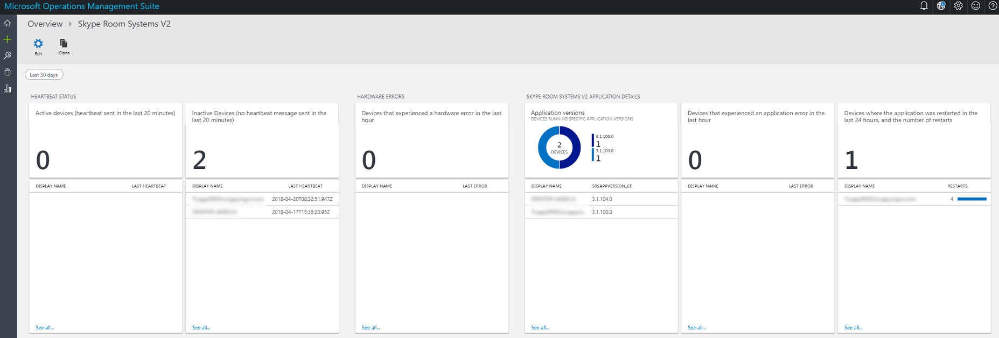

# <a name="deploy-skype-room-systems-v2-management-with-oms"></a><span data-ttu-id="71edd-103">使用 OMS 部署 Skype 会议室系统 v2 管理</span><span class="sxs-lookup"><span data-stu-id="71edd-103">Deploy Skype Room Systems v2 management with OMS</span></span>
 
<span data-ttu-id="71edd-104">本文讨论了如何设置和使用 Microsoft 操作管理套件部署 Skype 的空间系统 v2 设备集成的、 端到端管理。</span><span class="sxs-lookup"><span data-stu-id="71edd-104">This article discusses how to set up and deploy integrated, end-to-end management of Skype Room Systems v2 devices by using Microsoft Operations Management Suite.</span></span>
  
<span data-ttu-id="71edd-105">您可以配置 Microsoft 操作管理套件提供基本遥测和警报可帮助您管理 Skype 会议室内设备。</span><span class="sxs-lookup"><span data-stu-id="71edd-105">You can configure Microsoft Operations Management Suite to provide basic telemetry and alerts that will help you manage Skype meeting room devices.</span></span> <span data-ttu-id="71edd-106">随着您的管理解决方案逐渐成熟，您可能决定部署更多的数据和管理功能，以创建设备的可用性和性能的详细的视图。</span><span class="sxs-lookup"><span data-stu-id="71edd-106">As your management solution matures, you might decide to deploy additional data and management capabilities to create a more detailed view of device availability and performance.</span></span>

<span data-ttu-id="71edd-107">通过遵循本指南，可以使用类似下面的示例仪表板以获取设备的可用性、 应用程序和硬件健康状况和 Skype 的空间系统 v2 应用程序版本分发报告的详细的状态。</span><span class="sxs-lookup"><span data-stu-id="71edd-107">By following this guide, you can use a dashboard like the following example to get detailed status reporting for device availability, application and hardware health, and Skype Room Systems v2 application version distribution.</span></span>

<span data-ttu-id="71edd-108"></span><span class="sxs-lookup"><span data-stu-id="71edd-108"></span></span>
  
<span data-ttu-id="71edd-109">你需要在高级别执行以下任务：</span><span class="sxs-lookup"><span data-stu-id="71edd-109">At a high level, you need to perform the following tasks:</span></span>


1.  [<span data-ttu-id="71edd-110">验证操作管理套件配置</span><span class="sxs-lookup"><span data-stu-id="71edd-110">Validate Operations Management Suite configuration</span></span>](with-oms.md#validate_OMS)
2.  [<span data-ttu-id="71edd-111">配置测试设备的操作管理套件管理设置</span><span class="sxs-lookup"><span data-stu-id="71edd-111">Configure test devices for Operations Management Suite management setup</span></span>](with-oms.md#configure_test_devices)
3.  [<span data-ttu-id="71edd-112">映射自定义字段</span><span class="sxs-lookup"><span data-stu-id="71edd-112">Map custom fields</span></span>](with-oms.md#Custom_fields)
4.  [<span data-ttu-id="71edd-113">定义操作管理套件中的测试的 Skype 的空间系统 v2 视图</span><span class="sxs-lookup"><span data-stu-id="71edd-113">Define the Skype Room Systems v2 views in Operations Management Suite</span></span>](with-oms.md#Define_Views)
5.  [<span data-ttu-id="71edd-114">定义警报</span><span class="sxs-lookup"><span data-stu-id="71edd-114">Define alerts</span></span>](with-oms.md#Alerts)
6.  [<span data-ttu-id="71edd-115">将所有设备都配置为操作管理套件</span><span class="sxs-lookup"><span data-stu-id="71edd-115">Configure all devices for Operations Management Suite</span></span>](with-oms.md#configure_all_devices)
7.  [<span data-ttu-id="71edd-116">配置其他操作管理套件解决方案</span><span class="sxs-lookup"><span data-stu-id="71edd-116">Configure additional Operations Management Suite solutions</span></span>](with-oms.md#Solutions)

> [!IMPORTANT]
> <span data-ttu-id="71edd-117">最小配置，运营管理套件可以监视计算机运行 Windows 操作系统的系统，虽然仍有需要在开始将代理部署到所有系统，Skype 房间之前采取一些 Skype 的空间系统特定步骤设备。</span><span class="sxs-lookup"><span data-stu-id="71edd-117">Although with minimal configuration, the Operations Management Suite can monitor a computer running a Windows operating system, there are still some Skype Room Systems–specific steps that you need to take before you start deploying agents to all Skype Room Systems devices.</span></span>
> <span data-ttu-id="71edd-118">因此，我们强烈建议您执行所有配置步骤按正确的顺序进行受控制的设置和配置。</span><span class="sxs-lookup"><span data-stu-id="71edd-118">Therefore, we highly recommend you perform all configuration steps in the right order for a controlled setup and configuration.</span></span> <span data-ttu-id="71edd-119">最终结果的质量很大程度取决于初始配置的质量。</span><span class="sxs-lookup"><span data-stu-id="71edd-119">The quality of the end result very much depends on the quality of the initial configuration.</span></span>

## <a name="validate-operations-management-suite-configuration"></a><span data-ttu-id="71edd-120">验证操作管理套件配置</span><span class="sxs-lookup"><span data-stu-id="71edd-120">Validate Operations Management Suite configuration</span></span>
<span data-ttu-id="71edd-121"><a name="validate_OMS"> </a></span><span class="sxs-lookup"><span data-stu-id="71edd-121"></span></span>

<span data-ttu-id="71edd-122">您需要操作管理套件工作区，开始从 Skype 的空间系统设备收集日志。</span><span class="sxs-lookup"><span data-stu-id="71edd-122">You need to have an Operations Management Suite workspace to start collecting logs from Skype Room Systems devices.</span></span> <span data-ttu-id="71edd-123">工作区是一个独特的日志分析环境具有其自己的数据存储库、 数据源和解决方案。</span><span class="sxs-lookup"><span data-stu-id="71edd-123">A workspace is a unique Log Analytics environment with its own data repository, data sources, and solutions.</span></span> <span data-ttu-id="71edd-124">如果您已经有一个现有的日志分析工作区，您可能会使用它来监视 Skype 的空间系统部署或者您可以创建特定于您 Skype 的空间系统监视一个专用的日志分析工作区需要。</span><span class="sxs-lookup"><span data-stu-id="71edd-124">If you already have an existing Log Analytics workspace, you might use it to monitor your Skype Room Systems deployment or you can create a dedicated Log Analytics workspace specific to your Skype Room Systems monitoring needs.</span></span>

<span data-ttu-id="71edd-125">如果您需要创建新的日志分析功能区，按照文章[创建日志分析在 Azure 门户工作区](https://docs.microsoft.com/azure/log-analytics/log-analytics-quick-create-workspace)中的说明</span><span class="sxs-lookup"><span data-stu-id="71edd-125">If you need to create a new Log Analytics workspace, follow the instructions in the article [Create a Log Analytics workspace in the Azure portal](https://docs.microsoft.com/azure/log-analytics/log-analytics-quick-create-workspace)</span></span>

> [!NOTE]
> <span data-ttu-id="71edd-126">要使用操作管理套件日志分析，您需要有有效的 Azure 预订。</span><span class="sxs-lookup"><span data-stu-id="71edd-126">To use Log Analytics with Operations Management Suite, you need to have an active Azure subscription.</span></span> <span data-ttu-id="71edd-127">如果您没有订阅了 Azure，可以作为起始点来创建[免费试用订阅](https://azure.microsoft.com/free)。</span><span class="sxs-lookup"><span data-stu-id="71edd-127">If you don’t have an Azure subscription, you can create [a free trial subscription](https://azure.microsoft.com/free) as a starting point.</span></span>


### <a name="configure-operations-management-suite-to-collect-skype-room-systems-event-logs"></a><span data-ttu-id="71edd-128">配置操作的管理套件来收集 Skype 的空间系统事件日志</span><span class="sxs-lookup"><span data-stu-id="71edd-128">Configure Operations Management Suite to collect Skype Room Systems event logs</span></span>

<span data-ttu-id="71edd-129">日志分析只收集设置中指定的 Windows 事件日志中的事件。</span><span class="sxs-lookup"><span data-stu-id="71edd-129">Log Analytics only collects events from the Windows event logs that are specified in the settings.</span></span> <span data-ttu-id="71edd-130">为每个日志中，收集到仅选定的严重级别的事件。</span><span class="sxs-lookup"><span data-stu-id="71edd-130">For each log, only the events with the selected severities are collected.</span></span>

<span data-ttu-id="71edd-131">您需要配置操作管理套件来收集监视 Skype 的空间系统设备和应用程序状态所需的日志。</span><span class="sxs-lookup"><span data-stu-id="71edd-131">You need to configure Operations Management Suite to collect the logs required to monitor Skype Room Systems device and application status.</span></span> <span data-ttu-id="71edd-132">Skype 的空间系统 v2 设备使用 Skype 的空间系统事件日志。</span><span class="sxs-lookup"><span data-stu-id="71edd-132">Skype Room Systems v2 devices use the Skype Room Systems event log.</span></span>

<span data-ttu-id="71edd-133">若要配置操作的管理套件来收集 Skype 的空间系统事件，请参阅[日志分析中的 Windows 事件日志数据源](https://docs.microsoft.com/azure/log-analytics/log-analytics-data-sources-windows-events)</span><span class="sxs-lookup"><span data-stu-id="71edd-133">To configure Operations Management Suite to collect the Skype Room Systems events, see [Windows event log data sources in Log Analytics](https://docs.microsoft.com/azure/log-analytics/log-analytics-data-sources-windows-events)</span></span>

<span data-ttu-id="71edd-134"></span><span class="sxs-lookup"><span data-stu-id="71edd-134"></span></span>


> [!IMPORTANT]
> <span data-ttu-id="71edd-135">选择 Skype 的空间系统事件日志中，然后再选择**错误**、**警告**和**信息**的复选框。</span><span class="sxs-lookup"><span data-stu-id="71edd-135">Select the Skype Room System event log, and then select the **Error**, **Warning**, and **Information** check boxes.</span></span>

## <a name="configure-test-devices-for-operations-management-suite-setup"></a><span data-ttu-id="71edd-136">配置操作管理套件设置为测试设备</span><span class="sxs-lookup"><span data-stu-id="71edd-136">Configure test devices for Operations Management Suite setup</span></span>
<span data-ttu-id="71edd-137"><a name="configure_test_devices"> </a></span><span class="sxs-lookup"><span data-stu-id="71edd-137"></span></span>

<span data-ttu-id="71edd-138">您需要准备操作管理套件能够监视 Skype 的空间系统相关的事件。</span><span class="sxs-lookup"><span data-stu-id="71edd-138">You need to prepare Operations Management Suite to be able to monitor Skype Room Systems–related events.</span></span> <span data-ttu-id="71edd-139">启动时，您需要将操作管理套件代理部署到只是一个或两个 Skype 的空间系统设备物理访问，有那些测试设备生成一些数据并将其推到日志分析区。</span><span class="sxs-lookup"><span data-stu-id="71edd-139">To start with, you need to deploy Operations Management Suite agents to just one or two Skype Room Systems devices that you have physical access to and have those test devices generate some data and push it to the Log Analytics workspace.</span></span>

### <a name="install-operations-management-suite-agents-to-test-devices"></a><span data-ttu-id="71edd-140">安装操作管理套件代理来测试设备</span><span class="sxs-lookup"><span data-stu-id="71edd-140">Install Operations Management Suite agents to test devices</span></span>

<span data-ttu-id="71edd-141">使用[连接的 Windows Azure 中的日志分析服务的计算机](https://docs.microsoft.com/azure/log-analytics/log-analytics-agent-windows)中提供的说明将操作管理套件代理部署到测试设备。</span><span class="sxs-lookup"><span data-stu-id="71edd-141">Deploy the Operations Management Suite agent to the test devices by using the instructions provided in [Connect Windows computers to the Log Analytics service in Azure](https://docs.microsoft.com/azure/log-analytics/log-analytics-agent-windows).</span></span> <span data-ttu-id="71edd-142">这篇文章提供了有关部署 Microsoft 监视代理的 Windows 中，获取操作管理套件区 ID 说明的步骤的详细的信息和主键以获得 Skype 的空间系统设备连接到您操作管理套件部署和验证的代理连接到日志分析的步骤。</span><span class="sxs-lookup"><span data-stu-id="71edd-142">This article gives detailed information about the steps for deploying Microsoft Monitoring Agent for Windows, instructions for obtaining the Operations Management Suite Workspace ID and the primary key to get Skype Room Systems devices connected to your Operations Management Suite deployment, and steps to verify agent connectivity to Log Analytics.</span></span>

### <a name="generate-sample-skype-room-systems-events"></a><span data-ttu-id="71edd-143">生成示例 Skype 的空间系统事件</span><span class="sxs-lookup"><span data-stu-id="71edd-143">Generate sample Skype Room Systems events</span></span>

<span data-ttu-id="71edd-144">操作管理套件代理部署到测试设备上后，请验证需要的事件日志数据收集通过日志分析。</span><span class="sxs-lookup"><span data-stu-id="71edd-144">After the Operations Management Suite agent is deployed onto the test devices, verify that the required event log data is collected by Log Analytics.</span></span>

1.  <span data-ttu-id="71edd-145">登录到[Microsoft 操作管理套件门户](http://aka.ms/omsportal)。</span><span class="sxs-lookup"><span data-stu-id="71edd-145">Sign in to the [Microsoft Operations Management Suite portal](http://aka.ms/omsportal).</span></span>

2.  <span data-ttu-id="71edd-146">列出由 Skype 的空间系统设备生成的事件：</span><span class="sxs-lookup"><span data-stu-id="71edd-146">List the events generated by a Skype Room Systems device:</span></span>
    1.  <span data-ttu-id="71edd-147">转到**日志搜索**和使用查询来检索包含自定义字段的记录。</span><span class="sxs-lookup"><span data-stu-id="71edd-147">Go to **Log Search** and use a query to retrieve the records that will have the custom field.</span></span>
    2.  <span data-ttu-id="71edd-148">示例查询：`Event | where Source == "SRS-App"`</span><span class="sxs-lookup"><span data-stu-id="71edd-148">Sample query: `Event | where Source == "SRS-App"`</span></span>

3.  <span data-ttu-id="71edd-149">请确保查询返回包含成功检测信号事件的日志记录。</span><span class="sxs-lookup"><span data-stu-id="71edd-149">Make sure that the query returns log records that include successful heartbeat events.</span></span>

4.  <span data-ttu-id="71edd-150">生成一个硬件问题，并验证操作管理套件中的记录所需的事件。</span><span class="sxs-lookup"><span data-stu-id="71edd-150">Generate a hardware issue, and validate that the required events are logged in Operations Management Suite.</span></span>
    1.  <span data-ttu-id="71edd-151">拔下其中一个测试 Skype 的空间系统系统上的外围设备。</span><span class="sxs-lookup"><span data-stu-id="71edd-151">Unplug one of the peripheral devices on the test Skype Room Systems system.</span></span> <span data-ttu-id="71edd-152">这可能是摄像机、 扬声器、 麦克风或前面房间显示</span><span class="sxs-lookup"><span data-stu-id="71edd-152">This could be the camera, speakerphone, microphone, or Front Room Display</span></span>
    2.  <span data-ttu-id="71edd-153">等待 10 分钟来填充操作管理套件中的测试的事件日志。</span><span class="sxs-lookup"><span data-stu-id="71edd-153">Wait 10 minutes for the event log to be populated in Operations Management Suite.</span></span>
    3.  <span data-ttu-id="71edd-154">使用查询列表中的硬件错误事件：`Event | where EventID == 3001`</span><span class="sxs-lookup"><span data-stu-id="71edd-154">Use a query to list hardware error events: `Event | where EventID == 3001`</span></span>

5.  <span data-ttu-id="71edd-155">生成的应用程序问题，并验证所需的事件的记录。</span><span class="sxs-lookup"><span data-stu-id="71edd-155">Generate an application issue, and validate that the required events are logged.</span></span>
    1.  <span data-ttu-id="71edd-156">修改空间系统 Skype 应用程序配置，并键入不正确的会话启动协议 (SIP) 地址/密码对。</span><span class="sxs-lookup"><span data-stu-id="71edd-156">Modify Skype Room Systems application configuration, and type an incorrect Session Initiation Protocol (SIP) address/password pair.</span></span>
    2.  <span data-ttu-id="71edd-157">等待 10 分钟来填充操作管理套件中的测试的事件日志。</span><span class="sxs-lookup"><span data-stu-id="71edd-157">Wait 10 minutes for the event log to be populated in Operations Management Suite.</span></span>
    3.  <span data-ttu-id="71edd-158">使用查询列表应用程序的错误事件：`Event | where EventID == 2001`</span><span class="sxs-lookup"><span data-stu-id="71edd-158">Use a query to list application error events: `Event | where EventID == 2001`</span></span>

> [!IMPORTANT]
> <span data-ttu-id="71edd-159">这些示例事件日志，然后才能配置自定义字段是必需的。</span><span class="sxs-lookup"><span data-stu-id="71edd-159">These sample event logs are required before custom fields can be configured.</span></span> <span data-ttu-id="71edd-160">不进入下一步骤，直到收集了所需的事件日志。</span><span class="sxs-lookup"><span data-stu-id="71edd-160">Don’t proceed to the next step until you have collected the required event logs.</span></span>

## <a name="map-custom-fields"></a><span data-ttu-id="71edd-161">映射自定义字段</span><span class="sxs-lookup"><span data-stu-id="71edd-161">Map custom fields</span></span>
<span data-ttu-id="71edd-162"><a name="Custom_fields"> </a></span><span class="sxs-lookup"><span data-stu-id="71edd-162"></span></span>

<span data-ttu-id="71edd-163">使用自定义字段来从事件日志中提取特定的数据。</span><span class="sxs-lookup"><span data-stu-id="71edd-163">You use custom fields to extract specific data from the event logs.</span></span> <span data-ttu-id="71edd-164">您需要定义将与拼贴、 仪表板视图和警报稍后使用的自定义字段。</span><span class="sxs-lookup"><span data-stu-id="71edd-164">You need to define custom fields that will be used later with your tiles, dashboard views, and alerts.</span></span> <span data-ttu-id="71edd-165">请参阅[日志分析中的自定义字段](https://docs.microsoft.com/azure/log-analytics/log-analytics-custom-fields)和熟悉概念之前开始创建您的自定义字段。</span><span class="sxs-lookup"><span data-stu-id="71edd-165">See [Custom fields in Log Analytics](https://docs.microsoft.com/azure/log-analytics/log-analytics-custom-fields) and become familiar with the concepts before you start creating your custom fields.</span></span>

<span data-ttu-id="71edd-166">要提取自定义域从捕获的事件日志，请执行以下步骤：</span><span class="sxs-lookup"><span data-stu-id="71edd-166">To extract your custom fields out of the captured event logs, follow these steps:</span></span>

1.  <span data-ttu-id="71edd-167">登录到[Microsoft 操作管理套件门户](http://aka.ms/omsportal)。</span><span class="sxs-lookup"><span data-stu-id="71edd-167">Sign in to the [Microsoft Operations Management Suite portal](http://aka.ms/omsportal).</span></span>

2.  <span data-ttu-id="71edd-168">列出由 Skype 的空间系统设备生成的事件：</span><span class="sxs-lookup"><span data-stu-id="71edd-168">List the events generated by a Skype Room Systems device:</span></span>
    1.  <span data-ttu-id="71edd-169">转到**日志搜索**和使用查询来检索包含自定义字段的记录。</span><span class="sxs-lookup"><span data-stu-id="71edd-169">Go to **Log Search** and use a query to retrieve the records that will have the custom field.</span></span>
    2.  <span data-ttu-id="71edd-170">示例查询：`Event | where Source == "SRS-App"`</span><span class="sxs-lookup"><span data-stu-id="71edd-170">Sample query: `Event | where Source == "SRS-App"`</span></span>

3.  <span data-ttu-id="71edd-171">选择一个记录，选择按钮的左边，然后启动域提取向导。</span><span class="sxs-lookup"><span data-stu-id="71edd-171">Select one of the records, select the button to the left, and start the field extraction wizard.</span></span>

<span data-ttu-id="71edd-172"></span><span class="sxs-lookup"><span data-stu-id="71edd-172"></span></span>

4.  <span data-ttu-id="71edd-173">突出显示您想要从 RenderedDescription 中提取，并提供一个字段标题的数据。</span><span class="sxs-lookup"><span data-stu-id="71edd-173">Highlight the data you’d like to extract from the RenderedDescription and provide a Field Title.</span></span> <span data-ttu-id="71edd-174">表 1 中提供了您应该使用的字段名称。</span><span class="sxs-lookup"><span data-stu-id="71edd-174">The field names that you should use are provided in Table 1.</span></span>

<span data-ttu-id="71edd-175"></span><span class="sxs-lookup"><span data-stu-id="71edd-175"></span></span>

5.  <span data-ttu-id="71edd-176">使用表 1 中所示的映射。</span><span class="sxs-lookup"><span data-stu-id="71edd-176">Use the mappings shown in Table 1.</span></span> <span data-ttu-id="71edd-177">操作管理套件将自动添加**\_CF**时定义新的字段的字符串。</span><span class="sxs-lookup"><span data-stu-id="71edd-177">Operations Management Suite will automatically add the **\_CF** string when you define the new field.</span></span>

> [!IMPORTANT]
> <span data-ttu-id="71edd-178">请记住 JSON 和操作管理套件的所有字段都是区分大小写。</span><span class="sxs-lookup"><span data-stu-id="71edd-178">Remember that all JSON and Operations Management Suite fields are case-sensitive.</span></span>

> <span data-ttu-id="71edd-179">在下表中应注意的 EventID 复选框的状态。</span><span class="sxs-lookup"><span data-stu-id="71edd-179">Pay attention to the state of the EventID check box in the table below.</span></span> <span data-ttu-id="71edd-180">请确保您确认此操作管理套件成功提取自定义字段值的复选框的状态。</span><span class="sxs-lookup"><span data-stu-id="71edd-180">Be sure you confirm the state of this check box for Operations Management Suite to successfully extract custom field values.</span></span>
> <span data-ttu-id="71edd-181"></span><span class="sxs-lookup"><span data-stu-id="71edd-181"></span></span> 

<span data-ttu-id="71edd-182">**表 1**</span><span class="sxs-lookup"><span data-stu-id="71edd-182">**Table 1**</span></span>

| <span data-ttu-id="71edd-183">**JSON 字段**</span><span class="sxs-lookup"><span data-stu-id="71edd-183">**JSON field**</span></span>               | <span data-ttu-id="71edd-184">**OMS 的自定义字段**</span><span class="sxs-lookup"><span data-stu-id="71edd-184">**OMS custom field**</span></span>       | <span data-ttu-id="71edd-185">**事件 ID**</span><span class="sxs-lookup"><span data-stu-id="71edd-185">**Event ID**</span></span> |
|------------------------------|----------------------------|-----------------|
| <span data-ttu-id="71edd-186">说明</span><span class="sxs-lookup"><span data-stu-id="71edd-186">Description</span></span>                  | <span data-ttu-id="71edd-187">SRSEventDescription_CF</span><span class="sxs-lookup"><span data-stu-id="71edd-187">SRSEventDescription_CF</span></span>     | <span data-ttu-id="71edd-188">未选中</span><span class="sxs-lookup"><span data-stu-id="71edd-188">Not selected</span></span>    |
| <span data-ttu-id="71edd-189">ResourceState</span><span class="sxs-lookup"><span data-stu-id="71edd-189">ResourceState</span></span>                | <span data-ttu-id="71edd-190">SRSResourceState_CF</span><span class="sxs-lookup"><span data-stu-id="71edd-190">SRSResourceState_CF</span></span>        | <span data-ttu-id="71edd-191">未选中</span><span class="sxs-lookup"><span data-stu-id="71edd-191">Not selected</span></span>    |
| <span data-ttu-id="71edd-192">操作名称</span><span class="sxs-lookup"><span data-stu-id="71edd-192">OperationName</span></span>                | <span data-ttu-id="71edd-193">SRSOperationName_CF</span><span class="sxs-lookup"><span data-stu-id="71edd-193">SRSOperationName_CF</span></span>        | <span data-ttu-id="71edd-194">未选中</span><span class="sxs-lookup"><span data-stu-id="71edd-194">Not selected</span></span>    |
| <span data-ttu-id="71edd-195">OperationResult</span><span class="sxs-lookup"><span data-stu-id="71edd-195">OperationResult</span></span>              | <span data-ttu-id="71edd-196">SRSOperationResult_CF</span><span class="sxs-lookup"><span data-stu-id="71edd-196">SRSOperationResult_CF</span></span>      | <span data-ttu-id="71edd-197">未选中</span><span class="sxs-lookup"><span data-stu-id="71edd-197">Not selected</span></span>    |
| <span data-ttu-id="71edd-198">OS</span><span class="sxs-lookup"><span data-stu-id="71edd-198">OS</span></span>                           | <span data-ttu-id="71edd-199">SRSOSVersion_CF</span><span class="sxs-lookup"><span data-stu-id="71edd-199">SRSOSVersion_CF</span></span>            | <span data-ttu-id="71edd-200">未选中</span><span class="sxs-lookup"><span data-stu-id="71edd-200">Not selected</span></span>    |
| <span data-ttu-id="71edd-201">OSVersion</span><span class="sxs-lookup"><span data-stu-id="71edd-201">OSVersion</span></span>                    | <span data-ttu-id="71edd-202">SRSOSLongVersion_CF</span><span class="sxs-lookup"><span data-stu-id="71edd-202">SRSOSLongVersion_CF</span></span>        | <span data-ttu-id="71edd-203">未选中</span><span class="sxs-lookup"><span data-stu-id="71edd-203">Not selected</span></span>    |
| <span data-ttu-id="71edd-204">别名</span><span class="sxs-lookup"><span data-stu-id="71edd-204">Alias</span></span>                        | <span data-ttu-id="71edd-205">SRSAlias_CF</span><span class="sxs-lookup"><span data-stu-id="71edd-205">SRSAlias_CF</span></span>                | <span data-ttu-id="71edd-206">未选中</span><span class="sxs-lookup"><span data-stu-id="71edd-206">Not selected</span></span>    |
| <span data-ttu-id="71edd-207">显示名称</span><span class="sxs-lookup"><span data-stu-id="71edd-207">DisplayName</span></span>                  | <span data-ttu-id="71edd-208">SRSDisplayName_CF</span><span class="sxs-lookup"><span data-stu-id="71edd-208">SRSDisplayName_CF</span></span>          | <span data-ttu-id="71edd-209">未选中</span><span class="sxs-lookup"><span data-stu-id="71edd-209">Not selected</span></span>    |
| <span data-ttu-id="71edd-210">AppVersion</span><span class="sxs-lookup"><span data-stu-id="71edd-210">AppVersion</span></span>                   | <span data-ttu-id="71edd-211">SRSAppVersion_CF</span><span class="sxs-lookup"><span data-stu-id="71edd-211">SRSAppVersion_CF</span></span>           | <span data-ttu-id="71edd-212">未选中</span><span class="sxs-lookup"><span data-stu-id="71edd-212">Not selected</span></span>    |
| <span data-ttu-id="71edd-213">IPv4Address</span><span class="sxs-lookup"><span data-stu-id="71edd-213">IPv4Address</span></span>                  | <span data-ttu-id="71edd-214">SRSIPv4Address_CF</span><span class="sxs-lookup"><span data-stu-id="71edd-214">SRSIPv4Address_CF</span></span>          | <span data-ttu-id="71edd-215">未选中</span><span class="sxs-lookup"><span data-stu-id="71edd-215">Not selected</span></span>    |
| <span data-ttu-id="71edd-216">IPv6Address</span><span class="sxs-lookup"><span data-stu-id="71edd-216">IPv6Address</span></span>                  | <span data-ttu-id="71edd-217">SRSIPv6Address_CF</span><span class="sxs-lookup"><span data-stu-id="71edd-217">SRSIPv6Address_CF</span></span>          | <span data-ttu-id="71edd-218">未选中</span><span class="sxs-lookup"><span data-stu-id="71edd-218">Not selected</span></span>    |
| <span data-ttu-id="71edd-219">前面的房间显示状态</span><span class="sxs-lookup"><span data-stu-id="71edd-219">Front of Room Display status</span></span> | <span data-ttu-id="71edd-220">SRSFORDStatus_CF</span><span class="sxs-lookup"><span data-stu-id="71edd-220">SRSFORDStatus_CF</span></span>           | <span data-ttu-id="71edd-221">3001</span><span class="sxs-lookup"><span data-stu-id="71edd-221">3001</span></span>            |
| <span data-ttu-id="71edd-222">相机状态</span><span class="sxs-lookup"><span data-stu-id="71edd-222">Camera status</span></span>                | <span data-ttu-id="71edd-223">SRSCameraStatus_CF</span><span class="sxs-lookup"><span data-stu-id="71edd-223">SRSCameraStatus_CF</span></span>         | <span data-ttu-id="71edd-224">3001</span><span class="sxs-lookup"><span data-stu-id="71edd-224">3001</span></span>            |
| <span data-ttu-id="71edd-225">会议麦克风状态</span><span class="sxs-lookup"><span data-stu-id="71edd-225">Conference Microphone status</span></span> | <span data-ttu-id="71edd-226">SRSConfMicrophoneStatus_CF</span><span class="sxs-lookup"><span data-stu-id="71edd-226">SRSConfMicrophoneStatus_CF</span></span> | <span data-ttu-id="71edd-227">3001</span><span class="sxs-lookup"><span data-stu-id="71edd-227">3001</span></span>            |
| <span data-ttu-id="71edd-228">会议演讲者状态</span><span class="sxs-lookup"><span data-stu-id="71edd-228">Conference Speaker status</span></span>    | <span data-ttu-id="71edd-229">SRSConfSpeakerStatus_CF</span><span class="sxs-lookup"><span data-stu-id="71edd-229">SRSConfSpeakerStatus_CF</span></span>    | <span data-ttu-id="71edd-230">3001</span><span class="sxs-lookup"><span data-stu-id="71edd-230">3001</span></span>            |
| <span data-ttu-id="71edd-231">默认扬声器状态</span><span class="sxs-lookup"><span data-stu-id="71edd-231">Default Speaker status</span></span>       | <span data-ttu-id="71edd-232">SRSDefaultSpeakerStatus_CF</span><span class="sxs-lookup"><span data-stu-id="71edd-232">SRSDefaultSpeakerStatus_CF</span></span> | <span data-ttu-id="71edd-233">3001</span><span class="sxs-lookup"><span data-stu-id="71edd-233">3001</span></span>            |
| <span data-ttu-id="71edd-234">运动传感器状态</span><span class="sxs-lookup"><span data-stu-id="71edd-234">Motion Sensor status</span></span>         | <span data-ttu-id="71edd-235">SRSMotionSensorStatus_CF</span><span class="sxs-lookup"><span data-stu-id="71edd-235">SRSMotionSensorStatus_CF</span></span>   | <span data-ttu-id="71edd-236">3001</span><span class="sxs-lookup"><span data-stu-id="71edd-236">3001</span></span>            |
| <span data-ttu-id="71edd-237">HDMI 接收状态</span><span class="sxs-lookup"><span data-stu-id="71edd-237">HDMI Ingest status</span></span>           | <span data-ttu-id="71edd-238">SRSHDMIIngestStatus_CF</span><span class="sxs-lookup"><span data-stu-id="71edd-238">SRSHDMIIngestStatus_CF</span></span>     | <span data-ttu-id="71edd-239">3001</span><span class="sxs-lookup"><span data-stu-id="71edd-239">3001</span></span>            |


## <a name="define-the-skype-room-systems-v2-views-in-operations-management-suite"></a><span data-ttu-id="71edd-240">定义操作管理套件中的测试的 Skype 的空间系统 v2 视图</span><span class="sxs-lookup"><span data-stu-id="71edd-240">Define the Skype Room Systems v2 views in Operations Management Suite</span></span>
<span data-ttu-id="71edd-241"><a name="Define_Views"> </a></span><span class="sxs-lookup"><span data-stu-id="71edd-241"></span></span>

<span data-ttu-id="71edd-242">收集数据和自定义字段映射后，可以使用操作管理套件视图设计器开发包含各种拼贴来监视 Skype 的空间系统 v2 事件的仪表板。</span><span class="sxs-lookup"><span data-stu-id="71edd-242">After data is collected and custom fields are mapped, you can use Operations Management Suite View Designer to develop a dashboard containing various tiles to monitor Skype Room Systems v2 events.</span></span> <span data-ttu-id="71edd-243">使用视图设计器创建以下图块。</span><span class="sxs-lookup"><span data-stu-id="71edd-243">Use View Designer to create the following tiles.</span></span> <span data-ttu-id="71edd-244">有关详细信息，请参阅[使用视图设计器中以创建日志分析中的自定义视图](https://docs.microsoft.com/azure/log-analytics/log-analytics-view-designer)</span><span class="sxs-lookup"><span data-stu-id="71edd-244">For more information, see [Use View Designer to create custom views in Log Analytics](https://docs.microsoft.com/azure/log-analytics/log-analytics-view-designer)</span></span>

> [!NOTE]
> <span data-ttu-id="71edd-245">应为正常工作的仪表板拼贴完成本指南中前面的步骤。</span><span class="sxs-lookup"><span data-stu-id="71edd-245">Earlier steps in this guide should have been completed for the dashboard tiles to work properly.</span></span>


### <a name="create-a-skype-room-systems-v2-dashboard-by-using-the-import-method"></a><span data-ttu-id="71edd-246">通过使用导入方法创建 Skype 的空间系统 v2 仪表板</span><span class="sxs-lookup"><span data-stu-id="71edd-246">Create a Skype Room Systems v2 dashboard by using the import method</span></span>

<span data-ttu-id="71edd-247">您可以导入操作管理套件的仪表板并开始立即监视您的设备。</span><span class="sxs-lookup"><span data-stu-id="71edd-247">You can import an Operations Management Suite dashboard and start monitoring your devices immediately.</span></span> <span data-ttu-id="71edd-248">采用以下步骤来导入仪表板：</span><span class="sxs-lookup"><span data-stu-id="71edd-248">Take the following steps to import the dashboard:</span></span>

1.  <span data-ttu-id="71edd-249">下载[的仪表板](http://download.microsoft.com/download/9/0/D/90D4826A-9FD2-47D2-B911-97BF1737F4F7/SkypeRoomSystems_v2.omsview)。</span><span class="sxs-lookup"><span data-stu-id="71edd-249">Download the [dashboard](http://download.microsoft.com/download/9/0/D/90D4826A-9FD2-47D2-B911-97BF1737F4F7/SkypeRoomSystems_v2.omsview).</span></span>
2.  <span data-ttu-id="71edd-250">登录到[Microsoft 操作管理套件门户](http://aka.ms/omsportal)。</span><span class="sxs-lookup"><span data-stu-id="71edd-250">Sign in to the [Microsoft Operations Management Suite portal](http://aka.ms/omsportal).</span></span>
3.  <span data-ttu-id="71edd-251">打开**视图设计器**。</span><span class="sxs-lookup"><span data-stu-id="71edd-251">Open **View Designer**.</span></span>
4.  <span data-ttu-id="71edd-252">选择**导入**，然后再选择**SkypeRoomSystems_v2.omsview**文件。</span><span class="sxs-lookup"><span data-stu-id="71edd-252">Select **Import**, and then select the **SkypeRoomSystems_v2.omsview** file.</span></span>
5.  <span data-ttu-id="71edd-253">选择**保存**。</span><span class="sxs-lookup"><span data-stu-id="71edd-253">Select **Save**.</span></span>

### <a name="create-a-skype-room-systems-v2-dashboard-manually"></a><span data-ttu-id="71edd-254">手动创建一个 Skype 的空间系统 v2 仪表板</span><span class="sxs-lookup"><span data-stu-id="71edd-254">Create a Skype Room Systems v2 dashboard manually</span></span>

<span data-ttu-id="71edd-255">或者，您可以创建自己的仪表板并添加要监视的拼贴。</span><span class="sxs-lookup"><span data-stu-id="71edd-255">Alternatively, you can create your own dashboard and add only the tiles that you wish to monitor.</span></span>

#### <a name="configure-the-overview-tile"></a><span data-ttu-id="71edd-256">配置概述平铺</span><span class="sxs-lookup"><span data-stu-id="71edd-256">Configure the Overview Tile</span></span>
1.  <span data-ttu-id="71edd-257">打开**视图设计器**。</span><span class="sxs-lookup"><span data-stu-id="71edd-257">Open **View Designer**.</span></span>
2.  <span data-ttu-id="71edd-258">选择**概述拼贴**，然后再从库中选择**两个数字**。</span><span class="sxs-lookup"><span data-stu-id="71edd-258">Select **Overview Tile**, and then select **Two numbers** from the gallery.</span></span>
3.  <span data-ttu-id="71edd-259">平铺**Skype 的空间系统**的名称。</span><span class="sxs-lookup"><span data-stu-id="71edd-259">Name the tile **Skype Room Systems**.</span></span>
4.  <span data-ttu-id="71edd-260">定义**第一个拼贴**：</span><span class="sxs-lookup"><span data-stu-id="71edd-260">Define the **First Tile**:</span></span><br>
    <span data-ttu-id="71edd-261">**图例：**在最近一个月内至少一次发送检测信号的设备</span><span class="sxs-lookup"><span data-stu-id="71edd-261">**Legend:** Devices that sent a heartbeat at least once within the last month</span></span><br>
    <span data-ttu-id="71edd-262">**查询：**```Event | where EventLog == "Skype Room System" and TimeGenerated > ago(30d) | summarize TotalSRSDevices = dcount(Computer)```</span><span class="sxs-lookup"><span data-stu-id="71edd-262">**Query:** ```Event | where EventLog == "Skype Room System" and TimeGenerated > ago(30d) | summarize TotalSRSDevices = dcount(Computer)```</span></span>
5.  <span data-ttu-id="71edd-263">定义**第二个图块**：</span><span class="sxs-lookup"><span data-stu-id="71edd-263">Define the **Second Tile**:</span></span><br>
    <span data-ttu-id="71edd-264">**图例：**在过去一小时内发送检测信号的活动设备</span><span class="sxs-lookup"><span data-stu-id="71edd-264">**Legend:** Active devices that sent a heartbeat within the last hour</span></span><br>
    <span data-ttu-id="71edd-265">**查询：**```Event | where EventLog == "Skype Room System" and SRSOperationName_CF == "Heartbeat" and TimeGenerated > ago(1h) | summarize TotalSRSDevices = dcount(Computer)```</span><span class="sxs-lookup"><span data-stu-id="71edd-265">**Query:** ```Event | where EventLog == "Skype Room System" and SRSOperationName_CF == "Heartbeat" and TimeGenerated > ago(1h) | summarize TotalSRSDevices = dcount(Computer)```</span></span>
6.  <span data-ttu-id="71edd-266">选择**应用**。</span><span class="sxs-lookup"><span data-stu-id="71edd-266">Select **Apply**.</span></span>

### <a name="create-a-tile-that-displays-active-devices"></a><span data-ttu-id="71edd-267">创建平铺视图，显示活动设备</span><span class="sxs-lookup"><span data-stu-id="71edd-267">Create a tile that displays active devices</span></span>
1.  <span data-ttu-id="71edd-268">选择**查看仪表板**开始添加您拼贴。</span><span class="sxs-lookup"><span data-stu-id="71edd-268">Select **View Dashboard** to start adding your tiles.</span></span>
2.  <span data-ttu-id="71edd-269">从库中选择**数量和列表**</span><span class="sxs-lookup"><span data-stu-id="71edd-269">Select **Number & list** from the gallery</span></span>
3.  <span data-ttu-id="71edd-270">定义的**常规**属性：</span><span class="sxs-lookup"><span data-stu-id="71edd-270">Define the **General** properties:</span></span><br>
    <span data-ttu-id="71edd-271">**组标题：**检测信号状态</span><span class="sxs-lookup"><span data-stu-id="71edd-271">**Group Title:** Heartbeat Status</span></span><br>
    <span data-ttu-id="71edd-272">**新组：**选择</span><span class="sxs-lookup"><span data-stu-id="71edd-272">**New Group:** Selected</span></span>
4.  <span data-ttu-id="71edd-273">定义**平铺**属性：</span><span class="sxs-lookup"><span data-stu-id="71edd-273">Define the **Tile** properties:</span></span><br>
    <span data-ttu-id="71edd-274">**图例：**活动设备 （在最后 20 分钟内发送检测信号）</span><span class="sxs-lookup"><span data-stu-id="71edd-274">**Legend:** Active devices (heartbeat sent in the last 20 minutes)</span></span><br>
    <span data-ttu-id="71edd-275">**平铺查询：**```Event | where EventLog == "Skype Room System" and SRSOperationName_CF == "Heartbeat" and TimeGenerated > ago(20m) | summarize AggregatedValue = count() by Computer | count```</span><span class="sxs-lookup"><span data-stu-id="71edd-275">**Tile Query:** ```Event | where EventLog == "Skype Room System" and SRSOperationName_CF == "Heartbeat" and TimeGenerated > ago(20m) | summarize AggregatedValue = count() by Computer | count```</span></span>
5.  <span data-ttu-id="71edd-276">定义**列表**的属性：</span><span class="sxs-lookup"><span data-stu-id="71edd-276">Define the **List** properties:</span></span><br>
    <span data-ttu-id="71edd-277">**列出查询：**```Event | where EventLog == "Skype Room System" and SRSOperationName_CF == "Heartbeat" and TimeGenerated > ago(20m) | summarize TimeGenerated = max(TimeGenerated) by Computer | order by TimeGenerated```</span><span class="sxs-lookup"><span data-stu-id="71edd-277">**List Query:** ```Event | where EventLog == "Skype Room System" and SRSOperationName_CF == "Heartbeat" and TimeGenerated > ago(20m) | summarize TimeGenerated = max(TimeGenerated) by Computer | order by TimeGenerated```</span></span>
6.  <span data-ttu-id="71edd-278">定义**的列标题**：</span><span class="sxs-lookup"><span data-stu-id="71edd-278">Define **Column Titles**:</span></span><br>
    <span data-ttu-id="71edd-279">**名称：**显示名称</span><span class="sxs-lookup"><span data-stu-id="71edd-279">**Name:** Display Name</span></span><br>
    <span data-ttu-id="71edd-280">**值：**最后一次心跳</span><span class="sxs-lookup"><span data-stu-id="71edd-280">**Value:** Last Heartbeat</span></span>
7.  <span data-ttu-id="71edd-281">定义**导航查询**。</span><span class="sxs-lookup"><span data-stu-id="71edd-281">Define **Navigation Query**.</span></span><br>
    ```search {selected item} | where EventLog == "Skype Room System" and SRSOperationName_CF == "Heartbeat" | summarize arg_max(TimeGenerated, *) by Computer | project TimeGenerated, Computer, SRSAlias_CF, SRSAppVersion_CF, SRSOSVersion_CF, SRSOSLongVersion_CF, SRSIPv4Address_CF, SRSIPv6Address_CF, SRSOperationName_CF, SRSOperationResult_CF, SRSResourceState_CF, SRSEventDescription_CF```
8.  <span data-ttu-id="71edd-282">选择**应用**，然后**关闭**。</span><span class="sxs-lookup"><span data-stu-id="71edd-282">Select **Apply**, and then **Close**.</span></span>

### <a name="create-a-tile-that-displays-devices-that-have-connectivity-issues"></a><span data-ttu-id="71edd-283">创建平铺视图显示具有连接问题的设备</span><span class="sxs-lookup"><span data-stu-id="71edd-283">Create a tile that displays devices that have connectivity issues</span></span>
1.  <span data-ttu-id="71edd-284">从库中选择**编号与列表**，然后添加一个新图块。</span><span class="sxs-lookup"><span data-stu-id="71edd-284">Select **Number & list** from the gallery, and then add a new tile.</span></span>
2.  <span data-ttu-id="71edd-285">定义的**常规**属性：</span><span class="sxs-lookup"><span data-stu-id="71edd-285">Define the **General** properties:</span></span><br>
    <span data-ttu-id="71edd-286">**组标题：**保留为空</span><span class="sxs-lookup"><span data-stu-id="71edd-286">**Group Title:** Leave empty</span></span><br>
    <span data-ttu-id="71edd-287">**新组：**未选中</span><span class="sxs-lookup"><span data-stu-id="71edd-287">**New Group:** Not Selected</span></span>
3.  <span data-ttu-id="71edd-288">定义**平铺**属性：</span><span class="sxs-lookup"><span data-stu-id="71edd-288">Define the **Tile** properties:</span></span><br>
    <span data-ttu-id="71edd-289">**图例：**非活动设备 （没有在最后 20 分钟内发送心跳消息）</span><span class="sxs-lookup"><span data-stu-id="71edd-289">**Legend:** Inactive Devices (no heartbeat message sent in the last 20 minutes)</span></span><br>
    <span data-ttu-id="71edd-290">**平铺查询：**```Event | where EventLog == "Skype Room System" and SRSOperationName_CF == "Heartbeat" | summarize LastHB = max(TimeGenerated) by Computer | where LastHB < ago(20m) | count```</span><span class="sxs-lookup"><span data-stu-id="71edd-290">**Tile Query:** ```Event | where EventLog == "Skype Room System" and SRSOperationName_CF == "Heartbeat" | summarize LastHB = max(TimeGenerated) by Computer | where LastHB < ago(20m) | count```</span></span>
4.  <span data-ttu-id="71edd-291">定义**列表**的属性：</span><span class="sxs-lookup"><span data-stu-id="71edd-291">Define the **List** properties:</span></span><br>
    <span data-ttu-id="71edd-292">**列出查询：**```Event | where EventLog == "Skype Room System" and SRSOperationName_CF == "Heartbeat" | summarize TimeGenerated = max(TimeGenerated) by Computer | where TimeGenerated < ago(20m) | order by TimeGenerated```</span><span class="sxs-lookup"><span data-stu-id="71edd-292">**List Query:** ```Event | where EventLog == "Skype Room System" and SRSOperationName_CF == "Heartbeat" | summarize TimeGenerated = max(TimeGenerated) by Computer | where TimeGenerated < ago(20m) | order by TimeGenerated```</span></span>
5.  <span data-ttu-id="71edd-293">定义**的列标题**：</span><span class="sxs-lookup"><span data-stu-id="71edd-293">Define **Column Titles**:</span></span><br>
    <span data-ttu-id="71edd-294">**名称：**显示名称</span><span class="sxs-lookup"><span data-stu-id="71edd-294">**Name:** Display Name</span></span><br>
    <span data-ttu-id="71edd-295">**值：**最后一次心跳</span><span class="sxs-lookup"><span data-stu-id="71edd-295">**Value:** Last Heartbeat</span></span>
6.  <span data-ttu-id="71edd-296">定义**导航查询**：</span><span class="sxs-lookup"><span data-stu-id="71edd-296">Define **Navigation Query**:</span></span><br>
    ```search {selected item} | where EventLog == "Skype Room System" and SRSOperationName_CF == "Heartbeat" | summarize arg_max(TimeGenerated, *) by Computer | project TimeGenerated, Computer, SRSAlias_CF, SRSAppVersion_CF, SRSOSVersion_CF, SRSOSLongVersion_CF, SRSIPv4Address_CF, SRSIPv6Address_CF, SRSOperationName_CF, SRSOperationResult_CF, SRSResourceState_CF, SRSEventDescription_CF```
7.  <span data-ttu-id="71edd-297">选择**应用**，然后**关闭**。</span><span class="sxs-lookup"><span data-stu-id="71edd-297">Select **Apply**, and then **Close**.</span></span>

### <a name="create-a-tile-that-displays-devices-that-have-a-hardware-error"></a><span data-ttu-id="71edd-298">创建平铺视图显示设备具有硬件错误</span><span class="sxs-lookup"><span data-stu-id="71edd-298">Create a tile that displays devices that have a hardware error</span></span>

1.  <span data-ttu-id="71edd-299">从库中选择**编号与列表**，然后添加一个新图块。</span><span class="sxs-lookup"><span data-stu-id="71edd-299">Select **Number & list** from the gallery, and then add a new tile.</span></span>
2.  <span data-ttu-id="71edd-300">定义的**常规**属性：</span><span class="sxs-lookup"><span data-stu-id="71edd-300">Define the **General** properties:</span></span><br>
    <span data-ttu-id="71edd-301">**组标题：**硬件</span><span class="sxs-lookup"><span data-stu-id="71edd-301">**Group Title:** Hardware</span></span><br>
    <span data-ttu-id="71edd-302">**新组：**选择</span><span class="sxs-lookup"><span data-stu-id="71edd-302">**New Group:** Selected</span></span>
3.  <span data-ttu-id="71edd-303">定义**平铺**属性：</span><span class="sxs-lookup"><span data-stu-id="71edd-303">Define the **Tile** properties:</span></span><br>
    <span data-ttu-id="71edd-304">**图例：**在最后一个小时出现硬件错误的设备</span><span class="sxs-lookup"><span data-stu-id="71edd-304">**Legend:** Devices that experienced a hardware error in the last hour</span></span> <br>
    <span data-ttu-id="71edd-305">**平铺查询：**```Event | where EventLog == "Skype Room System" and EventLevelName == "Error" and EventID == "3001" and TimeGenerated > ago(1h) | summarize AggregatedValue = count() by Computer | count```</span><span class="sxs-lookup"><span data-stu-id="71edd-305">**Tile Query:** ```Event | where EventLog == "Skype Room System" and EventLevelName == "Error" and EventID == "3001" and TimeGenerated > ago(1h) | summarize AggregatedValue = count() by Computer | count```</span></span>
4.  <span data-ttu-id="71edd-306">定义**列表**的属性：</span><span class="sxs-lookup"><span data-stu-id="71edd-306">Define the **List** properties:</span></span><br>
    <span data-ttu-id="71edd-307">**列出查询：**```Event | where EventLog == "Skype Room System" and EventLevelName == "Error" and EventID == "3001" and TimeGenerated > ago(1h) | summarize TimeGenerated = max(TimeGenerated) by Computer```</span><span class="sxs-lookup"><span data-stu-id="71edd-307">**List Query:** ```Event | where EventLog == "Skype Room System" and EventLevelName == "Error" and EventID == "3001" and TimeGenerated > ago(1h) | summarize TimeGenerated = max(TimeGenerated) by Computer```</span></span>
5.  <span data-ttu-id="71edd-308">定义**的列标题**：</span><span class="sxs-lookup"><span data-stu-id="71edd-308">Define **Column Titles**:</span></span><br>
    <span data-ttu-id="71edd-309">**名称：**显示名称</span><span class="sxs-lookup"><span data-stu-id="71edd-309">**Name:** Display Name</span></span><br>
    <span data-ttu-id="71edd-310">**值：**最后一个错误</span><span class="sxs-lookup"><span data-stu-id="71edd-310">**Value:** Last Error</span></span>
6.  <span data-ttu-id="71edd-311">定义**导航查询**：</span><span class="sxs-lookup"><span data-stu-id="71edd-311">Define **Navigation Query**:</span></span><br>
    ```search {selected item} | where EventLog == "Skype Room System" and EventID == 3001 and EventLevelName == "Error" | summarize arg_max(TimeGenerated, *) by Computer | project TimeGenerated, Computer, SRSAlias_CF, SRSAppVersion_CF, SRSOSVersion_CF, SRSOSLongVersion_CF, SRSIPv4Address_CF, SRSIPv6Address_CF, SRSOperationName_CF, SRSOperationResult_CF, SRSResourceState_CF, SRSConfMicrophoneStatus_CF, SRSConfSpeakerStatus_CF, SRSDefaultSpeakerStatus_CF, SRSCameraStatus_CF, SRSFORDStatus_CF, SRSMotionSensorStatus_CF, SRSHDMIIngestStatus_CF, SRSEventDescription_CF | sort by TimeGenerated desc```
7.  <span data-ttu-id="71edd-312">选择**应用**，然后**关闭**。</span><span class="sxs-lookup"><span data-stu-id="71edd-312">Select **Apply**, and then **Close**.</span></span>

### <a name="create-a-tile-that-displays-skype-room-systems-application-versions"></a><span data-ttu-id="71edd-313">创建平铺视图显示 Skype 的空间系统的应用程序版本</span><span class="sxs-lookup"><span data-stu-id="71edd-313">Create a tile that displays Skype Room Systems application versions</span></span>

1.  <span data-ttu-id="71edd-314">从库中选择**油炸圈饼和列表**，然后添加一个新图块。</span><span class="sxs-lookup"><span data-stu-id="71edd-314">Select **Donut & list** from the gallery, and then add a new tile.</span></span>
2.  <span data-ttu-id="71edd-315">定义的**常规**属性：</span><span class="sxs-lookup"><span data-stu-id="71edd-315">Define the **General** properties:</span></span><br>
    <span data-ttu-id="71edd-316">**组标题：**Skype 的空间系统 v2 应用程序详细信息</span><span class="sxs-lookup"><span data-stu-id="71edd-316">**Group Title:** Skype Room Systems v2 application details</span></span> <br>
    <span data-ttu-id="71edd-317">**新组：**选择</span><span class="sxs-lookup"><span data-stu-id="71edd-317">**New Group:** Selected</span></span>
3.  <span data-ttu-id="71edd-318">定义的**标头**属性：</span><span class="sxs-lookup"><span data-stu-id="71edd-318">Define the **Header** properties:</span></span><br>
    <span data-ttu-id="71edd-319">**标题：**应用程序版本</span><span class="sxs-lookup"><span data-stu-id="71edd-319">**Title:** Application versions</span></span><br>
    <span data-ttu-id="71edd-320">**副标题：**运行特定应用程序版本的设备</span><span class="sxs-lookup"><span data-stu-id="71edd-320">**Subtitle:** Devices running specific application versions</span></span>
4.  <span data-ttu-id="71edd-321">定义的**油炸圈饼**属性：</span><span class="sxs-lookup"><span data-stu-id="71edd-321">Define the **Donut** properties:</span></span><br>
    <span data-ttu-id="71edd-322">**查询：**```Event | where EventLog == "Skype Room System" and SRSOperationName_CF == "Heartbeat" | summarize App_Version = max(SRSAppVersion_CF) by Computer | summarize AggregatedValue = count() by App_Version | sort by App_Version asc```</span><span class="sxs-lookup"><span data-stu-id="71edd-322">**Query:** ```Event | where EventLog == "Skype Room System" and SRSOperationName_CF == "Heartbeat" | summarize App_Version = max(SRSAppVersion_CF) by Computer | summarize AggregatedValue = count() by App_Version | sort by App_Version asc```</span></span><br>
    <span data-ttu-id="71edd-323">**使文本居中：**设备</span><span class="sxs-lookup"><span data-stu-id="71edd-323">**Center Text:** Devices</span></span><br>
    <span data-ttu-id="71edd-324">**操作：**总和</span><span class="sxs-lookup"><span data-stu-id="71edd-324">**Operation:** Sum</span></span>
5.  <span data-ttu-id="71edd-325">定义**列表**的属性。</span><span class="sxs-lookup"><span data-stu-id="71edd-325">Define the **List** properties.</span></span><br>
    <span data-ttu-id="71edd-326">**列出查询：**```Event | where EventLog == "Skype Room System" and SRSOperationName_CF == "Heartbeat" | summarize SRSAppVersion_CF = max(SRSAppVersion_CF) by Computer | sort by Computer asc```</span><span class="sxs-lookup"><span data-stu-id="71edd-326">**List Query:** ```Event | where EventLog == "Skype Room System" and SRSOperationName_CF == "Heartbeat" | summarize SRSAppVersion_CF = max(SRSAppVersion_CF) by Computer | sort by Computer asc```</span></span><br>
    <span data-ttu-id="71edd-327">**隐藏图表：**选择</span><span class="sxs-lookup"><span data-stu-id="71edd-327">**Hide Graph:** Selected</span></span><br>
    <span data-ttu-id="71edd-328">**使迷你图：**未选中</span><span class="sxs-lookup"><span data-stu-id="71edd-328">**Enable Sparklines:** Not selected</span></span>
6.  <span data-ttu-id="71edd-329">定义**的列标题**。</span><span class="sxs-lookup"><span data-stu-id="71edd-329">Define **Column Titles**.</span></span><br>
    <span data-ttu-id="71edd-330">**名称：**显示名称</span><span class="sxs-lookup"><span data-stu-id="71edd-330">**Name:** Display Name</span></span><br>
    <span data-ttu-id="71edd-331">**值：**保留为空</span><span class="sxs-lookup"><span data-stu-id="71edd-331">**Value:** Leave Empty</span></span>
7.  <span data-ttu-id="71edd-332">定义**导航查询**。</span><span class="sxs-lookup"><span data-stu-id="71edd-332">Define **Navigation Query**.</span></span><br>
    ```search {selected item} | where EventLog == "Skype Room System" and SRSOperationName_CF == "Heartbeat" | summarize arg_max(TimeGenerated, *) by Computer | project TimeGenerated, Computer, SRSAlias_CF, SRSAppVersion_CF, SRSOSVersion_CF, SRSOSLongVersion_CF, SRSIPv4Address_CF, SRSIPv6Address_CF, SRSOperationName_CF, SRSOperationResult_CF, SRSResourceState_CF, SRSEventDescription_CF```
8.  <span data-ttu-id="71edd-333">选择**应用**，然后**关闭**。</span><span class="sxs-lookup"><span data-stu-id="71edd-333">Select **Apply** and then **Close**.</span></span>

### <a name="create-a-tile-that-displays-devices-that-have-an-application-error"></a><span data-ttu-id="71edd-334">创建平铺视图显示应用程序错误的设备</span><span class="sxs-lookup"><span data-stu-id="71edd-334">Create a tile that displays devices that have an application error</span></span>

1.  <span data-ttu-id="71edd-335">从库中选择**编号与列表**，然后添加一个新图块。</span><span class="sxs-lookup"><span data-stu-id="71edd-335">Select **Number & list** from the gallery, and then add a new tile.</span></span>
2.  <span data-ttu-id="71edd-336">定义的**常规**属性。</span><span class="sxs-lookup"><span data-stu-id="71edd-336">Define the **General** properties.</span></span><br>
    <span data-ttu-id="71edd-337">**组标题：**保留为空</span><span class="sxs-lookup"><span data-stu-id="71edd-337">**Group Title:** Leave empty</span></span><br>
    <span data-ttu-id="71edd-338">**新组：**未选中</span><span class="sxs-lookup"><span data-stu-id="71edd-338">**New Group:** Not Selected</span></span>
3.  <span data-ttu-id="71edd-339">定义**平铺**属性。</span><span class="sxs-lookup"><span data-stu-id="71edd-339">Define the **Tile** properties.</span></span><br>
    <span data-ttu-id="71edd-340">**图例：**在最后一个小时出现应用程序错误的设备</span><span class="sxs-lookup"><span data-stu-id="71edd-340">**Legend:** Devices that experienced an application error in the last hour</span></span><br>
    <span data-ttu-id="71edd-341">**平铺查询：**```Event | where EventLog == "Skype Room System" and EventLevelName == "Error" and EventID == "2001" and TimeGenerated > ago(1h) | summarize AggregatedValue = count() by Computer | count```</span><span class="sxs-lookup"><span data-stu-id="71edd-341">**Tile Query:** ```Event | where EventLog == "Skype Room System" and EventLevelName == "Error" and EventID == "2001" and TimeGenerated > ago(1h) | summarize AggregatedValue = count() by Computer | count```</span></span>
4.  <span data-ttu-id="71edd-342">定义**列表**的属性。</span><span class="sxs-lookup"><span data-stu-id="71edd-342">Define the **List** properties.</span></span><br>
    <span data-ttu-id="71edd-343">**列出查询：**```Event | where EventLog == "Skype Room System" and EventLevelName == "Error" and EventID == "2001" and TimeGenerated > ago(1h) | summarize TimeGenerated = max(TimeGenerated) by Computer | order by TimeGenerated```</span><span class="sxs-lookup"><span data-stu-id="71edd-343">**List Query:** ```Event | where EventLog == "Skype Room System" and EventLevelName == "Error" and EventID == "2001" and TimeGenerated > ago(1h) | summarize TimeGenerated = max(TimeGenerated) by Computer | order by TimeGenerated```</span></span>
5.  <span data-ttu-id="71edd-344">定义**的列标题**。</span><span class="sxs-lookup"><span data-stu-id="71edd-344">Define **Column Titles**.</span></span><br>
    <span data-ttu-id="71edd-345">**名称：**显示名称</span><span class="sxs-lookup"><span data-stu-id="71edd-345">**Name:** Display Name</span></span><br>
    <span data-ttu-id="71edd-346">**值：**最后一个错误</span><span class="sxs-lookup"><span data-stu-id="71edd-346">**Value:** Last Error</span></span>
6.  <span data-ttu-id="71edd-347">定义**导航查询**。</span><span class="sxs-lookup"><span data-stu-id="71edd-347">Define **Navigation Query**.</span></span><br>
    ```search {selected item} | where EventLog == "Skype Room System" and EventID == 2001 and EventLevelName == "Error" | summarize arg_max(TimeGenerated, *) by Computer | project TimeGenerated, Computer, SRSAlias_CF, SRSAppVersion_CF, SRSOSVersion_CF, SRSOSLongVersion_CF, SRSIPv4Address_CF, SRSIPv6Address_CF, SRSOperationName_CF, SRSOperationResult_CF, SRSResourceState_CF, SRSEventDescription_CF | sort by TimeGenerated desc```
7.  <span data-ttu-id="71edd-348">选择**应用**，然后**关闭**。</span><span class="sxs-lookup"><span data-stu-id="71edd-348">Select **Apply** and then **Close**.</span></span>

### <a name="create-a-tile-that-displays-devices-that-have-been-restarted"></a><span data-ttu-id="71edd-349">创建平铺视图显示设备，已经重新启动</span><span class="sxs-lookup"><span data-stu-id="71edd-349">Create a tile that displays devices that have been restarted</span></span>

1.  <span data-ttu-id="71edd-350">从库中选择**编号与列表**，然后添加一个新图块。</span><span class="sxs-lookup"><span data-stu-id="71edd-350">Select **Number & list** from the gallery, and then add a new tile.</span></span>
2.  <span data-ttu-id="71edd-351">定义的**常规**属性。</span><span class="sxs-lookup"><span data-stu-id="71edd-351">Define the **General** properties.</span></span><br>
    <span data-ttu-id="71edd-352">**组标题：**保留为空</span><span class="sxs-lookup"><span data-stu-id="71edd-352">**Group Title:** Leave empty</span></span><br>
    <span data-ttu-id="71edd-353">**新组：**未选中</span><span class="sxs-lookup"><span data-stu-id="71edd-353">**New Group:** Not Selected</span></span>
3.  <span data-ttu-id="71edd-354">定义**平铺**属性。</span><span class="sxs-lookup"><span data-stu-id="71edd-354">Define the **Tile** properties.</span></span><br>
    <span data-ttu-id="71edd-355">**图例：**设备中的最后 24 小时和重新启动的次数位置重新启动应用程序</span><span class="sxs-lookup"><span data-stu-id="71edd-355">**Legend:** Devices where the application was restarted in the last 24 hours, and number of restarts</span></span><br>
    <span data-ttu-id="71edd-356">**平铺查询：**```Event | where EventLog == "Skype Room System" and EventID == "4000" and TimeGenerated > ago(24h) | summarize AggregatedValue = count() by Computer | count```</span><span class="sxs-lookup"><span data-stu-id="71edd-356">**Tile Query:** ```Event | where EventLog == "Skype Room System" and EventID == "4000" and TimeGenerated > ago(24h) | summarize AggregatedValue = count() by Computer | count```</span></span>
4.  <span data-ttu-id="71edd-357">定义**列表**的属性。</span><span class="sxs-lookup"><span data-stu-id="71edd-357">Define the **List** properties.</span></span><br>
    <span data-ttu-id="71edd-358">**列出查询：**```Event | where EventLog == "Skype Room System" and EventID == "4000" and TimeGenerated > ago(24h) | order by TimeGenerated | summarize AggregatedValue = count(EventID) by Computer```</span><span class="sxs-lookup"><span data-stu-id="71edd-358">**List Query:** ```Event | where EventLog == "Skype Room System" and EventID == "4000" and TimeGenerated > ago(24h) | order by TimeGenerated | summarize AggregatedValue = count(EventID) by Computer```</span></span>
5.  <span data-ttu-id="71edd-359">定义**的列标题**。</span><span class="sxs-lookup"><span data-stu-id="71edd-359">Define **Column Titles**.</span></span><br>
    <span data-ttu-id="71edd-360">**名称：**显示名称</span><span class="sxs-lookup"><span data-stu-id="71edd-360">**Name:** Display Name</span></span><br>
    <span data-ttu-id="71edd-361">**值：**重新启动的次数</span><span class="sxs-lookup"><span data-stu-id="71edd-361">**Value:** Number of Restarts</span></span>
6.  <span data-ttu-id="71edd-362">定义**导航查询**。</span><span class="sxs-lookup"><span data-stu-id="71edd-362">Define **Navigation Query**.</span></span><br>
    ```search {selected item} | where EventLog == "Skype Room System" and EventID == "4000" and TimeGenerated > ago(24h) | project TimeGenerated, Computer, SRSAlias_CF, SRSAppVersion_CF, SRSOSVersion_CF, SRSOSLongVersion_CF, SRSIPv4Address_CF, SRSIPv6Address_CF, SRSOperationName_CF, SRSOperationResult_CF, SRSResourceState_CF, SRSEventDescription_CF```
7.  <span data-ttu-id="71edd-363">选择**应用**，然后**关闭**。</span><span class="sxs-lookup"><span data-stu-id="71edd-363">Select **Apply** and then **Close**.</span></span>
8.  <span data-ttu-id="71edd-364">选择**保存**以保存您的仪表板。</span><span class="sxs-lookup"><span data-stu-id="71edd-364">Select **Save** to save your dashboard.</span></span>

<span data-ttu-id="71edd-365">现在，您已经完成创建您的视图。</span><span class="sxs-lookup"><span data-stu-id="71edd-365">Now you’ve completed creating your views.</span></span>

<span data-ttu-id="71edd-366">您可以使用 Microsoft 操作管理套件门户或操作管理套件为[Windows Phone](https://www.microsoft.com/en-us/store/p/microsoft-operations-management-suite/9wzdncrfjz2r)、 [iOS](https://itunes.apple.com/us/app/microsoft-operations-management-suite/id1042424859)或[Android](https://play.google.com/store/apps/details?id=com.microsoft.operations.AndroidPhone)的移动客户端来访问您的视图。</span><span class="sxs-lookup"><span data-stu-id="71edd-366">You can use the Microsoft Operations Management Suite portal or Operations Management Suite mobile clients for [Windows Phone](https://www.microsoft.com/en-us/store/p/microsoft-operations-management-suite/9wzdncrfjz2r), [iOS](https://itunes.apple.com/us/app/microsoft-operations-management-suite/id1042424859), or [Android](https://play.google.com/store/apps/details?id=com.microsoft.operations.AndroidPhone) to access your views.</span></span>

## <a name="configure-alerts-in-operations-management-suite"></a><span data-ttu-id="71edd-367">配置警报操作管理套件中的测试</span><span class="sxs-lookup"><span data-stu-id="71edd-367">Configure Alerts in Operations Management Suite</span></span>
<span data-ttu-id="71edd-368"><a name="Alerts"></a>当 Skype 的空间系统设备遇到问题，Microsoft 操作管理套件可引发警报，通知管理员提供此问题的详细信息。</span><span class="sxs-lookup"><span data-stu-id="71edd-368"><a name="Alerts"> </a> When a Skype Room Systems device encounters an issue, Microsoft Operations Management Suite can raise alerts to notify the administrators with the details of the issue.</span></span>

<span data-ttu-id="71edd-369">操作管理套件包括通过定期计划的日志搜索运行内置报警机制。</span><span class="sxs-lookup"><span data-stu-id="71edd-369">Operations Management Suite includes a built-in alerting mechanism that runs through scheduled log searches at regular intervals.</span></span> <span data-ttu-id="71edd-370">如果日志搜索的结果符合某些特定条件，则创建警报记录。</span><span class="sxs-lookup"><span data-stu-id="71edd-370">If the results of the log search match some particular criteria, an alert record is created.</span></span>

<span data-ttu-id="71edd-371"></span><span class="sxs-lookup"><span data-stu-id="71edd-371"></span></span>

<span data-ttu-id="71edd-372">该规则可以自动运行一个或多个操作，主动通知您的警报或调用另一个过程。</span><span class="sxs-lookup"><span data-stu-id="71edd-372">The rule can then automatically run one or more actions to proactively notify you of the alert or invoke another process.</span></span> <span data-ttu-id="71edd-373">操作管理套件的警报可能的选项包括：</span><span class="sxs-lookup"><span data-stu-id="71edd-373">The possible options with Operations Management Suite alerts are:</span></span>
-   <span data-ttu-id="71edd-374">发送电子邮件</span><span class="sxs-lookup"><span data-stu-id="71edd-374">Sending an email</span></span>
-   <span data-ttu-id="71edd-375">调用外部进程通过 HTTP POST 请求</span><span class="sxs-lookup"><span data-stu-id="71edd-375">Invoking an external process through an HTTP POST request</span></span>
-   <span data-ttu-id="71edd-376">从 runbook 开始在 Azure 自动化服务</span><span class="sxs-lookup"><span data-stu-id="71edd-376">Starting a runbook in Azure Automation service</span></span>

<span data-ttu-id="71edd-377">请参阅[了解警报日志分析中的](https://docs.microsoft.com/azure/log-analytics/log-analytics-alerts)更多地了解操作管理套件中的警报。</span><span class="sxs-lookup"><span data-stu-id="71edd-377">See [Understanding alerts in Log Analytics](https://docs.microsoft.com/azure/log-analytics/log-analytics-alerts) to learn more about the alerts in Operations Management Suite.</span></span>

> [!NOTE]
> <span data-ttu-id="71edd-378">下面的示例在 Skype 的空间系统设备生成一个硬件或应用程序错误时发送电子邮件警报。</span><span class="sxs-lookup"><span data-stu-id="71edd-378">The following examples send email alerts when a Skype Room Systems device generates a hardware or an application error.</span></span> 


### <a name="configure-an-email-alert-for-skype-room-systems-hardware-issues"></a><span data-ttu-id="71edd-379">配置电子邮件警报，Skype 的空间系统硬件问题</span><span class="sxs-lookup"><span data-stu-id="71edd-379">Configure an email alert for Skype Room Systems hardware issues</span></span>

<span data-ttu-id="71edd-380">配置通知规则，检查硬件问题必须在最后一个小时内的 Skype 的空间系统设备。</span><span class="sxs-lookup"><span data-stu-id="71edd-380">Configure an alert rule that checks for Skype Room Systems devices that have had hardware issues within the last hour.</span></span>
1.  <span data-ttu-id="71edd-381">登录到[Microsoft 操作管理套件门户](http://aka.ms/omsportal)。</span><span class="sxs-lookup"><span data-stu-id="71edd-381">Sign in to the [Microsoft Operations Management Suite portal](http://aka.ms/omsportal).</span></span>

2.  <span data-ttu-id="71edd-382">选择**日志搜索**。</span><span class="sxs-lookup"><span data-stu-id="71edd-382">Select **Log Search**.</span></span>

3.  <span data-ttu-id="71edd-383">输入下面的查询，然后选择**运行**。</span><span class="sxs-lookup"><span data-stu-id="71edd-383">Enter the following query, and then select **Run**.</span></span><br>
    ```
    Event
    | where EventLog == "Skype Room System" and EventLevelName == "Error" and EventID == "3001" and TimeGenerated > ago(1h)
    | summarize arg_max(TimeGenerated, *) by Computer
    | project TimeGenerated, Computer, SRSAlias_CF, SRSAppVersion_CF, SRSOSVersion_CF, SRSOSLongVersion_CF, SRSIPv4Address_CF, SRSIPv6Address_CF, SRSOperationName_CF, SRSOperationResult_CF, SRSResourceState_CF, SRSConfMicrophoneStatus_CF, SRSConfSpeakerStatus_CF, SRSDefaultSpeakerStatus_CF, SRSCameraStatus_CF, SRSFORDStatus_CF, SRSMotionSensorStatus_CF, SRSHDMIIngestStatus_CF, SRSEventDescription_CF 
    |sort by TimeGenerated desc
    ```

4.  <span data-ttu-id="71edd-384">执行查询后，选择**警报**。</span><span class="sxs-lookup"><span data-stu-id="71edd-384">After the query is executed, select **Alert**.</span></span> <span data-ttu-id="71edd-385">这将打开**添加警报规则**页。</span><span class="sxs-lookup"><span data-stu-id="71edd-385">This will open the **Add Alert Rule** page.</span></span>

5.  <span data-ttu-id="71edd-386">使用以下信息配置警报设置：</span><span class="sxs-lookup"><span data-stu-id="71edd-386">Configure alert settings by using the information below:</span></span><br>
    <span data-ttu-id="71edd-387">**规则名称：**Skype 的空间系统硬件故障警报</span><span class="sxs-lookup"><span data-stu-id="71edd-387">**Rule Name:** Skype Room Systems Hardware Failure Alert</span></span><br>
    <span data-ttu-id="71edd-388">**说明：**在最后一个小时内遇到硬件问题的设备的列表</span><span class="sxs-lookup"><span data-stu-id="71edd-388">**Description:** List of devices that encountered a hardware issue within the last hour</span></span><br>
    <span data-ttu-id="71edd-389">**严重：**关键</span><span class="sxs-lookup"><span data-stu-id="71edd-389">**Severity:** Critical</span></span><br>
    <span data-ttu-id="71edd-390">**查询：**使用预填充的搜索查询</span><span class="sxs-lookup"><span data-stu-id="71edd-390">**Query:** Use the prepopulated search query</span></span><br>
    <span data-ttu-id="71edd-391">**时间段：** 1 小时</span><span class="sxs-lookup"><span data-stu-id="71edd-391">**Time Window:** 1 hour</span></span><br>
    <span data-ttu-id="71edd-392">**通知频率：** 1 小时</span><span class="sxs-lookup"><span data-stu-id="71edd-392">**Alert Frequency:** 1 hour</span></span><br>
    <span data-ttu-id="71edd-393">**的结果数：**大于 0</span><span class="sxs-lookup"><span data-stu-id="71edd-393">**Number of results:** Greater than 0</span></span><br>
    <span data-ttu-id="71edd-394">**电子邮件主题：**Skype 的空间系统硬件故障警报</span><span class="sxs-lookup"><span data-stu-id="71edd-394">**Email Subject:** Skype Room Systems Hardware Failure Alert</span></span><br>
    <span data-ttu-id="71edd-395">**的收件人：**包含用分号分隔的电子邮件地址</span><span class="sxs-lookup"><span data-stu-id="71edd-395">**Recipients:** Include the email addresses, using semicolons as separators</span></span><br>

6.  <span data-ttu-id="71edd-396">选择**保存**。</span><span class="sxs-lookup"><span data-stu-id="71edd-396">Select **Save**.</span></span>

### <a name="configure-an-email-alert-for-skype-room-systems-application-issues"></a><span data-ttu-id="71edd-397">配置电子邮件警报的 Skype 的空间系统的应用程序问题</span><span class="sxs-lookup"><span data-stu-id="71edd-397">Configure an email alert for Skype Room Systems application issues</span></span>

<span data-ttu-id="71edd-398">配置的预警规则，检查应用程序的问题必须在最后一个小时内的 Skype 的空间系统设备。</span><span class="sxs-lookup"><span data-stu-id="71edd-398">Configure an alert rule, that checks for Skype Room Systems devices that have had application issues within the last hour.</span></span>
1.  <span data-ttu-id="71edd-399">选择**日志搜索**。</span><span class="sxs-lookup"><span data-stu-id="71edd-399">Select **Log Search**.</span></span>

2.  <span data-ttu-id="71edd-400">输入下面的查询，然后选择**运行**。</span><span class="sxs-lookup"><span data-stu-id="71edd-400">Enter the following query, and then select **Run**.</span></span><br>
    ```
    Event
    | where EventLog == "Skype Room System" and EventLevelName == "Error" and EventID == "2001" and TimeGenerated > ago(10h)
    | summarize arg_max(TimeGenerated, *) by Computer
    | project TimeGenerated, Computer, SRSAlias_CF, SRSAppVersion_CF, SRSOSVersion_CF, SRSOSLongVersion_CF, SRSIPv4Address_CF, SRSIPv6Address_CF, SRSOperationName_CF, SRSOperationResult_CF, SRSResourceState_CF, SRSEventDescription_CF
    | sort by TimeGenerated desc
    ```

3.  <span data-ttu-id="71edd-401">执行查询后，选择**警报**。</span><span class="sxs-lookup"><span data-stu-id="71edd-401">After the query is executed, select **Alert**.</span></span> <span data-ttu-id="71edd-402">这将打开**添加警报规则**页。</span><span class="sxs-lookup"><span data-stu-id="71edd-402">This will open the **Add Alert Rule** page.</span></span>

4.  <span data-ttu-id="71edd-403">使用以下信息配置警报设置：</span><span class="sxs-lookup"><span data-stu-id="71edd-403">Configure alert settings by using the information below:</span></span><br>
    <span data-ttu-id="71edd-404">**规则名称：**Skype 的空间系统应用程序失败警报</span><span class="sxs-lookup"><span data-stu-id="71edd-404">**Rule Name:** Skype Room Systems Application Failure Alert</span></span><br>
    <span data-ttu-id="71edd-405">**说明：**在最后一个小时内遇到应用程序问题的设备的列表</span><span class="sxs-lookup"><span data-stu-id="71edd-405">**Description:** List of devices that encountered an application issue within the last hour</span></span><br>
    <span data-ttu-id="71edd-406">**严重：**关键</span><span class="sxs-lookup"><span data-stu-id="71edd-406">**Severity:** Critical</span></span><br>
    <span data-ttu-id="71edd-407">**查询：**使用预填充的搜索查询</span><span class="sxs-lookup"><span data-stu-id="71edd-407">**Query:** Use the prepopulated search query</span></span><br>
    <span data-ttu-id="71edd-408">**时间段：** 1 小时</span><span class="sxs-lookup"><span data-stu-id="71edd-408">**Time Window:** 1 hour</span></span><br>
    <span data-ttu-id="71edd-409">**通知频率：** 1 小时</span><span class="sxs-lookup"><span data-stu-id="71edd-409">**Alert Frequency:** 1 hour</span></span><br>
    <span data-ttu-id="71edd-410">**的结果数：**大于 0</span><span class="sxs-lookup"><span data-stu-id="71edd-410">**Number of results:** Greater than 0</span></span><br>
    <span data-ttu-id="71edd-411">**电子邮件主题：**Skype 的空间系统应用程序失败警报</span><span class="sxs-lookup"><span data-stu-id="71edd-411">**Email Subject:** Skype Room Systems Application Failure Alert</span></span><br>
    <span data-ttu-id="71edd-412">**的收件人：**包含用分号分隔的电子邮件地址</span><span class="sxs-lookup"><span data-stu-id="71edd-412">**Recipients:** Include the email addresses, using semicolons as separators</span></span>

5.  <span data-ttu-id="71edd-413">选择**保存**。</span><span class="sxs-lookup"><span data-stu-id="71edd-413">Select **Save**.</span></span>

<span data-ttu-id="71edd-414">现在您已经完成定义警报。</span><span class="sxs-lookup"><span data-stu-id="71edd-414">Now you’ve completed defining alerts.</span></span> <span data-ttu-id="71edd-415">通过使用上面的示例，您可以定义其他通知。</span><span class="sxs-lookup"><span data-stu-id="71edd-415">You can define additional alerts by using the examples above.</span></span>

<span data-ttu-id="71edd-416">生成警报时，您将收到一封电子邮件，其中列出了在最后一个小时内出现问题的设备。</span><span class="sxs-lookup"><span data-stu-id="71edd-416">When an alert is generated, you’ll get an email that lists the devices that encountered an issue within the last hour.</span></span>

<span data-ttu-id="71edd-417"></span><span class="sxs-lookup"><span data-stu-id="71edd-417"></span></span>

<span data-ttu-id="71edd-418">使用警报设置页面可以修改现有的警报配置，或可以禁用或删除警报。</span><span class="sxs-lookup"><span data-stu-id="71edd-418">You use an alert settings page to modify an existing alert configuration, or to disable or remove an alert.</span></span>

<span data-ttu-id="71edd-419"></span><span class="sxs-lookup"><span data-stu-id="71edd-419"></span></span>

> [!NOTE]
> <span data-ttu-id="71edd-420">您可能需要使用 Azure 门户添加或修改操作管理套件的通知如果您操作管理套件的工作区配置为扩展到 Azure 的运营管理套件警报。</span><span class="sxs-lookup"><span data-stu-id="71edd-420">You might need to use the Azure portal to add or modify Operations Management Suite alerts if your Operations Management Suite workspace is configured to extend the Operations Management Suite alerts into Azure.</span></span> <span data-ttu-id="71edd-421">有关更多详细信息，请参阅[扩展到 Azure 的 OMS 门户的通知](https://docs.microsoft.com/azure/monitoring-and-diagnostics/monitoring-alerts-extend)。</span><span class="sxs-lookup"><span data-stu-id="71edd-421">For more details, see [Extend alerts from OMS portal into Azure](https://docs.microsoft.com/azure/monitoring-and-diagnostics/monitoring-alerts-extend).</span></span>

## <a name="configure-all-devices-for-operations-management-suite"></a><span data-ttu-id="71edd-422">将所有设备都配置为操作管理套件</span><span class="sxs-lookup"><span data-stu-id="71edd-422">Configure all devices for Operations Management Suite</span></span>
<span data-ttu-id="71edd-423"><a name="configure_all_devices"></a>在配置的面板和警报后，您可以设置和配置所有的 Skype 的空间系统设备来完成监视部署操作管理套件代理。</span><span class="sxs-lookup"><span data-stu-id="71edd-423"><a name="configure_all_devices"> </a> After the dashboards and alerts are configured, you can set up and configure Operations Management Suite agents on all Skype Room Systems devices to complete your monitoring deployment.</span></span>

<span data-ttu-id="71edd-424">虽然可以安装并在每个设备上手动配置操作管理套件代理，我们极力建议您利用现有的软件部署工具和方法。</span><span class="sxs-lookup"><span data-stu-id="71edd-424">Although you can install and configure the Operations Management Suite agents manually on each device, we highly recommend you leverage existing software deployment tools and methods.</span></span>

<span data-ttu-id="71edd-425">如果您正在第一次构建 Skype 的空间系统设备，可以作为生成过程的一部分进行操作管理套件代理程序安装和配置步骤。</span><span class="sxs-lookup"><span data-stu-id="71edd-425">If you’re building your Skype Room Systems devices for the first time, you might want to include the Operations Management Suite agent setup and configuration steps as part of your build process.</span></span> <span data-ttu-id="71edd-426">有关详细信息，请参阅[安装的代理，使用命令行](https://docs.microsoft.com/azure/log-analytics/log-analytics-agent-windows#install-the-agent-using-the-command-line)。</span><span class="sxs-lookup"><span data-stu-id="71edd-426">For more information, see [Install the agent using the command line](https://docs.microsoft.com/azure/log-analytics/log-analytics-agent-windows#install-the-agent-using-the-command-line).</span></span>

### <a name="deploying-operations-management-suite-agents-by-using-a-group-policy-object"></a><span data-ttu-id="71edd-427">通过使用组策略对象部署操作管理套件代理</span><span class="sxs-lookup"><span data-stu-id="71edd-427">Deploying Operations Management Suite agents by using a Group Policy Object</span></span>

<span data-ttu-id="71edd-428">如果实现操作管理套件之前，已经部署了 Skype 的空间系统设备，可以使用提供的脚本来设置和使用 Active Directory 组策略来配置代理。</span><span class="sxs-lookup"><span data-stu-id="71edd-428">If you already deployed your Skype Room Systems devices before you implement Operations Management Suite, you can use the provided script to set up and configure the agents by using Active Directory group policies.</span></span>

1.  <span data-ttu-id="71edd-429">创建一个共享的网络路径和到**域计算机**组授予读访问权限。</span><span class="sxs-lookup"><span data-stu-id="71edd-429">Create a shared network path and grant read access to **Domain Computers** group.</span></span>

2.  <span data-ttu-id="71edd-430">下载操作管理套件代理用于 Windows 中的 64 位版本<http://go.microsoft.com/fwlink/?LinkID=517476></span><span class="sxs-lookup"><span data-stu-id="71edd-430">Download the 64-bit version of the Operations Management Suite Agent for Windows from <http://go.microsoft.com/fwlink/?LinkID=517476></span></span>

3.  <span data-ttu-id="71edd-431">将安装软件包的内容解压缩到网络共享。</span><span class="sxs-lookup"><span data-stu-id="71edd-431">Extract the contents of the setup package into the network share.</span></span>
    1.  <span data-ttu-id="71edd-432">打开一个命令提示符窗口，并执行**MMASetup AMD64.exe /c**</span><span class="sxs-lookup"><span data-stu-id="71edd-432">Open a Command Prompt window, and then execute **MMASetup-AMD64.exe /c**</span></span>
    2.  <span data-ttu-id="71edd-433">指定您刚创建的共享和提取内容。</span><span class="sxs-lookup"><span data-stu-id="71edd-433">Specify the share you just created, and extract the content.</span></span>

4.  <span data-ttu-id="71edd-434">创建新的组策略对象并将其分配给组织单位 Skype 的空间系统的计算机帐户的位置。</span><span class="sxs-lookup"><span data-stu-id="71edd-434">Create a new Group Policy Object and assign it to the organizational unit where Skype Room Systems machine accounts are located.</span></span>

5.  <span data-ttu-id="71edd-435">配置 PowerShell 执行策略：</span><span class="sxs-lookup"><span data-stu-id="71edd-435">Configure PowerShell execution policy:</span></span>
    1.  <span data-ttu-id="71edd-436">编辑新创建的组策略对象并导航到计算机配置\\策略\\管理模板\\Windows 组件\\Windows PowerShell</span><span class="sxs-lookup"><span data-stu-id="71edd-436">Edit the newly created Group Policy Object and navigate to Computer Configuration \\ Policies \\ Administrative Templates \\ Windows Components \\ Windows PowerShell</span></span>
    2.  <span data-ttu-id="71edd-437">启用**脚本执行打开**并设置为**允许本地脚本**的**执行策略**。</span><span class="sxs-lookup"><span data-stu-id="71edd-437">Enable the **Turn on Script Execution** and set **Execution Policy** to **Allow Local Scripts**.</span></span>

6.  <span data-ttu-id="71edd-438">将启动脚本配置为：</span><span class="sxs-lookup"><span data-stu-id="71edd-438">Configure the startup script:</span></span>
    1.  <span data-ttu-id="71edd-439">复制下面的脚本并将其保存为安装 OMSAgent.ps1。</span><span class="sxs-lookup"><span data-stu-id="71edd-439">Copy the following script and save it as Install-OMSAgent.ps1.</span></span>
    2.  <span data-ttu-id="71edd-440">修改 WorkspaceId、 WorkspaceKey 和 SetupPath 参数，以匹配您的配置。</span><span class="sxs-lookup"><span data-stu-id="71edd-440">Modify WorkspaceId, WorkspaceKey, and SetupPath parameters to match your configuration.</span></span>
    3.  <span data-ttu-id="71edd-441">编辑相同的组策略对象并导航到计算机配置\\策略\\Windows 设置\\脚本 （启动/关机）</span><span class="sxs-lookup"><span data-stu-id="71edd-441">Edit the same Group Policy Object and navigate to Computer Configuration \\ Policies \\ Windows Settings \\ Scripts (Startup/Shutdown)</span></span>
    4.  <span data-ttu-id="71edd-442">双击以选择**启动**，并选择**PowerShell 脚本**。</span><span class="sxs-lookup"><span data-stu-id="71edd-442">Double-click to select **Startup**, and then select **PowerShell Scripts**.</span></span>
    5.  <span data-ttu-id="71edd-443">选择**显示文件**，然后将该**安装 OMSAgent.ps1**文件复制到该文件夹。</span><span class="sxs-lookup"><span data-stu-id="71edd-443">Select **Show Files**, and then copy the **Install-OMSAgent.ps1** file to that folder.</span></span>
    6.  <span data-ttu-id="71edd-444">选择**添加**，然后**浏览**。</span><span class="sxs-lookup"><span data-stu-id="71edd-444">Select **Add**, and then **Browse**.</span></span>
    7.  <span data-ttu-id="71edd-445">选择您刚才复制的 ps1 脚本。</span><span class="sxs-lookup"><span data-stu-id="71edd-445">Select the ps1 script you just copied.</span></span>

7.  <span data-ttu-id="71edd-446">Skype 的空间系统设备应安装和使用第二个重新启动配置 Microsoft 监视代理。</span><span class="sxs-lookup"><span data-stu-id="71edd-446">Skype Room Systems devices should install and configure the Microsoft Monitoring agent with the second reboot.</span></span>


    ```
    # Install-OMSAgent.ps1
    <# 
    Date:        04/20/2018 
    Script:      Install-OMSAgent.ps1 
    Version:     1.0
    #> 
    
    # Set the parameters
    $WorkspaceId = "<your workspace id>"
    $WorkspaceKey = "<your workspace key>"
    $SetupPath = "\\Server\Share"
    
    $SetupParameters = "/qn NOAPM=1 ADD_OPINSIGHTS_WORKSPACE=1 OPINSIGHTS_WORKSPACE_AZURE_CLOUD_TYPE=0 OPINSIGHTS_WORKSPACE_ID=$WorkspaceId OPINSIGHTS_WORKSPACE_KEY=$WorkspaceKey AcceptEndUserLicenseAgreement=1"
    
    # $SetupParameters = $SetupParameters + " OPINSIGHTS_PROXY_URL=<Proxy server URL> OPINSIGHTS_PROXY_USERNAME=<Proxy server username> OPINSIGHTS_PROXY_PASSWORD=<Proxy server password>"
    
    # Start PowerShell logging
    Start-Transcript -Path C:\OMSAgentInstall.Log  
    
    # Check if the Microsoft Monitoring Agent is installed
    $mma = New-Object -ComObject 'AgentConfigManager.MgmtSvcCfg'
    
    # Check if the Microsoft Monitoring agent is installed 
    if (!$mma)
    {
        #Install agent
        Start-Process -FilePath "$SetupPath\Setup.exe" -ArgumentList $SetupParameters -ErrorAction Stop -Wait
    }
    
    # Check if the agent has a valid configuration
    $CheckOMS = $mma.GetCloudWorkspace($WorkspaceId).AgentId
    if (!$CheckOMS)
    {
        # Apply new configuration
        $mma.AddCloudWorkspace($WorkspaceId, $WorkspaceKey)
        $mma.ReloadConfiguration()
    } 
    
    Stop-Transcript 
    
    ```
    
> [!NOTE]
> <span data-ttu-id="71edd-447">当您需要重新配置代理程序，将其移动到另一个工作区，或在初始安装后修改代理设置时，您可以参考文章[管理和维护的日志分析代理](https://docs.microsoft.com/azure/log-analytics/log-analytics-agent-manage)。</span><span class="sxs-lookup"><span data-stu-id="71edd-447">You can refer to the article [Managing and maintaining the Log Analytics agent](https://docs.microsoft.com/azure/log-analytics/log-analytics-agent-manage) when you need to reconfigure an agent, move it to a different workspace, or modify proxy settings after the initial installation.</span></span>

## <a name="additional-solutions"></a><span data-ttu-id="71edd-448">更多解决方案</span><span class="sxs-lookup"><span data-stu-id="71edd-448">Additional Solutions</span></span>
<span data-ttu-id="71edd-449"><a name="Solutions"> </a></span><span class="sxs-lookup"><span data-stu-id="71edd-449"></span></span>

<span data-ttu-id="71edd-450">操作管理套件提供内置的解决方案，通过其[解决方案库](https://docs.microsoft.com/azure/log-analytics/log-analytics-add-solutions)，以进一步帮助您监控您的环境。</span><span class="sxs-lookup"><span data-stu-id="71edd-450">Operations Management Suite provides built-in solutions through its [solution gallery](https://docs.microsoft.com/azure/log-analytics/log-analytics-add-solutions) to further help you monitor your environment.</span></span> <span data-ttu-id="71edd-451">我们强烈建议将[预警管理](https://docs.microsoft.com/azure/log-analytics/log-analytics-solution-alert-management)和[代理健康](https://docs.microsoft.com/azure/operations-management-suite/oms-solution-agenthealth)解决方案添加到您的操作管理套件工作区。</span><span class="sxs-lookup"><span data-stu-id="71edd-451">We highly recommend that you add [Alert Management](https://docs.microsoft.com/azure/log-analytics/log-analytics-solution-alert-management) and [Agent Health](https://docs.microsoft.com/azure/operations-management-suite/oms-solution-agenthealth) solutions to your Operations Management Suite workspace as well.</span></span>

<span data-ttu-id="71edd-452"></span><span class="sxs-lookup"><span data-stu-id="71edd-452"></span></span>

> [!NOTE]
> <span data-ttu-id="71edd-453">代理运行状况解决方案可以帮助您识别过时或断开操作管理套件代理在您的环境，和警报管理解决方案提供了有关在给定时间段内已引发的警报的详细信息。</span><span class="sxs-lookup"><span data-stu-id="71edd-453">The Agent Health solution can help you identify outdated or broken Operations Management Suite agents within your environment, and the Alert Management solution provides details about the alerts that have been raised within a given period.</span></span>

## <a name="see-also"></a><span data-ttu-id="71edd-454">另请参阅</span><span class="sxs-lookup"><span data-stu-id="71edd-454">See also</span></span>

#### 
[<span data-ttu-id="71edd-455">规划与 OMS 的 Skype 的空间系统 v2 管理</span><span class="sxs-lookup"><span data-stu-id="71edd-455">Plan Skype Room Systems v2 management with OMS</span></span>](../../plan-your-deployment/clients-and-devices/oms-management.md)
  
[<span data-ttu-id="71edd-456">管理与 OMS 的 Skype 的空间系统 v2 设备</span><span class="sxs-lookup"><span data-stu-id="71edd-456">Manage Skype Room Systems v2 devices with OMS</span></span>](../../manage/skype-room-systems-v2/oms.md)