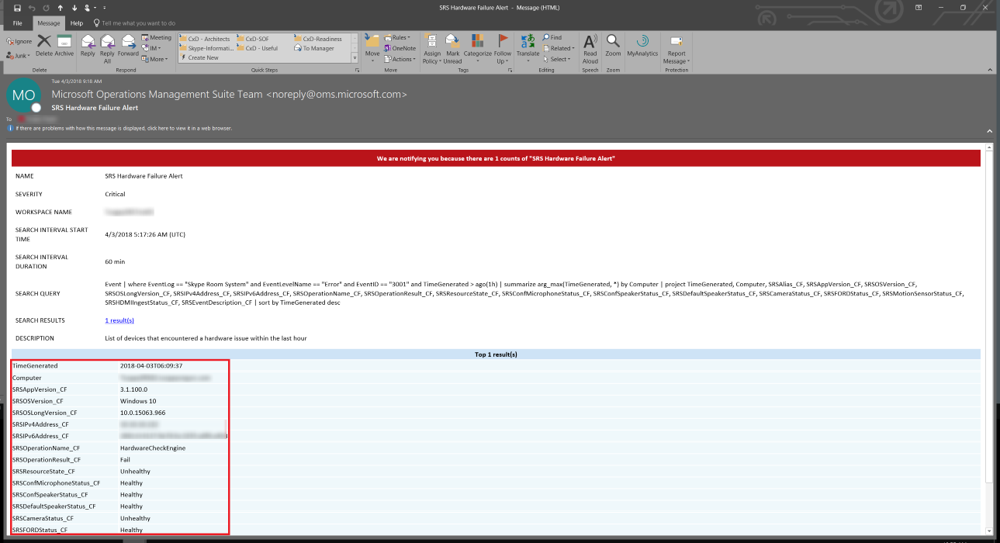

# <a name="deploy-skype-room-systems-v2-management-with-oms"></a>使用 OMS 部署 Skype 会议室系统 v2 管理

本文讨论如何设置和使用 Microsoft 操作管理套件部署 Skype 会议室系统 v2 设备的集成的端到端管理。

您可以配置 Microsoft 操作管理套件提供基本的遥测和通知将帮助您管理 Skype 会议室内设备。 随着您管理解决方案逐渐成熟，您可能决定部署其他数据和管理功能，以创建设备的可用性和性能的详细的视图。

按照本指南，您可以使用类似下面的示例仪表板获取设备可用性、 应用程序和硬件运行状况和 Skype 会议室系统 v2 应用程序版本分发报告的详细的状态。


你需要在高级别执行以下任务：


1.  [验证操作管理套件配置](with-oms.md#validate_OMS)
2.  [配置操作管理套件管理安装程序测试设备](with-oms.md#configure_test_devices)
3.  [映射自定义字段](with-oms.md#Custom_fields)
4.  [操作管理套件中定义的 Skype 会议室系统 v2 视图](with-oms.md#Define_Views)
5.  [定义通知](with-oms.md#Alerts)
6.  [配置所有设备的操作管理套件](with-oms.md#configure_all_devices)
7.  [配置其他操作管理套件解决方案](with-oms.md#Solutions)

> [!IMPORTANT]
> 使用最少配置操作管理套件可以监视运行 Windows 操作系统的计算机，但仍有一些需要在开始部署到所有 Skype 会议室的代理之前的 Skype 会议室系统 v2 特定步骤系统的设备。
> 因此，我们强烈建议您受控的安装和配置正确的顺序执行所有配置步骤。 最终结果的质量很大程度取决于的初始配置的质量。

## <a name="validate-operations-management-suite-configuration"></a>验证操作管理套件配置
<a name="validate_OMS"> </a>

您需要具有要开始从 Skype 会议室系统 v2 设备收集日志操作管理套件工作区。 工作区是使用其自己的数据存储库、 数据源和解决方案的唯一日志分析环境。 如果您已有现有日志分析工作区，您可能使用它来监视 Skype 会议室系统 v2 部署，或者您可以创建需要专用的日志分析工作区特定于您 Skype 会议室系统 v2 监控。

如果您需要创建新的日志分析工作区，请按照[创建 Azure 门户中的日志分析工作区](https://docs.microsoft.com/azure/log-analytics/log-analytics-quick-create-workspace)一文中的说明

> [!NOTE]
> 若要使用日志分析与操作管理套件，您需要具有活动的 Azure 订阅。 如果您没有 Azure 订阅，您可以创建[免费的试用订阅](https://azure.microsoft.com/free)作为起点。


### <a name="configure-operations-management-suite-to-collect-skype-room-systems-v2-event-logs"></a>配置操作管理套件收集 Skype 会议室系统 v2 事件日志

日志分析仅收集在设置中指定的 Windows 事件日志中的事件。 为每个日志中，会收集仅将所选的严重级别的事件。

您需要配置操作管理套件收集监视 Skype 会议室系统 v2 设备和应用程序状态所需的日志。 Skype 会议室系统 v2 设备使用**Skype 会议室系统**事件日志。

若要配置操作管理套件收集的 Skype 会议室系统 v2 事件，请参阅[日志分析中的 Windows 事件日志数据源](https://docs.microsoft.com/azure/log-analytics/log-analytics-data-sources-windows-events)


> [!IMPORTANT]
> **Skype 会议室系统**事件日志中，选择，然后选择**错误**、**警告**和**信息**复选框。

## <a name="configure-test-devices-for-operations-management-suite-setup"></a>配置操作管理套件安装程序测试设备
<a name="configure_test_devices"> </a>

您需要准备操作管理套件能够监视 Skype 会议室系统 v2 相关的事件。 启动时，您需要将操作管理套件代理部署到只是一个或两个 Skype 会议室系统 v2 设备物理访问并且具有这些测试设备生成一些数据，并将其推送到日志分析工作区。

### <a name="install-operations-management-suite-agents-to-test-devices"></a>安装到测试设备的操作管理套件代理

使用[到 Azure 中的日志分析服务的连接的 Windows 计算机](https://docs.microsoft.com/azure/log-analytics/log-analytics-agent-windows)中提供的说明，将操作管理套件代理部署到测试设备上。 本文提供有关部署监控代理的 Windows，获取操作管理套件*工作区 ID*和*主关键字*的说明，以获取 Skype 会议室系统 v2 设备的步骤的详细的信息连接到您的操作管理套件部署和步骤来验证代理连接到日志分析。

### <a name="generate-sample-skype-room-systems-events"></a>生成示例 Skype 会议室系统事件

操作管理套件代理部署到测试设备后，验证所需的事件日志数据收集日志分析。

1.  登录到[Microsoft 操作管理套件门户](https://aka.ms/omsportal)。

2.  列出由 Skype 会议室系统 v2 设备生成的事件：
    1.  转到**日志搜索**并使用查询来检索将具有自定义字段的记录。
    2.  示例查询：`Event | where Source == "SRS-App"`

3.  确保查询返回包含成功检测信号事件的日志记录。

4.  生成硬件问题，并验证的操作管理套件中记录所需的事件。
    1.  拔下测试 Skype 会议室系统 v2 系统上的外围设备之一。 这可能是照相机、 免提电话、 麦克风或前端聊天室显示
    2.  等待事件日志操作管理套件中填充的 10 分钟。
    3.  使用列表硬件错误事件查询：`Event | where EventID == 3001`

5.  生成应用程序问题，并验证的记录所需的事件。
    1.  修改 Skype 会议室系统 v2 应用程序配置，并键入正确的会话初始协议 (SIP) 地址中的密码对。
    2.  等待事件日志操作管理套件中填充的 10 分钟。
    3.  使用查询的列表应用程序错误事件：`Event | where EventID == 2001`

> [!IMPORTANT]
> 这些示例事件日志是必需的然后才能配置自定义字段。 不继续下一步，直到您已收集所需的事件日志。

## <a name="map-custom-fields"></a>映射自定义字段
<a name="Custom_fields"> </a>

使用自定义域从事件日志中提取特定的数据。 您需要定义将与您的图块数为单位、 仪表板视图和通知更高版本使用的自定义字段。 请参阅[日志分析中的自定义域](https://docs.microsoft.com/azure/log-analytics/log-analytics-custom-fields)和熟悉概念开始创建自定义域之前。

提取自定义域超出捕获的事件日志，请按照下列步骤：

1. 登录到[Microsoft 操作管理套件门户](https://aka.ms/omsportal)。

2. 列出由 Skype 会议室系统 v2 设备生成的事件：
   1.  转到**日志搜索**并使用查询来检索将具有自定义字段的记录。
   2.  示例查询：`Event | where Source == "SRS-App"`

3. 选择记录之一，选择向左，按钮并启动字段提取向导。

   

4. 突出显示您希望从 RenderedDescription 提取并提供字段标题的数据。 表 1 中提供了应使用的字段名称。

   

5. 使用*表 1*中显示的映射。 将自动添加操作管理套件**\_CF**时定义的新字段的字符串。

> [!IMPORTANT]
> 请记住 JSON 和操作管理套件的所有字段，都都区分大小写。
> 
> 下表列出了特别注意 EventID 复选框的状态。 确保您确认此复选框的操作管理套件成功提取自定义域值的状态。
> 
> 

**表 1**

| JSON 字段                   | OMS 自定义字段           | 事件 ID        |
|:-----------------------------|:---------------------------|:----------------|
| 说明                  | SRSEventDescription_CF     | 未选定    |
| ResourceState                | SRSResourceState_CF        | 未选定    |
| 操作名称                | SRSOperationName_CF        | 未选定    |
| OperationResult              | SRSOperationResult_CF      | 未选定    |
| OS                           | SRSOSVersion_CF            | 未选定    |
| OSVersion                    | SRSOSLongVersion_CF        | 未选定    |
| 别名                        | SRSAlias_CF                | 未选定    |
| DisplayName                  | SRSDisplayName_CF          | 未选定    |
| AppVersion                   | SRSAppVersion_CF           | 未选定    |
| IPv4Address                  | SRSIPv4Address_CF          | 未选定    |
| IPv6Address                  | SRSIPv6Address_CF          | 未选定    |
| 前面的聊天室显示状态 | SRSFORDStatus_CF           | 3001            |
| 摄像机状态                | SRSCameraStatus_CF         | 3001            |
| 会议麦克风状态 | SRSConfMicrophoneStatus_CF | 3001            |
| 会议扬声器状态    | SRSConfSpeakerStatus_CF    | 3001            |
| 默认扬声器状态       | SRSDefaultSpeakerStatus_CF | 3001            |
| 运动传感器状态         | SRSMotionSensorStatus_CF   | 3001            |
| HDMI 引入状态           | SRSHDMIIngestStatus_CF     | 3001            |


## <a name="define-the-skype-room-systems-v2-views-in-operations-management-suite"></a>操作管理套件中定义的 Skype 会议室系统 v2 视图
<a name="Define_Views"> </a>

收集数据并自定义字段映射后，您可以使用操作管理套件视图设计器开发包含各种平铺监视 Skype 会议室系统 v2 事件仪表板。 使用视图设计器创建以下图块。 有关详细信息，请参阅[使用视图设计器创建日志分析中的自定义视图](https://docs.microsoft.com/azure/log-analytics/log-analytics-view-designer)

> [!NOTE]
> 应可以正常运行仪表板图块完成本指南中前面的步骤。


### <a name="create-a-skype-room-systems-v2-dashboard-by-using-the-import-method"></a>使用的导入方法创建 Skype 会议室系统 v2 仪表板

可以导入的操作管理套件仪表板并启动立即监控您的设备。 执行以下步骤以导入仪表板：

1.  获取[SkypeRoomSystems_v2.omsview](https://download.microsoft.com/download/9/0/D/90D4826A-9FD2-47D2-B911-97BF1737F4F7/SkypeRoomSystems_v2.omsview)仪表板文件。
2.  登录到[Microsoft 操作管理套件门户](https://aka.ms/omsportal)。
3.  打开**视图设计器**。
4.  选择**导入**，，然后选择**SkypeRoomSystems_v2.omsview**文件。
5.  选择**保存**。

### <a name="create-a-skype-room-systems-v2-dashboard-manually"></a>手动创建 Skype 会议室系统 v2 仪表板

此外，您可以创建自己的仪表板并添加您想要监视的图块。

#### <a name="configure-the-overview-tile"></a>配置概述图块
1.  打开**视图设计器**。
2.  选择**概述图块**，并从库选择**两个数字**。
3.  名称平铺**Skype 会议室系统 v2**。
4.  定义**第一个图块**：<br>
    **图例：** 至少执行一次在上个月内发送检测信号的设备<br>
    **查询：**```Event | where EventLog == "Skype Room System" and TimeGenerated > ago(30d) | summarize TotalSRSDevices = dcount(Computer)```
5.  定义**第二个图块**：<br>
    **图例：** 发送检测信号的最后一个小时内的活动设备<br>
    **查询：**```Event | where EventLog == "Skype Room System" and SRSOperationName_CF == "Heartbeat" and TimeGenerated > ago(1h) | summarize TotalSRSDevices = dcount(Computer)```
6.  选择**应用**。

### <a name="create-a-tile-that-displays-active-devices"></a>创建活动设备将显示一个图块
1.  选择**视图仪表板**开始添加您的图块数为单位。
2.  从库中选择**号码和列表**
3.  定义**常规**属性：<br>
    **组标题：** 检测信号状态<br>
    **新组：** 选择
4.  定义**平铺**属性：<br>
    **图例：** 活动设备 （检测信号发送前 20 分钟内）<br>
    **图块查询：** ```Event | where EventLog == "Skype Room System" and SRSOperationName_CF == "Heartbeat" and TimeGenerated > ago(20m) | summarize AggregatedValue = count() by Computer | count```
5.  定义**列表**的属性：<br>
    **列表查询：**```Event | where EventLog == "Skype Room System" and SRSOperationName_CF == "Heartbeat" and TimeGenerated > ago(20m) | summarize TimeGenerated = max(TimeGenerated) by Computer | order by TimeGenerated```
6.  定义**列标题**：<br>
    **名称：** 显示名称<br>
    **值：** 最后一个检测信号
7.  定义**导航查询**。<br>
    ```search {selected item} | where EventLog == "Skype Room System" and SRSOperationName_CF == "Heartbeat" | summarize arg_max(TimeGenerated, *) by Computer | project TimeGenerated, Computer, SRSAlias_CF, SRSAppVersion_CF, SRSOSVersion_CF, SRSOSLongVersion_CF, SRSIPv4Address_CF, SRSIPv6Address_CF, SRSOperationName_CF, SRSOperationResult_CF, SRSResourceState_CF, SRSEventDescription_CF```
8.  选择**应用**，然后**关闭**。

### <a name="create-a-tile-that-displays-devices-that-have-connectivity-issues"></a>创建具有连接问题的设备将显示一个图块
1.  从库中，选择**号码和列表**，然后添加新的平铺。
2.  定义**常规**属性：<br>
    **组标题：** 将保留为空<br>
    **新组：** 未选定
3.  定义**平铺**属性：<br>
    **图例：** 非活动设备 （发送前 20 分钟内无检测信号消息）<br>
    **图块查询：** ```Event | where EventLog == "Skype Room System" and SRSOperationName_CF == "Heartbeat" | summarize LastHB = max(TimeGenerated) by Computer | where LastHB < ago(20m) | count```
4.  定义**列表**的属性：<br>
    **列表查询：**```Event | where EventLog == "Skype Room System" and SRSOperationName_CF == "Heartbeat" | summarize TimeGenerated = max(TimeGenerated) by Computer | where TimeGenerated < ago(20m) | order by TimeGenerated```
5.  定义**列标题**：<br>
    **名称：** 显示名称<br>
    **值：** 最后一个检测信号
6.  定义**导航查询**：<br>
    ```search {selected item} | where EventLog == "Skype Room System" and SRSOperationName_CF == "Heartbeat" | summarize arg_max(TimeGenerated, *) by Computer | project TimeGenerated, Computer, SRSAlias_CF, SRSAppVersion_CF, SRSOSVersion_CF, SRSOSLongVersion_CF, SRSIPv4Address_CF, SRSIPv6Address_CF, SRSOperationName_CF, SRSOperationResult_CF, SRSResourceState_CF, SRSEventDescription_CF```
7.  选择**应用**，然后**关闭**。

### <a name="create-a-tile-that-displays-devices-that-have-a-hardware-error"></a>创建具有硬件错误的设备将显示一个图块

1.  从库中，选择**号码和列表**，然后添加新的平铺。
2.  定义**常规**属性：<br>
    **组标题：** 硬件状态<br>
    **新组：** 选择
3.  定义**平铺**属性：<br>
    **图例：** 最后一个小时内遇到硬件错误的设备 <br>
    **图块查询：** ```Event | where EventLog == "Skype Room System" and EventLevelName == "Error" and EventID == "3001" and TimeGenerated > ago(1h) | summarize AggregatedValue = count() by Computer | count```
4.  定义**列表**的属性：<br>
    **列表查询：**```Event | where EventLog == "Skype Room System" and EventLevelName == "Error" and EventID == "3001" and TimeGenerated > ago(1h) | summarize TimeGenerated = max(TimeGenerated) by Computer```
5.  定义**列标题**：<br>
    **名称：** 显示名称<br>
    **值：** 最后一个错误
6.  定义**导航查询**：<br>
    ```search {selected item} | where EventLog == "Skype Room System" and EventID == 3001 and EventLevelName == "Error" | summarize arg_max(TimeGenerated, *) by Computer | project TimeGenerated, Computer, SRSAlias_CF, SRSAppVersion_CF, SRSOSVersion_CF, SRSOSLongVersion_CF, SRSIPv4Address_CF, SRSIPv6Address_CF, SRSOperationName_CF, SRSOperationResult_CF, SRSResourceState_CF, SRSConfMicrophoneStatus_CF, SRSConfSpeakerStatus_CF, SRSDefaultSpeakerStatus_CF, SRSCameraStatus_CF, SRSFORDStatus_CF, SRSMotionSensorStatus_CF, SRSHDMIIngestStatus_CF, SRSEventDescription_CF | sort by TimeGenerated desc```
7.  选择**应用**，然后**关闭**。

### <a name="create-a-tile-that-displays-skype-room-systems-v2-operating-system-versions"></a>创建显示 Skype 会议室系统 v2 操作系统版本拼贴

1.  从库中，选择**圆环和列表**，然后添加新的平铺。
2.  定义**常规**属性：<br>
    **组标题：** 操作系统 Syetem 详细信息 <br>
    **新组：** 选择
3.  定义**标头**属性：<br>
    **标题：** 操作系统版本<br>
    **副标题：** 运行特定操作系统版本的设备
4.  定义**圆环**属性：<br>
    **查询：**```Event | where EventLog == "Skype Room System" and SRSOperationName_CF == "Heartbeat" | summarize OS_Version = max(SRSOSLongVersion_CF) by Computer | summarize AggregatedValue = count() by OS_Version | sort by OS_Version asc```<br>
    **使文本居中：** 设备<br>
    **操作：** Sum
5.  定义**列表**的属性。<br>
    **列表查询：**```Event | where EventLog == "Skype Room System" and SRSOperationName_CF == "Heartbeat" | summarize SRSOSLongVersion_CF = max(SRSOSLongVersion_CF) by Computer | sort by Computer asc```<br>
    **隐藏图：** 选择<br>
    **启用迷你图：** 未选定
6.  定义**列标题**。<br>
    **名称：** 显示名称<br>
    **值：** 将保留为空
7.  定义**导航查询**。<br>
    ```search {selected item} | where EventLog == "Skype Room System" and SRSOperationName_CF == "Heartbeat" | summarize arg_max(TimeGenerated, *) by Computer | project TimeGenerated, Computer, SRSDisplayName_CF, SRSAlias_CF, SRSAppVersion_CF, SRSOSVersion_CF, SRSOSLongVersion_CF, SRSIPv4Address_CF, SRSIPv6Address_CF, SRSOperationName_CF, SRSOperationResult_CF, SRSResourceState_CF, SRSEventDescription_CF```
8.  选择**应用**，然后**关闭**。

### <a name="create-a-tile-that-displays-skype-room-systems-v2-application-versions"></a>创建显示 Skype 会议室系统 v2 应用程序版本拼贴

1.  从库中，选择**圆环和列表**，然后添加新的平铺。
2.  定义**常规**属性：<br>
    **组标题：** Skype 会议室系统 v2 应用程序的详细信息 <br>
    **新组：** 选择
3.  定义**标头**属性：<br>
    **标题：** 应用程序版本<br>
    **副标题：** 设备运行特定应用程序版本
4.  定义**圆环**属性：<br>
    **查询：**```Event | where EventLog == "Skype Room System" and SRSOperationName_CF == "Heartbeat" | summarize App_Version = max(SRSAppVersion_CF) by Computer | summarize AggregatedValue = count() by App_Version | sort by App_Version asc```<br>
    **使文本居中：** 设备<br>
    **操作：** Sum
5.  定义**列表**的属性。<br>
    **列表查询：**```Event | where EventLog == "Skype Room System" and SRSOperationName_CF == "Heartbeat" | summarize SRSAppVersion_CF = max(SRSAppVersion_CF) by Computer | sort by Computer asc```<br>
    **隐藏图：** 选择<br>
    **启用迷你图：** 未选定
6.  定义**列标题**。<br>
    **名称：** 显示名称<br>
    **值：** 将保留为空
7.  定义**导航查询**。<br>
    ```search {selected item} | where EventLog == "Skype Room System" and SRSOperationName_CF == "Heartbeat" | summarize arg_max(TimeGenerated, *) by Computer | project TimeGenerated, Computer, SRSAlias_CF, SRSAppVersion_CF, SRSOSVersion_CF, SRSOSLongVersion_CF, SRSIPv4Address_CF, SRSIPv6Address_CF, SRSOperationName_CF, SRSOperationResult_CF, SRSResourceState_CF, SRSEventDescription_CF```
8.  选择**应用**，然后**关闭**。

### <a name="create-a-tile-that-displays-devices-that-have-an-application-error"></a>创建具有应用程序错误的设备将显示一个图块

1.  从库中，选择**号码和列表**，然后添加新的平铺。
2.  定义**常规**属性。<br>
    **组标题：** 将保留为空<br>
    **新组：** 未选定
3.  定义**平铺**属性。<br>
    **图例：** 设备所遇最后一个小时内的应用程序错误<br>
    **图块查询：** ```Event | where EventLog == "Skype Room System" and EventLevelName == "Error" and EventID == "2001" and TimeGenerated > ago(1h) | summarize AggregatedValue = count() by Computer | count```
4.  定义**列表**的属性。<br>
    **列表查询：**```Event | where EventLog == "Skype Room System" and EventLevelName == "Error" and EventID == "2001" and TimeGenerated > ago(1h) | summarize TimeGenerated = max(TimeGenerated) by Computer | order by TimeGenerated```
5.  定义**列标题**。<br>
    **名称：** 显示名称<br>
    **值：** 最后一个错误
6.  定义**导航查询**。<br>
    ```search {selected item} | where EventLog == "Skype Room System" and EventID == 2001 and EventLevelName == "Error" | summarize arg_max(TimeGenerated, *) by Computer | project TimeGenerated, Computer, SRSAlias_CF, SRSAppVersion_CF, SRSOSVersion_CF, SRSOSLongVersion_CF, SRSIPv4Address_CF, SRSIPv6Address_CF, SRSOperationName_CF, SRSOperationResult_CF, SRSResourceState_CF, SRSEventDescription_CF | sort by TimeGenerated desc```
7.  选择**应用**，然后**关闭**。

### <a name="create-a-tile-that-displays-devices-that-have-been-restarted"></a>创建显示已重新启动设备拼贴

1.  从库中，选择**号码和列表**，然后添加新的平铺。
2.  定义**常规**属性。<br>
    **组标题：** 将保留为空<br>
    **新组：** 未选定
3.  定义**平铺**属性。<br>
    **图例：** 其中已重新启动应用程序中的最后一个 24 小时和重新启动次数的设备<br>
    **图块查询：** ```Event | where EventLog == "Skype Room System" and EventID == "4000" and TimeGenerated > ago(24h) | summarize AggregatedValue = count() by Computer | count```
4.  定义**列表**的属性。<br>
    **列表查询：**```Event | where EventLog == "Skype Room System" and EventID == "4000" and TimeGenerated > ago(24h) | order by TimeGenerated | summarize AggregatedValue = count(EventID) by Computer```
5.  定义**列标题**。<br>
    **名称：** 显示名称<br>
    **值：** 重新启动次数
6.  定义**导航查询**。<br>
    ```search {selected item} | where EventLog == "Skype Room System" and EventID == "4000" and TimeGenerated > ago(24h) | project TimeGenerated, Computer, SRSAlias_CF, SRSAppVersion_CF, SRSOSVersion_CF, SRSOSLongVersion_CF, SRSIPv4Address_CF, SRSIPv6Address_CF, SRSOperationName_CF, SRSOperationResult_CF, SRSResourceState_CF, SRSEventDescription_CF```
7.  选择**应用**，然后**关闭**。
8.  选择**保存**以保存您的仪表板。

现在您已完成创建您的视图。

您可以使用 Microsoft 操作管理套件门户或[Windows Phone](https://www.microsoft.com/en-us/store/p/microsoft-operations-management-suite/9wzdncrfjz2r)、 [iOS](https://itunes.apple.com/us/app/microsoft-operations-management-suite/id1042424859)或[Android](https://play.google.com/store/apps/details?id=com.microsoft.operations.AndroidPhone)的操作管理套件移动客户端访问您的视图。

## <a name="configure-alerts-in-operations-management-suite"></a>在操作管理套件中配置警报
<a name="Alerts"></a>时 Skype 会议室系统 v2 设备遇到的问题、 Microsoft 操作管理套件可以提升警报通知问题的详细信息的管理员。

操作管理套件包括通过计划的日志搜索定期运行的内置警报机制。 如果日志搜索的结果与某个特定条件匹配，则创建警报的记录。


规则可以自动运行主动通知您通知或调用其他进程的一个或多个操作。 操作管理套件通知可能的选项包括：
-   发送电子邮件
-   调用外部进程通过 HTTP POST 请求
-   Azure 自动化服务中启动 runbook

请参阅[了解日志分析中的通知](https://docs.microsoft.com/azure/log-analytics/log-analytics-alerts)，以详细了解如何操作管理套件中的通知。

> [!NOTE]
> Skype 会议室系统 v2 设备生成硬件或应用程序错误时，以下示例将发送电子邮件通知。


### <a name="configure-an-email-alert-for-skype-room-systems-v2-hardware-issues"></a>配置电子邮件通知 Skype 会议室系统 v2 硬件问题

配置通知的规则，检查的最后一个小时内过硬件问题的 Skype 会议室系统 v2 设备。
1.  登录到[Microsoft 操作管理套件门户](https://aka.ms/omsportal)。

2.  选择**日志搜索**。

3.  输入以下查询，，，然后选择**运行**。<br>
    ```
    Event
    | where EventLog == "Skype Room System" and EventLevelName == "Error" and EventID == "3001" and TimeGenerated > ago(1h)
    | summarize arg_max(TimeGenerated, *) by Computer
    | project TimeGenerated, Computer, SRSAlias_CF, SRSAppVersion_CF, SRSOSVersion_CF, SRSOSLongVersion_CF, SRSIPv4Address_CF, SRSIPv6Address_CF, SRSOperationName_CF, SRSOperationResult_CF, SRSResourceState_CF, SRSConfMicrophoneStatus_CF, SRSConfSpeakerStatus_CF, SRSDefaultSpeakerStatus_CF, SRSCameraStatus_CF, SRSFORDStatus_CF, SRSMotionSensorStatus_CF, SRSHDMIIngestStatus_CF, SRSEventDescription_CF
    |sort by TimeGenerated desc
    ```

4.  执行查询后，选择**通知**。 这将打开**添加通知规则**页。

5.  使用下面的信息配置通知设置：<br>
    **规则名称：** Skype 会议室系统 v2 硬件故障警报<br>
    **说明：** 遇到硬件问题的最后一个小时内的设备的列表<br>
    **严重性：** 关键<br>
    **查询：** 使用预填充的搜索查询<br>
    **时间段：** 1 小时<br>
    **通知的频率：** 1 小时<br>
    **的结果数：** 大于 0<br>
    **电子邮件主题：** Skype 会议室系统 v2 硬件故障警报<br>
    **收件人：** 包括使用分号作为分隔符的电子邮件地址<br>

6.  选择**保存**。

### <a name="configure-an-email-alert-for-skype-room-systems-v2-application-issues"></a>配置电子邮件通知 Skype 会议室系统 v2 应用程序问题

配置通知的规则，来检查 Skype 会议室系统 v2 设备的最后一个小时内已应用程序问题。
1.  选择**日志搜索**。

2.  输入以下查询，，，然后选择**运行**。<br>
    ```
    Event
    | where EventLog == "Skype Room System" and EventLevelName == "Error" and EventID == "2001" and TimeGenerated > ago(10h)
    | summarize arg_max(TimeGenerated, *) by Computer
    | project TimeGenerated, Computer, SRSAlias_CF, SRSAppVersion_CF, SRSOSVersion_CF, SRSOSLongVersion_CF, SRSIPv4Address_CF, SRSIPv6Address_CF, SRSOperationName_CF, SRSOperationResult_CF, SRSResourceState_CF, SRSEventDescription_CF
    | sort by TimeGenerated desc
    ```

3.  执行查询后，选择**通知**。 这将打开**添加通知规则**页。

4.  使用下面的信息配置通知设置：<br>
    **规则名称：** Skype 会议室系统 v2 应用程序失败通知<br>
    **说明：** 遇到的应用程序问题的最后一个小时内的设备的列表<br>
    **严重性：** 关键<br>
    **查询：** 使用预填充的搜索查询<br>
    **时间段：** 1 小时<br>
    **通知的频率：** 1 小时<br>
    **的结果数：** 大于 0<br>
    **电子邮件主题：** Skype 会议室系统 v2 应用程序失败通知<br>
    **收件人：** 包括使用分号作为分隔符的电子邮件地址

5.  选择**保存**。

现在您已完成定义通知。 您可以使用上面的示例定义其他通知。

生成警报时，您将获取电子邮件，其中列出遇到问题的最后一个小时内的设备。



使用通知设置页面以修改现有警报配置，或要禁用或删除一条通知。


> [!NOTE]
> 您可能需要使用 Azure 门户网站添加或修改操作管理套件通知，如果您的操作管理套件工作区配置到 Azure 扩展操作管理套件通知。 有关详细信息，请参阅[从 OMS 门户到 Azure 扩展通知](https://docs.microsoft.com/azure/monitoring-and-diagnostics/monitoring-alerts-extend)。

## <a name="configure-all-devices-for-operations-management-suite"></a>配置所有设备的操作管理套件
<a name="configure_all_devices"></a>配置仪表板和通知后，您可以设置和所有以完成监控部署的 Skype 会议室系统 v2 设备上配置操作管理套件代理。

尽管您可以安装，并在每个设备上手动配置操作管理套件代理，但强烈建议您利用现有软件部署工具和方法。

如果您首次构建 Skype 会议室系统 v2 设备，您可能想要包括的生成过程一部分的操作管理套件代理安装和配置步骤。 有关详细信息，请参阅[安装使用命令行的代理](https://docs.microsoft.com/azure/log-analytics/log-analytics-agent-windows#install-the-agent-using-the-command-line)。

### <a name="deploying-operations-management-suite-agents-by-using-a-group-policy-object"></a>使用组策略对象部署操作管理套件代理

如果您已部署 Skype 会议室系统 v2 设备实现操作管理套件之前，您可以使用提供的脚本设置和使用 Active Directory 组策略配置代理。

1.  创建共享的网络路径，并向**域计算机**组授予读取访问权限。

2.  下载 64 位版本的操作管理套件代理用于 Windows 的从<https://go.microsoft.com/fwlink/?LinkID=517476>

3.  安装程序包的内容解压到网络共享。
    1.  打开命令提示符窗口，并执行**MMASetup AMD64.exe /c**
    2.  指定您刚创建的共享和提取内容。

4.  创建新的组策略对象，并将其分配给组织单位 Skype 会议室系统 v2 计算机帐户的位置。

5.  配置 PowerShell 执行策略：
    1.  编辑新创建的组策略对象，并导航到计算机配置\\策略\\管理模板\\Windows 组件\\Windows PowerShell
    2.  启用**脚本执行打开**并**允许本地**脚本设置**执行策略**。

6.  配置启动脚本：
    1.  复制以下脚本并将其保存为安装 OMSAgent.ps1。
    2.  修改 WorkspaceId、 WorkspaceKey 和 SetupPath 参数，以匹配您的配置。
    3.  编辑相同的组策略对象，并导航到计算机配置\\策略\\Windows 设置\\脚本 （启动/关机）
    4.  双击可选择**启动**中，，然后选择**PowerShell 脚本**。
    5.  选择**显示文件**，然后将**安装 OMSAgent.ps1**文件复制到该文件夹。
    6.  选择**添加**，然后**浏览**。
    7.  选择您刚复制的 ps1 脚本。

7.  Skype 会议室系统 v2 设备应安装和配置第二个重新启动 Microsoft 监控代理。


~~~
```
# Install-OMSAgent.ps1
<#
Date:        04/20/2018
Script:      Install-OMSAgent.ps1
Version:     1.0
#>

# Set the parameters
$WorkspaceId = "<your workspace id>"
$WorkspaceKey = "<your workspace key>"
$SetupPath = "\\Server\Share"

$SetupParameters = "/qn NOAPM=1 ADD_OPINSIGHTS_WORKSPACE=1 OPINSIGHTS_WORKSPACE_AZURE_CLOUD_TYPE=0 OPINSIGHTS_WORKSPACE_ID=$WorkspaceId OPINSIGHTS_WORKSPACE_KEY=$WorkspaceKey AcceptEndUserLicenseAgreement=1"

# $SetupParameters = $SetupParameters + " OPINSIGHTS_PROXY_URL=<Proxy server URL> OPINSIGHTS_PROXY_USERNAME=<Proxy server username> OPINSIGHTS_PROXY_PASSWORD=<Proxy server password>"

# Start PowerShell logging
Start-Transcript -Path C:\OMSAgentInstall.Log

# Check if the Microsoft Monitoring Agent is installed
$mma = New-Object -ComObject 'AgentConfigManager.MgmtSvcCfg'

# Check if the Microsoft Monitoring agent is installed
if (!$mma)
{
    #Install agent
    Start-Process -FilePath "$SetupPath\Setup.exe" -ArgumentList $SetupParameters -ErrorAction Stop -Wait
}

# Check if the agent has a valid configuration
$CheckOMS = $mma.GetCloudWorkspace($WorkspaceId).AgentId
if (!$CheckOMS)
{
    # Apply new configuration
    $mma.AddCloudWorkspace($WorkspaceId, $WorkspaceKey)
    $mma.ReloadConfiguration()
}

Stop-Transcript

```
~~~

> [!NOTE]
> 当您需要重新配置代理、 将其移至不同的工作区中，或在初始安装后修改代理设置时，您可以参考文章[管理和维护日志分析代理](https://docs.microsoft.com/azure/log-analytics/log-analytics-agent-manage)。

## <a name="additional-solutions"></a>其他解决方案
<a name="Solutions"> </a>

操作管理套件提供了内置解决方案通过其[解决方案库](https://docs.microsoft.com/azure/log-analytics/log-analytics-add-solutions)来进一步帮助监视您的环境。 我们强烈建议将[警报管理](https://docs.microsoft.com/azure/log-analytics/log-analytics-solution-alert-management)和[代理运行状况](https://docs.microsoft.com/azure/operations-management-suite/oms-solution-agenthealth)解决方案添加到您的操作管理套件工作区。


> [!NOTE]
> 代理运行状况解决方案可帮助您确定您的环境中已过时或断开操作管理套件代理和警报管理解决方案提供了有关已引发的给定期间内的警报的详细信息。

## <a name="see-also"></a>另请参阅

[使用 OMS 规划 Skype 会议室系统 v2 管理](../../plan-your-deployment/clients-and-devices/oms-management.md)

[使用 OMS 管理 Skype 会议室系统 v2 设备](../../manage/skype-room-systems-v2/oms.md)
