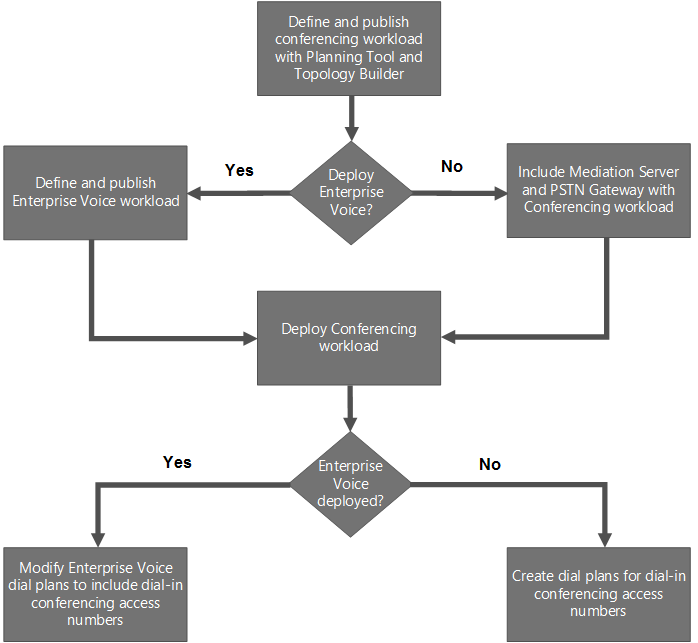

# 在 Skype for Business Server

**摘要：** 阅读本主题，了解如何在 Skype for Business Server 中部署会议。

Skype for Business Server 中提供四种类型的会议：Web 会议、音频和视频 (A/V) 会议、电话拨入式会议和即时消息 (IM) 会议。 可以选择启用所有会议类型，也可以选择仅使用一种类型，具体取决于你的需求。

在部署Skype for Business Server时，会自动部署 IM 会议功能。 使用拓扑生成器创建和发布新拓扑时，可指定是否部署 Web、A/V 和电话拨入式会议，如以下清单中所述：

- [Web 和音频/视频会议的部署清单](deploy-conferencing.md#BKMK_ChecklistWebConferencing)

- [电话拨入式会议部署流程图和清单](deploy-conferencing.md#BKMK_DialinConferencing)

在部署会议之前，应阅读以下规划主题：

- [规划会议Skype for Business Server](../../plan-your-deployment/conferencing/conferencing.md)

- [会议中的硬件和软件Skype for Business Server](../../plan-your-deployment/conferencing/hardware-and-software-requirements.md)

- [规划会议会议拓扑Skype for Business Server](../../plan-your-deployment/conferencing/conferencing-topology.md)

- [规划电话拨入式会议Skype for Business Server](../../plan-your-deployment/conferencing/dial-in-conferencing.md)

- [在会议中规划大型Skype for Business Server](../../plan-your-deployment/conferencing/large-meetings.md)

## Web 和音频/视频会议的部署清单

下表概述了将 Web 和音频/视频会议部署到现有拓扑中所需的步骤。 包含指向相关规划和过程文档的链接。

|**阶段**|**步骤**|**角色和组成员身份**|**文档**|
|:-----|:-----|:-----|:-----|
|**安装所需的硬件和软件**   |会议在前端池的前端服务器上运行，Standard Edition服务器。 请参阅前端服务器的服务器和环境要求。    如果要启用 Web 会议，则需要确保 Skype for Business Server 可以与 Office Web Apps Server 通信，该服务器用于处理 PowerPoint 演示文稿的共享和呈现。    对于 Web 会议，还需要指定要用作文件存储的文件共享。    是否要允许具有外部客户端Skype for Business用户加入会议？ 如果是这样，则需要部署边缘服务器。    |属于本地 Administrators 组成员的域用户    | [Skype for Business Server 2019 的服务器要求](../../../SfBServer2019/plan/system-requirements.md)   [Skype for Business Server 2015 的服务器要求](../../plan-your-deployment/requirements-for-your-environment/server-requirements.md)   [2015 年 Skype for Business Server 环境要求](../../plan-your-deployment/requirements-for-your-environment/environmental-requirements.md)   [会议中的硬件和软件Skype for Business Server](../../plan-your-deployment/conferencing/hardware-and-software-requirements.md)   [配置与 Office Web Apps Server Skype for Business Server](office-web-app-server.md)   [在文件创建Skype for Business Server](../../deploy/install/create-a-file-share.md)   [Plan for Edge Server deployments in Skype for Business Server 2015](../../plan-your-deployment/edge-server-deployments/edge-server-deployments.md)   [在 Skype for Business Server 2015 中部署边缘服务器](../../deploy/deploy-edge-server/deploy-edge-server.md)   |
|**创建相应的内部拓扑以支持会议**   |您需要运行拓扑生成器以将会议添加到拓扑，然后发布拓扑。    |要定义拓扑，需具有本地 Users 组成员的帐户    要发布拓扑，需要一个帐户，该帐户是 Domain Admins 组和 RTCUniversalServerAdmins 组的成员，并且对要用于 Skype for Business Server 文件存储 (的文件共享具有完全控制权限 (读/写/修改) ，以便拓扑生成器可以配置所需的 DACLs)     |[在部署中新建和发布Skype for Business Server](../../deploy/install/create-and-publish-new-topology.md)   |
|**配置会议策略和配置设置**   |使用Skype for Business Server控制面板或Skype for Business Server命令行管理程序配置会议策略和配置设置。    |RTCUniversalServerAdmins (Windows PowerShell仅) CSAdministrator 角色或将用户分配给 CSAdministrator 角色    |[管理会议策略Skype for Business Server](../../manage/conferencing/conferencing-policies.md)   [管理会议配置Skype for Business Server](../../manage/conferencing/meeting-configuration-settings.md)   [New-CsConferencingPolicy](/powershell/module/skype/new-csconferencingpolicy?view=skype-ps)   [Set-CsConferencingPolicy](/powershell/module/skype/set-csconferencingpolicy?view=skype-ps)   [New-CsConferencingConfiguration](/powershell/module/skype/new-csconferencingconfiguration?view=skype-ps)   [Set-CsConferencingConfiguration](/powershell/module/skype/set-csconferencingconfiguration?view=skype-ps)   [New-CsMeetingConfiguration](/powershell/module/skype/new-csmeetingconfiguration?view=skype-ps)   [Set-CsMeetingConfiguration](/powershell/module/skype/set-csmeetingconfiguration?view=skype-ps)   |

## 电话拨入式会议部署流程图和清单

 电话拨入式会议允许用户从公用电话交换网和 PSTN (拨入) 音频/视频会议。

电话拨入式会议所需的某些组件也用于企业语音。 例如，如果要部署 企业语音，则还必须部署中介服务器和 PSTN 网关-电话拨入式会议所需的组件。 因此，如何部署电话拨入式会议取决于是否还要部署企业语音解决方案。

电话拨入式会议流程图显示了必须执行的步骤，具体取决于您是否还要部署企业语音解决方案。 流程图下面的表概述了部署电话拨入式会议所需步骤和推荐步骤。 此外，还包括指向相关规划和过程文档的链接。 有关规划完整解决方案企业语音，请参阅在 Skype for Business Server 中规划企业语音[解决方案](../../plan-your-deployment/enterprise-voice-solution/enterprise-voice-solution.md)。

**电话拨入式会议流程图**

**电话拨入式会议部署清单**

|**阶段**|**步骤**|**角色和组成员身份**|**文档**|
|:-----|:-----|:-----|:-----|
|**安装所需的硬件和软件**   | 会议在前端池的前端服务器上运行，Standard Edition服务器。 请参阅前端服务器的服务器和环境要求。    在配置电话拨入式会议之前，需要确保安装了以下内容：    中介服务器    PSTN 网关    统一通信应用程序服务 (UCAS)（称为“应用程序服务”）    会议助理应用程序    会议通知应用程序   |属于本地 Administrators 组成员的域用户    |[Skype for Business Server 2015 的服务器要求](../../plan-your-deployment/requirements-for-your-environment/server-requirements.md)   [2015 年 Skype for Business Server 环境要求](../../plan-your-deployment/requirements-for-your-environment/environmental-requirements.md)   [会议中的硬件和软件Skype for Business Server](../../plan-your-deployment/conferencing/hardware-and-software-requirements.md)   [规划电话拨入式会议Skype for Business Server](../../plan-your-deployment/conferencing/dial-in-conferencing.md)   [中介服务器组件Skype for Business Server](../../plan-your-deployment/enterprise-voice-solution/mediation-server.md)   [在拓扑生成器中部署中介Skype for Business Server](../../deploy/deploy-enterprise-voice/deploy-a-mediation-server.md)   [在拓扑生成器中定义Skype for Business Server](../../deploy/deploy-enterprise-voice/define-a-gateway.md)   |
|**创建包含会议工作负荷（包括中介服务器和 PSTN 网关）的拓扑，并部署前端池或Standard Edition服务器**   |1. 运行拓扑生成器以配置拓扑。 配置拓扑时，请选择电话拨入式会议选项。    2. 发布拓扑并部署前端池或Standard Edition服务器。    3. 如有必要，创建独立的中介服务器并将其与 PSTN 网关关联。    **注意：** 只有在未部署中介服务器企业语音中介服务器与前端服务器或 Standard Edition 服务器并Enterprise Edition此步骤。 如果部署企业语音，则安装并配置中介服务器和 PSTN 网关作为部署企业语音一部分。 如果并并中介服务器，则作为前端池或前端服务器部署的一部分安装和配置Standard Edition服务器。   |Domain Admins    RTCUniversalServerAdmins    管理员    |[在部署中新建和发布Skype for Business Server](../../deploy/install/create-and-publish-new-topology.md)   [在拓扑生成器中部署中介Skype for Business Server](../../deploy/deploy-enterprise-voice/deploy-a-mediation-server.md)   [在拓扑生成器中定义Skype for Business Server](../../deploy/deploy-enterprise-voice/define-a-gateway.md)   |
|**配置拨号计划**   |拨号计划是一组电话号码规范化规则，它将从特定位置拨打的电话号码转换为单一的标准 (E.164) 格式，以便进行电话授权和呼叫路由。 从不同位置拨打的同一电话号码可以基于各自的拨号计划针对每个具体位置解析为不同的 E.164 号码。 如果部署企业语音，请设置拨号计划作为该部署的一部分，并且需要确保拨号计划也适合电话拨入式会议。 如果未部署企业语音，则需要为电话拨入式会议设置拨号计划。    使用Skype for Business Server控制面板Skype for Business Server命令行管理程序设置拨号计划，如下所示：    1. 创建一个或多个拨号计划以路由拨入访问电话号码。    2. 为每个池分配默认拨号计划。 将“电话拨入式会议区域”设为应用拨号计划的地理位置。 该区域会将拨号计划与拨入访问号码相关联。   |RTCUniversalServerAdmins    CsVoiceAdministrator    CsServerAdministrator    CsAdministrator    |[配置电话拨入式会议Skype for Business Server](dial-in-conferencing.md)   [在拨号计划中创建或修改Skype for Business Server](../../deploy/deploy-enterprise-voice/dial-plans.md)   [New-CsDialPlan](/powershell/module/skype/new-csdialplan?view=skype-ps)   |
|**确保为拨号计划分配区域**   |运行 **Get-CsDialPlan** 和 **Set-CsDialPlan** cmdlet，以确保所有拨号计划都分配有区域。   |RTCUniversalServerAdmins    CsVoiceAdministrator    CsServerAdministrator    CsAdministrator    |[配置电话拨入式会议Skype for Business Server](dial-in-conferencing.md)   [在拨号计划中创建或修改Skype for Business Server](../../deploy/deploy-enterprise-voice/dial-plans.md)   [Get-CsDialPlan](/powershell/module/skype/get-csdialplan?view=skype-ps)   [Set-CsDialPlan](/powershell/module/skype/set-csdialplan?view=skype-ps)   |
|**配置会议策略以支持电话拨入式会议**   | 使用Skype for Business Server控制面板或Skype for Business Server命令行管理程序配置 **会议策略** 设置。 指定：    是否启用 PSTN 会议拨入。    用户能否邀请匿名参与者。    未经身份验证的用户能否通过拨出式电话加入会议。通过拨出式电话，会议服务器会呼叫用户，用户接听电话即可加入会议。  |RTCUniversalServerAdmins    CsServerAdministrator    CsAdministrator    |[管理会议策略Skype for Business Server](../../manage/conferencing/conferencing-policies.md)   [New-CsConferencingPolicy](/powershell/module/skype/new-csconferencingpolicy?view=skype-ps)   [Set-CsConferencingPolicy](/powershell/module/skype/set-csconferencingpolicy?view=skype-ps)   |
|**配置拨入访问号码**   |使用 Skype for Business Server 控制面板或 Skype for Business Server 命令行管理程序 设置用户为拨入会议而呼叫的拨入访问号码，并指定将访问号码与相应的拨号计划相关联的区域。 组织者拨号计划指定的区域的前三个访问号码包含在会议邀请中。 "电话拨入式会议"页面上提供了所有设置号码。    **注意：** 创建拨入访问号码后，可以使用 **Set-CsDialInConferencingAccessNumber** cmdlet 修改 Active Directory 联系对象的 显示名称，以便用户可以更轻松地识别正确的访问号码。   |RTCUniversalServerAdmins    CsServerAdministrator    CsAdministrator    |[在拨号计划中创建或修改Skype for Business Server](../../deploy/deploy-enterprise-voice/dial-plans.md)   [管理电话拨入式会议访问号码Skype for Business Server](../../manage/conferencing/access-numbers.md)   [New-CsDialInConferencingAccessNumber](/powershell/module/skype/new-csdialinconferencingaccessnumber?view=skype-ps)   [Set-CsDialInConferencingAccessNumber](/powershell/module/skype/set-csdialinconferencingaccessnumber?view=skype-ps)   |
|**为用户帐户分配线路 URI**   |使用Skype for Business Server控制面板Skype for Business Server命令行管理程序将电话线路 **URI** 配置为唯一的规范化电话号码 (例如 tel：+14255550200) 。   |RTCUniversalServerAdmins    CsAdministrator    CsUserAdministrator    |[为用户帐户分配线路 URI](dial-in-conferencing.md#BKMK_AssignaLineURI)   |
|**（可选）验证或修改用户个人标识号 (PIN) 要求**   |使用Skype for Business Server控制面板或Skype for Business Server命令行管理程序查看或修改会议 **PIN 策略**。 可以指定最小 PIN 长度、最大登录尝试次数、PIN 到期时间以及是否允许使用通用模式。    |RTCUniversalServerAdmins    CsServerAdministrator    CsAdministrator    |[管理电话拨入式会议在Skype for Business Server](../../manage/conferencing/pin-policies.md)   [Get-CsPinPolicy](/powershell/module/skype/get-cspinpolicy?view=skype-ps)   [Set-CsPinPolicy](/powershell/module/skype/set-cspinpolicy?view=skype-ps)   |
|**（可选）修改 DTMF 命令的键映射**   |使用 **Set-CsDialinConferencingDtmfConfiguration** cmdlet 可修改用于双音多频 (DTMF) 命令的键，参与者可以使用这些命令控制会议设置 (例如静音和取消静音，或者锁定和解锁) 。   |RTCUniversalServerAdmins    CsServerAdministrator    CsAdministrator    |[在部署中管理 DTMF 命令的Skype for Business Server](../../manage/conferencing/key-mapping-for-dtmf-commands.md)   [Set-CsDialInConferencingDtmfConfiguration](/powershell/module/skype/set-csdialinconferencingdtmfconfiguration?view=skype-ps)   |
|**（可选）修改会议加入和离开通知行为**   |使用 **Set-CsDialinConferencingConfiguration** 更改参与者加入和离开会议时通知的工作方式。   |RTCUniversalServerAdmins    CsServerAdministrator    CsAdministrator    |[管理会议加入和离开Skype for Business Server](../../manage/conferencing/join-and-leave-announcements.md)   [Set-CsDialInConferencingConfiguration](/powershell/module/skype/set-csdialinconferencingconfiguration?view=skype-ps)   |
|**(建议) 配置会议目录**   |使用 **New-CsConferenceDirectory** cmdlet 为池中的每 999 个用户创建一个会议目录。   |RTCUniversalServerAdmins    |[ (建议) 会议目录](/previous-versions/office/lync-server-2013/recommended-create-conference-directories)   [New-CsConferenceDirectory](/powershell/module/skype/new-csconferencedirectory?view=skype-ps)   |
|**（可选）验证电话拨入式会议设置**   |使用 **Get-CsDialinConferencingAccessNumber** cmdlet 搜索具有未被任何访问号码使用的电话拨入式会议区域的拨号计划，以及尚未分配区域的访问号码。   |RTCUniversalServerAdmins    CsServerAdministrator    CsAdministrator    CsViewOnlyAdministrator    CsHelpDesk    |[配置电话拨入式会议Skype for Business Server](dial-in-conferencing.md)   [测试电话拨入式会议Skype for Business Server](../../manage/conferencing/tests.md)   [Get-CsDialInConferencingAccessNumber](/powershell/module/skype/get-csdialinconferencingaccessnumber?view=skype-ps)   |
|**（可选）验证电话拨入式会议**   |使用 **Test-CsDialInConferencing** cmdlet 测试指定池的访问号码是否正常工作。   |RTCUniversalServerAdmins    CsServerAdministrator    CsAdministrator    |[测试电话拨入式会议Skype for Business Server](../../manage/conferencing/tests.md)   [Test-CsDialInConferencing](/powershell/module/skype/test-csdialinconferencing?view=skype-ps)   |
|**（可选）欢迎用户参加电话拨入式会议并设置初始 PIN**   |使用 **Set-CsPinSendCAWelcomeMail** 脚本设置用户的初始 PIN，并发送包含初始 PIN 的欢迎电子邮件和指向电话拨入式会议 设置 页面的链接。   |RTCUniversalServerAdmins    |[向电话拨入用户发送欢迎电子邮件Skype for Business Server](../../manage/conferencing/welcome-emails.md)   |