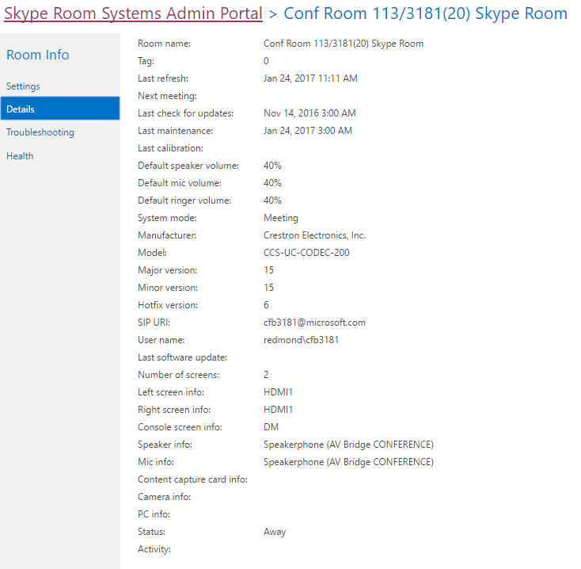

# <a name="deploy-srs-v1-administrative-web-portal-in-skype-for-business-server"></a>在 Skype for Business Server 中部署 SRS v1 管理 Web 门户

Skype for Business Server Skype 会议室系统 v1 (SRS v1（以前称为 Lync Room System) 管理 Web 门户）是一个 Web 门户，组织可以使用该门户维护其 Skype 会议室系统会议室。 管理员可以使用 SRS v1 管理 Web 门户监视设备运行状况，例如通过监视音频/视频设备。 通过此门户，管理员可以远程收集诊断信息以监视会议室运行状况。

若要使用此功能，需要在每个 Skype for Business Server 前端服务器上部署 SRS v1 管理 Web 门户。 本指南向管理员提供有关如何安装和配置 SRS 管理 Web 门户的说明。 它适用于了解 Skype for Business Server 管理，并且具有修改 Skype for Business Server 拓扑的管理员用户权限的管理员。

在服务器上部署 SRS v1 管理 Web 门户后，管理员可以通过从自己的计算机或笔记本电脑登录到网站来检查 SRS v1 设备的状态。

> [!IMPORTANT]
> 下载 [适用于 Skype for Business Server 2015 的 Microsoft Skype 会议室系统 v1](https://www.microsoft.com/download/details.aspx?id=46906)管理 Web 门户。

本主题内容：

- [为 SRS v1 管理 Web 门户配置环境](room-system-v1-administrative-web-portal.md#Config_Env)

- [安装 SRS v1 管理 Web 门户](room-system-v1-administrative-web-portal.md#Install_SRS)

- [使用 SRS 管理 Web 门户](room-system-v1-administrative-web-portal.md#Use_Portal)

## <a name="configure-your-environment-for-the-srs-v1-administrative-web-portal"></a>为 SRS v1 管理 Web 门户配置环境
<a name="Config_Env"> </a>

若要使用 SRS v1 管理 Web 门户，您需要安装或配置以下必备组件。

> [!IMPORTANT]
> 如果服务器同时配置了 Kerberos 和 NTLM 身份验证，并且 SRS 正在未加入域的计算机上运行，则 Kerberos 身份验证将失败，并且用户不会在管理门户中看到 SRS 的状态。 若要解决此问题，请配置具有 NTLM 身份验证的服务器，或者配置 NTLM 身份验证和 TLS-DSK 身份验证 (而无需 Kerberos) ，或将 SRS 计算机加入域。

1. 在 Skype for Business Server 拓扑中安装 Skype for Business Server 累积更新。

    若要获取更新或查看其中包含哪些内容，请参阅 Skype [for Business Server 2015 的更新](https://support.microsoft.com/help/3061064/updates-for-skype-for-business-server-2015)。

2. 创建启用 SIP 的 Active Directory 用户。

    SRS v1 管理 Web 门户使用这些凭据从 Skype for Business Server 查询信息。 给定示例中的用户名是 LRSApp。

3. 创建名称为 LRSSupportAdminGroup 的 Active Directory 安全组。

    将组作用域创建为全局组，将组类型创建为安全组。 添加到此组的启用 SIP 的用户将有权查看聊天室列表并执行某些命令，例如收集日志。

4. 创建一个名称为 LRSFullAccessAdminGroup 的 Active Directory 安全组。

    创建组作用域为全局组，将组类型作为安全组。添加到该组的启用 SIP 的用户有权使用单个 Skype 会议室上的所有管理门户功能。 若要包含对 Skype 会议室批量管理的支持，请参阅步骤 5。

     

5. 创建名称为 LRSPowerUserAdminsGroup 的 Active Directory 安全组。

    将组作用域创建为全局组，将组类型创建为安全组。 添加到此组的启用 SIP 的用户有权使用所有管理门户功能，包括批量管理 Skype for Business 会议室。

6. 添加 LRSFullAccessAdminGroup 作为 LRSSupportAdminGroup 的成员。

     

7. 创建名称为 LRSSupport 的启用 SIP 的 Active Directory 用户。 将此用户添加到 LRSSupportAdminGroup。

     

8. 安装[ASP.NET SP1 Visual Studio 2010 Visual Web Developer 2010 SP1 的 MVC 4。](https://go.microsoft.com/fwlink/p/?LinkId=323967)

## <a name="install-the-srs-v1-administrative-web-portal"></a>安装 SRS v1 管理 Web 门户
<a name="Install_SRS"> </a>

下载 [适用于 Skype for Business Server 2015 的 Microsoft Skype 会议室系统 v1](https://www.microsoft.com/download/details.aspx?id=46906)管理 Web 门户。

若要安装 SRS v1 管理 Web 门户，请使用以下步骤。

1. 在 Skype for Business Server 命令行管理程序 中运行以下 cmdlet 配置受信任应用程序端口：

   ```powershell
   Set-CsWebServer -Identity POOLFQDN -MeetingRoomAdminPortalInternalListeningPort 4456 -MeetingRoomAdminPortalExternalListeningPort 4457
   ```

2. 若要安装会议室门户， **请下载** MeetingRoomPortalInstaller.msi，然后以管理员角色运行它。

3. 从Web.config打开文件：

    %Program Files%\Skype for Business Server 2015\Web Components\Meeting Room Portal\Int\Handler\

4. 在 Web.Config 文件中，将 PortalUserName 更改为步骤 2 中"为[SRS v1](room-system-v1-administrative-web-portal.md#Config_Env)管理 Web 门户配置环境"部分下创建的用户名 (步骤中的推荐名称为 LRSApp) ：

    ```xml
    <add key="PortalUserName" value="sip:LRSApp@domain.com" />
    ```

5. 由于 SRS v1 管理门户是受信任的应用程序，因此无需在门户配置中提供密码。 如果此用户使用的注册机构与本地注册机构不同，则需要在注册文件中添加以下行来指定Web.Config注册器：

   ```xml
   <add key="PortalUserRegistrarFQDN" value="pool-xxxx.domain.com" />
   ```

6. 如果使用的端口不是 5061，则向文件中添加以下Web.Config行：

   ```xml
   <add key="PortalUserRegistrarPort" value="5061" />
   ```

### <a name="verify-installation-of-the-srs-administrative-web-portal"></a>验证 SRS 管理 Web 门户的安装

若要验证 SRS v1 管理 Web 门户的安装，请执行下列操作：

1. 在前端服务器上，浏览到以下 URL：

    https:// \<fe-server\> /lrs

    不应看到任何错误，如下图所示：

     

2. 如果看不到任何错误，请尝试从拓扑中的其他任何计算机访问以下 URL：

    https:// \<fe-server\> /lrs

    若要访问该页面，您需要添加 DNS 记录，如"自动客户端登录所需的 DNS 记录["中所述](https://go.microsoft.com/fwlink/p/?LinkId=318056)。

## <a name="use-the-srs-administrative-web-portal"></a>使用 SRS 管理 Web 门户
<a name="Use_Portal"> </a>

在服务器上部署 SRS 后，可以通过从浏览器登录 SRS v1 管理 Web 门户来检查所有 SRS 会议室的状态。

### <a name="sign-in"></a>登录

1. 浏览到以下 URL：

    https:// \<fe-server\> /lrs

2. 输入 LRSSupport 帐户或已添加到 LRSSupportAdminGroup 安全组的帐户的凭据。


### <a name="srs-administrative-web-portal-summary-page"></a>SRS 管理 Web 门户摘要页

摘要页提供了服务器上部署的所有 SRS 会议室的以下信息：

- **Tag** 管理员为会议室提供自定义名称。 可以通过单击会议室名称在门户中设置 Tag。

- **运行状况** 聊天室的运行状况状态，派生自聊天室的聚合运行状况状态，显示在"会议室设置"页的"运行状况"部分下。

- **下一次会议** 安排下一次会议的日期和时间。

- **SRS 版本， 制造商， 型号** 这些值在 SRS 中预设。 根据制造商，这些字段可能保留为空。

- **上次刷新** 显示上次刷新网页的时间。


> [!NOTE]
> 只有 LRSPowerUserAdminsGroup 安全组的成员，才能看到"批量管理"菜单。

### <a name="srs-room-information"></a>SRS 会议室信息

门户的"会议室信息"部分允许你查看和配置各个 SRS 会议室。 它包含四个部分：设置、详细信息、日志记录和运行状况。

#### <a name="settings"></a>设置

在"设置"部分，可以设置会议室的密码、会议室标记和默认音量级别。 如果配置这些设置，则仅在重新启动 SRS 控制台后复制更改。 你将仅看到使用版本 15.12 及更高版本的 SRS 设备的系统更新设置。


#### <a name="details"></a>详细信息

"详细信息"部分提供 SRS 聊天室设置的只读摘要，包括：上次刷新的时间;下一个会议;上次更新、维护和校准;默认扬声器、麦克风和响铃设置;version;SIP URI;屏幕数量和有关每个屏幕的详细信息;状态和活动。



#### <a name="troubleshooting"></a>疑难解答

疑难解答部分可用于远程收集日志并将其保存到指定位置。 还可以在 SRS 用户界面 (SRS) 或重新启动整个系统。 若要收集日志，请提供指定格式的文件夹路径，并确保该文件夹具有为 SRS 计算机帐户提供的写入权限。 如果日志大小太大，则最多可能需要 5 分钟才能完成日志收集。 刷新页面会提供最新状态。

#### <a name="health"></a>健康

"运行状况"部分直观指示 Skype for Business Server 连接、音频设备、视频设备、恢复能力状态和屏幕设备的运行状况。


### <a name="additional-notes-about-the-administrative-web-portal"></a>有关管理 Web 门户的其他说明

> [!NOTE]
>  仅在重新启动 SRS 系统后应用设置更改。>如果 LRSApp 帐户密码过期，将看不到聊天室的状态。 将 LRSAppuser 帐户密码配置为永不过期，或确保在密码即将过期时更新密码。> SRS 管理 Web 门户仅支持本地部署。

### <a name="bulk-management"></a>批量管理

SRS 聊天室的批量管理是一项专为高级 IT 管理员设计的功能，可简化其工作流，并使他们能够使用节省时间的便捷工具以批量方式远程管理多个聊天室。

为了看到此功能，需要将用户预配为特殊安全组 **LRSPowerUserAdminsGroup 的成员**。

可以选择进行批量管理的 SRS 聊天室数量没有限制。 但是，一次只能执行一个批量管理操作。

若要执行批量管理操作，请选择要监视的聊天室，然后单击"批量管理"菜单。

### <a name="frequently-asked-questions"></a>常见问题解答

#### <a name="why-cant-i-sign-in-to-the-administrative-web-portal"></a>为什么我无法登录管理 Web 门户？

打开后，你将能够看到登录页，但当您键入凭据时 https://localhost/lrs ，将无法登录。 在这种情况下，您必须打开 https://FQDNofFEserver/SRS 以登录到管理 Web 门户。

#### <a name="why-cant-i-see-srs-v1-in-the-administrative-web-portal"></a>为什么我在管理 Web 门户中看不到 SRS v1？

- 确保部署中具有 SRS 帐户，并且这些帐户是按照 SRS 管理 Web 门户部署建议创建的。 确保在 Skype for Business Server 中使用 Enable-CsMeetingRoom（而非 Enable-CsUser）预配 SRS 帐户。

- 如果已创建 SRS 帐户，但无法在管理 Web 门户中查看这些帐户，请通过使用 Skype for Business Server 日志记录工具收集服务器日志，同时选择 **MeetingPortal** 组件，然后将这些日志发送给 SRS 支持联系人。

- 如果已创建 SRS 帐户，但无法查看管理 Web 门户中的帐户，则使用 Fiddler 收集客户端日志，并复制浏览器开发工具中的控制台日志，然后将这些日志发送给 SRS 支持联系人。 您还可以修改跟踪级别值，Web.config获取更详细的日志。

  ```xml
  <system.diagnostics>
    <switches>
      <!--
      This switch controls logging message levels. 0 implies
      logging is turned off. 1 implies only errors are logged,
      2 implies errors &amp; warnings. 4 is the most detailed.
      -->
      <add name="TraceLevelSwitch" value="3" />
    </switches>
  </system.diagnostics>
  ```

#### <a name="why-cant-i-see-the-status-of-srs-in-the-administrative-web-portal"></a>为什么我在管理 Web 门户中看不到 SRS 的状态？

- 确保 LRSApp 用户帐户已启用 SIP。

- 如果仍有问题，请从 D：\Tracing\LRSAdminLogs 收集 SRS 系统中 **Trace.log** 文件，然后将它发送给 \, SRS 支持联系人。

#### <a name="why-cant-i-see-the-bulk-management-menus-for-srs-in-the-administrative-web-portal"></a>为什么我在管理 Web 门户中看不到 SRS 的批量管理菜单？

确保 LRSApp 用户帐户已启用 SIP，并且属于 LRSPowerUserAdminsGroup 安全组。

#### <a name="does-the-srs-v1-administrative-web-portal-work-with-microsoft-teams-rooms"></a>SRS v1 管理 Web 门户是否与 Microsoft Teams 会议室一起工作？

否。


