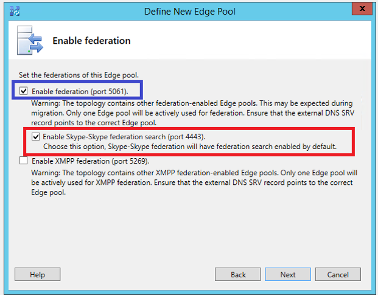

# <a name="deploy-skype-connectivity-in-skype-for-business-server"></a><span data-ttu-id="22003-104">为业务服务器部署中 Skype 的 Skype 连接</span><span class="sxs-lookup"><span data-stu-id="22003-104">Deploy Skype Connectivity in Skype for Business Server</span></span>
 
<span data-ttu-id="22003-105">**摘要：** 了解如何将 Skype 与 Skype 的使用者连接业务服务器。</span><span class="sxs-lookup"><span data-stu-id="22003-105">**Summary:** Learn how to connect Skype for Business Server with Skype consumer.</span></span> <span data-ttu-id="22003-106">也称为 Skype 连接。</span><span class="sxs-lookup"><span data-stu-id="22003-106">Also known as Skype connectivity.</span></span>
  
<span data-ttu-id="22003-107">本文介绍了 Skype 连接的部署。</span><span class="sxs-lookup"><span data-stu-id="22003-107">This article walks through deployment for Skype Connectivity.</span></span>
  
## <a name="skype-connectivity-overview-for-it-professionals"></a><span data-ttu-id="22003-108">面向 IT 专业人员的 Skype 连接概述</span><span class="sxs-lookup"><span data-stu-id="22003-108">Skype Connectivity Overview for IT Professionals</span></span>

<span data-ttu-id="22003-109">Skype 连接提供 Skype 业务用户搜索并添加 Skype 用户的能力。</span><span class="sxs-lookup"><span data-stu-id="22003-109">Skype Connectivity provides Skype for Business users with the ability to search for and add Skype users.</span></span> <span data-ttu-id="22003-110">Skype 连接是 Skype for Business 内允许您启用联盟和目录搜索与 Skype 用户的一项功能。</span><span class="sxs-lookup"><span data-stu-id="22003-110">Skype Connectivity is a feature of Skype for Business that lets you enable federation and directory search with Skype users.</span></span> <span data-ttu-id="22003-111">启用 Skype 连接后您 Skype 的企业用户都将能够搜索并添加 Skype 用户。</span><span class="sxs-lookup"><span data-stu-id="22003-111">After you enable Skype Connectivity your Skype for Business users will be able to search for and add Skype users.</span></span>
  
## <a name="skype-directory-search"></a><span data-ttu-id="22003-112">Skype 目录搜索</span><span class="sxs-lookup"><span data-stu-id="22003-112">Skype Directory Search</span></span>

<span data-ttu-id="22003-p104">Skype 目录搜索功能允许 Skype for Business 用户搜索 Skype 联系人。该搜索功能允许用户使用以下方式进行搜索：</span><span class="sxs-lookup"><span data-stu-id="22003-p104">Skype Directory Search functionality provides Skype for Business users with the ability to search for Skype contacts. The search functionality lets users search using the following:</span></span>
  
- <span data-ttu-id="22003-115">**按显示名称，示例"John Doe"搜索**-这可能返回很多结果，因此您可能找不到您要查找的。</span><span class="sxs-lookup"><span data-stu-id="22003-115">**Search by display name, example "John Doe"** - This could return many results, so you might not find what you are looking for.</span></span>
    
- <span data-ttu-id="22003-116">**按显示名称以及位置，示例"John Doe 中巴塞罗纳"搜索**-这将缩小搜索结果有很大。</span><span class="sxs-lookup"><span data-stu-id="22003-116">**Search by display name plus location, example "John Doe in Barcelona"** - This will narrow the results of the search down considerably.</span></span>
    
- <span data-ttu-id="22003-117">**通过电子邮件，示例"johndoe@outlook.com"搜索**-一个结果应返回在大多数情况下;一个与指定的电子邮件完全匹配。</span><span class="sxs-lookup"><span data-stu-id="22003-117">**Search by email, example "johndoe@outlook.com"** - This should return one result in most cases; the one that matches the specified email exactly.</span></span> <span data-ttu-id="22003-118">但是，如果同一电子邮件与多个账户关联，则可能返回多个结果。</span><span class="sxs-lookup"><span data-stu-id="22003-118">But if the same email is associated with more than one account, multiple results may be returned.</span></span>
    
- <span data-ttu-id="22003-119">**按电话号码示例"123-123-1234"搜索**-一个结果应返回在大多数情况下;一个完全匹配指定的电话。</span><span class="sxs-lookup"><span data-stu-id="22003-119">**Search by phone number, example "123-123-1234"** - This should return one result in most cases; the one that matches the specified phone exactly.</span></span> <span data-ttu-id="22003-120">电话号码必须包含国家/地区代码（例如 1-xxx-yyy-zzzz）。</span><span class="sxs-lookup"><span data-stu-id="22003-120">Phone number must include the country code (i.e. 1-xxx-yyy-zzzz).</span></span> <span data-ttu-id="22003-121">如果同一电话号码与多个账户关联，则可能返回多个结果。</span><span class="sxs-lookup"><span data-stu-id="22003-121">If the same phone number is associated with more than one account, multiple results may be returned.</span></span>
    
- <span data-ttu-id="22003-122">**通过 Skype 名称、 示例"JohnDoe1456"搜索**-如果找到完全匹配，它将返回的第一个结果。</span><span class="sxs-lookup"><span data-stu-id="22003-122">**Search by Skype Name, example "JohnDoe1456"** - If exact match is found, it will be returned as the first result.</span></span> <span data-ttu-id="22003-123">可能返回其他可能的"名称"匹配项。</span><span class="sxs-lookup"><span data-stu-id="22003-123">Other possible "name" matches may be returned.</span></span>
    
    > [!NOTE]
    > <span data-ttu-id="22003-124">Skype 目录搜索必须能够与端口 443 上的以下 IP 地址进行通信：104.40.75.246、23.101.135.34 和 40.113.86.19。</span><span class="sxs-lookup"><span data-stu-id="22003-124">Skype Directory Search must be able to communicate with the following IP addresses on port 443: 104.40.75.246, 23.101.135.34, and 40.113.86.19.</span></span> 
  
## <a name="supported-deployment-matrix-for-skype-directory-search"></a><span data-ttu-id="22003-125">Skype 目录搜索支持的部署矩阵</span><span class="sxs-lookup"><span data-stu-id="22003-125">Supported deployment matrix for Skype Directory Search</span></span>

<span data-ttu-id="22003-126">下表概述了对 Skype 目录搜索的支持。</span><span class="sxs-lookup"><span data-stu-id="22003-126">The following table outlines support for Skype Directory Search.</span></span>
  

||<span data-ttu-id="22003-127">**Skype 的业务 Server 前端**</span><span class="sxs-lookup"><span data-stu-id="22003-127">**Skype for Business Server Front End**</span></span>|<span data-ttu-id="22003-128">**Lync Server 2013（或更早版本）前端**</span><span class="sxs-lookup"><span data-stu-id="22003-128">**Lync Server 2013 (or older) Front End**</span></span>|<span data-ttu-id="22003-129">**注释**</span><span class="sxs-lookup"><span data-stu-id="22003-129">**Comments**</span></span>|
|:-----|:-----|:-----|:-----|
|<span data-ttu-id="22003-130">Skype 的业务服务器边缘</span><span class="sxs-lookup"><span data-stu-id="22003-130">Skype for Business Server Edge</span></span>  <br/> |<span data-ttu-id="22003-131">支持</span><span class="sxs-lookup"><span data-stu-id="22003-131">Supported</span></span>  <br/> |<span data-ttu-id="22003-132">否</span><span class="sxs-lookup"><span data-stu-id="22003-132">Not Supported</span></span>  <br/> |<span data-ttu-id="22003-133">Skype 业务服务器和边缘是 Skype 目录搜索的前提条件</span><span class="sxs-lookup"><span data-stu-id="22003-133">Skype for Business Server and Edge are prerequisites for Skype Directory Search</span></span>  <br/> |
|<span data-ttu-id="22003-134">Skype 业务服务器边缘 + Lync Server 2013 边缘部署并排比较</span><span class="sxs-lookup"><span data-stu-id="22003-134">Skype for Business Server Edge + Lync Server 2013 Edge deployed side-by-side</span></span>  <br/> |<span data-ttu-id="22003-135">支持</span><span class="sxs-lookup"><span data-stu-id="22003-135">Supported</span></span>  <br/> |<span data-ttu-id="22003-136">否</span><span class="sxs-lookup"><span data-stu-id="22003-136">Not Supported</span></span>  <br/> |<span data-ttu-id="22003-p108">Skype 目录搜索流量流经 Skype for Business Server 边缘服务器。联盟流量流经管理员配置的边缘。例如，管理员可以选择继续通过不支持 Skype 目录搜索的 Lync Server 2013 边缘服务器发送联盟流量。</span><span class="sxs-lookup"><span data-stu-id="22003-p108">Skype Directory Search traffic flows through Skype for Business Server Edge servers. Federation traffic goes through edge configured by the administrator. For example, the administrator could choose to continue to send federation traffic through Lync Server 2013 Edge servers which would not support Skype Directory Search.</span></span>  <br/> |
|<span data-ttu-id="22003-140">Lync Server 2013（或更早版本）边缘</span><span class="sxs-lookup"><span data-stu-id="22003-140">Lync Server 2013 (or older) Edge</span></span>  <br/> |<span data-ttu-id="22003-141">否</span><span class="sxs-lookup"><span data-stu-id="22003-141">Not Supported</span></span>  <br/> |<span data-ttu-id="22003-142">否</span><span class="sxs-lookup"><span data-stu-id="22003-142">Not Supported</span></span>  <br/> ||
   
> [!NOTE]
> <span data-ttu-id="22003-143">Skype 上运行的业务 Server 前端的通讯簿服务中的边缘服务器的 Skype 搜索端口 4443 的存在情况查找边缘。</span><span class="sxs-lookup"><span data-stu-id="22003-143">Addressbook service running on Skype for Business Server Front End finds the Edge by the existence of the Skype Search port 4443 in the Edge server.</span></span> 
  
> [!NOTE]
> <span data-ttu-id="22003-144">客户可以在其内部部署，多个站点的情况下，如果它们已部署只有一个 Skype 对于业务 Server 边缘服务器/池，然后搜索所有网站流量将通过一个可用的边缘服务器。</span><span class="sxs-lookup"><span data-stu-id="22003-144">In case a customer has multiple sites in their on-premises deployment, and if they have deployed just one Skype for Business Server Edge server/pool, then Search traffic from all sites will go through the single available Edge server.</span></span> <span data-ttu-id="22003-145">管理员需要确保从所有站点的池可以访问业务 Server 边缘服务器/池部署的 Skype。</span><span class="sxs-lookup"><span data-stu-id="22003-145">The administrator needs to make sure the pools from all sites can access the deployed Skype for Business Server Edge server/pool.</span></span> 
  
> [!NOTE]
> <span data-ttu-id="22003-146">如果请求率超过 15 个请求/秒，Skype 图形服务将限制来自本地或 Office 365 客户的搜索请求。</span><span class="sxs-lookup"><span data-stu-id="22003-146">Skype graph service will throttle search requests from any on-premises or Office 365 customer if the request rate exceeds 15 requests / second.</span></span> 
  
> [!NOTE]
> <span data-ttu-id="22003-147">对于大型企业本地客户，需要使用 Skype 搜索服务对域建立白名单才能允许更高的请求率。</span><span class="sxs-lookup"><span data-stu-id="22003-147">For large enterprise on-premises customers, the domains will need to be whitelisted with the Skype search service to allow higher request rates.</span></span> 
  
> [!NOTE]
> <span data-ttu-id="22003-148">如果队列中有太多的待处理请求，Skype 业务服务器将限制传入请求。</span><span class="sxs-lookup"><span data-stu-id="22003-148">Skype for Business Server will throttle incoming requests, if there are too many pending requests in the queue.</span></span> 
  
## <a name="deploying-skype-connectivity-for-skype-for-business-online-in-office-365"></a><span data-ttu-id="22003-149">在 Office 365 中部署 Skype for Business Online 的 Skype 连接</span><span class="sxs-lookup"><span data-stu-id="22003-149">Deploying Skype Connectivity for Skype for Business Online in Office 365</span></span>

<span data-ttu-id="22003-p110">Skype 连接同样是 Skype for Business Online（Office 365 的一部分）的一项功能。您可以从 Office 365 门户中的 Skype for Business 管理中心启用 Skype 连接功能。</span><span class="sxs-lookup"><span data-stu-id="22003-p110">Skype Connectivity is also a feature of Skype for Business Online, which is part of Office 365. You can enable the Skype Connectivity feature from the Skype for Business Administration Center within the Office 365 portal.</span></span>
  
<span data-ttu-id="22003-152">对于 Office 365 中型企业版、Office 365 企业版、Office 365 教育版和 Office 365 政府版：登录 Office 365 门户并导航到 Skype for Business 管理中心。</span><span class="sxs-lookup"><span data-stu-id="22003-152">For Office 365 Midsize Business, Office 365 Enterprise, Office 365 Education, and Office 365 for Government: Sign in to the Office 365 portal and navigate to the Skype for Business Administration Center.</span></span> <span data-ttu-id="22003-153">转至“外部通信”。</span><span class="sxs-lookup"><span data-stu-id="22003-153">Go to External Communications.</span></span> <span data-ttu-id="22003-154">在“公共 IM 服务提供商”下，单击“启用”。</span><span class="sxs-lookup"><span data-stu-id="22003-154">Under Public IM Service Providers, click Enable.</span></span> <span data-ttu-id="22003-155">如果您希望控制单个用户访问 Skype 连接，您可以通过做到编辑个别用户的外部通信设置。</span><span class="sxs-lookup"><span data-stu-id="22003-155">If you want to control individual user access to Skype Connectivity, you can do so by editing individual users' External Communications settings.</span></span>
  
<span data-ttu-id="22003-156">为 Office 365 小型企业高级版： 登录到 Office 365，并转到管理\>服务设置\>即时消息、 会议和会议。</span><span class="sxs-lookup"><span data-stu-id="22003-156">For Office 365 Small Business Premium: Sign in to Office 365, and go to Admin \> Service Settings \> Instant messaging, meetings and conferencing.</span></span> <span data-ttu-id="22003-157">打开“外部通信”。</span><span class="sxs-lookup"><span data-stu-id="22003-157">Turn on External communications.</span></span> <span data-ttu-id="22003-158">“外部通信”开关会同时打开与其他使用 Skype for Business 的组织之间的 Skype 连接和通信。</span><span class="sxs-lookup"><span data-stu-id="22003-158">The External communications switch turns on both Skype Connectivity and communications with other organizations that use Skype for Business.</span></span>
  
<span data-ttu-id="22003-159">有关 Skype for Business Online 管理的更多信息，请参阅：</span><span class="sxs-lookup"><span data-stu-id="22003-159">For more information about Skype for Business Online administration, see:</span></span>
  
- [<span data-ttu-id="22003-160">允许用户联系外部 Skype for Business 用户</span><span class="sxs-lookup"><span data-stu-id="22003-160">Allow users to contact external Skype for Business users</span></span>](../../SfbOnline/set-up-skype-for-business-online/allow-users-to-contact-external-skype-for-business-users.md)

- [<span data-ttu-id="22003-161">要尝试如果无法 IM Skype 业务或 Skype 外部联系人</span><span class="sxs-lookup"><span data-stu-id="22003-161">What to try if you can't IM Skype for Business or Skype external contacts</span></span>](https://support.office.com/en-us/article/What-to-try-if-you-cant-IM-Skype-for-Business-Lync-or-Skype-external-contacts-87f6d5d7-3b8c-4196-9c8c-1dabb75f54b8?ui=en-US&amp;rs=en-US&amp;ad=US)
    
- [<span data-ttu-id="22003-162">Skype for Business 中添加联系人</span><span class="sxs-lookup"><span data-stu-id="22003-162">Add a contact in Skype for Business</span></span>](https://support.office.com/en-US/article/Add-a-contact-in-Skype-for-Business-89338023-2adf-4f5c-90b6-f8b6f72fadd1)
  
- [<span data-ttu-id="22003-163">管理员：为单个用户配置 Skype for Business 设置</span><span class="sxs-lookup"><span data-stu-id="22003-163">Admins: Configure Skype for Business settings for individual users</span></span>](../../SfbOnline/set-up-skype-for-business-online/configure-skype-for-business-settings-for-individual-users.md)
    
## <a name="deploying-skype-connectivity-for-skype-for-business-server"></a><span data-ttu-id="22003-164">部署 Business Server for Skype Skype 连接</span><span class="sxs-lookup"><span data-stu-id="22003-164">Deploying Skype Connectivity for Skype for Business Server</span></span>

<span data-ttu-id="22003-165">Skype 业务服务器使用的联合身份验证访问体系结构以支持与 Skype 的连接。</span><span class="sxs-lookup"><span data-stu-id="22003-165">Skype for Business Server uses the federation access architecture to support connectivity with Skype.</span></span> <span data-ttu-id="22003-166">此连接允许您的 Skype for Business Server 用户添加 Skype。</span><span class="sxs-lookup"><span data-stu-id="22003-166">This connectivity enables your Skype for Business Server users to add Skype.</span></span> <span data-ttu-id="22003-167">Skype 客户端也可向联系人列表添加 Skype for Business 用户。</span><span class="sxs-lookup"><span data-stu-id="22003-167">Skype clients can also add Skype for Business users to their contact list.</span></span> <span data-ttu-id="22003-168">根据管理性设置用户将能够使用即时消息进行通信的业务服务器中 Skype 的策略，查看彼此的状态，并启动音频和视频呼叫。</span><span class="sxs-lookup"><span data-stu-id="22003-168">Based on policies administratively set in Skype for Business Server users will be able to communicate using instant messaging, see each other's presence, and initiate audio and video calls.</span></span> <span data-ttu-id="22003-169">Skype 连接也是 Skype for Business Online 的一项功能，可从 Office 365 门户中的 Skype for Business 管理中心为 Skype for Business Online 客户启用。</span><span class="sxs-lookup"><span data-stu-id="22003-169">Skype connectivity is also a feature of Skype for Business Online, and can be enabled for Skype for Business Online customers from the Skype for Business Administration Center within the Office 365 portal.</span></span>
  
> [!NOTE]
> <span data-ttu-id="22003-p114">如果 Skype for Business Server 已配置为通过使用公共即时消息连接 (PIC) 连接 Windows Messenger，则您的部署已配置好了 Skype 连接。您可能希望作出的唯一更改是将您的现有 Messenger PIC 条目重命名为 Skype。</span><span class="sxs-lookup"><span data-stu-id="22003-p114">If Skype for Business Server is already configured to connect with Windows Messenger by using Public Instant Messaging Connectivity (PIC), your deployment is already configured for Skype connectivity. The only change you may want to consider is to rename your existing Messenger PIC entry as Skype.</span></span> 
  
### <a name="accessing-the-skype-for-business-server-public-im-connectivity-provisioning-site-from-skype-for-business-server"></a><span data-ttu-id="22003-172">为业务服务器从 Skype 访问业务 Server 公共 IM 连接设置网站 Skype</span><span class="sxs-lookup"><span data-stu-id="22003-172">Accessing the Skype for Business Server public IM connectivity provisioning site from Skype for Business Server</span></span>

<span data-ttu-id="22003-p115">此设置过程最多需要 30 天才能完成，但也可能仅花费几天时间，具体取决于请求量。建议您在完成文档中的其余步骤之前先开始此过程。在为您的帐户完成 Skype 设置过程后，该帐户将被激活，并且将为符合资格的用户启用公共 IM 连接。</span><span class="sxs-lookup"><span data-stu-id="22003-p115">This provisioning process can take up to thirty days to complete but may take only a few days depending on the volume of requests. We recommend that you start this process first, prior to completing the remaining steps in this document. After the Skype provisioning process is completed for your account, the account is activated and your eligible users are enabled for public IM connectivity.</span></span> 
  
<span data-ttu-id="22003-176">要设置 Skype 连接，您需要以下信息：</span><span class="sxs-lookup"><span data-stu-id="22003-176">To provision Skype connectivity, you need the following information:</span></span>
  
- <span data-ttu-id="22003-177">Microsoft 协议编号</span><span class="sxs-lookup"><span data-stu-id="22003-177">Microsoft Agreement Number</span></span>
    
- <span data-ttu-id="22003-178">访问边缘服务完全限定的域名 (FQDN)</span><span class="sxs-lookup"><span data-stu-id="22003-178">Access Edge service fully qualified domain name (FQDN)</span></span>
    
- <span data-ttu-id="22003-179">会话初始协议 (SIP) 域</span><span class="sxs-lookup"><span data-stu-id="22003-179">Session Initiation Protocol (SIP) domain(s)</span></span>
    
- <span data-ttu-id="22003-180">任何其他访问边缘服务 FQDN</span><span class="sxs-lookup"><span data-stu-id="22003-180">Any additional Access Edge service FQDNs</span></span>
    
- <span data-ttu-id="22003-181">联系信息</span><span class="sxs-lookup"><span data-stu-id="22003-181">Contact information</span></span>
    
<span data-ttu-id="22003-182">要启动 Skype 连接的设置过程，请执行下列操作：</span><span class="sxs-lookup"><span data-stu-id="22003-182">To initiate the provisioning process for Skype Connectivity:</span></span>
  
1. <span data-ttu-id="22003-183">登录到网站， https://pic.lync.com，使用您的 Microsoft Windows Live id。</span><span class="sxs-lookup"><span data-stu-id="22003-183">Sign in to the website, https://pic.lync.com, using your Microsoft Windows Live ID.</span></span>
    
2. <span data-ttu-id="22003-184">选择 Microsoft 许可协议类型。</span><span class="sxs-lookup"><span data-stu-id="22003-184">Select the Microsoft licensing agreement type.</span></span>
    
3. <span data-ttu-id="22003-185">选中复选框，确保您已阅读并接受 Skype for Business Server 的产品使用权利。</span><span class="sxs-lookup"><span data-stu-id="22003-185">Select the check box, verifying that you have read and accept the Product Use Rights for Skype for Business Server.</span></span>
    
4. <span data-ttu-id="22003-186">在“启动设置请求”页面上，单击合适的链接以启动设置请求：</span><span class="sxs-lookup"><span data-stu-id="22003-186">On the Initiate a Provisioning Request page, click the appropriate link to initiate a provisioning request:</span></span>
    
5. <span data-ttu-id="22003-187">在“指定设置信息”页面上，输入访问边缘服务 FQDN。</span><span class="sxs-lookup"><span data-stu-id="22003-187">On the Specify Provisioning Information page, enter the Access Edge service FQDN.</span></span> <span data-ttu-id="22003-188">例如，sip.contoso.com。</span><span class="sxs-lookup"><span data-stu-id="22003-188">For example, sip.contoso.com.</span></span>
    
    > [!IMPORTANT]
    > <span data-ttu-id="22003-189">2017 年 7 月 1 日后，Microsoft 会另外要求客户部署联盟 DNS SRV 记录，以使公共 IM 连接继续有效。</span><span class="sxs-lookup"><span data-stu-id="22003-189">After July 1st 2017 Microsoft will additionally require customers have the Federation DNS SRV record deployed for Public IM connectivity to continue to work.</span></span> 
  
6. <span data-ttu-id="22003-190">输入至少一个或多个 SIP 域名，然后单击“添加”。</span><span class="sxs-lookup"><span data-stu-id="22003-190">Enter at least one or more SIP domain names, and then click Add.</span></span>
    
    > [!NOTE]
    > <span data-ttu-id="22003-p117">需要至少一个访问边缘服务器才能完成设置过程。虽然单个访问边缘 FQDN 可支持多个 SIP 域，但是单个 SIP 域不能由多个访问边缘 FQDN 来表示。SIP 域和访问边缘服务器必须处于活动状态、正在运行，并且在网络上可访问。</span><span class="sxs-lookup"><span data-stu-id="22003-p117">At least one Access Edge server is required to complete the provisioning process. While a single Access Edge FQDN can support multiple SIP domains, a single SIP domain cannot be represented by more than one Access Edge FQDN. The SIP domain and the Access Edge server must be active, functioning, and reachable on the network.</span></span> 
  
7. <span data-ttu-id="22003-194">在“公共 IM 服务提供商”列表中，选择“Skype”，然后单击“下一步”以添加联系信息并提交设置请求。</span><span class="sxs-lookup"><span data-stu-id="22003-194">In the list of Public IM Service providers, select Skype, and click Next to add contact information, and submit the provisioning request.</span></span>
    
<span data-ttu-id="22003-195">在提交设置请求之后，可能需要多达 30 天帐户才能激活并且才能为用户启用 Skype 连接，但此过程也可能只需耗费几天时间，具体取决于队列。</span><span class="sxs-lookup"><span data-stu-id="22003-195">After the provisioning request has been submitted, it can take up to 30 days, but may take only a few days depending on queue, for the account to activate and for users to be enabled for Skype Connectivity.</span></span>
  
### <a name="enabling-federation-and-public-im-connectivity-pic"></a><span data-ttu-id="22003-196">启用联盟和公共 IM 连接 (PIC)</span><span class="sxs-lookup"><span data-stu-id="22003-196">Enabling Federation and Public IM Connectivity (PIC)</span></span>

<span data-ttu-id="22003-p118">提交设置请求后，您可以将注意力放在 Skype for Business Server 环境和配置 Skype 连接所需的管理任务上。在此部分，我们假定管理员已部署了 Skype for Business Server 并配置了外部访问（即边缘服务器）。</span><span class="sxs-lookup"><span data-stu-id="22003-p118">After you have submitted the provisioning request, you can focus on the Skype for Business Server environment and administrative tasks required to configure Skype Connectivity. In this section, we assume that the administrator has deployed Skype for Business Server and configured external access, also known as Edge servers.</span></span> 
  
<span data-ttu-id="22003-p119">要启用联盟和 PIC，需要执行三个主要步骤。包括：</span><span class="sxs-lookup"><span data-stu-id="22003-p119">There are three primary steps required to enable federation and PIC. These are:</span></span>
  
1. <span data-ttu-id="22003-201">配置联盟和 PIC</span><span class="sxs-lookup"><span data-stu-id="22003-201">Configure Federation and PIC</span></span>
    
2. <span data-ttu-id="22003-202">配置至少一个策略以支持联盟的用户访问</span><span class="sxs-lookup"><span data-stu-id="22003-202">Configure at least one policy to support federated user access</span></span>
    
3. <span data-ttu-id="22003-203">配置 Skype PIC 提供商设置</span><span class="sxs-lookup"><span data-stu-id="22003-203">Configure the Skype PIC provider setting</span></span>
    
#### <a name="1-configure-federation-and-pic"></a><span data-ttu-id="22003-204">1. 配置联盟和 PIC</span><span class="sxs-lookup"><span data-stu-id="22003-204">1. Configure Federation and PIC</span></span>

<span data-ttu-id="22003-p120">需要联盟，Skype 用户才能与您的组织中的 Skype for Business 用户进行通信。公共即时消息连接 (PIC) 是一种联盟类别，必须配置它，您的 Skype for Business 用户才能够与 Skype 用户进行通信。联盟和 PIC 可使用 Skype for Business Server 控制面板进行配置。</span><span class="sxs-lookup"><span data-stu-id="22003-p120">Federation is required to enable Skype users to communicate with Skype for Business users in your organization. Public Instant Messaging Connectivity (PIC) is a class of federation, and it must be configured to enable your Skype for Business users to communicate with Skype users. Federation and PIC are configured by using the Skype for Business Server Control Panel.</span></span>
  
> [!NOTE]
> <span data-ttu-id="22003-208">Live Communication Server 2005 SP1 或 Office Communications Server 2007 不再支持 PIC 联盟。</span><span class="sxs-lookup"><span data-stu-id="22003-208">PIC federation is no longer supported by Live Communication Server 2005 SP1 or by Office Communications Server 2007.</span></span> <span data-ttu-id="22003-209">支持的平台 PIC 联盟包含 Skype Business Server、 Lync Server 2013、 Lync Server 2010 和 Office Communications Server 2007 R2。</span><span class="sxs-lookup"><span data-stu-id="22003-209">The supported platforms for PIC federation include Skype for Business Server, Lync Server 2013, Lync Server 2010, and Office Communications Server 2007 R2.</span></span> 
  
<span data-ttu-id="22003-p122">需要联盟，Skype 用户才能与您的组织中的 Skype for Business 用户进行通信。公共即时消息连接 (PIC) 是一种联盟类别，必须配置它，您的 Skype for Business Server 用户才能够与 Skype 用户进行通信。联盟和 PIC 可使用 Skype for Business Server 控制面板的边缘配置对话框进行配置，如图所示。</span><span class="sxs-lookup"><span data-stu-id="22003-p122">Federation is required to enable Skype users to communicate with Skype for Business users in your organization. Public Instant Messaging Connectivity (PIC) is a class of federation, and it must be configured to enable your Skype for Business Server users to communicate with Skype users. Federation and PIC are configured by using the Edge configuration dialog of the Skype for Business Server Control Panel as shown in the figure.</span></span>
  

  
> [!NOTE]
> <span data-ttu-id="22003-214">要让搜索正常运行，EnableSkypeIdRouting 和 EnableSkypeDirectorySearch 属性需要在公共提供商设置中设为 true（参见后续说明）。</span><span class="sxs-lookup"><span data-stu-id="22003-214">EnableSkypeIdRouting and EnableSkypeDirectorySearch attributes need to be set to true in the public provider settings (see later instructions) for Search to work.</span></span> 
  
<span data-ttu-id="22003-p123">这将完成必须在服务器上执行的管理任务。您现在可以设置 Skype 连接。</span><span class="sxs-lookup"><span data-stu-id="22003-p123">This completes the administrative tasks that must be performed on the server. You are now set up for Skype Connectivity.</span></span>
  
#### <a name="2-configure-at-least-one-policy-to-support-federated-user-access"></a><span data-ttu-id="22003-217">2.配置至少一个策略以支持联盟的用户访问</span><span class="sxs-lookup"><span data-stu-id="22003-217">2. Configure at least one policy to support federated user access</span></span>

<span data-ttu-id="22003-218">使用 Skype for Business Server 控制面板，管理员必须配置一个或多个外部用户访问策略来控制 Skype 用户能否与内部 Skype for Business Server 用户进行协作。</span><span class="sxs-lookup"><span data-stu-id="22003-218">Using the Skype for Business Server Control Panel, an administrator must configure one or more external user access policies to control whether Skype users can collaborate with internal Skype for Business Server users.</span></span>
  
#### <a name="3-configure-the-skype-pic-provider-setting"></a><span data-ttu-id="22003-219">3.配置设置的 Skype PIC 提供程序</span><span class="sxs-lookup"><span data-stu-id="22003-219">3. Configure the Skype PIC provider setting</span></span>

<span data-ttu-id="22003-220">使用 Skype for Business Server 命令行管理程序，管理员必须配置 Skype for Business 客户端策略以将 Skype 显示为附加 PIC 提供商。</span><span class="sxs-lookup"><span data-stu-id="22003-220">Using the Skype for Business Server Management Shell, an administrator must configure the Skype for Business client policy to display Skype as an additional PIC provider.</span></span> 
  
> [!NOTE]
> <span data-ttu-id="22003-221">公共即时消息连接 (PIC) 服务提供商的用户不能参与 IM 或会议组织也配置至少一个策略 （步骤 2 中，在此过程前面） 以支持公共 IM 连接之前。</span><span class="sxs-lookup"><span data-stu-id="22003-221">Users of the Public Instant Messaging Connectivity (PIC) service providers can't participate in IM or conferences in your organization until you also configure at least one policy (step 2, earlier in this procedure) to support public IM connectivity.</span></span> 
  
<span data-ttu-id="22003-222">对于新安装，您可以使用 Skype for Business Server 控制面板启用 Skype 公共提供商，从而配置 Skype 连接，如图所示。</span><span class="sxs-lookup"><span data-stu-id="22003-222">For new installations you can configure Skype Connectivity by enabling a Skype Public Provider using the Skype for Business Server Control Panel as shown in the figure.</span></span>
  

  
> [!NOTE]
> <span data-ttu-id="22003-224">要在升级为 Skype for Business Server 时配置 Skype 连接，您必须删除并重新添加现有 Skype 公共提供商。</span><span class="sxs-lookup"><span data-stu-id="22003-224">To configure Skype Connectivity when upgrading to Skype for Business Server you must remove and re-add the existing Skype public provider.</span></span> 
  
<span data-ttu-id="22003-p124">也可以仅使用 PowerShell 配置 Skype 连接。要使用 PowerShell 配置 Skype 连接：</span><span class="sxs-lookup"><span data-stu-id="22003-p124">Configuring Skype Connectivity can also be done using only PowerShell. To configure Skype Connectivity using PowerShell:</span></span>
  
1. <span data-ttu-id="22003-227">从 Skype for Business Server 前端服务器，打开 Skype for Business Server 命令行管理程序。</span><span class="sxs-lookup"><span data-stu-id="22003-227">From a Skype for Business Server Front End Server, open the Skype for Business Server Management Shell.</span></span>
    
2. <span data-ttu-id="22003-228">运行以下两个命令：</span><span class="sxs-lookup"><span data-stu-id="22003-228">Run the following two commands:</span></span>
    
   ```
    Remove-CsPublicProvider -Identity <identity-name>
   ```

    > [!NOTE]
    > <span data-ttu-id="22003-229">如果您的环境中没有 PIC 提供商，并且要创建新的 PIC 提供商，则您无需运行 Remove-CsPublicProvider cmdlet。</span><span class="sxs-lookup"><span data-stu-id="22003-229">If you do not already have a PIC provider in your environment and are creating a new PIC provider then you do not need to run the Remove-CsPublicProvider cmdlet.</span></span> 
  
   ```
   New-CsPublicProvider -Identity Skype -ProxyFqdn federation.messenger.msn.com -IconUrl https://images.edge.messenger.live.com/Messenger_16x16.png -NameDecorationRoutingDomain msn.com -NameDecorationExcludedDomainList "msn.com,outlook.com,live.com,hotmail.com" -Enabled $true -EnableSkypeIdRouting $true -EnableSkypeDirectorySearch $true
   ```

    <span data-ttu-id="22003-230">这些不太明显的参数有什么作用？</span><span class="sxs-lookup"><span data-stu-id="22003-230">What do the less obvious parameters do?</span></span>
    
  - <span data-ttu-id="22003-231">ProxyFqdn：Skype 联盟边缘的位置（由 Microsoft 掌控/维护）</span><span class="sxs-lookup"><span data-stu-id="22003-231">ProxyFqdn: location of Skype federation edge (owned/maintained by Microsoft)</span></span>
    
  - <span data-ttu-id="22003-232">IconURL： 使用 Lync 图标&amp;业务客户端来识别 Skype 联系人的 Skype</span><span class="sxs-lookup"><span data-stu-id="22003-232">IconURL: icon used by Lync &amp; Skype for Business client to visually identify Skype contacts</span></span>
    
  - <span data-ttu-id="22003-233">NameDecorationRoutingDomain 和 NameDecorationExcludedDomainList： 设置这些设置允许用户无须了解"修饰"与"msn.com"的非 Microsoft 域输入 Skype 用户 MSAs。</span><span class="sxs-lookup"><span data-stu-id="22003-233">NameDecorationRoutingDomain and NameDecorationExcludedDomainList: setting these allows users to enter Skype users' MSAs without needing to know about "decorating" non-Microsoft domains with "msn.com".</span></span> <span data-ttu-id="22003-234">这的所有域不在 ExcludedDomainList 无需键入"用户 (contoso.com) @msn.com"。</span><span class="sxs-lookup"><span data-stu-id="22003-234">This eliminates the need to type "user(contoso.com)@msn.com" for all domains that are NOT in the ExcludedDomainList.</span></span> <span data-ttu-id="22003-235">SfB 客户端将自动格式化 MSA（如果域不在 Excluded 列表中）。</span><span class="sxs-lookup"><span data-stu-id="22003-235">The SfB client will automatically format the MSA if the domain is NOT in the Excluded list.</span></span> <span data-ttu-id="22003-236">我们为排除列表中添加了最常见的 Microsoft 帐户域。</span><span class="sxs-lookup"><span data-stu-id="22003-236">We've added the most common Microsoft Account domains to the excluded list.</span></span>
    
    > [!NOTE]
    > <span data-ttu-id="22003-237">如果作出了更改，则必须删除并重新添加公共提供商。</span><span class="sxs-lookup"><span data-stu-id="22003-237">Public Provider must be removed and added new if changes are made.</span></span> <span data-ttu-id="22003-238">不允许进行就地更改。</span><span class="sxs-lookup"><span data-stu-id="22003-238">No in-place changes are allowed.</span></span> 
  
    > [!NOTE]
    > <span data-ttu-id="22003-239">Lync Server 2013 CU5 中添加&amp;Lync 桌面客户端在 Office 2013 SP1 中，NameDecorationRoutingDomain 和 NameDecorationExcludedDomainList 提高其中 Lync 用户添加 Skype 联系人，无需对"装饰"对非 Microsoft 域的情况确定并将其路由至 Skype (的格式： user(contoso.com)@msn.com)。</span><span class="sxs-lookup"><span data-stu-id="22003-239">Added in Lync Server 2013 CU5 &amp; Lync desktop client in Office 2013 SP1, the NameDecorationRoutingDomain and NameDecorationExcludedDomainList improve the situation where Lync users adding Skype contacts needed to "decorate" non-Microsoft domains to identify and route them to Skype (the format of: user(contoso.com)@msn.com).</span></span> <span data-ttu-id="22003-240">这些新设置将允许用户地址的自动套用格式的在"添加 Skype 联系人"对话框中输入与 NameDecorationRoutingDomain （其中应设置为 msn.com） 如果不包含在 NameDecorationExcludedDomainList （域我们当前可支持 msn.com，live.com，Hotmail.com，outlook.com）。</span><span class="sxs-lookup"><span data-stu-id="22003-240">These new settings will allow automatic formatting of the address user's enter in the "Add Skype contact" dialog box with the NameDecorationRoutingDomain (which should be set to msn.com) if it does not contain the domains in the NameDecorationExcludedDomainList (we currently can support msn.com, live.com, Hotmail.com, outlook.com).</span></span> 
  
3. <span data-ttu-id="22003-241">通过 Skype for Business 客户端，用户现在可以搜索和添加 Skype 用户。</span><span class="sxs-lookup"><span data-stu-id="22003-241">From a Skype for Business client users can now search for and add a Skype user.</span></span>
    
## <a name="clients-and-interoperability-matrix"></a><span data-ttu-id="22003-242">客户端和互操作性矩阵</span><span class="sxs-lookup"><span data-stu-id="22003-242">Clients and Interoperability Matrix</span></span>

<span data-ttu-id="22003-243">下表概括介绍了最新版本的 Skype 消费者产品与最新版本的 Skype for Business 之间的互操作状况。</span><span class="sxs-lookup"><span data-stu-id="22003-243">The following table outlines the status of interop between the latest version of Skype consumer and the latest version of Skype for Business.</span></span>
  

|<span data-ttu-id="22003-244">**Skype 客户端**</span><span class="sxs-lookup"><span data-stu-id="22003-244">**Skype Clients**</span></span>|<span data-ttu-id="22003-245">**添加联系人、IM、状态、语音和视频呼叫**</span><span class="sxs-lookup"><span data-stu-id="22003-245">**Add contacts, IM, presence, audio, and video calling**</span></span>|<span data-ttu-id="22003-246">**注释**</span><span class="sxs-lookup"><span data-stu-id="22003-246">**Comment**</span></span>|
|:-----|:-----|:-----|
|<span data-ttu-id="22003-247">Skype Windows 桌面</span><span class="sxs-lookup"><span data-stu-id="22003-247">Skype Windows Desktop</span></span>  <br/> |<span data-ttu-id="22003-248">7.6 或更高版本，Windows XP 和更高版本</span><span class="sxs-lookup"><span data-stu-id="22003-248">7.6 or higher, Windows XP and higher</span></span>  <br/> |<span data-ttu-id="22003-249">**新建**： 添加对运行 Windows XP 和 Windows Vista **（需要 7.26 或更高的最新客户端版本）** 上的 Windows Skype 客户端的支持</span><span class="sxs-lookup"><span data-stu-id="22003-249">**NEW**: Support added for Windows Skype client running on Windows XP, and Windows Vista **(requires latest client version 7.26 or higher)**</span></span> <br/> |
|<span data-ttu-id="22003-250">Skype 移动 - Android 手机和平板电脑 </span><span class="sxs-lookup"><span data-stu-id="22003-250">Skype Mobile - Android Phone and Tablet</span></span>  <br/> |<span data-ttu-id="22003-251">6.19 或更高版本，运行 Android OS 4.0.3 或更高版本</span><span class="sxs-lookup"><span data-stu-id="22003-251">6.19 or higher, running Android OS version 4.0.3 or higher</span></span>  <br/> |<span data-ttu-id="22003-252">低规格设备可能不支持视频呼叫</span><span class="sxs-lookup"><span data-stu-id="22003-252">Low spec devices may not support video calling</span></span>  <br/> |
|<span data-ttu-id="22003-253">Skype Mobile-iOS</span><span class="sxs-lookup"><span data-stu-id="22003-253">Skype Mobile - iOS</span></span>  <br/> |<span data-ttu-id="22003-254">6.11 或更高版本，在 IOS 7 或更高版本上</span><span class="sxs-lookup"><span data-stu-id="22003-254">6.11 or higher, on IOS 7 or higher</span></span>  <br/> |<span data-ttu-id="22003-255">在 iPhone 4 和更早版本、iPod 第 4 代和更早版本、Pad 第 1 代上不受支持</span><span class="sxs-lookup"><span data-stu-id="22003-255">Not supported are iPhone 4 and earlier, iPod 4th generation and earlier, iPad 1st generation</span></span>  <br/> |
|<span data-ttu-id="22003-256">Skype Mac</span><span class="sxs-lookup"><span data-stu-id="22003-256">Skype Mac</span></span>  <br/> |<span data-ttu-id="22003-257">7.19 或更高版本，在 Mac OS X 10.9 (Mavericks) 或更高版本上</span><span class="sxs-lookup"><span data-stu-id="22003-257">7.19 or higher, on Mac OS X 10.9 (Mavericks) or higher</span></span>  <br/> |<span data-ttu-id="22003-258">需要 Mac OSX 10.9 或更高版本</span><span class="sxs-lookup"><span data-stu-id="22003-258">Requires Mac OSX 10.9 or higher</span></span>  <br/> |
|<span data-ttu-id="22003-259">Skype 通用 Windows 应用 (Windows 10) 桌面和移动版</span><span class="sxs-lookup"><span data-stu-id="22003-259">Skype Universal Windows App (Windows 10) Desktop and Mobile</span></span>  <br/> |<span data-ttu-id="22003-260">Windows 10（Redstone 1 更新或更高版本）</span><span class="sxs-lookup"><span data-stu-id="22003-260">Windows 10 (Redstone 1 update or later)</span></span>  <br/> |<span data-ttu-id="22003-261">Windows 通用应用将在 2016 年秋季收到更新，该更新添加了互操作性支持</span><span class="sxs-lookup"><span data-stu-id="22003-261">Windows Universal App will receive update in Fall 2016 adding interop support</span></span>  <br/> |
   
<span data-ttu-id="22003-262">下表概括介绍了最新版本的 Skype for Business 与最新版本的 Skype 消费者产品之间的互操作状况。</span><span class="sxs-lookup"><span data-stu-id="22003-262">The following table outlines the status of interop between the latest version of Skype for Business and the latest version of Skype consumer.</span></span> 
  
|<span data-ttu-id="22003-263">**客户端**</span><span class="sxs-lookup"><span data-stu-id="22003-263">**Client**</span></span>|<span data-ttu-id="22003-264">**Skype 目录搜索和添加联系人**</span><span class="sxs-lookup"><span data-stu-id="22003-264">**Skype Directory Search and Add Contacts**</span></span>|<span data-ttu-id="22003-265">**Skype A/V、IM 互操作**</span><span class="sxs-lookup"><span data-stu-id="22003-265">**Skype A/V, IM interop**</span></span>|
|:-----|:-----|:-----|
|<span data-ttu-id="22003-266">Skype for Business</span><span class="sxs-lookup"><span data-stu-id="22003-266">Skype for Business</span></span>  <br/> |<span data-ttu-id="22003-267">是</span><span class="sxs-lookup"><span data-stu-id="22003-267">Yes</span></span>  <br/> |<span data-ttu-id="22003-268">是</span><span class="sxs-lookup"><span data-stu-id="22003-268">Yes</span></span>  <br/> |
|<span data-ttu-id="22003-269">Mac 版 Skype for Business</span><span class="sxs-lookup"><span data-stu-id="22003-269">Skype for Business on Mac</span></span>  <br/> |<span data-ttu-id="22003-270">可以添加（无搜索）</span><span class="sxs-lookup"><span data-stu-id="22003-270">Can add (no search)</span></span>  <br/> |<span data-ttu-id="22003-271">是</span><span class="sxs-lookup"><span data-stu-id="22003-271">Yes</span></span>  <br/> |
|<span data-ttu-id="22003-272">Lync Desktop 2013</span><span class="sxs-lookup"><span data-stu-id="22003-272">Lync Desktop 2013</span></span>  <br/> |<span data-ttu-id="22003-273">可以添加（无搜索）</span><span class="sxs-lookup"><span data-stu-id="22003-273">Can add (no search)</span></span>  <br/> |<span data-ttu-id="22003-274">是</span><span class="sxs-lookup"><span data-stu-id="22003-274">Yes</span></span>  <br/> |
|<span data-ttu-id="22003-275">Lync Web App - 联机和本地</span><span class="sxs-lookup"><span data-stu-id="22003-275">Lync Web App - online and on-premises</span></span>  <br/> |<span data-ttu-id="22003-276">不适用</span><span class="sxs-lookup"><span data-stu-id="22003-276">N/A</span></span>  <br/> |<span data-ttu-id="22003-277">不适用</span><span class="sxs-lookup"><span data-stu-id="22003-277">N/A</span></span>  <br/> |
|<span data-ttu-id="22003-278">Lync 移动 - Windows Phone</span><span class="sxs-lookup"><span data-stu-id="22003-278">Lync Mobile - Windows Phone</span></span>  <br/> |<span data-ttu-id="22003-279">即将提供</span><span class="sxs-lookup"><span data-stu-id="22003-279">Coming Soon</span></span>  <br/> |<span data-ttu-id="22003-280">是</span><span class="sxs-lookup"><span data-stu-id="22003-280">Yes</span></span>  <br/> |
|<span data-ttu-id="22003-281">Lync 移动 - Android</span><span class="sxs-lookup"><span data-stu-id="22003-281">Lync Mobile - Android</span></span>  <br/> |<span data-ttu-id="22003-282">即将提供</span><span class="sxs-lookup"><span data-stu-id="22003-282">Coming Soon</span></span>  <br/> |<span data-ttu-id="22003-283">是</span><span class="sxs-lookup"><span data-stu-id="22003-283">Yes</span></span>  <br/> |
|<span data-ttu-id="22003-284">Lync 移动 - iOS</span><span class="sxs-lookup"><span data-stu-id="22003-284">Lync Mobile - iOS</span></span>  <br/> |<span data-ttu-id="22003-285">即将提供</span><span class="sxs-lookup"><span data-stu-id="22003-285">Coming Soon</span></span>  <br/> |<span data-ttu-id="22003-286">是</span><span class="sxs-lookup"><span data-stu-id="22003-286">Yes</span></span>  <br/> |
|<span data-ttu-id="22003-287">Lync Room System</span><span class="sxs-lookup"><span data-stu-id="22003-287">Lync Room System</span></span>  <br/> |<span data-ttu-id="22003-288">即将提供</span><span class="sxs-lookup"><span data-stu-id="22003-288">Coming Soon</span></span>  <br/> |<span data-ttu-id="22003-289">是</span><span class="sxs-lookup"><span data-stu-id="22003-289">Yes</span></span>  <br/> |
|<span data-ttu-id="22003-290">Lync Modern App (Win 8.1)</span><span class="sxs-lookup"><span data-stu-id="22003-290">Lync Modern App (Win 8.1)</span></span>  <br/> |<span data-ttu-id="22003-291">是</span><span class="sxs-lookup"><span data-stu-id="22003-291">Yes</span></span>  <br/> |<span data-ttu-id="22003-292">是</span><span class="sxs-lookup"><span data-stu-id="22003-292">Yes</span></span>  <br/> |
|<span data-ttu-id="22003-293">Lync Mac 2011</span><span class="sxs-lookup"><span data-stu-id="22003-293">Lync Mac 2011</span></span>  <br/> |<span data-ttu-id="22003-294">可以添加（无搜索）</span><span class="sxs-lookup"><span data-stu-id="22003-294">Can add (no search)</span></span>  <br/> |<span data-ttu-id="22003-295">是</span><span class="sxs-lookup"><span data-stu-id="22003-295">Yes</span></span>  <br/> |
|<span data-ttu-id="22003-296">Lync Desktop 2010</span><span class="sxs-lookup"><span data-stu-id="22003-296">Lync Desktop 2010</span></span>  <br/> |<span data-ttu-id="22003-297">可以添加（无搜索）</span><span class="sxs-lookup"><span data-stu-id="22003-297">Can add (no search)</span></span>  <br/> |<span data-ttu-id="22003-298">是</span><span class="sxs-lookup"><span data-stu-id="22003-298">Yes</span></span>  <br/> |
|<span data-ttu-id="22003-299">Lync Phone Edition</span><span class="sxs-lookup"><span data-stu-id="22003-299">Lync Phone Edition</span></span>  <br/> |<span data-ttu-id="22003-300">不适用</span><span class="sxs-lookup"><span data-stu-id="22003-300">N/A</span></span>  <br/> |<span data-ttu-id="22003-301">不适用</span><span class="sxs-lookup"><span data-stu-id="22003-301">N/A</span></span>  <br/> |
|<span data-ttu-id="22003-302">Lync Attendant</span><span class="sxs-lookup"><span data-stu-id="22003-302">Lync Attendant</span></span>  <br/> |<span data-ttu-id="22003-303">不适用</span><span class="sxs-lookup"><span data-stu-id="22003-303">N/A</span></span>  <br/> |<span data-ttu-id="22003-304">不适用</span><span class="sxs-lookup"><span data-stu-id="22003-304">N/A</span></span>  <br/> |
   

