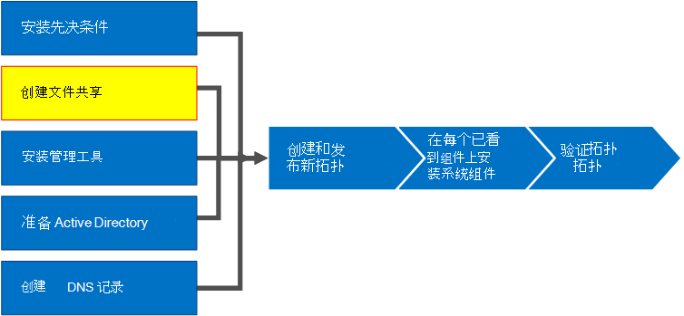
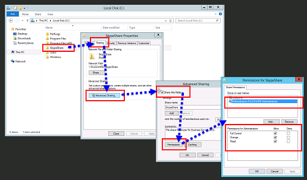

# 为 Business Server Skype 创建文件共享Create a file share in Skype for Business Server
 
**摘要：** 了解如何创建 Windows Server 文件共享作为业务服务器安装的 Skype 的一部分。**Summary:** Learn how to create a Windows Server file share as part of the installation of Skype for Business Server. 下载免费试用版 Skype 业务服务器从 Microsoft 评估中心，网址为：[https://www.microsoft.com/evalcenter/evaluate-skype-for-business-server](https://www.microsoft.com/evalcenter/evaluate-skype-for-business-server)。Download a free trial of Skype for Business Server from the Microsoft Evaluation center at:[https://www.microsoft.com/evalcenter/evaluate-skype-for-business-server](https://www.microsoft.com/evalcenter/evaluate-skype-for-business-server).
  
Skype 业务服务器需要一个文件共享，以便整个拓扑的计算机可以交换文件。Skype for Business Server requires a file share so that computers throughout the topology can exchange files. 创建文件共享是 8 Skype 业务服务器安装过程中的第 2 步。Creating a file share is step 2 of 8 in the installation process for Skype for Business Server. 第 1 步至第 5 步可以按任意顺序执行。You can do steps 1 through 5 in any order. 但第 6、7、8 步必须在第 1 步至第 5 步之后按照图表所示顺序依次完成。However, you must do steps 6, 7, and 8 in order, and after steps 1 through 5 as outlined in the diagram. 有关规划有关文件共享的详细信息，请参阅[环境要求 Skype 业务服务器](../../plan-your-deployment/requirements-for-your-environment/environmental-requirements.md)或[服务器要求的业务服务器 2019 Skype](../../../SfBServer2019/plan/system-requirements.md)。For planning details about file share, see [Environmental requirements for Skype for Business Server](../../plan-your-deployment/requirements-for-your-environment/environmental-requirements.md) or [Server requirements for Skype for Business Server 2019](../../../SfBServer2019/plan/system-requirements.md).
  

  
## 创建基本文件共享Create a basic file share

此部分逐步说明如何创建基本的 Windows Server 文件共享。This section walks you through creating a basic Windows Server file share. 基本的 Windows Server 文件共享与 Skype 的业务服务器支持。A basic Windows Server file share is supported with Skype for Business Server. 但是，它不明确提供高可用性。However, it does not explicitly provide high availability. 对于高可用性环境，建议使用分布式文件系统 (DFS) 文件共享。For a high availability environment, a Distributed File System (DFS) file share is recommended. 有关高可用性文件共享和 DFS 的详细信息，请参阅[规划高可用性和灾难恢复 Skype 业务服务器中](../../plan-your-deployment/high-availability-and-disaster-recovery/high-availability-and-disaster-recovery.md)。For more information about a high availability file share and DFS, see [Plan for high availability and disaster recovery in Skype for Business Server](../../plan-your-deployment/high-availability-and-disaster-recovery/high-availability-and-disaster-recovery.md).
  
> [!NOTE]
> Windows Server 2012 R2 在使用 Windows Server 平台提供存储区域网络 (SAN) 型文件共享解决方案方面作出了重大改进。Windows Server 2012 R2 has made major leaps in providing Storage Area Network (SAN)-like file share solutions using the Windows Server platform. 与基于传统 SAN 的设备相比，Windows Server 2012 R2 存储解决方案可以将成本削减一半，同时对性能造成的影响很小。When compared to a traditional SAN-based appliance, a Windows Server 2012 R2 storage solution can cut costs in half with very minimal impact to performance. 有关 Windows Server 2012 R2 中的文件共享选项的详细信息，请参阅可下载的白皮书[的 Windows Server 2012 R2 存储](https://download.microsoft.com/download/9/4/A/94A15682-02D6-47AD-B209-79D6E2758A24/Windows_Server_2012_R2_Storage_White_Paper.pdf)。For more information about file share options in Windows Server 2012 R2, see the downloadable white paper [Windows Server 2012 R2 Storage](https://download.microsoft.com/download/9/4/A/94A15682-02D6-47AD-B209-79D6E2758A24/Windows_Server_2012_R2_Storage_White_Paper.pdf). 
  
观看视频，了解**创建文件共享**的步骤：Watch the video steps for **create a file share**:
  
> [!video https://www.microsoft.com/en-us/videoplayer/embed/dbef31be-e899-4a32-a1ca-370053284f56?autoplay=false]
  
### 创建基本文件共享Create a basic file share

1. 登录将托管文件共享的计算机。Log on to the computer that will host the file share.
    
2. 右键单击计划共享的文件夹，然后选择“**属性**”。Right-click the folder you plan to share, and select **Properties**.
    
3. 选择“**共享**”选项卡，然后单击“**高级共享...**”。Select the **Sharing** tab, and click **Advanced Sharing**.
    
4. 单击“**共享此文件夹**”。Click **Share this folder**.
    
5. 单击“**权限**”。Click **Permissions**.
    
6. 在托管文件共享的服务器上添加本地“**Administrators**”组，授予“**允许：完全控制、更改和读取**”权限，然后单击“**确定**”。Add the local **Administrators** group of the server hosting the file share, grant **Allow: Full Control, Change, and Read** rights, and then click **OK**.
    
7. 再次单击“**确定**”，然后记下新路径。Click **OK** again and take note of the network path.
    
8. 单击“**完成**”关闭该向导。Click **Done** to close the wizard.
    
     
  
> [!NOTE]
>如果文件存储位于 DFS 共享上，将收到以下警告：If the file store is hosted on a DFS share, the following warning will be received:

警告： 无法访问的共享权限"\\<domain>\<share>"。Warning: Unable to access share permissions for "\\<domain>\<share>".

>此举有望如果您不是管理员在文件服务器上，或者如果这是一个分布式文件系统 (DFS) 共享。This is expected if you are not an administrator on the file server, or if this is a Distributed File System (DFS) share. 如果已配置了共享权限，可以忽略此警告。If the share permissions have already been configured, this warning can be ignored. 如果是新的共享，请参阅文档的手动配置共享权限的详细信息。If it is a new share, refer to the documentation for details on manually configuring share permissions.

>由于无法访问 DFS 共享上的共享权限，Skype 业务服务器将不能显式设置的文件共享上的组。Due to the inability to access the share permissions on a DFS share, Skype for Business Server will not be able to explicitly set groups on the file share. 若要确保 Skype 业务服务器组件可以访问具有适当权限的文件共享，确保将以下 RTC 组添加具有完全控制共享权限更改级别共享权限除了本地管理员。To ensure Skype for Business Server components can access the file share with the appropriate permissions, ensure the following RTC groups are added with Change level share permissions in addition to the local Administrators with Full Control share permissions.

RTCHSUniversalServices RTCComponentUniversalServices RTCUniversalServerAdminsRTCHSUniversalServices RTCComponentUniversalServices RTCUniversalServerAdmins
