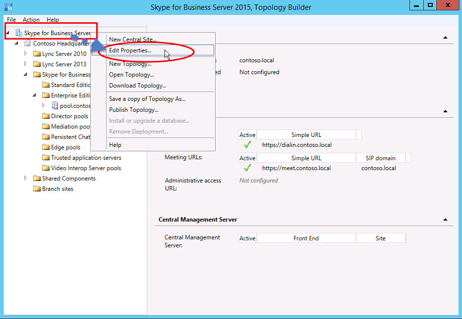

# 在 Skype for Business 服务器中创建和发布新拓扑Create and publish new topology in Skype for Business Server
 
**摘要：** 了解如何在安装 Skype for Business 服务器之前创建、发布和验证新拓扑。**Summary:** Learn how to create, publish, and verify a new topology before you install Skype for Business Server. 从 Microsoft 评估中心下载免费试用版 Skype for Business 服务器，网址为： [https://www.microsoft.com/evalcenter/evaluate-skype-for-business-server](https://www.microsoft.com/evalcenter/evaluate-skype-for-business-server)。Download a free trial of Skype for Business Server from the Microsoft Evaluation center at: [https://www.microsoft.com/evalcenter/evaluate-skype-for-business-server](https://www.microsoft.com/evalcenter/evaluate-skype-for-business-server).
  
在拓扑中的每台服务器上安装 Skype for Business 服务器系统之前，必须创建一个拓扑并将其发布。Before you can install the Skype for Business Server system on each of the servers in the topology, you must create a topology and publish it. 发布拓扑时，拓扑信息会载入中央管理存储数据库。When you publish a topology, you are loading the topology information into the Central Management Store database. 如果这是 Enterprise Edition 池，您将在初次发布新拓扑时创建中央管理存储数据库。If this is an Enterprise Edition pool, you are creating the Central Management Store database the first time you publish a new topology. 如果是 Standard Edition，则需要运行部署向导中的“准备第一个 Standard Edition Server”流程，之后才能发布拓扑。If this is Standard Edition, you will need to run the Prepare First Standard Edition Server process from the Deployment Wizard before you publish a topology. 这将安装 SQL Server Express Edition 实例，并创建中央管理存储，从而为 Standard Edition 做好准备。This prepares for Standard Edition by installing a SQL Server Express Edition instance and creating the Central Management Store. 第 1 步至第 5 步可以按任意顺序执行。You can do steps 1 through 5 in any order. 但是，第 6、7、8 步必须在第 1 步至第 5 步之后按图表所示顺序执行。However, you must do steps 6, 7, and 8 in order, and after steps 1 through 5, as outlined in the diagram. 如何创建和发布新拓扑在 8 个步骤中的第 6 步介绍。How to create and publish a new topology is described in step 6 of 8.
  

  
## 创建和发布新拓扑Create and publish new topology

你可以使用 Skype for Business Server 拓扑生成器来设计、定义、配置和发布拓扑。You can use Skype for Business Server Topology Builder to design, define, configure, and publish topologies. 在您安装本文前面部分介绍的管理工具时，将安装此工具。This tool was installed when you installed Administrative Tools earlier in the article. 在创建拓扑时，可选择许多不同的选项。There are many different choices you can make when you create a topology. 在此过程中，您将创建具有会议功能的基本拓扑。In this procedure, you will create a basic topology with conferencing.
  
> [!IMPORTANT]
> Skype for business 服务器需要 SQL Server 才能运行。Skype for Business Server requires SQL Server in order to operate. 主数据库被称作中央管理存储。The primary databases are known as the Central Management Store. 如果您要部署 Enterprise Edition，则会在您使用以下步骤发布拓扑时创建这些数据库。If you are deploying Enterprise Edition, these databases are created when you publish the topology by using the steps below. 在这种情况下，拓扑生成器将要求您为 SQL Server 安装提供连接信息。In this case, Topology Builder will ask you for the connection information to a SQL Server installation. 如果您计划部署 Standard Edition，您需要首先安装 SQL Server Express Edition，然后才能定义和发布新拓扑。If you are planning to deploy Standard Edition, you will need to install SQL Server Express Edition before you define and publish the new topology. 要安装 SQL Server Express Edition，您应在充当前端的服务器上打开部署向导，然后运行“准备第一个 Standard Edition Server”。To install SQL Server Express Edition, you should open the Deployment Wizard on the server that will act as the Front End, and then run Prepare First Standard Edition Server. 单击“准备第一个 Standard Edition Server”时，部署向导会自动安装 SQL Server Express Edition 并创建中央管理存储数据库。When you click Prepare First Standard Edition Server, the Deployment Wizard automatically installs SQL Server Express Edition and creates the Central Management Store databases. 
  
### 创建新拓扑Create a new topology

1. 以拥有拓扑生成器访问权限的标准用户身份登录。Log in as a standard user with access to Topology Builder.
    
2. 打开 Skype for Business 服务器拓扑生成器。Open Skype for Business Server Topology Builder.
    
3. 选择“**新建拓扑**”，然后单击“**确定**”。Select **New Topology**, and click **OK**..
    
4. 为拓扑配置文件选择位置和文件名。Select a location and file name for the topology configuration file.
    
    > [!NOTE]
    > 拓扑配置被另存为拓扑生成器 XML (.tbxml) 文件。发布拓扑时，您会将来自文件的配置信息推送到 SQL Server 服务器。在未来打开拓扑生成器时，您可以将现有配置从 SQL Server 直接下载到拓扑生成器中，然后将其重新发布到 SQL Server 或另存为拓扑生成器配置文件。The topology configuration is saved as a Topology Builder XML (.tbxml) file. When you publish a topology, you are pushing the configuration information from the file to the SQL Server database. When you open Topology Builder in the future, you can download the existing configuration from SQL Server directly into Topology Builder and either publish it back to SQL Server or save it as a Topology Builder configuration file. 
  
5. 在“**定义主域**”屏幕上，输入“**主 SIP 域**”，然后单击“**下一步**”。在此示例中，我们使用 **contoso.local**，如图所示。On the **Define the primary domain screen**, enter the **primary SIP domain**, and click **Next**. In this example, we are using **contoso.local**, as shown in the figure.
    
     
  
6. 添加其他支持的 SIP 域，然后单击“**下一步**”。Add any additional supported SIP domains, and then click **Next**.
    
7. 为第一个站点（位置）输入“**名称**”和“**说明**”，然后单击“**下一步**”，如图所示。Enter a **Name** and **Description** for the first site (location), and then click **Next**, as shown in the figure.
    
     
  
8. 为站点输入“**城市**”、“**省/自治区/直辖市**”和“**国家/地区代码**”，然后单击“**下一步**”。Enter the **City**, **State/Province**, and **Country/Region Code** for the site, and then click **Next**.
    
9. 单击“**完成**”以完成定义新拓扑的流程。新建前端向导将自动启动。Click **Finish** to complete the process of defining a new topology. The New Front End Wizard launches automatically.
    
### 定义前端池或 Standard Edition ServerDefine a Front End pool or Standard Edition server

1. 检查向导先决条件，然后单击“**下一步**”。Review the wizard prerequisites, and then click **Next**.
    
2. 输入池的完全限定域名 (FQDN) 并选择“**Enterprise Edition 前端池**”或“**Standard Edition Server**”，然后单击“**下一步**”，如图所示。Enter the fully qualified domain name (FQDN) of the pool, and select either **Enterprise Edition Front End Pool** or **Standard Edition Server**, and then click **Next**, as shown in the figure.
    
    > [!TIP]
    > Skype for business Server 企业版可包括多台协同工作的服务器，以提供前端角色。Skype for Business Server Enterprise Edition can include multiple servers working together to provide the Front End role. 使用多台服务器来履行角色职责时，此配置被称作池。When multiple servers are used to fulfill the role, it is called a pool. 因此，通过协作来提供前端角色的多台服务器也被称作前端池。Thus, multiple servers working together to provide the Front End role is also referred to as the Front End pool. Skype for business Server Standard Edition 只能包含一台服务器，以便提供前端角色。Skype for Business Server Standard Edition can include only a single server to provide the Front End role. 即便只通过一台服务器来提供该角色，通常也将它称为前端池。It is common to refer to the Front End pool even if only a single server is providing the role. 
  
     
  
3. 输入池中所有计算机的完全限定域名 (FQDN)，然后单击“**下一步**”，如图所示。Enter the fully qualified domain names (FQDNs) of all computers in the pool, and then click **Next** as shown in the figure.
    
     
  
4. 选择将包含在此拓扑中的功能，然后单击“**下一步**”，如图所示。Select the features that will be included in this topology, and then click **Next** as shown in the figure.
    
    > [!NOTE]
    > Skype for Business 服务器包含许多高级功能。Skype for Business Server includes many advanced features. 有关要使用的每项具体功能，请查看规划和部署文档。Review planning and deployment documentation for each specific feature you want to use. 
  
     
  
5. 在 "**选择 collocated 服务器角色**" 页面上，您可以选择在前端服务器上 collocate 中介服务器，也可以选择将其部署为独立服务器。On the **Select collocated server roles** page, you can choose to collocate the Mediation server on the Front End server, or you can choose to deploy it as a standalone server.
    
    如果您要在 Enterprise Edition 前端池上并置中介服务器，请确保选中该复选框。If you intend to collocate the Mediation server on the Enterprise Edition Front End pool, ensure the check box is selected. 将在池服务器上部署服务器角色。The server role will be deployed on the pool servers. 如果您要将中介服务器部署为独立服务器，请清除相应的复选框。If you intend to deploy the Mediation server as a stand-alone server, clear the appropriate check box. 在完全部署前端服务器之后，你将在单独的部署步骤中部署中介服务器。You will deploy the Mediation server in a separate deployment step after you completely deploy the Front End server. 有关 collocation 的规划详细信息，请参阅[Skype for Business 服务器的拓扑基础知识](../../plan-your-deployment/topology-basics/topology-basics.md)。For planning details about a collocation, see [Topology Basics for Skype for Business Server](../../plan-your-deployment/topology-basics/topology-basics.md).
    
6. 通过“**将服务器角色与此前端池关联**”页，可以定义服务器角色并将服务器角色与前端池关联。以下角色可用：By using the **Associate server roles with this Front End pool** page, you can define and associate server roles with the Front End pool. The following role is available:
    
    **启用边缘池**定义和关联单个边缘服务器或边缘服务器池。**Enable an Edge pool** Defines and associates a single Edge Server or a pool of Edge Servers. 边缘服务器为组织内的用户和组织外的用户（包括联盟用户）进行通信和协作提供方便。An Edge Server facilitates communication and collaboration between users inside the organization and people outside the organization, including federated users.
    
    您可以使用两种方案来部署和关联服务器角色。There are two possible scenarios that you can use to deploy and associate the server roles.
    
    对于方案一，为新的安装定义新的拓扑。可以使用以下两种方法之一完成安装：For scenario one, you are defining a new topology for a new installation. You can approach the installation in one of the two following ways:
    
   - 清除相应复选框，然后定义拓扑。在发布、配置和测试前端和后端服务器角色之后，您可以再次运行拓扑生成器以将角色服务器添加到拓扑中。此策略允许您测试前端池和运行 SQL Server 的服务器，无需面对其他角色所带来的额外复杂性。完成初始测试后，可以再次运行拓扑生成器来选择需要部署的角色。Leave the check box clear, and define the topology. After you have published, configured, and tested the Front End and Back End Server roles, you can run Topology Builder again to add the role servers to the topology. By using this strategy, you can test the Front End pool and the server running SQL Server without additional complications from additional roles. After you have completed your initial testing, you can run Topology Builder again to select the roles you need to deploy.
    
   - 选择需要安装的角色，然后设置硬件以适应所选择的角色。Select roles that you need to install, and then set up the hardware to accommodate the selected roles.
    
     对于方案二，您具有现有的部署，并且您的基础架构已为新角色做好准备，或者，您需要将现有角色与新的前端池关联。For scenario two, you have an existing deployment, and your infrastructure is ready for new roles, or you need to associate existing roles with a new Front End server.
    
   - 在这种情况下，需选择打算部署的角色或要与新的前端池相关联的角色。无论在哪种情况下，都需要定义角色，设置任何所需硬件，然后继续安装。In this case, you will select the roles that you intend to deploy or associate with the new Front End server. In either case, you will proceed with the definition of the roles, set up any needed hardware, and proceed with the installation.
    
7. 接下来，您将定义用于拓扑的 SQL Server 存储。Next, you will define the SQL Server store that will be used with the topology. 在此示例中，我们使用默认实例。In this example, we use the Default instance. 有关 SQL Server 功能（如高可用性）的详细信息，请参阅[Skype For Business 服务器中的 "高可用性和灾难恢复计划](../../plan-your-deployment/high-availability-and-disaster-recovery/high-availability-and-disaster-recovery.md)"。For more information about SQL Server features, such as High Availability, see [Plan for high availability and disaster recovery in Skype for Business Server](../../plan-your-deployment/high-availability-and-disaster-recovery/high-availability-and-disaster-recovery.md).
    
   - 若要使用已在拓扑中定义的现有 SQL Server 存储，请选择“**SQL 存储**”中的一个实例。To use an existing SQL Server store that has already been defined in your topology, select an instance from **SQL store**.
    
   - 若要定义新的 SQL Server 实例以存储池信息，请单击 "**新建**"，然后在 "**定义新的 sql 存储**" 对话框中指定**SQL Server FQDN** 。To define a new SQL Server instance to store pool information, click **New**, and then specify the **SQL Server FQDN** in the **Define New SQL Store** dialog box.
    
   - 要指定 SQL Server 实例的名称，请选择“**命名实例**”，然后指定实例的名称。To specify the name of a SQL Server instance, select **Named Instance**, and then specify the name of the instance.
    
   - 要使用默认实例，请单击“**默认实例**”。To use the default instance, click **Default instance**.
    
   - 若要使用 SQL 镜像，请选择“**启用 SQL 镜像**”，选择现有实例或创建一个新实例。To use SQL Mirroring, select **Enable SQL mirroring**, and select an existing instance, or create a new instance.

     > [!NOTE]
     > 在 Skype for Business Server 2015 中可以使用 SQL 镜像，但 Skype for Business Server 2019 不再支持该功能。SQL Mirroring is available in Skype for Business Server 2015 but is no longer supported in Skype for Business Server 2019. 对于 Skype for Business Server 2019，首选 AlwaysOn 可用性组、AlwaysOn 故障转移群集实例 (FCI) 和 SQL 故障转移群集方法。The  AlwaysOn Availability Groups, AlwaysOn Failover Cluster Instances (FCI), and SQL failover clustering methods are preferred with Skype for Business Server 2019.
    
     在此示例中，我们输入 **SQL Server FQDN** 并配置相关的高可用性设置，然后单击**确定**，如图所示。For this example, we enter the **SQL Server FQDN**, and configure any relevant high availability settings, and then click **OK**, as shown in the figure.
    
     
  
8. 决定是否要启用 SQL Server 存储镜像或 SQL Server 镜像见证，然后单击**下一步**。Decide if you want to enable SQL Server store mirroring or SQL Server mirroring witness, and then click **Next**.
    
9. 定义希望使用的文件共享。Define the file share that you want to use.
    
   - 要使用已经在拓扑中定义的文件共享，请选择“**使用先前定义的文件共享**”。To use a file share that has already been defined in your topology, select **Use a previously defined file share**.
    
   - 要定义新文件共享，请选择“**定义新的文件共享**”，在“**文件服务器 FQDN**”框中，输入要放置文件共享的现有文件服务器的 FQDN，然后在“**文件共享**”框中输入文件共享的名称。To define a new file share, select **Define a new file share**, in the **File Server FQDN** box, enter the FQDN of the existing file server where the file share is to reside, and then enter a name for the file share in the **File Share** box.
    
     在此示例中，我们将单击“**定义新文件存储**”，输入“**文件服务器 FQDN**”和“**文件共享**”，然后单击“**下一步**”。For this example, we will click **Define a new file store**, enter the **file server FQDN** and **file share**, and then click **Next**.
    
     > [!NOTE]
     > Skype for business 服务器的文件共享可以 collocated，但出于性能原因，建议不要这样做。The file share for Skype for Business Server can be collocated but it is not recommended for performance reasons. 注意，在此示例中，文件共享位于充当文件共享的单个专用服务器上。Note that in this example, the file share has been located on a single dedicated server that will act as the file share. 但是，建议使用其他更加强大的文件共享系统，比如使用 Windows Server 2012 R2 的 DFS。However, other more robust file share systems, such as DFS using Windows Server 2012 R2, are recommended. 有关受支持的文件共享系统的详细信息，请参阅[Skype for business 环境的要求](../../plan-your-deployment/requirements-for-your-environment/requirements-for-your-environment.md)。For details about supported file share systems, see [Requirements for your Skype for Business environment](../../plan-your-deployment/requirements-for-your-environment/requirements-for-your-environment.md). 有关创建文件共享的详细信息，请参阅[在 Skype For Business 服务器中创建文件共享](create-a-file-share.md)。For more information about creating the file share, see [Create a file share in Skype for Business Server](create-a-file-share.md). 你可以在未创建文件共享的情况下定义文件共享。You can define the file share without the file share having been created. 你需要首先在定义的位置创建文件共享，然后才能发布拓扑。You will need to create the file share in the location you define before you publish the topology. 
  
10. 在“指定 Web 服务 URL”页上，您必须决定是否需要覆盖内部 Web 服务池基 URL。On the Specify the Web Services URL page, you must decide if you need to override the internal Web Services pool base URL. 此覆盖的原因与负载平衡有关。The reason for this override has to do with load balancing. 可通过简单的 DNS 负载平衡来对基本 SIP 流量进行负载平衡。Basic SIP traffic can be load balanced through simple DNS load balancing. 但是，HTTP/S Web 服务网络流量则必需使用受支持的硬件或软件负载平衡解决方案。However, the HTTP/S Web Services network traffic must use a supported Hardware or Software load balancing solution. 有关支持的负载平衡器，请参阅[Skype for Business 基础结构](https://docs.microsoft.com/SkypeForBusiness/certification/infra-gateways)。For supported load balancers, see [Infrastructure for Skype for Business](https://docs.microsoft.com/SkypeForBusiness/certification/infra-gateways). 在此示例中，我们使用面向 SIP 流量的 DNS 负载平衡和支持的软件负载平衡解决方案。In this example, we used DNS load balancing for SIP traffic and a supported software load balancing solution. 由于我们通过这种方式来划分流量，我们需要覆盖内部 Web 服务池 FQDN。Because we are dividing the traffic this way, we need to override the internal Web Services pool FQDN. 或者，如果我们拥有上层负载平衡器并通过它来发送所有流量（而非使用面向 SIP 流量的 DNS 负载平衡），我们就不需要覆盖 Web 服务 URL。Alternatively, if we had a top line load balancer and sent all traffic through it instead of using DNS load balancing for SIP traffic, we would not need to override the Web Services URL. 
    
    在此主题的 DNS 部分，我们为 webint.contoso.local 创建了一个 A 记录。In the DNS section of this topic, we created an A record for webint.contoso.local. 这是我们用于 Web 服务 HTTP/S 流量的 URL，它必需通过我们设置的、支持的软件负载平衡器。This is the URL we are using for the web services HTTP/S traffic, and it must go through the supported software load balancer we set up. 因此，在此示例中，我们将替代 URL，让 Skype for business 服务器知道所有 HTTP/S 流量应转到 webint，而不是，如图所示。Therefore, in this example, we override the URL to let Skype for Business Server know that all HTTP/S traffic should go to webint.contoso.local instead of pool.contoso.local, as shown in the figure. 有关负载平衡的详细信息，请参阅[Skype for business 的负载平衡要求](../../plan-your-deployment/network-requirements/load-balancing.md)。For more about load balancing, see [Load balancing requirements for Skype for Business](../../plan-your-deployment/network-requirements/load-balancing.md).
    
    > [!IMPORTANT]
    > 基 URL 指的是 URL 的 Web 服务标识减去 https://。The base URL is the Web Services identity for the URL, minus the https://. 例如，如果池的 Web 服务的完整 URL 是https://webint.contoso.local，则基 URL 为 webint。For example, if the full URL for the Web Services of the pool is https://webint.contoso.local, the base URL is webint.contoso.local. 
  
    - 如果要配置 DNS 负载平衡（如示例中所示），请选中“**覆盖内部 Web 服务池 FQDN**”复选框，在“**内部基 URL**”中输入内部基 URL（必须不同于池 FQDN）。If you are configuring DNS load balancing, as we are in this example, select the **Override internal Web Services pool FQDN** check box, and enter the internal base URL (which must be different from the pool FQDN) in **Internal Base URL**. 
    
    > [!CAUTION]
    > 如果决定使用自定义的 FQDN 覆盖内部 Web 服务，则每个 FQDN 必须与任何其他前端池、控制器或控制器池不同。If you decide to override the Internal Web Services with a self-defined FQDN, each FQDN must be unique from any other Front End pool, Director, or Director pool. 在定义 Url 或完全限定的域名时，**只使用标准字符**（包括 a-z、a-z、0-9 和连字符）。**Use only standard characters** (including A-Z, a-z, 0-9, and hyphens) when you define URLs or fully qualified domain names. 不要使用 Unicode 字符或下划线。Do not use Unicode characters or underscores. 外部 DNS 和公共证书颁发机构 (CA) 通常不支持在 URL 或 FQDN 中使用非标准字符（即，当必须向证书中的使用者名称或使用者替代名称分配 URL 或 FQDN 时）。Nonstandard characters in a URL or FQDN are often not supported by external DNS and public certification authorities (CAs) (that is, when the URL or FQDN must be assigned to the subject name or subject alternative name in the certificate).
  
    - （可选）在“**外部基 URL**”中输入外部基 URL。您可以输入外部基 URL 以将其与内部域名分开来。例如，内部域是 contoso.local，但外部域名是 contoso.com。将使用 contoso.com 域名来定义 URL，因为其必须可以通过公共 DNS 进行解析。如果是反向代理，这也很重要。外部基 URL 域名应该与反向代理的 FQDN 域名相同。移动客户端上的即时消息和状态需要前端池的 HTTP 访问权限。Optionally, enter the external base URL in **External Base URL**. You would enter the external base URL to differentiate it from your internal domain name. For example, your internal domain is contoso.local, but your external domain name is contoso.com. You would define the URL using the contoso.com domain name since it must be resolvable from public DNS. This is also important in the case of a reverse proxy. The external base URL domain name would be the same as the domain name of the FQDN of the reverse proxy. HTTP access to the Front End pool is required for instant messaging and presence on mobile clients.
    
      
  
11. 如果您在“**选择功能**”页上选择了“**会议**”，系统将要求您选择 Office Web Apps 服务器。单击“**新建**”以启动对话框。If you selected **Conferencing** on the **Select Features** page, you will be asked to select an Office Web Apps server. Click **New** to launch the dialog box.
    
12. 在“**定义新的 Office Web Apps 服务器**”对话框的“**Office Web Apps 服务器 FQDN**”框中，键入您的 Office Web Apps 服务器的 FQDN；执行此操作时，您的 Office Web Apps 服务器搜索 URL 应自动输入到“**Office Web Apps 服务器搜索 URL**”框中。In the **Define New Office Web Apps Server** dialog box, type the FQDN of your Office Web Apps server in the **Office Web Apps Server FQDN** box; when you do this, your Office Web Apps server discovery URL should automatically be entered into the **Office Web Apps Server discovery URL** box.
    
    如果 Office Web Apps 服务器在本地安装，并且位于与 Skype for Business 服务器相同的网络区域中，请不要选择 " **Office Web apps" 服务器部署在外部网络（即 "外围/Internet"）中**。If the Office Web Apps server is installed on-premises and in the same network zone as Skype for Business Server, do not select the option **Office Web Apps Server is deployed in an external network (that is, perimeter/Internet)**.
    
    如果 Office Web Apps 服务器部署在内部防火墙之外，则请选择选项“**在外部网络（即，外围/Internet）中部署 Office Web Apps 服务器**”。If the Office Web Apps server is deployed outside your internal firewall, select the option **Office Web Apps Server is deployed in an external network (that is, perimeter/Internet)**.
    
13. 单击“**完成**”以完成配置。如果在“**将服务器角色与此前端池关联**”页上定义了其他角色服务器，将打开单独的角色配置向导页，以使您能够配置服务器角色。在此示例中，我们仅选择会议。Click **Finish** to complete the configuration. If you defined other role servers on the **Associate server roles with this Front End pool** page, separate role configuration wizard pages will open where you can configure the server roles. In this example we only chose conferencing.
    
### 配置简单 UrlConfigure simple URLs

1. 在拓扑生成器中，右键单击 " **Skype For Business 服务器**顶部节点"，然后单击 "**编辑属性**"，如图所示。In Topology Builder, right-click the **Skype for Business Server** top node, and then click **Edit Properties**, as shown in the figure.
    
     
  
2. 在“**简单 URL**”窗格中，选择要编辑的“**电话访问 URL:**”（拨入）或“**会议 URL:**”（会议），然后单击“**编辑 URL**”。In the **Simple URLs** pane, select either **Phone access URLs:** (Dial-in) or **Meeting URLs:** (Meet) to edit, and then click **Edit URL**.
    
3. 将 URL 更新为所需的值，然后单击“**确定**”保存已编辑的 URL。Update the URL to the value you want, and then click **OK** to save the edited URL. 您应使用外部 SIP 域来配置简单 URL，使得外部用户可以加入会议，例如外部的 contoso.com（与作为内部域的 contoso.local 相反）。You should configure the simple URL using the external SIP domain so that external users can join meetings, for example, contoso.com, which is external, as opposed to contoso.local, which is an internal domain. 因此，SIP 域应能通过外部 DNS 进行解析。Thus, the SIP domain should be able to be resolved by external DNS.
    
4. 如有必要，使用相同的步骤编辑会议 URL。Edit the Meet URL by using the same steps, if necessary.
    
### 定义可选的管理简单 URLTo define the optional Admin simple URL

1. 在拓扑生成器中，右键单击 " **Skype For Business 服务器**" 节点，然后单击 "**编辑属性**"。In Topology Builder, right-click the **Skype for Business Server** node, and then click **Edit Properties**.
    
2. 在 "**管理访问 URL** " 框中，输入要用于管理访问 Skype For business Server "控制面板" 的简单 URL，然后单击 **"确定"**。In the **Administrative access URL** box, enter the simple URL you want for administrative access to Skype for Business Server Control Panel, and then click **OK**.
    
    > [!TIP]
    > 建议尽可能使用最简单的 URL 作为管理 URL。We recommend using the simplest possible URL for the Admin URL. 最简单的选项https://admin是。_ \<域\>_。The simplest option is https://admin. _\<domain\>_. 管理 URL 可以是内部或外部域，例如 contoso.local 或 contoso.com（只要任一记录可以在内部 DNS 中得到解析）。The Admin URL can be either an internal or external domain, for example, contoso.local or contoso.com, as long as either record is resolvable in internal DNS. 
  
    > [!IMPORTANT]
    > 如果在初始部署后更改简单 URL，您必须注意哪些更改会影响简单 URL 的域名系统 (DNS) 记录和证书。If you change a simple URL after initial deployment, you must be aware of what changes impact your Domain Name System (DNS) records and certificates for simple URLs. 如果更改影响简单 URL 的基础，则还必须更改 DNS 记录和证书。If the change impacts the base of a simple URL, you must change the DNS records and certificates, too. 例如，从https://sfb.contoso.com/Meet https://meet.contoso.com sfb.contoso.com 更改为 meet.contoso.com 的基本 URL，因此你需要更改 DNS 记录和证书才能引用 meet.contoso.com。For example, changing from https://sfb.contoso.com/Meet to https://meet.contoso.com changes the base URL from sfb.contoso.com to meet.contoso.com, so you would need to change the DNS records and certificates to refer to meet.contoso.com. 如果将简单 URL 更改https://sfb.contoso.com/Meet为 "与https://sfb.contoso.com/Meetings"，sfb.contoso.com 的基 url 保持不变，因此不需要任何 DNS 或证书更改。If you changed the simple URL from https://sfb.contoso.com/Meet to https://sfb.contoso.com/Meetings, the base URL of sfb.contoso.com stays the same, so no DNS or certificate changes are needed. 但是，每当你更改简单的 URL 名称时，你必须在每个 Director 和前端服务器上运行**Enable-CsComputer** cmdlet 来注册更改。Whenever you change a simple URL name, however, you must run the **Enable-CsComputer** cmdlet on each Director and Front End server to register the change.
  
### 发布并验证拓扑Publish and verify the topology

1. 检查所有简单 URL 是否配置正确。Check that all simple URLs are configured correctly.
    
2. 确认基于 SQL Server 的服务器处于联机状态，并可供安装拓扑生成器（包括所有必要防火墙规则）的计算机使用。Confirm that the SQL Server-based server is online and available to the computer where Topology Builder is installed, including any necessary firewall rules.
    
3. 确认文件共享可用，并已定义适当的权限。Confirm that the file share is available and that the proper permissions are defined.
    
4. 确认拓扑中定义了满足部署要求的正确服务器角色。Confirm that the correct server roles that meet the deployment requirements are defined in the topology.
    
5. 验证服务器存在于 Active Directory 域服务 (AD DS) 中。在您将服务器加入该域时，会自动执行此操作。Verify that the servers exist in Active Directory Domain Services (AD DS). This happens automatically when you join the servers to the domain.
    
    如果已验证拓扑并且未出现验证错误，则发布拓扑的准备工作应该已经就绪。如果出现验证错误，则必须先更正错误，然后才能发布拓扑。When you have verified the topology and there are no validation errors, you should be ready to publish the topology. If there are validation errors, you must correct them before you can publish the topology.
    
6. 右键单击“Skype for Business Server”\*\*\*\* 节点，然后单击“发布拓扑”\*\*\*\*。Right-click the **Skype for Business Server** node, and then click **Publish Topology**.
    
7. 在“**发布拓扑**”页上，单击“**下一步**”。On the **Publish the topology** page, click **Next**.
    
8. 在“**选择中央管理服务器**”页上，选择一个前端池，如图所示。On the **Select Central Management Server** page, select a Front End pool, as shown in the figure.
    
    > [!NOTE]
    > 您可以单击“**高级**”以配置数据库文件位置。You can click **Advanced** to configure database file locations.
  
     
  
9. 在“**选择数据库**”页上，选择要发布的数据库。On the **Select databases** page, select the databases you want to publish.
    
    > [!NOTE]
    > 如果您没有创建数据库的相应权限，则可以清除这些数据库旁边的复选框，并且具有相应权限的人员可以在以后创建数据库。If you don't have the appropriate rights to create the databases, you can clear the check boxes next to those databases, and someone with appropriate rights can later create the databases. 有关要求的详细信息，请参阅[Skype for Business 服务器的服务器要求](../../plan-your-deployment/requirements-for-your-environment/server-requirements.md)。For details about requirements, see [Server requirements for Skype for Business Server](../../plan-your-deployment/requirements-for-your-environment/server-requirements.md). 
  
10. 也可以单击“**高级**”。Optionally click **Advanced**. 通过使用高级 SQL Server 数据文件放置选项，您可以在以下选项之间进行选择：By using Advanced SQL Server data file placement options, you can select between the following options: 
    
    - **自动确定数据库文件位置**-此选项通过将日志和数据文件分发到最佳位置，基于基于 SQL server 的服务器上的磁盘配置确定最佳操作性能。**Automatically determine database file location** - This option determines the best operational performance based on the disk configuration on your SQL Server-based server by distributing the log and data files to the best location.
    
    - **使用 SQL Server 实例默认值**-此选项使用实例设置将日志和数据文件放在基于 SQL server 的服务器上。**Use SQL Server instance defaults** - This option puts log and data files onto the SQL Server-based server by using the instance settings. 此选项不会使用基于 SQL Server 的服务器的运行功能来确定日志和数据的最佳位置。This option does not use the operational functionality of the SQL Server-based server to determine optimal locations for logs and data. 通常，SQL Server 管理员会将日志和数据文件移动到适用于基于 SQL Server 的服务器和组织管理过程的位置。The SQL Server administrator would typically move the log and data files to locations that are appropriate for the SQL Server-based server and organization management procedures.
    
    单击“**确定**”，然后单击“**下一步**”。Click **OK**, and then click **Next**. 
    
11. 也可以单击“**高级**”。通过使用高级 SQL Server 数据文件放置选项，您可以在以下选项之间进行选择：Optionally, click **Advanced**. By using Advanced SQL Server data file placement options, you can select between the following options: 
    
    - **自动确定数据库文件位置**-此选项通过将日志和数据文件分发到最佳位置，基于基于 SQL server 的服务器上的磁盘配置确定最佳操作性能。**Automatically determine database file location** - This option determines the best operational performance based on the disk configuration on your SQL Server-based server by distributing the log and data files to the best location.
    
    - **使用 SQL Server 实例默认值**-此选项使用实例设置将日志和数据文件放在基于 SQL server 的服务器上。**Use SQL Server instance defaults** - This option puts log and data files onto the SQL Server-based server by using the instance settings. 此选项不会使用基于 SQL Server 的服务器的运行功能来确定日志和数据的最佳位置。This option does not use the operational functionality of the SQL Server-based server to determine optimal locations for logs and data. 通常，SQL Server 管理员会将日志和数据文件移动到适用于基于 SQL Server 的服务器和组织管理过程的位置。The SQL Server administrator would typically move the log and data files to locations that are appropriate for the SQL Server-based server and organization management procedures.
    
    单击“**确定**”。Click **OK**.
    
12. 单击“**下一步**”完成发布过程。Click **Next** to complete the publishing process.
    
    > [!NOTE]
    > 此步骤经常出现一项故障，即无法创建 SQL Server 数据库。无法完成该流程时，将显示一个错误，如图所示。最可能的原因在于尝试创建数据库的用户没有相应的权限，或者防火墙或其他网络问题导致无法联系 SQL Server 系统。A common failure for this step is that the SQL Server databases cannot be created. When the process cannot complete, an error is provided, as shown in the figure. The most likely cause is that the user attempting to create the database does not have the appropriate permissions, or the SQL Server system cannot be contacted due to a firewall or other network issue. 
  
     
  
13. 完成发布流程后，系统将为您提供一个用于打开后续步骤列表的链接。单击“**单击此处打开待办事项列表**”以查看后续步骤，然后单击“**完成**”。When the publishing process completes, you are presented with a link to open a list of next steps. Click **Click here to open to-do list** to view the next steps, and then click **Finish**. 
    
    在数据库创建过程中，出现“已完成，但带有警告”消息并不表示发生错误。The "Completed with warnings" message for the database creation does not mean there was an error. 安装过程必须更改 SQL Server 中的 "Skype for business" 服务器的设置才能正常工作。The installation process has to change settings in SQL Server for Skype for Business Server to work correctly. SQL Server 中的设置发生更改时，该事件会被记录为警告，使得 SQL Server 管理员能够准确理解安装过程完成了哪些任务。When a setting is changed in SQL Server, it is logged as a warning so that SQL Server administrators can understand exactly what the installation process completed. 如果收到警告，您可以选择记录，然后单击 "**查看日志**" 以查看警告的详细信息。If you receive a warning, you can select the record, and then click **View Logs** to view the details of the warning.
    
    成功发布拓扑后，你可以开始在拓扑中运行 Skype for business Server 的每台服务器上安装中央管理存储的本地副本。When the topology has been successfully published, you can begin installing a local replica of the Central Management store on each server running Skype for Business Server in your topology. 我们建议您从第一个前端池开始。We recommend that you begin with the first Front End pool. 
    

