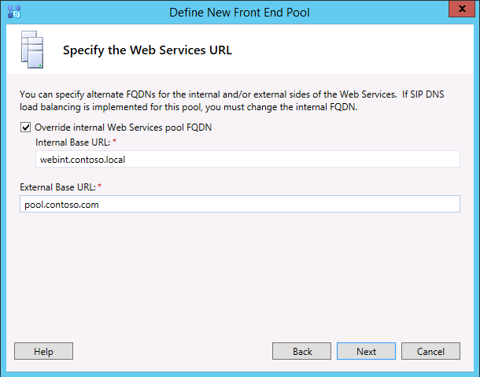

# 创建和发布新拓扑中 Skype 业务服务器
 
**摘要：** 了解如何创建、 发布和业务服务器安装 Skype 之前验证新拓扑。 下载免费试用版 Skype 业务服务器从 Microsoft 评估中心，网址为： [https://www.microsoft.com/evalcenter/evaluate-skype-for-business-server](https://www.microsoft.com/evalcenter/evaluate-skype-for-business-server)。
  
您可以在每个拓扑中的服务器上安装 Business Server system 的 Skype 之前，您必须创建一个拓扑，并将其发布。 发布拓扑时，拓扑信息会载入中央管理存储数据库。 如果这是 Enterprise Edition 池，您将在初次发布新拓扑时创建中央管理存储数据库。 如果是 Standard Edition，则需要运行部署向导中的“准备第一个 Standard Edition Server”流程，之后才能发布拓扑。 这将安装 SQL Server Express Edition 实例，并创建中央管理存储，从而为 Standard Edition 做好准备。 第 1 步至第 5 步可以按任意顺序执行。 但是，第 6、7、8 步必须在第 1 步至第 5 步之后按图表所示顺序执行。 如何创建和发布新拓扑在 8 个步骤中的第 6 步介绍。
  

  
## 创建和发布新拓扑

可以使用业务 Server 拓扑生成器的 Skype 设计、 define、 配置和发布拓扑。 在您安装本文前面部分介绍的管理工具时，将安装此工具。 在创建拓扑时，可选择许多不同的选项。 在此过程中，您将创建具有会议功能的基本拓扑。
  
> [!IMPORTANT]
> Skype 业务服务器要求才能运行 SQL Server。 主数据库被称作中央管理存储。 如果您要部署 Enterprise Edition，则会在您使用以下步骤发布拓扑时创建这些数据库。 在这种情况下，拓扑生成器将要求您为 SQL Server 安装提供连接信息。 如果您计划部署 Standard Edition，您需要首先安装 SQL Server Express Edition，然后才能定义和发布新拓扑。 要安装 SQL Server Express Edition，您应在充当前端的服务器上打开部署向导，然后运行“准备第一个 Standard Edition Server”。 单击“准备第一个 Standard Edition Server”时，部署向导会自动安装 SQL Server Express Edition 并创建中央管理存储数据库。 
  
### 创建新拓扑

1. 以拥有拓扑生成器访问权限的标准用户身份登录。
    
2. 业务 Server 拓扑生成器打开 Skype。
    
3. 选择“**新建拓扑**”，然后单击“**确定**”。
    
4. 为拓扑配置文件选择位置和文件名。
    
    > [!NOTE]
    > 拓扑配置被另存为拓扑生成器 XML (.tbxml) 文件。发布拓扑时，您会将来自文件的配置信息推送到 SQL Server 服务器。在未来打开拓扑生成器时，您可以将现有配置从 SQL Server 直接下载到拓扑生成器中，然后将其重新发布到 SQL Server 或另存为拓扑生成器配置文件。 
  
5. 在“**定义主域**”屏幕上，输入“**主 SIP 域**”，然后单击“**下一步**”。在此示例中，我们使用 **contoso.local**，如图所示。
    
     
  
6. 添加其他支持的 SIP 域，然后单击“**下一步**”。
    
7. 为第一个站点（位置）输入“**名称**”和“**说明**”，然后单击“**下一步**”，如图所示。
    
     
  
8. 为站点输入“**城市**”、“**省/自治区/直辖市**”和“**国家/地区代码**”，然后单击“**下一步**”。
    
9. 单击“**完成**”以完成定义新拓扑的流程。新建前端向导将自动启动。
    
### 定义前端池或 Standard Edition Server

1. 检查向导先决条件，然后单击“**下一步**”。
    
2. 输入池的完全限定域名 (FQDN) 并选择“**Enterprise Edition 前端池**”或“**Standard Edition Server**”，然后单击“**下一步**”，如图所示。
    
    > [!TIP]
    > 对于业务 Server Enterprise Edition 的 Skype 可以包括协作以提供前端角色的多台服务器。 使用多台服务器来履行角色职责时，此配置被称作池。 因此，通过协作来提供前端角色的多台服务器也被称作前端池。 对于业务 Server Standard Edition 的 Skype 可以包括只有一个服务器提供前端角色。 即便只通过一台服务器来提供该角色，通常也将它称为前端池。 
  
     
  
3. 输入池中所有计算机的完全限定域名 (FQDN)，然后单击“**下一步**”，如图所示。
    
     
  
4. 选择将包含在此拓扑中的功能，然后单击“**下一步**”，如图所示。
    
    > [!NOTE]
    > Skype 业务服务器包含很多高级的功能。 有关要使用的每项具体功能，请查看规划和部署文档。 
  
     
  
5. 在**选择并置的服务器角色**页中，您可以选择并置中介服务器在前端服务器上，或您可以选择部署为独立服务器。
    
    如果您要在 Enterprise Edition 前端池上并置中介服务器，请确保选中该复选框。 将在池服务器上部署服务器角色。 如果您要将中介服务器部署为独立服务器，请清除相应的复选框。 完全部署前端服务器后，您将部署一个单独的部署步骤中的中介服务器。 有关规划有关并置的详细信息，请参阅[拓扑的 Skype 业务服务器的基础知识](../../plan-your-deployment/topology-basics/topology-basics.md)。
    
6. 通过“**将服务器角色与此前端池关联**”页，可以定义服务器角色并将服务器角色与前端池关联。以下角色可用：
    
    **启用边缘池**定义并将一台边缘服务器或边缘服务器池相关联。 边缘服务器为组织内的用户和组织外的用户（包括联盟用户）进行通信和协作提供方便。
    
    您可以使用两种方案来部署和关联服务器角色。
    
    对于方案一，为新的安装定义新的拓扑。可以使用以下两种方法之一完成安装：
    
   - 清除相应复选框，然后定义拓扑。在发布、配置和测试前端和后端服务器角色之后，您可以再次运行拓扑生成器以将角色服务器添加到拓扑中。此策略允许您测试前端池和运行 SQL Server 的服务器，无需面对其他角色所带来的额外复杂性。完成初始测试后，可以再次运行拓扑生成器来选择需要部署的角色。
    
   - 选择需要安装的角色，然后设置硬件以适应所选择的角色。
    
     对于方案二，您具有现有的部署，并且您的基础架构已为新角色做好准备，或者，您需要将现有角色与新的前端池关联。
    
   - 在这种情况下，需选择打算部署的角色或要与新的前端池相关联的角色。无论在哪种情况下，都需要定义角色，设置任何所需硬件，然后继续安装。
    
7. 接下来，您将定义用于拓扑的 SQL Server 存储。 在此示例中，我们使用默认实例。 有关 SQL Server 的功能，例如高可用性的详细信息，请参阅[规划高可用性和灾难恢复 Skype 业务服务器中](../../plan-your-deployment/high-availability-and-disaster-recovery/high-availability-and-disaster-recovery.md)。
    
   - 若要使用已在拓扑中定义的现有 SQL Server 存储，请选择“**SQL 存储**”中的一个实例。
    
   - 要定义新的 SQL Server 实例来存储池信息，请单击**新建**，然后在**定义新的 SQL 存储**对话框中指定**SQL Server FQDN** 。
    
   - 要指定 SQL Server 实例的名称，请选择“**命名实例**”，然后指定实例的名称。
    
   - 要使用默认实例，请单击“**默认实例**”。
    
   - 若要使用 SQL 镜像，请选择“**启用 SQL 镜像**”，选择现有实例或创建一个新实例。

     > [!NOTE]
     > SQL 镜像的业务服务器 2015 Skype 中可用，但业务服务器 2019年不再支持在 Skype。 AlwaysOn 可用性组、 AlwaysOn 故障转移群集实例 (FCI)，和 SQL 故障转移群集方法是首选与 Skype 的业务服务器 2019年。
    
     在此示例中，我们输入 **SQL Server FQDN** 并配置相关的高可用性设置，然后单击**确定**，如图所示。
    
     
  
8. 决定是否要启用 SQL Server 存储镜像或 SQL Server 镜像见证，然后单击**下一步**。
    
9. 定义希望使用的文件共享。
    
   - 要使用已经在拓扑中定义的文件共享，请选择“**使用先前定义的文件共享**”。
    
   - 要定义新文件共享，请选择“**定义新的文件共享**”，在“**文件服务器 FQDN**”框中，输入要放置文件共享的现有文件服务器的 FQDN，然后在“**文件共享**”框中输入文件共享的名称。
    
     在此示例中，我们将单击“**定义新文件存储**”，输入“**文件服务器 FQDN**”和“**文件共享**”，然后单击“**下一步**”。
    
     > [!NOTE]
     > Skype 业务服务器的文件共享可以并置，但出于性能原因不建议。 注意，在此示例中，文件共享位于充当文件共享的单个专用服务器上。 但是，建议使用其他更加强大的文件共享系统，比如使用 Windows Server 2012 R2 的 DFS。 有关受支持的文件共享系统的详细信息，请参阅[您 Skype 业务环境要求](../../plan-your-deployment/requirements-for-your-environment/requirements-for-your-environment.md)。 有关创建文件共享的详细信息，请参阅[创建 Skype 业务服务器中的文件共享](create-a-file-share.md)。 你可以在未创建文件共享的情况下定义文件共享。 你需要首先在定义的位置创建文件共享，然后才能发布拓扑。 
  
10. 在“指定 Web 服务 URL”页上，您必须决定是否需要覆盖内部 Web 服务池基 URL。 此覆盖的原因与负载平衡有关。 可通过简单的 DNS 负载平衡来对基本 SIP 流量进行负载平衡。 但是，HTTP/S Web 服务网络流量则必需使用受支持的硬件或软件负载平衡解决方案。 支持的负载平衡器，请参阅[for Business 的 Skype 的基础结构](https://docs.microsoft.com/SkypeForBusiness/certification/infra-gateways)。 在此示例中，我们使用面向 SIP 流量的 DNS 负载平衡和支持的软件负载平衡解决方案。 由于我们通过这种方式来划分流量，我们需要覆盖内部 Web 服务池 FQDN。 或者，如果我们拥有上层负载平衡器并通过它来发送所有流量（而非使用面向 SIP 流量的 DNS 负载平衡），我们就不需要覆盖 Web 服务 URL。 
    
    在此主题的 DNS 部分，我们为 webint.contoso.local 创建了一个 A 记录。 这是我们用于 Web 服务 HTTP/S 流量的 URL，它必需通过我们设置的、支持的软件负载平衡器。 因此，本示例中，我们重写让业务服务器 Skype 知道 HTTP/S 的所有流量应都转到 webint.contoso.local 而不是 pool.contoso.local，如图所示的 URL。 有关详细信息负载平衡，请参阅[负载平衡的 Skype 的业务要求](../../plan-your-deployment/network-requirements/load-balancing.md)。
    
    > [!IMPORTANT]
    > 基 URL 指的是 URL 的 Web 服务标识减去 https://。 例如，如果池的 Web 服务的完整 URL 为https://webint.contoso.local的基 URL 是 webint.contoso.local。 
  
    - 如果要配置 DNS 负载平衡（如示例中所示），请选中“**覆盖内部 Web 服务池 FQDN**”复选框，在“**内部基 URL**”中输入内部基 URL（必须不同于池 FQDN）。 
    
    > [!CAUTION]
    > 如果决定使用自定义的 FQDN 覆盖内部 Web 服务，则每个 FQDN 必须与任何其他前端池、控制器或控制器池不同。 **使用仅标准字符**（包括 A-Z、 a-z、 0-9 和连字符） 定义 Url 时或完全限定域名。 不要使用 Unicode 字符或下划线。 外部 DNS 和公共证书颁发机构 (CA) 通常不支持在 URL 或 FQDN 中使用非标准字符（即，当必须向证书中的使用者名称或使用者替代名称分配 URL 或 FQDN 时）。
  
    - （可选）在“**外部基 URL**”中输入外部基 URL。您可以输入外部基 URL 以将其与内部域名分开来。例如，内部域是 contoso.local，但外部域名是 contoso.com。将使用 contoso.com 域名来定义 URL，因为其必须可以通过公共 DNS 进行解析。如果是反向代理，这也很重要。外部基 URL 域名应该与反向代理的 FQDN 域名相同。移动客户端上的即时消息和状态需要前端池的 HTTP 访问权限。
    
      
  
11. 如果您在“**选择功能**”页上选择了“**会议**”，系统将要求您选择 Office Web Apps 服务器。单击“**新建**”以启动对话框。
    
12. 在“**定义新的 Office Web Apps 服务器**”对话框的“**Office Web Apps 服务器 FQDN**”框中，键入您的 Office Web Apps 服务器的 FQDN；执行此操作时，您的 Office Web Apps 服务器搜索 URL 应自动输入到“**Office Web Apps 服务器搜索 URL**”框中。
    
    如果 Office Web Apps 服务器是安装在本地和 Skype 业务服务器作为为同一网络区域中，不要选择**外部网络 (即，外围 /internet) 中部署 Office Web Apps Server**选项。
    
    如果 Office Web Apps 服务器部署在内部防火墙之外，则请选择选项“**在外部网络（即，外围/Internet）中部署 Office Web Apps 服务器**”。
    
13. 单击“**完成**”以完成配置。如果在“**将服务器角色与此前端池关联**”页上定义了其他角色服务器，将打开单独的角色配置向导页，以使您能够配置服务器角色。在此示例中，我们仅选择会议。
    
### 配置简单 Url

1. 在拓扑生成器中，**业务服务器 Skype**顶层节点，右键单击，然后单击**编辑属性**，如图所示。
    
     
  
2. 在“**简单 URL**”窗格中，选择要编辑的“**电话访问 URL:**”（拨入）或“**会议 URL:**”（会议），然后单击“**编辑 URL**”。
    
3. 将 URL 更新为所需的值，然后单击“**确定**”保存已编辑的 URL。 您应使用外部 SIP 域来配置简单 URL，使得外部用户可以加入会议，例如外部的 contoso.com（与作为内部域的 contoso.local 相反）。 因此，SIP 域应能通过外部 DNS 进行解析。
    
4. 如有必要，使用相同的步骤编辑会议 URL。
    
### 定义可选的管理简单 URL

1. 在拓扑生成器中，右键单击**Skype 业务服务器**节点，然后单击**编辑属性**。
    
2. 在**管理访问 URL**框中，输入所需的管理访问权限 Skype 业务 Server Control Panel 的简单 URL，然后单击**确定**。
    
    > [!TIP]
    > 建议尽可能使用最简单的 URL 作为管理 URL。 简单的选项是https://admin。_\<域\>_。 管理 URL 可以是内部或外部域，例如 contoso.local 或 contoso.com（只要任一记录可以在内部 DNS 中得到解析）。 
  
    > [!IMPORTANT]
    > 如果在初始部署后更改简单 URL，您必须注意哪些更改会影响简单 URL 的域名系统 (DNS) 记录和证书。 如果更改影响的基简单 URL，则必须太更改的 DNS 记录和证书。 例如，从更改https://sfb.contoso.com/Meet到https://meet.contoso.com的基 URL 从变为 sfb.contoso.com meet.contoso.com，因此需要更改 DNS 记录和证书来引用 meet.contoso.com。 如果您已经更改中的简单 URLhttps://sfb.contoso.com/Meet到https://sfb.contoso.com/Meetings、 sfb.contoso.com 的基 URL 保持不变，因此没有 DNS 或所需证书的更改。 无论何时更改简单 URL 名称，但是，您必须运行**Enable-cscomputer** cmdlet 在每台控制器和前端服务器以注册该更改。
  
### 发布并验证拓扑

1. 检查所有简单 URL 是否配置正确。
    
2. 确认基于 SQL Server 的服务器处于联机状态，并可供安装拓扑生成器（包括所有必要防火墙规则）的计算机使用。
    
3. 确认文件共享可用，并已定义适当的权限。
    
4. 确认拓扑中定义了满足部署要求的正确服务器角色。
    
5. 验证服务器存在于 Active Directory 域服务 (AD DS) 中。在您将服务器加入该域时，会自动执行此操作。
    
    如果已验证拓扑并且未出现验证错误，则发布拓扑的准备工作应该已经就绪。如果出现验证错误，则必须先更正错误，然后才能发布拓扑。
    
6. 右键单击“Skype for Business Server”**** 节点，然后单击“发布拓扑”****。
    
7. 在“**发布拓扑**”页上，单击“**下一步**”。
    
8. 在“**选择中央管理服务器**”页上，选择一个前端池，如图所示。
    
    > [!NOTE]
    > 您可以单击“**高级**”以配置数据库文件位置。
  
     
  
9. 在“**选择数据库**”页上，选择要发布的数据库。
    
    > [!NOTE]
    > 如果您没有适当的权限创建数据库，可以清除这些数据库旁边的复选框，然后具有适当权限的人员可以创建数据库。 要求的详细信息，请参阅[Business Server 的 Skype 服务器要求](../../plan-your-deployment/requirements-for-your-environment/server-requirements.md)。 
  
10. 也可以单击“**高级**”。 通过使用高级 SQL Server 数据文件放置选项，您可以在以下选项之间进行选择： 
    
    - **自动确定数据库文件位置**-此选项决定基于您的基于 SQL Server 的服务器上的磁盘配置由分发到最佳位置的日志和数据文件的最佳操作性能。
    
    - **使用 SQL Server 实例的默认值**-此选项将拖放到基于 SQL Server 的服务器上的日志和数据文件放使用实例设置。 此选项不会使用基于 SQL Server 的服务器的运行功能来确定日志和数据的最佳位置。 通常，SQL Server 管理员会将日志和数据文件移动到适用于基于 SQL Server 的服务器和组织管理过程的位置。
    
    单击“**确定**”，然后单击“**下一步**”。 
    
11. 也可以单击“**高级**”。通过使用高级 SQL Server 数据文件放置选项，您可以在以下选项之间进行选择： 
    
    - **自动确定数据库文件位置**-此选项决定基于您的基于 SQL Server 的服务器上的磁盘配置由分发到最佳位置的日志和数据文件的最佳操作性能。
    
    - **使用 SQL Server 实例的默认值**-此选项将拖放到基于 SQL Server 的服务器上的日志和数据文件放使用实例设置。 此选项不会使用基于 SQL Server 的服务器的运行功能来确定日志和数据的最佳位置。 通常，SQL Server 管理员会将日志和数据文件移动到适用于基于 SQL Server 的服务器和组织管理过程的位置。
    
    单击“**确定**”。
    
12. 单击“**下一步**”完成发布过程。
    
    > [!NOTE]
    > 此步骤经常出现一项故障，即无法创建 SQL Server 数据库。无法完成该流程时，将显示一个错误，如图所示。最可能的原因在于尝试创建数据库的用户没有相应的权限，或者防火墙或其他网络问题导致无法联系 SQL Server 系统。 
  
     
  
13. 完成发布流程后，系统将为您提供一个用于打开后续步骤列表的链接。单击“**单击此处打开待办事项列表**”以查看后续步骤，然后单击“**完成**”。 
    
    在数据库创建过程中，出现“已完成，但带有警告”消息并不表示发生错误。 安装过程必须更改 Business Server 能够正确的 Skype 的 SQL Server 中的设置。 SQL Server 中的设置发生更改时，该事件会被记录为警告，使得 SQL Server 管理员能够准确理解安装过程完成了哪些任务。 如果您收到一条警告，可以选择记录，然后单击**查看日志**以查看警告的详细信息。
    
    在已成功发布拓扑，您可以开始运行 Skype 企业服务器拓扑中每台服务器上安装中央管理存储的本地副本。 我们建议您从第一个前端池开始。 
    

