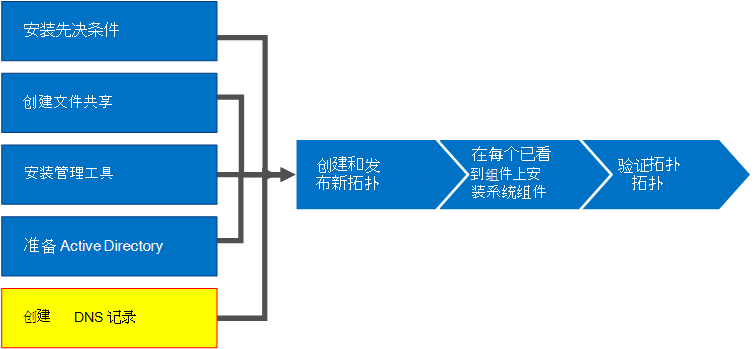
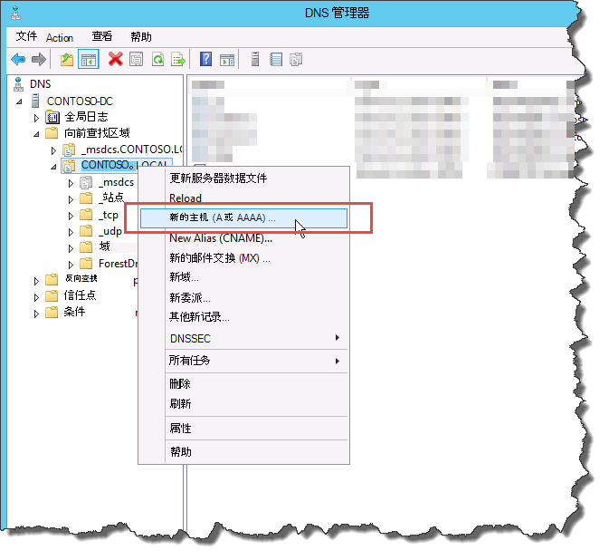
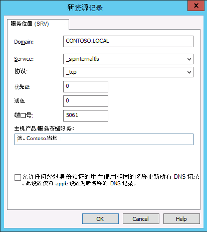
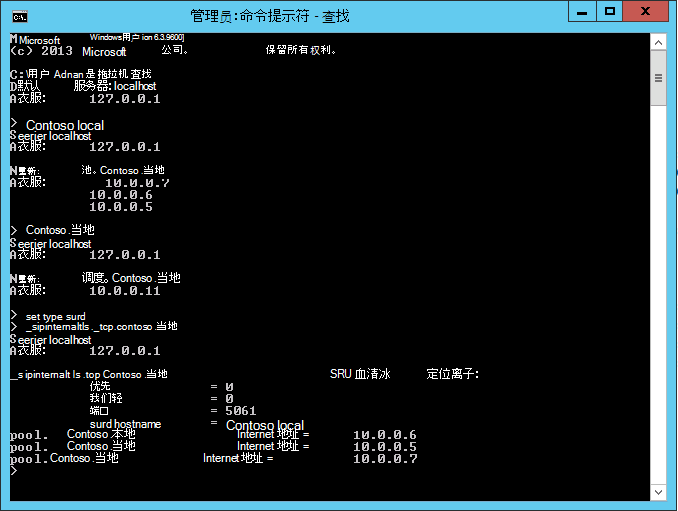

# 创建 DNS 记录以用于Skype for Business Server
 
**摘要：** 了解如何配置 DNS 和创建 DNS 记录以安装 Skype for Business Server。 从 Microsoft 评估Skype for Business Server下载免费试用版 [https://www.microsoft.com/evalcenter/evaluate-skype-for-business-server](https://www.microsoft.com/evalcenter/evaluate-skype-for-business-server) ：。
  
若要Skype for Business Server正常运行，必须设置多个域名系统 (DNS) 设置。 这样，客户端知道如何访问服务，并且服务器知道彼此。 每个部署只需完成一次这些设置，因为分配 DNS 条目后，它在整个域中可用。 可以按任意顺序执行步骤 1 到步骤 5。 但是，您必须按照图中的概述顺序执行步骤 6、7 和 8 以及步骤 1 到步骤 5 之后。 创建 DNS 记录包含第 5 步（共 8 步）。 有关规划 DNS 的信息，请参阅[Environmental requirements for Skype for Business Server](../../plan-your-deployment/requirements-for-your-environment/environmental-requirements.md) or Server requirements for Skype for Business Server [2019](../../../SfBServer2019/plan/system-requirements.md)。
  
> [!IMPORTANT]
> 需要注意的是，这只是如何在服务器 DNS 环境中Windows DNS 记录的示例。 创建 DNS 记录需要许多其他 DNS Skype for Business Server，创建 DNS 记录的过程取决于您用于管理组织中 DNS 的系统。 有关 DNS 要求的完整列表，请参阅[DNS requirements for Skype for Business Server](../../plan-your-deployment/network-requirements/dns.md)。 
  

  
## 配置 DNS

DNS 记录是 dns 记录Skype for Business Server才能正常运行，并且可由用户访问。
  
此示例使用名为 pool.contoso.local 的 DNS 负载平衡 FQDN。 此池包含三台运行 Skype for Business Server Enterprise Edition。 Standard Edition前端服务器只能包含一台服务器。 通过使用 Standard Edition，在引用前端角色时，您将仅使用单台 Standard Edition 服务器的完全限定域名 (FQDN) ，而不是创建服务器的 DNS 负载平衡池，如以下示例所示。 此仅使用前端角色的简单示例包括下表中的 DNS 条目。 若要规划特定的 DNS 要求，请参阅 dns [requirements for Skype for Business Server](../../plan-your-deployment/network-requirements/dns.md)。 
  
 
|**说明**|**记录类型**|**名称**|**解析为**|**负载平衡类型**|
|:-----|:-----|:-----|:-----|:-----|
|内部 Web 服务 FQDN    |A    |webint.contoso.local    |内部 Web 服务的 VIP    |支持的软件和硬件    |
|池 FQDN    |A    |pool.contoso.local    |服务器 SFB01 的 IP 地址    |DNS    |
|SFB01 FQDN    |A    |SFB01.contoso.local    |服务器 SFB01 的 IP 地址    |DNS    |
|池 FQDN    |A    |pool.contoso.local    |服务器 SFB02 的 IP 地址    |DNS    |
|SFB02 FQDN    |A    |SFB02.contoso.local    |服务器 SFB02 的 IP 地址    |DNS    |
|池 FQDN    |A    |pool.contoso.local    |服务器 SFB03 的 IP 地址    |DNS    |
|SFB03 FQDN    |A    |SFB03.contoso.local    |服务器 SFB03 的 IP 地址    |DNS    |
|Skype for Business自动发现    |A    |lyncdiscoverinternal.contoso.local    |内部 Web 服务的 VIP    |支持的软件和硬件    |
|会议简单 URL    |A    |meet.contoso.local    |内部 Web 服务的 VIP    |支持的软件和硬件    |
|拨入简单 URL    |A    |dialin.contoso.local    |内部 Web 服务的 VIP    |支持的软件和硬件    |
|Web 计划程序简单 URL    |A    |scheduler.contoso.local    |内部 Web 服务的 VIP    |支持的软件和硬件    |
|管理简单 URL    |A    |admin.contoso.local    |内部 Web 服务的 VIP    |支持的软件和硬件    |
|旧发现    |SRV    |_sipinternaltls._tcp.contoso.local    |池 FQDN (端口 5061)     |不适用    |
   
### 创建 DNS 记录

1. 登录到 DNS 服务器，然后打开服务器 **管理器**。
    
2. 单击"**工具**"下拉菜单，然后单击 **"DNS"。**
    
3. 在 SIP 域的控制台树中，展开"前向查找区域"，然后展开将安装Skype for Business Server SIP 域。
    
4. 右键单击 SIP 域，然后选择"新建主机 (A 或 **AAAA) ，** 如图所示。
    
     
  
5. 在 **"名称** "框中，键入主机记录的名称 (域名将自动追加到) 。
    
6. 在 **"IP** 地址"框中，键入各个前端服务器的 IP 地址，然后选择"创建关联的指针 **(PTR)** 记录"或"允许任何经过身份验证的用户使用相同的所有者名称更新 **DNS** 记录"（如果适用）。 请注意，这假定 DNS 用于平衡除 Web 服务之外的所有流量。 在此示例中，我们有三台前端服务器，如下表所示。
    
   |**服务器名称**|**类型**|**数据**|
   |:-----|:-----|:-----|
   |SFB01    |主机 (A)    |10.0.0.5    |
   |SFB02    |主机 (A)    |10.0.0.6    |
   |SFB03    |主机 (A)    |10.0.0.7    |
   
7. 接下来，为池创建 DNS 负载平衡条目。 DNS 负载平衡允许 DNS 在使用相同的 DNS 池名称时向池中的单个服务器发送请求。 有关 DNS 和负载平衡详细信息，请参阅[dns requirements for Skype for Business Server](../../plan-your-deployment/network-requirements/dns.md)。 
    
    > [!NOTE]
    > 将多个服务器集中在一起仅适用于Enterprise Edition部署。 如果要部署单个 Enterprise 或 Standard Edition 服务器，只需为单台服务器创建 A 记录。 
  
    例如，如果您有一个名为 pool.contoso.local 的池和三个前端服务器，您将创建以下 DNS 条目：
    
   |**FQDN**|**类型**|**数据**|
   |:-----|:-----|:-----|
   |pool.contoso.local    |主机 (A)    |10.0.0.5    |
   |pool.contoso.local    |主机 (A)    |10.0.0.6    |
   |pool.contoso.local    |主机 (A)    |10.0.0.7    |
   
8. 继续为计划部署中所有服务器创建 A 记录。 
    
9. 若要为旧发现 (SRV) 记录，请右键单击 SIP 域，然后选择"其他 **新记录"。**
    
10. 在“选择资源记录类型”中，单击“服务位置(SRV)”，然后单击“创建记录”。
    
11. 单击“服务”，然后键入 **_sipinternaltls**。
    
12. 单击“协议”，然后键入 **_tcp**。
    
13. 单击“端口号”，再键入“5061”。
    
14. 单击 **"提供此服务的主机**"，然后键入池或服务器Standard Edition FQDN。
    
     
  
15. 单击“确定”，再单击“完成”。
    
### 验证 DNS 记录

1. 使用属于 Authenticated Users 组成员的帐户或具有等效权限的帐户登录到域中的客户端计算机。
    
2. 单击 **"开始**"，然后键入 **cmd**，然后按 Enter。
    
3. 键入 **nslookup 或 \<FQDN of the Front End pool\>** **\<FQDN of the Standard Edition server or single Enterprise Edition server\>** ，然后按 Enter。
    
4. 继续验证部署的其他 A 记录。
    
5. 如果要支持旧版客户端并创建 SRV 记录，请在 **nslookup** 提示符下键入 **set type=srv** 来验证它，然后按 Enter。
    
6. 键入 **_sipinternaltls._tcp。 *域*** (，_sipinternaltls._tcp.contoso.local) ，然后按 Enter。
    
7. 预期输出应类似于图中所示。 请注意，并非所有 DNS 记录都显示在示例输出中，但应验证所有记录。 
    
     
  

