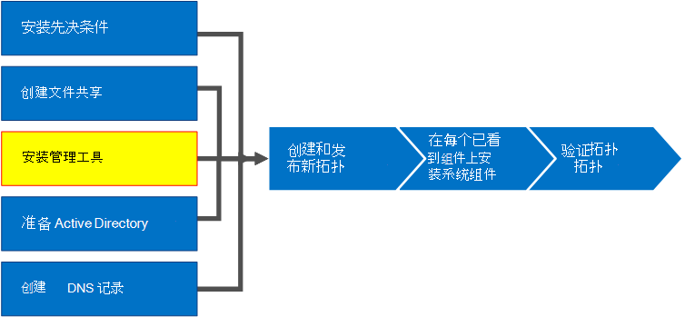
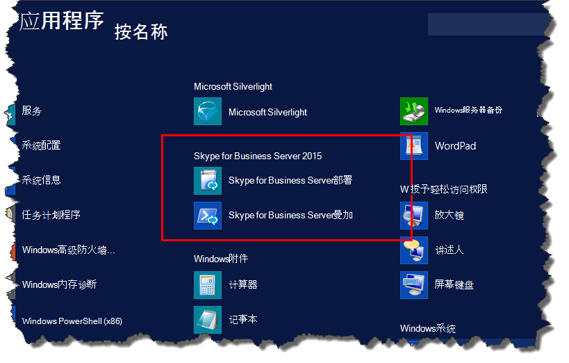
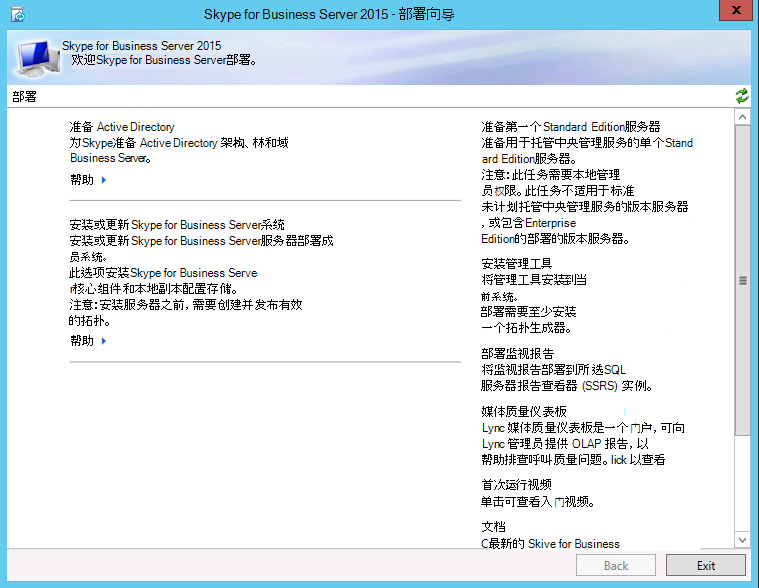
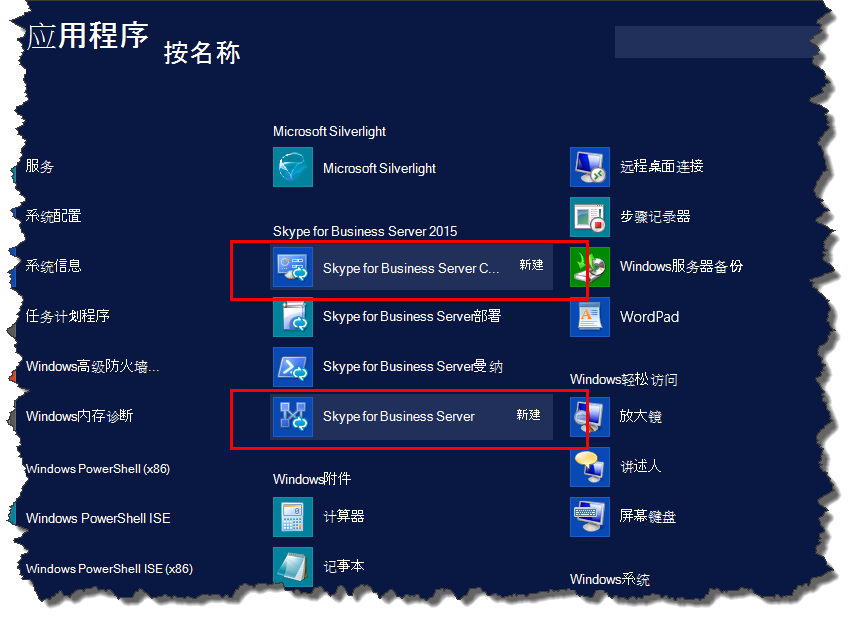

# 在 Skype for Business 服务器中安装管理工具
 
**摘要：** 了解如何安装 Skype for Business 服务器安装所需的管理工具。 从 Microsoft 评估中心下载免费试用版 Skype for Business 服务器，网址为： [https://www.microsoft.com/evalcenter/evaluate-skype-for-business-server](https://www.microsoft.com/evalcenter/evaluate-skype-for-business-server)。
  
管理工具包括拓扑生成器和控制面板。 管理工具必须安装在拓扑中的至少一台服务器上，或者在运行 Skype for business Server 支持的 Windows 操作系统版本的64位管理工作站中安装。 您可以按照任意顺序完成第 1 步至第 5 步。 但是，第 6、7、8 步必须在第 1 步至第 5 步之后按图表所示顺序执行。 安装管理工具是 8 个步骤中的第 3 步。
  

  
## 安装 Skype for Business 服务器管理工具

Skype for business 服务器安装媒体提供灵活的体验。 当您首次运行 setup.exe 时，安装的唯一工具是 Skype for Business 服务器部署向导和 Skype for business Server 命令行管理程序。 通过使用这两个工具（称为核心组件），可以继续安装过程，但不提供整个 Skype for business 服务器环境的主要功能。 在您安装核心组件后，部署向导将自动启动。 "**安装管理工具**" 的 "部署向导" 部分安装了 skype For Business 服务器拓扑生成器和 skype For business 服务器 "控制面板"。
  
> [!IMPORTANT]
> 每个 Skype for Business 服务器环境必须至少有一台服务器安装了 "管理工具"。 
  
观看视频，了解**安装管理工具**的步骤：
  
> [!video https://www.microsoft.com/en-us/videoplayer/embed/99a5c436-963b-4eed-b423-651568c87cb1?autoplay=false]
  
### 从部署向导安装 Skype for business 服务器管理工具

1. 插入 Skype for Business 服务器安装媒体。 如果安装未自动开始，请双击“**安装**”。
    
2. 安装媒体需要 Microsoft Visual C++ 才能运行。将有一个对话框弹出，询问您是否要安装。单击“**是**”。
    
3. 通过使用 "智能设置" （Skype for Business 服务器中的一项新功能），您可以连接到 Internet 以在安装过程中检查更新。 这能确保您在安装时获得最新产品更新，从而提供更好的体验。 单击“**安装**”开始安装。
    
4. 仔细阅读许可协议，如果同意条款，请选择“**我接受许可协议中的条款**”，然后单击“**确定**”。
    
5. Skype for Business 服务器核心组件将安装在服务器上。 
    
    核心组件包含以下内容，如图所示。
    
    
  
   - **Skype For Business 服务器部署向导**提供用于安装 Skype for Business Server 的各种组件的启动板的部署程序。
    
   - **Skype For Business 服务器命令行管理程序**允许管理 Skype for Business 服务器的预配置 PowerShell 程序。
    
     核心组件安装完成后，Skype for Business 服务器部署向导将自动启动，如图所示。 
    
     
  
6. 除了核心组件之外，你还需要在环境中的至少一台服务器上安装 Skype for business Server 拓扑生成器和 Skype for business Server 控制面板。 单击部署向导上的“**安装管理工具**”。
    
7. 单击“**下一步**”开始安装。
    
8. 完成安装后，请单击“**完成**”。管理工具现已添加到服务器中，如图所示。
    
    
  
   - **Skype For Business 服务器拓扑生成器**用于生成、部署和管理拓扑的程序。
    
   - **Skype for Business 服务器控制面板**用于管理安装的程序。
    

