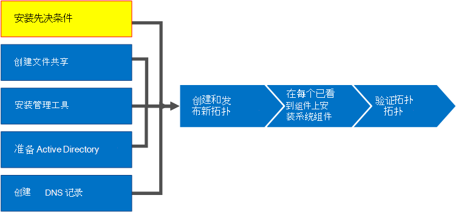
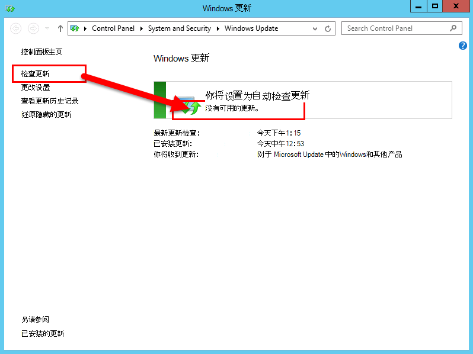

# 安装 Business Server Skype 的先决条件
 
**摘要：** 了解有关服务器和业务服务器安装 Skype 之前必须配置的服务器角色。 从[Microsoft 评估中心](https://www.microsoft.com/evalcenter/evaluate-skype-for-business-server)业务服务器下载 Skype 的免费试用版。
  
安装必备软件包括通过在拓扑中的每台服务器上安装所需的角色和功能来设置 Windows Server。 这些要求基于服务器将在拓扑中承担的角色。 第 1 步至第 5 步可以按任意顺序执行。 但是，第 6、7、8 步必须在第 1 步至第 5 步之后按图表所示顺序执行。 安装必备软件是 8 个步骤中的第 1 步。
  

  
## 设置 Windows Server

Skype 业务服务器需要 Windows Server 操作系统和必备组件数，才能安装。 有关规划必备组件的详细信息，请参阅[Business Server 的 Skype 服务器要求](../../../SfBServer2019/plan/system-requirements.md)。 
  
> [!TIP]
> 此过程使用 Windows Server 2012 R2。 如果您要使用其他版本的 Windows Server，该过程可能略有不同。 
  
> [!IMPORTANT]
> 在开始之前，请确保 Windows Server 是使用 Windows Update 保持最新。 
  

  
观看视频，了解**安装必备组件**的步骤：
  
> [!video https://www.microsoft.com/en-us/videoplayer/embed/02447c2a-5b26-432f-aad6-b9b05cc93478?autoplay=false]
  
### 为前端服务器安装必要的角色和功能

您可以安装必需的角色和功能使用服务器管理器。 
    
1. 安装[服务器 requirements for Business Server 的 Skype](../../../SfBServer2019/plan/system-requirements.md)中列出的必备软件功能。 将业务服务器运行 Skype 的服务器上必须是所需的软件。
    
    > [!CAUTION]
    > Windows Server 2012 R2 不会默认安装必要功能的所有源文件。 如果服务器未连接 Internet，您需要插入 Windows Server 2012 R2 媒体并选择“**指定备用源路径**”以安装必要功能。 源文件位于 sources\sxs 目录中。 例如，如果 Windows Server 2012 R2 媒体在驱动器 D 中，则您将路径设为 `d:\sources\sxs`。 请务必通过 Windows Update 获取最新更新。 如果您没有连接到 Internet，您需要手动安装所有相关更新以及更新所需的必备软件。 
  
1. 当出现对话框表示已完成安装时，您需要重新启动服务器以完成该流程。
    
1. 再次运行 **Windows Update** 以检查安装的角色和服务是否存在可用更新。
    
1. 如果您将使用 Skype 的业务 Server Control Panel 在此服务器上还必须安装 Silverlight 然后。 要安装 Silverlight，请参阅 [Microsoft Silverlight](https://www.microsoft.com/silverlight/)。

> [!IMPORTANT]
> 执行前端服务器以外的角色（例如控制器、持久聊天或边缘角色）的服务器具备自己的先决条件。 有关每种服务器类型所需的确切先决条件的详细信息，请参阅[Business Server 的 Skype 服务器要求](../../../SfBServer2019/plan/system-requirements.md)。 
  

