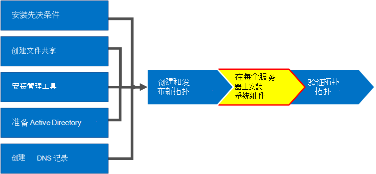
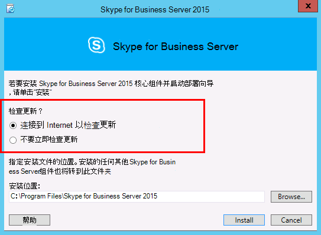
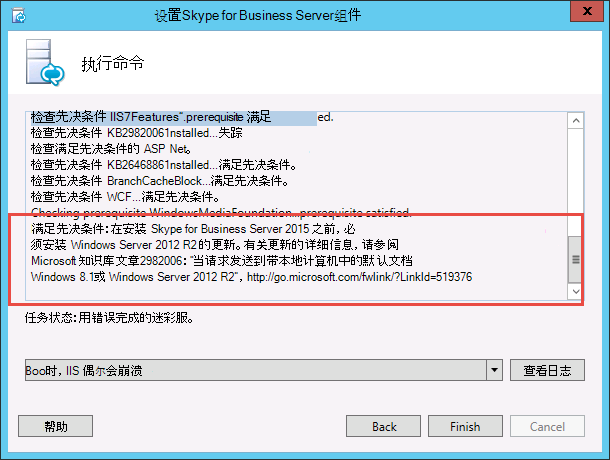
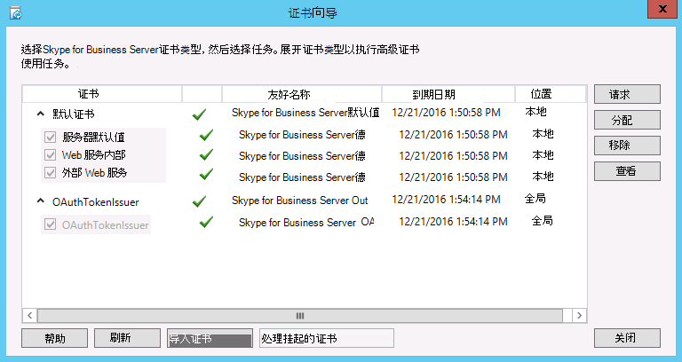
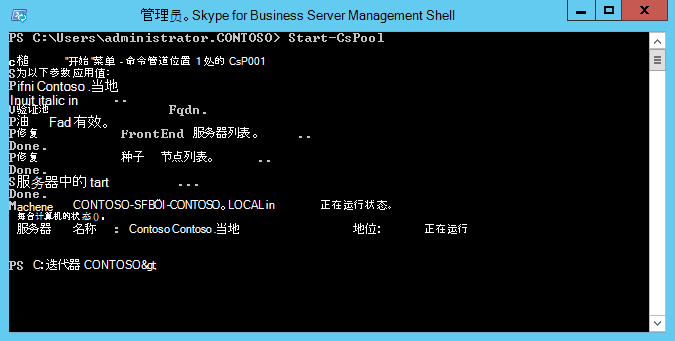

# 在拓扑内的服务器上安装 Skype for Business ServerInstall Skype for Business Server on servers in the topology
 
**摘要：** 了解如何在拓扑中的每台服务器上安装 Skype for Business Server 系统组件。**Summary:** Learn how to install the Skype for Business Server system components on each server in the topology. 从[Microsoft 评估中心](https://www.microsoft.com/evalcenter/evaluate-skype-for-business-server)下载 Skype For business 服务器的免费试用版。Download a free trial of Skype for Business Server from the [Microsoft Evaluation center](https://www.microsoft.com/evalcenter/evaluate-skype-for-business-server).
  
将拓扑加载到中央管理存储并且 Active Directory 知道哪些服务器将执行哪些角色后，你需要在拓扑中的每台服务器上安装 Skype for Business Server 系统。Once the topology is loaded into the Central Management Store and Active Directory knows which servers will perform which roles, you need to install the Skype for Business Server system on each of the servers in the topology. 您可以按照任意顺序完成第 1 步至第 5 步。You can do steps 1 through 5 in any order. 但第 6、7、8 步必须在第 1 步至第 5 步之后按照图表所示顺序依次完成。However, you must do steps 6, 7, and 8 in order, and after steps 1 through 5 as outlined in the diagram. 安装 Skype for Business 服务器系统是第7步，共8步。Installing the Skype for Business Server system is step 7 of 8.
  

  
## 安装 Skype for Business 服务器系统Install Skype for Business Server system

发布拓扑后，您可以在拓扑结构中的每台服务器上安装 Skype for Business 服务器组件。Once you have published a topology, you can install the Skype for Business Server components on each server in the topology. 本部分将引导你完成以下步骤：安装 Skype for Business Server 和设置前端池的服务器角色以及与前端服务器 collocated 的任何服务器角色。This section guides you through installing Skype for Business Server and setting up the server roles for the Front End pool and any server roles that are collocated with the Front End servers. 若要安装和设置服务器角色，请在要安装服务器角色的每台计算机上运行 Skype for Business 服务器部署向导。To install and set up server roles, you run the Skype for Business Server Deployment Wizard on each computer on which you are installing a server role. 使用部署向导完成所有四个部署步骤，包括安装本地配置存储、安装前端服务器、配置证书和启动服务。You use the Deployment Wizard to complete all four deployment steps, including installing the Local Configuration store, installing the Front End Servers, configuring certificates, and starting services.
  
> [!IMPORTANT]
> 必须使用拓扑生成器完成并发布拓扑，然后才能在服务器上安装 Skype for Business 服务器。You must use Topology Builder to complete and publish the topology before you can install Skype for Business Server on servers. 
  
> [!NOTE]
> 必须对拓扑中的所有服务器完成此步骤。This procedure must be completed for all servers in the topology. 
  
> [!CAUTION]
> 在前端服务器上安装 Skype for Business 服务器后，首次启动服务时，必须确保 Windows 防火墙服务在服务器上运行。After you install Skype for Business Server on a Front End Server, the first time you start services, you must make sure that the Windows Firewall Service is running on the server. 
  
> [!CAUTION]
> 在执行这些步骤之前，请确保你使用既是本地管理员又是 RTCUniversalServerAdmins 组成员的域用户帐户登录到服务器。Before you follow these steps, make sure you're logged onto the server with a domain user account that's both a local administrator and a member of the RTCUniversalServerAdmins group. 
  
> [!NOTE]
> 如果以前未在此服务器上运行 Skype for Business Server 设置，系统将提示你输入安装的驱动器和路径。If you haven't run Skype for Business Server setup on this server before, you'll be prompted for a drive and path for the installation. 如果您的组织要求安装到系统驱动器之外的某个驱动器上或者您考虑空间问题，这将允许您安装到非系统驱动器上。This provides the capability to install to a drive other than the system drive, if your organization requires it, or if you have space concerns. 你可以在 "**设置**" 对话框中将 Skype For business 服务器文件的安装位置路径更改为新的可用驱动器。You can change the installation location path for the Skype for Business Server files in the **Setup** dialog box to a new, available drive. 如果将安装文件安装到此路径（包括 OCSCore），则 Skype for business 服务器文件的其余部分也将部署到其中。If you install the Setup files to this path, including OCSCore.msi, the rest of the Skype for Business Server files will deploy there as well.
  
> [!IMPORTANT]
> 开始安装之前，请确保 Windows Server 是使用 Windows 更新的最新版本。Before you begin the installation, make sure that Windows Server is up-to-date by using Windows Update. 
  

  
### 安装 Skype for Business 服务器系统Install Skype for Business Server system

1. 插入 Skype for Business 服务器安装媒体。Insert the Skype for Business Server installation media. 如果安装未自动开始，请双击“**安装**”。If the setup does not automatically begin, double-click **Setup**.
    
2. 安装介质需要 Microsoft Visual C++ 才能运行。将有一个对话框弹出，询问您是否要安装。单击“**是**”。The installation media requires Microsoft Visual C++ to run. A dialog will pop up asking if you want to install it. Click **Yes.**
    
3. 仔细阅读许可协议，如果同意条款，请选择“**我接受许可协议中的条款**”，然后单击“**确定**”。Carefully review the License Agreement, and if you agree, select **I accept the terms in the license agreement**, and click **OK**. 
    
4. 智能设置是 Skype for Business 服务器中的一项功能，您可以在其中连接到 Internet 以在安装过程中检查来自 Microsoft Update （MU）的更新，如图所示。Smart Setup is a feature in Skype for Business Server where you can connect to the Internet to check for updates from Microsoft Update (MU) during the installation process, as shown in the figure. 这能确保你获得最新产品更新，从而提供更好的体验。This provides a better experience by making sure you have the most recent updates for the product. 单击“**安装**”开始安装。Click **Install** to begin the installation.
    
    > [!NOTE]
    > 很多组织在其企业环境中部署了 Windows Server Update Services (WSUS)。Many organizations have Windows Server Update Services (WSUS) deployed in their corporate environments. WSUS 可以让管理员完全管理通过 Microsoft Update 发布到其网络中的计算机的更新分发过程。WSUS lets administrators fully manage the distribution of updates that are released through Microsoft Update to computers in their network. 作为累积更新1发行版 Skype for Business 服务器的一部分，引入了对智能设置的支持，以便与 WSUS 配合使用。As part of the Cumulative Update 1 release Skype for Business Server introduced support for Smart Setup to work with WSUS. 如果客户首次部署 Skype for Business 服务器或从 Lync Server 2013 环境升级到 Lync Server 环境，使用就地升级功能将获得从 WSUS 获取 Skype for Windows 更新的智能设置，而不是提取更新从 MU 开始。Customers with WSUS who are deploying Skype for Business Server for the first time or upgrading from the Lync Server 2013 environment using the In-Place Upgrade feature will have Smart Setup fetching Skype for Windows updates from WSUS as opposed to fetching updates from MU. 想使用智能设置的客户在运行 Setup.exe 之前，需要在所有计算机上运行 SmartSetupWithWSUS.psq。Customers wanting to use Smart Setup need to run the SmartSetupWithWSUS.psq on all the machines before running Setup.exe. 
  
     
  
5. 在 "部署向导" 页面上，单击 "**安装或更新 Skype For Business 服务器系统**"。On the Deployment Wizard page, click **Install or Update Skype for Business Server System**.
    
6. 执行以下过程中的过程，完成这些过程后，单击 "**退出**" 以关闭 "部署向导"。Perform the procedures in the following procedures, when you've completed them, click **Exit** to close the Deployment Wizard. 对池中的每台前端服务器重复此过程。Repeat the procedures for each Front End server in the pool.
    
### 步骤 1：安装本地配置存储Step 1: Install Local Configuration Store

1. 检查前提条件，单击”**步骤 1：安装本地配置存储**”旁边的“**运行**”。Review the prerequisites, and then click **Run** next to **Step 1: Install Local Configuration Store**.
    
    > [!NOTE]
    > 本地配置存储是中央管理存储的只读副本。在 Standard Edition 部署中，将使用前端服务器上的 SQL Server Express Edition 本地副本创建中央管理存储。在运行“准备第一台 Standard Edition Server”流程时将出现此情况。在 Enterprise Edition 部署中，在您发布包含 Enterprise Edition 前端池的拓扑时，将会创建中央管理存储。The Local Configuration Store is a read-only copy of the Central Management Store. In a Standard Edition deployment, the Central Management Store is created using a local copy of SQL Server Express Edition on the Front End server. This happens when you run the Prepare First Standard Edition Server procedure. In an Enterprise Edition deployment, the Central Management store is created when you publish the topology that includes an Enterprise Edition Front End pool. 
  
2. 在“**安装本地配置存储**”页面上，确保选择“**直接从中央管理存储中检索**”选项，然后单击“**下一步**”。On the **Install Local Configuration Store** page, make sure that the **Retrieve directly from the Central Management store** option is selected, and then click **Next**.
    
    SQL Server Express Edition 将安装到本地服务器上。SQL Server Express Edition 是本地配置存储的必要前提。SQL Server Express Edition is installed on the local server. SQL Server Express Edition is required for the local configuration store.
    
3. 完成本地服务器配置安装后，单击“**完成**”。When the local server configuration installation is complete, click **Finish**.
    
### 步骤2：设置或删除 Skype for Business 服务器组件Step 2: Setup or remove Skype for Business Server components

1. 查看必备条件，然后单击 "**步骤2：设置" 或 "删除 Skype For Business 服务器组件**" 旁边的 "**运行**"。Review the prerequisites, and then click **Run** next to **Step 2: Setup or Remove Skype for Business Server Components**.
    
2. 在 "**设置 Skype For Business 服务器组件**" 页面上，单击 "**下一步**" 以设置在已发布拓扑中定义的组件。On the **Set Up Skype for Business Server Components** page, click **Next** to set up components as defined in your published topology.
    
3. “**正在执行命令**”页将显示安装过程中的命令和安装信息摘要。The **Executing Commands** page displays a summary of commands and installation information as the set up takes place. 完成后，你可以使用列表选择要查看的日志，然后单击 "**查看日志**"。When it's done, you can use the list to select a log to view, and then click **View Log**.
    
4. 当 Skype for Business Server 组件设置完成并且你已查看所需的日志时，请单击 "**完成**" 以在安装中完成此步骤。When Skype for Business Server components setup is done and you've reviewed the logs as needed, click **Finish** to complete this step in the installation.
    
    > [!NOTE]
    > 如果提示重新启动服务器（如果需要安装 Windows 桌面体验则可能会发生这种情况），请执行此操作。Restart the server if prompted (which might happen if Windows Desktop Experience needed to be installed). 当计算机恢复正常运行时，你需要再次运行此操作（步骤2：设置或删除 Skype for Business Server 组件）过程。When the computer is back up and running, you need to run this (Step 2: Setup or Remove Skype for Business Server Components) procedure again. 
  
    > [!NOTE]
    > 如果安装程序发现存在任何未满足的先决条件，系统将向您通知一条“不满足先决条件”消息，如图所示。If the installer finds any prerequisites that have not been satisfied, you will be notified with a "Prerequisite not satisfied" message, as shown in the figure. 满足所需的先决条件，然后再开始（步骤2：设置或删除 Skype for Business Server 组件）过程。Satisfy the required prerequisite, and then start this (Step 2: Setup or Remove Skype for Business Server Components) procedure again. 
  
     
  
5. 验证前两步已经如期完成。确认显示如图所示的绿色对勾和“**完成**”字样。Verify that the first two steps completed as expected. Confirm that there is a green checkmark with the word **Complete**, as shown in the figure.
    
     
  
6. 在安装 Skype for Business 服务器组件后，再次运行**Windows 更新**以检查是否有任何更新。Run **Windows Update** again to check if there are any updates after you install the Skype for Business Server Components.
    
### 步骤 3：请求、安装或分配证书Step 3: Request, install, or assign certificates

1. 检查先决条件，然后单击“**步骤 3：请求、安装或分配证书**”旁边的“**运行**”。Review the prerequisites, and then click **Run** next to **Step 3: Request, Install or Assign Certificates**.
    
    > [!NOTE]
    > Skype for Business 服务器包括对 SHA-1 套件的支持（SHA-2 使用224、256、384或512位）的摘要哈希和签名算法的摘要哈希和签名算法来自运行 Windows 10、Windows 8、windows 7、Windows Server 2012 R2 和 Windows 的客户端的连接服务器2012或 Windows Server 2008 R2 操作系统。Skype for Business Server includes support for the SHA-2 suite (SHA-2 uses digest lengths of 224, 256, 384 or 512 bits) of digest hash and signing algorithms for connections from clients running the Windows 10, Windows 8, Windows 7, Windows Server 2012 R2, Windows Server 2012, or Windows Server 2008 R2 operating systems. 要支持使用 SHA-2 套件进行外部访问，外部证书必须由公共 CA 颁发，公共 CA 也可颁发具有相同位长度摘要的证书。To support external access using the SHA-2 suite, the external certificate is issued by a public CA that also can issue a certificate with the same bit length digest. 
  
    > [!IMPORTANT]
    > 选择哪种哈希摘要和签名算法取决于将使用证书的客户端和服务器，客户端和服务器将与其通信的其他计算机和设备也必须知道如何使用证书中所用的算法。The selection of which hash digest and signing algorithm is dependent on the clients and the servers that will use the certificate, and other computers and devices that clients and servers will communicate with who must also know how to use the algorithms used in the certificate. 有关操作系统和某些客户端应用程序支持哪些摘要长度的信息，请参阅[WINDOWS PKI 博客 SHA2 和 windows](https://go.microsoft.com/fwlink/p/?LinkId=287002)。For information on which digest lengths are supported in the operating system and some client applications, see [Windows PKI blog - SHA2 and Windows](https://go.microsoft.com/fwlink/p/?LinkId=287002). 
  
    每台 Standard Edition 或前端服务器最多需要四个证书：oAuthTokenIssuer 证书、默认证书、Web 内部证书和 Web 外部证书。Each Standard Edition or Front End server requires up to four certificates: the oAuthTokenIssuer certificate, a default certificate, a web internal certificate, and a web external certificate. 但是，也可以请求和分配单个具有相应使用者替代名称条目的默认证书以及 oAuthTokenIssuer 证书。However, you can request and assign a single default certificate with appropriate subject alternative name entries as well as the oAuthTokenIssuer certificate. 有关证书要求的详细信息，请参阅 Skype for business 服务器2019的[环境要求](../../plan-your-deployment/requirements-for-your-environment/environmental-requirements.md)或 skype For business [Server 的服务器要求](../../../SfBServer2019/plan/system-requirements.md)。For details about the certificate requirements, see [Environmental requirements for Skype for Business Server](../../plan-your-deployment/requirements-for-your-environment/environmental-requirements.md) or [Server requirements for Skype for Business Server 2019](../../../SfBServer2019/plan/system-requirements.md).
    
    > [!IMPORTANT]
    > 以下过程介绍了如何配置来自基于内部 Active Directory 证书服务的证书颁发机构的证书。The following procedure describes how to configure certificates from an internal Active Directory Certificate Services based certificate authority. 
  
2. 在“**证书向导**”页上，单击“**请求**”。On the **Certificate Wizard** page, click **Request**.
    
3. 在“**证书请求**”页上，填写相关数据，包括选择 SIP 域在内，然后单击“**下一步**”。On the **Certificate Request** page fill in the relevant data including selecting the SIP domain and , click **Next**.
    
4. 在“**延迟的请求或即时请求**”页上，可通过单击“**下一步**”接受默认的“**立即将请求发送给联机证书颁发机构**”选项。如果选择此选项，具有自动联机注册的内部 CA 必须可用。如果选择了延迟请求的选项，系统将提示您输入用于保存证书请求文件的名称和位置。证书请求必须由组织内部的 CA 或公共 CA 提出和处理。然后您需要导入证书响应并将其分配给适当的证书角色。On the **Delayed or Immediate Requests** page, you can accept the default **Send the request immediately to an online certification authority** option by clicking **Next**. The internal CA with automatic online enrollment must be available if you select this option. If you choose the option to delay the request, you will be prompted for a name and location to save the certificate request file. The certificate request must be presented and processed by a CA either inside your organization, or by a public CA. You will then need to import the certificate response and assign it to the proper certificate role.
    
5. 在 "**选择证书颁发机构（CA）** " 页面上，选择 "**从你的环境中检测到的列表中选择一个 CA** " 选项，然后从列表中选择一个已知（通过注册 Active DIRECTORY 域服务） ca。On the **Choose a Certificate Authority (CA)** page, select the **Select a CA from the list detected in your environment** option, and then select a known (through registration in Active Directory Domain Services) CA from the list. 或者，选择“**指定其他证书颁发机构**”选项，在框中输入其他 CA 的名称，然后单击“**下一步**”。Or, select the **Specify another certification authority** option, enter the name of another CA in the box, and then click **Next**.
    
6. 在“**证书颁发机构帐户**”页上，将提示您提供凭据，以在 CA 中请求证书和处理证书请求。您应该已经确定提前请求证书是否需要用户名和密码。CA 管理员将拥有所需的信息，并且可能需要协助您完成此步骤。如果需要提供备用凭据，请选中相应的复选框，在文本框中输入用户名和密码，然后单击“**下一步**”。On the **Certificate Authority Account** page, you are prompted for credentials to request and process the certificate request at the CA. You should have determined if a user name and password is necessary to request a certificate in advance. Your CA administrator will have the required information and might have to assist you in this step. If you need to supply alternate credentials, select the check box, provide a user name and password in the text boxes, and then click **Next**.
    
7. 在“**指定替代证书模板**”页上，要使用默认的 Web 服务器模板，请单击“**下一步**”。On the **Specify Alternate Certificate Template** page, to use the default Web Server template, click **Next**.
    
    > [!NOTE]
    > 如果组织已经创建了模板，以用作默认 Web 服务器 CA 模板的备用模板，请选中相应的复选框，然后输入备用模板的名称。您将需要 CA 管理员定义的模板名称。If your organization has created a template for use as an alternative for the default Web server CA template, select the check box, and then enter the name of the alternate template. You will need the template name as defined by the CA administrator. 
  
8. 在“**名称和安全设置**”页上，指定一个“**友好名称**”。On the **Name and Security Settings** page, specify a **Friendly Name**. 通过使用友好名称，您可以快速标识证书和目的。By using a friendly name, you can quickly identify the certificate and purpose. 如果将此处留空，则系统会自动生成一个名称。If you leave it blank, a name will be generated automatically. 设置密钥的“**位长度**”，或接受默认值 2048 位。Set the **Bit length** of the key, or accept the default of 2048 bits. 如果确定需要将证书和私钥移动或复制到其他系统，请选择 "将**证书的私钥标记为可导出**"，然后单击 "**下一步**"。Select the **Mark the certificate's private key as exportable** if you determine that the certificate and private key needs to be moved or copied to other systems, and then click **Next**.
    
    > [!NOTE]
    > Skype for business 服务器对可导出私钥的要求最低。Skype for Business Server has minimal requirements for an exportable private key. 其中一个可导出的位置是池中的边缘服务器，在这里媒体中继身份验证服务使用证书副本，而不是对池中的每个实例都分别使用单个证书。One such place is on the Edge Servers in a pool, where the Media Relay Authentication Service uses copies of the certificate, rather than individual certificates for each instance in the pool. 
  
9. 在“**组织信息**”页上，可选择提供组织信息，然后单击“**下一步**”。On the **Organization Information** page, optionally provide organization information, and then click **Next**.
    
10. 在“**地理信息**”页上，可选择提供地理信息，然后单击“**下一步**”。On the **Geographical Information** page, optionally provide geographical information, and then click **Next**.
    
11. 在“**使用者名称/使用者替代名称**”页上，检查将添加的使用者替代名称，然后单击“**下一步**”。On the **Subject Name / Subject Alternate Names** page, review the subject alternative names that will be added, and then click **Next**.
    
12. 在“**SIP 域设置**”页上，选择“**SIP 域**”，然后单击“**下一步**”。On the **SIP Domain setting** page, select the **SIP Domain**, and then click **Next**.
    
13. 在“**配置其他使用者替代名称**”页上，添加其他任何需要的使用者替代名称，包括将来其他 SIP 域可能需要的使用者替代名称，然后单击“**下一步**”。On the **Configure Additional Subject Alternate Names** page, add any additional required subject alternative names, including any that might be required for additional SIP domains in the future, and then click **Next**.
    
14. 在“**证书请求摘要**”页上，检查摘要中的信息。如果信息正确，请单击“**下一步**”。如果需要更正或修改设置，请单击“**上一步**”返回相应的页面进行更正或修改。On the **Certificate Request Summary** page, review the information in the summary. If the information is correct, click **Next**. If you need to correct or modify a setting, click **Back** to the proper page to make the correction or modification.
    
15. 在“**正在执行命令**”页上，单击“**下一步**”。On the **Executing Commands** page, click **Next**.
    
16. On the **Online Certificate Request Status** page, review the information returned.On the **Online Certificate Request Status** page, review the information returned. You should note that the certificate was issued and installed into the local certificate store.You should note that the certificate was issued and installed into the local certificate store. 如果报告为已颁发并已安装，但它无效，请确保 CA 根证书已安装在服务器的受信任根 CA 存储中。If it is reported as having been issued and installed, but it is not valid, make sure that the CA root certificate has been installed in the server's Trusted Root CA store. Refer to your CA documentation on how to retrieve a Trusted Root CA certificate.Refer to your CA documentation on how to retrieve a Trusted Root CA certificate. If you need to view the retrieved certificate, click **View Certificate Details**.If you need to view the retrieved certificate, click **View Certificate Details**. 默认情况下，"**将证书分配给 Skype for Business 服务器证书使用**情况" 复选框处于选中状态。By default, the check box for **Assign the certificate to Skype for Business Server certificate usages** is selected. If you want to manually assign the certificate, clear the check box, and then click **Finish**.If you want to manually assign the certificate, clear the check box, and then click **Finish**.
    
17. 如果已清除 "**将证书分配给以前页面上的 Skype for Business 服务器证书使用**情况" 复选框，则会显示 "**证书分配**" 页面。If you cleared the check box for **Assign the certificate to Skype for Business Server certificate usages** on the previous page, you will be presented with the **Certificate Assignment** page. Click **Next**.Click **Next**.
    
18. 在“**证书存储**”页上，选择已请求的证书。如果要查看证书，请单击“**查看证书详细信息**”，然后单击“**下一步**”继续。On the **Certificate Store** page, select the certificate that you requested. If you want to view the certificate, click **View Certificate Details**, and then click **Next** to continue.
    
    > [!NOTE]
    > 如果“**联机证书请求状态**”页报告证书存在问题（例如证书无效），查看实际证书可协助解决问题。可能导致证书无效的两个具体问题为：先前提到的受信任根 CA 证书缺失，与证书相关联的私钥缺失。有关如何解决这两个问题的信息，请参阅 CA 文档。If the **Online Certificate Request Status** page reported an issue with the certificate, such as the certificate is not valid, view the actual certificate for help in resolving the issue. Two specific issues that can cause a certificate to not be valid is the previously mentioned missing Trusted Root CA certificate, and a missing private key that is associated with the certificate. Refer to your CA documentation to resolve these two issues.
  
19. 在“**证书分配摘要**”页上，检查显示的信息以确保此证书是应分配的证书，然后单击“**下一步**”。On the **Certificate Assignment Summary** page, review the information presented to make sure that this is the certificate that should be assigned, and then click **Next**.
    
20. 在“**正在执行命令**”页上，检查命令的输出。如果要检查分配过程或查看是否出现错误或警告，请单击“**查看日志**”。检查完成后，单击“**完成**”。On the **Executing Commands** page, review the output of the command. Click **View Log** if you want to review the assignment process or if there was an error or warning issued. When you are finished with your review, click **Finish**.
    
21. 在“**证书向导**”页上，确认所有服务均显示绿色对勾，指示均已分配证书，包括图中所示的 OAuthTokenIssuer 在内，然后单击“**关闭**”。On the **Certificate Wizard** page, confirm that all services have a green check to indicate that all have been assigned a certificate, including the OAuthTokenIssuer ,as shown in the figure, and then click **Close**.
    
     
  
    > [!TIP]
    > 如果您在实验室环境中进行安装，并且使用 Active Directory 证书服务设置了证书颁发机构，您需要重新启动运行证书服务的服务器和前端服务器，然后才能成功颁发证书。If you are installing in a lab environment and have just set up the Certificate Authority using Active Directory Certificate Services, you will need to reboot both the server running Certificate Services and also the Front End server before the certificate assignment can go through successfully. 
  
    > [!TIP]
    >  有关 Active Directory 证书服务中的证书的详细信息，请参阅[Active Directory 证书服务](https://technet.microsoft.com/en-us/windowsserver/dd448615.aspx)。For more information about certificates in Active Directory Certificate Services, see [Active Directory Certificate Services](https://technet.microsoft.com/en-us/windowsserver/dd448615.aspx). 
  
### 步骤 4：启动服务Step 4: Start Services

1. 检查“**步骤 4：启动服务**”的先决条件。Review the prerequisites for **Step 4: Start Services**.
    
2. If this is an Enterprise Edition Front End pool with at least three servers, Windows Fabric is used, and you must use the **Start-CsPool** cmdlet.If this is an Enterprise Edition Front End pool with at least three servers, Windows Fabric is used, and you must use the **Start-CsPool** cmdlet. 如果使用单个服务器（使用标准版时总是如此），则 muse 使用**CsWindowsService** cmdlet。If a single server is used, which is always the case with Standard Edition, you muse use the **Start-CsWindowsService** cmdlet. 在此示例中，我们将企业版与池中的三个前端服务器配合使用，打开**Skype For Business Server 命令行管理**程序，并运行**CsPool** cmdlet，如下图所示。In this example we are using Enterprise Edition with three Front End servers in the pool, open the **Skype for Business Server Management Shell** and run the **Start-CsPool** cmdlet as shown in the figure. For all other roles, including Standard Edition server, you must use **Start-CsWindowsService**.For all other roles, including Standard Edition server, you must use **Start-CsWindowsService**. To deploy roles other than the Front End role, see documentation for those particular roles.To deploy roles other than the Front End role, see documentation for those particular roles.
    
     
  
3. 在“**正在执行命令**”页上，成功启动所有服务后，单击“**完成**”。On the **Executing Commands** page, after all services have started successfully, click **Finish**.
    
    > [!IMPORTANT]
    > 用于启动服务器上的服务的命令是报告实际上已启动服务的最佳方法。The command to start the services on the server is a best effort method to report that the services have, in fact, started. 该命令可能无法反映服务的实际状态。It might not reflect the actual state of the service. 建议使用步骤“**服务状态（可选）**”来打开 Microsoft 管理控制台 (MMC) 并确认服务已成功启动，如图所示。We recommend that you use the step **Service Status (Optional)** to open the Microsoft Management Console (MMC) and confirm that the services have started successfully, as shown in the figure. 如果任何 Skype for Business 服务器服务尚未启动，可以右键单击 MMC 中的该服务，然后单击 "**开始**"。If any Skype for Business Server service has not started, you can right-click that service in the MMC, and then click **Start**. 
  
     
  

