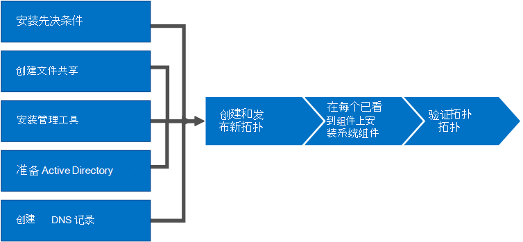

# 安装 Skype for Business ServerInstall Skype for Business Server
 
**摘要：** 了解如何为安装 Skype for Business Server 准备环境。**Summary:** Learn how to prepare your environment for an installation of Skype for Business Server. 从以下位置的 Microsoft 评估中心下载 Skype for Business Server 的免费试用版[https://www.microsoft.com/evalcenter/evaluate-skype-for-business-server](https://www.microsoft.com/evalcenter/evaluate-skype-for-business-server)：。Download a free trial of Skype for Business Server from the Microsoft Evaluation center at:[https://www.microsoft.com/evalcenter/evaluate-skype-for-business-server](https://www.microsoft.com/evalcenter/evaluate-skype-for-business-server).
  
本文将引导您完成 Skype for Business Server 的安装示例。This article walks you through an example installation of Skype for Business Server. 本文不会尝试涵盖执行完整的 Skype for Business Server 安装所需的所有过程。This article does not attempt to cover all of the procedures you need to perform a full Skype for Business Server installation. 目标是在定义了狭窄的拓扑中提供示例过程，其中包括基本的匹配和共享功能。The goal is to provide example procedures in a narrowly defined topology that includes basic meet-and-share functionality.
  
## Skype for business Server 的安装过程概述Overview of the install process for Skype for Business Server

Skype for Business Server 的安装包括许多不同的过程。An installation of Skype for Business Server includes many different procedures. 获取在环境中运行的 Skype for business 服务器所需的过程取决于环境的具体细节。The procedures you need to get Skype for Business Server running in your environment depend on the specifics of your environment. 例如，如果您使用 Windows Server for DNS，您将受益于添加 DNS 条目的示例过程。For example, if you are using Windows Server for DNS, you will benefit from the example procedure for adding a DNS entry. 如果为 DNS 使用其他系统，则需要遵循特定 DNS 系统的过程。If you use another system for DNS, you need to follow procedures for your particular DNS system. 本节中的许多过程都是如此。This is true for many of the procedures in this section.
  
Skype for Business Server 适用于 Standard Edition 和 Enterprise Edition。Skype for Business Server is available in Standard Edition and Enterprise Edition. 主要区别在于，Standard Edition 不支持企业版中附带的高可用性功能。The main difference is that Standard Edition does not support the high availability features that are included with Enterprise Edition. 
  
Skype for Business Server 是一种高级产品，确切的安装过程在特定情况下非常有用。Skype for Business Server is an advanced product, and the exact installation process depends a great deal on your specific circumstances. 本部分将引导您完成安装产品的常规步骤。This section walks you through the general steps to install the product. 但是，每个过程可能会有所不同，具体取决于您的环境和规划决策。However, each procedure might be different depending on your environment and planning decisions. 例如，对于小型组织，运行 Skype for Business Server Standard Edition 可能适用，而大型跨国组织可能在全球专用于产品的位置上有50台服务器。For example, for small organizations a single server, running Skype for Business Server Standard Edition might be appropriate, whereas a large multinational organization might have 50 servers at locations around the world dedicated to the product.
  
> [!NOTE]
> 若要了解最新的累积更新，请参阅[Skype For Business Server 更新](https://support.microsoft.com/kb/3061064)。To learn about the latest Cumulative Updates, see [Updates for Skype for Business Server](https://support.microsoft.com/kb/3061064). 安装 CU1 修补程序后，管理员需要执行`Update-CsAdminRole` cmdlet。After installing the CU1 patch an administrator needs to execute the  `Update-CsAdminRole` cmdlet. 此 cmdlet 是通过远程 PowerShell 访问新的 GCP cmdlet 所必需的。This cmdlet is required to access the new GCP cmdlets over Remote PowerShell.
  
> [!IMPORTANT]
> 本部分中的过程是使用定义较窄的一组要求并假设已做出特定决策的示例。The procedures in this section serve as an example using a narrowly defined set of requirements and assume specific decisions have already been made. 安装 Skype for Business Server 所需的实际过程可能会有很大不同。The actual procedures you need to install Skype for Business Server will likely be very different. 仅在每个环境中使用此部分中的过程作为示例，而不是作为安装 Skype for Business Server 的分步指南。Use the procedures in this section as an example only and not as a step-by-step guide for installing Skype for Business Server in every environment. 
  
第一次准备 Skype for business Server 并运行时涉及8个主要步骤。Getting Skype for Business Server up and running for the first time involves eight primary steps. 您应了解本部分中的示例过程不是安装 Skype for Business Server 所需的唯一过程。You should understand that the example procedures in this section are not the only procedures required for installing Skype for Business Server. 以下八个步骤只是帮助您更好地了解整体过程并使基本工作环境正常运行的简单示例。The following eight steps are simply examples to help you better understand the overall process and get a basic working environment up and running. 您可以按任意顺序执行步骤1至5。You can do steps 1 through 5 in any order. 但是，必须按顺序执行步骤6、7和8，并在第1步至第5步之后，如图中所述。However, you must do steps 6, 7, and 8 in order, and after steps 1 through 5, as outlined in the diagram. 这8个步骤如下：The eight steps are:
  

  
- [安装 skype for Business server 的必备组件](install-prerequisites.md)：在组成 Skype For business server 拓扑的所有服务器上安装必备组件。[Install prerequisites for Skype for Business Server](install-prerequisites.md) : Install prerequisites on all servers that make up the Skype for Business Server topology. 请注意，所有角色的先决条件并不相同。Note that prerequisites are not the same for all roles. 例如，提供前端角色的服务器具有一组先决条件，提供控制器角色的服务器具有一组不同的先决条件。For example, servers that provide the front-end role have a set of prerequisites, and servers that provide a director role have a different set of prerequisites. 有关更多详细信息，请参阅必备项规划文档。See prerequisite planning documentation for more details.
    
- [在 skype For Business server 中创建文件共享](create-a-file-share.md)：创建将由整个 Skype For business server 拓扑中的服务器使用的文件共享。[Create a file share in Skype for Business Server](create-a-file-share.md) : Create a file share that will be used by servers throughout the Skype for Business Server topology.
    
- [在 Skype For Business Server 中安装管理工具](install-administrative-tools.md)：管理工具包括拓扑生成器和 "控制面板"。[Install administrative tools in Skype for Business Server](install-administrative-tools.md) : The administrative tools include Topology Builder and Control Panel. 必须在拓扑中至少一台服务器上安装管理工具，或者在运行 Skype for Business Server 支持的 Windows OS 版本的64位管理工作站上安装管理工具。You must install the administrative tools on at least one server in the topology or a 64-bit management workstation running a Windows OS version that is supported for Skype for Business Server.
    
- [为 skype for Business Server 准备 Active Directory](prepare-active-directory.md) ： Skype For business Server 与 Active directory 紧密协作。[Prepare Active Directory for Skype for Business Server](prepare-active-directory.md) : Skype for Business Server works closely with Active Directory. 您必须准备 Active Directory 域才能与 Skype for Business Server 配合使用。You must prepare the Active Directory domain to work with Skype for Business Server. 您可以通过部署向导执行此操作，仅对域执行一次此操作。You can do this through the Deployment Wizard, and it is only done once for the domain. 这是因为该过程会创建组并修改域，您只需执行一次此操作。This is because the process creates groups and modifies the domain, and you need to do that only once.
    
- [为 skype for Business Server 创建 DNS 记录](create-dns-records.md)：为了使 Skype For business server 正常工作，必须有大量 DNS 设置。[Create DNS records for Skype for Business Server](create-dns-records.md) : In order for Skype for Business Server to work properly, a number of DNS settings must be in place. 这样，客户端就知道如何访问彼此相关的服务和服务器。This is so that clients know how to access the services and the servers know about each other. 这些设置只需要针对每个部署完成一次，因为一旦分配了 DNS 条目，它就会在整个域中可用。These settings only need to be completed once per deployment because once you assign a DNS entry, it is available throughout the domain.
    
- [在 skype For Business server 中创建和发布新拓扑](create-and-publish-new-topology.md)：在拓扑中的每台服务器上安装 Skype For business Server 系统之前，必须创建一个拓扑并将其发布。[Create and publish new topology in Skype for Business Server](create-and-publish-new-topology.md) : Before you can install the Skype for Business Server system on each of the servers in the topology, you must create a topology and publish it. 发布拓扑时，会将拓扑信息加载到中央管理存储数据库中。When you publish a topology, you are loading the topology information into the Central Management Store database. 如果这是一个 Enterprise Edition 池，您将在首次发布新的拓扑时创建中央管理存储数据库。If this is an Enterprise Edition pool, you are creating the Central Management Store database the first time you publish a new topology. 如果这是 Standard Edition，则需要在发布拓扑之前，先从部署向导运行准备第一个 Standard Edition Server 进程。If this is Standard Edition, you need to run the Prepare First Standard Edition Server process from the Deployment Wizard before you publish a topology. 这将通过安装 SQL Server Express Edition 实例并创建中央管理存储来准备标准版。This prepares for Standard Edition by installing a SQL Server Express Edition instance and creating the Central Management Store.
    
- 在[拓扑中的服务器上安装 Skype For Business Server](install-skype-for-business-server.md) ：一旦将拓扑加载到中央管理存储中，并且 Active Directory 知道哪些服务器将执行哪些角色，您需要在拓扑中的每台服务器上安装 Skype For business server 系统。[Install Skype for Business Server on servers in the topology](install-skype-for-business-server.md) : Once the topology is loaded into the Central Management Store and Active Directory knows which servers will perform which roles, you need to install the Skype for Business Server system on each of the servers in the topology.
    
- [验证 Skype For Business server 中的拓扑](verify-the-topology.md)：在发布拓扑后，在拓扑中的每台服务器上安装 Skype For business Server 系统组件后，即可验证拓扑是否按预期正常运行。[Verify the topology in Skype for Business Server](verify-the-topology.md) : After you have the topology published and the Skype for Business Server system components installed on each of the servers in the topology, you are ready to verify that the topology is working as expected. 这包括验证配置是否已传播到所有 Active Directory 服务器，以便整个域都知道 Skype for Business 在域中可用。This includes verifying that the configuration has propagated out to all of the Active Directory servers so that the entire domain knows that Skype for Business is available in the domain.
    

