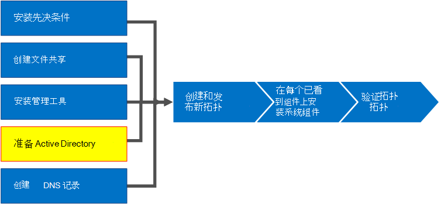
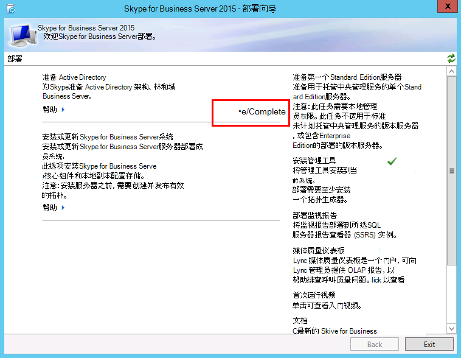

# <a name="prepare-active-directory-for-skype-for-business-server"></a><span data-ttu-id="5561f-104">准备 Active Directory 的 Skype 业务服务器</span><span class="sxs-lookup"><span data-stu-id="5561f-104">Prepare Active Directory for Skype for Business Server</span></span>
 
<span data-ttu-id="5561f-105">**摘要：** 了解如何为业务 Server Skype 安装准备 Active Directory 域。</span><span class="sxs-lookup"><span data-stu-id="5561f-105">**Summary:** Learn how to prepare your Active Directory domain for an installation of Skype for Business Server.</span></span> <span data-ttu-id="5561f-106">从[Microsoft 评估中心](https://www.microsoft.com/evalcenter/evaluate-skype-for-business-server)业务服务器下载 Skype 的免费试用版。</span><span class="sxs-lookup"><span data-stu-id="5561f-106">Download a free trial of Skype for Business Server from the [Microsoft Evaluation center](https://www.microsoft.com/evalcenter/evaluate-skype-for-business-server).</span></span>
  
<span data-ttu-id="5561f-107">与 Active Directory 紧密 Skype 业务服务器。</span><span class="sxs-lookup"><span data-stu-id="5561f-107">Skype for Business Server works closely with Active Directory.</span></span> <span data-ttu-id="5561f-108">您必须准备使用 Skype 业务服务器的 Active Directory 域。</span><span class="sxs-lookup"><span data-stu-id="5561f-108">You must prepare the Active Directory domain to work with Skype for Business Server.</span></span> <span data-ttu-id="5561f-109">将在部署向导中完成此流程，且仅对该域执行一次该流程。</span><span class="sxs-lookup"><span data-stu-id="5561f-109">This process is accomplished in the Deployment Wizard and is only done once for the domain.</span></span> <span data-ttu-id="5561f-110">这是因为，该流程会创建组和修改域，您仅需完成一次此项操作。</span><span class="sxs-lookup"><span data-stu-id="5561f-110">This is because the process creates groups and modifies the domain, and you need to do that only once.</span></span> <span data-ttu-id="5561f-111">第 1 步至第 5 步可以按任意顺序执行。</span><span class="sxs-lookup"><span data-stu-id="5561f-111">You can do steps 1 through 5 in any order.</span></span> <span data-ttu-id="5561f-112">但是，第 6、7、8 步必须在第 1 步至第 5 步之后按图表所示顺序执行。</span><span class="sxs-lookup"><span data-stu-id="5561f-112">However, you must do steps 6, 7, and 8 in order, and after steps 1 through 5, as outlined in the diagram.</span></span> <span data-ttu-id="5561f-113">准备 Active Directory 是 8 个步骤中的第 4 步。</span><span class="sxs-lookup"><span data-stu-id="5561f-113">Preparing Active Directory is step 4 of 8.</span></span> <span data-ttu-id="5561f-114">有关规划 Active Directory 的详细信息，请参阅[环境要求 Skype 业务服务器](../../plan-your-deployment/requirements-for-your-environment/environmental-requirements.md)或[服务器要求的业务服务器 2019 Skype](../../../SfBServer2019/plan/system-requirements.md)。</span><span class="sxs-lookup"><span data-stu-id="5561f-114">For more information about planning for Active Directory, see [Environmental requirements for Skype for Business Server](../../plan-your-deployment/requirements-for-your-environment/environmental-requirements.md) or [Server requirements for Skype for Business Server 2019](../../../SfBServer2019/plan/system-requirements.md).</span></span>
  

  
## <a name="prepare-active-directory"></a><span data-ttu-id="5561f-116">准备 Active Directory</span><span class="sxs-lookup"><span data-stu-id="5561f-116">Prepare Active Directory</span></span>

<span data-ttu-id="5561f-117">与 Active Directory 域服务 (AD DS) 紧密集成的企业服务器的 Skype。</span><span class="sxs-lookup"><span data-stu-id="5561f-117">Skype for Business Server is tightly integrated with Active Directory Domain Services (AD DS).</span></span> <span data-ttu-id="5561f-118">Skype 业务服务器可以在首次安装之前，必须先准备 Active Directory。</span><span class="sxs-lookup"><span data-stu-id="5561f-118">Before Skype for Business Server can be installed for the first time, Active Directory must be prepared.</span></span> <span data-ttu-id="5561f-119">名为**准备 Active Directory**部署向导的一部分用于与 Skype 的 Active Directory 环境准备 Business Server。</span><span class="sxs-lookup"><span data-stu-id="5561f-119">The section of the Deployment Wizard titled **Prepare Active Directory** prepares the Active Directory environment for use with Skype for Business Server.</span></span>
  
> [!NOTE]
> <span data-ttu-id="5561f-120">Skype 业务服务器使用 (AD DS) 来跟踪和与所有拓扑中的服务器都通信。</span><span class="sxs-lookup"><span data-stu-id="5561f-120">Skype for Business Server uses (AD DS) to track and communicate with all of the servers in a topology.</span></span> <span data-ttu-id="5561f-121">每台服务器必须加入域，以便 Skype 业务服务器可以正常工作。</span><span class="sxs-lookup"><span data-stu-id="5561f-121">Every server must be joined to the domain so that Skype for Business Server can work properly.</span></span> 
  
> [!IMPORTANT]
> <span data-ttu-id="5561f-122">应仅为部署中的每个域运行一次“准备 Active Directory”过程。</span><span class="sxs-lookup"><span data-stu-id="5561f-122">The Prepare Active Directory procedure should be run only once for each domain in the deployment.</span></span> 
  
<span data-ttu-id="5561f-123">观看“**准备 Active Directory**”视频了解相关步骤。</span><span class="sxs-lookup"><span data-stu-id="5561f-123">Watch the video steps for **Prepare Active Directory**:</span></span>
  
> [!video https://www.microsoft.com/en-us/videoplayer/embed/RE1Ybuk]
  
### <a name="prepare-active-directory-from-the-deployment-wizard"></a><span data-ttu-id="5561f-124">通过部署向导准备 Active Directory</span><span class="sxs-lookup"><span data-stu-id="5561f-124">Prepare Active Directory from the Deployment Wizard</span></span>

1. <span data-ttu-id="5561f-125">以具备 Active Directory 域的 Schema Admins 凭证的用户身份登录。</span><span class="sxs-lookup"><span data-stu-id="5561f-125">Log on as a user with Schema Admins credentials for the Active Directory domain.</span></span>
    
2. <span data-ttu-id="5561f-126">打开 Skype 业务 Server 部署向导。</span><span class="sxs-lookup"><span data-stu-id="5561f-126">Open Skype for Business Server Deployment Wizard.</span></span>
    
    > [!TIP]
    > <span data-ttu-id="5561f-127">如果您想要查看日志文件中的业务 Server 部署向导创建的 Skype，您可以在其中运行部署向导中，运行该步骤的 AD DS 用户的用户目录中的计算机上找到这些。</span><span class="sxs-lookup"><span data-stu-id="5561f-127">If you want to review the log files that are created by the Skype for Business Server Deployment Wizard, you can find them on the computer where the Deployment Wizard was run, in the Users directory of the AD DS user who ran the step.</span></span> <span data-ttu-id="5561f-128">例如，如果用户以登录域、 contoso.local、 日志文件中的域管理员位于： C:\Users\Administrator.Contoso\AppData\Local\Temp。</span><span class="sxs-lookup"><span data-stu-id="5561f-128">For example, if the user logged on as the domain administrator in the domain, contoso.local, the log files are located in: C:\Users\Administrator.Contoso\AppData\Local\Temp.</span></span> 
  
3. <span data-ttu-id="5561f-129">单击“**准备 Active Directory**”链接。</span><span class="sxs-lookup"><span data-stu-id="5561f-129">Click the **Prepare Active Directory** link.</span></span>
    
4. <span data-ttu-id="5561f-130">**第 1 步：准备架构**</span><span class="sxs-lookup"><span data-stu-id="5561f-130">**Step 1: Prepare schema**</span></span>
    
    <span data-ttu-id="5561f-131">a.</span><span class="sxs-lookup"><span data-stu-id="5561f-131">a.</span></span> <span data-ttu-id="5561f-132">检查第 1 步的先决条件信息，可单击第 1 步标题下的下拉菜单访问该信息。</span><span class="sxs-lookup"><span data-stu-id="5561f-132">Review the prerequisites information for Step 1 which can be accessed by clicking the drop-down under the Step 1 title.</span></span>
    
    <span data-ttu-id="5561f-133">b.</span><span class="sxs-lookup"><span data-stu-id="5561f-133">b.</span></span> <span data-ttu-id="5561f-134">单击第 1 步中的“**运行**”以启动“准备架构”向导。</span><span class="sxs-lookup"><span data-stu-id="5561f-134">Click **Run** in Step 1 to launch the Prepare Schema wizard.</span></span>
    
    <span data-ttu-id="5561f-135">c.</span><span class="sxs-lookup"><span data-stu-id="5561f-135">c.</span></span> <span data-ttu-id="5561f-136">请注意，应仅为每个部署执行一次该过程，然后单击“**下一步**”。</span><span class="sxs-lookup"><span data-stu-id="5561f-136">Take note that the procedure should be run only once for each deployment, and then click **Next**.</span></span>
    
    <span data-ttu-id="5561f-137">d.</span><span class="sxs-lookup"><span data-stu-id="5561f-137">d.</span></span> <span data-ttu-id="5561f-138">准备好架构后，您可以单击“**查看日志**”以查看日志。</span><span class="sxs-lookup"><span data-stu-id="5561f-138">Once the schema has been prepared, you can view the log by clicking **View Log**.</span></span> 
    
    <span data-ttu-id="5561f-139">e。</span><span class="sxs-lookup"><span data-stu-id="5561f-139">e.</span></span> <span data-ttu-id="5561f-140">单击“**完成**”以关闭“准备架构”向导，然后返回“准备 Active Directory”步骤。</span><span class="sxs-lookup"><span data-stu-id="5561f-140">Click **Finish** to close the Prepare Schema wizard, and return to the Prepare Active Directory steps.</span></span>
    
5. <span data-ttu-id="5561f-141">**第 2 步：验证架构分区的复制**</span><span class="sxs-lookup"><span data-stu-id="5561f-141">**Step 2: Verify replication of schema partition**</span></span>
    
    <span data-ttu-id="5561f-142">a.</span><span class="sxs-lookup"><span data-stu-id="5561f-142">a.</span></span> <span data-ttu-id="5561f-143">登录到域的域控制器。</span><span class="sxs-lookup"><span data-stu-id="5561f-143">Log on to the domain controller for the domain.</span></span>
    
    <span data-ttu-id="5561f-144">b.</span><span class="sxs-lookup"><span data-stu-id="5561f-144">b.</span></span> <span data-ttu-id="5561f-145">从“**服务器管理器**”中的“**工具**”下拉菜单打开“**ADSI Edit**”。</span><span class="sxs-lookup"><span data-stu-id="5561f-145">Open **ADSI Edit** from the **Tools** drop-down menu in **Server Manager**.</span></span>
    
    <span data-ttu-id="5561f-146">c.</span><span class="sxs-lookup"><span data-stu-id="5561f-146">c.</span></span> <span data-ttu-id="5561f-147">在“**操作**”菜单上，单击“**连接到**”。</span><span class="sxs-lookup"><span data-stu-id="5561f-147">On the **Action** menu, click **Connect to**.</span></span>
    
    <span data-ttu-id="5561f-148">d.</span><span class="sxs-lookup"><span data-stu-id="5561f-148">d.</span></span> <span data-ttu-id="5561f-149">在“**连接设置**”对话框中的“**选择一个已知命名上下文**”下，选择“**架构**”，然后单击“**确定**”。</span><span class="sxs-lookup"><span data-stu-id="5561f-149">In the **Connection Settings** dialog box under **Select a well known Naming Context**, select **Schema**, and then click **OK**.</span></span>
    
    <span data-ttu-id="5561f-150">e。</span><span class="sxs-lookup"><span data-stu-id="5561f-150">e.</span></span> <span data-ttu-id="5561f-151">在架构容器下，搜索“**CN=ms-RTC-SIP-SchemaVersion**”。</span><span class="sxs-lookup"><span data-stu-id="5561f-151">Under the schema container, search for **CN=ms-RTC-SIP-SchemaVersion**.</span></span> <span data-ttu-id="5561f-152">如果此对象存在，并且 **rangeUpper** 属性的值为 1150，**rangeLower** 属性的值为 3，则说明架构更新和复制成功。</span><span class="sxs-lookup"><span data-stu-id="5561f-152">If this object exists, and the value of the **rangeUpper** attribute is 1150 and the value of the **rangeLower** attribute is 3, the schema was successfully updated and replicated.</span></span> <span data-ttu-id="5561f-153">如果此对象不存在，或 **rangeUpper** 和 **rangeLower** 属性的值不是指定的值，则说明架构未经过修改或尚未复制。</span><span class="sxs-lookup"><span data-stu-id="5561f-153">If this object does not exist or the values of the **rangeUpper** and **rangeLower** attributes are not as specified, the schema was not modified or has not replicated.</span></span>
    
6. <span data-ttu-id="5561f-154">**第 3 步：准备当前林**</span><span class="sxs-lookup"><span data-stu-id="5561f-154">**Step 3: Prepare current forest**</span></span>
    
    <span data-ttu-id="5561f-155">a.</span><span class="sxs-lookup"><span data-stu-id="5561f-155">a.</span></span> <span data-ttu-id="5561f-156">检查第 3 步的先决条件信息，可单击第 3 步标题下的下拉菜单访问该信息。</span><span class="sxs-lookup"><span data-stu-id="5561f-156">Review the prerequisites information for Step 3 which can be accessed by clicking the drop-down under the Step 3 title.</span></span>
    
    <span data-ttu-id="5561f-157">b.</span><span class="sxs-lookup"><span data-stu-id="5561f-157">b.</span></span> <span data-ttu-id="5561f-158">单击第 3 步中的“**运行**”以启动“准备当前林”向导。</span><span class="sxs-lookup"><span data-stu-id="5561f-158">Click **Run** in Step 3 to launch the Prepare Current Forest wizard.</span></span>
    
    <span data-ttu-id="5561f-159">c.</span><span class="sxs-lookup"><span data-stu-id="5561f-159">c.</span></span> <span data-ttu-id="5561f-160">请注意，应仅为每个部署执行一次该过程，然后单击“**下一步**”。</span><span class="sxs-lookup"><span data-stu-id="5561f-160">Take note that the procedure should be only run once per deployment, and then click **Next**.</span></span>
    
    <span data-ttu-id="5561f-161">d.</span><span class="sxs-lookup"><span data-stu-id="5561f-161">d.</span></span> <span data-ttu-id="5561f-162">指定将创建通用组的域。</span><span class="sxs-lookup"><span data-stu-id="5561f-162">Specify the domain where the universal groups will be created.</span></span> <span data-ttu-id="5561f-163">如果服务器是组的一部分，您可以选择“**本地域**”，然后单击“**下一步**”。</span><span class="sxs-lookup"><span data-stu-id="5561f-163">If the server is part of the domain, you can choose **Local domain**, and click **Next**.</span></span>
    
    <span data-ttu-id="5561f-164">e。</span><span class="sxs-lookup"><span data-stu-id="5561f-164">e.</span></span> <span data-ttu-id="5561f-165">准备好林后，您可以单击“**查看日志**”以查看日志。</span><span class="sxs-lookup"><span data-stu-id="5561f-165">Once the forest has been prepared, you can view the log by clicking **View Log**.</span></span> 
    
    <span data-ttu-id="5561f-166">f。</span><span class="sxs-lookup"><span data-stu-id="5561f-166">f.</span></span> <span data-ttu-id="5561f-167">单击“**完成**”以关闭“准备当前林”向导，然后返回“准备 Active Directory”步骤。</span><span class="sxs-lookup"><span data-stu-id="5561f-167">Click **Finish** to close the Prepare Current Forest wizard, and return to the Prepare Active Directory steps.</span></span>
    
    <span data-ttu-id="5561f-168">g。</span><span class="sxs-lookup"><span data-stu-id="5561f-168">g.</span></span> <span data-ttu-id="5561f-169">单击**应用程序**页上，启动 PowerShell 从**业务 Server Management Shell 的 Skype** 。</span><span class="sxs-lookup"><span data-stu-id="5561f-169">Click **Skype for Business Server Management Shell** from the **Apps** page to launch PowerShell.</span></span>
    
    <span data-ttu-id="5561f-170">h。</span><span class="sxs-lookup"><span data-stu-id="5561f-170">h.</span></span> <span data-ttu-id="5561f-171">键入命令 Get-csadforest，然后按**Enter**。</span><span class="sxs-lookup"><span data-stu-id="5561f-171">Type the command Get-CsAdForest, and press **Enter**.</span></span>
    
    <span data-ttu-id="5561f-172">我。</span><span class="sxs-lookup"><span data-stu-id="5561f-172">i.</span></span> <span data-ttu-id="5561f-173">如果结果， **LC_FORESTSETTINGS_STATE_READY**林成功准备好之后，如图所示。</span><span class="sxs-lookup"><span data-stu-id="5561f-173">If the result is **LC_FORESTSETTINGS_STATE_READY**, the forest has successfully been prepared, as shown in the figure.</span></span>
    
     
  
7. <span data-ttu-id="5561f-175">**第 4 步：验证全局目录的复制**</span><span class="sxs-lookup"><span data-stu-id="5561f-175">**Step 4: Verify replication of the global catalog**</span></span>
    
    <span data-ttu-id="5561f-176">a.</span><span class="sxs-lookup"><span data-stu-id="5561f-176">a.</span></span> <span data-ttu-id="5561f-177">在运行林准备的林中的域控制器上（最好在其他域控制器的远程站点中），打开“**Active Directory 用户和计算机**”。</span><span class="sxs-lookup"><span data-stu-id="5561f-177">On a domain controller (preferably in a remote site from the other domain controllers), in the forest where the Forest Preparation was run, open **Active Directory Users and Computers**.</span></span>
    
    <span data-ttu-id="5561f-178">b.</span><span class="sxs-lookup"><span data-stu-id="5561f-178">b.</span></span> <span data-ttu-id="5561f-179">在“**Active Directory 用户和计算机**”中，展开林或子域的域名。</span><span class="sxs-lookup"><span data-stu-id="5561f-179">In **Active Directory Users and Computers**, expand the domain name of your forest or a child domain.</span></span>
    
    <span data-ttu-id="5561f-180">c.</span><span class="sxs-lookup"><span data-stu-id="5561f-180">c.</span></span> <span data-ttu-id="5561f-181">在左侧窗格中单击“**用户**”容器，在右侧窗格中查找通用组 **CsAdministrator**。</span><span class="sxs-lookup"><span data-stu-id="5561f-181">Click the **Users** container on the left side pane, and look for the Universal group **CsAdministrator** in the right side pane.</span></span> <span data-ttu-id="5561f-182">如果除其他以 Cs 开头的新通用组外还显示 CsAdministrator，则表明 Active Directory 的复制成功。</span><span class="sxs-lookup"><span data-stu-id="5561f-182">If CsAdministrator (among other new Universal groups that begin with Cs) is present, Active Directory replication has been successful.</span></span>
    
    <span data-ttu-id="5561f-183">d.</span><span class="sxs-lookup"><span data-stu-id="5561f-183">d.</span></span> <span data-ttu-id="5561f-184">如果未显示这些组，可以强制复制或等待 15 分钟后再刷新右侧窗格。</span><span class="sxs-lookup"><span data-stu-id="5561f-184">If the groups are not yet present, you can force the replication, or wait 15 minutes and refresh the right side pane.</span></span> <span data-ttu-id="5561f-185">显示组后，表明复制完成。</span><span class="sxs-lookup"><span data-stu-id="5561f-185">When the groups are present, replication is complete.</span></span>
    
8. <span data-ttu-id="5561f-186">**第 5 步：准备当前域**</span><span class="sxs-lookup"><span data-stu-id="5561f-186">**Step 5: Prepare the current domain**</span></span>
    
    <span data-ttu-id="5561f-187">a.</span><span class="sxs-lookup"><span data-stu-id="5561f-187">a.</span></span> <span data-ttu-id="5561f-188">查看第 5 步的先决条件信息</span><span class="sxs-lookup"><span data-stu-id="5561f-188">Review the prerequisites information for Step 5.</span></span>
    
    <span data-ttu-id="5561f-189">b.</span><span class="sxs-lookup"><span data-stu-id="5561f-189">b.</span></span> <span data-ttu-id="5561f-190">单击第 5 步中的“**运行**”以启动“准备当前域”向导。</span><span class="sxs-lookup"><span data-stu-id="5561f-190">Click **Run** in Step 5 to launch the Prepare Current Domain wizard.</span></span>
    
    <span data-ttu-id="5561f-191">c.</span><span class="sxs-lookup"><span data-stu-id="5561f-191">c.</span></span> <span data-ttu-id="5561f-192">请注意，应仅为部署中的每个域执行一次该过程，然后单击“**下一步**”。</span><span class="sxs-lookup"><span data-stu-id="5561f-192">Take note that the procedure should only be run once for each domain in the deployment, and then click **Next**.</span></span>
    
    <span data-ttu-id="5561f-193">d.</span><span class="sxs-lookup"><span data-stu-id="5561f-193">d.</span></span> <span data-ttu-id="5561f-194">准备好域后，您可以单击“**查看日志**”以查看日志。</span><span class="sxs-lookup"><span data-stu-id="5561f-194">Once the domain has been prepared, you can view the log by clicking **View Log**.</span></span> 
    
    <span data-ttu-id="5561f-195">e。</span><span class="sxs-lookup"><span data-stu-id="5561f-195">e.</span></span> <span data-ttu-id="5561f-196">单击“**完成**”以关闭“准备当前域”向导，然后返回“准备 Active Directory”步骤。</span><span class="sxs-lookup"><span data-stu-id="5561f-196">Click **Finish** to close the Prepare Current Domain wizard, and return to the Prepare Active Directory steps.</span></span>
    
    <span data-ttu-id="5561f-197">其中 Skype 的找到 Business Server 对象，否则服务可能每个域中，必须完成这些步骤不会启动。</span><span class="sxs-lookup"><span data-stu-id="5561f-197">These steps must be completed in every domain where Skype for Business Server objects are found, otherwise services might not start.</span></span> <span data-ttu-id="5561f-198">这包括任意类型的 Active Directory 对象，比如用户、联系人对象、管理组或其他任何类型的对象。</span><span class="sxs-lookup"><span data-stu-id="5561f-198">This includes any type of Active Directory object, such as users, contact objects, administrative groups, or any other type of object.</span></span> <span data-ttu-id="5561f-199">您可以使用集 CsUserReplicatorConfiguration ADDomainNamingContextList 添加仅的域与 Skype 的业务服务器对象，如果需要。</span><span class="sxs-lookup"><span data-stu-id="5561f-199">You can use Set-CsUserReplicatorConfiguration -ADDomainNamingContextList to add only the domains with Skype for Business Server objects, if needed.</span></span>
    
9. <span data-ttu-id="5561f-200">**第 6 步：验证域中的复制**</span><span class="sxs-lookup"><span data-stu-id="5561f-200">**Step 6: Verify replication in the domain**</span></span>
    
    <span data-ttu-id="5561f-201">a.</span><span class="sxs-lookup"><span data-stu-id="5561f-201">a.</span></span> <span data-ttu-id="5561f-202">单击**业务 Server Management Shell 的 Skype**从**应用程序**页以启动 PowerShell。</span><span class="sxs-lookup"><span data-stu-id="5561f-202">Click the **Skype for Business Server Management Shell** from the **Apps** page to launch PowerShell.</span></span>
    
    <span data-ttu-id="5561f-203">b.</span><span class="sxs-lookup"><span data-stu-id="5561f-203">b.</span></span> <span data-ttu-id="5561f-204">使用 Get-csaddomain 的命令来验证域中的复制。</span><span class="sxs-lookup"><span data-stu-id="5561f-204">Use the command Get-CsAdDomain to verify replication within the domain.</span></span>
    
   ```
   Get-CsAdDomain [-Domain <Fqdn>] [-DomainController <Fqdn>] [-GlobalCatalog <Fqdn>] [-GlobalSettingsDomainController <Fqdn>]
   ```

    > [!NOTE]
    > <span data-ttu-id="5561f-205">如果不指定 Domain 参数，则将该值设置为本地域。</span><span class="sxs-lookup"><span data-stu-id="5561f-205">If you do not specify the Domain parameter, the value is set to the local domain.</span></span> 
  
    <span data-ttu-id="5561f-206">为 contoso.local 域运行命令的示例：</span><span class="sxs-lookup"><span data-stu-id="5561f-206">Example of running the command for the contoso.local domain:</span></span>
    
   ```
   Get-CsAdDomain -Domain contoso.local -GlobalSettingsDomainController dc.contoso.local
   ```

    > [!NOTE]
    > <span data-ttu-id="5561f-p138">通过使用参数 GlobalSettingsDomainController，您可以指出存储全局设置的位置。如果设置存储在“系统”容器中（在全局设置尚未迁移到“配置”容器的升级部署中时通常是这种情况），则定义 AD DS 林的根中的某个域控制器。如果全局设置存储在“配置”容器中（在新部署或设置已迁移到“配置”容器的升级部署中时通常是这种情况），则定义林中的任何域控制器。如果未指定此参数，则 cmdlet 会假定设置存储在“配置”容器中，并引用 Active Directory 中的任何域控制器。</span><span class="sxs-lookup"><span data-stu-id="5561f-p138">By using the parameter GlobalSettingsDomainController, you can indicate where global settings are stored. If your settings are stored in the System container (which is typical with upgrade deployments that have not had the global setting migrated to the Configuration container), you define a domain controller in the root of your AD DS forest. If the global settings are in the Configuration container (which is typical with new deployments or upgrade deployments where the settings have been migrated to the Configuration container), you define any domain controller in the forest. If you do not specify this parameter, the cmdlet assumes that the settings are stored in the Configuration container and refers to any domain controller in Active Directory.</span></span> 
  
    <span data-ttu-id="5561f-211">c.</span><span class="sxs-lookup"><span data-stu-id="5561f-211">c.</span></span> <span data-ttu-id="5561f-212">如果结果， **LC_DOMAINSETTINGS_STATE_READY**已成功复制域。</span><span class="sxs-lookup"><span data-stu-id="5561f-212">If the result is **LC_DOMAINSETTINGS_STATE_READY**, the domain has successfully replicated.</span></span>
    
10. <span data-ttu-id="5561f-213">**第 7 步：添加用户以提供 Skype for Business Server 控制面板的管理访问权限**</span><span class="sxs-lookup"><span data-stu-id="5561f-213">**Step 7: Add users to provide administrative access to the Skype for Business Server Control Panel**</span></span>
    
    <span data-ttu-id="5561f-214">a.</span><span class="sxs-lookup"><span data-stu-id="5561f-214">a.</span></span> <span data-ttu-id="5561f-215">以 Domain Admins 组或 RTCUniversalServerAdmins 组成员的身份登录。</span><span class="sxs-lookup"><span data-stu-id="5561f-215">Log on as a member of the Domain Admins group or the RTCUniversalServerAdmins group.</span></span>
    
    <span data-ttu-id="5561f-216">b.</span><span class="sxs-lookup"><span data-stu-id="5561f-216">b.</span></span> <span data-ttu-id="5561f-217">打开“**Active Directory 用户和计算机**”，展开域，单击“**用户**”容器，右键单击 CSAdministrator，然后选择“**属性**”。</span><span class="sxs-lookup"><span data-stu-id="5561f-217">Open **Active Directory Users and Computers**, expand your domain, click the **Users** container, right-click CSAdministrator, and choose **Properties**.</span></span>
    
    <span data-ttu-id="5561f-218">c.</span><span class="sxs-lookup"><span data-stu-id="5561f-218">c.</span></span> <span data-ttu-id="5561f-219">在“**CSAdministrator 属性**”中，单击“**成员**”选项卡。</span><span class="sxs-lookup"><span data-stu-id="5561f-219">In **CSAdministrator Properties**, click the **Members** tab.</span></span>
    
    <span data-ttu-id="5561f-220">d.</span><span class="sxs-lookup"><span data-stu-id="5561f-220">d.</span></span> <span data-ttu-id="5561f-221">在“**成员**”选项卡上，单击“**添加**”。</span><span class="sxs-lookup"><span data-stu-id="5561f-221">On the **Members** tab, click **Add**.</span></span> <span data-ttu-id="5561f-222">在“**选择用户、联系人、计算机、服务帐户或组**”中，找到“**输入要选择的对象名称**”。</span><span class="sxs-lookup"><span data-stu-id="5561f-222">In **Select Users, Contacts, Computers, Service Accounts, or Groups**, locate the **Enter the object names to select**.</span></span> <span data-ttu-id="5561f-223">键入要添加到 CSAdministrators 组的用户名或组名。</span><span class="sxs-lookup"><span data-stu-id="5561f-223">Type the user name(s) or group name(s) to add to the group CSAdministrators.</span></span> <span data-ttu-id="5561f-224">单击“**确定**”。</span><span class="sxs-lookup"><span data-stu-id="5561f-224">Click **OK**.</span></span>
    
    <span data-ttu-id="5561f-225">e。</span><span class="sxs-lookup"><span data-stu-id="5561f-225">e.</span></span> <span data-ttu-id="5561f-226">在“**成员**”选项卡上，确认所选的用户或组存在。</span><span class="sxs-lookup"><span data-stu-id="5561f-226">On the **Members** tab, confirm that the users or groups that you selected are present.</span></span> <span data-ttu-id="5561f-227">单击“**确定**”。</span><span class="sxs-lookup"><span data-stu-id="5561f-227">Click **OK**.</span></span>
    
    > [!CAUTION]
    > <span data-ttu-id="5561f-228">为业务 Server Control Panel Skype 是一个基于角色的访问控制工具。</span><span class="sxs-lookup"><span data-stu-id="5561f-228">The Skype for Business Server Control Panel is a role-based access control tool.</span></span> <span data-ttu-id="5561f-229">CsAdministrator 组的成员提供的业务 Server Control Panel 完全控制的所有可用的配置函数使用 Skype 的用户。</span><span class="sxs-lookup"><span data-stu-id="5561f-229">Membership in the CsAdministrator group gives a user who is using the Skype for Business Server Control Panel full control for all configuration functions available.</span></span> <span data-ttu-id="5561f-230">还有其他为特定功能设计的专门角色可用。</span><span class="sxs-lookup"><span data-stu-id="5561f-230">There are other roles available that are designed for specific functions.</span></span> <span data-ttu-id="5561f-231">有关可用的角色的详细信息，请参阅[环境要求 Skype 业务服务器](../../plan-your-deployment/requirements-for-your-environment/environmental-requirements.md)或[服务器要求的业务服务器 2019 Skype](../../../SfBServer2019/plan/system-requirements.md)。</span><span class="sxs-lookup"><span data-stu-id="5561f-231">For details on the roles available, see [Environmental requirements for Skype for Business Server](../../plan-your-deployment/requirements-for-your-environment/environmental-requirements.md) or [Server requirements for Skype for Business Server 2019](../../../SfBServer2019/plan/system-requirements.md).</span></span> <span data-ttu-id="5561f-232">请注意，用户不需要启用的 Skype 业务服务器，才能成为管理组的成员。</span><span class="sxs-lookup"><span data-stu-id="5561f-232">Note that users do not have to be enabled for Skype for Business Server in order to be made members of the management groups.</span></span> 
  
    > [!CAUTION]
    > <span data-ttu-id="5561f-233">若要帮助保留安全性和基于角色的访问控制完整性，请将用户添加到定义了用户执行的业务服务器部署 Skype 的管理角色组。</span><span class="sxs-lookup"><span data-stu-id="5561f-233">To help retain security and role-based access control integrity, add users to the groups that define what role the user performs in management of the Skype for Business Server deployment.</span></span> 
  
11. <span data-ttu-id="5561f-234">注销，然后重新登录到 Windows，以便您的安全令牌更新与新 Skype Business Server 安全组，然后重新打开部署向导。</span><span class="sxs-lookup"><span data-stu-id="5561f-234">Log off, and then log back on to Windows so that your security token is updated with the new Skype for Business Server security group, and then reopen the Deployment Wizard.</span></span>
    
12. <span data-ttu-id="5561f-235">验证“**准备 Active Directory**”旁边是否存在绿色对勾以确认过程取得成功，如图所示。</span><span class="sxs-lookup"><span data-stu-id="5561f-235">Verify that you see a green checkmark next to **Prepare Active Director** to confirm success, as shown in the figure.</span></span>
    
     
  

## <a name="see-also"></a><span data-ttu-id="5561f-237">另请参阅</span><span class="sxs-lookup"><span data-stu-id="5561f-237">See also</span></span>
 
[<span data-ttu-id="5561f-238">Active Directory Domain Services for Skype for Business Server 2015</span><span class="sxs-lookup"><span data-stu-id="5561f-238">Active Directory Domain Services for Skype for Business Server 2015</span></span>](../../plan-your-deployment/security/active-directory-domain-services.md)
