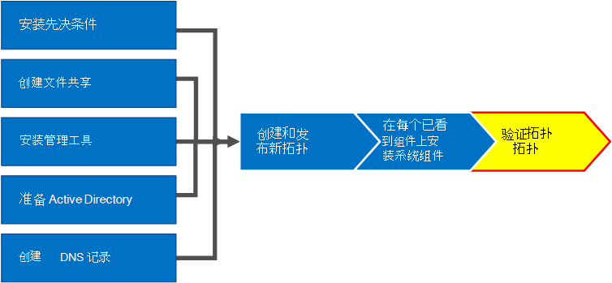
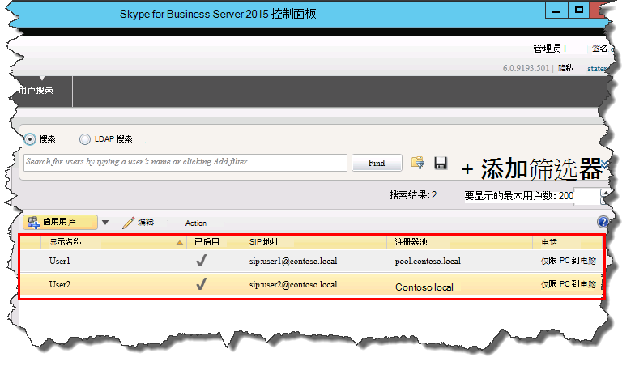

# 验证 Skype for Business 服务器中的拓扑Verify the topology in Skype for Business Server
 
**摘要:** 了解如何验证 Skype for business 服务器拓扑和 Active Directory 服务器是否按预期工作。**Summary:** Learn how to verify the Skype for Business Server topology and Active Directory servers are working as expected. 从[Microsoft 评估中心](https://www.microsoft.com/evalcenter/evaluate-skype-for-business-server)下载 Skype For business 服务器的免费试用版。Download a free trial of Skype for Business Server from the [Microsoft Evaluation center](https://www.microsoft.com/evalcenter/evaluate-skype-for-business-server).
  
在已发布拓扑和拓扑中的每台服务器上安装了 Skype for Business 服务器系统组件后, 即可验证拓扑是否按预期方式工作。After you have the topology published and the Skype for Business Server system components installed on each of the servers in the topology, you are ready to verify that the topology is working as expected. 这包括验证配置是否已传播到所有 Active Directory 服务器, 以便整个域知道 Skype for Business 在域中可用。This includes verifying that the configuration has propagated out to all of the Active Directory servers so that the entire domain knows Skype for Business is available in the domain. 第 1 步至第 5 步可以按任意顺序执行。You can do steps 1 through 5 in any order. 但是，第 6、7、8 步必须在第 1 步至第 5 步之后按图表所示顺序执行。However, you must do steps 6, 7, and 8 in order, and after steps 1 through 5, as outlined in the diagram. 验证拓扑是 8 个步骤中的第 8 步。Verifying the topology is step 8 of 8.
  

  
## 测试前端池部署Test the Front End pool deployment

最后一步是测试前端池并确认 Skype for Business 客户端可以互相通信。The final step is to test the Front End pool and confirm that Skype for Business clients can communicate with each other. 
  
### 添加用户并验证客户端连接Add users and verify client connectivity

1. 使用 Active Directory 计算机和用户将 Skype for business Server 部署 (安装了 Skype for business Server 控制面板) 的管理员角色的 Active Directory 用户对象添加到**CSAdministrator**组。Use Active Directory Computers and Users to add the Active Directory user object of the administrator role for the Skype for Business Server deployment (on which Skype for Business Server Control Panel is installed) to the **CSAdministrator** group.
    
    > [!IMPORTANT]
    > 如果不将相应的用户和组添加到 CsAdministors 组, 则打开 Skype for Business 服务器控制面板时将收到错误, "未经授权: 由于基于角色的访问控制 (RBAC) 授权失败, 访问被拒绝."If you do not add the appropriate users and groups to the CsAdministors group, you will receive an error when you open Skype for Business Server Control Panel which reads, "Unauthorized: Access is denied due to a role-based access control (RBAC) authorization failure." 
  
2. 如果用户对象当前已登录，则注销后重新登录，以注册新的组分配。If the user object is currently logged on, log off and then log on again to register the new group assignment.
    
    > [!NOTE]
    > 用户帐户不能是运行 Skype for Business Server 的任何服务器的本地管理员。The user account cannot be the local administrator of any server running Skype for Business Server. 
  
3. 使用 "管理" 帐户登录到安装了 "Skype for Business 服务器控制面板" 的计算机。Use the administrative account to log on to the computer where Skype for Business Server Control Panel is installed.
    
4. 如果出现提示, 请启动 Skype for business 服务器控制面板, 然后提供凭据。Start Skype for Business Server Control Panel, and then provide credentials, if prompted. Skype for business 服务器 "控制面板" 显示部署信息。Skype for Business Server Control Panel displays deployment information.
    
5. 在左侧导航栏中, 单击 "**拓扑**", 然后确认 "服务状态" 显示计算机带有绿色箭头, 并且复制状态的绿色复选标记位于已部署并联机的每个 Skype For business 服务器角色旁边。In the left navigation bar, click **Topology**, and then confirm that the service status shows a computer with a green arrow and that a green check mark for replication status is next to each Skype for Business Server role that has been deployed and brought online. 
    
6. 在左侧导航栏中，单击**用户**，然后单击**启用用户**。In the left navigation bar, click **Users**, and then click **Enable users**. 
    
7. 在 "**新建 Skype for Business 服务器" 用户**页面上, 单击 "**添加**"。On the **New Skype for Business Server User** page, click **Add**.
    
8. 要为希望查找的对象定义搜索参数，可以在**从 Active Directory 中选择**页上选择**搜索**，然后选择单击**添加筛选器**。还可以选择**LDAP 搜索**，然后输入 LDAP 表达式以筛选或限制将返回的对象。确定“搜索”选项后，单击**查找**。To define search parameters for the objects you want to find, on the **Select from Active Directory** page, you can select **Search**, and then optionally click **Add Filter**. You can also select **LDAP search** and enter an LDAP expression to filter or limit the objects that will be returned. After you have decided on your Search options, click **Find**.
    
9. 在搜索结果窗格中，选择要添加的用户，然后单击 **确定**。In the Search results pane, select the users you want to add, and then click **OK**.
    
10. 在 "**新建 Skype For Business 服务器" 用户**页面上, 所选用户将位于 "**用户**" 显示中。On the **New Skype for Business Server User** page, the users you selected are in the **Users** display. In the **Assign users to a pool** list, select the server where the users should reside.In the **Assign users to a pool** list, select the server where the users should reside.
    
    您可以使用以下列表中的选项来配置对象。The following is a list of options you can use to configure the objects.
    
    - **生成用户的 SIP URI****Generate user's SIP URI**
    
    - **电话****Telephony**
    
    - **线路 URI****Line URI**
    
    - **会议策略****Conferencing policy**
    
    - **客户端版本策略****Client version policy**
    
    - **PIN 策略****PIN policy**
    
    - **外部访问策略****External access policy**
    
    - **存档策略****Archiving policy**
    
    - **位置策略****Location policy**
    
    - **客户端策略****Client policy**
    
    若要测试基本功能, 请为 "**生成用户的 SIP URI** " 设置选择所需的选项 (配置中的其他选项使用默认设置), 然后单击 "**启用**", 如图所示。To test the basic functionality, select the option you prefer for the **Generate user's SIP URI** setting (the other options in the configuration use default settings), and then click **Enable**, as shown in the figure.
    
     
  
11. 此时将显示摘要页面，其中**已启用**列将显示复选标记，指示用户现已完成设置。**SIP 地址**列将显示用户登录配置所需的地址。A summary page is displayed that shows a check mark in the **Enabled** column to indicate that the users are setup. The **SIP address** column displays the address you need for the user sign-in configuration.
    
     
  
12. 使一个用户登录到加入域的计算机，另一个用户登录到域中的另一台计算机。Log one user on to a computer that is joined to the domain and another user on to another computer in the domain.
    
13. 在两台客户端计算机上安装 Skype for Business 客户端, 然后验证这两个用户都可以登录到 Skype for business 服务器, 并且可以互相发送即时消息。Install Skype for Business client on each of the two client computers, and then verify that both users can sign in to Skype for Business Server and can send instant messages to each other.
    

