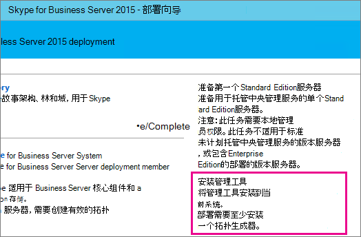
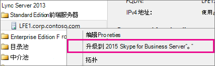
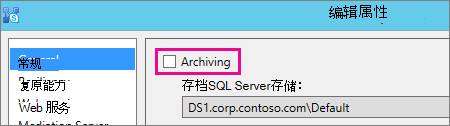
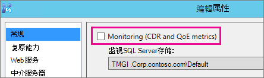
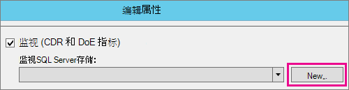
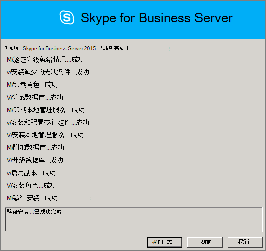
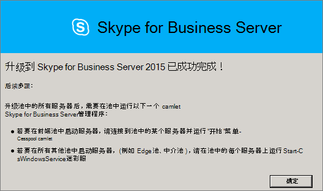
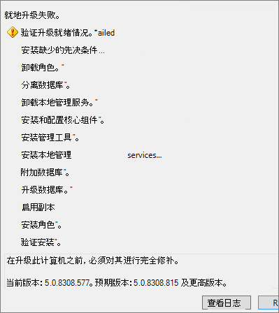

# <a name="upgrade-to-skype-for-business-server-2015"></a><span data-ttu-id="df146-104">升级到 Skype for Business Server 2015</span><span class="sxs-lookup"><span data-stu-id="df146-104">Upgrade to Skype for Business Server 2015</span></span>
 
<span data-ttu-id="df146-105">**摘要：** 了解如何从 Lync Server 2013 升级到 Skype for Business Server 2015。</span><span class="sxs-lookup"><span data-stu-id="df146-105">**Summary:** Learn how to upgrade from Lync Server 2013 to Skype for Business Server 2015.</span></span> <span data-ttu-id="df146-106">从 Microsoft 评估中心下载 Skype for Business Server 2015  [的免费试用版](https://www.microsoft.com/evalcenter/evaluate-skype-for-business-server)。</span><span class="sxs-lookup"><span data-stu-id="df146-106">Download a free trial of Skype for Business Server 2015 from the  [Microsoft Evaluation center](https://www.microsoft.com/evalcenter/evaluate-skype-for-business-server).</span></span>
  
<span data-ttu-id="df146-107">使用本文档中的过程，通过使用 Skype for Business Server 拓扑生成器和新的 In-Place 升级功能，从 Lync Server 2013 升级到 Skype for Business Server 2015。</span><span class="sxs-lookup"><span data-stu-id="df146-107">Use the procedures in this document to upgrade from Lync Server 2013 to Skype for Business Server 2015 by using the Skype for Business Server Topology Builder and the new In-Place Upgrade feature.</span></span> <span data-ttu-id="df146-108">如果要从 Lync Server 2010 或 Office Communications Server 2007 R2 升级，请参阅"规划升级到[Skype for Business Server 2015"。](../plan-your-deployment/upgrade.md)</span><span class="sxs-lookup"><span data-stu-id="df146-108">If you want to upgrade from Lync Server 2010 or Office Communications Server 2007 R2, see [Plan to upgrade to Skype for Business Server 2015](../plan-your-deployment/upgrade.md).</span></span>

> [!NOTE]
> <span data-ttu-id="df146-109">就地升级在 Skype for Business Server 2015 中可用，但在 Skype for Business Server 2019 中不再受支持。</span><span class="sxs-lookup"><span data-stu-id="df146-109">In-place upgrades were available in Skype for Business Server 2015 but are no longer supported in Skype for Business Server 2019.</span></span> <span data-ttu-id="df146-110">支持并行共存，有关详细信息，请参阅迁移到[Skype for Business Server 2019。](../../SfBServer2019/migration/migration-to-skype-for-business-server-2019.md)</span><span class="sxs-lookup"><span data-stu-id="df146-110">Side by side coexistance is supported, see [Migration to Skype for Business Server 2019](../../SfBServer2019/migration/migration-to-skype-for-business-server-2019.md) for more information.</span></span>
  
## <a name="upgrade-from-lync-server-2013"></a><span data-ttu-id="df146-111">从 Lync Server 2013 升级</span><span class="sxs-lookup"><span data-stu-id="df146-111">Upgrade from Lync Server 2013</span></span>

<span data-ttu-id="df146-112">将 Lync Server 2013 升级到 Skype for Business Server 2015 涉及安装必备软件、使用 Skype for Business Server 拓扑生成器升级池中的数据库，以及在每个与池关联的服务器上使用 Skype for Business Server In-Place 升级。</span><span class="sxs-lookup"><span data-stu-id="df146-112">Upgrading Lync Server 2013 to Skype for Business Server 2015 involves installing prerequisite software, using the Skype for Business Server Topology Builder to upgrade databases in the pool, and using the Skype for Business Server In-Place Upgrade on each of the servers associated with the pool.</span></span> <span data-ttu-id="df146-113">若要完成升级，请执行本主题中的八个步骤。</span><span class="sxs-lookup"><span data-stu-id="df146-113">To complete the upgrade, go through the eight steps in this topic.</span></span>
  
### <a name="before-you-begin"></a><span data-ttu-id="df146-114">准备工作</span><span class="sxs-lookup"><span data-stu-id="df146-114">Before you begin</span></span>

- <span data-ttu-id="df146-115">查看 [升级到 Skype for Business Server 2015 的计划](../plan-your-deployment/upgrade.md)。</span><span class="sxs-lookup"><span data-stu-id="df146-115">Review [Plan to upgrade to Skype for Business Server 2015](../plan-your-deployment/upgrade.md).</span></span>
    
- <span data-ttu-id="df146-116">查看 [Skype for Business Server 2015 的服务器要求](../plan-your-deployment/requirements-for-your-environment/server-requirements.md)。</span><span class="sxs-lookup"><span data-stu-id="df146-116">Review [Server requirements for Skype for Business Server 2015](../plan-your-deployment/requirements-for-your-environment/server-requirements.md).</span></span>
    
- <span data-ttu-id="df146-117">[安装 Skype for Business Server 2015 的先决条件](install/install-prerequisites.md) 。</span><span class="sxs-lookup"><span data-stu-id="df146-117">[Install prerequisites for Skype for Business Server 2015](install/install-prerequisites.md) .</span></span>
    
- <span data-ttu-id="df146-118">[安装 Skype for Business Server 2015](install/install.md) 。</span><span class="sxs-lookup"><span data-stu-id="df146-118">[Install Skype for Business Server 2015](install/install.md) .</span></span>
    
### <a name="step-1-install-administrator-tools-and-download-topology"></a><span data-ttu-id="df146-119">步骤 1：安装管理员工具和下载拓扑</span><span class="sxs-lookup"><span data-stu-id="df146-119">Step 1: Install Administrator tools and download topology</span></span>

1. <span data-ttu-id="df146-120">连接到拓扑中未安装 Lync OCSCore 或其他任何 Lync 组件的计算机。</span><span class="sxs-lookup"><span data-stu-id="df146-120">Connect to computer in the topology that does not have Lync OCSCore or any other Lync components installed.</span></span>
    
2. <span data-ttu-id="df146-121">从 Skype for Business Server 2015 安装媒体中，Setup.exe **OCS_Volume\Setup\AMD64 运行**。 </span><span class="sxs-lookup"><span data-stu-id="df146-121">From Skype for Business Server 2015 installation media, run **Setup.exe** from **OCS_Volume\Setup\AMD64**.</span></span> 
    
3. <span data-ttu-id="df146-122">单击“**安装**”。</span><span class="sxs-lookup"><span data-stu-id="df146-122">Click **Install**.</span></span> 
    
4. <span data-ttu-id="df146-123">接受许可协议。</span><span class="sxs-lookup"><span data-stu-id="df146-123">Accept the license agreement.</span></span>
    
5. <span data-ttu-id="df146-124">在部署向导中， **单击"安装管理员工具**"，然后按照安装步骤操作。</span><span class="sxs-lookup"><span data-stu-id="df146-124">On the Deployment Wizard, click **Install Administrator tools**, and follow the steps to install.</span></span>
    
     
  
6. <span data-ttu-id="df146-126">在 Windows"开始"屏幕中，打开 Skype for Business Server 拓扑生成器。</span><span class="sxs-lookup"><span data-stu-id="df146-126">From the Windows Start screen, open Skype for Business Server Topology Builder.</span></span>
    
7. <span data-ttu-id="df146-127">单击 **"从现有部署下载拓扑"，** 然后单击"下 **一步"。**</span><span class="sxs-lookup"><span data-stu-id="df146-127">Click **Download topology from existing deployment**, and click **Next**.</span></span>
    
8. <span data-ttu-id="df146-128">输入拓扑的名称，然后单击"保存 **"。**</span><span class="sxs-lookup"><span data-stu-id="df146-128">Enter a name for the topology, and click **Save**.</span></span>
    
9. <span data-ttu-id="df146-129">转到保存拓扑的位置，并复制拓扑。</span><span class="sxs-lookup"><span data-stu-id="df146-129">Go to location where you saved the topology, and make a copy of the topology.</span></span>
    
### <a name="step-2-upgrade-and-publish-topology-using-topology-builder"></a><span data-ttu-id="df146-130">步骤 2：使用拓扑生成器升级和发布拓扑</span><span class="sxs-lookup"><span data-stu-id="df146-130">Step 2: Upgrade and publish topology using Topology Builder</span></span>

<span data-ttu-id="df146-131">在开始升级过程之前，必须为计划升级的池运行所有服务。</span><span class="sxs-lookup"><span data-stu-id="df146-131">Before you start the upgrade process, all services must be running for the pools you plan to upgrade.</span></span> <span data-ttu-id="df146-132">因此，拓扑更改将复制到池中服务器的本地数据库。</span><span class="sxs-lookup"><span data-stu-id="df146-132">This is so the topology changes will be replicated to the local database of the servers in the pool.</span></span>
  
> [!IMPORTANT]
>  <span data-ttu-id="df146-133">在升级之前保存拓扑文件的副本。</span><span class="sxs-lookup"><span data-stu-id="df146-133">Save a copy of your topology file before you upgrade.</span></span> <span data-ttu-id="df146-134">升级后，将无法降级拓扑。> 如果服务与数据库位于同一台服务器上，如持久聊天服务与持久聊天数据库位于同一台服务器上，请跳过此步骤，然后转到步骤 4。</span><span class="sxs-lookup"><span data-stu-id="df146-134">After you upgrade, you will not be able to downgrade the topology.>  If your services are on the same servers as your databases, like the Persistent Chat service is on the same server as the Persistent Chat database, skip this step, and go to step 4.</span></span> <span data-ttu-id="df146-135">停止服务后，在每个In-Place运行升级安装程序以升级本地数据库。</span><span class="sxs-lookup"><span data-stu-id="df146-135">After you stop the services, run the In-Place Upgrade setup on each server to upgrade the local databases.</span></span>
  
> [!NOTE]
> <span data-ttu-id="df146-136">如果拓扑具有镜像的后端数据库，则当您使用拓扑生成器发布拓扑时，将会同时显示主体数据库和镜像数据库。 </span><span class="sxs-lookup"><span data-stu-id="df146-136">If the topology has a back-end database that is mirrored then you will see both the Principal and the Mirrored databases show up **when you publish the topology** using Topology Builder.</span></span> <span data-ttu-id="df146-137">请确保所有数据库都运行在主体上，并且仅在发布拓扑时选择主体，而不是镜像，否则在发布拓扑后将看到一条警告。</span><span class="sxs-lookup"><span data-stu-id="df146-137">Make sure all of the databases are running on the Principal and only select the Principal, not the mirror, when publishing the topology otherwise you will see a warning after publishing the topology.</span></span>
  
<span data-ttu-id="df146-138">选择以下选项之一，使用 Skype for Business Server 2015 拓扑生成器升级并发布新拓扑。</span><span class="sxs-lookup"><span data-stu-id="df146-138">Pick one of the options below to upgrade and publish a new topology by using the Skype for Business Server 2015 Topology Builder.</span></span> <span data-ttu-id="df146-139">完成这些步骤并发布更新的拓扑后，请移至本主题中的步骤 3。</span><span class="sxs-lookup"><span data-stu-id="df146-139">After you complete the steps and publish the updated topology, move to Step 3 in this topic.</span></span>
  
#### <a name="option-1-upgrade-an-isolated-front-end-pool-and-associated-archiving-and-monitoring-stores"></a><span data-ttu-id="df146-140">选项 1：升级独立的前端池和关联的存档和监控存储</span><span class="sxs-lookup"><span data-stu-id="df146-140">Option 1: Upgrade an isolated Front End pool and associated Archiving and Monitoring stores</span></span>

<span data-ttu-id="df146-141">如果要升级的池具有存档和监控存储依赖项，则当您使用以下步骤时，还将升级存档和监控存储。</span><span class="sxs-lookup"><span data-stu-id="df146-141">If the pool you're upgrading has an Archiving and Monitoring store dependency, when you use the following steps, the Archiving and Monitoring store will be upgraded as well.</span></span>
  
1. <span data-ttu-id="df146-142">在拓扑生成器中，右键单击 Lync Server 2013 池，选择"升级到 **Skype for Business Server 2015"，** 然后按照步骤操作。</span><span class="sxs-lookup"><span data-stu-id="df146-142">In Topology Builder, right-click a Lync Server 2013 pool, select **Upgrade to Skype for Business Server 2015**, and follow the steps.</span></span> 
    
     
  
2. <span data-ttu-id="df146-144">在拓扑生成器中，单击 **"操作**  >  **发布拓扑**"或"**操作**  >  **拓扑**  >  **发布"。**</span><span class="sxs-lookup"><span data-stu-id="df146-144">In Topology Builder, click **Action** > **Publish topology** or **Action** > **Topology** > **Publish**.</span></span> 
    
     
  
3. <span data-ttu-id="df146-146">在发布过程中，选择在存档和监控存储中安装数据库。</span><span class="sxs-lookup"><span data-stu-id="df146-146">During publishing, choose to install a database on the Archiving and Monitoring store.</span></span>
    
#### <a name="option-2-upgrade-front-end-pool-without-upgrading-archiving-and-monitoring-stores"></a><span data-ttu-id="df146-147">选项 2：在不升级存档和监控存储的情况下升级前端池</span><span class="sxs-lookup"><span data-stu-id="df146-147">Option 2: Upgrade Front End pool without upgrading Archiving and Monitoring stores</span></span>

<span data-ttu-id="df146-148">如果使用以下步骤，将禁用所选池的存档和监控。</span><span class="sxs-lookup"><span data-stu-id="df146-148">If you use the following steps, archiving and monitoring for the selected pool are disabled.</span></span> <span data-ttu-id="df146-149">升级后，池将没有存档和监控存储。</span><span class="sxs-lookup"><span data-stu-id="df146-149">The pool will not have Archiving and Monitoring stores after the upgrade.</span></span>
  
1. <span data-ttu-id="df146-150">在拓扑生成器中，选择要升级的 Lync Server 2013 池。</span><span class="sxs-lookup"><span data-stu-id="df146-150">In Topology Builder, select the Lync Server 2013 pool that you want to upgrade.</span></span>
    
2. <span data-ttu-id="df146-151">删除对 Lync Server 2013 存档和监控存储的依赖关系。</span><span class="sxs-lookup"><span data-stu-id="df146-151">Remove the dependency to the Lync Server 2013 Archiving and Monitoring stores.</span></span> 
    
   - <span data-ttu-id="df146-152">转到 **"操作**  >  **编辑"属性**。</span><span class="sxs-lookup"><span data-stu-id="df146-152">Go to **Action** > **Edit properties**.</span></span>
    
   - <span data-ttu-id="df146-153">清除 **"存档"** 复选框。</span><span class="sxs-lookup"><span data-stu-id="df146-153">Clear the **Archiving** check box.</span></span>
    
     
  
   - <span data-ttu-id="df146-155">清除 **"监控"** 复选框。</span><span class="sxs-lookup"><span data-stu-id="df146-155">Clear the **Monitoring** check box.</span></span>
    
     
  
3. <span data-ttu-id="df146-157">右键单击 Lync Server 2013 池，选择"升级到 **Skype for Business Server 2015"，** 然后按照步骤操作。</span><span class="sxs-lookup"><span data-stu-id="df146-157">Right-click the Lync Server 2013 pool, select **Upgrade to Skype for Business Server 2015**, and follow the steps.</span></span> 
    
     
  
4. <span data-ttu-id="df146-159">在拓扑生成器中，单击 **"操作**  >  **发布拓扑**"或"**操作**  >  **拓扑**  >  **发布"。**</span><span class="sxs-lookup"><span data-stu-id="df146-159">In Topology Builder, click **Action** > **Publish topology** or **Action** > **Topology** > **Publish**.</span></span> 
    
#### <a name="option-3-upgrade-front-end-pool-and-associated-it-to-new-skype-for-business-server-2015-archiving-and-monitoring-stores"></a><span data-ttu-id="df146-160">选项 3：升级前端池，并关联到新的 Skype for Business Server 2015 存档和监控存储</span><span class="sxs-lookup"><span data-stu-id="df146-160">Option 3: Upgrade Front End pool and associated it to new Skype for Business Server 2015 Archiving and Monitoring stores</span></span>

<span data-ttu-id="df146-161">如果使用以下步骤，存档和监控将在上一个存储中停止，并开始在已创建的新存储中启动。</span><span class="sxs-lookup"><span data-stu-id="df146-161">If you use the following steps, archiving and monitoring will stop in the previous store and start in the new store you've created.</span></span> 
  
1. <span data-ttu-id="df146-162">在拓扑生成器中，选择要升级的 Lync Server 2013 池。</span><span class="sxs-lookup"><span data-stu-id="df146-162">In Topology Builder, select the Lync Server 2013 pool that you want to upgrade.</span></span> 
    
2. <span data-ttu-id="df146-163">删除对 Lync Server 2013 存档和监控存储的依赖关系。</span><span class="sxs-lookup"><span data-stu-id="df146-163">Remove the dependency to the Lync Server 2013 Archiving and Monitoring stores.</span></span> 
    
   - <span data-ttu-id="df146-164">转到 **"操作**  >  **编辑"属性**。</span><span class="sxs-lookup"><span data-stu-id="df146-164">Go to **Action** > **Edit properties**.</span></span>
    
   - <span data-ttu-id="df146-165">清除 **"存档"** 复选框。</span><span class="sxs-lookup"><span data-stu-id="df146-165">Clear the **Archiving** check box.</span></span>
    
     
  
   - <span data-ttu-id="df146-167">清除 **"监控"** 复选框。</span><span class="sxs-lookup"><span data-stu-id="df146-167">Clear the **Monitoring** check box.</span></span>
    
     
  
3. <span data-ttu-id="df146-169">右键单击 Lync Server 2013 池，选择"升级到 **Skype for Business Server 2015"，** 然后按照步骤操作。</span><span class="sxs-lookup"><span data-stu-id="df146-169">Right-click the Lync Server 2013 pool, select **Upgrade to Skype for Business Server 2015**, and follow the steps.</span></span> 
    
     
  
4. <span data-ttu-id="df146-171">创建新的存档SQL存档存储。</span><span class="sxs-lookup"><span data-stu-id="df146-171">Create a new SQL store for Archiving.</span></span> 
    
   - <span data-ttu-id="df146-172">选择池和 **操作**  >  **编辑属性**。</span><span class="sxs-lookup"><span data-stu-id="df146-172">Select the pool and **Action** > **Edit properties**.</span></span> 
    
   -  <span data-ttu-id="df146-173">选中“存档”复选框。</span><span class="sxs-lookup"><span data-stu-id="df146-173">Select the **Archiving** check box.</span></span>
    
   - <span data-ttu-id="df146-174">单击"新建"。</span><span class="sxs-lookup"><span data-stu-id="df146-174">Click **New**.</span></span>
    
     
  
5. <span data-ttu-id="df146-176">创建新的监控SQL存储。</span><span class="sxs-lookup"><span data-stu-id="df146-176">Create a new SQL store for Monitoring.</span></span> 
    
   - <span data-ttu-id="df146-177">选择池和 **操作**  >  **编辑属性**。</span><span class="sxs-lookup"><span data-stu-id="df146-177">Select the pool and **Action** > **Edit properties**.</span></span> 
    
   -  <span data-ttu-id="df146-178">选中 **"监控"** 复选框。</span><span class="sxs-lookup"><span data-stu-id="df146-178">Select the **Monitoring** check box.</span></span>
    
   - <span data-ttu-id="df146-179">单击"新建"。</span><span class="sxs-lookup"><span data-stu-id="df146-179">Click **New**.</span></span>
    
     
  
6. <span data-ttu-id="df146-181">在拓扑生成器中，单击 **"操作**  >  **发布拓扑**"或"**操作**  >  **拓扑**  >  **发布"。**</span><span class="sxs-lookup"><span data-stu-id="df146-181">In Topology Builder, click **Action** > **Publish topology** or **Action** > **Topology** > **Publish**.</span></span> 
    
7. <span data-ttu-id="df146-182">在发布过程中，选择在新的存档和监控存储中安装数据库。</span><span class="sxs-lookup"><span data-stu-id="df146-182">During publishing, choose to install the database on the new Archiving and Monitoring store.</span></span>
    
### <a name="step-3-wait-for-replication"></a><span data-ttu-id="df146-183">步骤 3：等待复制</span><span class="sxs-lookup"><span data-stu-id="df146-183">Step 3: Wait for replication</span></span>

<span data-ttu-id="df146-184">为复制提供一些时间，以将更新的拓扑发布到环境中的所有服务器。</span><span class="sxs-lookup"><span data-stu-id="df146-184">Give replication some time to publish the updated topology to all the servers in the environment.</span></span>
  
### <a name="step-4-stop-all-services-in-pool-to-be-upgraded"></a><span data-ttu-id="df146-185">步骤 4：停止池中要升级的所有服务</span><span class="sxs-lookup"><span data-stu-id="df146-185">Step 4: Stop all services in pool to be upgraded</span></span>

<span data-ttu-id="df146-186">在维护要升级的池的每个服务器上，在 PowerShell 中运行以下 cmdlet：</span><span class="sxs-lookup"><span data-stu-id="df146-186">On each server that is servicing the pool that you're going to upgrade, run the following cmdlet in PowerShell:</span></span>
  
```powershell
Disable-CsComputer -Scorch
```

<span data-ttu-id="df146-187">我们建议使用Disable-CsComputer，因为您可能需要在升级过程中重新启动In-Place服务器。</span><span class="sxs-lookup"><span data-stu-id="df146-187">We recommend using Disable-CsComputer because you may need to reboot the server during the In-Place Upgrade process.</span></span> <span data-ttu-id="df146-188">如果使用 Stop-CsWindowsService，则某些服务可能在重启后自动重新启动。</span><span class="sxs-lookup"><span data-stu-id="df146-188">If you use Stop-CsWindowsService, some services may restart automatically after a reboot.</span></span> <span data-ttu-id="df146-189">这可能会导致升级In-Place失败。</span><span class="sxs-lookup"><span data-stu-id="df146-189">This may cause the In-Place Upgrade to fail.</span></span>
  
### <a name="step-5-upgrade-front-end-pools-and-non-front-end-pool-servers"></a><span data-ttu-id="df146-190">步骤 5：升级前端池和非前端池服务器</span><span class="sxs-lookup"><span data-stu-id="df146-190">Step 5: Upgrade Front End pools and non-Front End pool servers</span></span>

> [!NOTE]
>  <span data-ttu-id="df146-191">在升级之前，请安装 Skype for Business Server 2015 所需的所有新必备组件，其中包括：>尝试升级之前至少 32GB 的可用空间。</span><span class="sxs-lookup"><span data-stu-id="df146-191">Before upgrading please install all new prerequisites required for Skype for Business Server 2015 which include:>  At least 32GB of free space before attempting an upgrade.</span></span> <span data-ttu-id="df146-192">此外，请确保驱动器是固定的本地驱动器，未通过 USB 或 Firewire 连接， 使用 NTFS 文件系统格式化，不压缩，并且不包含页面文件。> PowerShell 版本 6.2.9200.0 或更高版本。>安装了最新的 Lync Server 2013 累积更新。> SQL Server 2012 SP1 已安装。>如果使用 Microsoft Update，则会自动安装以下 KB 的 () ：> Windows Server 2008 R2 -[KB2533623](https://support.microsoft.com/kb/2533623)> Windows Server 2012 -[KB2858668](https://support.microsoft.com/kb/2858668)> Windows Server 2012 R2 -[KB2982006](https://support.microsoft.com/kb/2982006)</span><span class="sxs-lookup"><span data-stu-id="df146-192">In addition, make sure that the drive is a fixed local drive, is not connected by USB or Firewire, is formatted with NTFS file system, is not compressed, and does not contain a page file.>  PowerShell version 6.2.9200.0 or later.>  The latest Lync Server 2013 Cumulative Update installed.>  SQL Server 2012 SP1 installed.>  The following KB's installed (installed automatically if using Microsoft Update):>  Windows Server 2008 R2 -[KB2533623](https://support.microsoft.com/kb/2533623)>  Windows Server 2012 -[KB2858668](https://support.microsoft.com/kb/2858668)>  Windows Server 2012 R2 -[KB2982006](https://support.microsoft.com/kb/2982006)</span></span>
  
<span data-ttu-id="df146-193">使用In-Place升级来更新前端池、边缘池、中介服务器和持久聊天池。</span><span class="sxs-lookup"><span data-stu-id="df146-193">Use the In-Place Upgrade on each server to update the Front End pool, Edge pool, Mediation server, and the Persistent Chat pool.</span></span>
  
1. <span data-ttu-id="df146-194">在每台服务器上 **，Setup.exe** Skype for Business Server 2015 安装 **OCS_Volume\Setup\amd64** 运行安装程序。</span><span class="sxs-lookup"><span data-stu-id="df146-194">On each server, run **Setup.exe** from **OCS_Volume\Setup\amd64** on the Skype for Business Server 2015 installation media.</span></span>
    
2. <span data-ttu-id="df146-195">接受许可协议并按照提示执行 In-Place 升级。</span><span class="sxs-lookup"><span data-stu-id="df146-195">Accept the license agreement and follow the prompts for the In-Place Upgrade.</span></span>
    
3. <span data-ttu-id="df146-196">对前端池中的每台服务器和非前端池服务器重复这些步骤。</span><span class="sxs-lookup"><span data-stu-id="df146-196">Repeat these steps for each server in the Front End pool and on each non-Front End pool server.</span></span>
    
> [!NOTE]
> <span data-ttu-id="df146-197">在升级过程中，系统可能会提示In-Place服务器。</span><span class="sxs-lookup"><span data-stu-id="df146-197">You might be prompted to reboot the server during the In-Place Upgrade.</span></span> <span data-ttu-id="df146-198">没关系。</span><span class="sxs-lookup"><span data-stu-id="df146-198">That's ok.</span></span> <span data-ttu-id="df146-199">重新启动后，In-Place升级将继续从它离开的地方开始。</span><span class="sxs-lookup"><span data-stu-id="df146-199">After you reboot, the In-Place Upgrade will continue from where it left off.</span></span> 
  
<span data-ttu-id="df146-200">成功完成In-Place升级后，将看到以下消息。</span><span class="sxs-lookup"><span data-stu-id="df146-200">When the In-Place Upgrade completes successfully, you see the following message.</span></span>
  

  
### <a name="step-6-restart-services-on-all-upgraded-servers"></a><span data-ttu-id="df146-202">步骤 6：在所有升级的服务器上重新启动服务</span><span class="sxs-lookup"><span data-stu-id="df146-202">Step 6: Restart services on all upgraded servers</span></span>

> [!NOTE]
> <span data-ttu-id="df146-203">重新启动服务之前，请确保 %ProgramData%\WindowsFabric 在所有前端服务器上不存在。</span><span class="sxs-lookup"><span data-stu-id="df146-203">Before restarting the services, please make sure %ProgramData%\WindowsFabric doesn't exist on all Front End Servers.</span></span> <span data-ttu-id="df146-204">如果存在，在启动服务之前将其删除。</span><span class="sxs-lookup"><span data-stu-id="df146-204">If it exists, delete it before starting the services.</span></span> 
  
- <span data-ttu-id="df146-205">升级前端池中的所有服务器后，使用下面的 PowerShell 命令重新启动服务：</span><span class="sxs-lookup"><span data-stu-id="df146-205">After you've upgraded all servers in the Front End pool, restart the services by using the following PowerShell command:</span></span> 
    
  ```powershell
  Start-CsPool
  ```

    > [!NOTE]
    > <span data-ttu-id="df146-206">如果在开始运行 In-Place 升级之前已经需要挂起的系统重新启动，In-Place升级不会要求您在安装结束时重新启动。</span><span class="sxs-lookup"><span data-stu-id="df146-206">If there is already a pending system reboot needed before you start running In-Place Upgrade, then In-Place Upgrade won't ask you to reboot at the end of the installation.</span></span> <span data-ttu-id="df146-207">当您尝试使用 Start-CSPool cmdlet 启动服务时，将导致针对第一台前端服务器引发一些程序集异常。</span><span class="sxs-lookup"><span data-stu-id="df146-207">This will cause some assembly exceptions to be thrown against the first Front End server when you try to start services using the Start-CSPool cmdlet.</span></span> <span data-ttu-id="df146-208">若要解决这些错误，请重新启动池中的所有服务器，然后再次运行 cmdlet。</span><span class="sxs-lookup"><span data-stu-id="df146-208">To resolve these errors, reboot all of the servers in the pool and run the cmdlet again.</span></span> 
  
- <span data-ttu-id="df146-209">在非前端池服务器上，通过以下命令重新启动服务：</span><span class="sxs-lookup"><span data-stu-id="df146-209">On the non-Front End pool servers, restart the services by using the following command:</span></span>
    
  ```powershell
  Start-CsWindowsService
  ```

<span data-ttu-id="df146-210">单击 **"升级** In-Place"页上的"确定"后，你将看到以下完成此步骤的提醒。</span><span class="sxs-lookup"><span data-stu-id="df146-210">After you click **OK** on the In-Place Upgrade page, you'll see the following reminder to complete this step.</span></span>
  

  
### <a name="step-7-verify-skype-for-business-functionality-works"></a><span data-ttu-id="df146-212">步骤 7：验证 Skype for Business 功能是否正常工作</span><span class="sxs-lookup"><span data-stu-id="df146-212">Step 7: Verify Skype for Business functionality works</span></span>

<span data-ttu-id="df146-213">若要确保升级成功，请对已升级的池测试 Skype for Business 以确保功能正常工作。</span><span class="sxs-lookup"><span data-stu-id="df146-213">To make sure the upgrade was successful, for the pool that was upgraded, test Skype for Business to make sure the functionality is working as expected.</span></span> 
  
### <a name="step-8-upgrade-secondary-pools"></a><span data-ttu-id="df146-214">步骤 8：升级辅助池</span><span class="sxs-lookup"><span data-stu-id="df146-214">Step 8: Upgrade secondary pools</span></span>

<span data-ttu-id="df146-215">重复本主题中的步骤，升级环境中具有的其他任何池。</span><span class="sxs-lookup"><span data-stu-id="df146-215">Repeat the steps in this topic to upgrade any additional pools that you have in your environment.</span></span>
  
## <a name="troubleshoot-issues-with-the-in-place-upgrade"></a><span data-ttu-id="df146-216">解决升级In-Place问题</span><span class="sxs-lookup"><span data-stu-id="df146-216">Troubleshoot issues with the In-Place Upgrade</span></span>

<span data-ttu-id="df146-217">如果In-Place升级失败，您可能会看到一条类似于下图中内容的消息。</span><span class="sxs-lookup"><span data-stu-id="df146-217">If the In-Place Upgrade fails, you might see a message similar to what's in the following image.</span></span> 
  

  
<span data-ttu-id="df146-219">查看页面底部的完整消息，以帮助你解决问题。</span><span class="sxs-lookup"><span data-stu-id="df146-219">Review the full message at the bottom of the page to help you troubleshoot the issue.</span></span> <span data-ttu-id="df146-220">单击 **"查看日志** "可获取更多详细信息。</span><span class="sxs-lookup"><span data-stu-id="df146-220">Click **View logs** to get more detail.</span></span>
  
<span data-ttu-id="df146-221">如果 In-Place 升级在验证升级准备情况或 **安装** 缺少的先决条件时失败，请确保服务器应用了所有最新的 Windows Server、Lync Server 和 SQL Server 更新，并且已安装所有必需的软件和角色。</span><span class="sxs-lookup"><span data-stu-id="df146-221">If the In-Place Upgrade fails on **Verifying upgrade readiness** or **Installing missing prerequisites**, make sure the server has all the latest Windows Server, Lync Server, and SQL Server updates applied, and all the required software and roles are installed.</span></span> <span data-ttu-id="df146-222">有关所需内容的列表，请参阅 [Skype for Business Server 2015](../plan-your-deployment/requirements-for-your-environment/server-requirements.md) 的服务器要求和 Skype for Business Server [2015 的安装必备组件](install/install-prerequisites.md)。</span><span class="sxs-lookup"><span data-stu-id="df146-222">For a list of what's required, see [Server requirements for Skype for Business Server 2015](../plan-your-deployment/requirements-for-your-environment/server-requirements.md) and [Install prerequisites for Skype for Business Server 2015](install/install-prerequisites.md).</span></span>
  
## <a name="see-also"></a><span data-ttu-id="df146-223">另请参阅</span><span class="sxs-lookup"><span data-stu-id="df146-223">See also</span></span>

[<span data-ttu-id="df146-224">计划升级到 Skype for Business Server 2015</span><span class="sxs-lookup"><span data-stu-id="df146-224">Plan to upgrade to Skype for Business Server 2015</span></span>](../plan-your-deployment/upgrade.md)
  
[<span data-ttu-id="df146-225">Skype for Business Server 2015 的服务器要求</span><span class="sxs-lookup"><span data-stu-id="df146-225">Server requirements for Skype for Business Server 2015</span></span>](../plan-your-deployment/requirements-for-your-environment/server-requirements.md)
  
[<span data-ttu-id="df146-226">安装 Skype for Business Server 2015 的先决条件</span><span class="sxs-lookup"><span data-stu-id="df146-226">Install prerequisites for Skype for Business Server 2015</span></span>](install/install-prerequisites.md)
  
[<span data-ttu-id="df146-227">安装 Skype for Business Server 2015</span><span class="sxs-lookup"><span data-stu-id="df146-227">Install Skype for Business Server 2015</span></span>](install/install.md)
