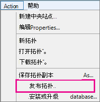

# <a name="upgrade-to-skype-for-business-server-2015"></a>Upgrade to Skype for Business Server 2015
 
**摘要：** 了解如何从 Lync Server 2013 升级到 Skype for business Server 2015。 从[Microsoft 评估中心](https://www.microsoft.com/evalcenter/evaluate-skype-for-business-server)下载 Skype For business Server 2015 的免费试用版。
  
使用 "Skype for business 服务器拓扑生成器" 和 "新的就地升级" 功能，使用本文档中的过程从 Lync Server 2013 升级到 Skype for business Server 2015。 如果要从 Lync Server 2010 或 Office 通信服务器 2007 R2 升级，请参阅[计划升级到 Skype For Business 服务器 2015](../plan-your-deployment/upgrade.md)。

> [!NOTE]
> Skype for business Server 2015 中提供了就地升级，但 Skype for business Server 2019 不再支持就地升级。 支持 "并排 coexistance"，有关详细信息，请参阅[迁移到 Skype for Business Server 2019](../../SfBServer2019/migration/migration-to-skype-for-business-server-2019.md) 。
  
## <a name="upgrade-from-lync-server-2013"></a>从 Lync Server 2013 升级

将 Lync Server 2013 升级到 Skype for business Server 2015 需要安装必备软件，使用 Skype for Business Server 拓扑生成器升级池中的数据库，并使用每个设备上的 Skype for Business 服务器就地升级与池相关联的服务器。 要完成升级，请执行此主题中的八个步骤。
  
### <a name="before-you-begin"></a>开始之前

- 查看 [Plan to upgrade to Skype for Business Server 2015](../plan-your-deployment/upgrade.md)。
    
- 查看[Skype for Business server 2015 的服务器要求](../plan-your-deployment/requirements-for-your-environment/server-requirements.md)。
    
- [安装 Skype for Business Server 2015 的先决条件](install/install-prerequisites.md)。
    
- [安装 Skype For Business Server 2015](install/install.md) 。
    
### <a name="step-1-install-administrator-tools-and-download-topology"></a>第 1 步：安装管理员工具并下载拓扑

1. 在未安装 Lync OCSCore 或任何其他 Lync 组件的拓扑中连接到计算机。
    
2. 从 Skype for Business Server 2015 安装媒体中，从**OCS_Volume \setup\amd64**运行**setup.exe** 。 
    
3. 单击“**安装**”。 
    
4. 接受许可协议。
    
5. 在部署向导中，单击“**安装管理员工具**”，按照步骤进行安装。
    
     
  
6. 从 Windows "开始" 屏幕中，打开 "Skype for Business 服务器拓扑生成器"。
    
7. 单击“**从现有部署下载拓扑**”，然后单击“**下一步**”。
    
8. 输入拓扑名称，然后单击“**保存**”。
    
9. 转到保存拓扑的位置，创建一个拓扑副本。
    
### <a name="step-2-upgrade-and-publish-topology-using-topology-builder"></a>第 2 步：使用拓扑生成器升级和发布拓扑

开始升级过程之前，必须为计划升级的池运行所有服务。 这是为了保证拓扑更改复制到池中服务器的本地数据库。
  
> [!IMPORTANT]
>  在升级之前保存拓扑文件副本。 升级后，你将无法降级拓扑。 > 如果你的服务与你的数据库在同一台服务器上，如永久聊天服务与持久聊天数据库位于同一台服务器上，请跳过此步骤，然后转到步骤4。 停止服务后，请在每台服务器上运行就地升级安装以升级本地数据库。
  
> [!NOTE]
> 如果拓扑有镜像的后端数据库，那么在使用拓扑生成器**发布拓扑时**，您会看到主数据库和镜像数据库同时出现。发布拓扑时，请确保所有数据库都在主数据库上运行，同时只选择主数据库，而不是镜像数据库，否则，在发布拓扑后，您会看到警告。
  
选择以下选项之一，使用 Skype for Business Server 2015 拓扑生成器升级和发布新拓扑。 在完成这些步骤并发布更新后的拓扑之后，转到本主题中的第 3 步。
  
#### <a name="option-1-upgrade-an-isolated-front-end-pool-and-associated-archiving-and-monitoring-stores"></a>选项 1：升级隔离的前端池和关联的存档与监控存储

如果您升级的池依赖于存档和监控存储，则在使用以下步骤时，存档和监控存储也会随之升级。
  
1. 在拓扑生成器中，右键单击 Lync Server 2013 池，选择 "**升级到 Skype For Business Server 2015**"，然后按照步骤操作。 
    
     
  
2. 在拓扑生成器中，单击 "**操作** > **发布拓扑**" 或 "**操作** > **拓扑** > **发布**"。 
    
     
  
3. 在发布期间，选择在存档和监控存储上安装数据库。
    
#### <a name="option-2-upgrade-front-end-pool-without-upgrading-archiving-and-monitoring-stores"></a>选项2：升级前端池而不升级存档和监视存储

如果您使用以下 步骤，选定池的存档和监控将被禁用。在升级之后，该池将不会有存档和监控存储。
  
1. 在拓扑生成器中，选择要升级的 Lync Server 2013 池。
    
2. 删除 Lync Server 2013 存档和监视存储的相关性。 
    
   - 转到**操作** > **编辑属性**。
    
   - 清除“**存档**”复选框。
    
     
  
   - 清除“**监控**”复选框。
    
     
  
3. 右键单击 Lync Server 2013 池，选择 "**升级到 Skype for Business Server 2015**"，然后按照步骤操作。 
    
     
  
4. 在拓扑生成器中，单击 "**操作** > **发布拓扑**" 或 "**操作** > **拓扑** > **发布**"。 
    
#### <a name="option-3-upgrade-front-end-pool-and-associated-it-to-new-skype-for-business-server-2015-archiving-and-monitoring-stores"></a>选项3：升级前端池并将其关联到新的 Skype for Business Server 2015 存档和监视存储

如果使用以下步骤，存档和监控将在先前的存储中停止，并在您创建的新存储中启动。 
  
1. 在拓扑生成器中，选择要升级的 Lync Server 2013 池。 
    
2. 删除 Lync Server 2013 存档和监视存储的相关性。 
    
   - 转到**操作** > **编辑属性**。
    
   - 清除“**存档**”复选框。
    
     
  
   - 清除“**监控**”复选框。
    
     
  
3. 右键单击 Lync Server 2013 池，选择 "**升级到 Skype for Business Server 2015**"，然后按照步骤操作。 
    
     
  
4. 为存档创建新的 SQL 存储。 
    
   - 选择 "池" 和 "**操作** > **编辑" 属性**。 
    
   -  选中“**存档**”复选框。
    
   - 单击“新建”****。
    
     
  
5. 为监控创建新的 SQL 存储。 
    
   - 选择 "池" 和 "**操作** > **编辑" 属性**。 
    
   -  选中“**监控**”复选框。
    
   - 单击“**新建**”。
    
     
  
6. 在拓扑生成器中，单击 "**操作** > **发布拓扑**" 或 "**操作** > **拓扑** > **发布**"。 
    
7. 在发布期间，选择在新的存档和监控存储上安装数据库。
    
### <a name="step-3-wait-for-replication"></a>第 3 步：等待复制

留些时间耐心等候复制，以便将更新后的拓扑发布到环境中的所有服务器。
  
### <a name="step-4-stop-all-services-in-pool-to-be-upgraded"></a>第 4 步：停用池中所有需要升级的服务

在服务要升级的池的每台服务器上，在 PowerShell 中运行以下 cmdlet：
  
```powershell
Disable-CsComputer -Scorch
```

我们建议使用 Disable-CsComputer，因为在就地升级过程中可能需要重新启动服务器。 如果您使用 Stop-CsWindowsService，一些服务可能会在重启后自动重新启动。 这可能导致就地升级失败。
  
### <a name="step-5-upgrade-front-end-pools-and-non-front-end-pool-servers"></a>第 5 步：升级前端池和非前端池服务器

> [!NOTE]
>  升级之前，请安装 Skype for Business Server 2015 所需的所有新的先决条件，其中包括：在尝试升级之前 > 至少32GB 可用空间。 此外，请确保该驱动器是固定的本地驱动器，未通过 USB 或 Firewire 连接。使用 NTFS 文件系统进行格式设置，但未压缩，并且不包含页面文件。 > PowerShell 版本6.2.9200.0 或更高版本。 > 安装了最新的 Lync Server 2013 累积更新。 > 安装的 KB2533623 SQL SERVER 2012 SP1。安装了以下 KB （如果使用 > Microsoft Update，则自动安装）： > windows server 2008 r2-[>](https://support.microsoft.com/kb/2533623) windows server 2012 r2-KB2858668[>](https://support.microsoft.com/kb/2858668) 2012[KB2982006](https://support.microsoft.com/kb/2982006)
  
在每台服务器上使用就地升级来更新前端池、边缘池、中介服务器和持久聊天池。
  
1. 在每台服务器上，从 Skype for Business Server 2015 安装媒体上的**OCS_Volume \setup\amd64**运行**setup.exe** 。
    
2. 接受许可协议并按照提示进行就地升级。
    
3. 对于前端池和每个非前端池服务器上的每个服务器，重复这些步骤。
    
> [!NOTE]
> 系统可能会在就地升级期间提示您重启服务器。 这很正常。 重启后，就地升级将从中断的位置继续。 
  
成功完成就地升级时，您将看到以下消息。
  

  
### <a name="step-6-restart-services-on-all-upgraded-servers"></a>第 6 步：在所有升级后的服务器上重启服务

> [!NOTE]
> 在重新启动服务之前，请确保%ProgramData%\WindowsFabric 在所有前端服务器上不存在。 如果存在，请在启动服务之前将其删除。 
  
- 升级前端池中的所有服务器后，请使用以下 PowerShell 命令重新启动服务： 
    
  ```powershell
  Start-CsPool
  ```

    > [!NOTE]
    > 如果在开始运行就地升级之前已存在需要处理的系统重启，则就地升级不会在安装结束时要求您重新启动。在您尝试使用 Start-CSPool cmdlet 启动服务时，这会导致第一台前端服务器出现一些程序集异常。要解决这些错误，请重新启动池中的所有服务器并再次运行该 cmdlet。 
  
- 在非前端池服务器上，使用以下命令重启服务：
    
  ```powershell
  Start-CsWindowsService
  ```

单击就地升级页面上的“**确定**”之后，您将看到提示您完成此步骤的以下信息。
  

  
### <a name="step-7-verify-skype-for-business-functionality-works"></a>步骤7：验证 Skype for Business 功能是否正常工作

若要确保升级成功，请对已升级的池进行测试，测试 Skype for business 以确保功能按预期工作。 
  
### <a name="step-8-upgrade-secondary-pools"></a>第 8 步：升级辅助池

重复本主题中的步骤，升级您的环境中的其他任何池。
  
## <a name="troubleshoot-issues-with-the-in-place-upgrade"></a>对就地升级问题进行故障诊断

如果就地升级失败，您可能会看到如下图所示的消息。 
  

  
查看页面底部帮您进行疑难解答的完整消息。 单击“**查看日志**”获得更多详细信息。
  
如果就地升级在**验证升级准备情况**或**安装缺少的先决条件**时失败，请确保服务器已应用所有最新的 Windows server、Lync server 和 SQL server 更新，并且安装了所有必需的软件和角色。 有关所需内容的列表，请参阅[skype for Business server 2015 的服务器要求](../plan-your-deployment/requirements-for-your-environment/server-requirements.md)和[安装 Skype for business server 2015 的先决条件](install/install-prerequisites.md)。
  
## <a name="see-also"></a>另请参阅

[Plan to upgrade to Skype for Business Server 2015](../plan-your-deployment/upgrade.md)
  
[Server requirements for Skype for Business Server 2015](../plan-your-deployment/requirements-for-your-environment/server-requirements.md)
  
[Skype for Business Server 2015 的安装先决条件](install/install-prerequisites.md)
  
[安装 Skype for Business Server 2015](install/install.md)
