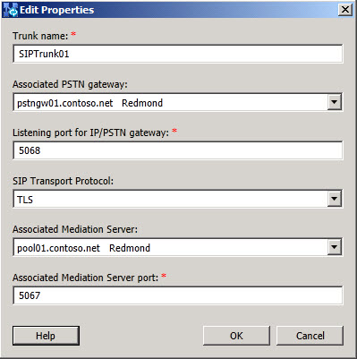

# 中继设置扩展器Trunk Settings Expander

若要编辑或修改 SIP 中继的设置，请执行下列操作：To edit or modify the settings for a SIP trunk, you do the following:

 “Trunk 名称”是必填项，并唯一标识部署中的 SIP 中继。**Trunk name** is a required entry and uniquely identifies the SIP trunk in the deployment.

 **关联的 PSTN 网关**：选择部署中已定义的现有 PSTN 网关。**Associated PSTN gateway**: Select an existing PSTN gateway that has been defined in the deployment.

 **IP/PSTN 网关的侦听端口**：指示网关要在其上侦听请求的 TCP/IP 端口。根据网关的供应商，所需的值可能会有所不同，但默认为端口 5067。**Listening port for IP/PSTN gateway**: Indicates what TCP/IP port the gateway will be listening for requests on. The required value may differ, based on the vendor of the gateway, but the default is port 5067.

 **SIP 传输协议**：使用的协议可以是 TCP，也可以是 TLS。TLS 为默认选项。有关网关所支持的选项，请参考网关供应商文档。默认为 TLS，且如果网关支持 TLS，则应将其视为更安全的选择。**SIP Transport Protocol**: The protocol used is either TCP or TLS. TLS is the default. Refer to the gateway vendor documentation for what you gateway supports. The default is TLS, and should be considered the more secure selection, if the gateway supports TLS.

 **关联的中介服务器**：从部署中选择现有中介服务器以与 SIP 中继关联。**Associated Mediation Server**: Select an existing Mediation Server from the deployment to associate with the SIP trunk.

> [!NOTE]
> 只有根中继可以与中介服务器关联。Only the root trunk can be associated with a Mediation Server.

 **关联的中介服务器端口**：一个必需值，设置为中介服务器配置为侦听的值。**Associated Mediation Server port**: A required value, this is set to the value that the Mediation Server is configured to listen on.

## 另请参阅See also

[SIP 中继部署清单SIP Trunking Deployment Checklist](/previous-versions/office/lync-server-2013/lync-server-2013-sip-trunk-deployment-checklist)

[用于 SIP 中继的组件和拓扑Components and Topologies for SIP Trunking](/previous-versions/office/lync-server-2013/lync-server-2013-components-and-topologies-for-sip-trunking)