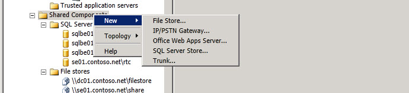

# 共享组件范围节点Shared Components Scope Node
 
右键单击拓扑生成器层次结构树中的**共享组件**以创建新的共享组件或访问拓扑级别选项。You right click on **Shared Components** in the Topology Builder hierarchy tree to create new shared components or to access Topology level options.
  

  
选择 "**新建**" 以创建新的存储存储、新的 IP/PSTN 网关、新的 Office Web Apps 服务器、新的 SQL Server 应用商店或新的主干。Select **New** to create a new filestore, a new IP/PSTN Gateway, a new Office Web Apps Server, a new SQL Server store, or a new Trunk.
  
> [!NOTE]
> 请参阅每个选项的帮助主题。See the Help topics for each of these options. 
  

  
选择 "**拓扑**" 以单击 "选项" 以打开新的拓扑文档。You select **Topology** to click on options to open a New topology document. 打开现有拓扑文档，从中央管理存储下载当前拓扑，保存当前拓扑文档的副本，发布当前拓扑文档，安装数据库以创建当前配置的数据库配置。将 Office 通信服务器 2007 R2 合并到当前部署中，或删除部署。Open an existing topology document, Download Current Topology from the Central Management store, Save a Copy of the current topology document, Publish the current topology document, Install Database to create the currently configured database configurations, Merge Office Communications Server 2007 R2 into the current deployment, or to Remove Deployment.
  

  

