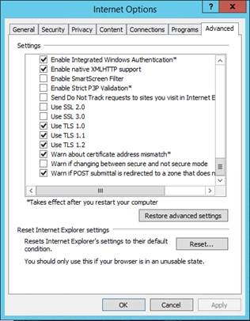

# <a name="disable-tls-1011-in-skype-for-business-server-2015"></a>为业务 Server 2015 禁用 TLS 1.0/1.1 中 Skype

本文旨在提供针对您准备和在您的环境中实现禁用 TLS 1.0 和 1.1 的必要指导。 此过程要求广泛的规划和准备。 请仔细检查所有这篇文章中的信息，使您的计划来禁用 TLS 1.0 和为您的组织的 1.1。 请注意，有许多外部依赖项和可能会受到禁用 TLS 1.0/1.1 的连接情况，因此全面的规划和测试确有必要。

## <a name="in-this-article"></a>本文中

- [背景和范围](#background)
- [先决条件和过程](#prerequisites-and-process)
- [高级的部署方案](#advanced-deployment-scenarios)

## <a name="background"></a>背景

提供了 TLS 1.0 和 1.1 禁用支持的 Skype 的业务 Server 内部部署的主要驱动程序支付卡行业 (PCI) 安全标准委员会和美国联邦信息处理标准要求。 可以找到 PCI 要求的详细信息[此处](https://blog.pcisecuritystandards.org/are-you-ready-for-30-june-2018-sayin-goodbye-to-ssl-early-tls)。  Microsoft 不能提供有关您的组织需要遵守这些或其他要求的指南。 您必须确定它是否需要为您要禁用 TLS 1.0 和/或 1.1 您环境中。

Microsoft 提供了在 TLS 可用[下面](https://cloudblogs.microsoft.com/microsoftsecure/2017/06/20/tls-1-2-support-at-microsoft/)的白皮书，我们还建议读取此[Exchange 博客](https://blogs.technet.microsoft.com/exchange/2018/01/26/exchange-server-tls-guidance-part-1-getting-ready-for-tls-1-2/)中提供的背景。

## <a name="supportability-scope"></a>可支持性范围

*范围*是指可支持性边界。 Skype 的业务 Server 内部部署，为*范围内*是指我们完全支持，并禁用 TLS 1.0 和列出的产品版本 1.1 的测试。 *当前正在调查*意味着我们正在主动研究如何为 TLS 禁用支持进入范围将这些产品。 *超出范围*意味着这些产品版本不支持禁用 TLS 1.0 或 1.1 并且将不起作用，与指定例外。

### <a name="fully-tested-and-supported-servers"></a>充分测试和支持的服务器

- Skype 业务服务器 2019
- Skype 的业务服务器 2015 CU6 HF2 6.0.9319.516 （[2018 年 3 月更新](https://support.microsoft.com/en-us/help/4086059/march-2018-cumulative-update-6-0-9319-516-for-skype-for-business)） 和更高版本上： 
    - （与 KB 3140245 或取代更新） 的 Windows Server 2012、 2012 R2 或 2016
- 就地升级业务服务器 2015，与 CU6 HF2 和更高版本上的 Skype 
    - Windows Server 2008 R2，2012 （与 KB [3140245](https://support.microsoft.com/en-us/help/3140245/update-to-enable-tls-1-1-and-tls-1-2-as-a-default-secure-protocols-in)或取代更新） 或 2012 R2
- Exchange 连接和 Outlook Web App 与 Exchange Server 2010 SP3 RU19 或更高版本，指南[此处](https://blogs.technet.microsoft.com/exchange/2018/01/26/exchange-server-tls-guidance-part-1-getting-ready-for-tls-1-2/)
 
### <a name="fully-tested-and-supported-clients"></a>充分测试和支持的客户端

- Lync 2013 (for Business 的 Skype) 桌面客户端、 MSI 和 C2R，包括基本[15.0.5023.1000 及更高](https://support.microsoft.com/en-us/help/4018334/april-3-2018-update-for-skype-for-business-2015-lync-2013-kb4018334)
- Skype 业务 2016年桌面客户端，MSI [16.0.4678.1000 及更高](https://support.microsoft.com/en-us/help/4018323/april-3-2018-update-for-skype-for-business-2016-kb4018323)，包括基本
- 业务 2016年单击要运行的 Skype 需要[年 4 月 2018年](https://docs.microsoft.com/en-us/officeupdates/release-notes-office365-proplus)更新： 
    - 每月和半年目标，16\.0\.9126\.2152年及更高
    - 半年和推迟通道，16\.0\.8431\.2242年及更高
- Skype for Business 上 Mac 16.15 和更高版本
- Skype 的 iOS 和 Android 6.19 业务及更高
- Skype Web 应用程序 2015 CU6 HF2 和更高版本 （附带服务器）

### <a name="currently-being-investigated"></a>当前正在调查

#### <a name="devices"></a>设备

- Lync 会议室系统 （也 SRSv1)
- Skype 会议室系统 v2 （也 SRSv2)
- Surface Hub
- 2015 基于 Survivable Branch Appliance (SBA) 或 Survivable Branch Server (SBS)

#### <a name="other"></a>其他

- 呼叫质量仪表板 （已禁用 TLS 1.0，1.1 之后的新安装，请参阅下面） *
 
### <a name="out-of-scope"></a>超出范围

除非另有说明，以下产品不在 TLS 1.0/1.1 禁用支持的范围内，将无法正常 TLS 1.0 和 1.1 其中已禁用的环境中。  这意味着： 如果您仍可以利用超出范围服务器或客户端，您必须更新或删除这些，如果您需要禁用 TLS 1.0/1.1 无处不在您 Skype 的业务服务器本地部署。

- Lync Server 2013
- Windows Server 2008 及更低
- Lync for Mac 2011
- Lync 2013 mobile-iOS、 iPad、 Android 或 Windows Phone
- Lync"MX"Windows 应用商店客户端
- 所有 Lync 2010 客户端
- Lync Phone Edition-更新的指南[下面](https://techcommunity.microsoft.com/t5/Skype-for-Business-Blog/Certified-Skype-for-Business-Online-Phones-and-what-this-means/ba-p/120035)。
- 2013 基于 Survivable Branch Appliance (SBA) 或 Survivable Branch Server (SBS)

### <a name="exceptions"></a>异常

#### <a name="lync-server-2013"></a>Lync Server 2013

Lync Server 2013 承担 Windows Fabric 1.0 版的依赖关系。  在 Lync Server 2013 的设计阶段，Windows Fabric 1.0 已选择其令人信服和新分布式体系结构来提供复制、 高可用性和容错能力。  随时间推移，这两个 Skype Business Server 和 Windows Fabric 大大提高了重大重新设计后续版本中使用此联合体系结构。  当前 Skype 业务 2015年服务器使用 Windows Fabric 3.0，例如。

遗憾的是，Windows Fabric 1.0**不支持 TLS 1.2。 但是，我们将在更新 Lync Server 2013 以使用 TLS 1.2**。 这将在下一步 Lync Server 2013 的累积更新中即将。  我们提供 TLS 1.2 支持启用共存、 迁移、 联合和混合方案。

如果您的组织需要禁用 TLS 1.0 和 1.1 中，并且您目前使用 Lync Server 2013，我们建议您开始规划过程、 的可能性您可能遇到的就地升级或-并行迁移到 Skype 的 （新池，移动用户）业务服务器 2015年或更高版本。  或者，您可能想要迁移到 Skype 加速业务 online。

#### <a name="call-quality-dashboard"></a>呼叫质量仪表板

在本地呼叫质量仪表板当前依赖 TLS 1.0 在新的安装 （到您的本地环境中安装第一次）。  我们当前正在调查此问题，并计划在将来版本修复。  如果您计划安装 CQD 和还禁用 TLS 1.0，我们建议您首先，完成 CQD 安装，然后继续进行 TLS 1.0 禁用。

#### <a name="third-party-devices"></a>第三方设备

在第三方设备，如 3PIP 电话，视频会议，反向代理和负载平衡器，请务必验证 TLS 1.2 可支持性和测试仔细，如果需要请联系供应商。

### <a name="federation-considerations-when-disabling-tls-1011-on-edge-servers"></a>联合身份验证边缘服务器上禁用 TLS 1.0/1.1 时的注意事项

仔细规划还必须考虑的边缘服务器上禁用 TLS 1.0/1.1 影响。  一旦禁用 TLS 1.0 和 1.1，您可能会发现，其他组织将不再能够与您的组织建立联盟。

您可以选择保留 TLS 1.0/1.1 边缘服务器上的启用以保持向后兼容的非修补 (SfB 2015，Lync 2013) 或旧 (2010) 的外部系统。

Microsoft 不能在您在边缘网络 （或任何网络） 属于下一级 PCI 标准; 提供意见或建议必须由单个公司确定的。

业务 online Skype 是能够如今，TLS 1.2，因此预期对与 Online 混合/联盟没有任何影响。

Skype 使用者服务 PIC （公共 IM 连接）： 我们不希望禁用 TLS 1.0/1.1 影响[Skype 连接](../../deploy/deploy-skype-connectivity.md);Microsoft PIC 网关已 TLS 1.2 能够。

## <a name="prerequisites-and-process"></a>先决条件和过程

除了上文所述，其中一次，TLS 1.0 和 1.1 均已禁用的范围外服务器，客户端和设备将继续正常工作，或者根本。 这可能意味着需要暂停并等待来自 Microsoft 更新的指南。 一旦您满足您满足所有要求，并具有对地址间隙的计划，继续。

在高级别，供在安装过程的业务服务器 2019 Skype 时的业务服务器 2015 Skype 将要求您安装 CU6 HF2，应用到.NET 和 SQL、 部署系统必备的注册表项，和最后一个单独的系统必备的更新round OS 配置的更新 （即禁用 TLS 1.0 和通过注册表文件导入 1.1）。 完成安装所有必备组件，包括之前禁用 TLS 1.0 和您的环境中的任何服务器上的 1.1 Skype 业务服务器 2015 CU6 HF2 至关重要。 对于业务服务器，包括边缘角色和 SQL Backends，每个 Skype 需要更新。 此外还应确保所有受支持 （范围） 客户端的已更新为所需的最低版本。 不要忘记更新以及管理工作站。

我们希望需遵循的业务服务器升级 Skype 操作的"内向外"的常规顺序。 将控制器池、 持久聊天和配对池视为平常一样方式相同。 介绍的订单和用于升级方法[此处](topology.md)和[此处](https://support.microsoft.com/en-us/help/3061064/updates-for-skype-for-business-server-2015)。

### <a name="high-level-process"></a>高级过程

1. 测试实验室之前配置生产服务器中的所有步骤。
2. 备份和保留一份每个要更新的单个服务器上的导出注册表。 您不能共享服务器; 之间的注册表它们包含基于计算机的唯一键。
3. 升级所有 Skype 业务 2015年服务器，为 CU6 HF2 或更高。 （的业务服务器 2019年的 Skype，则需要无 CU）
4. 安装所有必备组件的所有服务器。
5. 部署先决条件的注册表项。
6. 确保更新范围内的所有客户端。
7. 禁用 TLS 1.0 和通过注册表导入 1.1。
8. 验证预期的工作负荷的正常运行。
    - 如果遇到问题，诊断和解决，或
    - 从步骤 2 以重新启用 TLS 1.0 和 1.1 还原注册表
9. 验证正在使用仅 TLS 1.2。

### <a name="install-prerequisites-to-all-servers"></a>安装所有服务器的必备组件

禁用 TLS 1.0 和在操作系统级别中的业务服务器 2015年部署您 Skype 1.1 开始之前，需要进行大量依赖项更新。 以下是可支持 TLS 1.2 的最低版本。 禁用 TLS 1.0 和 1.1 开始之前，请在您的环境中的业务服务器的每个 Skype 中部署所有必备组件更新。

- Skype 的业务服务器 2015 CU6 HF2 6.0.9319.516 （[2018 年 3 月更新](https://support.microsoft.com/en-us/help/4086059/march-2018-cumulative-update-6-0-9319-516-for-skype-for-business)） 或更高版本
- [.NET framework 4.7](https://www.microsoft.com/en-us/download/details.aspx?id=55167)或更高版本 （下面提供） 的注册表中启用的 SchUseStrongCrypto 与
- 必须在所有 Skype 业务 2015年服务器和 backends 更新 SQL。 企业版池 SQL Backends 首先更新，然后其各自的 FEs。 
    - SQL Server 2014 SP1 + CU5 （[链接](https://support.microsoft.com/help/3130926)），或更高版本 / SQL Server 2012 SP2 + CU16 或更高版本 / SQL Server 2014 RTM + CU12 （[链接](https://support.microsoft.com/en-us/help/3130923/cumulative-update-12-for-sql-server-2014)） 或更高版本 / SQL Server 2014 SP2
    - SQL Server 2012 （[链接](https://www.microsoft.com/en-us/download/details.aspx?id=50402)） 版的 SQL Server Native Client
    - Microsoft ODBC 驱动程序 11 SQL server （[链接](https://www.microsoft.com/en-us/download/details.aspx?id=36434)），或更高版本
    - 共享的 SQL Server 2014 SP2 （[链接](https://www.microsoft.com/en-in/download/details.aspx?id=42295)） 的管理对象
    - SQL server 2014 SP2 SQLSysClrTypes （[链接](https://www.microsoft.com/en-in/download/details.aspx?id=42295)）

### <a name="basic-steps-to-install-pre-requisites-in-recommended-order-of-operations"></a>安装必备组件，建议的操作顺序中的基本步骤

1. 安装 Business Server CU6HF2 Skype (6.0.9319.516) 更新的所有服务器。 
    1. 使用 updater 组件安装更新。
    2. 更新数据库根据记录的过程。 说明均编档在[https://support.microsoft.com/en-us/help/3061064/updates-for-skype-for-business-server-2015](https://support.microsoft.com/en-us/help/3061064/updates-for-skype-for-business-server-2015)。
    3. 验证之前与任何其他更改向前移动部署中的产品功能。
2. 下载.NET 4.7 脱机的安装程序。 
    1. 参考：[https://www.microsoft.com/en-us/download/details.aspx?id=55167](https://www.microsoft.com/en-us/download/details.aspx?id=55167)
    2. 确保 Skype 业务服务器 2015年服务已停止在前端服务器上。
    3. 参考：[https://support.microsoft.com/en-us/help/3061064/updates-for-skype-for-business-server-2015](https://support.microsoft.com/en-us/help/3061064/updates-for-skype-for-business-server-2015)
    4. (Standard Edition): ex 停止 CsWindowsServices
    5. Ex （企业版）： 调用-CsComputerFailover
    6. 运行安装程序包。
    7. 重新启动服务器。
3. 在所有服务器上更新 SQL Express 2014。 
    1. 参考：[https://support.microsoft.com/en-us/help/3135244/tls-1-2-support-for-microsoft-sql-server](https://support.microsoft.com/en-us/help/3135244/tls-1-2-support-for-microsoft-sql-server)
    2. 下载 SQL 2014 SP2 
        - 参考：[https://www.microsoft.com/en-us/download/details.aspx?id=53168](https://www.microsoft.com/en-us/download/details.aspx?id=53168)
    3. 将安装媒体复制到服务器上的文件夹 (例如： C:\01_2014SqlSp2)
    4. 确保 Skype 的业务服务器 2015 在前端服务器停止服务 
        - Ex (Standard Edition): Stop-cswindowsservice
        - Ex （企业版）： 调用-CsComputerFailove
    5. 打开管理命令提示符处，并升级所有安装的组件和实例 
        - 示例： C:\01_2014SqlSp2\SQLServer2014SP2-KB3171021-x64-ENU.exe /qs /IAcceptSQLServerLicenseTerms /Action = 修补程序 /AllInstances
4. 更新 SQL Native Client。 
    1. 参考： [https://support.microsoft.com/en-us/help/3135244/tls-1-2-support-for-microsoft-sql-server](https://support.microsoft.com/en-us/help/3135244/tls-1-2-support-for-microsoft-sql-server)。
    2. 从下载[https://www.microsoft.com/en-us/download/details.aspx?id=50402](https://www.microsoft.com/en-us/download/details.aspx?id=50402)
    3. 确保 Skype 的业务服务器 2015 在前端服务器停止服务。 
        - (Standard Edition): ex 停止 CsWindowsServices
        - Ex （企业版）： 调用-CsComputerFailove
    4. 停止运行安装的 SQL 实例 
        - 示例： 获取服务 MSSQL RTCLOCAL' |停止服务
        - 示例： 获取服务 MSSQL$ LYNCLOCAL' |停止服务
        - （仅标准版）： ex Get-服务 MSSQL RTC |停止服务
    5. 安装该更新。
5. SQL Server 的更新 ODBC 驱动程序 11。 
    1. 参考： [https://support.microsoft.com/en-us/help/3135244/tls-1-2-support-for-microsoft-sql-server](https://support.microsoft.com/en-us/help/3135244/tls-1-2-support-for-microsoft-sql-server)。
    2. 从下载[https://www.microsoft.com/en-us/download/confirmation.aspx?id=36434](https://www.microsoft.com/en-us/download/confirmation.aspx?id=36434)
    3. 确保 Skype 业务服务器 2015年服务已停止在前端服务器上 
        - Ex (Standard Edition): Stop-cswindowsservice
        - Ex （企业版）： 调用-CsComputerFailove
    4. 安装该更新。
6. 部署先决条件的注册表项。

### <a name="pre-requisite-registry-keys"></a>系统必备的注册表项

复制/粘贴以下测试到记事本并重命名 TLSPreReq.reg 或您选择的名称，然后导入：

```
Windows Registry Editor Version 5.00

[HKEY_LOCAL_MACHINE\SOFTWARE\Microsoft\.NETFramework\v2.0.50727]

"SchUseStrongCrypto"=dword:00000001

[HKEY_LOCAL_MACHINE\SOFTWARE\Microsoft\.NETFramework\v4.0.30319]

"SchUseStrongCrypto"=dword:00000001

[HKEY_LOCAL_MACHINE\SOFTWARE\Wow6432Node\Microsoft\.NETFramework\v2.0.50727]

"SchUseStrongCrypto"=dword:00000001

[HKEY_LOCAL_MACHINE\SOFTWARE\Wow6432Node\Microsoft\.NETFramework\v4.0.30319]

"SchUseStrongCrypto"=dword:00000001

[HKEY_LOCAL_MACHINE\SOFTWARE\Microsoft\Windows\CurrentVersion\Internet Settings\WinHttp]

"DefaultSecureProtocols"=dword:00000AA0

[HKEY_LOCAL_MACHINE\SOFTWARE\Wow6432Node\Microsoft\Windows\CurrentVersion\Internet Settings\WinHttp]

"DefaultSecureProtocols"=dword:00000AA0

[HKEY_LOCAL_MACHINE\SYSTEM\CurrentControlSet\Control\SecurityProviders\SCHANNEL\Protocols\TLS 1.2]

[HKEY_LOCAL_MACHINE\SYSTEM\CurrentControlSet\Control\SecurityProviders\SCHANNEL\Protocols\TLS 1.2\Client]

"DisabledByDefault"=dword:00000000

"Enabled"=dword:00000001

[HKEY_LOCAL_MACHINE\SYSTEM\CurrentControlSet\Control\SecurityProviders\SCHANNEL\Protocols\TLS 1.2\Server]

"DisabledByDefault"=dword:00000000

"Enabled"=dword:00000001
```

SQL 的企业版池、 先决条件和 TLS 结束禁用的后应被视为任何 SQL 或操作系统更新将;请参阅：[https://docs.microsoft.com/en-us/skypeforbusiness/manage/topology/patch-or-update-a-back-end-or-standard-edition-server](https://docs.microsoft.com/en-us/skypeforbusiness/manage/topology/patch-or-update-a-back-end-or-standard-edition-server)

时可以组合的必备组件的应用程序和禁用步骤 TLS，我们强烈建议在继续禁用的 TLS 1.0 和在操作系统级别 1.1 之前应用的所有必备组件。 最佳做法的方法是通过部署所有必备组件，验证所有工作负荷函数正确和预期工作，并在以后再禁用继续使用 TLS 1.0/1.1 中准备环境。

### <a name="disable-tls-10-and-11-via-registry-import"></a>禁用 TLS 1.0 和通过注册表导入 1.1

在继续操作之前与接下来的步骤，*请确保您已完成所有必备组件并更新 Skype 业务服务器*。

将以下文本复制到记事本文件，并将其重命名**TLSDisable.reg**:

```
Windows Registry Editor Version 5.00

[HKEY_LOCAL_MACHINE\SOFTWARE\Policies\Microsoft\Cryptography\Configuration\SSL\00010002]

"Functions"="TLS_ECDHE_ECDSA_WITH_AES_256_GCM_SHA384_P384,TLS_ECDHE_ECDSA_WITH_AES_128_GCM_SHA256_P256,TLS_ECDHE_RSA_WITH_AES_256_GCM_SHA384_P384,TLS_ECDHE_RSA_WITH_AES_128_GCM_SHA256_P256,TLS_ECDHE_ECDSA_WITH_AES_256_CBC_SHA384_P384,TLS_ECDHE_ECDSA_WITH_AES_128_CBC_SHA256_P256,TLS_ECDHE_RSA_WITH_AES_256_CBC_SHA384_P384,TLS_ECDHE_RSA_WITH_AES_128_CBC_SHA256_P256,TLS_RSA_WITH_AES_256_GCM_SHA384,TLS_RSA_WITH_AES_128_GCM_SHA256,TLS_RSA_WITH_AES_256_CBC_SHA256,TLS_RSA_WITH_AES_128_CBC_SHA256"

[HKEY_LOCAL_MACHINE\SYSTEM\CurrentControlSet\Control\SecurityProviders\SCHANNEL]

"AllowInsecureRenegoClients"=dword:00000000

"AllowInsecureRenegoServers"=dword:00000000

[HKEY_LOCAL_MACHINE\SYSTEM\CurrentControlSet\Control\SecurityProviders\SCHANNEL\Ciphers]

[HKEY_LOCAL_MACHINE\SYSTEM\CurrentControlSet\Control\SecurityProviders\SCHANNEL\Ciphers\AES 128/128]

"Enabled"=dword:FFFFFFFF

[HKEY_LOCAL_MACHINE\SYSTEM\CurrentControlSet\Control\SecurityProviders\SCHANNEL\Ciphers\AES 256/256]

"Enabled"=dword:FFFFFFFF

[HKEY_LOCAL_MACHINE\SYSTEM\CurrentControlSet\Control\SecurityProviders\SCHANNEL\Ciphers\DES 56/56]

"Enabled"=dword:00000000

[HKEY_LOCAL_MACHINE\SYSTEM\CurrentControlSet\Control\SecurityProviders\SCHANNEL\Ciphers\NULL]

"Enabled"=dword:00000000

[HKEY_LOCAL_MACHINE\SYSTEM\CurrentControlSet\Control\SecurityProviders\SCHANNEL\Ciphers\RC2 128/128]

"Enabled"=dword:00000000

[HKEY_LOCAL_MACHINE\SYSTEM\CurrentControlSet\Control\SecurityProviders\SCHANNEL\Ciphers\RC2 40/128]

"Enabled"=dword:00000000

[HKEY_LOCAL_MACHINE\SYSTEM\CurrentControlSet\Control\SecurityProviders\SCHANNEL\Ciphers\RC2 56/128]

"Enabled"=dword:00000000

[HKEY_LOCAL_MACHINE\SYSTEM\CurrentControlSet\Control\SecurityProviders\SCHANNEL\Ciphers\RC2 56/56]

"Enabled"=dword:00000000

[HKEY_LOCAL_MACHINE\SYSTEM\CurrentControlSet\Control\SecurityProviders\SCHANNEL\Ciphers\RC4 128/128]

"Enabled"=dword:00000000

[HKEY_LOCAL_MACHINE\SYSTEM\CurrentControlSet\Control\SecurityProviders\SCHANNEL\Ciphers\RC4 40/128]

"Enabled"=dword:00000000

[HKEY_LOCAL_MACHINE\SYSTEM\CurrentControlSet\Control\SecurityProviders\SCHANNEL\Ciphers\RC4 56/128]

"Enabled"=dword:00000000

[HKEY_LOCAL_MACHINE\SYSTEM\CurrentControlSet\Control\SecurityProviders\SCHANNEL\Ciphers\RC4 64/128]

"Enabled"=dword:00000000

[HKEY_LOCAL_MACHINE\SYSTEM\CurrentControlSet\Control\SecurityProviders\SCHANNEL\Ciphers\Triple DES 168]

"Enabled"=dword:00000000

[HKEY_LOCAL_MACHINE\SYSTEM\CurrentControlSet\Control\SecurityProviders\SCHANNEL\Hashes]

[HKEY_LOCAL_MACHINE\SYSTEM\CurrentControlSet\Control\SecurityProviders\SCHANNEL\Hashes\MD5]

"Enabled"=dword:00000000

[HKEY_LOCAL_MACHINE\SYSTEM\CurrentControlSet\Control\SecurityProviders\SCHANNEL\Hashes\SHA]

"Enabled"=dword:FFFFFFFF

[HKEY_LOCAL_MACHINE\SYSTEM\CurrentControlSet\Control\SecurityProviders\SCHANNEL\Hashes\SHA256]

"Enabled"=dword:FFFFFFFF

[HKEY_LOCAL_MACHINE\SYSTEM\CurrentControlSet\Control\SecurityProviders\SCHANNEL\Hashes\SHA384]

"Enabled"=dword:FFFFFFFF

[HKEY_LOCAL_MACHINE\SYSTEM\CurrentControlSet\Control\SecurityProviders\SCHANNEL\Hashes\SHA512]

"Enabled"=dword:FFFFFFFF

[HKEY_LOCAL_MACHINE\SYSTEM\CurrentControlSet\Control\SecurityProviders\SCHANNEL\KeyExchangeAlgorithms]

[HKEY_LOCAL_MACHINE\SYSTEM\CurrentControlSet\Control\SecurityProviders\SCHANNEL\KeyExchangeAlgorithms\Diffie-Hellman]

"Enabled"=dword:FFFFFFFF

[HKEY_LOCAL_MACHINE\SYSTEM\CurrentControlSet\Control\SecurityProviders\SCHANNEL\KeyExchangeAlgorithms\ECDH]

"Enabled"=dword:FFFFFFFF

[HKEY_LOCAL_MACHINE\SYSTEM\CurrentControlSet\Control\SecurityProviders\SCHANNEL\KeyExchangeAlgorithms\PKCS]

"Enabled"=dword:FFFFFFFF

[HKEY_LOCAL_MACHINE\SYSTEM\CurrentControlSet\Control\SecurityProviders\SCHANNEL\Protocols]

[HKEY_LOCAL_MACHINE\SYSTEM\CurrentControlSet\Control\SecurityProviders\SCHANNEL\Protocols\Multi-Protocol Unified Hello]

[HKEY_LOCAL_MACHINE\SYSTEM\CurrentControlSet\Control\SecurityProviders\SCHANNEL\Protocols\Multi-Protocol Unified Hello\Client]

"DisabledByDefault"=dword:00000001

"Enabled"=dword:00000000

[HKEY_LOCAL_MACHINE\SYSTEM\CurrentControlSet\Control\SecurityProviders\SCHANNEL\Protocols\Multi-Protocol Unified Hello\Server]

"DisabledByDefault"=dword:00000001

"Enabled"=dword:00000000

[HKEY_LOCAL_MACHINE\SYSTEM\CurrentControlSet\Control\SecurityProviders\SCHANNEL\Protocols\PCT 1.0]

[HKEY_LOCAL_MACHINE\SYSTEM\CurrentControlSet\Control\SecurityProviders\SCHANNEL\Protocols\PCT 1.0\Client]

"DisabledByDefault"=dword:00000001

"Enabled"=dword:00000000

[HKEY_LOCAL_MACHINE\SYSTEM\CurrentControlSet\Control\SecurityProviders\SCHANNEL\Protocols\PCT 1.0\Server]

"DisabledByDefault"=dword:00000001

"Enabled"=dword:00000000

[HKEY_LOCAL_MACHINE\SYSTEM\CurrentControlSet\Control\SecurityProviders\SCHANNEL\Protocols\SSL 2.0]

[HKEY_LOCAL_MACHINE\SYSTEM\CurrentControlSet\Control\SecurityProviders\SCHANNEL\Protocols\SSL 2.0\Client]

"DisabledByDefault"=dword:00000001

"Enabled"=dword:00000000

[HKEY_LOCAL_MACHINE\SYSTEM\CurrentControlSet\Control\SecurityProviders\SCHANNEL\Protocols\SSL 2.0\Server]

"DisabledByDefault"=dword:00000001

"Enabled"=dword:00000000

[HKEY_LOCAL_MACHINE\SYSTEM\CurrentControlSet\Control\SecurityProviders\SCHANNEL\Protocols\SSL 3.0]

[HKEY_LOCAL_MACHINE\SYSTEM\CurrentControlSet\Control\SecurityProviders\SCHANNEL\Protocols\SSL 3.0\Client]

"DisabledByDefault"=dword:00000001

"Enabled"=dword:00000000

[HKEY_LOCAL_MACHINE\SYSTEM\CurrentControlSet\Control\SecurityProviders\SCHANNEL\Protocols\SSL 3.0\Server]

"DisabledByDefault"=dword:00000001

"Enabled"=dword:00000000

[HKEY_LOCAL_MACHINE\SYSTEM\CurrentControlSet\Control\SecurityProviders\SCHANNEL\Protocols\TLS 1.0]

[HKEY_LOCAL_MACHINE\SYSTEM\CurrentControlSet\Control\SecurityProviders\SCHANNEL\Protocols\TLS 1.0\Client]

"DisabledByDefault"=dword:00000001

"Enabled"=dword:00000000

[HKEY_LOCAL_MACHINE\SYSTEM\CurrentControlSet\Control\SecurityProviders\SCHANNEL\Protocols\TLS 1.0\Server]

"DisabledByDefault"=dword:00000001

"Enabled"=dword:00000000

[HKEY_LOCAL_MACHINE\SYSTEM\CurrentControlSet\Control\SecurityProviders\SCHANNEL\Protocols\TLS 1.1]

[HKEY_LOCAL_MACHINE\SYSTEM\CurrentControlSet\Control\SecurityProviders\SCHANNEL\Protocols\TLS 1.1\Client]

"DisabledByDefault"=dword:00000001

"Enabled"=dword:00000000

[HKEY_LOCAL_MACHINE\SYSTEM\CurrentControlSet\Control\SecurityProviders\SCHANNEL\Protocols\TLS 1.1\Server]

"DisabledByDefault"=dword:00000001

"Enabled"=dword:00000000
```

导入您想要禁用 TLS 1.0 每台服务器和 1.1 该.reg 文件。 重新启动服务器。 一旦服务具有联机后，将移动到下一台服务器。 企业版池的方法是将花费的任何操作系统更新相同。

您可能已经注意到我们的多台只禁用 TLS 1.0 和 1.1 此处操作。 我们要支持密码套件重新排序 （如上所示） 和某些旧的弱密码的禁用。 这是首次我们具有正式支持对 SCHANNEL 和加密 API 的这些更改 Skype 业务服务器，务必注意这些更改是我们支持，并测试这一次是唯一的。 我们将来，可能会考虑的其他配置，但现在，请不要修改注册表导入文件中您的实现。

### <a name="validate-that-workloads-are-functioning-as-expected"></a>验证预期的工作负荷的正常运行

一次 TLS 1.0 和 1.1 已禁用您的环境中，确保您的主要工作负载都按预期方式，如 IM 和状态、 P2P 运行所有呼叫，企业语音，等等。

**验证正在使用仅 TLS 1.2**

具有安全团队执行 Skype 的业务通信，以确保较旧的协议 TLS 1.0 和 1.1 不再使用的新审核。

此外，您可以使用 Internet Explorer 测试 TLS 连接到 web 服务从 Skype 业务服务器 2015年后已禁用 TLS 1.0 和 TLS 1.1。

1. 启动 Internet Explorer。
2. 选择**工具** > **Internet 选项**。
3. 选择**高级**选项卡。
4. 在**设置**中，滚动到底部。
5. 验证已启用 TLS 1.0、 TLS 1.1 和 TLS 1.2。
6. 浏览 SfB 2015 池 （应成功连接） 的内部 Web 服务 URL。
7. 返回到 Internet Explorer，并禁用仅**使用 TLS 1.2**的选项。
8. 浏览 SfB 2015 池再次 （应无法连接） 的内部 Web 服务 URL。



## <a name="advanced-deployment-scenarios"></a>高级的部署方案

因为不需要 TLS 1.2 Skype 中支持的业务服务器 2015年一些依赖项先决条件，从 RTM 媒体安装 TLS 1.0 和 1.1 其中已禁用任何系统上将失败。

**一旦 TLS 1.0 和 1.1 已禁用您的环境中部署新的 Standard Edition Server 或企业版池。**

**选项 1:** 使用[SmartSetup](../../deploy/install/install-skype-for-business-server.md)。 请注意我们要更新 SmartSetup 以适应未来 CU 中, 更新的 SQL 二进制文件，将在将来更新这篇文章。

**选项 2:** 预安装本地 SQL 实例 （RTCLOCAL 和 LYNCLOCAL）

1. 下载并将 SQL Express 2014 SP2 (SQLEXPR_x64.exe) 复制到 FE 上的本地文件夹。 假设文件夹路径 < SQL_FOLDER_PATH >。
2. 启动 PowerShell 或命令提示符并导航到 < SQL_FOLDER_PATH >。
3. 通过运行以下命令创建 RTCLOCAL SQL 实例。 等待 SQLEXPR_x64.exe 完成之前：

    SQLEXPR_x64.exe /Q /IACCEPTSQLSERVERLICENSETERMS /UPDATEENABLED = 0 /HIDECONSOLE /ACTION = 安装/功能 = SQLEngine、 工具 /INSTANCENAME = RTCLOCAL /TCPENABLED = 1 /SQLSVCACCOUNT ="NT 机构 \ 网络服务"/SQLSYSADMINACCOUNTS ="Builtin\管理员"/BROWSERSVCSTARTUPTYPE ="自动"/AGTSVCACCOUNT ="NTAUTHORITY\NetworkService"/SQLSVCSTARTUPTYPE = 地
1. 通过运行以下命令创建 LYNCLOCAL SQL 实例。 请等待 SQLEXPR_x64.exe，再继续下一步完成：

    SQLEXPR_x64.exe /Q /IACCEPTSQLSERVERLICENSETERMS /UPDATEENABLED = 0 /HIDECONSOLE /ACTION = 安装/功能 = SQLEngine、 工具 /INSTANCENAME = LYNCLOCAL /TCPENABLED = 1 /SQLSVCACCOUNT ="NT 机构 \ 网络服务"/SQLSYSADMINACCOUNTS ="Builtin\管理员"/BROWSERSVCSTARTUPTYPE ="自动"/AGTSVCACCOUNT ="NTAUTHORITY\NetworkService"/SQLSVCSTARTUPTYPE = 自动
1. 业务 Server 2015 RTM 安装程序运行 Skype。
2. 从上面的必备组件部分执行的其余步骤。

**选项 3:** 手动可以替换本地安装媒体目录中的二进制文件，如下所示：

1. [安装 Business Server Skype 的先决条件](../../deploy/install/install-prerequisites.md)  
2. 2. 安装.NET 4.7: 
      - **注意：** 首次引入.NET 4.7 Skype 中的支持的业务服务器 2015 CU5 + (6.0.9319.281)。 因此，下面的后续步骤中我们将更新核心组件之前主安装。
      - 下载： https://www.microsoft.com/en-us/download/details.aspx?id=55167。
      - 参考：[软件的应安装之前业务服务器 2015年部署 Skype](../../plan-your-deployment/requirements-for-your-environment/server-requirements.md#software-that-should-be-installed-before-a-skype-for-business-server-2015-deployment)
3. 将复制的 ISO 文件/文件夹： 
    - 与业务服务器 2015 ISO 附加的 Skype，打开作为附加的驱动器的根目录 (例如： d:\)在文件资源管理器。
    - 将所有文件夹和文件都复制到本地磁盘上的文件夹 (例如： C:\SkypeForBusiness2015ISO)。
    - **注意：** 在安装之前组件，某些文件将需要更新的 TLS 1.2 支持。
4. 替换 MSI/EXE 包： 
    - 将本地计算机上安装媒体的 /Setup/amd64/文件夹中现有的 MSI 和 EXE 包。
    - SQL 2014 SP2 Express:https://www.microsoft.com/en-us/download/details.aspx?id=53167 
        - 重命名为 SQLEXPR_x64 在本地计算机上并替换现有文件中安装程序/amd64/安装媒体的文件夹。
    - SQL Native Client:https://www.microsoft.com/en-us/download/details.aspx?id=50402 
        - **注意：** 重命名此必要 sqlncli.msi 安装，和然后替换现有的文件的安装程序/amd64 中存在/安装媒体的文件夹。
    - SQL 管理对象：https://www.microsoft.com/en-us/download/details.aspx?id=53164 
        - **注意：** 功能包将有大量的可以下载的项目。 仅下载 SharedManagementObjects.msi 选择。
        - **注意：** 替换现有文件的安装程序/amd64 中存在/安装媒体的文件夹。
    - SQL CLR 类型：https://www.microsoft.com/en-us/download/details.aspx?id=53164 
        - **注意：** 功能包将有大量的可以下载的项目。 选择此选项可仅下载 CQLSysClrTypes.msi
        - **注意**： 替换现有文件的安装程序/amd64 中存在/安装媒体的文件夹。
5. 安装核心组件： 
    - 从安装程序/amd64 运行 Setup.exe/安装媒体的文件夹。 按照说明安装核心组件
    - 关闭核心组件。
6. 更新核心组件： 
    - 下载 Skype 适用于业务更新安装程序。
    - 运行安装程序更新核心组件和安装的性能计数器。
    - **注意：** 从 CU6HF2 的版本，自动更新功能当前仅将安装到 CU6 为止。 因此，必须单独运行 updater 更新为 6.0.9319.516 的核心组件。
    - 参考：https://support.microsoft.com/en-us/help/3061064/updates-for-skype-for-business-server-2015
7. 安装管理工具 （可选）： 
    - 这将安装 Microsoft SQL Server 2012 Native Client、 SQL Server 2014 管理对象 (x64) 和 Microsoft System CLR Types for SQL Server 2014 (x64) 使用更新的文件。 此外，业务 Server 2015 拓扑生成器和控制面板 Skype 将本地计算机上可用。
8. 安装本地配置存储 （第 1 步）： 
     - 打开部署向导、 业务服务器系统中，单击安装或更新 Skype 并单击**运行**步骤 1： 安装本地配置存储。
     - 单击**下一步****安装本地配置存储**对话框中。
     
     - 查看结果，并确保完成任务状态。 通过单击**查看日志**查看生成的日志文件。
     
     - 单击“**完成**”。
9. 设置或删除 Skype 业务服务器组件 (第 2 步):
    - 打开部署向导中，单击**安装或更新 Skype 业务 Server 系统**，然后单击**运行**步骤 2： 安装或删除 Skype 业务服务器组件
    - 单击**下一步**中业务服务器组件对话框中设置用户 Skype。
    
    - 查看使用查看日志的日志，并验证该安装已完成毫无问题。 
    - 单击“**完成**”。
10. 继续进行额外的安装和配置所需 （此时，您可以继续正常安装过程）。
