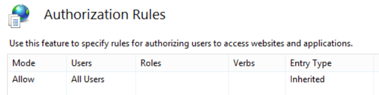
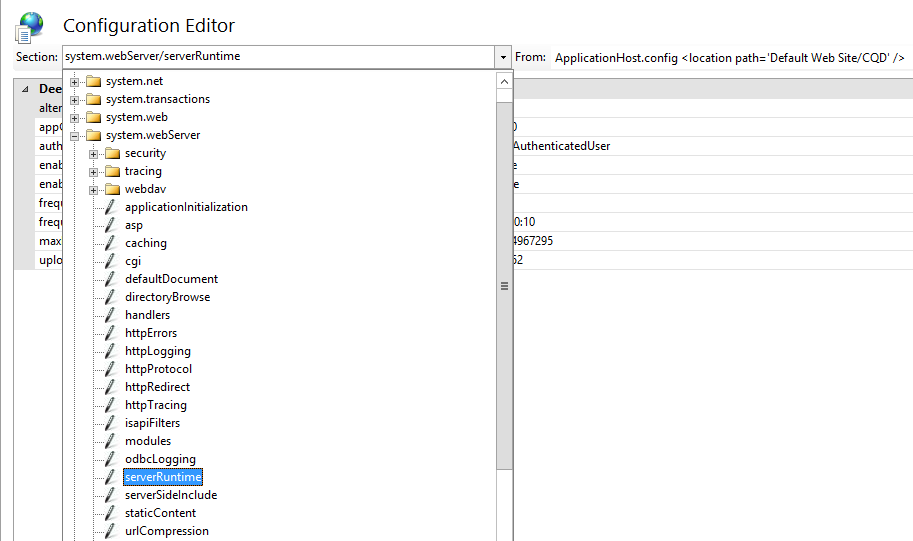
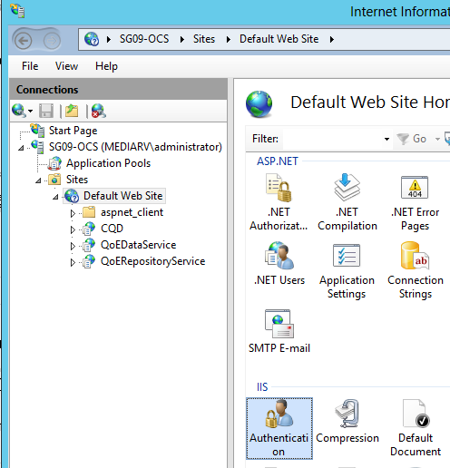

# <a name="deploy-call-quality-dashboard-for-skype-for-business-server"></a>为业务服务器部署 for Skype 的呼叫质量仪表板
 
**摘要：** 了解呼叫质量仪表板的部署过程。 呼叫质量仪表板是用于业务服务器 Skype 的工具。
  
## <a name="deployment-overview"></a>部署概述

呼叫质量仪表板 (CQD) 包括三个主要组件：
  
- **存档数据库**，其中的用户体验质量 (QoE) 数据是复制和存储。
    
- **多维数据集**，其中 QoE 存档数据库中的数据聚集优化和快速访问。
    
- **门户**，其中用户可以轻松地查询和可视化 QoE 数据。
    

  
QoE 存档的安装过程包括创建 QoE 存档数据库、 部署将源的 QoE 指标数据库移动数据到 QoE 存档数据库的 SQL Server 存储过程和设置 SQL Server 代理作业来执行存储为定期的过程。 
  
多维数据集部署获取从 QoE 存档位于、 部署多维数据集，并设置将定期刷新多维数据集的常规 SQL Server 代理作业中的用户的信息。
  
门户安装创建存储库数据库存储的每个用户的报告/查询 CQD 用户映射。 它然后设置的 IIS web 应用程序，即仪表板用户看到一组预定义的报告，以及自定义和创建自己的查询来可视化数据多维数据集。 门户安装创建两个其他 web 应用程序公开的用户，以编程方式访问存储库和多维数据集的 Api。 （这些 Api 由在内部使用仪表板以及。）
  

|**阶段**|**步骤**|**角色和组成员身份**|**文档**|
|:-----|:-----|:-----|:-----|
|安装必备硬件和软件。  <br/> |确定 CQD 配置，然后选择要从中执行安装 SQL Server。  <br/> |属于本地 Administrators 组成员的域用户。  <br/> |部署文档中的"预安装的系统要求"部分。  <br/> |
|安装 CQD。  <br/> |运行 MSI 关注部署文档。  <br/> |若要执行安装程序，安装帐户必须是本地 administrators 组的成员的域用户并具有监控服务器上的读访问权的 QoE 指标数据库。  <br/> |部署文档中的"帐户和部署步骤"部分。  <br/> |
|授予用户访问权限。  <br/> |用于管理到门户的用户授权，我们建议使用 URL 授权，在 IIS 7.0 中引入。 有关详细信息，请参阅[Understanding IIS 7.0 URL 授权](https://www.iis.net/learn/manage/configuring-security/understanding-iis-url-authorization)。  <br/> |属于本地 Administrators 组成员的域用户。  <br/> |部署文档中的门户部分管理用户的访问。  <br/> |
|可选： 提供子网映射信息。  <br/> |填充网络和 QoE 存档数据库中的构建映射表。  <br/> |具有写访问 QoE 存档数据库的帐户。  <br/> |用户文档中的"提供子网信息"部分。  <br/> |
   


呼叫质量仪表板的部署涉及设置基础结构和安装软件。 下面的过程概述的过程。
  
## <a name="deployment-steps"></a>部署步骤

1. 将 CallQualityDashboard.msi 复制到其中 CQD 的存档数据库组件是安装在计算机 （这是已安装的 SQL Server 的计算机）。 
    
2. 执行 MSI （Windows 会提示具有管理员权限运行，这样做）。 
    
3. 接受 EULA。
    
4. 选择目标文件夹，其中与呼叫质量仪表板组件相关的文件将位于或接受默认位置。
    
5. 选择所有功能。
    
6. 在 QoE 存档配置页中，提供以下信息：
    
   - **的 QoE 指标 SQL Server:** QoE 指标 DB 所在的 SQL Server 实例名称 （这将数据源）。
    
   - **QoE 存档 SQL Server 名称：** 这是只读字段，固定到本地计算机的完全限定的域名。 可以仅在本地计算机上安装存档数据库。
    
   - **QoE 存档 SQL Server 实例：** 其中存档 DB 是要创建本地 SQL Server 实例名称。 若要使用默认 SQL Server 实例，请将此字段留空。 若要使用的命名的 SQL Server 实例，指定实例名称 (例如后的名称"\")。
    
   - **QoE 存档数据库：** 默认情况下，此选项设置为"创建新的数据库"。 不支持存档 DB 升级，因为在其下的"使用现有数据库"选项可仅 circumstance 为现有的存档数据库是否有生成安装相同的架构。
    
   - **数据库文件目录：** 存档数据库的数据库文件 （.mdf 和.ldf） 的放置位置的路径。 这应该是驱动器上从操作系统 (推荐的硬件配置中 HDD2) 分开。 请注意，因为安装中修复的文件名称，以避免任何潜在冲突，建议使用的任何文件的空白目录。
    
   - **使用多个分区：** 默认值设置为"多个分区"，这需要商业智能版或企业版的 SQL Server。 对于 Standard edition，请选择"单个分区"选项。 请注意，是否使用单个分区多维数据集处理性能可能会受到影响。
    
     > [!NOTE]
     > 安装完成后，使用多个分区选项所选内容不能更改。 若要更改它，功能需要第一个多维数据集卸载并重新安装使用控制面板中的"更改"选项。 
  
   - **分区文件目录：** QoE 存档数据库的分区的放置位置的路径。 这应该是驱动器上 (HDD3 建议的硬件配置中) 的操作系统驱动器和 SQL 数据库日志文件驱动器分开。 请注意，因为安装中修复的文件名称，以避免任何潜在冲突，建议使用的任何文件的空白目录。
    
   - **SQL 代理作业用户的用户名&amp;密码：** 域服务帐户名和密码 （遮盖） 将用于运行"QoE 存档数据"SQL Server 代理作业 （这将运行提取数据从 QoE 指标 DB 到存档 DB，因此此帐户必须具有对 QoE 指标 DB 的读取权限的存储的过程的步骤 指示在帐户部分。 此帐户也需要有登录名的 QoE 存档 SQL Server 实例中）。
    
     > [!NOTE]
     > 如 NT SERVICE\MSSQLSERVER 下运行的 SQL Server 实例的帐户必须具有对上述安装成功的目录访问/权限。 有关详细信息，请参阅[为数据库引擎访问配置文件系统权限](https://msdn.microsoft.com/en-us/library/jj219062%28v=sql.110%29.aspx)
  
7. 在单击下一步安装程序将执行先决条件检查和报告，如果遇到任何问题。 当所有先决条件检查传递中，安装程序将转到多维数据集配置页。 
    
    > [!NOTE]
    > 如果安装程序显示的 QoE 存档 SQL Server 实例的 SQL Server 代理服务当前未运行一条警告消息，才能继续安装，但安装后请确保 SQL 代理服务正在运行，并将启动类型设置为自动以便计划的作业运行。 
  
8. 在多维数据集配置页上，提供以下信息：
    
   - **QoE 存档 SQL Server 名称：** 这是只读字段，固定到本地计算机的完全限定的域名。 多维数据集可以安装只能从计算机具有 QoE 存档数据库 （注释。 可能远程计算机上安装多维数据集本身。 请参阅下面）
    
   - **QoE 存档 SQL Server 实例：** QoE 存档数据库所在的 SQL Server 实例名称。 若要指定默认 SQL Server 实例，请将此字段留空。 若要指定命名的 SQL Server 实例，请输入的实例名称 (例如后的名称"\")。 如果安装选择 QoE 存档组件，此字段将预填充 QoE 存档配置页上提供的值。
    
   - **多维数据集分析服务器：** 其中多维数据集是要创建的 SQL Server Analysis Service 实例名称。 这可以是不同的计算机，但安装的用户必须是目标 SQL Server Analysis Service 实例的服务器管理员的成员。
    
     > [!NOTE]
     >  有关配置 Analysis Services 服务器管理员权限的详细信息，请参阅[授予服务器管理员权限 (Analysis Services)](https://msdn.microsoft.com/en-us/library/ms174561.aspx)
  
   - **使用多个分区：** 默认值设置为"多个分区"，这需要商业智能版或企业版的 SQL Server。 对于 Standard edition，请选择"单个分区"选项。 请注意，是否使用单个分区多维数据集处理性能可能会受到影响。
    
     > [!NOTE]
     >  安装完成后，使用多个分区选项所选内容不能更改。 若要更改它，功能需要第一个多维数据集卸载并重新安装使用控制面板中的"更改"选项。
  
   - **多维数据集的用户的用户名&amp;密码：** 域服务帐户名和密码 （遮盖） 将触发多维数据集处理。 如果安装选择 QoE 存档组件，此字段将为 SQL 代理作业用户，在存档配置页上提供的值与预先填充，但建议，以使安装程序可以授予指定不同的域服务帐户所需的最小特权到它。
    
9. 单击下一步时将执行另一轮验证，并将报告任何问题。 在验证成功完成，安装程序将转到门户配置页中。 
    
10. 在门户配置页上，提供以下信息：
    
    - **QoE 存档 SQL Server:** QoE 存档数据库所在的 SQL Server 实例名称。 注意，与 QoE 存档配置页和多维数据集配置页上，不同的计算机名称并未得到解决，必须提供。 如果安装选择 QoE 存档组件，此字段将预填充 QoE 存档配置页上提供的值。
    
    - **多维数据集分析服务器：** 多维数据集所在的 SQL Server Analysis Service 实例名称。 如果安装选择多维数据集组件，此字段将预填充多维数据集配置页上提供的值。
    
    - **存储库 SQL Server:** 创建存储库数据库所在的 SQL Server 实例名称。 如果 QoE 存档数据库所在的 SQL Server 实例名称提供更早版本中安装程序 （其他组件），将 QoE 存档 DB SQL Server 实例名称预先填充此字段。 这可以是任何 SQL Server 实例。
    
    - **存储库数据库：** 默认情况下选项设置为"创建新的数据库"。 由于不支持库 DB 升级，可在其下使用"使用现有数据库"选项仅 circumstance 是现有的存储库 DB 具有生成安装相同的架构。
    
    - **IIS 应用程序池用户的用户名&amp;密码：** 在下，应执行的 IIS 应用程序池帐户。 用户名和密码字段将灰显，如果选择了内置系统帐户。 如果"Other"将选定从下拉列表框中，以便用户可以输入域服务帐户信息，则仅会启用这些字段。
    
11. 时单击下一步将进行验证的最后一轮以确保 SQL Server 实例可以使用提供的凭据访问并且 IIS 为计算机上可用。 在验证成功完成，安装程序将继续进行安装。 
    
完成安装程序后，很可能的 SQL Server 代理作业将正在进行，执行初始的 QoE 数据和多维数据集处理负载。 QoE 中的数据量，根据门户没有可用于尚未查看数据。 要检查的数据加载和多维数据集处理状态，请转到`http://<machinename>/CQD/#/Health`。 
> [!NOTE]
> 请注意，检查的下载多维数据集处理状态的 URL 是区分大小写。 如果输入运行状况 URL 将不起作用。 您必须输入大写 h。 URL 末尾的运行状况 
  
如果启用调试模式将显示详细的日志消息。 若要启用调试模式下，转到 **%SYSTEMDRIVE%\Program 的业务 2015 CQD\QoEDataService\web.config Files\Skype**，并更新以下行，以便值设置为**True**:

```
<add key="QoEDataLib.DebugMode" value="True" /> 
```

门户主页是可通过访问`http://<machinename>/CQD`。 
## <a name="managing-user-access-for-the-portal"></a>门户管理用户访问

用于管理到门户的用户授权，我们建议使用 URL 授权，在 IIS 7.0 中引入。 IIS 安全性的详细信息，请参阅[Understanding IIS 7.0 URL 授权](https://www.iis.net/learn/manage/configuring-security/understanding-iis-url-authorization)。
  
任何 web 网站或 web 应用程序继承默认 URL 授权配置为整个 IIS，这通常是"允许所有用户"。 如果需要更严格访问门户，然后管理员可以授予访问仅特定的用户组通过编辑"授权规则"。
  

  
> [!NOTE]
> 授权规则图标是不会与".NET Authorization"下 ASP.NET 部分，这是不同的身份验证机制混淆。 
  
管理员应该首先删除继承"允许所有用户"规则。 这将防止未经授权的任何用户访问门户。
  

  
接下来，管理员应添加新允许规则，并向特定用户授予权限，用于访问门户。 建议创建一个名为"CQDPortalUsers"的本地组的管理用户。
  

  
配置详细信息存储在 web.config 中位于门户的物理目录。
  
```
<?xml version="1.0" encoding="UTF-8"?> <configuration> <system.webServer> <security> <authorization> <remove users="*" roles="" verbs="" /> <add accessType="Allow" roles="CQDPortalUsers" /> </authorization> </security> </system.webServer> </configuration> 
```

下一步是配置 CQD 的仪表板。 用户进行身份验证由 IIS 后，他们将需要对 CQD directory 文件权限才能访问 web 门户网站内容。 可以更改通过 CQD 目录属性的安全选项卡添加单个用户或组; 的 Acl但是的推荐的方法是保持不变的文件权限。 相反，更改要使用的 IIS 工作进程访问无论该用户进行身份验证的 CQD 目录的 IIS 设置。 
  
> [!IMPORTANT]
> 非常重要仅更改此设置为 CQD 应用程序，而不是针对两个 API 应用程序： QoEDataService 和 QoERepositoryService。 
  
## <a name="configuring-file-access-for-the-cqd-dashboard"></a>配置文件访问 CQD （仪表板）

1. 打开配置编辑器的 CQD。
    
     
  
2. 在部分下，选择**system.webServer/serverRuntime**。
    
     
  
3. 更改为**UseWorkerProcessUser**authenticatedUserOverride。
    
     
  
4. 单击**应用**页面的右侧。
    
## <a name="known-issues"></a>已知问题

### <a name="the-cqd-shows-no-data-after-deployment"></a>CQD 部署后显示没有数据

您可能会收到以下错误：

*运行在多维数据集时，我们无法执行查询。使用查询编辑器以修改查询并修复所有问题。此外请确保多维数据集是可访问。*

这意味着，必须中正使用的 CQD 之前在 SQL Server Analysis Services 中处理多维数据集。 您可以通过执行以下步骤来解决此问题：

1. 打开 SQL Management Studio 并选择**Analysis Services**。

2. 展开**QoECube**对象，选择的**QoE 指标**，右键单击，，，然后选择**浏览**。 

    如果此方法返回空的浏览器，则不起作用已尚未继续多维数据集。

3. 右键单击**QoE 指标**angain 并选择**过程**。

4. 处理完成后，再次，右键单击对象，并选择**浏览**以确认浏览器页上现在显示数据。 


### <a name="users-have-trouble-logging-in-because-installer-fails-to-create-the-correct-settings-in-iis"></a>用户遇到登录，因为安装程序无法在 IIS 中创建的正确设置

在极少数情况下，安装程序无法在 IIS 中创建了正确的设置。 允许用户登录到 CQD 需要手动更改。 如果用户在登录时出现问题，请按照以下步骤：
  
1. 打开 up IIS 管理器中，并导航到默认网站。
    
     
  
2. 单击"身份验证"。 如果"匿名身份验证"、"ASP.NET 模拟"、"窗体身份验证"和"Windows 身份验证"不匹配的设置如下所示，手动更改，以满足下面的设置。 应禁用所有其他身份验证机制。
    
     
  
3. 对于"Windows 身份验证"，在右侧单击高级设置。
    
     
  
4. 将"扩展保护"设置为接受并选中"启用内核模式身份验证"框。
    
     
  
5. "CQD"、"QoEDataService"和"QoERepositoryService"条目下方"默认网站"的每个重复上述步骤。
    
HTTP 和 HTTPS 端口绑定安装程序将在默认端口号 （端口 80 用于 HTTP） 和端口 443 用于 HTTPS 上创建端口绑定。 如果使用这些绑定的计算机上没有另一个网站，将冲突，并且无法预测的 IIS 行为。 若要避免此问题的最佳方式是使确保没有其他网站映射到端口 80 和 443 安装 CQD 之前。 
  
若要启用 SSL/TLS 在 IIS 中并强制用户通过安全的 HTTPS，而不是 HTTP 连接：
  
1. 在 IIS 中配置安全套接字层，请参阅[在 IIS 7 中配置安全套接字层](https://technet.microsoft.com/en-us/library/cc771438%28v=ws.10%29.aspx)。 完成后，将`http`与`https`。
    
2. 在 SQL Server 连接启用 TLS 的说明，请参阅[如何启用 SSL 加密使用 Microsoft 管理控制台的 SQL Server 的实例](https://support.microsoft.com/en-us/kb/316898/)。
    
## <a name="cube-sync-fails"></a>多维数据集同步失败

QoEMetrics 可能包含根据最终用户时钟某些无效记录。 如果倾斜的时间大于 60 年，多维数据集导入将失败。
  
 检查 Min 和 Max StartTime/EndTime 使用下面的选定内容。 查找和删除记录到目前为止过去和很远将来可以忽略和它们将中断同步过程。
  
- 选择 MIN(StartTime) 从 CqdPartitionedStreamView
    
- 选择 MAX(StartTime) 从 CqdPartitionedStreamView
    
- 选择 MIN(EndTime) 从 CqdPartitionedStreamView
    
- 选择 MAX(EndTime) 从 CqdPartitionedStreamView
    
## <a name="post-install-tasks"></a>安装后任务

### <a name="importing-buildings-and-networks"></a>导入建筑物和网络

安装 CQD 后执行以下配置任务：
  
1. 定义构建基类型 （推荐）
    
2. 定义构建所有权类型 （推荐）
    
3. 定义网络类型 （强烈推荐）
    
4. 导入建筑物 （推荐）
    
5. 导入的子网 （推荐）
    
### <a name="define-building-types"></a>定义构建基类型

生成类型用于描述不同建筑物定义或组织内的类型。 
  
> [!NOTE]
> 此步骤是可选的但建议。 
  
示例
  
- 总部
    
- 远程 Office
    
- 联合投放位置
    
  **SQL 语法示例**
  
```
INSERT INTO
[dbo].[CqdBuildingType]
([BuildingTypeId],
[BuildingTypeDesc])
VALUES
(1, 
'Headquarters')   
```

在 BuildingTypeId 和 BuildingTypeDesc 参数是必需的。
  
### <a name="define-building-ownership-types"></a>定义构建所有权类型

所有权类型用于区分拥有的 vs 租用的资产。
  
> [!NOTE]
> 此步骤是可选的但建议。 
  
示例
  
- Contoso 租用非-RE&amp;F
    
- Contoso 租用 RE&amp;F
    
- Contoso 拥有
    
- 子公司租用
    
  **SQL 语法示例**
  
```
INSERT INTO
[dbo].[CqdBuildingOwnershipType]
([OwnershipTypeId],
[OwnershipTypeDesc]
)

VALUES
(1,
'Contoso Owned'
)
```

在 OwnershipTypeId 和 OwnershipTypeDesc 参数是必需的。 
  
### <a name="define-network-names"></a>定义网络名称

网络类型用于描述不同类型的组织内的网络。 这使您能够对其进行筛选 （或筛选出） 特定的网络类型。
  
> [!NOTE]
> 强烈建议定义网络名称，但它是可选的。 如果您决定不定义网络名称，请确保每个 CqdNetwork 项具有 0 BuildingId。 
  
示例
  
- VPN
    
- 实验室
    
  **SQL 语法示例**
  
```
INSERT INTO [dbo].[CqdNetworkName] 
( [NetworkName]
,[NetworkType]
 ) 
VALUES
('VPN','VPN') 
```

所需的 NetworkNameID 和 NetworkName 参数，NetworkType 参数是可选的但建议。
  
### <a name="import-buildings"></a>导入建筑物

导入建筑物使您能够获取生成特定见解 （每 WiFi/有线等构建为质量欠佳呼叫。）。 
  
> [!NOTE]
> 此步骤是可选的但建议。 
  
在导入之前新构建您应该已经确定预定义的 BuildingKey。 为此，问题"从 CqdBuilding 选择 MAX(BuildingKey)"SQL 命令，以确定当前值并将 1 添加到结果。
  
 **SQL 语法示例**
  
```
INSERT INTO [dbo].[CqdBuilding] 
( [BuildingKey]
,[BuildingName]
,[BuildingShortName]
,[OwnershipTypeId],
[BuildingTypeId]
)
VALUES
(2, 'Ann Arbor', 'AA', 0, 0)
```

BuildingKey BuildingName、 BuildingShortName、 OwnershipTypeId，BuildingTypeId 参数是必需的其他参数是可选的。
  
### <a name="import-subnets"></a>导入子网

导入建筑物使您能够获取生成特定见解 （每 WiFi/有线等构建为质量欠佳呼叫。）。 
  
> [!NOTE]
> 此步骤是可选的但建议。 
  
导入的子网，并将其映射到最后一步中导入建筑物。 如果您决定不填充 NetworkName，确保此表中的每个项使用 0 NetworkNameID。
  
 **SQL 语法示例**
  
```
INSERT INTO [dbo].[CqdNetwork] 
([Network]
,[NetworkNameID]
,[BuildingKey]
,[UpdatedDate]
)

VALUES
 ('172.16.254.0',0,1,'2015-11-11')
```

网络和 UpdatedDate 参数是必需的其他参数是可选的。
  
### <a name="optional-bssid"></a>可选： BSSID

填充 BSSID 信息可以由控制器或广播的额外 WiFi 流关联。 这是除了按构建或子网进行筛选。 
  
 **SQL 语法示例**
  
```
INSERT INTO [dbo].[CqdBssid]
([Ap],
[Bss],
[Building],
[ess],
[phy]
)
VALUES
('AP1','00-00-00-00-00-00','Aruba AP 1','Controller1','bgn')
```

**CqdBssidTable 详细信息**

|**CQD 中所示**|**CQDBssid 表**|**示例输入**|
|:-----|:-----|:-----|
|应用程序名称  <br/> |应用程序  <br/> |AP1  <br/> |
|BBssid  <br/> |面临  <br/> |00-00-00-00-00-00 （必须使用分隔的 fformat）  <br/> |
|控制器  <br/> |大楼  <br/> |阿鲁巴岛 AP 7  <br/> |
|设备  <br/> |ess  <br/> |Controller1  <br/> |
|广播  <br/> |phy  <br/> |bgn  <br/> |
   
### <a name="processing-the-imported-data"></a>处理导入的数据

默认情况下导入构建/网络数据后它将仅适用于生成的时间点之后的记录。 
  
标记此新的数据与以前的所有记录，您将需要运行 CqdUpdateBuilding 存储过程，如下所示： 
  
为其提供您的第一个记录的日期 （标识使用从 CqdPartitionedStreamView SQL 选择 MIN(StartTime) 命令），请明天，然后 NULL 最后两个值的 EndDate。
  
流数据与关联数据后，需要重新处理的所有记录 SSIS 多维数据集。 这也适用时批量添加 BSSID/ISP 数据。 确保选择"过程 Full"的了。
  

