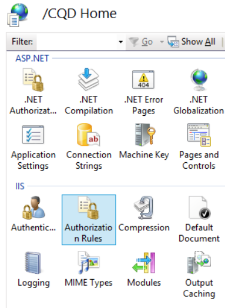

# <a name="deploy-call-quality-dashboard-for-skype-for-business-server"></a><span data-ttu-id="6dd5e-104">为 Skype for Business Server 部署呼叫质量仪表板</span><span class="sxs-lookup"><span data-stu-id="6dd5e-104">Deploy Call Quality Dashboard for Skype for Business Server</span></span>
 
<span data-ttu-id="6dd5e-105">**摘要：** 了解通话质量仪表板的部署过程。</span><span class="sxs-lookup"><span data-stu-id="6dd5e-105">**Summary:** Learn about the deployment process for Call Quality Dashboard.</span></span> <span data-ttu-id="6dd5e-106">呼叫质量仪表板是 Skype for business Server 的工具。</span><span class="sxs-lookup"><span data-stu-id="6dd5e-106">Call Quality Dashboard is a tool for Skype for Business Server.</span></span>
  
## <a name="deployment-overview"></a><span data-ttu-id="6dd5e-107">部署概述</span><span class="sxs-lookup"><span data-stu-id="6dd5e-107">Deployment Overview</span></span>

<span data-ttu-id="6dd5e-108">呼叫质量仪表板（CQD）由三个主要组件组成：</span><span class="sxs-lookup"><span data-stu-id="6dd5e-108">Call Quality Dashboard (CQD) consists of three major components:</span></span>
  
- <span data-ttu-id="6dd5e-109">**存档数据库**，其中复制和存储了体验质量（QoE）数据。</span><span class="sxs-lookup"><span data-stu-id="6dd5e-109">**Archive Database**, where the Quality of Experience (QoE) data is replicated and stored.</span></span>
    
- <span data-ttu-id="6dd5e-110">**多维数据集**，其中 QoE 存档数据库中的数据进行聚合以进行优化和快速访问。</span><span class="sxs-lookup"><span data-stu-id="6dd5e-110">**Cube**, where data from QoE Archive database is aggregated for optimized and fast access.</span></span>
    
- <span data-ttu-id="6dd5e-111">**门户**，用户可在其中轻松查询和可视化 QoE 数据。</span><span class="sxs-lookup"><span data-stu-id="6dd5e-111">**Portal**, where users can easily query and visualize QoE data.</span></span>
    

  
<span data-ttu-id="6dd5e-113">QoE 存档的设置过程包括创建 QoE 存档数据库、部署 SQL Server 存储过程，将源 QoE 指标数据库中的数据移动到 QoE 存档数据库中，并设置 SQL Server 代理作业以执行存储的过程以固定时间间隔。</span><span class="sxs-lookup"><span data-stu-id="6dd5e-113">The setup process for QoE Archive involves creating the QoE Archive database, deploying a SQL Server stored procedure that will move the data from the source QoE Metrics database into QoE Archive database, and setting up the SQL Server Agent job to execute the stored procedure at a regular interval.</span></span> 
  
<span data-ttu-id="6dd5e-114">多维数据集部署从用户处获取 QoE 存档所在的信息，部署多维数据集，并设置将定期刷新多维数据集的常规 SQL Server 代理作业。</span><span class="sxs-lookup"><span data-stu-id="6dd5e-114">Cube deployment gets information from the user on where the QoE Archive is located, deploys the cube, and sets up a regular SQL Server agent job that will refresh the cube at a regular interval.</span></span>
  
<span data-ttu-id="6dd5e-115">"门户安装" 创建存储 CQD 用户与每个用户的报表/查询的映射的存储库数据库。</span><span class="sxs-lookup"><span data-stu-id="6dd5e-115">Portal install creates a Repository database that stores the mapping of CQD users to each user's reports/queries.</span></span> <span data-ttu-id="6dd5e-116">然后，它将设置一个 IIS web 应用程序，该应用程序是用户可以在其中查看预定义报告集的仪表板，也可以自定义和创建自己的查询以可视化多维数据集中的数据。</span><span class="sxs-lookup"><span data-stu-id="6dd5e-116">It then sets up an IIS web application which is the dashboard where users can see a pre-defined set of reports as well as customize and create their own queries to visualize data from the cube.</span></span> <span data-ttu-id="6dd5e-117">门户安装创建了另外两个 web 应用程序，这些应用程序公开 Api，以便用户以编程方式访问存储库和多维数据集。</span><span class="sxs-lookup"><span data-stu-id="6dd5e-117">The portal install creates two additional web applications that exposes APIs for users to programmatically access the repository and the cube.</span></span> <span data-ttu-id="6dd5e-118">（这些 Api 也由仪表板在内部使用。）</span><span class="sxs-lookup"><span data-stu-id="6dd5e-118">(These APIs are used internally by the dashboard as well.)</span></span>
  

|<span data-ttu-id="6dd5e-119">**阶段**</span><span class="sxs-lookup"><span data-stu-id="6dd5e-119">**Phase**</span></span>|<span data-ttu-id="6dd5e-120">**步骤**</span><span class="sxs-lookup"><span data-stu-id="6dd5e-120">**Steps**</span></span>|<span data-ttu-id="6dd5e-121">**角色和组成员身份**</span><span class="sxs-lookup"><span data-stu-id="6dd5e-121">**Roles and group membership**</span></span>|<span data-ttu-id="6dd5e-122">**文档**</span><span class="sxs-lookup"><span data-stu-id="6dd5e-122">**Documentation**</span></span>|
|:-----|:-----|:-----|:-----|
|<span data-ttu-id="6dd5e-123">安装必备硬件和软件。</span><span class="sxs-lookup"><span data-stu-id="6dd5e-123">Install prerequisite hardware and software.</span></span>  <br/> |<span data-ttu-id="6dd5e-124">确定 CQD 配置，并选择要从中执行安装的 SQL Server。</span><span class="sxs-lookup"><span data-stu-id="6dd5e-124">Decide on the CQD configuration, and choose a SQL Server from which to perform the install.</span></span>  <br/> |<span data-ttu-id="6dd5e-125">属于本地 Administrators 组成员的域用户。</span><span class="sxs-lookup"><span data-stu-id="6dd5e-125">Domain user who is a member of the local administrators group.</span></span>  <br/> |<span data-ttu-id="6dd5e-126">部署文档中的 "预安装要求" 部分。</span><span class="sxs-lookup"><span data-stu-id="6dd5e-126">"Pre-install Requirements" section in the deployment documentation.</span></span>  <br/> |
|<span data-ttu-id="6dd5e-127">安装 CQD。</span><span class="sxs-lookup"><span data-stu-id="6dd5e-127">Install CQD.</span></span>  <br/> |<span data-ttu-id="6dd5e-128">运行部署文档后的 MSI。</span><span class="sxs-lookup"><span data-stu-id="6dd5e-128">Run the MSI following the deployment document.</span></span>  <br/> |<span data-ttu-id="6dd5e-129">若要执行设置，安装帐户必须是本地 administrators 组成员的域用户，并且对监控服务器上的 QoE 指标数据库具有读取权限。</span><span class="sxs-lookup"><span data-stu-id="6dd5e-129">To perform the setup, the installing account must be a domain user who is a member of the local administrators group and have read access to QoE Metrics database on the Monitoring Server.</span></span>  <br/> |<span data-ttu-id="6dd5e-130">部署文档中的 "帐户和部署步骤" 部分。</span><span class="sxs-lookup"><span data-stu-id="6dd5e-130">"Accounts and Deployment Steps" sections in the deployment documentation.</span></span>  <br/> |
|<span data-ttu-id="6dd5e-131">授予用户访问权限。</span><span class="sxs-lookup"><span data-stu-id="6dd5e-131">Grant user access.</span></span>  <br/> |<span data-ttu-id="6dd5e-132">若要管理对门户的用户授权，我们建议使用在 IIS 7.0 中引入的 URL 授权。</span><span class="sxs-lookup"><span data-stu-id="6dd5e-132">For managing user authorization to the Portal, we recommend using URL Authorization, which was introduced in IIS 7.0.</span></span> <span data-ttu-id="6dd5e-133">有关详细信息，请参阅[了解 IIS 7.0 URL 授权](https://www.iis.net/learn/manage/configuring-security/understanding-iis-url-authorization)。</span><span class="sxs-lookup"><span data-stu-id="6dd5e-133">For more information, see [Understanding IIS 7.0 URL Authorization](https://www.iis.net/learn/manage/configuring-security/understanding-iis-url-authorization).</span></span>  <br/> |<span data-ttu-id="6dd5e-134">属于本地 Administrators 组成员的域用户。</span><span class="sxs-lookup"><span data-stu-id="6dd5e-134">Domain user who is a member of the local administrators group.</span></span>  <br/> |<span data-ttu-id="6dd5e-135">在部署文档中管理 "门户" 部分的 "用户访问"。</span><span class="sxs-lookup"><span data-stu-id="6dd5e-135">Managing User Access for the Portal section in the deployment documentation.</span></span>  <br/> |
|<span data-ttu-id="6dd5e-136">可选：提供子网映射信息。</span><span class="sxs-lookup"><span data-stu-id="6dd5e-136">Optional: Provide subnet mapping information.</span></span>  <br/> |<span data-ttu-id="6dd5e-137">在 QoE 存档数据库中填充网络和构建映射表。</span><span class="sxs-lookup"><span data-stu-id="6dd5e-137">Populate network and building mapping tables in QoE Archive database.</span></span>  <br/> |<span data-ttu-id="6dd5e-138">具有对 QoE 存档数据库的写入权限的帐户。</span><span class="sxs-lookup"><span data-stu-id="6dd5e-138">An account with write access to the QoE Archive database.</span></span>  <br/> |<span data-ttu-id="6dd5e-139">User 文档中的 "提供子网信息" 部分。</span><span class="sxs-lookup"><span data-stu-id="6dd5e-139">"Supplying Subnet Information" section in the user documentation.</span></span>  <br/> |
   


<span data-ttu-id="6dd5e-140">呼叫质量仪表板的部署包括设置基础结构和安装软件。</span><span class="sxs-lookup"><span data-stu-id="6dd5e-140">Deployment of Call Quality Dashboard involves setting up the infrastructure and installing the software.</span></span> <span data-ttu-id="6dd5e-141">下面的过程概述了此过程。</span><span class="sxs-lookup"><span data-stu-id="6dd5e-141">The following procedure outlines the process.</span></span>
  
## <a name="deployment-steps"></a><span data-ttu-id="6dd5e-142">部署步骤</span><span class="sxs-lookup"><span data-stu-id="6dd5e-142">Deployment Steps</span></span>

1. <span data-ttu-id="6dd5e-143">将 CallQualityDashboard 复制到要安装 CQD 的存档数据库组件的计算机（这是安装了 SQL Server 的计算机）。</span><span class="sxs-lookup"><span data-stu-id="6dd5e-143">Copy the CallQualityDashboard.msi to the machine where the archive database component of CQD is to be installed (this is the machine that has SQL Server installed).</span></span> 
    
2. <span data-ttu-id="6dd5e-144">执行 MSI （Windows 将提示以管理员权限运行，请执行此操作）。</span><span class="sxs-lookup"><span data-stu-id="6dd5e-144">Execute the MSI (Windows will prompt to run with administrator privilege, do so).</span></span> 
    
3. <span data-ttu-id="6dd5e-145">接受 EULA。</span><span class="sxs-lookup"><span data-stu-id="6dd5e-145">Accept the EULA.</span></span>
    
4. <span data-ttu-id="6dd5e-146">选择与 "通话质量" 仪表板组件相关的文件将位于的目标文件夹，或接受默认位置。</span><span class="sxs-lookup"><span data-stu-id="6dd5e-146">Select the destination folder where files related to Call Quality Dashboard components will be located or accept the default location.</span></span>
    
5. <span data-ttu-id="6dd5e-147">选择 "所有功能"。</span><span class="sxs-lookup"><span data-stu-id="6dd5e-147">Select all features.</span></span>
    
6. <span data-ttu-id="6dd5e-148">在 "QoE 存档配置" 页上，提供以下信息：</span><span class="sxs-lookup"><span data-stu-id="6dd5e-148">At the QoE Archive Configuration page, provide the following information:</span></span>
    
   - <span data-ttu-id="6dd5e-149">**QoE 指标 SQL Server：** 用于 QoE 指标 DB 所在位置的 SQL Server 实例名称（这将是数据源）。</span><span class="sxs-lookup"><span data-stu-id="6dd5e-149">**QoE Metrics SQL Server:** SQL Server instance name for where the QoE Metrics DB is located (this will be the data source).</span></span>
    
   - <span data-ttu-id="6dd5e-150">**QoE 存档 SQL Server 名称：** 这是只读字段，并固定到本地计算机的完全限定域名。</span><span class="sxs-lookup"><span data-stu-id="6dd5e-150">**QoE Archive SQL Server Name:** This is read-only field and fixed to the fully qualified domain name of the local machine.</span></span> <span data-ttu-id="6dd5e-151">只能在本地计算机上安装存档数据库。</span><span class="sxs-lookup"><span data-stu-id="6dd5e-151">Archive DB can be installed only on the local machine.</span></span>
    
   - <span data-ttu-id="6dd5e-152">**QoE 存档 SQL Server 实例：** 要在其中创建存档数据库的本地 SQL Server 实例名称。</span><span class="sxs-lookup"><span data-stu-id="6dd5e-152">**QoE Archive SQL Server Instance:** A local SQL Server instance name for where the Archive DB is to be created.</span></span> <span data-ttu-id="6dd5e-153">若要使用默认的 SQL Server 实例，请将此字段留空。</span><span class="sxs-lookup"><span data-stu-id="6dd5e-153">To use a default SQL Server instance, leave this field blank.</span></span> <span data-ttu-id="6dd5e-154">若要使用命名的 SQL Server 实例，请指定实例名称（例如，在 ""\"之后的名称）。</span><span class="sxs-lookup"><span data-stu-id="6dd5e-154">To use a named SQL Server instance, specify the instance name (e.g. the name after the "\").</span></span>
    
   - <span data-ttu-id="6dd5e-155">**QoE 存档数据库：** 默认情况下，此选项设置为 "新建数据库"。</span><span class="sxs-lookup"><span data-stu-id="6dd5e-155">**QoE Archive Database:** By default, this option is set to "Create new database".</span></span> <span data-ttu-id="6dd5e-156">由于不支持存档数据库升级，如果现有存档数据库的架构与要安装的版本相同，则唯一可以使用 "使用现有数据库" 选项的情况。</span><span class="sxs-lookup"><span data-stu-id="6dd5e-156">Since Archive DB upgrade is not supported, the only circumstance under which the "Use existing database" option can be used is if the existing Archive database has the same schema as the build to be installed.</span></span>
    
   - <span data-ttu-id="6dd5e-157">**数据库文件目录：** 应在何处放置存档数据库的数据库文件（.mdf 和 .ldf）的路径。</span><span class="sxs-lookup"><span data-stu-id="6dd5e-157">**Database File Directory:** Path to where the database files (.mdf and .ldf) for the Archive DB should be placed.</span></span> <span data-ttu-id="6dd5e-158">这应该是独立于操作系统的驱动器上（推荐的硬件配置中的 HDD2）。</span><span class="sxs-lookup"><span data-stu-id="6dd5e-158">This should be on a drive (HDD2 in the recommended hardware configuration) separate from the OS.</span></span> <span data-ttu-id="6dd5e-159">请注意，由于文件名在安装中是固定的，因此为避免任何潜在的冲突，建议使用不包含任何文件的空白目录。</span><span class="sxs-lookup"><span data-stu-id="6dd5e-159">Note that since the file names are fixed in the install, to avoid any potential conflict, it is recommended that a blank directory with no files be used.</span></span>
    
   - <span data-ttu-id="6dd5e-160">**使用多个分区：** 默认值设置为 "多个分区"，这需要 SQL Server 的商业智能版或 Enterprise edition。</span><span class="sxs-lookup"><span data-stu-id="6dd5e-160">**Use Multiple Partitions:** The default is set to "Multiple partition", which requires Business Intelligence edition or Enterprise edition of SQL Server.</span></span> <span data-ttu-id="6dd5e-161">对于 Standard edition，请选择 "单个分区" 选项。</span><span class="sxs-lookup"><span data-stu-id="6dd5e-161">For Standard edition, select "Single Partition" option.</span></span> <span data-ttu-id="6dd5e-162">请注意，如果使用单个分区，则多维数据集处理性能可能会受到影响。</span><span class="sxs-lookup"><span data-stu-id="6dd5e-162">Note that cube processing performance may be impacted if Single Partition is used.</span></span>
    
     > [!NOTE]
     > <span data-ttu-id="6dd5e-163">在安装程序完成后，不能更改 "使用多个分区的选择" 选项。</span><span class="sxs-lookup"><span data-stu-id="6dd5e-163">The selection for Use Multiple Partitions option cannot be changed once Setup completes.</span></span> <span data-ttu-id="6dd5e-164">为了进行更改，需要先卸载多维数据集功能，然后使用控制面板中的 "更改" 选项重新安装。</span><span class="sxs-lookup"><span data-stu-id="6dd5e-164">In order to change it, the Cube feature needs to be first uninstalled and then reinstalled using "Change" option in Control Panel.</span></span> 
  
   - <span data-ttu-id="6dd5e-165">**分区文件目录：** 应在何处放置 QoE 存档数据库的分区的路径。</span><span class="sxs-lookup"><span data-stu-id="6dd5e-165">**Partition File Directory:** Path to where the partitions for the QoE Archive database should be placed.</span></span> <span data-ttu-id="6dd5e-166">这应该是与 OS 驱动器和 SQL 数据库日志文件驱动器不同的驱动器（建议的硬件配置中的 HDD3）。</span><span class="sxs-lookup"><span data-stu-id="6dd5e-166">This should be on a drive (HDD3 in the recommended hardware configuration) separate from the OS drive and SQL database log files drive.</span></span> <span data-ttu-id="6dd5e-167">请注意，由于文件名在安装中是固定的，因此为避免任何潜在的冲突，建议使用不包含任何文件的空白目录。</span><span class="sxs-lookup"><span data-stu-id="6dd5e-167">Note that since the file names are fixed in the install, to avoid any potential conflict, it is recommended that a blank directory with no files be used.</span></span>
    
   - <span data-ttu-id="6dd5e-168">**SQL 代理作业用户用户名&amp;密码：** 将用于运行 SQL Server 代理作业的 "QoE 存档数据" 步骤（将运行存储过程以将数据从 QoE 指标数据库提取到存档数据库中）的域服务帐户名称和密码（掩码）。因此，此帐户必须具有对 QoE 指标 DB 的读取访问权限，如 "帐户" 部分中所示。</span><span class="sxs-lookup"><span data-stu-id="6dd5e-168">**SQL Agent Job User - User Name &amp; Password:** Domain service account name and password (masked) that will be used to run the "QoE Archive Data" step of the SQL Server Agent job (which will run the stored procedure to fetch data from QoE Metrics DB into Archive DB, so this account must have read access to QoE Metrics DB, as indicated under Accounts section.</span></span> <span data-ttu-id="6dd5e-169">此帐户还需要在 QoE 存档 SQL Server 实例中有一个登录名。</span><span class="sxs-lookup"><span data-stu-id="6dd5e-169">This account also needs to have a login in the QoE Archive SQL Server Instance).</span></span>
    
     > [!NOTE]
     > <span data-ttu-id="6dd5e-170">运行 SQL Server 实例所依据的帐户（如 NT SERVICE\MSSQLSERVER）必须具有上述目录的访问权限，才能成功安装。</span><span class="sxs-lookup"><span data-stu-id="6dd5e-170">The account that the SQL Server instance is running under, such as NT SERVICE\MSSQLSERVER, must have access/permission to the directories given above for the installation to succeed.</span></span> <span data-ttu-id="6dd5e-171">有关详细信息，请参阅[配置文件系统权限以进行数据库引擎访问](https://msdn.microsoft.com/library/jj219062%28v=sql.110%29.aspx)</span><span class="sxs-lookup"><span data-stu-id="6dd5e-171">For details, see [Configure File System Permissions for Database Engine Access](https://msdn.microsoft.com/library/jj219062%28v=sql.110%29.aspx)</span></span>
  
7. <span data-ttu-id="6dd5e-172">单击 "下一步" 后，安装程序将执行先决条件检查，并在遇到任何问题时报告。</span><span class="sxs-lookup"><span data-stu-id="6dd5e-172">Upon clicking next, the installer will perform pre-requisite checks and report if any issues are encountered.</span></span> <span data-ttu-id="6dd5e-173">当所有的先决条件检查都通过后，安装程序将转到 "多维数据集配置" 页。</span><span class="sxs-lookup"><span data-stu-id="6dd5e-173">When all pre-requisite checks pass, the installer will go to the Cube Configuration page.</span></span> 
    
    > [!NOTE]
    > <span data-ttu-id="6dd5e-174">如果安装程序显示一条警告消息，指出 QoE 存档 SQL Server 实例的 SQL Server 代理服务当前未运行，则可以继续安装，但安装后请确保 SQL 代理服务正在运行，并将启动类型设置为"自动"，以便运行计划的作业。</span><span class="sxs-lookup"><span data-stu-id="6dd5e-174">If the installer shows a warning message that the SQL Server Agent service for the QoE Archive SQL Server instance is currently not running, installation can proceed, but post installation please make sure that SQL Agent service is running and set the Startup type to Automatic so that the scheduled Job runs.</span></span> 
  
8. <span data-ttu-id="6dd5e-175">在 "多维数据集配置" 页上，提供以下信息：</span><span class="sxs-lookup"><span data-stu-id="6dd5e-175">At Cube Configuration page, provide the following information:</span></span>
    
   - <span data-ttu-id="6dd5e-176">**QoE 存档 SQL Server 名称：** 这是只读字段，并固定到本地计算机的完全限定域名。</span><span class="sxs-lookup"><span data-stu-id="6dd5e-176">**QoE Archive SQL Server Name:** This is read-only field and fixed to the fully qualified domain name of the local machine.</span></span> <span data-ttu-id="6dd5e-177">只能从具有 QoE 存档数据库（注释）的计算机安装多维数据集。</span><span class="sxs-lookup"><span data-stu-id="6dd5e-177">Cube can be installed only from the machine that has QoE Archive database (Note.</span></span> <span data-ttu-id="6dd5e-178">多维数据集本身可以安装在远程计算机上。</span><span class="sxs-lookup"><span data-stu-id="6dd5e-178">Cube itself may be installed on a remote machine.</span></span> <span data-ttu-id="6dd5e-179">见下文）</span><span class="sxs-lookup"><span data-stu-id="6dd5e-179">See below)</span></span>
    
   - <span data-ttu-id="6dd5e-180">**QoE 存档 SQL Server 实例：** QoE 存档数据库所在位置的 SQL Server 实例名称。</span><span class="sxs-lookup"><span data-stu-id="6dd5e-180">**QoE Archive SQL Server Instance:** SQL Server instance name for where the QoE Archive DB is located.</span></span> <span data-ttu-id="6dd5e-181">若要指定默认的 SQL Server 实例，请将此字段留空。</span><span class="sxs-lookup"><span data-stu-id="6dd5e-181">To specify a default SQL Server instance, leave this field blank.</span></span> <span data-ttu-id="6dd5e-182">若要指定命名的 SQL Server 实例，请输入实例名称（例如，在 ""\"之后的名称）。</span><span class="sxs-lookup"><span data-stu-id="6dd5e-182">To specify a named SQL Server instance, enter the instance name (e.g. the name after the "\").</span></span> <span data-ttu-id="6dd5e-183">如果为安装选择了 QoE 存档组件，则此字段将预先填充在 QoE 存档配置页上提供的值。</span><span class="sxs-lookup"><span data-stu-id="6dd5e-183">If QoE Archive component was selected for the install, this field will be pre-populated with the value provided on the QoE Archive Configuration page.</span></span>
    
   - <span data-ttu-id="6dd5e-184">**多维数据集分析服务器：** 要在其中创建多维数据集的 SQL Server Analysis Service 实例名称。</span><span class="sxs-lookup"><span data-stu-id="6dd5e-184">**Cube Analysis Server:** SQL Server Analysis Service instance name for where the cube is to be created.</span></span> <span data-ttu-id="6dd5e-185">这可以是不同的计算机，但安装用户必须是目标 SQL Server Analysis Service 实例的服务器管理员的成员。</span><span class="sxs-lookup"><span data-stu-id="6dd5e-185">This can be a different machine but the installing user has to be a member of Server administrators of the target SQL Server Analysis Service instance.</span></span>
    
     > [!NOTE]
     >  <span data-ttu-id="6dd5e-186">有关配置 Analysis Services 服务器管理员权限的详细信息，请参阅[授予服务器管理员权限（Analysis Services）](https://msdn.microsoft.com/library/ms174561.aspx)</span><span class="sxs-lookup"><span data-stu-id="6dd5e-186">For more information about configuring Analysis Services Server Administrator Permissions, see [Grant Server Administrator Permissions (Analysis Services)](https://msdn.microsoft.com/library/ms174561.aspx)</span></span>
  
   - <span data-ttu-id="6dd5e-187">**使用多个分区：** 默认值设置为 "多个分区"，这需要 SQL Server 的商业智能版或 Enterprise edition。</span><span class="sxs-lookup"><span data-stu-id="6dd5e-187">**Use Multiple Partitions:** The default is set to "Multiple partition", which requires Business Intelligence edition or Enterprise edition of SQL Server.</span></span> <span data-ttu-id="6dd5e-188">对于 Standard edition，请选择 "单个分区" 选项。</span><span class="sxs-lookup"><span data-stu-id="6dd5e-188">For Standard edition, select "Single Partition" option.</span></span> <span data-ttu-id="6dd5e-189">请注意，如果使用单个分区，则多维数据集处理性能可能会受到影响。</span><span class="sxs-lookup"><span data-stu-id="6dd5e-189">Note that cube processing performance may be impacted if Single Partition is used .</span></span>
    
     > [!NOTE]
     >  <span data-ttu-id="6dd5e-190">在安装程序完成后，不能更改 "使用多个分区的选择" 选项。</span><span class="sxs-lookup"><span data-stu-id="6dd5e-190">The selection for Use Multiple Partitions option cannot be changed once Setup completes.</span></span> <span data-ttu-id="6dd5e-191">为了进行更改，需要先卸载多维数据集功能，然后使用控制面板中的 "更改" 选项重新安装。</span><span class="sxs-lookup"><span data-stu-id="6dd5e-191">In order to change it, the Cube feature needs to be first uninstalled and then reinstalled using "Change" option in Control Panel.</span></span>
  
   - <span data-ttu-id="6dd5e-192">**多维数据集用户用户名&amp;密码：** 将触发多维数据集处理的域服务帐户的名称和密码（掩码）。</span><span class="sxs-lookup"><span data-stu-id="6dd5e-192">**Cube User - User Name &amp; Password:** Domain service account name and password (masked) that will trigger the cube processing.</span></span> <span data-ttu-id="6dd5e-193">如果为安装选择了 "QoE 存档" 组件，则此字段将预先填充为 SQL 代理作业用户的 "存档配置" 页上提供的值，但我们建议指定一个不同的域服务帐户，以便安装程序可以授予对其所需的最低权限。</span><span class="sxs-lookup"><span data-stu-id="6dd5e-193">If QoE Archive component was selected for the install, this field will be pre-populated with the value provided on the Archive Configuration page for the SQL Agent Job User, but we recommend specifying a different domain service account so that Setup can grant the least required privilege to it.</span></span>
    
9. <span data-ttu-id="6dd5e-194">单击 "下一步" 时，将执行另一轮验证，并将报告任何问题。</span><span class="sxs-lookup"><span data-stu-id="6dd5e-194">When clicking next, another round of validation will be performed and any issue will be reported.</span></span> <span data-ttu-id="6dd5e-195">成功完成验证后，安装程序将转到 "门户配置" 页。</span><span class="sxs-lookup"><span data-stu-id="6dd5e-195">Upon successful completion of the validation, the installer will go to the Portal Configuration page.</span></span> 
    
10. <span data-ttu-id="6dd5e-196">在 "门户配置" 页上，提供以下信息：</span><span class="sxs-lookup"><span data-stu-id="6dd5e-196">At Portal Configuration page, provide the following information:</span></span>
    
    - <span data-ttu-id="6dd5e-197">**QoE 存档 SQL Server：** QoE 存档数据库所在位置的 SQL Server 实例名称。</span><span class="sxs-lookup"><span data-stu-id="6dd5e-197">**QoE Archive SQL Server:** SQL Server instance name for where the QoE Archive database is located.</span></span> <span data-ttu-id="6dd5e-198">请注意，与 QoE 存档配置页和多维数据集配置页不同，计算机名称不是固定的，必须提供。</span><span class="sxs-lookup"><span data-stu-id="6dd5e-198">Note that unlike the QoE Archive Configuration page and the Cube Configuration page, the machine name is not fixed and must be provided.</span></span> <span data-ttu-id="6dd5e-199">如果为安装选择了 QoE 存档组件，则此字段将预先填充在 QoE 存档配置页上提供的值。</span><span class="sxs-lookup"><span data-stu-id="6dd5e-199">If QoE Archive component was selected for the install, this field will be pre-populated with the value provided on the QoE Archive Configuration page.</span></span>
    
    - <span data-ttu-id="6dd5e-200">**多维数据集分析服务器：** 多维数据集所在位置的 SQL Server Analysis Service 实例名称。</span><span class="sxs-lookup"><span data-stu-id="6dd5e-200">**Cube Analysis Server:** SQL Server Analysis Service instance name for where the cube is located.</span></span> <span data-ttu-id="6dd5e-201">如果为安装选择了多维数据集组件，则此字段将预先填充 "多维数据集配置" 页上提供的值。</span><span class="sxs-lookup"><span data-stu-id="6dd5e-201">If Cube component was selected for the install, this field will be pre-populated with the value provided on the Cube Configuration page.</span></span>
    
    - <span data-ttu-id="6dd5e-202">**存储库 SQL Server：** 要在其中创建存储库数据库的 SQL Server 实例名称。</span><span class="sxs-lookup"><span data-stu-id="6dd5e-202">**Repository SQL Server:** SQL Server instance name where the Repository database is to be created.</span></span> <span data-ttu-id="6dd5e-203">如果 QoE 存档数据库所在的 SQL Server 实例名称在安装程序的早期（在其他组件中）中已提供，则将使用 QoE 存档数据库 SQL Server 实例名称预填充此字段。</span><span class="sxs-lookup"><span data-stu-id="6dd5e-203">If the SQL Server instance name for where the QoE Archive database is located has been provided earlier in the setup (in other components), this field will be pre-populated with the QoE Archive DB SQL Server instance name.</span></span> <span data-ttu-id="6dd5e-204">它可以是任何 SQL Server 实例。</span><span class="sxs-lookup"><span data-stu-id="6dd5e-204">This can be any SQL Server instance.</span></span>
    
    - <span data-ttu-id="6dd5e-205">**存储库数据库：** 默认情况下，此选项设置为 "新建数据库"。</span><span class="sxs-lookup"><span data-stu-id="6dd5e-205">**Repository Database:** By default the option is set to "Create new database".</span></span> <span data-ttu-id="6dd5e-206">由于不支持存储库数据库升级，如果现有存储库数据库的架构与要安装的版本相同，则唯一可以使用 "使用现有数据库" 选项的情况。</span><span class="sxs-lookup"><span data-stu-id="6dd5e-206">Since Repository DB upgrade is not supported, the only circumstance under which the "Use existing database" option can be used is if the existing Repository DB has the same schema as the build to be installed.</span></span>
    
    - <span data-ttu-id="6dd5e-207">**IIS 应用程序池用户用户名&amp;密码：** IIS 应用程序池应在其下执行的帐户。</span><span class="sxs-lookup"><span data-stu-id="6dd5e-207">**IIS App Pool User - User Name &amp; Password:** The account that the IIS application pool should execute under.</span></span> <span data-ttu-id="6dd5e-208">如果选择了内置系统帐户，则 "用户名" 和 "密码" 字段将灰显。</span><span class="sxs-lookup"><span data-stu-id="6dd5e-208">The User Name and Password fields will be grayed out if built-in system accounts are selected.</span></span> <span data-ttu-id="6dd5e-209">仅当从下拉框中选择了 "其他" 时，才会启用这些字段，以便用户可以输入域服务帐户信息。</span><span class="sxs-lookup"><span data-stu-id="6dd5e-209">These fields will only be enabled if "Other" is selected from the drop down box so the user can enter the domain service account information.</span></span>
    
11. <span data-ttu-id="6dd5e-210">单击 "下一步" 时，将执行最后一轮验证，以确保 SQL Server 实例可使用提供的凭据访问，并且该 IIS 在计算机上可用。</span><span class="sxs-lookup"><span data-stu-id="6dd5e-210">When clicking next, the final round of validation will be done to ensure that the SQL Server instances are accessible using the credentials provided and that IIS is available on the machine.</span></span> <span data-ttu-id="6dd5e-211">成功完成验证后，安装程序将继续进行设置。</span><span class="sxs-lookup"><span data-stu-id="6dd5e-211">Upon successful completion of the validation, the installer will proceed with the setup.</span></span> 
    
<span data-ttu-id="6dd5e-212">安装程序完成后，最有可能的原因是 SQL Server 代理作业正在进行，并执行 QoE 数据的初始加载和多维数据集处理。</span><span class="sxs-lookup"><span data-stu-id="6dd5e-212">When the installer is done, most likely the SQL Server Agent job will be in progress, doing the initial load of the QoE data and the cube processing.</span></span> <span data-ttu-id="6dd5e-213">根据 QoE 中的数据量，门户将不包含可供查看的数据。</span><span class="sxs-lookup"><span data-stu-id="6dd5e-213">Depending on the amount of data in QoE, the portal will not have data available for viewing yet.</span></span> <span data-ttu-id="6dd5e-214">若要检查数据加载和多维数据集处理的状态，请转`http://<machinename>/CQD/#/Health`到。</span><span class="sxs-lookup"><span data-stu-id="6dd5e-214">To check on the status of the data load and cube processing, go to  `http://<machinename>/CQD/#/Health`.</span></span> 
> [!NOTE]
> <span data-ttu-id="6dd5e-215">请注意，用于检查下载多维数据集的状态的 URL 是区分大小写的。</span><span class="sxs-lookup"><span data-stu-id="6dd5e-215">Note that the URL for checking the status of the download cube processing is case sensitive.</span></span> <span data-ttu-id="6dd5e-216">如果输入 "运行状况"，则 URL 将不起作用。</span><span class="sxs-lookup"><span data-stu-id="6dd5e-216">If you enter 'health' the URL will not work.</span></span> <span data-ttu-id="6dd5e-217">必须在具有大写 H 的 URL 末尾处输入 "Health"。</span><span class="sxs-lookup"><span data-stu-id="6dd5e-217">You must enter 'Health' at the end of the URL with a capital H.</span></span> 
  
<span data-ttu-id="6dd5e-218">如果启用了调试模式，则将显示详细的日志消息。</span><span class="sxs-lookup"><span data-stu-id="6dd5e-218">Detailed log messages will be shown if debug mode is enabled.</span></span> <span data-ttu-id="6dd5e-219">若要启用调试模式，请转到 **%SYSTEMDRIVE%\Program Files\Skype For Business 2015 CQD\QoEDataService\web.config**，并更新以下行，以便将该值设置为**True**：</span><span class="sxs-lookup"><span data-stu-id="6dd5e-219">To enable debug mode, go to **%SYSTEMDRIVE%\Program Files\Skype For Business 2015 CQD\QoEDataService\web.config**, and update the following line so the value is set to **True**:</span></span>

```xml
<add key="QoEDataLib.DebugMode" value="True" /> 
```

<span data-ttu-id="6dd5e-220">可通过`http://<machinename>/CQD`访问主门户页面。</span><span class="sxs-lookup"><span data-stu-id="6dd5e-220">The main portal page is accessible via  `http://<machinename>/CQD`.</span></span> 
## <a name="managing-user-access-for-the-portal"></a><span data-ttu-id="6dd5e-221">管理门户的用户访问权限</span><span class="sxs-lookup"><span data-stu-id="6dd5e-221">Managing User Access for the Portal</span></span>

<span data-ttu-id="6dd5e-222">若要管理对门户的用户授权，我们建议使用在 IIS 7.0 中引入的 URL 授权。</span><span class="sxs-lookup"><span data-stu-id="6dd5e-222">For managing user authorization to the Portal, we recommend using URL Authorization, which was introduced in IIS 7.0.</span></span> <span data-ttu-id="6dd5e-223">有关 IIS 安全性的详细信息，请参阅[了解 iis 7.0 URL 授权](https://www.iis.net/learn/manage/configuring-security/understanding-iis-url-authorization)。</span><span class="sxs-lookup"><span data-stu-id="6dd5e-223">For more information on IIS security, see [Understanding IIS 7.0 URL Authorization](https://www.iis.net/learn/manage/configuring-security/understanding-iis-url-authorization).</span></span>
  
<span data-ttu-id="6dd5e-224">任何网站或 web 应用程序都会继承为整个 IIS （通常为 "允许所有用户"）配置的默认 URL 授权。</span><span class="sxs-lookup"><span data-stu-id="6dd5e-224">Any web site or web application inherit the default URL Authorization configured for the entire IIS, which is typically "Allow All Users".</span></span> <span data-ttu-id="6dd5e-225">如果对门户的访问需要更具限制性，则管理员可以通过编辑 "授权规则" 仅授予特定用户组的访问权限。</span><span class="sxs-lookup"><span data-stu-id="6dd5e-225">If access to the Portal needs to be more restrictive, then administrators can grant access to only the specific group of users by editing the "Authorization Rules".</span></span>
  

  
> [!NOTE]
> <span data-ttu-id="6dd5e-227">"授权规则" 图标不会与 "ASP.NET" 部分下的 ".NET 授权" 相混淆，后者是一种不同的授权机制。</span><span class="sxs-lookup"><span data-stu-id="6dd5e-227">The Authorization Rules icon is not to be confused with the ".NET Authorization" under the ASP.NET section, which is a different authorization mechanism.</span></span> 
  
<span data-ttu-id="6dd5e-228">管理员应首先删除继承的 "允许所有用户" 规则。</span><span class="sxs-lookup"><span data-stu-id="6dd5e-228">Administrators should first remove the inherited "Allow All Users" rule.</span></span> <span data-ttu-id="6dd5e-229">这将阻止任何未授权的用户访问门户。</span><span class="sxs-lookup"><span data-stu-id="6dd5e-229">This prevents any non-authorized users from accessing the Portal.</span></span>
  

  
<span data-ttu-id="6dd5e-231">接下来，管理员应添加新的允许规则，并向特定用户授予访问门户的权限。</span><span class="sxs-lookup"><span data-stu-id="6dd5e-231">Next, administrators should add new Allow Rules and give specific users the permission to access the Portal.</span></span> <span data-ttu-id="6dd5e-232">建议创建一个名为 "CQDPortalUsers" 的本地组来管理用户。</span><span class="sxs-lookup"><span data-stu-id="6dd5e-232">It is recommended that a local Group called "CQDPortalUsers" be created to manage the users.</span></span>
  

  
<span data-ttu-id="6dd5e-234">配置详细信息存储在位于门户的物理目录中的 web.config 中。</span><span class="sxs-lookup"><span data-stu-id="6dd5e-234">The configuration details are stored in the web.config located at the Portal's physical directory.</span></span>
  
```xml
<?xml version="1.0" encoding="UTF-8"?> <configuration> <system.webServer> <security> <authorization> <remove users="*" roles="" verbs="" /> <add accessType="Allow" roles="CQDPortalUsers" /> </authorization> </security> </system.webServer> </configuration> 
```

<span data-ttu-id="6dd5e-235">下一步是配置 CQD 的仪表板。</span><span class="sxs-lookup"><span data-stu-id="6dd5e-235">The next step is to configure the dashboard of the CQD.</span></span> <span data-ttu-id="6dd5e-236">通过 IIS 对用户进行身份验证后，他们必须具有对 CQD 目录的文件权限，才能访问 web 门户内容。</span><span class="sxs-lookup"><span data-stu-id="6dd5e-236">After users are authenticated by IIS, they will have to have file permissions on the CQD directory in order to access the web portal content.</span></span> <span data-ttu-id="6dd5e-237">可以通过 CQD 目录属性的 "安全" 选项卡更改 Acl，以添加单个用户或组;但是，建议的方法是使文件权限保持不变。</span><span class="sxs-lookup"><span data-stu-id="6dd5e-237">It is possible to change the ACLs through the security tab of the CQD directory properties to add individual users or groups; however the recommended approach is to leave the file permissions untouched.</span></span> <span data-ttu-id="6dd5e-238">相反，请将 IIS 设置更改为使用 IIS 工作进程访问 CQD 目录，而不管对哪个用户进行身份验证。</span><span class="sxs-lookup"><span data-stu-id="6dd5e-238">Instead, change the IIS setting to use the IIS worker process to access the CQD directory no matter which user is authenticated.</span></span> 
  
> [!IMPORTANT]
> <span data-ttu-id="6dd5e-239">一定要只更改 CQD 应用程序的此设置，而不是对这两个 API 应用程序： QoEDataService 和 QoERepositoryService。</span><span class="sxs-lookup"><span data-stu-id="6dd5e-239">It is important to only change this setting for the CQD application, and not for the two API applications: QoEDataService and QoERepositoryService.</span></span> 
  
## <a name="configuring-file-access-for-the-cqd-dashboard"></a><span data-ttu-id="6dd5e-240">为 CQD 配置文件访问（仪表板）</span><span class="sxs-lookup"><span data-stu-id="6dd5e-240">Configuring File Access for the CQD (Dashboard)</span></span>

1. <span data-ttu-id="6dd5e-241">打开 CQD 的配置编辑器。</span><span class="sxs-lookup"><span data-stu-id="6dd5e-241">Open the Configuration Editor for CQD.</span></span>
    
     
  
2. <span data-ttu-id="6dd5e-243">在 "部分" 中，选择 " **system.webserver/microsoft.sharepoint.client.serverruntime.dll**"。</span><span class="sxs-lookup"><span data-stu-id="6dd5e-243">Under Section, choose **system.webServer/serverRuntime**.</span></span>
    
     
  
3. <span data-ttu-id="6dd5e-245">将 authenticatedUserOverride 更改为**UseWorkerProcessUser**。</span><span class="sxs-lookup"><span data-stu-id="6dd5e-245">Change authenticatedUserOverride to **UseWorkerProcessUser**.</span></span>
    
     
  
4. <span data-ttu-id="6dd5e-247">在页面右侧，单击 "**应用**"。</span><span class="sxs-lookup"><span data-stu-id="6dd5e-247">Click **Apply** on the right-hand side of the page.</span></span>
    
## <a name="known-issues"></a><span data-ttu-id="6dd5e-248">已知问题</span><span class="sxs-lookup"><span data-stu-id="6dd5e-248">Known Issues</span></span>

### <a name="the-cqd-shows-no-data-after-deployment"></a><span data-ttu-id="6dd5e-249">CQD 在部署后不显示数据</span><span class="sxs-lookup"><span data-stu-id="6dd5e-249">The CQD shows no data after deployment</span></span>

<span data-ttu-id="6dd5e-250">您可能会收到以下错误消息：</span><span class="sxs-lookup"><span data-stu-id="6dd5e-250">You may receive the following error:</span></span>

<span data-ttu-id="6dd5e-251">*在多维数据集中运行查询时，无法执行查询。使用查询编辑器修改查询并修复任何问题。此外，请确保多维数据集可供访问。*</span><span class="sxs-lookup"><span data-stu-id="6dd5e-251">*We couldn’t perform the query while running it on the Cube. Use the Query Editor to modify the query and fix any issues. Also make sure that the Cube is accessible.*</span></span>

<span data-ttu-id="6dd5e-252">这意味着在 CQD 中使用多维数据集之前，必须在 SQL Server Analysis Services 中对其进行处理。</span><span class="sxs-lookup"><span data-stu-id="6dd5e-252">This means that the cube must be processed in SQL Server Analysis Services prior to being used in CQD.</span></span> <span data-ttu-id="6dd5e-253">若要解决此问题，可以执行以下步骤：</span><span class="sxs-lookup"><span data-stu-id="6dd5e-253">You can resolve this by following these steps:</span></span>

1. <span data-ttu-id="6dd5e-254">打开 SQL Management Studio 并选择 " **Analysis Services**"。</span><span class="sxs-lookup"><span data-stu-id="6dd5e-254">Open SQL Management Studio and select **Analysis Services**.</span></span>

2. <span data-ttu-id="6dd5e-255">展开**QoECube**对象，选择 " **QoE 指标**"，单击鼠标右键，然后选择 "**浏览**"。</span><span class="sxs-lookup"><span data-stu-id="6dd5e-255">Expand the **QoECube** object, select **QoE Metric**, right-click, and then choose **Browse**.</span></span> 

    <span data-ttu-id="6dd5e-256">如果这将返回空浏览器，则该多维数据集尚未继续。</span><span class="sxs-lookup"><span data-stu-id="6dd5e-256">If this returns empty browser, the cube hasn’t been proceed yet.</span></span>

3. <span data-ttu-id="6dd5e-257">右键单击 " **QoE 公制**angain"，然后选择 "**处理**"。</span><span class="sxs-lookup"><span data-stu-id="6dd5e-257">Right-click **QoE Metric** angain and choose **Process**.</span></span>

4. <span data-ttu-id="6dd5e-258">处理完成后，再次右键单击对象，然后选择 "**浏览**" 以确认浏览器页现在显示数据。</span><span class="sxs-lookup"><span data-stu-id="6dd5e-258">When processing is complete, right-click the object again, and choose **Browse** to confirm that the browser page now shows data.</span></span> 


### <a name="users-have-trouble-logging-in-because-installer-fails-to-create-the-correct-settings-in-iis"></a><span data-ttu-id="6dd5e-259">用户在登录时遇到问题，因为安装程序无法在 IIS 中创建正确设置</span><span class="sxs-lookup"><span data-stu-id="6dd5e-259">Users have trouble logging in because installer fails to create the correct settings in IIS</span></span>

<span data-ttu-id="6dd5e-260">在极少数情况下，安装程序无法在 IIS 中创建正确的设置。</span><span class="sxs-lookup"><span data-stu-id="6dd5e-260">In rare cases, the installer fails to create the correct settings in IIS.</span></span> <span data-ttu-id="6dd5e-261">若要允许用户登录到 CQD，需要进行手动更改。</span><span class="sxs-lookup"><span data-stu-id="6dd5e-261">Manual change is required to allow users to log into the CQD.</span></span> <span data-ttu-id="6dd5e-262">如果用户登录时遇到问题，请按照以下步骤操作：</span><span class="sxs-lookup"><span data-stu-id="6dd5e-262">If users are having trouble logging in, please follow these steps:</span></span>
  
1. <span data-ttu-id="6dd5e-263">打开 IIS 管理器，导航到 "默认网站"。</span><span class="sxs-lookup"><span data-stu-id="6dd5e-263">Open up IIS Manager, and navigate to Default Web Site.</span></span>
    
     
  
2. <span data-ttu-id="6dd5e-265">单击 "身份验证"。</span><span class="sxs-lookup"><span data-stu-id="6dd5e-265">Click on "Authentication".</span></span> <span data-ttu-id="6dd5e-266">如果 "匿名身份验证"、"ASP.NET 模拟"、"表单身份验证" 和 "Windows 身份验证" 与下面显示的设置不匹配，请手动将其更改为与下面的设置相匹配。</span><span class="sxs-lookup"><span data-stu-id="6dd5e-266">If the "Anonymous Authentication", "ASP.NET Impersonation", "Form Authentication", and "Windows Authentication" do not match the settings shown below, manually change them to match the settings below.</span></span> <span data-ttu-id="6dd5e-267">应禁用所有其他身份验证机制。</span><span class="sxs-lookup"><span data-stu-id="6dd5e-267">All other authentication mechanisms should be disabled.</span></span>
    
     
  
3. <span data-ttu-id="6dd5e-269">对于 "Windows 身份验证"，单击右侧的 "高级设置"。</span><span class="sxs-lookup"><span data-stu-id="6dd5e-269">For "Windows Authentication", click on Advanced Settings on the right-hand side.</span></span>
    
     
  
4. <span data-ttu-id="6dd5e-271">设置 "扩展保护" 以接受并选中 "启用内核模式身份验证" 框。</span><span class="sxs-lookup"><span data-stu-id="6dd5e-271">Set "Extended Protection" to Accept and check the "Enable Kernel-mode authentication" box.</span></span>
    
     
  
5. <span data-ttu-id="6dd5e-273">对以下每个 "CQD"、"QoEDataService" 和 "QoERepositoryService" 条目重复上述步骤 "Default Web Site"。</span><span class="sxs-lookup"><span data-stu-id="6dd5e-273">Repeat the above steps for each of the "CQD", "QoEDataService", and "QoERepositoryService" entries below "Default Web Site".</span></span>
    
<span data-ttu-id="6dd5e-274">对于 HTTP 和 HTTPS 端口绑定，安装程序将在默认端口号（端口 80 for HTTP，端口443用于 HTTPS）上创建端口绑定。</span><span class="sxs-lookup"><span data-stu-id="6dd5e-274">For HTTP and HTTPS port bindings the installer will create port bindings on the default port numbers (port 80 for HTTP and port 443 for HTTPS).</span></span> <span data-ttu-id="6dd5e-275">如果计算机上存在使用这些绑定的另一个网站，将存在冲突，无法预测 IIS 行为。</span><span class="sxs-lookup"><span data-stu-id="6dd5e-275">If there is another website on the machine that uses these bindings, there will be a conflict and the IIS behavior cannot be predicted.</span></span> <span data-ttu-id="6dd5e-276">避免此问题的最好方法是，在安装 CQD 之前，确保没有其他网站映射到端口80和443。</span><span class="sxs-lookup"><span data-stu-id="6dd5e-276">The best way to avoid this problem is to make sure that no other websites are mapped to ports 80 and 443 before installing CQD.</span></span> 
  
<span data-ttu-id="6dd5e-277">在 IIS 中启用 SSL/TLS，并强制用户通过安全 HTTPS （而不是 HTTP）进行连接：</span><span class="sxs-lookup"><span data-stu-id="6dd5e-277">To enable SSL/TLS in IIS and force users to connect via secure HTTPS instead of HTTP:</span></span>
  
1. <span data-ttu-id="6dd5e-278">在 IIS 中配置安全套接字层，请参阅[在 iis 7 中配置安全套接字层](https://technet.microsoft.com/library/cc771438%28v=ws.10%29.aspx)。</span><span class="sxs-lookup"><span data-stu-id="6dd5e-278">Configure Secure Sockets Layer in IIS, see [Configuring Secure Sockets Layer in IIS 7](https://technet.microsoft.com/library/cc771438%28v=ws.10%29.aspx).</span></span> <span data-ttu-id="6dd5e-279">完成后，将`http`替换`https`为。</span><span class="sxs-lookup"><span data-stu-id="6dd5e-279">Once done, replace  `http` with `https`.</span></span>
    
2. <span data-ttu-id="6dd5e-280">有关在 SQL Server 连接中启用 TLS 的说明，请参阅[如何使用 Microsoft 管理控制台为 SQL server 实例启用 SSL 加密](https://support.microsoft.com/kb/316898/)。</span><span class="sxs-lookup"><span data-stu-id="6dd5e-280">For instructions on enabling TLS in the SQL Server connections, see [How to enable SSL encryption for an instance of SQL Server by using Microsoft Management Console](https://support.microsoft.com/kb/316898/).</span></span>
    
## <a name="cube-sync-fails"></a><span data-ttu-id="6dd5e-281">多维数据集同步失败</span><span class="sxs-lookup"><span data-stu-id="6dd5e-281">Cube Sync Fails</span></span>

<span data-ttu-id="6dd5e-282">QoEMetrics 可能包含基于最终用户时钟的一些无效记录。</span><span class="sxs-lookup"><span data-stu-id="6dd5e-282">QoEMetrics may contain some invalid records based on end user clocks.</span></span> <span data-ttu-id="6dd5e-283">如果时间偏差大于 60 yrs，多维数据集导入将失败。</span><span class="sxs-lookup"><span data-stu-id="6dd5e-283">If the time skew is greater than 60 yrs, the cube import will fail.</span></span>
  
 <span data-ttu-id="6dd5e-284">使用下面的选择检查 Min 和 Max StartTime/EndTime。</span><span class="sxs-lookup"><span data-stu-id="6dd5e-284">Check the Min and Max StartTime/EndTime using the selections below.</span></span> <span data-ttu-id="6dd5e-285">查找和删除在过去和远较远的将来记录，可以忽略它们，它们将分解同步过程。</span><span class="sxs-lookup"><span data-stu-id="6dd5e-285">Look for and delete records in the far past and very distant future, they can be disregarded and they will break up the sync processes.</span></span>
  
- <span data-ttu-id="6dd5e-286">从 CqdPartitionedStreamView 中选择最小值（StartTime）</span><span class="sxs-lookup"><span data-stu-id="6dd5e-286">Select MIN(StartTime) FROM CqdPartitionedStreamView</span></span>
    
- <span data-ttu-id="6dd5e-287">从 CqdPartitionedStreamView 中选择 "最大值（StartTime）"</span><span class="sxs-lookup"><span data-stu-id="6dd5e-287">Select MAX(StartTime) FROM CqdPartitionedStreamView</span></span>
    
- <span data-ttu-id="6dd5e-288">从 CqdPartitionedStreamView 中选择最小值（EndTime）</span><span class="sxs-lookup"><span data-stu-id="6dd5e-288">Select MIN(EndTime) FROM CqdPartitionedStreamView</span></span>
    
- <span data-ttu-id="6dd5e-289">选择 CqdPartitionedStreamView 中的 MAX （EndTime）</span><span class="sxs-lookup"><span data-stu-id="6dd5e-289">Select MAX(EndTime) FROM CqdPartitionedStreamView</span></span>
    
## <a name="post-install-tasks"></a><span data-ttu-id="6dd5e-290">安装后任务</span><span class="sxs-lookup"><span data-stu-id="6dd5e-290">Post-install tasks</span></span>

### <a name="importing-buildings-and-networks"></a><span data-ttu-id="6dd5e-291">导入建筑物和网络</span><span class="sxs-lookup"><span data-stu-id="6dd5e-291">Importing Buildings and Networks</span></span>

<span data-ttu-id="6dd5e-292">安装 CQD 后，请执行以下配置任务：</span><span class="sxs-lookup"><span data-stu-id="6dd5e-292">After Installing CQD, perform the following configuration tasks:</span></span>
  
1. <span data-ttu-id="6dd5e-293">定义生成类型（推荐）</span><span class="sxs-lookup"><span data-stu-id="6dd5e-293">Define Building types (recommended)</span></span>
    
2. <span data-ttu-id="6dd5e-294">定义建筑物所有权类型（推荐）</span><span class="sxs-lookup"><span data-stu-id="6dd5e-294">Define Building Ownership types (recommended)</span></span>
    
3. <span data-ttu-id="6dd5e-295">定义网络类型（强烈推荐）</span><span class="sxs-lookup"><span data-stu-id="6dd5e-295">Define Network types (highly recommended)</span></span>
    
4. <span data-ttu-id="6dd5e-296">导入建筑物（推荐）</span><span class="sxs-lookup"><span data-stu-id="6dd5e-296">Import Buildings (recommended)</span></span>
    
5. <span data-ttu-id="6dd5e-297">导入子网（推荐）</span><span class="sxs-lookup"><span data-stu-id="6dd5e-297">Import Subnets (recommended)</span></span>
    
### <a name="define-building-types"></a><span data-ttu-id="6dd5e-298">定义建筑物类型</span><span class="sxs-lookup"><span data-stu-id="6dd5e-298">Define Building Types</span></span>

<span data-ttu-id="6dd5e-299">生成类型用于描述组织中的不同建筑物定义或类型。</span><span class="sxs-lookup"><span data-stu-id="6dd5e-299">Building types are used to describe the different buildings definitions or types within your organization.</span></span> 
  
> [!NOTE]
> <span data-ttu-id="6dd5e-300">此步骤是可选的，但建议这样做。</span><span class="sxs-lookup"><span data-stu-id="6dd5e-300">This step is optional, but recommended.</span></span> 
  
<span data-ttu-id="6dd5e-301">示例</span><span class="sxs-lookup"><span data-stu-id="6dd5e-301">Examples</span></span>
  
- <span data-ttu-id="6dd5e-302">总部</span><span class="sxs-lookup"><span data-stu-id="6dd5e-302">Headquarters</span></span>
    
- <span data-ttu-id="6dd5e-303">远程办公室</span><span class="sxs-lookup"><span data-stu-id="6dd5e-303">Remote Office</span></span>
    
- <span data-ttu-id="6dd5e-304">联合-冒险位置</span><span class="sxs-lookup"><span data-stu-id="6dd5e-304">Joint-venture location</span></span>
    
  <span data-ttu-id="6dd5e-305">**示例 SQL 语法**</span><span class="sxs-lookup"><span data-stu-id="6dd5e-305">**Sample SQL Syntax**</span></span>
  
```SQL
INSERT INTO
[dbo].[CqdBuildingType]
([BuildingTypeId],
[BuildingTypeDesc])
VALUES
(1, 
'Headquarters')   
```

<span data-ttu-id="6dd5e-306">BuildingTypeId 和 BuildingTypeDesc 参数是必需的。</span><span class="sxs-lookup"><span data-stu-id="6dd5e-306">The BuildingTypeId and BuildingTypeDesc parameters are required.</span></span>
  
### <a name="define-building-ownership-types"></a><span data-ttu-id="6dd5e-307">定义建筑物所有权类型</span><span class="sxs-lookup"><span data-stu-id="6dd5e-307">Define Building Ownership Types</span></span>

<span data-ttu-id="6dd5e-308">所有权类型用于区分拥有的与租用的资产。</span><span class="sxs-lookup"><span data-stu-id="6dd5e-308">Ownership types are used to distinguish owned vs leased assets.</span></span>
  
> [!NOTE]
> <span data-ttu-id="6dd5e-309">此步骤是可选的，但建议这样做。</span><span class="sxs-lookup"><span data-stu-id="6dd5e-309">This step is optional, but recommended.</span></span> 
  
<span data-ttu-id="6dd5e-310">示例</span><span class="sxs-lookup"><span data-stu-id="6dd5e-310">Examples</span></span>
  
- <span data-ttu-id="6dd5e-311">Contoso 租赁非 RE&amp;F</span><span class="sxs-lookup"><span data-stu-id="6dd5e-311">Contoso Leased non-RE&amp;F</span></span>
    
- <span data-ttu-id="6dd5e-312">Contoso 租赁 RE&amp;F</span><span class="sxs-lookup"><span data-stu-id="6dd5e-312">Contoso Leased RE&amp;F</span></span>
    
- <span data-ttu-id="6dd5e-313">Contoso 拥有</span><span class="sxs-lookup"><span data-stu-id="6dd5e-313">Contoso Owned</span></span>
    
- <span data-ttu-id="6dd5e-314">子公司租赁</span><span class="sxs-lookup"><span data-stu-id="6dd5e-314">Subsidiary Leased</span></span>
    
  <span data-ttu-id="6dd5e-315">**示例 SQL 语法**</span><span class="sxs-lookup"><span data-stu-id="6dd5e-315">**Sample SQL Syntax**</span></span>
  
```SQL
INSERT INTO
[dbo].[CqdBuildingOwnershipType]
([OwnershipTypeId],
[OwnershipTypeDesc]
)

VALUES
(1,
'Contoso Owned'
)
```

<span data-ttu-id="6dd5e-316">OwnershipTypeId 和 OwnershipTypeDesc 参数是必需的。</span><span class="sxs-lookup"><span data-stu-id="6dd5e-316">The OwnershipTypeId and OwnershipTypeDesc parameters are required.</span></span> 
  
### <a name="define-network-names"></a><span data-ttu-id="6dd5e-317">定义网络名称</span><span class="sxs-lookup"><span data-stu-id="6dd5e-317">Define Network Names</span></span>

<span data-ttu-id="6dd5e-318">网络类型用于描述组织内的不同类型的网络。</span><span class="sxs-lookup"><span data-stu-id="6dd5e-318">Network Types are used to describe different types of networks within the organization.</span></span> <span data-ttu-id="6dd5e-319">这使您能够筛选（或筛选出）特定的网络类型。</span><span class="sxs-lookup"><span data-stu-id="6dd5e-319">This gives you the ability to filter on (or filter out) specific Network Types.</span></span>
  
> [!NOTE]
> <span data-ttu-id="6dd5e-320">强烈建议定义网络名称，但这是可选的。</span><span class="sxs-lookup"><span data-stu-id="6dd5e-320">It is highly recommended to define Network Names, but it is optional.</span></span> <span data-ttu-id="6dd5e-321">如果决定不定义网络名称，请确保每个 CqdNetwork 条目的 BuildingId 为0。</span><span class="sxs-lookup"><span data-stu-id="6dd5e-321">If you decide to not define network names, ensure the each CqdNetwork entry has a BuildingId of 0.</span></span> 
  
<span data-ttu-id="6dd5e-322">示例</span><span class="sxs-lookup"><span data-stu-id="6dd5e-322">Examples</span></span>
  
- <span data-ttu-id="6dd5e-323">VPN</span><span class="sxs-lookup"><span data-stu-id="6dd5e-323">VPN</span></span>
    
- <span data-ttu-id="6dd5e-324">实验</span><span class="sxs-lookup"><span data-stu-id="6dd5e-324">LAB</span></span>
    
  <span data-ttu-id="6dd5e-325">**示例 SQL 语法**</span><span class="sxs-lookup"><span data-stu-id="6dd5e-325">**Sample SQL Syntax**</span></span>
  
```SQL
INSERT INTO [dbo].[CqdNetworkName] 
( [NetworkName]
,[NetworkType]
 ) 
VALUES
('VPN','VPN') 
```

<span data-ttu-id="6dd5e-326">NetworkNameID 和 NetworkName 参数是必需的，网络参数是可选的，但建议使用。</span><span class="sxs-lookup"><span data-stu-id="6dd5e-326">The NetworkNameID and NetworkName parameters are required, the NetworkType parameter is optional but recommended.</span></span>
  
### <a name="import-buildings"></a><span data-ttu-id="6dd5e-327">导入建筑物</span><span class="sxs-lookup"><span data-stu-id="6dd5e-327">Import Buildings</span></span>

<span data-ttu-id="6dd5e-328">通过导入建筑物，您可以获取建筑物特定的见解（每个建筑物的对 WiFi/有线等较差的呼叫）。</span><span class="sxs-lookup"><span data-stu-id="6dd5e-328">Importing Buildings gives you the ability to get building specific insights (poor calls per building on WiFi/Wired, etc.).</span></span> 
  
> [!NOTE]
> <span data-ttu-id="6dd5e-329">此步骤是可选的，但建议这样做。</span><span class="sxs-lookup"><span data-stu-id="6dd5e-329">This step is optional, but recommended.</span></span> 
  
<span data-ttu-id="6dd5e-330">在导入新建筑物之前，您应该已经确定了预定义的 BuildingKey。</span><span class="sxs-lookup"><span data-stu-id="6dd5e-330">Before you Import a new building you should already have a predefined BuildingKey identified.</span></span> <span data-ttu-id="6dd5e-331">若要执行此操作，请发出 "SELECT MAX （BuildingKey） FROM CqdBuilding" SQL 命令以确定当前值，并将1添加到结果中。</span><span class="sxs-lookup"><span data-stu-id="6dd5e-331">To do that, issue the "SELECT MAX(BuildingKey) FROM CqdBuilding" SQL command to identify the current value and add 1 to the result.</span></span>
  
 <span data-ttu-id="6dd5e-332">**示例 SQL 语法**</span><span class="sxs-lookup"><span data-stu-id="6dd5e-332">**Sample SQL Syntax**</span></span>
  
```SQL
INSERT INTO [dbo].[CqdBuilding] 
( [BuildingKey]
,[BuildingName]
,[BuildingShortName]
,[OwnershipTypeId],
[BuildingTypeId]
)
VALUES
(2, 'Ann Arbor', 'AA', 0, 0)
```

<span data-ttu-id="6dd5e-333">BuildingKey、BuildingName、BuildingShortName、OwnershipTypeId、BuildingTypeId 参数是必需的，其他参数是可选的。</span><span class="sxs-lookup"><span data-stu-id="6dd5e-333">The BuildingKey, BuildingName, BuildingShortName, OwnershipTypeId, BuildingTypeId parameters are required, the other parameters are optional.</span></span>
  
### <a name="import-subnets"></a><span data-ttu-id="6dd5e-334">导入子网</span><span class="sxs-lookup"><span data-stu-id="6dd5e-334">Import Subnets</span></span>

<span data-ttu-id="6dd5e-335">通过导入建筑物，您可以获取建筑物特定的见解（每个建筑物的对 WiFi/有线等较差的呼叫）。</span><span class="sxs-lookup"><span data-stu-id="6dd5e-335">Importing Buildings gives you the ability to get building specific insights (poor calls per building on WiFi/Wired, etc.).</span></span> 
  
> [!NOTE]
> <span data-ttu-id="6dd5e-336">此步骤是可选的，但建议这样做。</span><span class="sxs-lookup"><span data-stu-id="6dd5e-336">This step is optional, but recommended.</span></span> 
  
<span data-ttu-id="6dd5e-337">导入子网并将其映射到上一步骤中导入的建筑物。</span><span class="sxs-lookup"><span data-stu-id="6dd5e-337">Import Subnets and map them to the Buildings imported in the last step.</span></span> <span data-ttu-id="6dd5e-338">如果决定不填充 NetworkName，请确保此表中的每个条目都使用 NetworkNameID 0。</span><span class="sxs-lookup"><span data-stu-id="6dd5e-338">If you decided not to populate NetworkName, ensure each entry in this table uses a NetworkNameID of 0.</span></span>
  
 <span data-ttu-id="6dd5e-339">**示例 SQL 语法**</span><span class="sxs-lookup"><span data-stu-id="6dd5e-339">**Sample SQL Syntax**</span></span>
  
```SQL
INSERT INTO [dbo].[CqdNetwork] 
([Network]
,[NetworkNameID]
,[BuildingKey]
,[UpdatedDate]
)

VALUES
 ('172.16.254.0',0,1,'2015-11-11')
```

<span data-ttu-id="6dd5e-340">网络和 UpdatedDate 参数是必需的，其他参数是可选的。</span><span class="sxs-lookup"><span data-stu-id="6dd5e-340">The Network, and UpdatedDate parameters are required, the other parameters are optional.</span></span>
  
### <a name="optional-bssid"></a><span data-ttu-id="6dd5e-341">可选： BSSID</span><span class="sxs-lookup"><span data-stu-id="6dd5e-341">Optional: BSSID</span></span>

<span data-ttu-id="6dd5e-342">填充 BSSID 信息可为您提供由控制器或收音机的额外 WiFi 流关联。</span><span class="sxs-lookup"><span data-stu-id="6dd5e-342">Populating BSSID information gives you additional WiFi stream correlation by controller or radio.</span></span> <span data-ttu-id="6dd5e-343">这是通过建筑物或子网进行筛选的补充。</span><span class="sxs-lookup"><span data-stu-id="6dd5e-343">This is in addition to filtering by building or subnet.</span></span> 
  
 <span data-ttu-id="6dd5e-344">**示例 SQL 语法**</span><span class="sxs-lookup"><span data-stu-id="6dd5e-344">**Sample SQL Syntax**</span></span>
  
```SQL
INSERT INTO [dbo].[CqdBssid]
([Ap],
[Bss],
[Building],
[ess],
[phy]
)
VALUES
('AP1','00-00-00-00-00-00','Aruba AP 1','Controller1','bgn')
```

<span data-ttu-id="6dd5e-345">**CqdBssidTable 详细信息**</span><span class="sxs-lookup"><span data-stu-id="6dd5e-345">**CqdBssidTable Details**</span></span>

|<span data-ttu-id="6dd5e-346">**如 CQD 中所示**</span><span class="sxs-lookup"><span data-stu-id="6dd5e-346">**As shown in CQD**</span></span>|<span data-ttu-id="6dd5e-347">**CQDBssid 表**</span><span class="sxs-lookup"><span data-stu-id="6dd5e-347">**CQDBssid Table**</span></span>|<span data-ttu-id="6dd5e-348">**示例输入**</span><span class="sxs-lookup"><span data-stu-id="6dd5e-348">**Example inputs**</span></span>|
|:-----|:-----|:-----|
|<span data-ttu-id="6dd5e-349">Ap NName</span><span class="sxs-lookup"><span data-stu-id="6dd5e-349">Ap NName</span></span>  <br/> |<span data-ttu-id="6dd5e-350">帐款</span><span class="sxs-lookup"><span data-stu-id="6dd5e-350">AP</span></span>  <br/> |<span data-ttu-id="6dd5e-351">AP1</span><span class="sxs-lookup"><span data-stu-id="6dd5e-351">AP1</span></span>  <br/> |
|<span data-ttu-id="6dd5e-352">BBssid</span><span class="sxs-lookup"><span data-stu-id="6dd5e-352">BBssid</span></span>  <br/> |<span data-ttu-id="6dd5e-353">面临</span><span class="sxs-lookup"><span data-stu-id="6dd5e-353">BSS</span></span>  <br/> |<span data-ttu-id="6dd5e-354">00-00-00-00-00-00 （必须使用带分隔符的 fformat）</span><span class="sxs-lookup"><span data-stu-id="6dd5e-354">00-00-00-00-00-00 (you must use the delimited fformat)</span></span>  <br/> |
|<span data-ttu-id="6dd5e-355">控制器</span><span class="sxs-lookup"><span data-stu-id="6dd5e-355">Controller</span></span>  <br/> |<span data-ttu-id="6dd5e-356">幢</span><span class="sxs-lookup"><span data-stu-id="6dd5e-356">Building</span></span>  <br/> |<span data-ttu-id="6dd5e-357">Aruba 接入点7</span><span class="sxs-lookup"><span data-stu-id="6dd5e-357">Aruba AP 7</span></span>  <br/> |
|<span data-ttu-id="6dd5e-358">Device</span><span class="sxs-lookup"><span data-stu-id="6dd5e-358">Device</span></span>  <br/> |<span data-ttu-id="6dd5e-359">自助</span><span class="sxs-lookup"><span data-stu-id="6dd5e-359">ess</span></span>  <br/> |<span data-ttu-id="6dd5e-360">Controller1</span><span class="sxs-lookup"><span data-stu-id="6dd5e-360">Controller1</span></span>  <br/> |
|<span data-ttu-id="6dd5e-361">无线电台</span><span class="sxs-lookup"><span data-stu-id="6dd5e-361">Radio</span></span>  <br/> |<span data-ttu-id="6dd5e-362">物理</span><span class="sxs-lookup"><span data-stu-id="6dd5e-362">phy</span></span>  <br/> |<span data-ttu-id="6dd5e-363">bgn</span><span class="sxs-lookup"><span data-stu-id="6dd5e-363">bgn</span></span>  <br/> |
   
### <a name="processing-the-imported-data"></a><span data-ttu-id="6dd5e-364">处理导入的数据</span><span class="sxs-lookup"><span data-stu-id="6dd5e-364">Processing the imported data</span></span>

<span data-ttu-id="6dd5e-365">默认情况下，在您导入生成/网络数据之后，它将仅应用于在该时间点后生成的记录。</span><span class="sxs-lookup"><span data-stu-id="6dd5e-365">By default, after you import building/network data it will only apply to records generated after that point in time.</span></span> 
  
<span data-ttu-id="6dd5e-366">若要使用此新数据标记所有以前的记录，您将需要运行 CqdUpdateBuilding 存储过程，如下所示：</span><span class="sxs-lookup"><span data-stu-id="6dd5e-366">To tag all the previous records with this new data, you will need to run the CqdUpdateBuilding stored procedure as shown below:</span></span> 
  
<span data-ttu-id="6dd5e-367">为其指定第一条记录（使用 Select MIN （StartTime） FROM CqdPartitionedStreamView SQL 命令）的日期、明天的结束日期、最后两个值为 NULL。</span><span class="sxs-lookup"><span data-stu-id="6dd5e-367">Give it the date of your first record (identify that using the Select MIN(StartTime) FROM CqdPartitionedStreamView SQL command ), an EndDate of tomorrow, then NULL for the last two values.</span></span>
  
<span data-ttu-id="6dd5e-368">数据与 stream 数据相关联后，SSIS 多维数据集需要重新处理所有记录。</span><span class="sxs-lookup"><span data-stu-id="6dd5e-368">Once the data is associated with stream data, the SSIS Cube needs to reprocess all records.</span></span> <span data-ttu-id="6dd5e-369">批量添加 BSSID/ISP 数据时也适用。</span><span class="sxs-lookup"><span data-stu-id="6dd5e-369">This also applies when bulk adding BSSID/ISP data.</span></span> <span data-ttu-id="6dd5e-370">确保选中 "进程已满"。</span><span class="sxs-lookup"><span data-stu-id="6dd5e-370">Ensure that "Process Full" is selected.</span></span>
  

