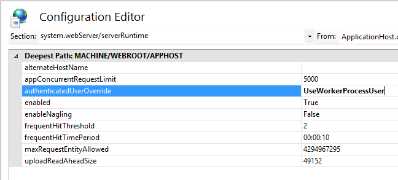

# <a name="deploy-call-quality-dashboard-for-skype-for-business-server-2015"></a><span data-ttu-id="11859-104">为业务 Server 2015 Skype 部署呼叫质量仪表板</span><span class="sxs-lookup"><span data-stu-id="11859-104">Deploy Call Quality Dashboard for Skype for Business Server 2015</span></span>
 
<span data-ttu-id="11859-105">**摘要：** 了解呼叫质量仪表板的部署过程。</span><span class="sxs-lookup"><span data-stu-id="11859-105">**Summary:** Learn about the deployment process for Call Quality Dashboard.</span></span> <span data-ttu-id="11859-106">呼叫质量仪表板是用于业务服务器 2015年的 Skype 的工具。</span><span class="sxs-lookup"><span data-stu-id="11859-106">Call Quality Dashboard is a tool for Skype for Business Server 2015.</span></span>
  
## <a name="deployment-overview"></a><span data-ttu-id="11859-107">部署概述</span><span class="sxs-lookup"><span data-stu-id="11859-107">Deployment Overview</span></span>

<span data-ttu-id="11859-108">呼叫质量仪表板 (CQD) 包括三个主要组件：</span><span class="sxs-lookup"><span data-stu-id="11859-108">Call Quality Dashboard (CQD) consists of three major components:</span></span>
  
- <span data-ttu-id="11859-109">**存档数据库**，其中的用户体验质量 (QoE) 数据是复制和存储。</span><span class="sxs-lookup"><span data-stu-id="11859-109">**Archive Database**, where the Quality of Experience (QoE) data is replicated and stored.</span></span>
    
- <span data-ttu-id="11859-110">**多维数据集**，其中 QoE 存档数据库中的数据聚集优化和快速访问。</span><span class="sxs-lookup"><span data-stu-id="11859-110">**Cube**, where data from QoE Archive database is aggregated for optimized and fast access.</span></span>
    
- <span data-ttu-id="11859-111">**门户**，其中用户可以轻松地查询和可视化 QoE 数据。</span><span class="sxs-lookup"><span data-stu-id="11859-111">**Portal**, where users can easily query and visualize QoE data.</span></span>
    

  
<span data-ttu-id="11859-113">QoE 存档的安装过程包括创建 QoE 存档数据库、 部署将源的 QoE 指标数据库移动数据到 QoE 存档数据库的 SQL Server 存储过程和设置 SQL Server 代理作业来执行存储为定期的过程。</span><span class="sxs-lookup"><span data-stu-id="11859-113">The setup process for QoE Archive involves creating the QoE Archive database, deploying a SQL Server stored procedure that will move the data from the source QoE Metrics database into QoE Archive database, and setting up the SQL Server Agent job to execute the stored procedure at a regular interval.</span></span> 
  
<span data-ttu-id="11859-114">多维数据集部署获取从 QoE 存档位于、 部署多维数据集，并设置将定期刷新多维数据集的常规 SQL Server 代理作业中的用户的信息。</span><span class="sxs-lookup"><span data-stu-id="11859-114">Cube deployment gets information from the user on where the QoE Archive is located, deploys the cube, and sets up a regular SQL Server agent job that will refresh the cube at a regular interval.</span></span>
  
<span data-ttu-id="11859-115">门户安装创建存储库数据库存储的每个用户的报告/查询 CQD 用户映射。</span><span class="sxs-lookup"><span data-stu-id="11859-115">Portal install creates a Repository database that stores the mapping of CQD users to each user's reports/queries.</span></span> <span data-ttu-id="11859-116">它然后设置的 IIS web 应用程序，即仪表板用户看到一组预定义的报告，以及自定义和创建自己的查询来可视化数据多维数据集。</span><span class="sxs-lookup"><span data-stu-id="11859-116">It then sets up an IIS web application which is the dashboard where users can see a pre-defined set of reports as well as customize and create their own queries to visualize data from the cube.</span></span> <span data-ttu-id="11859-117">门户安装创建两个其他 web 应用程序公开的用户，以编程方式访问存储库和多维数据集的 Api。</span><span class="sxs-lookup"><span data-stu-id="11859-117">The portal install creates two additional web applications that exposes APIs for users to programmatically access the repository and the cube.</span></span> <span data-ttu-id="11859-118">（这些 Api 由在内部使用仪表板以及。）</span><span class="sxs-lookup"><span data-stu-id="11859-118">(These APIs are used internally by the dashboard as well.)</span></span>
  

|<span data-ttu-id="11859-119">**阶段**</span><span class="sxs-lookup"><span data-stu-id="11859-119">**Phase**</span></span>|<span data-ttu-id="11859-120">**步骤**</span><span class="sxs-lookup"><span data-stu-id="11859-120">**Steps**</span></span>|<span data-ttu-id="11859-121">**角色和组成员身份**</span><span class="sxs-lookup"><span data-stu-id="11859-121">**Roles and group membership**</span></span>|<span data-ttu-id="11859-122">**文档**</span><span class="sxs-lookup"><span data-stu-id="11859-122">**Documentation**</span></span>|
|:-----|:-----|:-----|:-----|
|<span data-ttu-id="11859-123">安装必备硬件和软件。</span><span class="sxs-lookup"><span data-stu-id="11859-123">Install prerequisite hardware and software.</span></span>  <br/> |<span data-ttu-id="11859-124">确定 CQD 配置，然后选择要从中执行安装 SQL Server。</span><span class="sxs-lookup"><span data-stu-id="11859-124">Decide on the CQD configuration, and choose a SQL Server from which to perform the install.</span></span>  <br/> |<span data-ttu-id="11859-125">属于本地 Administrators 组成员的域用户。</span><span class="sxs-lookup"><span data-stu-id="11859-125">Domain user who is a member of the local administrators group.</span></span>  <br/> |<span data-ttu-id="11859-126">部署文档中的"预安装的系统要求"部分。</span><span class="sxs-lookup"><span data-stu-id="11859-126">"Pre-install Requirements" section in the deployment documentation.</span></span>  <br/> |
|<span data-ttu-id="11859-127">安装 CQD。</span><span class="sxs-lookup"><span data-stu-id="11859-127">Install CQD.</span></span>  <br/> |<span data-ttu-id="11859-128">运行 MSI 关注部署文档。</span><span class="sxs-lookup"><span data-stu-id="11859-128">Run the MSI following the deployment document.</span></span>  <br/> |<span data-ttu-id="11859-129">若要执行安装程序，安装帐户必须是本地 administrators 组的成员的域用户并具有监控服务器上的读访问权的 QoE 指标数据库。</span><span class="sxs-lookup"><span data-stu-id="11859-129">To perform the setup, the installing account must be a domain user who is a member of the local administrators group and have read access to QoE Metrics database on the Monitoring Server.</span></span>  <br/> |<span data-ttu-id="11859-130">部署文档中的"帐户和部署步骤"部分。</span><span class="sxs-lookup"><span data-stu-id="11859-130">"Accounts and Deployment Steps" sections in the deployment documentation.</span></span>  <br/> |
|<span data-ttu-id="11859-131">授予用户访问权限。</span><span class="sxs-lookup"><span data-stu-id="11859-131">Grant user access.</span></span>  <br/> |<span data-ttu-id="11859-132">用于管理到门户的用户授权，我们建议使用 URL 授权，在 IIS 7.0 中引入。</span><span class="sxs-lookup"><span data-stu-id="11859-132">For managing user authorization to the Portal, we recommend using URL Authorization, which was introduced in IIS 7.0.</span></span> <span data-ttu-id="11859-133">有关详细信息，请参阅[Understanding IIS 7.0 URL 授权](https://www.iis.net/learn/manage/configuring-security/understanding-iis-url-authorization)。</span><span class="sxs-lookup"><span data-stu-id="11859-133">For more information, see [Understanding IIS 7.0 URL Authorization](https://www.iis.net/learn/manage/configuring-security/understanding-iis-url-authorization).</span></span>  <br/> |<span data-ttu-id="11859-134">属于本地 Administrators 组成员的域用户。</span><span class="sxs-lookup"><span data-stu-id="11859-134">Domain user who is a member of the local administrators group.</span></span>  <br/> |<span data-ttu-id="11859-135">部署文档中的门户部分管理用户的访问。</span><span class="sxs-lookup"><span data-stu-id="11859-135">Managing User Access for the Portal section in the deployment documentation.</span></span>  <br/> |
|<span data-ttu-id="11859-136">可选： 提供子网映射信息。</span><span class="sxs-lookup"><span data-stu-id="11859-136">Optional: Provide subnet mapping information.</span></span>  <br/> |<span data-ttu-id="11859-137">填充网络和 QoE 存档数据库中的构建映射表。</span><span class="sxs-lookup"><span data-stu-id="11859-137">Populate network and building mapping tables in QoE Archive database.</span></span>  <br/> |<span data-ttu-id="11859-138">具有写访问 QoE 存档数据库的帐户。</span><span class="sxs-lookup"><span data-stu-id="11859-138">An account with write access to the QoE Archive database.</span></span>  <br/> |<span data-ttu-id="11859-139">用户文档中的"提供子网信息"部分。</span><span class="sxs-lookup"><span data-stu-id="11859-139">"Supplying Subnet Information" section in the user documentation.</span></span>  <br/> |
   
## 

<span data-ttu-id="11859-140">呼叫质量仪表板的部署涉及设置基础结构和安装软件。</span><span class="sxs-lookup"><span data-stu-id="11859-140">Deployment of Call Quality Dashboard involves setting up the infrastructure and installing the software.</span></span> <span data-ttu-id="11859-141">下面的过程概述的过程。</span><span class="sxs-lookup"><span data-stu-id="11859-141">The following procedure outlines the process.</span></span>
  
### <a name="deployment-steps"></a><span data-ttu-id="11859-142">部署步骤</span><span class="sxs-lookup"><span data-stu-id="11859-142">Deployment Steps</span></span>

1. <span data-ttu-id="11859-143">将 CallQualityDashboard.msi 复制到其中 CQD 的存档数据库组件是安装在计算机 （这是已安装的 SQL Server 的计算机）。</span><span class="sxs-lookup"><span data-stu-id="11859-143">Copy the CallQualityDashboard.msi to the machine where the archive database component of CQD is to be installed (this is the machine that has SQL Server installed).</span></span> 
    
2. <span data-ttu-id="11859-144">执行 MSI （Windows 会提示具有管理员权限运行，这样做）。</span><span class="sxs-lookup"><span data-stu-id="11859-144">Execute the MSI (Windows will prompt to run with administrator privilege, do so).</span></span> 
    
3. <span data-ttu-id="11859-145">接受 EULA。</span><span class="sxs-lookup"><span data-stu-id="11859-145">Accept the EULA.</span></span>
    
4. <span data-ttu-id="11859-146">选择目标文件夹，其中与呼叫质量仪表板组件相关的文件将位于或接受默认位置。</span><span class="sxs-lookup"><span data-stu-id="11859-146">Select the destination folder where files related to Call Quality Dashboard components will be located or accept the default location.</span></span>
    
5. <span data-ttu-id="11859-147">选择所有功能。</span><span class="sxs-lookup"><span data-stu-id="11859-147">Select all features.</span></span>
    
6. <span data-ttu-id="11859-148">在 QoE 存档配置页中，提供以下信息：</span><span class="sxs-lookup"><span data-stu-id="11859-148">At the QoE Archive Configuration page, provide the following information:</span></span>
    
   - <span data-ttu-id="11859-149">**的 QoE 指标 SQL Server:** QoE 指标 DB 所在的 SQL Server 实例名称 （这将数据源）。</span><span class="sxs-lookup"><span data-stu-id="11859-149">**QoE Metrics SQL Server:** SQL Server instance name for where the QoE Metrics DB is located (this will be the data source).</span></span>
    
   - <span data-ttu-id="11859-150">**QoE 存档 SQL Server 名称：** 这是只读字段，固定到本地计算机的完全限定的域名。</span><span class="sxs-lookup"><span data-stu-id="11859-150">**QoE Archive SQL Server Name:** This is read-only field and fixed to the fully qualified domain name of the local machine.</span></span> <span data-ttu-id="11859-151">可以仅在本地计算机上安装存档数据库。</span><span class="sxs-lookup"><span data-stu-id="11859-151">Archive DB can be installed only on the local machine.</span></span>
    
   - <span data-ttu-id="11859-152">**QoE 存档 SQL Server 实例：** 其中存档 DB 是要创建本地 SQL Server 实例名称。</span><span class="sxs-lookup"><span data-stu-id="11859-152">**QoE Archive SQL Server Instance:** A local SQL Server instance name for where the Archive DB is to be created.</span></span> <span data-ttu-id="11859-153">若要使用默认 SQL Server 实例，请将此字段留空。</span><span class="sxs-lookup"><span data-stu-id="11859-153">To use a default SQL Server instance, leave this field blank.</span></span> <span data-ttu-id="11859-154">若要使用的命名的 SQL Server 实例，指定实例名称 (例如后的名称"\")。</span><span class="sxs-lookup"><span data-stu-id="11859-154">To use a named SQL Server instance, specify the instance name (e.g. the name after the "\").</span></span>
    
   - <span data-ttu-id="11859-155">**QoE 存档数据库：** 默认情况下，此选项设置为"创建新的数据库"。</span><span class="sxs-lookup"><span data-stu-id="11859-155">**QoE Archive Database:** By default, this option is set to "Create new database".</span></span> <span data-ttu-id="11859-156">不支持存档 DB 升级，因为在其下的"使用现有数据库"选项可仅 circumstance 为现有的存档数据库是否有生成安装相同的架构。</span><span class="sxs-lookup"><span data-stu-id="11859-156">Since Archive DB upgrade is not supported, the only circumstance under which the "Use existing database" option can be used is if the existing Archive database has the same schema as the build to be installed.</span></span>
    
   - <span data-ttu-id="11859-157">**数据库文件目录：** 存档数据库的数据库文件 （.mdf 和.ldf） 的放置位置的路径。</span><span class="sxs-lookup"><span data-stu-id="11859-157">**Database File Directory:** Path to where the database files (.mdf and .ldf) for the Archive DB should be placed.</span></span> <span data-ttu-id="11859-158">这应该是驱动器上从操作系统 (推荐的硬件配置中 HDD2) 分开。</span><span class="sxs-lookup"><span data-stu-id="11859-158">This should be on a drive (HDD2 in the recommended hardware configuration) separate from the OS.</span></span> <span data-ttu-id="11859-159">请注意，因为安装中修复的文件名称，以避免任何潜在冲突，建议使用的任何文件的空白目录。</span><span class="sxs-lookup"><span data-stu-id="11859-159">Note that since the file names are fixed in the install, to avoid any potential conflict, it is recommended that a blank directory with no files be used.</span></span>
    
   - <span data-ttu-id="11859-160">**使用多个分区：** 默认值设置为"多个分区"，这需要商业智能版或企业版的 SQL Server。</span><span class="sxs-lookup"><span data-stu-id="11859-160">**Use Multiple Partitions:** The default is set to "Multiple partition", which requires Business Intelligence edition or Enterprise edition of SQL Server.</span></span> <span data-ttu-id="11859-161">对于 Standard edition，请选择"单个分区"选项。</span><span class="sxs-lookup"><span data-stu-id="11859-161">For Standard edition, select "Single Partition" option.</span></span> <span data-ttu-id="11859-162">请注意，是否使用单个分区多维数据集处理性能可能会受到影响。</span><span class="sxs-lookup"><span data-stu-id="11859-162">Note that cube processing performance may be impacted if Single Partition is used.</span></span>
    
    > [!NOTE]
    > <span data-ttu-id="11859-163">安装完成后，使用多个分区选项所选内容不能更改。</span><span class="sxs-lookup"><span data-stu-id="11859-163">The selection for Use Multiple Partitions option cannot be changed once Setup completes.</span></span> <span data-ttu-id="11859-164">若要更改它，功能需要第一个多维数据集卸载并重新安装使用控制面板中的"更改"选项。</span><span class="sxs-lookup"><span data-stu-id="11859-164">In order to change it, the Cube feature needs to be first uninstalled and then reinstalled using "Change" option in Control Panel.</span></span> 
  
   - <span data-ttu-id="11859-165">**分区文件目录：** QoE 存档数据库的分区的放置位置的路径。</span><span class="sxs-lookup"><span data-stu-id="11859-165">**Partition File Directory:** Path to where the partitions for the QoE Archive database should be placed.</span></span> <span data-ttu-id="11859-166">这应该是驱动器上 (HDD3 建议的硬件配置中) 的操作系统驱动器和 SQL 数据库日志文件驱动器分开。</span><span class="sxs-lookup"><span data-stu-id="11859-166">This should be on a drive (HDD3 in the recommended hardware configuration) separate from the OS drive and SQL database log files drive.</span></span> <span data-ttu-id="11859-167">请注意，因为安装中修复的文件名称，以避免任何潜在冲突，建议使用的任何文件的空白目录。</span><span class="sxs-lookup"><span data-stu-id="11859-167">Note that since the file names are fixed in the install, to avoid any potential conflict, it is recommended that a blank directory with no files be used.</span></span>
    
   - <span data-ttu-id="11859-168">**SQL 代理作业用户的用户名&amp;密码：** 域服务帐户名和密码 （遮盖） 将用于运行"QoE 存档数据"SQL Server 代理作业 （这将运行提取数据从 QoE 指标 DB 到存档 DB，因此此帐户必须具有对 QoE 指标 DB 的读取权限的存储的过程的步骤 指示在帐户部分。</span><span class="sxs-lookup"><span data-stu-id="11859-168">**SQL Agent Job User - User Name &amp; Password:** Domain service account name and password (masked) that will be used to run the "QoE Archive Data" step of the SQL Server Agent job (which will run the stored procedure to fetch data from QoE Metrics DB into Archive DB, so this account must have read access to QoE Metrics DB, as indicated under Accounts section.</span></span> <span data-ttu-id="11859-169">此帐户也需要有登录名的 QoE 存档 SQL Server 实例中）。</span><span class="sxs-lookup"><span data-stu-id="11859-169">This account also needs to have a login in the QoE Archive SQL Server Instance).</span></span>
    
    > [!NOTE]
    > <span data-ttu-id="11859-170">如 NT SERVICE\MSSQLSERVER 下运行的 SQL Server 实例的帐户必须具有对上述安装成功的目录访问/权限。</span><span class="sxs-lookup"><span data-stu-id="11859-170">The account that the SQL Server instance is running under, such as NT SERVICE\MSSQLSERVER, must have access/permission to the directories given above for the installation to succeed.</span></span> <span data-ttu-id="11859-171">有关详细信息，请参阅[为数据库引擎访问配置文件系统权限](https://msdn.microsoft.com/en-us/library/jj219062%28v=sql.110%29.aspx)</span><span class="sxs-lookup"><span data-stu-id="11859-171">For details, see [Configure File System Permissions for Database Engine Access](https://msdn.microsoft.com/en-us/library/jj219062%28v=sql.110%29.aspx)</span></span>
  
7. <span data-ttu-id="11859-172">在单击下一步安装程序将执行先决条件检查和报告，如果遇到任何问题。</span><span class="sxs-lookup"><span data-stu-id="11859-172">Upon clicking next, the installer will perform pre-requisite checks and report if any issues are encountered.</span></span> <span data-ttu-id="11859-173">当所有先决条件检查传递中，安装程序将转到多维数据集配置页。</span><span class="sxs-lookup"><span data-stu-id="11859-173">When all pre-requisite checks pass, the installer will go to the Cube Configuration page.</span></span> 
    
    > [!NOTE]
    > <span data-ttu-id="11859-174">如果安装程序显示的 QoE 存档 SQL Server 实例的 SQL Server 代理服务当前未运行一条警告消息，才能继续安装，但安装后请确保 SQL 代理服务正在运行，并将启动类型设置为自动以便计划的作业运行。</span><span class="sxs-lookup"><span data-stu-id="11859-174">If the installer shows a warning message that the SQL Server Agent service for the QoE Archive SQL Server instance is currently not running, installation can proceed, but post installation please make sure that SQL Agent service is running and set the Startup type to Automatic so that the scheduled Job runs.</span></span> 
  
8. <span data-ttu-id="11859-175">在多维数据集配置页上，提供以下信息：</span><span class="sxs-lookup"><span data-stu-id="11859-175">At Cube Configuration page, provide the following information:</span></span>
    
   - <span data-ttu-id="11859-176">**QoE 存档 SQL Server 名称：** 这是只读字段，固定到本地计算机的完全限定的域名。</span><span class="sxs-lookup"><span data-stu-id="11859-176">**QoE Archive SQL Server Name:** This is read-only field and fixed to the fully qualified domain name of the local machine.</span></span> <span data-ttu-id="11859-177">多维数据集可以安装只能从计算机具有 QoE 存档数据库 （注释。</span><span class="sxs-lookup"><span data-stu-id="11859-177">Cube can be installed only from the machine that has QoE Archive database (Note.</span></span> <span data-ttu-id="11859-178">可能远程计算机上安装多维数据集本身。</span><span class="sxs-lookup"><span data-stu-id="11859-178">Cube itself may be installed on a remote machine.</span></span> <span data-ttu-id="11859-179">请参阅下面）</span><span class="sxs-lookup"><span data-stu-id="11859-179">See below)</span></span>
    
   - <span data-ttu-id="11859-180">**QoE 存档 SQL Server 实例：** QoE 存档数据库所在的 SQL Server 实例名称。</span><span class="sxs-lookup"><span data-stu-id="11859-180">**QoE Archive SQL Server Instance:** SQL Server instance name for where the QoE Archive DB is located.</span></span> <span data-ttu-id="11859-181">若要指定默认 SQL Server 实例，请将此字段留空。</span><span class="sxs-lookup"><span data-stu-id="11859-181">To specify a default SQL Server instance, leave this field blank.</span></span> <span data-ttu-id="11859-182">若要指定命名的 SQL Server 实例，请输入的实例名称 (例如后的名称"\")。</span><span class="sxs-lookup"><span data-stu-id="11859-182">To specify a named SQL Server instance, enter the instance name (e.g. the name after the "\").</span></span> <span data-ttu-id="11859-183">如果安装选择 QoE 存档组件，此字段将预填充 QoE 存档配置页上提供的值。</span><span class="sxs-lookup"><span data-stu-id="11859-183">If QoE Archive component was selected for the install, this field will be pre-populated with the value provided on the QoE Archive Configuration page.</span></span>
    
   - <span data-ttu-id="11859-184">**多维数据集分析服务器：** 其中多维数据集是要创建的 SQL Server Analysis Service 实例名称。</span><span class="sxs-lookup"><span data-stu-id="11859-184">**Cube Analysis Server:** SQL Server Analysis Service instance name for where the cube is to be created.</span></span> <span data-ttu-id="11859-185">这可以是不同的计算机，但安装的用户必须是目标 SQL Server Analysis Service 实例的服务器管理员的成员。</span><span class="sxs-lookup"><span data-stu-id="11859-185">This can be a different machine but the installing user has to be a member of Server administrators of the target SQL Server Analysis Service instance.</span></span>
    
    > [!NOTE]
    >  <span data-ttu-id="11859-186">有关配置 Analysis Services 服务器管理员权限的详细信息，请参阅[授予服务器管理员权限 (Analysis Services)](https://msdn.microsoft.com/en-us/library/ms174561.aspx)</span><span class="sxs-lookup"><span data-stu-id="11859-186">For more information about configuring Analysis Services Server Administrator Permissions, see [Grant Server Administrator Permissions (Analysis Services)](https://msdn.microsoft.com/en-us/library/ms174561.aspx)</span></span>
  
   - <span data-ttu-id="11859-187">**使用多个分区：** 默认值设置为"多个分区"，这需要商业智能版或企业版的 SQL Server。</span><span class="sxs-lookup"><span data-stu-id="11859-187">**Use Multiple Partitions:** The default is set to "Multiple partition", which requires Business Intelligence edition or Enterprise edition of SQL Server.</span></span> <span data-ttu-id="11859-188">对于 Standard edition，请选择"单个分区"选项。</span><span class="sxs-lookup"><span data-stu-id="11859-188">For Standard edition, select "Single Partition" option.</span></span> <span data-ttu-id="11859-189">请注意，是否使用单个分区多维数据集处理性能可能会受到影响。</span><span class="sxs-lookup"><span data-stu-id="11859-189">Note that cube processing performance may be impacted if Single Partition is used .</span></span>
    
    > [!NOTE]
    >  <span data-ttu-id="11859-190">安装完成后，使用多个分区选项所选内容不能更改。</span><span class="sxs-lookup"><span data-stu-id="11859-190">The selection for Use Multiple Partitions option cannot be changed once Setup completes.</span></span> <span data-ttu-id="11859-191">若要更改它，功能需要第一个多维数据集卸载并重新安装使用控制面板中的"更改"选项。</span><span class="sxs-lookup"><span data-stu-id="11859-191">In order to change it, the Cube feature needs to be first uninstalled and then reinstalled using "Change" option in Control Panel.</span></span>
  
   - <span data-ttu-id="11859-192">**多维数据集的用户的用户名&amp;密码：** 域服务帐户名和密码 （遮盖） 将触发多维数据集处理。</span><span class="sxs-lookup"><span data-stu-id="11859-192">**Cube User - User Name &amp; Password:** Domain service account name and password (masked) that will trigger the cube processing.</span></span> <span data-ttu-id="11859-193">如果安装选择 QoE 存档组件，此字段将为 SQL 代理作业用户，在存档配置页上提供的值与预先填充，但建议，以使安装程序可以授予指定不同的域服务帐户所需的最小特权到它。</span><span class="sxs-lookup"><span data-stu-id="11859-193">If QoE Archive component was selected for the install, this field will be pre-populated with the value provided on the Archive Configuration page for the SQL Agent Job User, but we recommend specifying a different domain service account so that Setup can grant the least required privilege to it.</span></span>
    
9. <span data-ttu-id="11859-194">单击下一步时将执行另一轮验证，并将报告任何问题。</span><span class="sxs-lookup"><span data-stu-id="11859-194">When clicking next, another round of validation will be performed and any issue will be reported.</span></span> <span data-ttu-id="11859-195">在验证成功完成，安装程序将转到门户配置页中。</span><span class="sxs-lookup"><span data-stu-id="11859-195">Upon successful completion of the validation, the installer will go to the Portal Configuration page.</span></span> 
    
10. <span data-ttu-id="11859-196">在门户配置页上，提供以下信息：</span><span class="sxs-lookup"><span data-stu-id="11859-196">At Portal Configuration page, provide the following information:</span></span>
    
    - <span data-ttu-id="11859-197">**QoE 存档 SQL Server:** QoE 存档数据库所在的 SQL Server 实例名称。</span><span class="sxs-lookup"><span data-stu-id="11859-197">**QoE Archive SQL Server:** SQL Server instance name for where the QoE Archive database is located.</span></span> <span data-ttu-id="11859-198">注意，与 QoE 存档配置页和多维数据集配置页上，不同的计算机名称并未得到解决，必须提供。</span><span class="sxs-lookup"><span data-stu-id="11859-198">Note that unlike the QoE Archive Configuration page and the Cube Configuration page, the machine name is not fixed and must be provided.</span></span> <span data-ttu-id="11859-199">如果安装选择 QoE 存档组件，此字段将预填充 QoE 存档配置页上提供的值。</span><span class="sxs-lookup"><span data-stu-id="11859-199">If QoE Archive component was selected for the install, this field will be pre-populated with the value provided on the QoE Archive Configuration page.</span></span>
    
    - <span data-ttu-id="11859-200">**多维数据集分析服务器：** 多维数据集所在的 SQL Server Analysis Service 实例名称。</span><span class="sxs-lookup"><span data-stu-id="11859-200">**Cube Analysis Server:** SQL Server Analysis Service instance name for where the cube is located.</span></span> <span data-ttu-id="11859-201">如果安装选择多维数据集组件，此字段将预填充多维数据集配置页上提供的值。</span><span class="sxs-lookup"><span data-stu-id="11859-201">If Cube component was selected for the install, this field will be pre-populated with the value provided on the Cube Configuration page.</span></span>
    
    - <span data-ttu-id="11859-202">**存储库 SQL Server:** 创建存储库数据库所在的 SQL Server 实例名称。</span><span class="sxs-lookup"><span data-stu-id="11859-202">**Repository SQL Server:** SQL Server instance name where the Repository database is to be created.</span></span> <span data-ttu-id="11859-203">如果 QoE 存档数据库所在的 SQL Server 实例名称提供更早版本中安装程序 （其他组件），将 QoE 存档 DB SQL Server 实例名称预先填充此字段。</span><span class="sxs-lookup"><span data-stu-id="11859-203">If the SQL Server instance name for where the QoE Archive database is located has been provided earlier in the setup (in other components), this field will be pre-populated with the QoE Archive DB SQL Server instance name.</span></span> <span data-ttu-id="11859-204">这可以是任何 SQL Server 实例。</span><span class="sxs-lookup"><span data-stu-id="11859-204">This can be any SQL Server instance.</span></span>
    
    - <span data-ttu-id="11859-205">**存储库数据库：** 默认情况下选项设置为"创建新的数据库"。</span><span class="sxs-lookup"><span data-stu-id="11859-205">**Repository Database:** By default the option is set to "Create new database".</span></span> <span data-ttu-id="11859-206">由于不支持库 DB 升级，可在其下使用"使用现有数据库"选项仅 circumstance 是现有的存储库 DB 具有生成安装相同的架构。</span><span class="sxs-lookup"><span data-stu-id="11859-206">Since Repository DB upgrade is not supported, the only circumstance under which the "Use existing database" option can be used is if the existing Repository DB has the same schema as the build to be installed.</span></span>
    
    - <span data-ttu-id="11859-207">**IIS 应用程序池用户的用户名&amp;密码：** 在下，应执行的 IIS 应用程序池帐户。</span><span class="sxs-lookup"><span data-stu-id="11859-207">**IIS App Pool User - User Name &amp; Password:** The account that the IIS application pool should execute under.</span></span> <span data-ttu-id="11859-208">用户名和密码字段将灰显，如果选择了内置系统帐户。</span><span class="sxs-lookup"><span data-stu-id="11859-208">The User Name and Password fields will be grayed out if built-in system accounts are selected.</span></span> <span data-ttu-id="11859-209">如果"Other"将选定从下拉列表框中，以便用户可以输入域服务帐户信息，则仅会启用这些字段。</span><span class="sxs-lookup"><span data-stu-id="11859-209">These fields will only be enabled if "Other" is selected from the drop down box so the user can enter the domain service account information.</span></span>
    
11. <span data-ttu-id="11859-210">时单击下一步将进行验证的最后一轮以确保 SQL Server 实例可以使用提供的凭据访问并且 IIS 为计算机上可用。</span><span class="sxs-lookup"><span data-stu-id="11859-210">When clicking next, the final round of validation will be done to ensure that the SQL Server instances are accessible using the credentials provided and that IIS is available on the machine.</span></span> <span data-ttu-id="11859-211">在验证成功完成，安装程序将继续进行安装。</span><span class="sxs-lookup"><span data-stu-id="11859-211">Upon successful completion of the validation, the installer will proceed with the setup.</span></span> 
    
<span data-ttu-id="11859-212">完成安装程序后，很可能的 SQL Server 代理作业将正在进行，执行初始的 QoE 数据和多维数据集处理负载。</span><span class="sxs-lookup"><span data-stu-id="11859-212">When the installer is done, most likely the SQL Server Agent job will be in progress, doing the initial load of the QoE data and the cube processing.</span></span> <span data-ttu-id="11859-213">QoE 中的数据量，根据门户没有可用于尚未查看数据。</span><span class="sxs-lookup"><span data-stu-id="11859-213">Depending on the amount of data in QoE, the portal will not have data available for viewing yet.</span></span> <span data-ttu-id="11859-214">要检查的数据加载和多维数据集处理状态，请转到`http://<machinename>/CQD/#/Health`。</span><span class="sxs-lookup"><span data-stu-id="11859-214">To check on the status of the data load and cube processing, go to  `http://<machinename>/CQD/#/Health`.</span></span> 
> [!NOTE]
> <span data-ttu-id="11859-215">请注意，检查的下载多维数据集处理状态的 URL 是区分大小写。</span><span class="sxs-lookup"><span data-stu-id="11859-215">Note that the URL for checking the status of the download cube processing is case sensitive.</span></span> <span data-ttu-id="11859-216">如果输入运行状况 URL 将不起作用。</span><span class="sxs-lookup"><span data-stu-id="11859-216">If you enter 'health' the URL will not work.</span></span> <span data-ttu-id="11859-217">您必须输入大写 h。 URL 末尾的运行状况</span><span class="sxs-lookup"><span data-stu-id="11859-217">You must enter 'Health' at the end of the URL with a capital H.</span></span> 
  
<span data-ttu-id="11859-218">如果启用调试模式将显示详细的日志消息。</span><span class="sxs-lookup"><span data-stu-id="11859-218">Detailed log messages will be shown if debug mode is enabled.</span></span> <span data-ttu-id="11859-219">若要启用调试模式下，转到 **%SYSTEMDRIVE%\Program 的业务 2015 CQD\QoEDataService\web.config Files\Skype**，并更新以下行，以便值设置为**True**:</span><span class="sxs-lookup"><span data-stu-id="11859-219">To enable debug mode, go to **%SYSTEMDRIVE%\Program Files\Skype For Business 2015 CQD\QoEDataService\web.config**, and update the following line so the value is set to **True**:</span></span>

```
<add key="QoEDataLib.DebugMode" value="True" /> 
```

<span data-ttu-id="11859-220">门户主页是可通过访问`http://<machinename>/CQD`。</span><span class="sxs-lookup"><span data-stu-id="11859-220">The main portal page is accessible via  `http://<machinename>/CQD`.</span></span> 
## <a name="managing-user-access-for-the-portal"></a><span data-ttu-id="11859-221">门户管理用户访问</span><span class="sxs-lookup"><span data-stu-id="11859-221">Managing User Access for the Portal</span></span>

<span data-ttu-id="11859-222">用于管理到门户的用户授权，我们建议使用 URL 授权，在 IIS 7.0 中引入。</span><span class="sxs-lookup"><span data-stu-id="11859-222">For managing user authorization to the Portal, we recommend using URL Authorization, which was introduced in IIS 7.0.</span></span> <span data-ttu-id="11859-223">IIS 安全性的详细信息，请参阅[Understanding IIS 7.0 URL 授权](https://www.iis.net/learn/manage/configuring-security/understanding-iis-url-authorization)。</span><span class="sxs-lookup"><span data-stu-id="11859-223">For more information on IIS security, see [Understanding IIS 7.0 URL Authorization ](https://www.iis.net/learn/manage/configuring-security/understanding-iis-url-authorization).</span></span>
  
<span data-ttu-id="11859-224">任何 web 网站或 web 应用程序继承默认 URL 授权配置为整个 IIS，这通常是"允许所有用户"。</span><span class="sxs-lookup"><span data-stu-id="11859-224">Any web site or web application inherit the default URL Authorization configured for the entire IIS, which is typically "Allow All Users".</span></span> <span data-ttu-id="11859-225">如果需要更严格访问门户，然后管理员可以授予访问仅特定的用户组通过编辑"授权规则"。</span><span class="sxs-lookup"><span data-stu-id="11859-225">If access to the Portal needs to be more restrictive, then administrators can grant access to only the specific group of users by editing the "Authorization Rules".</span></span>
  

  
> [!NOTE]
> <span data-ttu-id="11859-227">授权规则图标是不会与".NET Authorization"下 ASP.NET 部分，这是不同的身份验证机制混淆。</span><span class="sxs-lookup"><span data-stu-id="11859-227">The Authorization Rules icon is not to be confused with the ".NET Authorization" under the ASP.NET section, which is a different authorization mechanism.</span></span> 
  
<span data-ttu-id="11859-228">管理员应该首先删除继承"允许所有用户"规则。</span><span class="sxs-lookup"><span data-stu-id="11859-228">Administrators should first remove the inherited "Allow All Users" rule.</span></span> <span data-ttu-id="11859-229">这将防止未经授权的任何用户访问门户。</span><span class="sxs-lookup"><span data-stu-id="11859-229">This prevents any non-authorized users from accessing the Portal.</span></span>
  

  
<span data-ttu-id="11859-231">接下来，管理员应添加新允许规则，并向特定用户授予权限，用于访问门户。</span><span class="sxs-lookup"><span data-stu-id="11859-231">Next, administrators should add new Allow Rules and give specific users the permission to access the Portal.</span></span> <span data-ttu-id="11859-232">建议创建一个名为"CQDPortalUsers"的本地组的管理用户。</span><span class="sxs-lookup"><span data-stu-id="11859-232">It is recommended that a local Group called "CQDPortalUsers" be created to manage the users.</span></span>
  

  
<span data-ttu-id="11859-234">配置详细信息存储在 web.config 中位于门户的物理目录。</span><span class="sxs-lookup"><span data-stu-id="11859-234">The configuration details are stored in the web.config located at the Portal's physical directory.</span></span>
  
```
<?xml version="1.0" encoding="UTF-8"?> <configuration> <system.webServer> <security> <authorization> <remove users="*" roles="" verbs="" /> <add accessType="Allow" roles="CQDPortalUsers" /> </authorization> </security> </system.webServer> </configuration> 
```

<span data-ttu-id="11859-235">下一步是配置 CQD 的仪表板。</span><span class="sxs-lookup"><span data-stu-id="11859-235">The next step is to configure the dashboard of the CQD.</span></span> <span data-ttu-id="11859-236">用户进行身份验证由 IIS 后，他们将需要对 CQD directory 文件权限才能访问 web 门户网站内容。</span><span class="sxs-lookup"><span data-stu-id="11859-236">After users are authenticated by IIS, they will have to have file permissions on the CQD directory in order to access the web portal content.</span></span> <span data-ttu-id="11859-237">可以更改通过 CQD 目录属性的安全选项卡添加单个用户或组; 的 Acl但是的推荐的方法是保持不变的文件权限。</span><span class="sxs-lookup"><span data-stu-id="11859-237">It is possible to change the ACLs through the security tab of the CQD directory properties to add individual users or groups; however the recommended approach is to leave the file permissions untouched.</span></span> <span data-ttu-id="11859-238">相反，更改要使用的 IIS 工作进程访问无论该用户进行身份验证的 CQD 目录的 IIS 设置。</span><span class="sxs-lookup"><span data-stu-id="11859-238">Instead, change the IIS setting to use the IIS worker process to access the CQD directory no matter which user is authenticated.</span></span> 
  
> [!IMPORTANT]
> <span data-ttu-id="11859-239">非常重要仅更改此设置为 CQD 应用程序，而不是针对两个 API 应用程序： QoEDataService 和 QoERepositoryService。</span><span class="sxs-lookup"><span data-stu-id="11859-239">It is important to only change this setting for the CQD application, and not for the two API applications: QoEDataService and QoERepositoryService.</span></span> 
  
### <a name="configuring-file-access-for-the-cqd-dashboard"></a><span data-ttu-id="11859-240">配置文件访问 CQD （仪表板）</span><span class="sxs-lookup"><span data-stu-id="11859-240">Configuring File Access for the CQD (Dashboard)</span></span>

1. <span data-ttu-id="11859-241">打开配置编辑器的 CQD。</span><span class="sxs-lookup"><span data-stu-id="11859-241">Open the Configuration Editor for CQD.</span></span>
    
     
  
2. <span data-ttu-id="11859-243">在部分下，选择**system.webServer/serverRuntime**。</span><span class="sxs-lookup"><span data-stu-id="11859-243">Under Section, choose **system.webServer/serverRuntime**.</span></span>
    
     
  
3. <span data-ttu-id="11859-245">更改为**UseWorkerProcessUser**authenticatedUserOverride。</span><span class="sxs-lookup"><span data-stu-id="11859-245">Change authenticatedUserOverride to **UseWorkerProcessUser**.</span></span>
    
     
  
4. <span data-ttu-id="11859-247">单击**应用**页面的右侧。</span><span class="sxs-lookup"><span data-stu-id="11859-247">Click **Apply** on the right-hand side of the page.</span></span>
    
## <a name="known-issues"></a><span data-ttu-id="11859-248">已知的问题</span><span class="sxs-lookup"><span data-stu-id="11859-248">Known Issues</span></span>

<span data-ttu-id="11859-249">在极少数情况下，安装程序无法在 IIS 中创建了正确的设置。</span><span class="sxs-lookup"><span data-stu-id="11859-249">In rare cases, the installer fails to create the correct settings in IIS.</span></span> <span data-ttu-id="11859-250">允许用户登录到 CQD 需要手动更改。</span><span class="sxs-lookup"><span data-stu-id="11859-250">Manual change is required to allow users to log into the CQD.</span></span> <span data-ttu-id="11859-251">如果用户在登录时出现问题，请按照以下步骤：</span><span class="sxs-lookup"><span data-stu-id="11859-251">If users are having trouble logging in, please follow these steps:</span></span>
  
1. <span data-ttu-id="11859-252">打开 up IIS 管理器中，并导航到默认网站。</span><span class="sxs-lookup"><span data-stu-id="11859-252">Open up IIS Manager, and navigate to Default Web Site.</span></span>
    
     
  
2. <span data-ttu-id="11859-254">单击"身份验证"。</span><span class="sxs-lookup"><span data-stu-id="11859-254">Click on "Authentication".</span></span> <span data-ttu-id="11859-255">如果"匿名身份验证"、"ASP.NET 模拟"、"窗体身份验证"和"Windows 身份验证"不匹配的设置如下所示，手动更改，以满足下面的设置。</span><span class="sxs-lookup"><span data-stu-id="11859-255">If the "Anonymous Authentication", "ASP.NET Impersonation", "Form Authentication", and "Windows Authentication" do not match the settings shown below, manually change them to match the settings below.</span></span> <span data-ttu-id="11859-256">应禁用所有其他身份验证机制。</span><span class="sxs-lookup"><span data-stu-id="11859-256">All other authentication mechanisms should be disabled.</span></span>
    
     
  
3. <span data-ttu-id="11859-258">对于"Windows 身份验证"，在右侧单击高级设置。</span><span class="sxs-lookup"><span data-stu-id="11859-258">For "Windows Authentication", click on Advanced Settings on the right-hand side.</span></span>
    
     
  
4. <span data-ttu-id="11859-260">将"扩展保护"设置为接受并选中"启用内核模式身份验证"框。</span><span class="sxs-lookup"><span data-stu-id="11859-260">Set "Extended Protection" to Accept and check the "Enable Kernel-mode authentication" box.</span></span>
    
     
  
5. <span data-ttu-id="11859-262">"CQD"、"QoEDataService"和"QoERepositoryService"条目下方"默认网站"的每个重复上述步骤。</span><span class="sxs-lookup"><span data-stu-id="11859-262">Repeat the above steps for each of the "CQD", "QoEDataService", and "QoERepositoryService" entries below "Default Web Site".</span></span>
    
<span data-ttu-id="11859-263">HTTP 和 HTTPS 端口绑定安装程序将在默认端口号 （端口 80 用于 HTTP） 和端口 443 用于 HTTPS 上创建端口绑定。</span><span class="sxs-lookup"><span data-stu-id="11859-263">For HTTP and HTTPS port bindings the installer will create port bindings on the default port numbers (port 80 for HTTP and port 443 for HTTPS).</span></span> <span data-ttu-id="11859-264">如果使用这些绑定的计算机上没有另一个网站，将冲突，并且无法预测的 IIS 行为。</span><span class="sxs-lookup"><span data-stu-id="11859-264">If there is another website on the machine that uses these bindings, there will be a conflict and the IIS behavior cannot be predicted.</span></span> <span data-ttu-id="11859-265">若要避免此问题的最佳方式是使确保没有其他网站映射到端口 80 和 443 安装 CQD 之前。</span><span class="sxs-lookup"><span data-stu-id="11859-265">The best way to avoid this problem is to make sure that no other websites are mapped to ports 80 and 443 before installing CQD.</span></span> 
  
<span data-ttu-id="11859-266">若要启用 SSL/TLS 在 IIS 中并强制用户通过安全的 HTTPS，而不是 HTTP 连接：</span><span class="sxs-lookup"><span data-stu-id="11859-266">To enable SSL/TLS in IIS and force users to connect via secure HTTPS instead of HTTP:</span></span>
  
1. <span data-ttu-id="11859-267">在 IIS 中配置安全套接字层，请参阅[在 IIS 7 中配置安全套接字层](https://technet.microsoft.com/en-us/library/cc771438%28v=ws.10%29.aspx)。</span><span class="sxs-lookup"><span data-stu-id="11859-267">Configure Secure Sockets Layer in IIS, see [Configuring Secure Sockets Layer in IIS 7](https://technet.microsoft.com/en-us/library/cc771438%28v=ws.10%29.aspx).</span></span> <span data-ttu-id="11859-268">完成后，将`http`与`https`。</span><span class="sxs-lookup"><span data-stu-id="11859-268">Once done, replace  `http` with `https`.</span></span>
    
2. <span data-ttu-id="11859-269">在 SQL Server 连接启用 TLS 的说明，请参阅[如何启用 SSL 加密使用 Microsoft 管理控制台的 SQL Server 的实例](https://support.microsoft.com/en-us/kb/316898/)。</span><span class="sxs-lookup"><span data-stu-id="11859-269">For instructions on enabling TLS in the SQL Server connections, see [How to enable SSL encryption for an instance of SQL Server by using Microsoft Management Console ](https://support.microsoft.com/en-us/kb/316898/).</span></span>
    
### <a name="cube-sync-fails"></a><span data-ttu-id="11859-270">多维数据集同步失败</span><span class="sxs-lookup"><span data-stu-id="11859-270">Cube Sync Fails</span></span>

<span data-ttu-id="11859-271">QoEMetrics 可能包含根据最终用户时钟某些无效记录。</span><span class="sxs-lookup"><span data-stu-id="11859-271">QoEMetrics may contain some invalid records based on end user clocks.</span></span> <span data-ttu-id="11859-272">如果倾斜的时间大于 60 年，多维数据集导入将失败。</span><span class="sxs-lookup"><span data-stu-id="11859-272">If the time skew is greater than 60 yrs, the cube import will fail.</span></span>
  
 <span data-ttu-id="11859-273">检查 Min 和 Max StartTime/EndTime 使用下面的选定内容。</span><span class="sxs-lookup"><span data-stu-id="11859-273">Check the Min and Max StartTime/EndTime using the selections below.</span></span> <span data-ttu-id="11859-274">查找和删除记录到目前为止过去和很远将来可以忽略和它们将中断同步过程。</span><span class="sxs-lookup"><span data-stu-id="11859-274">Look for and delete records in the far past and very distant future, they can be disregarded and they will break up the sync processes.</span></span>
  
- <span data-ttu-id="11859-275">选择 MIN(StartTime) 从 CqdPartitionedStreamView</span><span class="sxs-lookup"><span data-stu-id="11859-275">Select MIN(StartTime) FROM CqdPartitionedStreamView</span></span>
    
- <span data-ttu-id="11859-276">选择 MAX(StartTime) 从 CqdPartitionedStreamView</span><span class="sxs-lookup"><span data-stu-id="11859-276">Select MAX(StartTime) FROM CqdPartitionedStreamView</span></span>
    
- <span data-ttu-id="11859-277">选择 MIN(EndTime) 从 CqdPartitionedStreamView</span><span class="sxs-lookup"><span data-stu-id="11859-277">Select MIN(EndTime) FROM CqdPartitionedStreamView</span></span>
    
- <span data-ttu-id="11859-278">选择 MAX(EndTime) 从 CqdPartitionedStreamView</span><span class="sxs-lookup"><span data-stu-id="11859-278">Select MAX(EndTime) FROM CqdPartitionedStreamView</span></span>
    
## <a name="post-install-tasks"></a><span data-ttu-id="11859-279">安装后任务</span><span class="sxs-lookup"><span data-stu-id="11859-279">Post-install tasks</span></span>

### <a name="importing-buildings-and-networks"></a><span data-ttu-id="11859-280">导入建筑物和网络</span><span class="sxs-lookup"><span data-stu-id="11859-280">Importing Buildings and Networks</span></span>

<span data-ttu-id="11859-281">安装 CQD 后执行以下配置任务：</span><span class="sxs-lookup"><span data-stu-id="11859-281">After Installing CQD, perform the following configuration tasks:</span></span>
  
1. <span data-ttu-id="11859-282">定义构建基类型 （推荐）</span><span class="sxs-lookup"><span data-stu-id="11859-282">Define Building types (recommended)</span></span>
    
2. <span data-ttu-id="11859-283">定义构建所有权类型 （推荐）</span><span class="sxs-lookup"><span data-stu-id="11859-283">Define Building Ownership types (recommended)</span></span>
    
3. <span data-ttu-id="11859-284">定义网络类型 （强烈推荐）</span><span class="sxs-lookup"><span data-stu-id="11859-284">Define Network types (highly recommended)</span></span>
    
4. <span data-ttu-id="11859-285">导入建筑物 （推荐）</span><span class="sxs-lookup"><span data-stu-id="11859-285">Import Buildings (recommended)</span></span>
    
5. <span data-ttu-id="11859-286">导入的子网 （推荐）</span><span class="sxs-lookup"><span data-stu-id="11859-286">Import Subnets (recommended)</span></span>
    
### <a name="define-building-types"></a><span data-ttu-id="11859-287">定义构建基类型</span><span class="sxs-lookup"><span data-stu-id="11859-287">Define Building Types</span></span>

<span data-ttu-id="11859-288">生成类型用于描述不同建筑物定义或组织内的类型。</span><span class="sxs-lookup"><span data-stu-id="11859-288">Building types are used to describe the different buildings definitions or types within your organization.</span></span> 
  
> [!NOTE]
> <span data-ttu-id="11859-289">此步骤是可选的但建议。</span><span class="sxs-lookup"><span data-stu-id="11859-289">This step is optional, but recommended.</span></span> 
  
<span data-ttu-id="11859-290">示例</span><span class="sxs-lookup"><span data-stu-id="11859-290">Examples</span></span>
  
- <span data-ttu-id="11859-291">总部</span><span class="sxs-lookup"><span data-stu-id="11859-291">Headquarters</span></span>
    
- <span data-ttu-id="11859-292">远程 Office</span><span class="sxs-lookup"><span data-stu-id="11859-292">Remote Office</span></span>
    
- <span data-ttu-id="11859-293">联合投放位置</span><span class="sxs-lookup"><span data-stu-id="11859-293">Joint-venture location</span></span>
    
 <span data-ttu-id="11859-294">**SQL 语法示例**</span><span class="sxs-lookup"><span data-stu-id="11859-294">**Sample SQL Syntax**</span></span>
  
```
INSERT INTO
[dbo].[CqdBuildingType]
([BuildingTypeId],
[BuildingTypeDesc])
VALUES
(1, 
'Headquarters') 
  
```

<span data-ttu-id="11859-295">在 BuildingTypeId 和 BuildingTypeDesc 参数是必需的。</span><span class="sxs-lookup"><span data-stu-id="11859-295">The BuildingTypeId and BuildingTypeDesc parameters are required.</span></span>
  
### <a name="define-building-ownership-types"></a><span data-ttu-id="11859-296">定义构建所有权类型</span><span class="sxs-lookup"><span data-stu-id="11859-296">Define Building Ownership Types</span></span>

<span data-ttu-id="11859-297">所有权类型用于区分拥有的 vs 租用的资产。</span><span class="sxs-lookup"><span data-stu-id="11859-297">Ownership types are used to distinguish owned vs leased assets.</span></span>
  
> [!NOTE]
> <span data-ttu-id="11859-298">此步骤是可选的但建议。</span><span class="sxs-lookup"><span data-stu-id="11859-298">This step is optional, but recommended.</span></span> 
  
<span data-ttu-id="11859-299">示例</span><span class="sxs-lookup"><span data-stu-id="11859-299">Examples</span></span>
  
- <span data-ttu-id="11859-300">Contoso 租用非-RE&amp;F</span><span class="sxs-lookup"><span data-stu-id="11859-300">Contoso Leased non-RE&amp;F</span></span>
    
- <span data-ttu-id="11859-301">Contoso 租用 RE&amp;F</span><span class="sxs-lookup"><span data-stu-id="11859-301">Contoso Leased RE&amp;F</span></span>
    
- <span data-ttu-id="11859-302">Contoso 拥有</span><span class="sxs-lookup"><span data-stu-id="11859-302">Contoso Owned</span></span>
    
- <span data-ttu-id="11859-303">子公司租用</span><span class="sxs-lookup"><span data-stu-id="11859-303">Subsidiary Leased</span></span>
    
 <span data-ttu-id="11859-304">**SQL 语法示例**</span><span class="sxs-lookup"><span data-stu-id="11859-304">**Sample SQL Syntax**</span></span>
  
```
INSERT INTO
[dbo].[CqdBuildingOwnershipType]
([OwnershipTypeId],
[OwnershipTypeDesc],
)

VALUES
(1,
'Contoso Owned',
)
```

<span data-ttu-id="11859-305">在 OwnershipTypeId 和 OwnershipTypeDesc 参数是必需的。</span><span class="sxs-lookup"><span data-stu-id="11859-305">The OwnershipTypeId and OwnershipTypeDesc parameters are required.</span></span> 
  
### <a name="define-network-names"></a><span data-ttu-id="11859-306">定义网络名称</span><span class="sxs-lookup"><span data-stu-id="11859-306">Define Network Names</span></span>

<span data-ttu-id="11859-307">网络类型用于描述不同类型的组织内的网络。</span><span class="sxs-lookup"><span data-stu-id="11859-307">Network Types are used to describe different types of networks within the organization.</span></span> <span data-ttu-id="11859-308">这使您能够对其进行筛选 （或筛选出） 特定的网络类型。</span><span class="sxs-lookup"><span data-stu-id="11859-308">This gives you the ability to filter on (or filter out) specific Network Types.</span></span>
  
> [!NOTE]
> <span data-ttu-id="11859-309">强烈建议定义网络名称，但它是可选的。</span><span class="sxs-lookup"><span data-stu-id="11859-309">It is highly recommended to define Network Names, but it is optional.</span></span> <span data-ttu-id="11859-310">如果您决定不定义网络名称，请确保每个 CqdNetwork 项具有 0 BuildingId。</span><span class="sxs-lookup"><span data-stu-id="11859-310">If you decide to not define network names, ensure the each CqdNetwork entry has a BuildingId of 0.</span></span> 
  
<span data-ttu-id="11859-311">示例</span><span class="sxs-lookup"><span data-stu-id="11859-311">Examples</span></span>
  
- <span data-ttu-id="11859-312">VPN</span><span class="sxs-lookup"><span data-stu-id="11859-312">VPN</span></span>
    
- <span data-ttu-id="11859-313">实验室</span><span class="sxs-lookup"><span data-stu-id="11859-313">LAB</span></span>
    
 <span data-ttu-id="11859-314">**SQL 语法示例**</span><span class="sxs-lookup"><span data-stu-id="11859-314">**Sample SQL Syntax**</span></span>
  
```
INSERT INTO [dbo].[CqdNetworkName] 
( [NetworkName]
,[NetworkType]
 ) 
VALUES
('VPN','VPN') 
```

<span data-ttu-id="11859-315">所需的 NetworkNameID 和 NetworkName 参数，NetworkType 参数是可选的但建议。</span><span class="sxs-lookup"><span data-stu-id="11859-315">The NetworkNameID and NetworkName parameters are required, the NetworkType parameter is optional but recommended.</span></span>
  
### <a name="import-buildings"></a><span data-ttu-id="11859-316">导入建筑物</span><span class="sxs-lookup"><span data-stu-id="11859-316">Import Buildings</span></span>

<span data-ttu-id="11859-317">导入建筑物使您能够获取生成特定见解 （每 WiFi/有线等构建为质量欠佳呼叫。）。</span><span class="sxs-lookup"><span data-stu-id="11859-317">Importing Buildings gives you the ability to get building specific insights (poor calls per building on WiFi/Wired, etc.).</span></span> 
  
> [!NOTE]
> <span data-ttu-id="11859-318">此步骤是可选的但建议。</span><span class="sxs-lookup"><span data-stu-id="11859-318">This step is optional, but recommended.</span></span> 
  
<span data-ttu-id="11859-319">在导入之前新构建您应该已经确定预定义的 BuildingKey。</span><span class="sxs-lookup"><span data-stu-id="11859-319">Before you Import a new building you should already have a predefined BuildingKey identified.</span></span> <span data-ttu-id="11859-320">为此，问题"从 CqdBuilding 选择 MAX(BuildingKey)"SQL 命令，以确定当前值并将 1 添加到结果。</span><span class="sxs-lookup"><span data-stu-id="11859-320">To do that, issue the "SELECT MAX(BuildingKey) FROM CqdBuilding" SQL command to identify the current value and add 1 to the result.</span></span>
  
 <span data-ttu-id="11859-321">**SQL 语法示例**</span><span class="sxs-lookup"><span data-stu-id="11859-321">**Sample SQL Syntax**</span></span>
  
```
INSERT INTO [dbo].[CqdBuilding] 
( [BuildingKey]
,[BuildingName]
,[BuildingShortName]
,[OwnershipTypeId],
[BuildingTypeId]
)
VALUES
(2, 'Ann Arbor', 'AA', 0, 0)
```

<span data-ttu-id="11859-322">BuildingKey BuildingName、 BuildingShortName、 OwnershipTypeId，BuildingTypeId 参数是必需的其他参数是可选的。</span><span class="sxs-lookup"><span data-stu-id="11859-322">The BuildingKey, BuildingName, BuildingShortName, OwnershipTypeId, BuildingTypeId parameters are required, the other parameters are optional.</span></span>
  
### <a name="import-subnets"></a><span data-ttu-id="11859-323">导入子网</span><span class="sxs-lookup"><span data-stu-id="11859-323">Import Subnets</span></span>

<span data-ttu-id="11859-324">导入建筑物使您能够获取生成特定见解 （每 WiFi/有线等构建为质量欠佳呼叫。）。</span><span class="sxs-lookup"><span data-stu-id="11859-324">Importing Buildings gives you the ability to get building specific insights (poor calls per building on WiFi/Wired, etc.).</span></span> 
  
> [!NOTE]
> <span data-ttu-id="11859-325">此步骤是可选的但建议。</span><span class="sxs-lookup"><span data-stu-id="11859-325">This step is optional, but recommended.</span></span> 
  
<span data-ttu-id="11859-326">导入的子网，并将其映射到最后一步中导入建筑物。</span><span class="sxs-lookup"><span data-stu-id="11859-326">Import Subnets and map them to the Buildings imported in the last step.</span></span> <span data-ttu-id="11859-327">如果您决定不填充 NetworkName，确保此表中的每个项使用 0 NetworkNameID。</span><span class="sxs-lookup"><span data-stu-id="11859-327">If you decided not to populate NetworkName, ensure each entry in this table uses a NetworkNameID of 0.</span></span>
  
 <span data-ttu-id="11859-328">**SQL 语法示例**</span><span class="sxs-lookup"><span data-stu-id="11859-328">**Sample SQL Syntax**</span></span>
  
```
INSERT INTO [dbo].[CqdNetwork] 
([Network]
,[NetworkNameID]
,[BuildingKey]
,[UpdatedDate]
)

VALUES
 ('172.16.254.0',0,1,'2015-11-11')
```

<span data-ttu-id="11859-329">网络和 UpdatedDate 参数是必需的其他参数是可选的。</span><span class="sxs-lookup"><span data-stu-id="11859-329">The Network, and UpdatedDate parameters are required, the other parameters are optional.</span></span>
  
### <a name="optional-bssid"></a><span data-ttu-id="11859-330">可选： BSSID</span><span class="sxs-lookup"><span data-stu-id="11859-330">Optional: BSSID</span></span>

<span data-ttu-id="11859-331">填充 BSSID 信息可以由控制器或广播的额外 WiFi 流关联。</span><span class="sxs-lookup"><span data-stu-id="11859-331">Populating BSSID information gives you additional WiFi stream correlation by controller or radio.</span></span> <span data-ttu-id="11859-332">这是除了按构建或子网进行筛选。</span><span class="sxs-lookup"><span data-stu-id="11859-332">This is in addition to filtering by building or subnet.</span></span> 
  
 <span data-ttu-id="11859-333">**SQL 语法示例**</span><span class="sxs-lookup"><span data-stu-id="11859-333">**Sample SQL Syntax**</span></span>
  
```
INSERT INTO [dbo].[CqdBssid]
([Ap],
[Bss],
[Building],
[ess],
[phy]
)
VALUES
('AP1','00-00-00-00-00-00','Aruba AP 1','Controller1','bgn')
```

<span data-ttu-id="11859-334">**CqdBssidTable 详细信息**</span><span class="sxs-lookup"><span data-stu-id="11859-334">**CqdBssidTable Details**</span></span>

|<span data-ttu-id="11859-335">**CQD 中所示**</span><span class="sxs-lookup"><span data-stu-id="11859-335">**As shown in CQD**</span></span>|<span data-ttu-id="11859-336">**CQDBssid 表**</span><span class="sxs-lookup"><span data-stu-id="11859-336">**CQDBssid Table**</span></span>|<span data-ttu-id="11859-337">**示例输入**</span><span class="sxs-lookup"><span data-stu-id="11859-337">**Example inputs**</span></span>|
|:-----|:-----|:-----|
|<span data-ttu-id="11859-338">应用程序名称</span><span class="sxs-lookup"><span data-stu-id="11859-338">Ap NName</span></span>  <br/> |<span data-ttu-id="11859-339">应用程序</span><span class="sxs-lookup"><span data-stu-id="11859-339">AP</span></span>  <br/> |<span data-ttu-id="11859-340">AP1</span><span class="sxs-lookup"><span data-stu-id="11859-340">AP1</span></span>  <br/> |
|<span data-ttu-id="11859-341">BBssid</span><span class="sxs-lookup"><span data-stu-id="11859-341">BBssid</span></span>  <br/> |<span data-ttu-id="11859-342">面临</span><span class="sxs-lookup"><span data-stu-id="11859-342">BSS</span></span>  <br/> |<span data-ttu-id="11859-343">00-00-00-00-00-00 （必须使用分隔的 fformat）</span><span class="sxs-lookup"><span data-stu-id="11859-343">00-00-00-00-00-00 (you must use the delimited fformat)</span></span>  <br/> |
|<span data-ttu-id="11859-344">控制器</span><span class="sxs-lookup"><span data-stu-id="11859-344">Controller</span></span>  <br/> |<span data-ttu-id="11859-345">大楼</span><span class="sxs-lookup"><span data-stu-id="11859-345">Building</span></span>  <br/> |<span data-ttu-id="11859-346">阿鲁巴岛 AP 7</span><span class="sxs-lookup"><span data-stu-id="11859-346">Aruba AP 7</span></span>  <br/> |
|<span data-ttu-id="11859-347">设备</span><span class="sxs-lookup"><span data-stu-id="11859-347">Device</span></span>  <br/> |<span data-ttu-id="11859-348">ess</span><span class="sxs-lookup"><span data-stu-id="11859-348">ess</span></span>  <br/> |<span data-ttu-id="11859-349">Controller1</span><span class="sxs-lookup"><span data-stu-id="11859-349">Controller1</span></span>  <br/> |
|<span data-ttu-id="11859-350">广播</span><span class="sxs-lookup"><span data-stu-id="11859-350">Radio</span></span>  <br/> |<span data-ttu-id="11859-351">phy</span><span class="sxs-lookup"><span data-stu-id="11859-351">phy</span></span>  <br/> |<span data-ttu-id="11859-352">bgn</span><span class="sxs-lookup"><span data-stu-id="11859-352">bgn</span></span>  <br/> |
   
### <a name="processing-the-imported-data"></a><span data-ttu-id="11859-353">处理导入的数据</span><span class="sxs-lookup"><span data-stu-id="11859-353">Processing the imported data</span></span>

<span data-ttu-id="11859-354">默认情况下导入构建/网络数据后它将仅适用于生成的时间点之后的记录。</span><span class="sxs-lookup"><span data-stu-id="11859-354">By default, after you import building/network data it will only apply to records generated after that point in time.</span></span> 
  
<span data-ttu-id="11859-355">标记此新的数据与以前的所有记录，您将需要运行 CqdUpdateBuilding 存储过程，如下所示：</span><span class="sxs-lookup"><span data-stu-id="11859-355">To tag all the previous records with this new data, you will need to run the CqdUpdateBuilding stored procedure as shown below:</span></span> 
  
<span data-ttu-id="11859-356">为其提供您的第一个记录的日期 （标识使用从 CqdPartitionedStreamView SQL 选择 MIN(StartTime) 命令），请明天，然后 NULL 最后两个值的 EndDate。</span><span class="sxs-lookup"><span data-stu-id="11859-356">Give it the date of your first record (identify that using the Select MIN(StartTime) FROM CqdPartitionedStreamView SQL command ), an EndDate of tomorrow, then NULL for the last two values.</span></span>
  
<span data-ttu-id="11859-357">流数据与关联数据后，需要重新处理的所有记录 SSIS 多维数据集。</span><span class="sxs-lookup"><span data-stu-id="11859-357">Once the data is associated with stream data, the SSIS Cube needs to reprocess all records.</span></span> <span data-ttu-id="11859-358">这也适用时批量添加 BSSID/ISP 数据。</span><span class="sxs-lookup"><span data-stu-id="11859-358">This also applies when bulk adding BSSID/ISP data.</span></span> <span data-ttu-id="11859-359">确保选择"过程 Full"的了。</span><span class="sxs-lookup"><span data-stu-id="11859-359">Ensure that "Process Full" is selected.</span></span>
  

