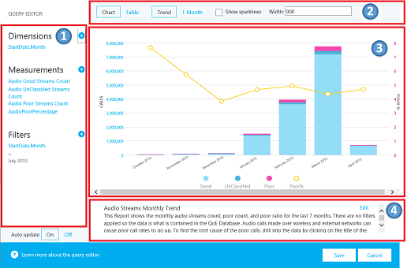

# 使用 Skype for business 服务器的呼叫质量仪表板Use Call Quality Dashboard for Skype for Business Server

**摘要：** 了解如何使用通话质量仪表板。**Summary:** Learn about how to use the Call Quality Dashboard. 通话质量仪表板是 Skype for business 服务器的工具。Call Quality Dashboard is a tool for Skype for Business Server.

通话质量仪表板（CQD）允许 IT 专业人员使用聚合数据通过比较用户组的统计信息来识别产生媒体质量问题的问题，从而确定趋势和模式。Call Quality Dashboard (CQD) allows IT Pros to use aggregate data to identify problems creating media quality issues by  comparing statistics for groups of users to identify trends and patterns. CQD 不专注于解决单个呼叫问题，而是确定适用于多个用户的问题和解决方案。CQD is not focused on solving individual call issues, but on identifying problems and solutions that apply to many users.

## 呼叫质量仪表板用户指南Call Quality Dashboard User Guide

CQD 是一种 web 门户，用于快速创建和组织基于体验质量（QoE）数据的报表。CQD is a web portal for quickly creating and organizing reports based on Quality of Experience (QoE) data. CQD 部署一个 SSAS 多维数据集以聚合 QoE 指标数据库中的数据，并允许管理员实时创建和修改报表或进行调查。CQD deploys an SSAS cube to aggregate the data in the QoE Metrics database, and enables admins to create and modify reports or do investigations in real time. 虽然可以使用 Excel 直接连接到多维数据集，但门户已针对涉及 QoE 数据的几个工作流进行了优化。While it is possible to use Excel to connect directly to the cube, the portal is optimized for several workflows involving QoE data. 数据包括：The data includes:

- 用于快速访问的缓存报表数据Cached report data for fast access
- 指向信息共享和发布的报表页面的深层链接Deep links to report pages for information sharing and publishing
- 简化的报表编辑和创建以及报表说明的可编辑元数据。Streamlined report editing and creation, and editable metadata for report descriptions.

此外，CQD 还会公开 web Api，该 Api 允许用户以编程方式访问多维数据集数据以在自定义仪表板中使用。Also, CQD exposes web APIs that give users programmatic access to the cube data for use in custom dashboards.

### 功能概述Feature Overview

当您访问 "呼叫质量" 仪表板时，将看到以下屏幕：When you visit the Call Quality Dashboard, you see the following screen:

1. "摘要窗格" 是指可以找到 "报表集" （向右）的上下文。The "Summary Pane" is where context for the "Report Set" (to the right) can be found.
2. 单击摘要 PaneReport 中的 "编辑" 以设置级别属性（包括 Y 轴高度）。Click "Edit" in the Summary PaneReport to set level properties (including Y-axis height).
3. 痕迹导航可帮助你在报表集层次结构中标识你的当前位置。The Breadcrumb helps you identify your current location within the report set hierarchy.
4. 带有子报表的报表显示为蓝色链接。Reports with subreports are shown with a blue link. 单击链接以向下钻取到子报表。Click the link to drill down to the child reports.

将鼠标移动到条形图和趋势线上以显示详细值。Move the mouse over the bar charts and trend lines to show detailed values. 具有焦点的报表显示 "操作" 菜单： "编辑"、"克隆"、"删除" 和 "下载"。The report that has focus shows the action menu: "Edit", "Clone", "Delete", and "Download".

### 默认报告Default Reports

首次访问 "呼叫质量" 仪表板门户时，将自动创建一个默认报表集。When you first access the Call Quality Dashboard portal, a default set of reports is automatically created. 这些报告有时称为系统报告。These reports are sometimes referred to as system reports. 你可以通过创建新的同辈报表和子报表来自由修改或删除这些报表或对其进行扩展。You are able to freely modify or delete these reports or extend them by creating new sibling and child reports.

在顶级，"音频流每月趋势" 报表显示所有音频流的每月趋势。At the top level, the "Audio Streams Monthly Trend" report shows the monthly trend for all audio streams. 将鼠标移动到条形图中的条形上，以显示条形图所表示的数据的更详细视图。Move the mouse over the bars in a bar chart to show a more detailed view of the data represented by the bar chart. 单击音频流的 "每月趋势" 报表的标题以导航到 "托管和非托管音频流" 报表，其中的报表在托管和非托管调用之间拆分。Click the title of the Audio Streams Monthly Trend report to navigate to the "Managed vs Unmanaged Audio Streams" report, where the reports are split between Managed and Unmanaged calls. 管理呼叫是从公司防火墙内通过有线连接进行的呼叫。Managed calls are calls made from inside the corporate firewall over wired connections. 非托管通话包括从公司防火墙外部发出的呼叫以及通过 Wi-fi 发出的所有通话。Unmanaged calls include calls made from outside the corporate firewall and all calls made over Wi-Fi.

另一个顶级报表称为 "用户报告的通话质量评估直方图"。The other top-level report is called the "User-reported Call Quality Rating Histogram." 通话质量评级是 Skype for Business 用户在通话结束时给出的数字，用于指示呼叫的质量。Call Quality Ratings are the numbers given by Skype for Business users at the end of a call to indicate the quality of the call. 分级号码的范围从1到5，1是最差，5是最佳。The rating numbers range from 1 to 5, 1 is the worst and 5 is the best. 直方图显示一个月中具有指示评级的音频通话数。The histogram shows the number of audio calls that had the indicated rating in one month.

单击任何报表的标题以导航到报表，其中包含数据的更多筛选器。Click the title of any of the reports to navigate into reports with more filters on the data. 在系统报告中，每个子报告显示其父报告中的一部分数据。In the system reports, each child report displays a subset of the data available in its parent report. 解决问题的模型很简单：调查哪些子报表的数据或趋势表明问题已被限制，并逐渐缩小问题空间。The problem-solving model is simple: investigate which subreport the data or trend suggesting a problem is confined to, and gradually narrow down the problem space. 创建子报表的功能允许你调查有关特定数据趋势的原因的推测。The ability to create subreports allows you to investigate your own guesses about the cause of specific data trends.

### 创建和编辑报表Create and Edit Reports

单击报表的 "操作" 菜单中的 "编辑" 以查看报表编辑器。Click "Edit" in the action menu of a report to see the Report Editor. 每个报告都可以通过对多维数据集进行查询得到。Each report is backed by a query into the cube. 报告是其查询返回的数据的可视化形式。A report is a visualization of the data returned by its query. 报表编辑器可帮助你编辑报表的这些查询和显示选项。The Report Editor helps you edit these queries and the display options of the report. 当您打开 "报表编辑器" 时，将看到：When you open the Report Editor, you  see:

1. 左侧窗格中选择了维度、度量和筛选器。Dimensions, measures, and filters are chosen in the left pane. 将鼠标悬停在某个现有值上以显示 "x" 按钮，该按钮允许删除值。Hover over one of the existing values to show an "x" button that allows the value to be removed. 单击标题旁边的 "加号" 按钮以打开对话框，您可以在其中添加新的维度、度量值或筛选器。Click the "plus" button next to a heading to open the dialog where you can add a new dimension, measure, or filter.
2. 顶部显示了图表自定义选项。Options for chart customization are displayed at the top.
3. 报告编辑器中提供了报告预览。A preview of the report is available in the Report Editor.
4. 可以使用底部的 "编辑" 框创建详细的报表说明。A detailed report description can be created with the edit box at the bottom.

### 表中的迷你图Sparklines in Tables

将 StartDate.Month 添加为一个维度，且数据以表格形式呈现为趋势时，可以在表格单元格内显示条形图和迷你图。When StartDate.Month is added as a dimension and the data is rendered as a trend in table form, bar charts and sparklines can be shown inside the table cells. 将鼠标指针移动到条形图和迷你图上，以显示各个月份的值。Move the mouse pointer over the bar chart and the sparklines to show the values for individual months.

为了显示条形图和迷你图，必须选中报表编辑器顶部的 "显示迷你图" 复选框。In order for the bar charts and the sparklines to appear, the "Show sparklines" checkbox at the top of the Report Editor must be checked. 这将选择趋势选项，并将 Month 下移到最后一个维度，也可以通过单击月份并使用向上和向下箭头，将 "开始日期" 或 "向下键"。This selects the Trend option and moves Month down to be the last dimension, which can also be accomplished by clicking on Month and using the up and down arrows to shift StartDate.Month up or down.

### 设置Settings

"设置" 菜单包含指向有用页面（如 "系统运行状况" 和 "关于页面"）的链接，位于仪表板的右上角。The settings menu contains links to useful pages like the System Health and About pages, and is located in the top-right corner of the dashboard.

是否显示说明和时间戳由单个用户决定，并且这些设置仅影响个人的仪表板版本，不要修改报表集或其他用户所看到的内容。Whether to show descriptions and time stamps is up to individual users, and these settings only affect the individual's version of the dashboard, and do not modify the report set or what other users see. 清除缓存会导致所有查询从多维数据集中重新加载其数据，而还原默认值将删除所有用户创建或修改的报表，并重新创建系统报表集—用户首次登录时将看到的内容。Clearing the cache causes all queries to reload their data from the cube, while restoring defaults deletes all of user-created or modified reports and recreates the system report set — what a user would see when they log in for the first time.

用户仪表板链接显示用户可以在其中查看 CQD 的其他用户并浏览其报告的页面。The Users Dashboard Link shows a page where users can view other users of CQD and browse their reports. 若要共享报表集，请复制 URL 栏中的链接，并将其与另一个 CQD 用户共享。To share a report set, copy the link in the URL bar and share it with another CQD user. 此链接与其他用户将在用户仪表板链接页面中的用户用户名下看到的链接相同。This link is the same link other users would see in the Users Dashboard Link page under the user's username.

### 提供子网信息Supplying Subnet Information

如果将特定于站点的信息输入到存档数据库以提供子网间映射信息（例如，有线/无线呼叫质量，通过构建），则可能会泄漏其他信息。Additional information can be revealed if site-specific information is entered into the Archive database to provide subnet-to-building mapping information (for example, wired/wireless call quality by building).

至少，完成下表以创建这些报表：At a minimum, complete the following tables to create these reports:

- CqdBuildingCqdBuilding
- CqdNetworkCqdNetwork

可在 CqdBuildingType 和 CqdBuildingOwnershipType 表中提供其他信息以进行进一步的筛选和向下钻取。Additional information can be provided in CqdBuildingType and CqdBuildingOwnershipType tables to allow further filtering and drill-down.

用于这些表的数据定义如下：The data used for these tables are defined as follows:

**CqdBuilding****CqdBuilding**

|列Column|数据类型Data Type|是否允许 Null？Allow Nulls?|详细信息Details|
|:-----|:-----|:-----|:-----|
|BuildingKeyBuildingKey |intint |否No |CqdBuilding 表的主键。Primary key for the CqdBuilding table. |
|BuildingNameBuildingName |varchar(80)varchar(80) |否No |大楼名称。Building name. |
|BuildingShortNameBuildingShortName |varchar(10)varchar(10) |否No |大楼名称的简短版本。Shorter version of the Building name. |
|OwnershipTypeIdOwnershipTypeId |intint |否No |外键，匹配 CqdBuildingOwners 表中的其中一个条目。Foreign key, matches one of the entries in the CqdBuildingOwners table. |
|BuildingTypeIdBuildingTypeId |intint |否No |外键，匹配 CqdBuildingType 表中的其中一个条目。Foreign key, matches one of the entries in the CqdBuildingType table. |
|纬度Latitude |floatfloat |是Yes |大楼的纬度。Latitude of the building. |
|经度Longitude |floatfloat |是Yes |大楼的经度。Longitude of the building. |
|CityNameCityName |varchar(30)varchar(30) |是Yes |大楼所在的城市名称。City name where the building is located. |
|ZipCodeZipCode |varchar(25)varchar(25) |是Yes |大楼所在的邮编。Zip code where the building is located. |
|CountryShortCodeCountryShortCode |varchar(2)varchar(2) |是Yes |大楼所在的国家/地区的 ISO 3166-1 alpha-2 代码。ISO 3166-1 alpha-2 codes for the country where the building is located. |
|StateProvinceCodeStateProvinceCode |varchar(3)varchar(3) |是Yes |生成所在的州/省的三个字母的缩写。Three-letter abbreviation for the State/Province where the building is located. |
|InsideCorpInsideCorp |bitbit |是Yes |位表示建筑物是否是企业网络的一部分。Bit indicates whether the building is part of the corporate network. |
|BuildingOfficeTypeBuildingOfficeType |nvarchar(150)nvarchar(150) |是Yes |大楼办公室类型的说明。Description of the building office type. |
|区域Region |varchar(25)varchar(25) |是Yes |大楼所在的地区。Region where the building is located. |
|||||

**CqdNetwork****CqdNetwork**

|列Column|数据类型Data Type|是否允许 Null？Allow Nulls?|详细信息Details|
|:-----|:-----|:-----|:-----|
|网络Network |varchar(25)varchar(25) |否No |子网地址。Subnet address. |
|NetworkRangeNetworkRange |tinyinttinyint |是Yes |子网掩码。Subnet mask. |
|NetworkNameIDNetworkNameID |intint |是Yes |可选地映射到 CqdNetworkName 表中的一行。Optionally maps to a row in CqdNetworkName table. |
|BuildingKeyBuildingKey |intint |是Yes |外键，匹配 CqdBuilding 表中的其中一个条目。Foreign key, matches one of the entries in the CqdBuilding table. |
|UpdatedDateUpdatedDate |datetimedatetime |否No |条目最后更新的日期时间。Datetime for when the entry was last updated. |
||||||

默认情况下，下一个表包含一个条目（0，"Unknown"）。By default this next table has one entry (0, 'Unknown').

**CqdBuildingType****CqdBuildingType**

|列Column|数据类型Data Type|是否允许 Null？Allow Nulls?|详细信息Details|
|:-----|:-----|:-----|:-----|
|BuildingTypeIdBuildingTypeId |intint |否No |CqdBuildingType 表的主键。Primary key for the CqdBuildingType table. |
|BuildingTypeDescBuildingTypeDesc |char(18)char(18) |否No |大楼类型说明。Building type description. |
|||||

默认情况下，下一个表包含一个条目（0、"Unknown"、0、null）。By default this next table has one entry (0, 'Unknown', 0, null).

**CqdBuildingOwnershipType****CqdBuildingOwnershipType**

|列Column|数据类型Data Type|是否允许 Null？Allow Nulls?|详细信息Details|
|:-----|:-----|:-----|:-----|
|OwnershipTypeIdOwnershipTypeId |intint |否No |CqdBuildingOwnershipType 表的主键。Primary key for the CqdBuildingOwnershipType table. |
|OwnershipTypeDescOwnershipTypeDesc |varchar(25)varchar(25) |否No |所有权类型说明。Ownership type description. |
|LeaseIndLeaseInd |tinyinttinyint |是Yes |引用 CqdBuildingOwnershipType 表中其他行的索引，用于确定租用的大楼。Index referencing another row in the CqdBuildingOwnershipType table, used for identifying leased buildings. |
|所有者Owner |varchar(50)varchar(50) |是Yes |大楼所有者。Building owner. |
|||||

默认情况下，下一个表包含一个条目（0、"Unknown"、0、null）。By default this next table has one entry (0, 'Unknown', 0, null).

**CqdBssid****CqdBssid**

|列Column|数据类型Data Type|是否允许 Null？Allow Nulls?|详细信息Details|
|:-----|:-----|:-----|:-----|
|bssbss |nvarchar(50)nvarchar(50) |否No |CqdBssid 表的主键。Primary key for the CqdBssid table. 是 WiFi 接入点的 BSSID。Is the BSSID of the WiFi Access Point. |
|essess |nvarchar(50)nvarchar(50) |是Yes |WiFi 接入点控制器信息。Wifi Access Point Controller information. |
|phyphy |nvarchar(50)nvarchar(50) |是Yes |Phy 信息。Phy information. |
|apap |nvarchar(50)nvarchar(50) |是Yes |WiFi 接入点名称。Wifi Access Point Name. |
|大楼Building |nvarchar(500)nvarchar(500) |是Yes |WiFi 接入点所在的建筑物名称。The Building Name the WiFi Access Point is located in. |
||||

## CQD 流CQD Streams

CQD 流被视为 "良好"、"差" 或 "未分类"。A CQD stream is considered good, poor, or unclassified. CQM 1.5 现在使用以下 CQD 定义：CQM 1.5 now uses the following CQD definition:

- 较差的流是不超过阈值的较差调用指标的任意组合。A poor stream is any combination of the poor call metrics beyond threshold.
- 当通话中的一个流较差时，两个通话流都被标记为差。When one stream in a call is poor, both streams of the call are flagged poor. 在会议中，每个参与者都计为唯一通话，并单独报告给所有其他参与者。In conferences, each participant is counted as a unique call and is reported on independently of all others.
- 未分类流是没有质量指标（即，合成事务或短调用）的数据流。Unclassified streams are streams without quality metrics (that is, Synthetic Transactions or short calls).
- 有效流 = 非移动客户端Valid Streams = non-mobile clients
- 分类器不能修改Classifier cannot be modified

**较差呼叫定义/分类器****Poor call definition/classifier**

|指标Metric|阈值Threshold|
|:-----|:-----|
|DegradationAvgDegradationAvg |大于 1.0（-1 网络 MOS）Greater than 1.0 (-1 network MOS) |
|RoundTripRoundTrip |大于 500 Greater than 500 |
|PacketLossRatePacketLossRate |大于0.1 （10%）Greater than 0.1 (10%) |
|JitterInterArrivalJitterInterArrival |大于 30 Greater than 30 |
|RatioConcealedSamplesAvgRatioConcealedSamplesAvg |大于0.07Greater than 0.07 |
|||

JPDR 定义 = 较差呼叫定义减去 RatioConcealedSamplesAvg JPDR definition = Poor call definition minus RatioConcealedSamplesAvg

## 呼叫方/被呼叫方在哪里？Where is Caller/Callee?

CQD 不使用 "调用方/被调用方" 字段，而是使用 "First" 和 "Second"，因为调用方和被调用方之间有介入的步骤。CQD doesn't use Caller/Callee fields, instead it uses "First" and "Second" because there are intervening steps between the caller and callee.

 **第一个**如果流中涉及服务器，则始终为服务器终结点（例如，AV MCU 或中介服务器）。**First** Will always be the Server endpoint (for example, AV MCU or Mediation Server) if a Server is involved in the stream.

 **第二个**将始终是客户端端点，除非是服务器-服务器流。**Second** Will always be the Client endpoint, unless it is a Server-Server stream.

**“第一个”和“第二个”分类示例****Example of First and Second classification**

|端点 1 UAType Endpoint 1 UAType|端点 2 UUAType Endpoint 2 UUAType|第一个First|第二个Second|
|:-----|:-----|:-----|:-----|
|2 (AVMCU) 2 (AVMCU) |4 (Skype for Business) 4 (Skype for Business) |端点 1Endpoint 1 |端点 2Endpoint 2 |
|2 (AVMCU) 2 (AVMCU) |1 (mMediationServer) 1 (mMediationServer) |端点 2Endpoint 2 |端点 1Endpoint 1 |
|4 (Skype for Business)4 (Skype for Business) |4 (Skype for Business) 4 (Skype for Business) |MediaLine 中的呼叫方 The Caller in MediaLine |MMediaLine 中的被呼叫方 The Callee in MMediaLine |
|||||

如果两个终结点的类型相同，CQD 将使调用方条目成为第二个终结点和被调用方的条目。If both endpoints are the same type, CQD makes the Caller entry First and the Callee Second. 有关终结点名称的详细信息，请参阅[此博客](https://blogs.technet.com/b/jenstr/archive/2015/05/22/call-quality-dashboard-tips-and-tricks.aspx)。For more information about endpoint names, see [this blog](https://blogs.technet.com/b/jenstr/archive/2015/05/22/call-quality-dashboard-tips-and-tricks.aspx).

## VPN 考虑事项Accounting for VPN

如果已知 VPN 解决方案能够准确地设置 VPN 标志，则您已经设置完毕。If VPN solution is known to accurately set VPN flag, you're all set. 否则，请使用以下方法之一：Otherwise, use one of the following methods:

- 创建名为 VPN 的网络类型（首选），然后将 VPN 子网与此新 VPN 网络类型关联。Create a Network Type called VPN (preferred), then Associate VPN Subnets with this new VPN NetworkType.
- 创建名为 VPN 的大楼，然后将 VPN 子网与此大楼关联。Create a building called VPN, then Associate VPN Subnets with this building.

## 查询基础知识Query Fundamentals

格式正确的查询包含以下三个参数：A well-formed query contains all three of these parameters:

- 度量Measurement
- 维度Dimension
- 筛选器Filter

例如，“按子网[维度]显示大楼 6 [筛选器]的较差流[度量]”是一个格式正确的查询。An example of a well-formed query would be "Show me Poor Streams [Measurement] by Subnet [Dimension] for Building 6 [Filter]."

## “联合”起什么作用？What does UNION do?

Union 允许你用 AND 运算符筛选条件。Union allows you to filter conditions with the AND operator. 在某些情况下，你可以将多个筛选条件结合在一起以获得类似于 OR 操作的结果。There are scenarios where you can combine multiple Filter conditions together to achieve a result similar to an OR operation.

示例：若要从建筑物获取所有流，UNION 将提供合并数据集的独特视图。Example: To get all streams from a building, UNION provides a distinct view of the merged dataset. 要使用“联合”，请在你要联合的两个筛选条件上的“联合”字段中插入普通文本。To use the UNION, insert common text into the UNION field on the two filter conditions you want to UNION.

## 默认报告细分Default Report Breakdown

如果在内部管理无线，你可以在管理存储桶中重新创建“无线”报告。If Wireless is managed internally, you can recreate the Wireless reports in the Managed bucket.

## 可选过程Operational Processes

先查看和修正托管流。Review and remediate Managed Streams first. 此区域中的质量应该完全在你的控制范围内，因此最容易修复。Quality in this area should be 100% within your control and therefore easiest to remediate.

### 管理流 Managed Streams

按以下顺序查看并更正管理流：Review and remediate managed streams in the following order:

1. 服务器-服务器 Server-Server
2.  服务器-有线-内部Server-Wired-Inside
3. 有线-有线-内部 Wired-Wired-Inside

### 非管理流Unmanaged Streams

按以下顺序查看并更正非管理流：Review and remediate unmanaged streams in the following order:

1. 服务器-WiFi-内部Server-Wifi-Inside
2. 服务器-有线-外部Server-Wired-Outside
3. 服务器-WiFi-外部Server-Wifi-Outside
4. 有线-外部-直接Wired-Outside-Direct
5. 有线-外部-中继Wired-Outside-Relay
6. 其他非管理Other Unmanaged
