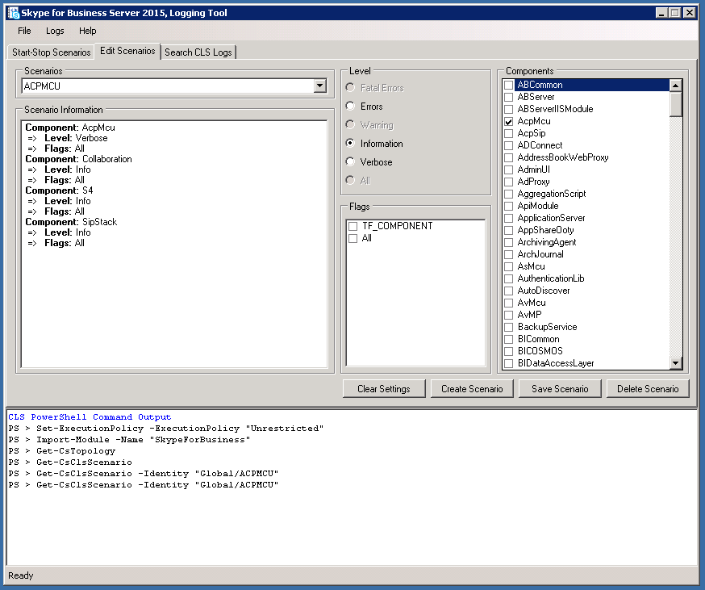

# Skype for Business Server 2015 的 CLS 日志记录程序
 
**摘要：**了解如何使用业务服务器 2015 Skype 在集中式日志记录服务 (CLS) 记录器。
  
CLS 日志记录程序是一个可帮助您管理集中日志记录服务生成的日志的工具。
  
## 先决条件

要成功使用 CLS 日志记录程序，您需要确保满足以下条件：
  
- 运行工具的计算机属于运行集中日志记录服务 (CLS) 的域的成员。远程 PowerShell 会话中当前不支持该工具。
    
- 来自跟踪文件夹（为 CLS 捕获跟踪数据的文件夹）和 Snooper 的 Default.tmx 文件必须复制到安装 CLS 日志记录程序工具的同一文件夹中。
    
## 检查一组池/计算机的日志记录状态

使用以下命令检查日志记录状态：
  
1. 在"启动/停止方案"选项卡上，选择池和/或计算机拓扑树视图中的分组。
    
2. 单击“日志记录状态”按钮。
    
3. 在“PowerShell 命令输出”区域查看命令输出结果以了解有关所选池和/或计算机的日志记录状态的详细信息。
    
## 启动现有方案

要启动现有方案：
  
1. 在"启动/停止方案"选项卡中，从方案下拉菜单中选择现有方案。
    
2. 选择“拓扑”树视图中的一组池和/或计算机。
    
3. 单击“启动方案”按钮。用户界面将被禁用，直到操作完成为止。在大型部署中，此过程可能会很缓慢。
    
4. 成功启动方案后，用户界面将被再次启用，“PowerShell 命令输出”区域中也会显示操作的详细信息。
    
5. 此任务可能会耗费一些时间，然后 CLS 才能从此方案获取新的日志记录数据。
    
## 停止现有方案

要停止现有方案：
  
1. 在"启动/停止方案"选项卡中，从方案下拉菜单中选择现有方案。
    
2. 选择“拓扑”树视图中的一组池和/或计算机。
    
3. 单击“停止方案”按钮。用户界面将被禁用，直到操作完成为止。在大型部署中，此过程可能会很缓慢。
    
4. 停止方案后，用户界面将被再次启用，“PowerShell 命令输出”区域中也会显示操作的详细信息。
    

  
## 搜索日志

要搜索的日志，请选择"搜索符合 CLS 日志"选项卡并填写显示的字段，如下所述后单击"搜索日志"按钮：
  
> **日志文件文件夹** 保存日志搜索结果的文件夹。（必填）
    
> **日志级别** 此字段确定了将在结果中显示的最低级别。例如，如果选择了 Warning，则仅会显示 Warning、Error 和 Fatal。默认为 Debug。
    
> **池** 要执行日志搜索的计算机池，这些是树视图中的父节点。（必填）
    
> **计算机** 要执行日志搜索的各个计算机，这些是树视图中的所有子节点。（必填）
    
> **开始时间** CLS 开始查询日志的时间。（必填）
    
> **结束时间** CLS 停止查询日志的时间。（必填）
    
> **组件** 用于选择要添加到查询的组件。（可选）
    
> **呼叫 ID** 要作为筛选依据的任何 SIP 对话的呼叫 ID。注意，此字段使用精确匹配。（可选）
    
> **会议 ID** 要作为筛选依据的任何会议的会议 ID。注意，此字段使用精确匹配。（可选）
    
> **IP 地址** 要作为筛选依据的 IP 地址。注意，此字段使用精确匹配。（可选）
    
> **关联 ID** 逻辑上由此 ID 链接到一起的跟踪语句。（可选）
    
> **电话号码** 按电话号码进行筛选。（可选）
    
> **SIP URI** 按 SIP URI 进行筛选。（可选）
    
> **SIP 消息内容包含** 按 SIP 消息内容进行筛选，这会在此字段中进行子字符串搜索。（可选）
    
> **任意匹配** 使用逻辑 OR（如果选中）进行搜索。默认为精确匹配所有参数。
    
> **跳过网络日志** 跳过搜索任意网络日志（如果选中）。
    

  
## 创建方案

1. 在**编辑方案**选项卡上，单击**创建方案**按钮。
    
    > [!NOTE]
    > 创建新方案将克隆当前所选方案的配置。如果在创建新方案前单击“清除设置”****，新方案启动时将不选中任何组件和标志。
  
2. 输入要创建的方案的名称，然后按 Enter 键或单击“确定”按钮。
    
3. 现在将创建新方案。创建成功后，“方案”下拉框中会选中新创建的方案。
    
## 修改方案

  
1. 在“编辑方案”****选项卡中，找到要修改的方案。
    
2. 对组件、级别和标志进行所需的更改。
    
3. 单击“保存方案”****按钮。
    
4. 保存方案成功时，方案信息窗格将刷新为更新后的配置。
    
## 删除方案

1. 在“编辑方案”****选项卡中，从“方案”下拉菜单中选择现有方案。
    
2. 单击“删除方案”****删除该方案。
    
3. 确认操作后，方案随即删除。
    

