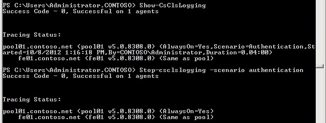

# <a name="start-or-stop-cls-log-capture-in-skype-for-business-server-2015"></a>在 Skype for Business Server 2015 中启动或停止 CLS 日志捕获
 
**摘要：** 了解如何在 Skype for Business Server 2015 中启动或停止集中日志记录服务日志捕获会话。
  
若要使用集中日志记录服务捕获跟踪日志，请发出命令以开始在一台或多台计算机和池中进行日志记录。 您还会发出参数来定义哪些计算机或池、要运行 (的方案（例如 AlwaysOn、另一个预定义方案或已创建) 的方案）以及要跟踪的 Skype for Business Server 组件 (例如 S4、SipStack) 。
  
若要捕获正确的信息，您需要确保使用正确的方案收集与问题相关的信息。 在集中日志记录服务中，方案是基于服务器组件、日志记录级别和标志的集合启用日志记录的概念，这比必须基于每个服务器定义这些元素要高效和有用。 您只需定义一个方案并指定运行该方案，该方案即会在基础架构范围内的所有服务器和池中一致地运行。
  
默认方案称为 **AlwaysOn**。顾名思义，AlwaysOn 的目的就是持续不断地运行方案。AlwaysOn 方案为许多最常用的服务器组件收集信息级别信息（请注意，除“信息”消息外，“信息”日志记录级别还包括致命错误、错误和警告）。AlwaysOn 在问题发生之前、发生过程中和发生之后收集信息。这与以前的日志记录工具（如 OCSLogger）的典型行为截然不同。您在问题发生之后才运行 OCSLogger，这使得故障排除工作更加困难，因为获得的数据是被动而非主动的。如果 AlwaysOn 不包含您正在寻找的能够指出问题组件和纠正措施的信息（考虑到 AlwaysOn 中提供程序的广度和深度，不太可能会发生这种情况），它会指出一个合理的信息水平，以确定您需要执行的其他操作，例如，创建新方案，收集其他信息，运行不同搜索来收集更集中的详细信息等等。
  
集中日志记录服务提供了两种发出命令的方法。 许多主题已完全专注于通过 Skype for Business Server Windows PowerShell命令行管理程序使用应用程序。 使用大量复杂配置和命令的能力Windows PowerShell集中日志记录服务使用。 由于Windows PowerShell Skype for Business Server 命令行管理程序对 Skype for Business Server 中所有功能进行配置几乎无处不在，因此仅讨论Windows PowerShell命令。 
  
### <a name="to-run-start-csclslogging-with-windows-powershell-using-basic-commands"></a>使用基本Start-CsClsLogging Windows PowerShell运行命令

1. 启动 Skype for Business Server命令行管理程序：单击"开始"，**单击"所有** 程序"，再单击 **"Skype for Business 2015"，** 然后单击 **"Skype for Business Server 命令行管理程序"。**
    
2. 通过键入以下内容，使用集中日志记录服务启动日志记录方案：
    
   ```PowerShell
   Start-CsClsLogging -Scenario <name of scenario>
   ```

    例如，若要启动 **AlwaysOn** 方案，请键入：
    
   ```PowerShell
   Start-CsClsLogging -Scenario AlwaysOn
   ```

    > [!NOTE]
    > AlwaysOn 方案没有默认持续时间。 此方案将一直运行，直到使用 **Stop-CsClsLogging** cmdlet 显式停止它。 有关详细信息，请参阅 [Stop-CsClsLogging](https://docs.microsoft.com/powershell/module/skype/stop-csclslogging?view=skype-ps)。 对于所有其他方案，默认持续时间为 4 小时。 
  
3. 按 Enter 运行命令。 
    
    > [!NOTE]
    > 运行命令和从部署中的 (接收状态) 可能需要 30 到 60 秒的时间。 
  
     
  
4. 若要启动另一个方案，请使用 **Start-CsClsLogging** cmdlet 和要运行的其他方案的名称，如下所示 (例如，方案 **身份验证**) ：
    
   ```PowerShell
   Start-CsClsLogging -Scenario Authentication
   ```

    > [!IMPORTANT]
    > 你随时可以在任何给定计算机上总共运行两个方案。 如果命令在作用域内是全局命令，则部署中所有计算机都将运行方案。 若要启动第三个方案，必须在要运行新方案的计算机、池、站点或全局范围上停止日志记录。 如果已启动全局范围，可以在一台或多台计算机和池中停止一个或两种方案的日志记录。 
  
### <a name="to-run-start-csclslogging-with-windows-powershell-using-advanced-commands"></a>使用高级Start-CsClsLogging Windows PowerShell运行命令

1. 启动 Skype for Business Server命令行管理程序：单击"开始"，**单击"所有** 程序"，再单击 **"Skype for Business 2015"，** 然后单击 **"Skype for Business Server 命令行管理程序"。**
    
2. 其他参数可用于管理日志记录命令。 可以使用 -Duration 调整方案运行的时间长度。 还可以定义 -Computers，即计算机完全限定域名列表 (FQDN) （用逗号分隔）或 -Pools（要运行日志记录的池的以逗号分隔的 FQDN 列表）。
    
    在池"pool01.contoso.net"上为 UserReplicator 方案启动日志记录会话。 还可以将日志记录会话的持续时间定义为 8 小时。 为此，请键入：
    
   ```PowerShell
   Start-CsClsLogging -Scenario UserReplicator -Duration 8:00 -Pools "pool01.contoso.net"
   ```

    成功执行此方案将返回如下所示的结果：
    
     
  
请注意，此示例中，AlwaysOn 方案正在运行，并且 UserReplicator 方案正在运行。 
    
## <a name="stop-the-centralized-logging-service-log-capture"></a>停止集中日志记录服务日志捕获
<a name="stop"> </a>

您可以使用 Stop-CsClsLogging cmdlet 停止当前正在运行的日志记录会话。 通常，不需要停止日志记录会话的情况并不多。 例如，无需先停止日志记录就可以搜索日志和更改配置。 如果您有两种方案（例如 AlwaysOn 和 UserReplicator）在运行，并且您需要收集与身份验证相关的信息，则您需要停止其他方案之一（在全局、站点、池或计算机范围内），然后才能开始运行身份验证方案。 有关详细信息，请参阅 [Stop-CsClsLogging](https://docs.microsoft.com/powershell/module/skype/stop-csclslogging?view=skype-ps)。
  
> [!NOTE]
> 在确定可以在给定部署、池或计算机上运行的方案时，需要记住，每个计算机只能运行两个方案：AlwaysOn 和一个自定义方案。 如果您要记录某个池上的活动，应将一个池视为单一实体。 在大多数情况下，在池中的每台计算机上运行不同方案没有意义。 了解正在收集其数据的问题以及考虑哪些方案在总体部署中的给定计算机上运行最有意义才是合理的。 例如，如果考虑 UserReplicator 方案，在边缘服务器或边缘池中运行 UserReplicator 的价值将非常小。 
  
在了解了问题和影响范围后，应谨慎选择哪些方案在哪些计算机和池上运行。AlwaysOn 方案对于广泛的应用具有意义，因为它收集各类提供商的信息，而具体方案只在特定计算机或池上具有应用价值。此外，在随机启动日志记录会话而不先了解给定方案的价值时务必小心。如果使用的方案错误，或者虽然使用的方案适合任务，但应用范围（全局、站点、池或计算机）错误，您可以获得不是很有用的可疑数据，就像您根本没有运行该方案一样。
  
若要使用 Skype for Business Server 命令行管理程序控制集中日志记录服务功能，您必须是基于 CsAdministrator 或 CsServerAdministrator 角色的访问控制 (RBAC) 安全组的成员，或者是包含这两个组之一的自定义 RBAC 角色。 若要返回此 cmdlet 已分配给 (的所有 RBAC 角色列表（包括您自己创建的任何自定义 RBAC 角色) ，请从 Skype for Business Server 命令行管理程序 或 Windows PowerShell 提示符运行以下命令：
  
```PowerShell
Get-CsAdminRole | Where-Object {$_.Cmdlets -match "Skype for Business Server 2015 cmdlet"}
```

例如：
  
```PowerShell
Get-CsAdminRole | Where-Object {$_.Cmdlets -match "Set-CsClsConfiguration"}
```

> [!NOTE]
> 因此，您可能想知道：现在已启用日志记录，日志将保留在何处？ 由于您将使用发送到 CLS 代理的命令行管理程序查询访问日志中存储的信息，并且可以将结果输出到几种可能的文件格式，其中，CLS 代理保留其记录在每台服务器上实际上并不很重要。  日志文件可以保存到您指定的位置，并可以使用多种工具进行读取和分析，包括 **Snooper.exe** 以及任何可读取文本文件的工具， **如** Notepad.exe。 Snooper.exe是 Skype for Business Server 2015 调试工具的一部分，并作为 [Web 下载提供](https://go.microsoft.com/fwlink/p/?LinkId=285257)。

### <a name="to-stop-a-currently-running-centralized-logging-service-session"></a>停止当前正在运行的集中日志记录服务会话

1. 启动 Skype for Business Server命令行管理程序：单击"开始"，**单击"所有** 程序"，再单击 **"Skype for Business 2015"，** 然后单击 **"Skype for Business Server 命令行管理程序"。**
    
2. 通过键入以下内容，查询集中日志记录服务，了解当前正在运行的方案：
    
   ```PowerShell
   Show-CsClsLogging
   ```

   
  
   Show-CsClsLogging 的结果是正在运行的方案以及它们所运行的范围的摘要。 有关详细信息，请参阅 [Show-CsClsLogging](https://docs.microsoft.com/powershell/module/skype/show-csclslogging?view=skype-ps)。
    
3. 若要使用特定方案停止当前正在运行的日志记录会话，请键入：
    
   ```PowerShell
   Stop-CsClsLogging -Scenario <scenario name> -Computers <comma separated list of fully qualified computer names> -Pools <comma separated list of fully qualified pool names>
   ```
   例如：
    
   ```PowerShell
   Stop-CsClsLogging -Scenario UserReplicator -Pools pool01.contoso.net
   ```

   此命令将在 pool01.contoso.net 上使用 UserReplicatior 方案停止日志记录。
    
    > [!NOTE]
    > 在此日志记录会话期间使用 UserReplicator 方案创建的日志不会被删除。 您仍然可以使用 Search-CsClsLogging 命令对日志记录执行搜索。 有关详细信息，请参阅 [Search-CsClsLogging](https://docs.microsoft.com/powershell/module/skype/search-csclslogging?view=skype-ps)。 
  
作为 Start-CsClsLogging 的配套命令，Stop-CsClsLogging cmdlet 会结束方案定义的日志记录会话，并保留日志记录会话创建的日志。任何时候都可以在给定计算机上运行两个方案。停止一个方案而使用另一个方案收集信息的方法是一项常见的任务，您可以在大多数工作负荷故障排除过程中执行该任务。
## <a name="see-also"></a>另请参阅
<a name="stop"> </a>

[Skype for Business 2015 中的集中日志记录服务](centralized-logging-service.md)
