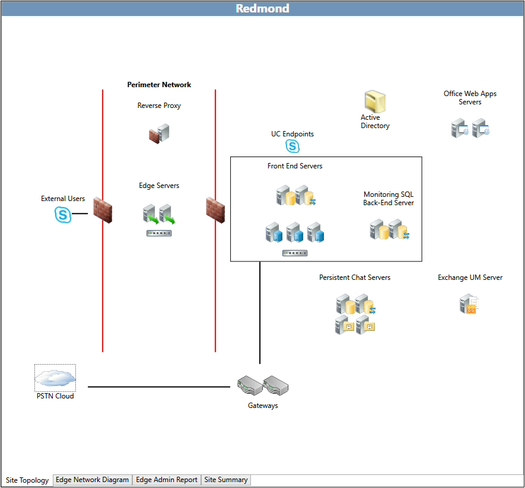

# Edit the topology in Skype for Business Server 2015

完成初始的访谈式问题后，即可编辑站点的完全限定的域名 (FQDN) 和 IP 地址。为此，请在“**全局拓扑**”页上双击要编辑的站点。

规划工具显示所选的站点的站点拓扑。 在站点页面的底部有四个选项卡：

- 站点拓扑-当前显示的页面与所推荐的拓扑的概览。

- 边缘网络图-边缘网络图页是其中设计器完成大部分在规划工具中工作。 图表显示业务服务器 2015年拓扑建议 Skype 的网络配置，可编辑条目的 IP 地址和 Fqdn 服务器、 池，并同时硬件和域名系统 (DNS) 负载平衡器。

- 边缘管理报告-边缘管理报告包含四个报表，总计：

     

  - 摘要报告-常规边缘网络配置设置的报告。 如果将“**边缘网络图**”页上的值编辑为将在实际部署中使用的拓扑 TCP/IP 和 FQDN 值，则会在此处显示那些地址和名称。 否则将显示默认文本。

  - 证书报告-证书报告将列出的使用者名称和使用者替代名称，证书所需的拓扑。

  - 防火墙报告-防火墙报告列出了外围防火墙配置基础结构中所需的信息。 其中包括 IP 地址（默认值或编辑的值）、服务器角色、源 IP 和端口、目标 IP 和端口、传输协议、应用程序协议和相关的说明。

  - DNS 报告-DNS 报告列出了您必须创建 DNS 条目的相关信息。 其中包括相应操作所需的记录类型、FQDN、IP 地址和备注。

- 网站摘要-网站摘要概述由回答初始面试问题或填写**设计网站**中的值所做的选择。 此外，还显示容量信息。

    > [!NOTE]
    > “站点摘要”页上的信息可针对每个设计进行自定义，可能不包含此处详细介绍的所有内容或信息。

## 编辑网络配置图

在网络图上定义的 IP 地址和条目完全限定的域名 (Fqdn) 的项包含大部分设计器中 Skype 作用业务 Server 2015 规划工具工作。 在此页输入的信息可延伸到的报告，并在规划工具中包含的其他信息。

规划工具创建网络图与 IP 地址和 Fqdn 的默认文本。

编辑网络图和输入值：

1. 选择起始网络段。例如，双击文本 **access1.contoso.com**。在打开的对话框中，键入服务器 access1.contoso.com 的实际 FQDN，并输入实际的 IP 地址以替换 131.107.155.3。

2. 单击“**确定**”以保存条目。

3. 继续编辑 IP 地址和 FQDN，从而为硬件负载平衡器提供虚拟 IP 地址或者为池中服务器的域名系统 (DNS) 负载平衡提供服务器条目。

规划工具的一个有用功能是可以递增地分配一系列 IP 地址和服务器主机名称，而不是要求设计师编辑池中的单台服务器。例如：

1. 双击池化的前端服务器。对话框打开后，选中“**是否要将这些 IP 地址和 FQDN 用作此群集中所有对等服务器的起点？**”。

2. 例如，第一台服务器的起始值是 fe0101.contoso.com，IP 地址是 192.168.21.122。

3. 在“前端服务器 FQDN”中键入 **fe0.contoso.com**，在“**前端服务器 IP 地址**”中键入 192.168.21.131，然后单击“**确定**”。

4. 自动增量功能会将池中的所有服务器更新为 fe01 到 fe06，将所有 IP 地址更新为 192.168.21.131 到 192.168.21.136。

完成所有编辑后，执行以下步骤以保存拓扑：

若要保存的规划工具的设计，单击**文件**，然后单击**保存拓扑**或**将拓扑另存为**。 如果出现“**将规划工具另存为**”对话框，请在“**文件名**”中键入文件的名称，然后单击“**保存**”。

## 另请参阅

[Editing the Design](https://technet.microsoft.com/library/08f639ba-0e5f-4ae7-9191-c3d96c25b169.aspx)
