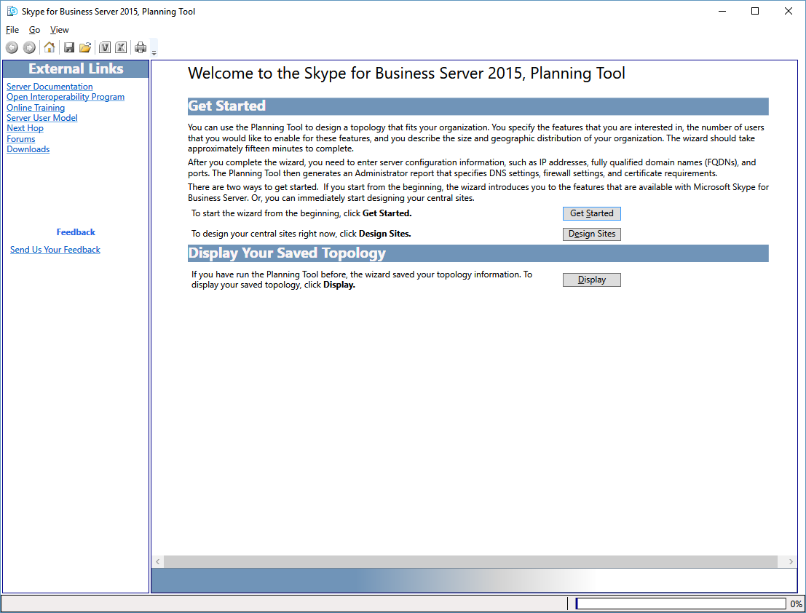

# Navigate the Planning Tool in Skype for Business Server 2015

通过使用工具栏、特定于页面的按钮和链接以及上下文特定的窗格的组合, 可导航 Skype for Business Server 2015 规划工具。 特定于上下文的窗格提供与特定页上的选项相关的规划和容量的设计信息。

启动规划工具时, 设计器首先看到 **"欢迎使用 Skype for Business Server 2015 的规划工具"** 页面。

在“欢迎”页上，设计人员可选择“**开始**”、“**设计站点**”或“**显示**”。 有关详细信息, 请参阅[创建 Skype for Business Server 2015 的初始拓扑设计](create-the-initial-design.md)。

在规划工具的顶部是一个工具栏, 可轻松访问常用功能。 此处显示的工具栏仅供参考，各项功能将在相关主题中讨论。

规划工具的左侧有一个 "外部链接" 部分。 在此处，设计师可轻松访问规划和部署信息，以及其他技术资源（如培训、技术博客、论坛及其他可下载的资源）。 此外, 在 "外部链接" 部分中, 还提供了一个指向 Skype for Business Server 2015 规划工具团队的反馈链接。

计划工具中的多个页面上显示上下文相关的操作窗格。 “操作”窗格使设计师可轻松访问拓扑的主要部分。 “操作”窗格中可用的链接根据拓扑中的详细级别而改变。 完成访谈式问题并显示拓扑后，“操作”窗格才可用。 “操作”窗格中包含“概览”部分，其中显示了设计师在访谈过程中输入的数值。 概览内容与显示的信息上下文相关。

此外，“操作”窗格下的概览中还显示硬件信息。硬件配置显示当前拓扑推荐的硬件要求列表。

## 另请参阅

[Create the initial topology design for Skype for Business Server 2015](create-the-initial-design.md)

[Editing the Design](https://technet.microsoft.com/library/08f639ba-0e5f-4ae7-9191-c3d96c25b169.aspx)

[Reviewing the Administrator Reports](https://technet.microsoft.com/library/1dee56a9-a033-4201-9765-e3469bd7d3e3.aspx)
