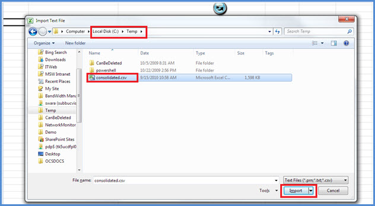
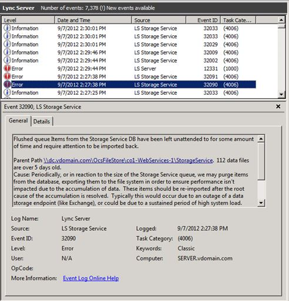
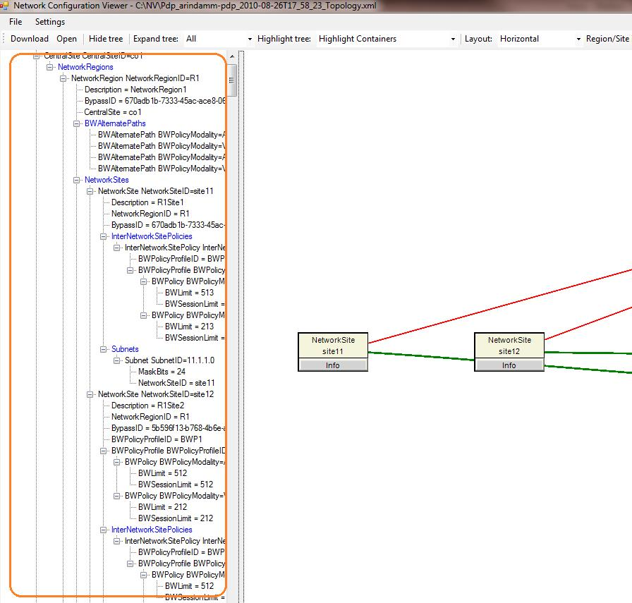
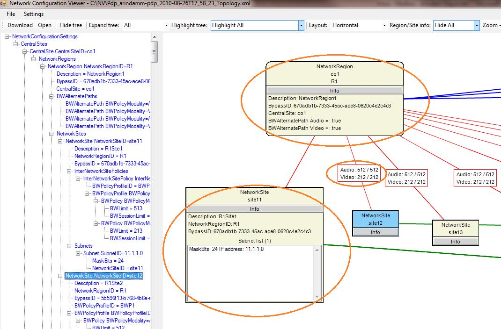

# <a name="skype-for-business-server-2015-resource-kit-tools-documentation"></a><span data-ttu-id="efa4c-107">Skype for Business Server 2015 资源管理包工具文档</span><span class="sxs-lookup"><span data-stu-id="efa4c-107">Skype for Business Server 2015 Resource Kit Tools Documentation</span></span>
 
<span data-ttu-id="efa4c-108">本主题介绍的业务服务器 2015年资源工具包，包括每个工具和其用法的示例的目的在 Skype 的工具。</span><span class="sxs-lookup"><span data-stu-id="efa4c-108">This topic describes the tools in the Skype for Business Server 2015 Resource Kit, including the purpose of each tool, and examples of its use.</span></span> <span data-ttu-id="efa4c-109">Skype 业务服务器 2015年资源工具包可帮助使日常任务更便于部署和管理业务服务器 2015 Skype 的 IT 管理员。</span><span class="sxs-lookup"><span data-stu-id="efa4c-109">The Skype for Business Server 2015 Resource Kit helps to make routine tasks easier for IT administrators who deploy and manage Skype for Business Server 2015.</span></span> <span data-ttu-id="efa4c-110">例如，**Web Conf Data** 工具可用于轻松控制召开联机会议期间用户上载的数据。</span><span class="sxs-lookup"><span data-stu-id="efa4c-110">For example, the **Web Conf Data** tool can be used to easily control data that is uploaded by users during an online meeting.</span></span> <span data-ttu-id="efa4c-111">**SEFAUtil** 工具可用于为用户设置代理人呼叫转接和应答。</span><span class="sxs-lookup"><span data-stu-id="efa4c-111">The **SEFAUtil** tool can be used to set up delegate call forwarding and answering for users.</span></span> <span data-ttu-id="efa4c-112">我们鼓励 IT 管理员可以使用这些工具来更有效地管理业务服务器 2015 Skype。</span><span class="sxs-lookup"><span data-stu-id="efa4c-112">We encourage IT administrators to use these tools to more effectively manage Skype for Business Server 2015.</span></span>
  
## <a name="installation-of-the-resource-kit-tools"></a><span data-ttu-id="efa4c-113">安装资源管理包工具</span><span class="sxs-lookup"><span data-stu-id="efa4c-113">Installation of the Resource Kit Tools</span></span>

<span data-ttu-id="efa4c-114">要为业务服务器 2015年资源工具包安装 Skype，请从下载中心下载[OCSReskit.msi](https://www.microsoft.com/en-us/download/details.aspx?id=52631) 。</span><span class="sxs-lookup"><span data-stu-id="efa4c-114">To install the Skype for Business Server 2015 Resource Kit, download [OCSReskit.msi](https://www.microsoft.com/en-us/download/details.aspx?id=52631) from the Download Center.</span></span>
  
<span data-ttu-id="efa4c-p103">运行 **OCSResKit.msi** 以执行简单安装。.msi 将在以下路径中安装所有工具：**%Program Files%\Skype for Business Server 2015\ResKit**。属于自包含可执行文件的工具位于此文件夹中。还具有支持文件的工具位于其自己的子文件夹中。</span><span class="sxs-lookup"><span data-stu-id="efa4c-p103">Run **OCSResKit.msi** to do a simple installation. The .msi installs all the tools in the following path: **%Program Files%\Skype for Business Server 2015\ResKit**. Tools that are self-contained executables are in this folder. Tools that also have supporting files are in their own subfolders.</span></span>
  
## <a name="supported-environments"></a><span data-ttu-id="efa4c-119">支持的环境</span><span class="sxs-lookup"><span data-stu-id="efa4c-119">Supported Environments</span></span>

<span data-ttu-id="efa4c-120">应符合规格所需的 Skype 业务服务器 2015，通常被用于运行业务服务器 2015 Skype 为一台服务器上安装 Skype 业务服务器 2015年资源工具包。</span><span class="sxs-lookup"><span data-stu-id="efa4c-120">The Skype for Business Server 2015 Resource Kit should be installed on a server that meets the specifications required for Skype for Business Server 2015, usually one being used to run Skype for Business Server 2015.</span></span>
  
## <a name="resource-kit-tools-overview"></a><span data-ttu-id="efa4c-121">资源管理包工具概述</span><span class="sxs-lookup"><span data-stu-id="efa4c-121">Resource Kit Tools Overview</span></span>

<span data-ttu-id="efa4c-122">以下是所提供的 Skype 业务服务器 2015年资源工具包工具的列表。</span><span class="sxs-lookup"><span data-stu-id="efa4c-122">The following is a list of the tools that are provided in the Skype for Business Server 2015 Resource Kit.</span></span> <span data-ttu-id="efa4c-123">以下各节涵盖每个工具的描述（包括要求和示例用法）。</span><span class="sxs-lookup"><span data-stu-id="efa4c-123">A description of each tool, including the requirements and example usage is covered in the following sections.</span></span>
  
- [<span data-ttu-id="efa4c-124">ABSConfig</span><span class="sxs-lookup"><span data-stu-id="efa4c-124">ABSConfig</span></span>](resource-kit-tools.md#ABSConfig)
    
- [<span data-ttu-id="efa4c-125">带宽策略服务监视器</span><span class="sxs-lookup"><span data-stu-id="efa4c-125">Bandwidth Policy Service Monitor</span></span>](resource-kit-tools.md#bpsm)
    
- [<span data-ttu-id="efa4c-126">带宽用量分析器</span><span class="sxs-lookup"><span data-stu-id="efa4c-126">Bandwidth Utilization Analyzer</span></span>](resource-kit-tools.md#bua)
    
- [<span data-ttu-id="efa4c-127">呼叫寄存时间记录器</span><span class="sxs-lookup"><span data-stu-id="efa4c-127">Call Parkometer</span></span>](resource-kit-tools.md#callpark)
    
- [<span data-ttu-id="efa4c-128">DBAnalyze</span><span class="sxs-lookup"><span data-stu-id="efa4c-128">DBAnalyze</span></span>](resource-kit-tools.md#dba)
    
- [<span data-ttu-id="efa4c-129">导入存储服务数据</span><span class="sxs-lookup"><span data-stu-id="efa4c-129">Import Storage Service Data</span></span>](resource-kit-tools.md#Issd)
    
- [<span data-ttu-id="efa4c-130">LCSSync</span><span class="sxs-lookup"><span data-stu-id="efa4c-130">LCSSync</span></span>](resource-kit-tools.md#LCSSync)
    
- [<span data-ttu-id="efa4c-131">查找用户控制台</span><span class="sxs-lookup"><span data-stu-id="efa4c-131">Lookup User Console</span></span>](resource-kit-tools.md#LUC)
    
- [<span data-ttu-id="efa4c-132">MsTurnPing</span><span class="sxs-lookup"><span data-stu-id="efa4c-132">MsTurnPing</span></span>](resource-kit-tools.md#MsTurnPing)
    
- [<span data-ttu-id="efa4c-133">网络配置查看器</span><span class="sxs-lookup"><span data-stu-id="efa4c-133">Network Configuration Viewer</span></span>](resource-kit-tools.md#NCV)
    
- [<span data-ttu-id="efa4c-134">响应组代理实时</span><span class="sxs-lookup"><span data-stu-id="efa4c-134">Response Group Agent Live</span></span>](resource-kit-tools.md#RGAL)
    
- [<span data-ttu-id="efa4c-135">SEFAUtil</span><span class="sxs-lookup"><span data-stu-id="efa4c-135">SEFAUtil</span></span>](resource-kit-tools.md#SEFAUtil)
    
- [<span data-ttu-id="efa4c-136">SYSPrep.ps1</span><span class="sxs-lookup"><span data-stu-id="efa4c-136">SYSPrep.ps1</span></span>](resource-kit-tools.md#SYSPrep)
    
- [<span data-ttu-id="efa4c-137">未分配号码通知迁移</span><span class="sxs-lookup"><span data-stu-id="efa4c-137">Unassigned Number Announcements Migration</span></span>](resource-kit-tools.md#UNAM)
    
- [<span data-ttu-id="efa4c-138">Web Conf Data</span><span class="sxs-lookup"><span data-stu-id="efa4c-138">Web Conf Data</span></span>](resource-kit-tools.md#WebConfData)
    
## <a name="absconfig"></a><span data-ttu-id="efa4c-139">ABSConfig</span><span class="sxs-lookup"><span data-stu-id="efa4c-139">ABSConfig</span></span>
<span data-ttu-id="efa4c-140"><a name="ABSConfig"> </a></span><span class="sxs-lookup"><span data-stu-id="efa4c-140"></span></span>

<span data-ttu-id="efa4c-141">通讯簿服务配置工具 (ABSConfig) 是一种管理工具，可帮助管理员自定义通讯簿服务配置在 Skype 业务服务器 2015年。</span><span class="sxs-lookup"><span data-stu-id="efa4c-141">The Address Book Service Configuration tool (ABSConfig) is an administrative tool that helps administrators customize Address Book Service configuration in Skype for Business Server 2015.</span></span> <span data-ttu-id="efa4c-142">此工具还允许 Skype 业务服务器 2015年管理员恢复默认通讯簿服务设置。</span><span class="sxs-lookup"><span data-stu-id="efa4c-142">This tool also enables Skype for Business Server 2015 administrators to restore the default Address Book Service settings.</span></span>
  
### <a name="description"></a><span data-ttu-id="efa4c-143">说明</span><span class="sxs-lookup"><span data-stu-id="efa4c-143">Description</span></span>

<span data-ttu-id="efa4c-144">ABSConfig 是一个图形用户界面应用程序，使管理员能够配置通讯簿服务相关的 Active Directory 域服务属性。</span><span class="sxs-lookup"><span data-stu-id="efa4c-144">ABSConfig is a graphical user interface application that enables administrators to configure Active Directory Domain Services attributes that are related to Address Book Service.</span></span>
  
<span data-ttu-id="efa4c-145">该工具的主要方案如下所示：</span><span class="sxs-lookup"><span data-stu-id="efa4c-145">The primary scenarios for the tool are the following:</span></span>
  
- <span data-ttu-id="efa4c-146">使管理员能够映射中的属性 Active Directory 域服务到的属性为 Skype 业务服务器 2015年个。</span><span class="sxs-lookup"><span data-stu-id="efa4c-146">To enable administrators to map attributes in Active Directory Domain Services to the attributes for Skype for Business Server 2015.</span></span>
    
- <span data-ttu-id="efa4c-147">使管理员能够指定要在通讯簿服务文件中包括或排除的 Active Directory 域服务属性。</span><span class="sxs-lookup"><span data-stu-id="efa4c-147">To enable administrators to specify the Active Directory Domain Services attribute to be included or excluded in the Address Book Service files.</span></span>
    
- <span data-ttu-id="efa4c-148">使管理员能够还原默认通讯簿服务设置。</span><span class="sxs-lookup"><span data-stu-id="efa4c-148">To enable administrators to restore default Address Book Service settings.</span></span>
    
<span data-ttu-id="efa4c-149">可以使用 ABSConfig.exe 文件启动 ABSConfig 工具。</span><span class="sxs-lookup"><span data-stu-id="efa4c-149">The ABSConfig tool can be started by using the ABSConfig.exe file.</span></span> <span data-ttu-id="efa4c-150">该工具将打开**配置属性**选项卡。此表有 Active Directory 域服务属性映射到的属性字段为 Skype 的业务服务器 2015年以及指定要包含或排除在基于特定属性筛选器的通讯簿服务文件的用户的选项。</span><span class="sxs-lookup"><span data-stu-id="efa4c-150">The tool opens to the **Configure Attributes** tab. This table has options to map Active Directory Domain Services attributes to the attribute fields for Skype for Business Server 2015 and to specify which users to include or exclude in Address Book Service files based on specific attribute filters.</span></span> <span data-ttu-id="efa4c-151">它还具有用于自定义在通讯簿文件中包括电话号码的哪个值的选项。</span><span class="sxs-lookup"><span data-stu-id="efa4c-151">It also has options to customize which value of the phone number to be included in the Address Book file.</span></span> <span data-ttu-id="efa4c-152">“**还原默认值**”选项使管理员能够将通讯簿服务设置还原为默认值。</span><span class="sxs-lookup"><span data-stu-id="efa4c-152">The **Restore Defaults** option enables administrators to restore Address Book Service settings to default values.</span></span>
  
### <a name="output"></a><span data-ttu-id="efa4c-153">输出</span><span class="sxs-lookup"><span data-stu-id="efa4c-153">Output</span></span>

<span data-ttu-id="efa4c-154">ABSConfig 将通讯簿服务配置存储在数据库中。</span><span class="sxs-lookup"><span data-stu-id="efa4c-154">ABSConfig stores the Address Book Service configuration in the database.</span></span>
  
```
Path: %ProgramFiles%\Skype for Business Server 2015\Reskit
```

### <a name="purpose"></a><span data-ttu-id="efa4c-155">用途</span><span class="sxs-lookup"><span data-stu-id="efa4c-155">Purpose</span></span>

<span data-ttu-id="efa4c-156">ABSConfig 提供了快速简便的方法以进行自定义的业务服务器 2015年通迅簿服务 Skype。</span><span class="sxs-lookup"><span data-stu-id="efa4c-156">ABSConfig provides a quick and easy way to customize Skype for Business Server 2015 Address Book Service.</span></span>
  
### <a name="requirements"></a><span data-ttu-id="efa4c-157">要求</span><span class="sxs-lookup"><span data-stu-id="efa4c-157">Requirements</span></span>

#### <a name="computer"></a><span data-ttu-id="efa4c-158">计算机</span><span class="sxs-lookup"><span data-stu-id="efa4c-158">Computer</span></span>

<span data-ttu-id="efa4c-159">只能从具有的业务服务器 2015 安装 Skype 的加入域的计算机可以运行 ABSConfig。</span><span class="sxs-lookup"><span data-stu-id="efa4c-159">ABSConfig can be run only from a domain-joined computer that has Skype for Business Server 2015 installed.</span></span> <span data-ttu-id="efa4c-160">在业务服务器 2015，企业版的 Skype 的情况下可以有通讯簿服务安装过程中启用所有前端服务器上运行此工具。</span><span class="sxs-lookup"><span data-stu-id="efa4c-160">In the case of Skype for Business Server 2015, Enterprise Edition, this tool can be run on any Front End servers that have the Address Book Service enabled during setup.</span></span>
  
#### <a name="network"></a><span data-ttu-id="efa4c-161">网络</span><span class="sxs-lookup"><span data-stu-id="efa4c-161">Network</span></span>

<span data-ttu-id="efa4c-162">计算机应能够连接到前端池和后端数据库。</span><span class="sxs-lookup"><span data-stu-id="efa4c-162">The computer should be able to connect to the Front End pool and back-end database.</span></span>
  
#### <a name="software"></a><span data-ttu-id="efa4c-163">软件</span><span class="sxs-lookup"><span data-stu-id="efa4c-163">Software</span></span>

<span data-ttu-id="efa4c-164">在运行 ABSConfig 工具之前，必须安装以下软件组件：</span><span class="sxs-lookup"><span data-stu-id="efa4c-164">The following software components must be installed before running the ABSConfig tool:</span></span>
  
- <span data-ttu-id="efa4c-165">Skype for Business Server 2015</span><span class="sxs-lookup"><span data-stu-id="efa4c-165">Skype for Business Server 2015</span></span>
    
#### <a name="users"></a><span data-ttu-id="efa4c-166">用户</span><span class="sxs-lookup"><span data-stu-id="efa4c-166">Users</span></span>

<span data-ttu-id="efa4c-167">管理员必须更新业务服务器 2015年部署 Skype 所需的权限。</span><span class="sxs-lookup"><span data-stu-id="efa4c-167">Administrators who have the permissions required to update the Skype for Business Server 2015 deployment.</span></span>
  
### <a name="examples"></a><span data-ttu-id="efa4c-168">示例</span><span class="sxs-lookup"><span data-stu-id="efa4c-168">Examples</span></span>

<span data-ttu-id="efa4c-p108">可以通过在命令提示符中键入 **ABSConfig.exe** 来启动 ABSConfig。ABSConfig 工具用户界面如下所示。</span><span class="sxs-lookup"><span data-stu-id="efa4c-p108">ABSConfig can be started by typing **ABSConfig.exe** at a command prompt. Shown below is the ABSConfig tool user interface.</span></span>
  

  
### <a name="summary"></a><span data-ttu-id="efa4c-172">摘要</span><span class="sxs-lookup"><span data-stu-id="efa4c-172">Summary</span></span>

<span data-ttu-id="efa4c-173">ABSConfig 工具为管理员提供了一种快速且易于使用的工具，以进行自定义的业务服务器 2015年通迅簿服务 Skype。</span><span class="sxs-lookup"><span data-stu-id="efa4c-173">The ABSConfig tool provides administrators a quick and easy to use tool to customize Skype for Business Server 2015 Address Book Service.</span></span>
  
## <a name="bandwidth-policy-service-monitor"></a><span data-ttu-id="efa4c-174">带宽策略服务监视器</span><span class="sxs-lookup"><span data-stu-id="efa4c-174">Bandwidth Policy Service Monitor</span></span>
<span data-ttu-id="efa4c-175"><a name="bpsm"> </a></span><span class="sxs-lookup"><span data-stu-id="efa4c-175"></span></span>

<span data-ttu-id="efa4c-176">带宽策略服务监视器工具旨在使管理员能够查看以下内容的列表：</span><span class="sxs-lookup"><span data-stu-id="efa4c-176">The Bandwidth Policy Service Monitor tool is intended to allow administrators to view a list of the following:</span></span>
  
1. <span data-ttu-id="efa4c-177">拓扑结构中的业务服务器 2015年带宽策略服务 （身份验证和核心） 为所有已配置的 Skype</span><span class="sxs-lookup"><span data-stu-id="efa4c-177">All the configured Skype for Business Server 2015 Bandwidth Policy services (Authentication and Core) in the topology</span></span>
    
2. <span data-ttu-id="efa4c-178">每个服务与其他带宽策略服务和边缘服务器的连接</span><span class="sxs-lookup"><span data-stu-id="efa4c-178">The connections that each service makes to other Bandwidth Policy services and to the Edge servers</span></span>
    
3. <span data-ttu-id="efa4c-179">网络配置文档中配置的所有链路以及每个带宽策略服务报告的实时带宽使用量</span><span class="sxs-lookup"><span data-stu-id="efa4c-179">All the links that are configured in the Network configuration document and real-time bandwidth usage as reported by each of the Bandwidth Policy services</span></span>
    
### <a name="description"></a><span data-ttu-id="efa4c-180">说明</span><span class="sxs-lookup"><span data-stu-id="efa4c-180">Description</span></span>

<span data-ttu-id="efa4c-p109">带宽策略服务监视器工具作为基于 GUI 的应用程序进行实施。管理员可通过运行 PDPMonUI.exe 启动该工具。</span><span class="sxs-lookup"><span data-stu-id="efa4c-p109">The Bandwidth Policy Service Monitor tool is implemented as a GUI-based application. Administrators start the tool by running PDPMonUI.exe.</span></span>
  
<span data-ttu-id="efa4c-p110">当该工具启动时，它将尝试发现拓扑中的带宽策略服务列表。完成初始更新之后，窗口左侧的窗格将填充服务列表，其中的服务按其所属的群集进行分组。</span><span class="sxs-lookup"><span data-stu-id="efa4c-p110">When the tool starts, it attempts to discover the list of Bandwidth Policy services in the topology. After the initial update is done, the pane to the left of the window is populated with a list of services that are grouped by the clusters that they belong to.</span></span>
  
<span data-ttu-id="efa4c-p111">当管理员选择特定带宽策略服务时，右侧的窗格将显示有关该特定服务的信息。该窗格还包含两个可显示信息的主选项卡。</span><span class="sxs-lookup"><span data-stu-id="efa4c-p111">When administrators select a particular Bandwidth Policy Service, the pane on the right displays the information about that particular service. That pane also has two main tabs that display information.</span></span>
  
#### <a name="machine-info-tab"></a><span data-ttu-id="efa4c-187">“计算机信息”选项卡</span><span class="sxs-lookup"><span data-stu-id="efa4c-187">Machine Info Tab</span></span>

<span data-ttu-id="efa4c-188">“**计算机信息**”选项卡显示所选带宽策略服务的详细信息以及所选带宽策略服务与其他服务建立的连接的列表和状态。</span><span class="sxs-lookup"><span data-stu-id="efa4c-188">The **Machine Info** tab shows the details of the Bandwidth Policy Service that is selected and the list and state of all the connections that are made by the selected Bandwidth Policy Service to other services.</span></span>
  
#### <a name="topology-info-tab"></a><span data-ttu-id="efa4c-189">“拓扑信息”选项卡</span><span class="sxs-lookup"><span data-stu-id="efa4c-189">Topology Info Tab</span></span>

<span data-ttu-id="efa4c-p112">“**拓扑信息**”选项卡显示在网络配置设置中配置的所有链路的列表。对于每个链路，显示音频和视频带宽容量。此外，以 Kbps 和容量百分比形式显示当前利用的带宽。该工具使用颜色编码突出显示利用率接近容量的链路，这使得管理员可快速隔离此类链路。</span><span class="sxs-lookup"><span data-stu-id="efa4c-p112">The **Topology Info** tab shows a list of all the links that are configured in the Network configuration settings. For each link, the audio and video bandwidth capacity is displayed. Additionally, the currently utilized bandwidth is displayed, both in Kbps and as a percentage of the capacity. The tool uses color-coding to highlight links that have utilization that is close to the capacity—this allows administrators to quickly isolate such links.</span></span>
  
> [!NOTE]
>  <span data-ttu-id="efa4c-194">如果带宽策略服务监视器工具出现故障，连接至任何已配置的带宽策略服务时，将不会填充**计算机信息**和**拓扑信息**选项卡中的信息。</span><span class="sxs-lookup"><span data-stu-id="efa4c-194">If the Bandwidth Policy Service Monitor tool experiences failure when it connects to any of the configured Bandwidth Policy services, the information in the **Machine Info** and the **Topology Info** tabs won't be populated.</span></span> <span data-ttu-id="efa4c-195">但是，该工具可能最初连接成功，后来却断开与服务的连接。</span><span class="sxs-lookup"><span data-stu-id="efa4c-195">However, it is possible that the tool might connect initially but subsequently lose its connection to the service.</span></span> <span data-ttu-id="efa4c-196">在这种情况下，管理员可能会看到过时的信息。</span><span class="sxs-lookup"><span data-stu-id="efa4c-196">In such cases, administrators might see outdated information.</span></span> <span data-ttu-id="efa4c-197">每个选项卡上会显示“**上次更新时间**”时间戳，管理员可以通过该时间戳查看特定带宽策略服务的数据的上次更新时间。</span><span class="sxs-lookup"><span data-stu-id="efa4c-197">There is a **Last Updated** time stamp on each of the tabs that can allow administrators to see when the data was last updated for a particular Bandwidth Policy Service.</span></span>
  
### <a name="output"></a><span data-ttu-id="efa4c-198">输出</span><span class="sxs-lookup"><span data-stu-id="efa4c-198">Output</span></span>

<span data-ttu-id="efa4c-199">没有命令行输出；程序输出包含在主图形用户界面 (GUI) 中。</span><span class="sxs-lookup"><span data-stu-id="efa4c-199">There is no command-line output; the program output is contained within the main graphical user interface (GUI).</span></span>
  
### <a name="purpose"></a><span data-ttu-id="efa4c-200">用途</span><span class="sxs-lookup"><span data-stu-id="efa4c-200">Purpose</span></span>

<span data-ttu-id="efa4c-p114">带宽策略服务监视器工具旨在使管理员能够查看拓扑中定义的每个带宽策略服务的状态。此外，管理员可以查看网络配置文档中定义的所有链路的实时带宽用量。</span><span class="sxs-lookup"><span data-stu-id="efa4c-p114">The purpose of the Bandwidth Policy Service Monitor tool is to allow administrators visibility into the state of each of the Bandwidth Policy services that are defined in the topology. In addition, administrators can see real-time bandwidth usage for all the links that are defined in the Network configuration document.</span></span>
  
### <a name="requirements"></a><span data-ttu-id="efa4c-203">要求</span><span class="sxs-lookup"><span data-stu-id="efa4c-203">Requirements</span></span>

<span data-ttu-id="efa4c-204">带宽策略服务监视器工具需要是 Skype 的业务服务器拓扑结构的一部分的计算机上运行。</span><span class="sxs-lookup"><span data-stu-id="efa4c-204">The Bandwidth Policy Service Monitor tool needs to be run on a computer that is part of the Skype for Business Server topology.</span></span>
  
### <a name="summary"></a><span data-ttu-id="efa4c-205">摘要</span><span class="sxs-lookup"><span data-stu-id="efa4c-205">Summary</span></span>

<span data-ttu-id="efa4c-206">带宽策略服务监视器工具对于管理员而言是一项宝贵资源，通过该工具，管理员可以检查拓扑中所有带宽策略服务的状态，更重要的是，他们可以获取网络配置设置中定义的链路的实时带宽用量。</span><span class="sxs-lookup"><span data-stu-id="efa4c-206">The Bandwidth Policy Service Monitor tool can be a valuable resource to administrators so they can inspect the state of all the Bandwidth Policy services in the topology—and more importantly—they can obtain real-time bandwidth utilization for the links that are defined in the Network configuration settings.</span></span>
  
## <a name="bandwidth-utilization-analyzer"></a><span data-ttu-id="efa4c-207">带宽用量分析器</span><span class="sxs-lookup"><span data-stu-id="efa4c-207">Bandwidth Utilization Analyzer</span></span>
<span data-ttu-id="efa4c-208"><a name="bua"> </a></span><span class="sxs-lookup"><span data-stu-id="efa4c-208"></span></span>

<span data-ttu-id="efa4c-p115">带宽用量分析器工具可创建有关企业网络中各个 WAN 链路上 UC 端点的带宽消耗的各种视图的报告。这些报告有助于了解当前带宽消耗模式以及进行带宽容量规划。</span><span class="sxs-lookup"><span data-stu-id="efa4c-p115">Bandwidth Utilization Analyzer is a tool that creates reports about various views of bandwidth consumption by the UC endpoints across WAN links in the enterprise network. These reports can be used to understand the current bandwidth consumption pattern and to aid in bandwidth capacity planning.</span></span>
  
### <a name="description"></a><span data-ttu-id="efa4c-211">说明</span><span class="sxs-lookup"><span data-stu-id="efa4c-211">Description</span></span>

<span data-ttu-id="efa4c-p116">带宽用量分析器作为基于 GUI 的应用程序进行实施。此工具可针对网络中的音频利用率生成特定报告，从而帮助进行容量规划。它还会循环访问分配给各个链路的带宽容量。</span><span class="sxs-lookup"><span data-stu-id="efa4c-p116">Bandwidth Utilization Analyzer is implemented as a GUI-based application. This tool generates reports specifically for audio utilization across the network and helps with capacity planning. It also iterates on the bandwidth capacity that is assigned to various links.</span></span>
  
### <a name="output"></a><span data-ttu-id="efa4c-215">输出</span><span class="sxs-lookup"><span data-stu-id="efa4c-215">Output</span></span>

<span data-ttu-id="efa4c-216">带宽用量分析器可将系统中配置的所有 WAN 链路的带宽容量和音频利用率绘制成图形。</span><span class="sxs-lookup"><span data-stu-id="efa4c-216">Bandwidth Utilization Analyzer provides graphic al plots of bandwidth capacity and utilization for audio for all the WAN links that are configured in the system.</span></span>
  
### <a name="purpose"></a><span data-ttu-id="efa4c-217">用途</span><span class="sxs-lookup"><span data-stu-id="efa4c-217">Purpose</span></span>

<span data-ttu-id="efa4c-218">在任何语音和视频的部署，很关键，监视并了解整个企业网络媒体通信的带宽利用率的变化趋势。</span><span class="sxs-lookup"><span data-stu-id="efa4c-218">In any voice and video deployment, it's critical to monitor and understand the trend of bandwidth utilization of media traffic across the enterprise network.</span></span> <span data-ttu-id="efa4c-219">带宽用量分析器工具可让管理员达成该目标。</span><span class="sxs-lookup"><span data-stu-id="efa4c-219">The Bandwidth Utilization Analyzer tool allows an administrator to achieve just that.</span></span> <span data-ttu-id="efa4c-220">此工具可执行以下操作：</span><span class="sxs-lookup"><span data-stu-id="efa4c-220">This tool does the following:</span></span>
  
- <span data-ttu-id="efa4c-221">针对网络中的音频利用率生成特定报告</span><span class="sxs-lookup"><span data-stu-id="efa4c-221">Generates specific reports for audio utilization across the network</span></span>
    
- <span data-ttu-id="efa4c-222">帮助更高效地进行容量规划并循环访问分配给各个链路的带宽容量</span><span class="sxs-lookup"><span data-stu-id="efa4c-222">Helps with more effective capacity planning and iteration on the bandwidth capacity that is assigned to various links</span></span>
    
<span data-ttu-id="efa4c-223">带宽用量分析器可将带宽容量和用量报告绘制成图形；如下所示：</span><span class="sxs-lookup"><span data-stu-id="efa4c-223">Bandwidth Utilization Analyzer can generate graphical plots of bandwidth capacity and utilization reports; they are as follows:</span></span>
  
- <span data-ttu-id="efa4c-224">企业网络中的所有 WAN 链路</span><span class="sxs-lookup"><span data-stu-id="efa4c-224">All the WAN links in the enterprise network</span></span>
    
- <span data-ttu-id="efa4c-225">按所选 WAN 链路进行筛选</span><span class="sxs-lookup"><span data-stu-id="efa4c-225">Filtered by selected WAN links that have been chosen</span></span>
    
- <span data-ttu-id="efa4c-226">按已超过链路容量的 WAN 链路进行筛选</span><span class="sxs-lookup"><span data-stu-id="efa4c-226">Filtered by WAN links that have exceeded link capacity</span></span>
    
- <span data-ttu-id="efa4c-227">按用量低于设置的带宽的 WAN 链路进行筛选</span><span class="sxs-lookup"><span data-stu-id="efa4c-227">Filtered by WAN links that have been under-utilizing the provisioned bandwidth</span></span>
    
- <span data-ttu-id="efa4c-228">按已达到严重级别（带宽用量大于 WAN 链路带宽容量的 90%）的 WAN 链路进行筛选</span><span class="sxs-lookup"><span data-stu-id="efa4c-228">Filter by WAN links that have been reaching critical levels (a bandwidth utilization that is greater than 90% of bandwidth capacity of the WAN link)</span></span>
    
- <span data-ttu-id="efa4c-229">按 WAN 链路类型（网络站点链路、区域间链路以及站点内链路）进行筛选</span><span class="sxs-lookup"><span data-stu-id="efa4c-229">Filtered by WAN link type—network-site links, interregional links, and links within a site</span></span>
    
- <span data-ttu-id="efa4c-230">按网络区域进行筛选</span><span class="sxs-lookup"><span data-stu-id="efa4c-230">Filtered by network region</span></span>
    
#### <a name="applications"></a><span data-ttu-id="efa4c-231">应用程序</span><span class="sxs-lookup"><span data-stu-id="efa4c-231">Applications</span></span>

<span data-ttu-id="efa4c-232">带宽用量分析器具有以下两个应用程序（工具）：</span><span class="sxs-lookup"><span data-stu-id="efa4c-232">Bandwidth Utilization Analyzer has the following two applications (tools):</span></span>
  
- <span data-ttu-id="efa4c-233">**WanLinkLogCollector.exe**该工具使其用户输入所需的信息。</span><span class="sxs-lookup"><span data-stu-id="efa4c-233">**WanLinkLogCollector.exe** This tool enables its user to input the required information.</span></span>
    
- <span data-ttu-id="efa4c-234">**BandwidthUtilizationAnalyzer.xlsm** WanLinkLogCollector.exe 自动启动 Microsoft Excel 电子表格软件报告。</span><span class="sxs-lookup"><span data-stu-id="efa4c-234">**BandwidthUtilizationAnalyzer.xlsm** A Microsoft Excel spreadsheet software report is automatically launched by WanLinkLogCollector.exe.</span></span> <span data-ttu-id="efa4c-235">此应用程序允许用户对报表应用筛选器，如本文后面所示。</span><span class="sxs-lookup"><span data-stu-id="efa4c-235">This application allows the user to apply filters to the report as shown later in this article.</span></span>
    
#### <a name="phases-of-using-bandwidth-utilization-analyzer"></a><span data-ttu-id="efa4c-236">使用带宽用量分析器的各个阶段</span><span class="sxs-lookup"><span data-stu-id="efa4c-236">Phases of Using Bandwidth Utilization Analyzer</span></span>

<span data-ttu-id="efa4c-237">使用带宽用量分析器时有两个阶段：</span><span class="sxs-lookup"><span data-stu-id="efa4c-237">There are two phases when using Bandwidth Utilization Analyzer:</span></span>
  
- <span data-ttu-id="efa4c-238">收集日志，使用 WanLinkLogCollector.exe 执行</span><span class="sxs-lookup"><span data-stu-id="efa4c-238">Collect logs, which is performed by using WanLinkLogCollector.exe</span></span>
    
- <span data-ttu-id="efa4c-239">自定义报告，使用 BandwidthUtilizationAnalyzer.xlsm 执行</span><span class="sxs-lookup"><span data-stu-id="efa4c-239">Customize reports, which is performed by using BandwidthUtilizationAnalyzer.xlsm</span></span>
    
> [!IMPORTANT]
> <span data-ttu-id="efa4c-240">强烈建议最终用户不要手动启动 BandwidthUtilizationAnalyzer.xlsm。</span><span class="sxs-lookup"><span data-stu-id="efa4c-240">We strongly recommend that BandwidthUtilizationAnalyzer.xlsm not be manually launched by end users.</span></span> 
  
#### <a name="starting-bandwidth-utilization-analyzer"></a><span data-ttu-id="efa4c-241">启动带宽用量分析器</span><span class="sxs-lookup"><span data-stu-id="efa4c-241">Starting Bandwidth Utilization Analyzer</span></span>

<span data-ttu-id="efa4c-242">在命令提示符中或使用 Windows 资源管理器启动 WanLinkLogCollector.exe。</span><span class="sxs-lookup"><span data-stu-id="efa4c-242">Start WanLinkLogCollector.exe at the command prompt or by using Windows Explorer.</span></span>
  
 <span data-ttu-id="efa4c-243">**使用 WanLinkLogCollector.exe**</span><span class="sxs-lookup"><span data-stu-id="efa4c-243">**Using WanLinkLogCollector.exe**</span></span>
  
<span data-ttu-id="efa4c-244">使用 WanLinkLogCollector.exe 有三个步骤：</span><span class="sxs-lookup"><span data-stu-id="efa4c-244">There are three steps to using WanLinkLogCollector.exe:</span></span>
  
1. <span data-ttu-id="efa4c-245">**日志时间线**提供报表的生成所需要的时间线</span><span class="sxs-lookup"><span data-stu-id="efa4c-245">**Log the timeline** Provide the timeline that the report needs to be generated for</span></span>
    
2. <span data-ttu-id="efa4c-246">**指定的文件目录**提供文件位置信息</span><span class="sxs-lookup"><span data-stu-id="efa4c-246">**Specify the file directories** Provide file location information</span></span>
    
3. <span data-ttu-id="efa4c-247">**收集日志并启动报表查看器**执行命令以生成报告</span><span class="sxs-lookup"><span data-stu-id="efa4c-247">**Collect the logs and launch the report viewer** Execute the command to generate the report</span></span>
    
#### <a name="step-1---log-the-timeline"></a><span data-ttu-id="efa4c-248">步骤 1 - 记录日程表</span><span class="sxs-lookup"><span data-stu-id="efa4c-248">Step 1 - Log the timeline</span></span>

<span data-ttu-id="efa4c-249">通过记录日程表，工具用户可以指定下图所示的信息。</span><span class="sxs-lookup"><span data-stu-id="efa4c-249">Logging the timeline allows the tool user to specify the following as shown in the figure below.</span></span> 
  
1. <span data-ttu-id="efa4c-250">**开始日期**这是报告旨在为; 生成时间线的开始日期例如，2010 年 8 月 1 日。</span><span class="sxs-lookup"><span data-stu-id="efa4c-250">**Start date** This is the start date of the timeline that the report is to be generated for; for example, August 1, 2010.</span></span>
    
2. <span data-ttu-id="efa4c-251">**结束日期**这是时间轴; 生成的报表的结束日期例如，2010 年 9 月 30 日。</span><span class="sxs-lookup"><span data-stu-id="efa4c-251">**End date** This is the end date of the timeline that the report is to be generated for; for example, September 30, 2010.</span></span>
    
     
  
#### <a name="step-2---specify-the-file-directories"></a><span data-ttu-id="efa4c-253">步骤 2 - 指定文件目录</span><span class="sxs-lookup"><span data-stu-id="efa4c-253">Step 2 - Specify the file directories</span></span>

<span data-ttu-id="efa4c-254">用户可指定如下所示的文件目录。</span><span class="sxs-lookup"><span data-stu-id="efa4c-254">The following file directories can be specified by the user as shown.</span></span>
  
- <span data-ttu-id="efa4c-255">**服务器日志文件位置**存储带宽策略服务器日志文件夹位置。</span><span class="sxs-lookup"><span data-stu-id="efa4c-255">**Server log files location** The folder location where Bandwidth policy server logs are stored.</span></span> <span data-ttu-id="efa4c-256">这是通常在\<文件服务器\>\\< 选择的 FE\>\AppServerFiles\PDP。</span><span class="sxs-lookup"><span data-stu-id="efa4c-256">This is typically in \<fileserver\>\\<choice of FE\>\AppServerFiles\PDP.</span></span>
    
- <span data-ttu-id="efa4c-257">**临时文件存储位置**正在生成报告时存储中间文件的临时文件位置。</span><span class="sxs-lookup"><span data-stu-id="efa4c-257">**Temporary file storage location** The temporary file location where intermediate files are stored while the report is being generated.</span></span>
    

  
> [!NOTE]
> <span data-ttu-id="efa4c-259">确保向工具用户提供对服务器日志和临时文件存储文件夹足够的文件访问权限。</span><span class="sxs-lookup"><span data-stu-id="efa4c-259">Ensure that sufficient file access to the server logs and the temporary file store folder is provided to the tool user.</span></span> 
  
#### <a name="step-3---collect-the-logs-and-start-the-report-viewer"></a><span data-ttu-id="efa4c-260">步骤 3 - 收集日志并启动报告查看器</span><span class="sxs-lookup"><span data-stu-id="efa4c-260">Step 3 - Collect the logs and start the report viewer</span></span>

<span data-ttu-id="efa4c-p120">要收集日志并启动报告查看器，请单击如下所示的“**执行**”。此步骤收集所需的数据。</span><span class="sxs-lookup"><span data-stu-id="efa4c-p120">To collect the logs and start the report viewer, click **Execute** as shown below. This step collects the required data.</span></span>
  

  
<span data-ttu-id="efa4c-264">当输入验证成功时，将显示下面所示的消息。</span><span class="sxs-lookup"><span data-stu-id="efa4c-264">When the input validation is successful, the message shown below is displayed.</span></span>
  

  
<span data-ttu-id="efa4c-p121">单击“**确定**”。BandwidthUtilizationAnalyzer.xlsm 会自动启动。按照消息框中的说明进行操作。有关详细信息，请参阅下一节中的“**使用 BandwidthUtilizationAnalyzer.xlsm**”。</span><span class="sxs-lookup"><span data-stu-id="efa4c-p121">Click **OK**. BandwidthUtilizationAnalyzer.xlsm is automatically started. Follow the instructions in the message box. For details, see **Using BandwidthUtilizationAnalyzer.xlsm** in the next section.</span></span>
  
#### 

### <a name="using-bandwidthutilizationanalyzerxlsm"></a><span data-ttu-id="efa4c-270">使用 BandwidthUtilizationAnalyzer.xlsm</span><span class="sxs-lookup"><span data-stu-id="efa4c-270">Using BandwidthUtilizationAnalyzer.xlsm</span></span>

1. <span data-ttu-id="efa4c-271">当 BandwidthUtilizationAnalyzer.xlsm 自动启动时，单击如下所示的“**刷新**”。</span><span class="sxs-lookup"><span data-stu-id="efa4c-271">When BandwidthUtilizationAnalyzer.xlsm is automatically started, click **Refresh** as shown below.</span></span>
    
     
  
2. <span data-ttu-id="efa4c-p122">打开文件夹时，请从如下所示的消息框中指定的位置中选择 consolidated.csv。它也将位置显示为 **C:\Temp**。</span><span class="sxs-lookup"><span data-stu-id="efa4c-p122">When a file folder is opened, select consolidated.csv from the location that is specified in the message box as shown below. It also shows the location as **C:\Temp**.</span></span>
    
     
  
3. <span data-ttu-id="efa4c-276">单击“**导入**”。</span><span class="sxs-lookup"><span data-stu-id="efa4c-276">Click **Import**.</span></span>
    
4. <span data-ttu-id="efa4c-p123">将自动生成绘图。当在后台工作的指针消失时，它便可用。</span><span class="sxs-lookup"><span data-stu-id="efa4c-p123">The graphical plot is automatically generated. It is available when the working-in-the-background pointer disappears.</span></span>
    
     
  
#### <a name="applying-filters-to-the-report-view"></a><span data-ttu-id="efa4c-280">对报告视图应用筛选器</span><span class="sxs-lookup"><span data-stu-id="efa4c-280">Applying Filters to the Report View</span></span>

<span data-ttu-id="efa4c-281">下面介绍了可对如下所示的报告视图应用的筛选器：</span><span class="sxs-lookup"><span data-stu-id="efa4c-281">The filters that can be applied to the report view as shown below are described as follows:</span></span>
  

  
1. <span data-ttu-id="efa4c-283">**名称** - 按 WAN 链路进行筛选（筛选器位于图形右侧）。前缀表示以下链路类型，请查看垂直（蓝色）框：</span><span class="sxs-lookup"><span data-stu-id="efa4c-283">**Name** Filter by WAN links (the filter is on the right side of the graph).The prefix denotes the following link types; see the vertical (blue) box:</span></span>
    
  - <span data-ttu-id="efa4c-284">**S Site** - 从网络站点到网络区域的 WAN 链路</span><span class="sxs-lookup"><span data-stu-id="efa4c-284">**S Site** The WAN link from a network site to a network region</span></span>
    
  - <span data-ttu-id="efa4c-285">**IS Inter-Site** - 两个网络站点之间的 WAN 链路</span><span class="sxs-lookup"><span data-stu-id="efa4c-285">**IS Inter-Site** The WAN link between two network sites</span></span>
    
  - <span data-ttu-id="efa4c-286">**R Inter-Region** - 两个网络区域之间的 WAN 链路</span><span class="sxs-lookup"><span data-stu-id="efa4c-286">**R Inter-Region** The WAN link between two network region</span></span>
    
2. <span data-ttu-id="efa4c-287">**超出限制** - 按带宽用量超过带宽容量的 WAN 链路进行筛选</span><span class="sxs-lookup"><span data-stu-id="efa4c-287">**Exceeded limit** Filter by WAN links whose bandwidth utilization is more than the bandwidth capacity</span></span>
    
3. <span data-ttu-id="efa4c-288">**严重级别** - 按带宽用量已达到 90% 或超过带宽容量的 WAN 链路进行筛选</span><span class="sxs-lookup"><span data-stu-id="efa4c-288">**Critical levels** Filter by WAN links whose bandwidth utilization has reached 90% or more than the bandwidth capacity</span></span>
    
4. <span data-ttu-id="efa4c-289">**利用不足** - 按带宽用量少于带宽容量的 25% 的 WAN 链路进行筛选</span><span class="sxs-lookup"><span data-stu-id="efa4c-289">**Under-utilized** Filter by WAN links whose bandwidth utilization has been less than 25% of the bandwidth capacity</span></span>
    
5. <span data-ttu-id="efa4c-290">**链路类型** - 按以下 WAN 链路类型进行筛选：</span><span class="sxs-lookup"><span data-stu-id="efa4c-290">**Link type** Filter by the following WAN links types:</span></span>
    
  - <span data-ttu-id="efa4c-291">**网络站点**类型</span><span class="sxs-lookup"><span data-stu-id="efa4c-291">**Network site** type</span></span>
    
  - <span data-ttu-id="efa4c-292">**站点间**类型</span><span class="sxs-lookup"><span data-stu-id="efa4c-292">**Inter-site** type</span></span>
    
  - <span data-ttu-id="efa4c-293">**区域间链路**类型</span><span class="sxs-lookup"><span data-stu-id="efa4c-293">**Inter-Region link** type</span></span>
    
6. <span data-ttu-id="efa4c-294">**区域** - 按网络区域进行筛选</span><span class="sxs-lookup"><span data-stu-id="efa4c-294">**Region** Filter by network region</span></span>
    
<span data-ttu-id="efa4c-295">以下图显示了上述筛选器。</span><span class="sxs-lookup"><span data-stu-id="efa4c-295">The following figures show the previously described filters.</span></span>
  
<span data-ttu-id="efa4c-p124">按**名称**进行筛选。选择需要在图形中显示的链路的列表。</span><span class="sxs-lookup"><span data-stu-id="efa4c-p124">Filter by **Name**. Select the list of links that need to be displayed in the graph.</span></span>
  

  
<span data-ttu-id="efa4c-p125">按**超出限制**进行筛选。选择 **True** 可强制实施筛选器。</span><span class="sxs-lookup"><span data-stu-id="efa4c-p125">Filter by **Exceeded limit**. Select **True** to enforce the filter.</span></span>
  

  
<span data-ttu-id="efa4c-p126">按**严重级别**进行筛选。选择 **True** 可强制实施筛选器。</span><span class="sxs-lookup"><span data-stu-id="efa4c-p126">Filter by **Critical levels**. Select **True** to enforce the filter.</span></span>
  

  
<span data-ttu-id="efa4c-p127">按**利用不足**进行筛选。选择 **True** 可强制实施筛选器。</span><span class="sxs-lookup"><span data-stu-id="efa4c-p127">Filter by **Under utilized**. Select **True** to enforce the filter.</span></span>
  

  
<span data-ttu-id="efa4c-p128">按**链路类型**进行筛选。选择需要显示的类型。</span><span class="sxs-lookup"><span data-stu-id="efa4c-p128">Filter by **Link Type**. Select the type or types that need to be displayed.</span></span>
  

  
<span data-ttu-id="efa4c-p129">按**区域**进行筛选。选择需要显示其链路的区域的列表。</span><span class="sxs-lookup"><span data-stu-id="efa4c-p129">Filter by **Region**. Select a list of regions whose links need to be displayed.</span></span>
  

  
### <a name="requirements"></a><span data-ttu-id="efa4c-314">要求</span><span class="sxs-lookup"><span data-stu-id="efa4c-314">Requirements</span></span>

- <span data-ttu-id="efa4c-315">.NET Framework 3.5</span><span class="sxs-lookup"><span data-stu-id="efa4c-315">The .NET Framework 3.5</span></span>
    
- <span data-ttu-id="efa4c-316">Microsoft Excel 2010 或 Excel 2007</span><span class="sxs-lookup"><span data-stu-id="efa4c-316">Microsoft Excel 2010 or Excel 2007</span></span>
    
### <a name="summary"></a><span data-ttu-id="efa4c-317">摘要</span><span class="sxs-lookup"><span data-stu-id="efa4c-317">Summary</span></span>

<span data-ttu-id="efa4c-p130">带宽用量分析器用于将网络中 UC 流量的音频带宽用量绘制成图形。此工具也可用于报告网络上的视频带宽用量。</span><span class="sxs-lookup"><span data-stu-id="efa4c-p130">Bandwidth Utilization Analyzer is used to plot the audio bandwidth utilization for UC traffic across the network. This tool can be used to report the utilization of video bandwidth on the network as well.</span></span>
  
## <a name="call-parkometer"></a><span data-ttu-id="efa4c-320">呼叫寄存时间记录器</span><span class="sxs-lookup"><span data-stu-id="efa4c-320">Call Parkometer</span></span>
<span data-ttu-id="efa4c-321"><a name="callpark"> </a></span><span class="sxs-lookup"><span data-stu-id="efa4c-321"></span></span>

<span data-ttu-id="efa4c-322">呼叫寄存时间记录器是一个命令行应用程序，可让用户轻松访问呼叫寄存轨道数据库。</span><span class="sxs-lookup"><span data-stu-id="efa4c-322">Call Parkometer is a command-line application that provides easy access to the Call Park orbit database.</span></span>
  
### <a name="description"></a><span data-ttu-id="efa4c-323">说明</span><span class="sxs-lookup"><span data-stu-id="efa4c-323">Description</span></span>

<span data-ttu-id="efa4c-324">呼叫寄存时间记录器工具可跟踪当前寄存的呼叫。</span><span class="sxs-lookup"><span data-stu-id="efa4c-324">Call Parkometer is a tool to track currently parked calls.</span></span> <span data-ttu-id="efa4c-325">它还可收集有关轨道和呼叫寄存服务器 (CPS) 使用情况的统计信息。</span><span class="sxs-lookup"><span data-stu-id="efa4c-325">It also collects statistics about orbits and Call Park Server (CPS) usage.</span></span> <span data-ttu-id="efa4c-326">此命令行工具与 CPS 轨道运行 SQL Server 数据库提供读取和写入访问权限从本地或远程连接计算机。</span><span class="sxs-lookup"><span data-stu-id="efa4c-326">This command-line tool provides both read and write-access to the CPS orbit SQL Server database from a local or remotely connected computer.</span></span>
  
<span data-ttu-id="efa4c-p132">所有选项相互排斥。命令行语法如下所示：</span><span class="sxs-lookup"><span data-stu-id="efa4c-p132">All options are mutually exclusive. Command-line syntax is as follows:</span></span>
  
- <span data-ttu-id="efa4c-329">**-o**参数 — — 所有轨道范围配置为此池的列表。</span><span class="sxs-lookup"><span data-stu-id="efa4c-329">**-o** parameter—lists all orbit ranges configured for this pool.</span></span>
    
- <span data-ttu-id="efa4c-330">**-n**参数，列出所有当前使用该池中的轨道。</span><span class="sxs-lookup"><span data-stu-id="efa4c-330">**-n** parameter—lists all currently used orbits in this pool.</span></span> <span data-ttu-id="efa4c-331">显示的信息如下所示：</span><span class="sxs-lookup"><span data-stu-id="efa4c-331">The information displayed is as follows:</span></span>
    
  - <span data-ttu-id="efa4c-332">呼叫被寄存者和寄存者的 SIP 统一资源标识符 (URI)。</span><span class="sxs-lookup"><span data-stu-id="efa4c-332">SIP Uniform Resource Identifier (URI) of the parkee and parker.</span></span>
    
  - <span data-ttu-id="efa4c-333">在其中寄存呼叫的 CPS 的主机名。</span><span class="sxs-lookup"><span data-stu-id="efa4c-333">Host name of the CPS where the call is parked.</span></span>
    
  - <span data-ttu-id="efa4c-334">寄存呼叫时的时间戳。</span><span class="sxs-lookup"><span data-stu-id="efa4c-334">Time stamp of when the call was parked.</span></span>
    
- <span data-ttu-id="efa4c-335">**-f**参数 — — 列出当前可用池中轨道式数目。</span><span class="sxs-lookup"><span data-stu-id="efa4c-335">**-f** parameter—lists the number of currently free orbits in the pool.</span></span>
    
- <span data-ttu-id="efa4c-336">**-r \<n\>**参数 — — 列出了\<n\>最后停调用。</span><span class="sxs-lookup"><span data-stu-id="efa4c-336">**-r \<n\>** parameter—lists the \<n\> last parked calls.</span></span> <span data-ttu-id="efa4c-337">显示的信息如下所示：</span><span class="sxs-lookup"><span data-stu-id="efa4c-337">The information displayed is as follows:</span></span>
    
  - <span data-ttu-id="efa4c-338">呼叫被寄存者的 SIP URI。</span><span class="sxs-lookup"><span data-stu-id="efa4c-338">Parkee SIP URI.</span></span>
    
  - <span data-ttu-id="efa4c-339">呼叫寄存者的 SIP URI。</span><span class="sxs-lookup"><span data-stu-id="efa4c-339">Parker SIP URI.</span></span>
    
  - <span data-ttu-id="efa4c-340">在其中寄存呼叫的 CPS 的主机名。</span><span class="sxs-lookup"><span data-stu-id="efa4c-340">Host name of the CPS where the call was parked.</span></span>
    
  - <span data-ttu-id="efa4c-341">取回或丢弃呼叫时的时间戳。</span><span class="sxs-lookup"><span data-stu-id="efa4c-341">Time stamp of when the call was retrieved or dropped.</span></span>
    
- <span data-ttu-id="efa4c-342">**-t\<n\>**参数的测试保留在数据库中，可以显示已分配的轨道号的随机性的行星。</span><span class="sxs-lookup"><span data-stu-id="efa4c-342">**-t\<n\>** parameter - tests reserving an orbit in the database to show the randomness of the assigned orbit numbers.</span></span>
    
### <a name="output"></a><span data-ttu-id="efa4c-343">输出</span><span class="sxs-lookup"><span data-stu-id="efa4c-343">Output</span></span>

<span data-ttu-id="efa4c-344">根据在命令提示符中指定的输入参数，呼叫寄存时间记录器显示以下输出：</span><span class="sxs-lookup"><span data-stu-id="efa4c-344">Depending on the input parameters that are specified at a command prompt, Call Parkometer displays the following output:</span></span>
  
- <span data-ttu-id="efa4c-345">为此池配置的所有轨道范围</span><span class="sxs-lookup"><span data-stu-id="efa4c-345">All orbit ranges that are configured for this pool</span></span>
    
- <span data-ttu-id="efa4c-346">当前寄存的呼叫</span><span class="sxs-lookup"><span data-stu-id="efa4c-346">Currently parked calls</span></span>
    
- <span data-ttu-id="efa4c-347">可用轨道数</span><span class="sxs-lookup"><span data-stu-id="efa4c-347">Number of free (available) orbits</span></span>
    
- <span data-ttu-id="efa4c-348">最近寄存的呼叫</span><span class="sxs-lookup"><span data-stu-id="efa4c-348">Recently parked calls</span></span>
    
- <span data-ttu-id="efa4c-349">保留用于测试统一和随机轨道值的轨道</span><span class="sxs-lookup"><span data-stu-id="efa4c-349">Reserved orbits for testing uniform and random orbit values</span></span>
    
### <a name="purpose"></a><span data-ttu-id="efa4c-350">用途</span><span class="sxs-lookup"><span data-stu-id="efa4c-350">Purpose</span></span>

<span data-ttu-id="efa4c-p135">该 CPS 工具用于提供对 CPS 数据库的命令行访问。管理员可以查看 CPS 使用情况并确定分配给池的轨道数量。</span><span class="sxs-lookup"><span data-stu-id="efa4c-p135">The purpose of the CPS tool is to provide command-line access to the CPS database. The administrator can view the CPS usage and determine the number of orbits assigned to a pool.</span></span>
  
### <a name="requirements"></a><span data-ttu-id="efa4c-353">要求</span><span class="sxs-lookup"><span data-stu-id="efa4c-353">Requirements</span></span>

<span data-ttu-id="efa4c-354">如果此工具在运行 CPS 的相同计算机上运行，则没有任何要求。</span><span class="sxs-lookup"><span data-stu-id="efa4c-354">There are no requirements if this tool is run on the same computer that is running CPS.</span></span> <span data-ttu-id="efa4c-355">如果远程计算机上运行此工具时，必须配置 SQL Server 数据库的业务服务器 2015年使用 Skype 允许进行远程访问。</span><span class="sxs-lookup"><span data-stu-id="efa4c-355">If this tool is run on a remote computer, the SQL Server database used by Skype for Business Server 2015 must be configured to allow remote access.</span></span> <span data-ttu-id="efa4c-356">必须配置 SQL Server 数据库连接字符串以连接到该池的 SQL Server 调用 Parkometer。</span><span class="sxs-lookup"><span data-stu-id="efa4c-356">Call Parkometer must be configured with a SQL Server database connection string to connect to the pool's SQL Server.</span></span> <span data-ttu-id="efa4c-357">在配置文件中， **parkometer.exe.config**中定义此 SQL Server 数据库的连接字符串。它必须放在同一个目录 parkometer.exe 所在的位置。</span><span class="sxs-lookup"><span data-stu-id="efa4c-357">This SQL Server database connection string is defined in the configuration file, **parkometer.exe.config**. It must be placed in the same directory where parkometer.exe is located.</span></span> <span data-ttu-id="efa4c-358">下面的 XML 文件是 parkometer.exe.config 的一个示例。必须配置的参数是用户名称 (例如，mydomain\Administrator)、 密码 (例如，mypassword) 和主机名 （例如，相同）。</span><span class="sxs-lookup"><span data-stu-id="efa4c-358">The following XML file is an example of a parkometer.exe.config. The parameters that must be configured are user name (for example, mydomain\Administrator), password (for example, mypassword), and host name (for example, myserver).</span></span>
  
```
<?xml version="1.0" encoding="utf-8" ?>
<configuration>
  <appSettings>
   <add key="SQL" value="server=myserver\RTC;
database=cpsdyn;
User Id=mydomain\Administrator;
Password=mypassword.;
Integrated Security=false;"/>
  </appSettings>
</configuration>
```

### <a name="examples"></a><span data-ttu-id="efa4c-359">示例</span><span class="sxs-lookup"><span data-stu-id="efa4c-359">Examples</span></span>

<span data-ttu-id="efa4c-360">部署范围轨道:-o 参数列表如下所示配置该池的所有轨道范围</span><span class="sxs-lookup"><span data-stu-id="efa4c-360">Deployed orbit ranges: the -o parameter lists all orbit ranges that are configured for this pool as shown</span></span>
  

  
<span data-ttu-id="efa4c-362">当前停呼叫:-n 参数列出此池上的所有当前使用的轨道，如下所示</span><span class="sxs-lookup"><span data-stu-id="efa4c-362">Currently parked calls: the -n parameter lists all currently used orbits on this pool as shown</span></span>
  

  
<span data-ttu-id="efa4c-364">免费的轨道式数:-f 参数列出当前可用池中轨道式数如下所示</span><span class="sxs-lookup"><span data-stu-id="efa4c-364">Number of free orbits: the -f parameter lists the number of currently free orbits in the pool as shown</span></span>
  

  
<span data-ttu-id="efa4c-366">最近停呼叫:-r \<n\>参数列表\<n\>最后停调用，如下所示</span><span class="sxs-lookup"><span data-stu-id="efa4c-366">Recently parked calls: the -r \<n\> parameter lists the \<n\> last parked calls as shown</span></span>
  

  
<span data-ttu-id="efa4c-368">测试预留轨道:-t \<n\>参数测试保留在数据库中的行星，如下所示</span><span class="sxs-lookup"><span data-stu-id="efa4c-368">Test orbit reservation: the -t \<n\> parameter tests reserving an orbit in the database as shown</span></span>
  

  
### <a name="summary"></a><span data-ttu-id="efa4c-370">摘要</span><span class="sxs-lookup"><span data-stu-id="efa4c-370">Summary</span></span>

<span data-ttu-id="efa4c-371">呼叫寄存时间记录器是一个命令行工具，可提供有关呼叫寄存服务器的详细信息。</span><span class="sxs-lookup"><span data-stu-id="efa4c-371">Call Parkometer is a command-line tool that provides detailed information about the Call Park Server.</span></span>
  
## <a name="dbanalyze"></a><span data-ttu-id="efa4c-372">DBAnalyze</span><span class="sxs-lookup"><span data-stu-id="efa4c-372">DBAnalyze</span></span>
<span data-ttu-id="efa4c-373"><a name="dba"> </a></span><span class="sxs-lookup"><span data-stu-id="efa4c-373"></span></span>

### <a name="description"></a><span data-ttu-id="efa4c-374">说明</span><span class="sxs-lookup"><span data-stu-id="efa4c-374">Description</span></span>

<span data-ttu-id="efa4c-375">DBAnalyze 是一个命令行工具，可帮助管理员可以收集有关数据库业务服务器 2015 Skype 的分析报告。</span><span class="sxs-lookup"><span data-stu-id="efa4c-375">DBAnalyze is a command-line tool that helps administrators to gather analysis reports about the Skype for Business Server 2015 databases.</span></span> <span data-ttu-id="efa4c-376">DBAnalyze 具有以下模式：诊断、用户数据、会议、MCU 和磁盘碎片：</span><span class="sxs-lookup"><span data-stu-id="efa4c-376">DBAnalyze has the following modes: diagnostic, user data, conference, MCUs, and disk fragmentation:</span></span>
  
- <span data-ttu-id="efa4c-377">**诊断模式**创建一个包含有关表 （记录、 碎片、 数据大小和索引大小的数）、 数据和日志文件大小、 上次备份时，联系人通讯组在运行 Microsoft Office 通信服务器，服务器之间的信息的报告权限、 联系人、 容器、 订阅、 出版物、 每个用户，任何不当穴的用户，用户无法路由的终结点的平均数，每用户、 安排的会议、 活动的会议，组织会议的平均数量和数据库版本。</span><span class="sxs-lookup"><span data-stu-id="efa4c-377">**Diagnostic mode** Creates a report that includes information about tables (number of records, fragmentation, data size, and index size), data and log file sizes, the last back-up time, contact distribution among servers that are running Microsoft Office Communications Server, the average number of permissions, contacts, containers, subscriptions, publications, endpoints per user, any improperly homed users, users that can't be routed, the average number of conferences organized per user, scheduled conferences, active conferences, and the database version.</span></span>
    
    > [!NOTE]
    > <span data-ttu-id="efa4c-378">运行诊断模式可能会影响服务器性能。</span><span class="sxs-lookup"><span data-stu-id="efa4c-378">Running diagnostic mode can affect server performance.</span></span> 
  
- <span data-ttu-id="efa4c-379">**用户数据模式**报告联系、 容器、 订阅、 出版物、 权限和指定的用户或具有该用户在其联系人和权限列表中的用户联系人组数据。</span><span class="sxs-lookup"><span data-stu-id="efa4c-379">**User data mode** Reports contact, container, subscription, publication, permission, and contact-group data for a specified user or for users who have that user in their contact and permission lists.</span></span> <span data-ttu-id="efa4c-380">这种模式还报告用户组织或被邀请参加会议的摘要数据。</span><span class="sxs-lookup"><span data-stu-id="efa4c-380">This mode also reports summary data for conferences that a user organizes or is invited to.</span></span>
    
- <span data-ttu-id="efa4c-381">**会议模式**Mcu （多点控制单元）、 活动参与者列表，以及每个特定的会议，包括会议、 邀请列表、 列表中的媒体类型的所有计划时间详细信息的报告详细的数据允许参加大会，活动参与者的信号状态。</span><span class="sxs-lookup"><span data-stu-id="efa4c-381">**Conference mode** Reports detailed data for a specific conference, including all schedule-time details for the conference, the invitee list, the list of media types allowed for the conference, active MCUs (multipoint control units), the active participant list, and each participant's signaling state.</span></span>
    
- <span data-ttu-id="efa4c-382">**解码会议 ID**对公用交换的电话网络 (PSTN) 会议 ID 指定的**/pstnid**交换机，但无法连接到后端的详细信息进行解码。</span><span class="sxs-lookup"><span data-stu-id="efa4c-382">**Decode Meeting ID** Decodes a public switched telephone network (PSTN) meeting ID that is specified by the **/pstnid** switch but does not connect to the back end for detailed information.</span></span>
    
- <span data-ttu-id="efa4c-383">**解析会议**解码 PSTN 会议 ID，它由**/pstnid**开关指定并显示有关会议由 id。</span><span class="sxs-lookup"><span data-stu-id="efa4c-383">**Resolve conference** Decodes a PSTN meeting ID that is specified by the **/pstnid** switch and displays information about the conference indicated by the ID.</span></span>
    
- <span data-ttu-id="efa4c-384">**Mcu 模式**报告每个池中的 MCU ID、 媒体类型、 URL、 心跳状态、 大会负载和参与者的负载。</span><span class="sxs-lookup"><span data-stu-id="efa4c-384">**MCUs mode** Reports the ID, media type, URL, heartbeat status, conference load, and participant load for each MCU in the pool.</span></span>
    
- <span data-ttu-id="efa4c-385">**磁盘碎片模式**显示所有磁盘的碎片状态。</span><span class="sxs-lookup"><span data-stu-id="efa4c-385">**Disk fragmentation mode** Displays the fragmentation status of all disks.</span></span>
    
<span data-ttu-id="efa4c-p139">此工具可用于诊断各种问题或帮助管理员进行容量规划。例如，如果驻留在服务器 A 上的大多数用户选择驻留在服务器 B 上的用户作为其联系人，管理员可以将服务器 A 的用户移动到服务器 B，从而减少跨服务器流量。</span><span class="sxs-lookup"><span data-stu-id="efa4c-p139">This tool can be used to diagnose various problems or to assist administrators with capacity planning. For example, if most of the users homed on server A choose users homed on server B as their contacts, the administrator can move the users on server A to server B to reduce cross-server traffic.</span></span>
  
### <a name="output"></a><span data-ttu-id="efa4c-388">输出</span><span class="sxs-lookup"><span data-stu-id="efa4c-388">Output</span></span>

<span data-ttu-id="efa4c-389">此工具将输出有关业务服务器 2015年数据库 Skype 的预定义的报表。</span><span class="sxs-lookup"><span data-stu-id="efa4c-389">This tool outputs predefined reports about the Skype for Business Server 2015 database.</span></span> <span data-ttu-id="efa4c-390">**路径**：%ProgramFiles%\Skype for Business Server 2015\Reskit</span><span class="sxs-lookup"><span data-stu-id="efa4c-390">**Path**: %ProgramFiles%\Skype for Business Server 2015\Reskit</span></span>
  
### <a name="purpose"></a><span data-ttu-id="efa4c-391">用途</span><span class="sxs-lookup"><span data-stu-id="efa4c-391">Purpose</span></span>

<span data-ttu-id="efa4c-392">若要安装 Dbanalyze.exe，将其复制到本地文件夹，然后运行该工具。</span><span class="sxs-lookup"><span data-stu-id="efa4c-392">To install Dbanalyze.exe, copy it to a local folder and then run the tool.</span></span> <span data-ttu-id="efa4c-393">若要使用该工具，请从命令行运行下面的命令。</span><span class="sxs-lookup"><span data-stu-id="efa4c-393">To use the tool, run the following command from the command line.</span></span> <span data-ttu-id="efa4c-394">`dbanalyze.exe [/v] [/report:value] [/sqlserver:value] [/user:user@domain.com] [/conf:value][/pstnid:Value] [/maxcontacts:value]`有关命令行选项的说明如下所示。</span><span class="sxs-lookup"><span data-stu-id="efa4c-394">`dbanalyze.exe [/v] [/report:value] [/sqlserver:value] [/user:user@domain.com] [/conf:value][/pstnid:Value] [/maxcontacts:value]` The descriptions for the command-line options are shown below.</span></span>
  

  
### <a name="requirements"></a><span data-ttu-id="efa4c-396">要求</span><span class="sxs-lookup"><span data-stu-id="efa4c-396">Requirements</span></span>

 <span data-ttu-id="efa4c-397">**计算机**只能从具有的业务服务器 2015 安装 Skype 的加入域的计算机可以运行 DBAnalyze。</span><span class="sxs-lookup"><span data-stu-id="efa4c-397">**Computer** DBAnalyze can be run only from a domain-joined computer that has Skype for Business Server 2015 installed.</span></span>
  
 <span data-ttu-id="efa4c-398">**网络** - 计算机应能够连接到后端数据库。</span><span class="sxs-lookup"><span data-stu-id="efa4c-398">**Network** The computer should be able to connect to the back-end database.</span></span>
  
 <span data-ttu-id="efa4c-399">**软件**运行 DBAnalyze 之前，必须先安装 Skype 业务服务器 2015年软件组件。</span><span class="sxs-lookup"><span data-stu-id="efa4c-399">**Software** Skype for Business Server 2015 software components must be installed before running DBAnalyze.</span></span>
  
 <span data-ttu-id="efa4c-400">**用户**下表显示了具有必要的权限来访问 Skype 业务服务器 2015年数据库管理员。</span><span class="sxs-lookup"><span data-stu-id="efa4c-400">**Users**The table below shows the administrators who have the necessary permissions to access Skype for Business Server 2015 databases.</span></span>
  

  
> [!NOTE]
> <span data-ttu-id="efa4c-402">**/report:disk** 模式要求使用本地管理员帐户。</span><span class="sxs-lookup"><span data-stu-id="efa4c-402">A local administrator account is required for **/report:disk** mode.</span></span>
  
### <a name="examples"></a><span data-ttu-id="efa4c-403">示例</span><span class="sxs-lookup"><span data-stu-id="efa4c-403">Examples</span></span>

<span data-ttu-id="efa4c-404">以下是有效 Dbanalyze.exe 命令的示例：</span><span class="sxs-lookup"><span data-stu-id="efa4c-404">The following are examples of valid Dbanalyze.exe commands:</span></span>
  
```
dbanalyze.exe /report:diag
dbanalyze.exe /report:user /user:usera@domainb.com
dbanalyze.exe /report:conf /user:bob@example.com /conf:1W9J71SKSX2X
dbanalyze.exe /report:resolve /pstnid:12345
dbanalyze.exe /report:mcus
dbanalyze.exe /report:disk
```

### <a name="summary"></a><span data-ttu-id="efa4c-405">摘要</span><span class="sxs-lookup"><span data-stu-id="efa4c-405">Summary</span></span>

<span data-ttu-id="efa4c-406">DBAnalyzer 提供了一个快速、 方便地分析 Skype 业务服务器 2015年数据库管理员。</span><span class="sxs-lookup"><span data-stu-id="efa4c-406">DBAnalyzer provides administrators a quick and easy to analyze Skype for Business Server 2015 databases.</span></span>
  
## <a name="import-storage-service-data"></a><span data-ttu-id="efa4c-407">导入存储服务数据</span><span class="sxs-lookup"><span data-stu-id="efa4c-407">Import Storage Service Data</span></span>
<span data-ttu-id="efa4c-408"><a name="Issd"> </a></span><span class="sxs-lookup"><span data-stu-id="efa4c-408"></span></span>

<span data-ttu-id="efa4c-409">ImportStorageServiceData 资源管理包工具允许将已从存储服务 (LYSS) 刷出的队列和端点数据重新导入到存储服务中。</span><span class="sxs-lookup"><span data-stu-id="efa4c-409">The ImportStorageServiceData resource kit tool allows for re-importing Queue and Endpoint data that was flushed out of the Storage Service (LYSS) back into the Storage Service.</span></span>
  
### <a name="description"></a><span data-ttu-id="efa4c-410">说明</span><span class="sxs-lookup"><span data-stu-id="efa4c-410">Description</span></span>

<span data-ttu-id="efa4c-411">可能已基于队列项目状态或数据库大小自动（定期）从存储服务刷出数据。</span><span class="sxs-lookup"><span data-stu-id="efa4c-411">The data flushed out of the Storage Service could have been automatic (periodic) based on Queue Item status or database size.</span></span> <span data-ttu-id="efa4c-412">发生这种情形是因为手动调用了池故障转移 cmdlet 或 StorageServiceFullFlush cmdlet（由池故障转移 cmdlet 调用）。</span><span class="sxs-lookup"><span data-stu-id="efa4c-412">It could have happened due to the manual invocation of the pool failover cmdlet, or the StorageServiceFullFlush cmdlet (which the pool failover cmdlet invokes).</span></span> <span data-ttu-id="efa4c-413">请注意，理想情况下不将数据重新导是否任何前端上的存储服务 (LYSS) 数据库大小是高于正常水平，因为这样做将可能只是使更多回去要导出的数据。此外，错误导致存储服务队列增长可能导致的任何问题首先应解决 （针对示例交换终结点错误、 网络问题或其他问题）。</span><span class="sxs-lookup"><span data-stu-id="efa4c-413">Note that data should ideally not be re-imported if any of the Storage Service (LYSS ) database size on the front ends is above the normal level, because doing so will likely just cause more data to be exported back out. Furthermore, any problems which could have contributed to errors that caused the Storage Service Queue to grow should first be resolved (for example Exchange endpoint errors, network issues, or other problems).</span></span>
  
 <span data-ttu-id="efa4c-414">**方案 1**：池故障转移期间，每个前端的文件可能会从存储服务刷出。</span><span class="sxs-lookup"><span data-stu-id="efa4c-414">**Scenario 1:** during pool failover, files may be flushed out from storage service for each front end.</span></span> <span data-ttu-id="efa4c-415">故障转移完成之后，应运行该工具以重新导入数据。</span><span class="sxs-lookup"><span data-stu-id="efa4c-415">After failover is completed, the tool should be run to re-import the data.</span></span>
  
 <span data-ttu-id="efa4c-416">**方案 2**：数据每天自动刷新或者为响应超过特定大小阈值（例如 60%、80%、90%、已满）的存储服务数据库而自动刷新。</span><span class="sxs-lookup"><span data-stu-id="efa4c-416">**Scenario 2:** data is being flushed automatically each day or in response to Storage Service database exceeding certain size thresholds ( for example 60%, 80%, 90% full ).</span></span> <span data-ttu-id="efa4c-417">此自动刷新的数据应由管理员定期重新导入。</span><span class="sxs-lookup"><span data-stu-id="efa4c-417">This automatically flushed data should be re-imported routinely by the administrator.</span></span> <span data-ttu-id="efa4c-418">在上述情况下，如果不部署监视 SCOM 包，有 Skype 业务服务器存储服务与数据存储服务中被刷新的事件。</span><span class="sxs-lookup"><span data-stu-id="efa4c-418">In the above situation, if the monitoring SCOM pack is not deployed, there are events for Skype for Business Server Storage Service relating to data being flushed from the Storage Service.</span></span> <span data-ttu-id="efa4c-419">事件 ID 为 32075（已启动完全刷新操作）、32076（已完成完全刷新）、32082（已启动维护级别刷新）、32083（已完成维护级别刷新）和 32089（由于数据库填满而刷新）。</span><span class="sxs-lookup"><span data-stu-id="efa4c-419">Event IDs of 32075 (full flush operation is started), 32076 (full flush has completed), 32082 (maintenance level flush started), 32083 (maintenance level flush complete), 32089 (flush occurred due to filling up of database).</span></span> <span data-ttu-id="efa4c-420">请注意，这些事件 ID 对应于 RTM 版本。</span><span class="sxs-lookup"><span data-stu-id="efa4c-420">Note these event Ids correspond to the RTM release.</span></span> <span data-ttu-id="efa4c-421">当管理员将看到这些事件时，它意味着有被冲掉的文件。此数据应定期导入使用此工具，例如每周的一次。</span><span class="sxs-lookup"><span data-stu-id="efa4c-421">When an administrator sees these events, it means that there are files that have been flushed out. This data should routinely be imported back using this tool, for example once per week.</span></span>
  
<span data-ttu-id="efa4c-422">对于在线服务版本，部署 Skype SCOM 包业务服务器的运行状况，有新的警告这可能会引发要求管理员重新导回存储服务的数据刷新的。</span><span class="sxs-lookup"><span data-stu-id="efa4c-422">For the Online Service release, if health monitoring SCOM pack for Skype for Business Server is deployed, there are new alerts which may be raised which ask the administrator to re-import the flushed data back into Storage Service.</span></span> <span data-ttu-id="efa4c-423">将有一个相应的事件的事件日志中触发警报的前端服务器上。</span><span class="sxs-lookup"><span data-stu-id="efa4c-423">There will be a corresponding event in the event log on the Front End server which triggered the alert.</span></span> <span data-ttu-id="efa4c-424">事件将提供路径的父路径下的刷新的数据文件的城市，的说明以及文件多是其满足警报条件的方式。</span><span class="sxs-lookup"><span data-stu-id="efa4c-424">The event will give a description of the Parent path under which the flushed data files are located, as well as how many files there are which meet the alert criteria.</span></span> <span data-ttu-id="efa4c-425">警报条件是没有 X 或更多文件的特定路径的父路径位于小 Y 天 （X 和 Y StorageService 内预设，但可以通过更改 APPCONFIG 文件。）两个事件可以触发运行状况警报的示例如下所示，用区别在于它们的父路径。</span><span class="sxs-lookup"><span data-stu-id="efa4c-425">The alert criteria is that there are X or more files under the particular parent path which are at least Y days old ( where X and Y are preset within the StorageService but can be overridden by changing the APPCONFIG file.)Two examples of events which can trigger the health alert are shown below, with the difference being their parent path.</span></span> <span data-ttu-id="efa4c-426">一种可能是在 Web 服务文件共享，而另一种是每个前端的本地应用程序数据目录。</span><span class="sxs-lookup"><span data-stu-id="efa4c-426">One possibility is under Web service file share, while the other possibility is the local Application Data directory of each front end.</span></span> <span data-ttu-id="efa4c-427">(例如 c:\ProgramData\Microsoft\Skype 的业务服务器 2015\StorageService)。</span><span class="sxs-lookup"><span data-stu-id="efa4c-427">( for example c:\ProgramData\Microsoft\Skype for Business Server 2015\StorageService ).</span></span> <span data-ttu-id="efa4c-428">然后，管理员将运行此 reskit 工具。</span><span class="sxs-lookup"><span data-stu-id="efa4c-428">The administrator will then run this reskit tool.</span></span>
  
<span data-ttu-id="efa4c-429">此工具将增加其运行于的前端服务器以及其他前端服务器（如果在其上面执行此工具的前端服务器不拥有数据）的 CPU 和 IO 负载。</span><span class="sxs-lookup"><span data-stu-id="efa4c-429">This tool will increase CPU and IO load on the front end it is running on, as well as other front ends, in the situation that the data is not owned by the front end that the tool is executed on.</span></span> <span data-ttu-id="efa4c-430">建议在前端服务器的 CPU 和 IO 负载不太繁重时运行此工具，例如非高峰时间。</span><span class="sxs-lookup"><span data-stu-id="efa4c-430">We recommend runng this tool when front ends are not under heavy CPU and IO load, for example outside of peak hours.</span></span> <span data-ttu-id="efa4c-431">其次，此工具 2 到 3 分钟可导入一个数据文件。</span><span class="sxs-lookup"><span data-stu-id="efa4c-431">Secondly, this tool can 2 to 3 minutes to import one data file.</span></span> <span data-ttu-id="efa4c-432">估算此工具的运行时间时必须谨记这一点。</span><span class="sxs-lookup"><span data-stu-id="efa4c-432">Keep this in mind when estimating how long tool will be running.</span></span> <span data-ttu-id="efa4c-433">默认情况下，此工具生成的详细日志文件显示在文件存储上。</span><span class="sxs-lookup"><span data-stu-id="efa4c-433">The verbose log file generated by the tool will by default appear on the File Store.</span></span> <span data-ttu-id="efa4c-434">如果未报告错误，请删除日志文件，因为日志文件的大小会增长到数十 MB 或以上。</span><span class="sxs-lookup"><span data-stu-id="efa4c-434">Delete it if there are no errors reported, because the log file can be tens of MB or more.</span></span>
  

  
### <a name="requirements"></a><span data-ttu-id="efa4c-436">要求</span><span class="sxs-lookup"><span data-stu-id="efa4c-436">Requirements</span></span>

<span data-ttu-id="efa4c-437">安装业务服务器 2015年资源工具包工具 Skype。</span><span class="sxs-lookup"><span data-stu-id="efa4c-437">Install the Skype for Business Server 2015 Resource Kit tools.</span></span> <span data-ttu-id="efa4c-438">该工具运行在加入域的计算机上已安装 Skype 业务服务器和业务服务器管理外壳的 Skype。</span><span class="sxs-lookup"><span data-stu-id="efa4c-438">The tool runs on domain-joined machines where Skype for Business Server and Skype for Business Server Management Shell are installed.</span></span> <span data-ttu-id="efa4c-439">该工具使用 cmdlet 从命令行管理程序来确定池中的所有前端服务器。</span><span class="sxs-lookup"><span data-stu-id="efa4c-439">The tool uses a cmdlet from the management shell to identify all the Front End servers in the pool.</span></span> <span data-ttu-id="efa4c-440">第二，必须从计算机中已安装的**RtcLocal**数据库池执行此工具。</span><span class="sxs-lookup"><span data-stu-id="efa4c-440">Secondly, the tool must be executed from a machine in the pool which has the **RtcLocal** database installed.</span></span> <span data-ttu-id="efa4c-441">此数据库工具用于检索 web 服务文件共享池的位置。</span><span class="sxs-lookup"><span data-stu-id="efa4c-441">This database is used by the tool to retrieve the location of the WEBSERVICE file share for the pool.</span></span> <span data-ttu-id="efa4c-442">此外，在使用该工具之前, 每个前端服务器必须先启用 Windows PowerShell 远程处理中使用的每个前端服务器，以及从执行该工具的计算机上**启用 PSRemoting** 。</span><span class="sxs-lookup"><span data-stu-id="efa4c-442">Additionally, before using the tool, each Front End server must first enable Windows PowerShell Remoting using **Enable-PSRemoting** on each Front End server, as well as the machine that the tool is executed from.</span></span> <span data-ttu-id="efa4c-443">否则，此工具从远程 Windows PowerShell 命令将失败。</span><span class="sxs-lookup"><span data-stu-id="efa4c-443">Otherwise, remote Windows PowerShell commands from this tool will fail.</span></span> <span data-ttu-id="efa4c-444">完毕后，可以在池中的所有前端服务器上禁用 Windows PowerShell 远程处理。</span><span class="sxs-lookup"><span data-stu-id="efa4c-444">Windows PowerShell Remoting can be turned off on all Front End servers in the pool after it is finished.</span></span> <span data-ttu-id="efa4c-445">最后，调用工具的凭据的帐户必须有 web 服务文件共享池一起执行此工具上的读/写权限。</span><span class="sxs-lookup"><span data-stu-id="efa4c-445">Finally, the account or credential invoking the tool must have read/write permission to the webservice file share for the pool they are executing this tool on.</span></span> <span data-ttu-id="efa4c-446">否则该工具将 IO 权限错误与失败。</span><span class="sxs-lookup"><span data-stu-id="efa4c-446">Otherwise the tool will fail with IO Permission errors.</span></span>
  
> [!NOTE]
> <span data-ttu-id="efa4c-447">在 Windows Server 2012，按默认值，但不是在 Windows Server 2008 操作系统上启用了 Windows PowerShell 远程处理。</span><span class="sxs-lookup"><span data-stu-id="efa4c-447">On Windows Server 2012, Windows PowerShell Remoting is enabled by default, but not on the Windows Server 2008 operating system.</span></span> 
  
### <a name="examples"></a><span data-ttu-id="efa4c-448">示例</span><span class="sxs-lookup"><span data-stu-id="efa4c-448">Examples</span></span>

```
>  C:\StorageService>ImportStorageServiceData.exe
Description:
This tool will re-import Storage Service (LYSS) flushed queue data back in.  For a pool: you are required to run this tool on a machine inside the pool which has the Lync Server Management Shell installed.  Additionally, all front end machines need to have Windows Powershell Remoting enabled before executing this tool by executing Enable-PSRemoting.  Also, please ensure that all Storage Service instance DB Size are at the 'Normal' level (verify this by viewing Eventlog events). Otherwise re-importing may cause data to be flushed out again if any Storage Service instance DB size level goes above 'Normal'.
Usage: Default behavior is to Import data from web service file share as well as any files on all Front End machines in pool.
Additional Options:
-Verbose                    : Turn verbose output on.

-StorageServiceHostName     : Host Name of Storage Service WCF endpoint.  ( Default=localhost netnamedpipe binding. )
                                    
-FileSharePath              : Import only all data from just under the UNC path specified.

ActivityID: cc3b62ff-bb66-4e61-a6e2-96cb3626315c. <-- Use this to correlate with StorageService trace logs if troubleshooting.
Type Server name (TCP binding) or press <enter> for localhost (NamePipe binding):
Using NetNamedPipeBinding...
OnTopologyChanged Event received
Web Service File Share: \\dc.vdomain.com\OcsFileStore\co1-WebServices-1\StorageService

Front Ends:
server.vdomain.com
server2.vdomain.com
server1.vdomain.com
server3.vdomain.com
Looking under directory: \\dc.vdomain.com\OcsFileStore\co1-WebServices-1\StorageService for exported data.
# Files found: 8
Starting Import for file:\\dc.vdomain.com\OcsFileStore\co1-WebServices-1\StorageService\DataExport\2
0120910\SERVER.vdomain.com\944f5724c65c5f93900dc1c8c898b102__0.xml
Items deserialized: 20

All items in file were enqueued successfully, will try to delete file: \\dc.vdomain.com\OcsFileStore\co1-WebServices-1\StorageService\DataExport\20120910\SERVER.vdomain.com\944f5724c65c5f93900dc1c8c898b102__0.xml

All items in file failed to enqueue so file will not be deleted.  File path: \\dc.vdomain.com\OcsFileStore\co1-WebServices-1\StorageService\DataExport\20120910\SERVER.vdomain.com\944f5724c65c5f93900dc1c8c898b102__0.xml

Summary for file \\dc.vdomain.com\OcsFileStore\co1-WebServices-1\StorageService\DataExport\20120910\SERVER.vdomain.com\944f5724c65c5f93900dc1c8c898b102__0.xml: succeeded: 20, failed: 0

Starting Import for file:\\dc.vdomain.com\OcsFileStore\co1-WebServices-1\StorageService\DataExport\20120910\SERVER1.vdomain.com\17d5435ae40259f7bbdf1866776386e4__0.xml
Items deserialized: 20

[cc3b62ff-bb66-4e61-a6e2-96cb3626315c] Send EnqueueMessages to redirected, targetServer=server1.vdomain.com, queueItems=20

All items in file were enqueued successfully, will try to delete file: \\dc.vdomain.com\OcsFileStore\co1-WebServices-1\StorageService\DataExport\20120910\SERVER1.vdomain.com\17d5435ae40259f7bbdf1866776386e4__0.xml

All items in file failed to enqueue so file will not be deleted.  File path: \\dc.vdomain.com\OcsFileStore\co1-WebServices-1\StorageService\DataExport\20120910\SERVER1.vdomain.com\17d5435ae40259f7bbdf1866776386e4__0.xml

Summary for file \\dc.vdomain.com\OcsFileStore\co1-WebServices-1\StorageService\DataExport\20120910\
SERVER1.vdomain.com\17d5435ae40259f7bbdf1866776386e4__0.xml: succeeded: 20, failed: 0

Starting Import for file:\\dc.vdomain.com\OcsFileStore\co1-WebServices-1\StorageService\DataExport\20120910\SERVER1.vdomain.com\904f6c9b8ac951ae8b3c86684d3832e4__0.xml

Items deserialized: 20
[cc3b62ff-bb66-4e61-a6e2-96cb3626315c] Send EnqueueMessages to redirected, targetServer=server1.vdomain.com, queueItems=20

All items in file were enqueued successfully, will try to delete file: \\dc.vdomain.com\OcsFileStore
\co1-WebServices-1\StorageService\DataExport\20120910\SERVER1.vdomain.com\904f6c9b8ac951ae8b3c86684d
3832e4__0.xml

All items in file failed to enqueue so file will not be deleted.  File path: \\dc.vdomain.com\OcsFil
eStore\co1-WebServices-1\StorageService\DataExport\20120910\SERVER1.vdomain.com\904f6c9b8ac951ae8b3c
86684d3832e4__0.xml

Summary for file \\dc.vdomain.com\OcsFileStore\co1-WebServices-1\StorageService\DataExport\20120910\
SERVER1.vdomain.com\904f6c9b8ac951ae8b3c86684d3832e4__0.xml: succeeded: 20, failed: 0

Starting Import for file:\\dc.vdomain.com\OcsFileStore\co1-WebServices-1\StorageService\DataExport\2
0120910\SERVER2.vdomain.com\69844a271e6c5633a1f2b46a42287dd6__0.xml

Items deserialized: 20

[cc3b62ff-bb66-4e61-a6e2-96cb3626315c] Send EnqueueMessages to redirected, targetServer=server2.vdom
ain.com, queueItems=20

All items in file were enqueued successfully, will try to delete file: \\dc.vdomain.com\OcsFileStore
\co1-WebServices-1\StorageService\DataExport\20120910\SERVER2.vdomain.com\69844a271e6c5633a1f2b46a42
287dd6__0.xml

All items in file failed to enqueue so file will not be deleted.  File path: \\dc.vdomain.com\OcsFil
eStore\co1-WebServices-1\StorageService\DataExport\20120910\SERVER2.vdomain.com\69844a271e6c5633a1f2
b46a42287dd6__0.xml

Summary for file \\dc.vdomain.com\OcsFileStore\co1-WebServices-1\StorageService\DataExport\20120910\
SERVER2.vdomain.com\69844a271e6c5633a1f2b46a42287dd6__0.xml: succeeded: 20, failed: 0

Starting Import for file:\\dc.vdomain.com\OcsFileStore\co1-WebServices-1\StorageService\DataExport\2
0120910\SERVER3.vdomain.com\3313935458e35b9b9759e08a15d251e6__0.xml

Items deserialized: 20

[cc3b62ff-bb66-4e61-a6e2-96cb3626315c] Send EnqueueMessages to redirected, targetServer=server3.vdom
ain.com, queueItems=1

All items in file were enqueued successfully, will try to delete file: \\dc.vdomain.com\OcsFileStore
\co1-WebServices-1\StorageService\DataExport\20120910\SERVER3.vdomain.com\3313935458e35b9b9759e08a15
d251e6__0.xml

All items in file failed to enqueue so file will not be deleted.  File path: \\dc.vdomain.com\OcsFil
eStore\co1-WebServices-1\StorageService\DataExport\20120910\SERVER3.vdomain.com\3313935458e35b9b9759
e08a15d251e6__0.xml

Summary for file \\dc.vdomain.com\OcsFileStore\co1-WebServices-1\StorageService\DataExport\20120910\
SERVER3.vdomain.com\3313935458e35b9b9759e08a15d251e6__0.xml: succeeded: 20, failed: 0

Starting Import for file:\\dc.vdomain.com\OcsFileStore\co1-WebServices-1\StorageService\DataExport\2
0120910\SERVER3.vdomain.com\4501e04eae4856059346949ff817c220__0.xml
Items deserialized: 20
[cc3b62ff-bb66-4e61-a6e2-96cb3626315c] Send EnqueueMessages to redirected, targetServer=server3.vdom
ain.com, queueItems=1
All items in file were enqueued successfully, will try to delete file: \\dc.vdomain.com\OcsFileStore
\co1-WebServices-1\StorageService\DataExport\20120910\SERVER3.vdomain.com\4501e04eae4856059346949ff8
17c220__0.xml
All items in file failed to enqueue so file will not be deleted.  File path: \\dc.vdomain.com\OcsFil
eStore\co1-WebServices-1\StorageService\DataExport\20120910\SERVER3.vdomain.com\4501e04eae4856059346
949ff817c220__0.xml

Summary for file \\dc.vdomain.com\OcsFileStore\co1-WebServices-1\StorageService\DataExport\20120910\
SERVER3.vdomain.com\4501e04eae4856059346949ff817c220__0.xml: succeeded: 20, failed: 0
Starting Import for file:\\dc.vdomain.com\OcsFileStore\co1-WebServices-1\StorageService\DataExport\2
0120910\SERVER3.vdomain.com\5ad77443ad955a22a876749be66d5317__0.xml

Items deserialized: 20
[cc3b62ff-bb66-4e61-a6e2-96cb3626315c] Send EnqueueMessages to redirected, targetServer=server3.vdom
ain.com, queueItems=20
All items in file were enqueued successfully, will try to delete file: \\dc.vdomain.com\OcsFileStore
\co1-WebServices-1\StorageService\DataExport\20120910\SERVER3.vdomain.com\5ad77443ad955a22a876749be6
6d5317__0.xml
All items in file failed to enqueue so file will not be deleted.  File path: \\dc.vdomain.com\OcsFil
eStore\co1-WebServices-1\StorageService\DataExport\20120910\SERVER3.vdomain.com\5ad77443ad955a22a876
749be66d5317__0.xml
Summary for file \\dc.vdomain.com\OcsFileStore\co1-WebServices-1\StorageService\DataExport\20120910\
SERVER3.vdomain.com\5ad77443ad955a22a876749be66d5317__0.xml: succeeded: 20, failed: 0
Starting Import for file:\\dc.vdomain.com\OcsFileStore\co1-WebServices-1\StorageService\DataExport\2
0120910\SERVER3.vdomain.com\a11e27ae439a582288d4657eda86b565__0.xml
Items deserialized: 20
[cc3b62ff-bb66-4e61-a6e2-96cb3626315c] Send EnqueueMessages to redirected, targetServer=server3.vdom
ain.com, queueItems=20
All items in file were enqueued successfully, will try to delete file: \\dc.vdomain.com\OcsFileStore
\co1-WebServices-1\StorageService\DataExport\20120910\SERVER3.vdomain.com\a11e27ae439a582288d4657eda
86b565__0.xml
All items in file failed to enqueue so file will not be deleted.  File path: \\dc.vdomain.com\OcsFil
eStore\co1-WebServices-1\StorageService\DataExport\20120910\SERVER3.vdomain.com\a11e27ae439a582288d4
657eda86b565__0.xml
Summary for file \\dc.vdomain.com\OcsFileStore\co1-WebServices-1\StorageService\DataExport\20120910\
SERVER3.vdomain.com\a11e27ae439a582288d4657eda86b565__0.xml: succeeded: 20, failed: 0
All files have been imported into Storage Service for path: \\dc.vdomain.com\OcsFileStore\co1-WebSer
vices-1\StorageService
Importing files for: server.vdomain.com
No files founds.
Importing files for: server2.vdomain.com
No files founds.
Importing files for: server1.vdomain.com
No files founds.
Importing files for: server3.vdomain.com
No files founds.
Writing log: \\dc.vdomain.com\OcsFileStore\co1-WebServices-1\StorageService\ImportStorageServiceData
Log20120910_1609SS
Tool has finished execution.
>  C:\StorageService>
```

## <a name="lcssync"></a><span data-ttu-id="efa4c-449">LCSSync</span><span class="sxs-lookup"><span data-stu-id="efa4c-449">LCSSync</span></span>
<span data-ttu-id="efa4c-450"><a name="LCSSync"> </a></span><span class="sxs-lookup"><span data-stu-id="efa4c-450"></span></span>

<span data-ttu-id="efa4c-451">LCSSync 工具有助于为业务服务器 2015年通信软件在多目录林环境中部署 Skype。</span><span class="sxs-lookup"><span data-stu-id="efa4c-451">The LCSSync tool helps to deploy Skype for Business Server 2015 communications software in a multi-forest environment.</span></span> <span data-ttu-id="efa4c-452">此工具用于同步用户和组从 Active Directory 域服务作为另一个用户林联系装有 Skype 业务服务器 2015年的中央林为对象。</span><span class="sxs-lookup"><span data-stu-id="efa4c-452">This tool is used to synchronize users and groups from different user forests as an Active Directory Domain Services contact object to a central forest where Skype for Business Server 2015 is installed.</span></span>
  
### <a name="description"></a><span data-ttu-id="efa4c-453">说明</span><span class="sxs-lookup"><span data-stu-id="efa4c-453">Description</span></span>

 <span data-ttu-id="efa4c-454">LCSSync 使用同步的 Active Directory 域服务联系中央林若要使用户的 Skype 业务服务器中的对象。</span><span class="sxs-lookup"><span data-stu-id="efa4c-454">LCSSync uses the synchronized Active Directory Domain Services contact objects in the central forest to enable users for Skype for Business Server.</span></span> <span data-ttu-id="efa4c-455">提供单一登录，主用户帐户必须映射到 Active Directory 域服务中央林中的联系人对象的 Skype 的业务服务器 2015年。</span><span class="sxs-lookup"><span data-stu-id="efa4c-455">To provide single sign-in, the primary user account must be mapped to the Active Directory Domain Services contact object in the central forest for Skype for Business Server 2015.</span></span> <span data-ttu-id="efa4c-456">此工具可帮助执行该映射。</span><span class="sxs-lookup"><span data-stu-id="efa4c-456">This tool helps perform that mapping.</span></span> <span data-ttu-id="efa4c-457">此工具提供用于在 Microsoft Identity Integration Server 中创建管理代理的模板。</span><span class="sxs-lookup"><span data-stu-id="efa4c-457">This tool provides templates for creating Management Agents in the Microsoft Identity Integration Server.</span></span>
  
### <a name="summary"></a><span data-ttu-id="efa4c-458">摘要</span><span class="sxs-lookup"><span data-stu-id="efa4c-458">Summary</span></span>

<span data-ttu-id="efa4c-459">LCSSync 工具有助于在多目录林环境中部署业务服务器 2015 Skype。</span><span class="sxs-lookup"><span data-stu-id="efa4c-459">The LCSSync tool helps to deploy Skype for Business Server 2015 in a multi-forest environment.</span></span>
  
## <a name="lookup-user-console"></a><span data-ttu-id="efa4c-460">查找用户控制台</span><span class="sxs-lookup"><span data-stu-id="efa4c-460">Lookup User Console</span></span>
<span data-ttu-id="efa4c-461"><a name="LUC"> </a></span><span class="sxs-lookup"><span data-stu-id="efa4c-461"></span></span>

<span data-ttu-id="efa4c-462">LookupUserConsole 工具会显示有关特定用户的业务服务器路由信息的内部 Skype。</span><span class="sxs-lookup"><span data-stu-id="efa4c-462">The LookupUserConsole tool displays internal Skype for Business Server routing information about specific users.</span></span> <span data-ttu-id="efa4c-463">Microsoft 支持人员可使用此信息来诊断部署问题和路由问题。</span><span class="sxs-lookup"><span data-stu-id="efa4c-463">This information may be useful to Microsoft support personal in diagnosing deployment and routing problems.</span></span>
  
### <a name="description"></a><span data-ttu-id="efa4c-464">说明</span><span class="sxs-lookup"><span data-stu-id="efa4c-464">Description</span></span>

 <span data-ttu-id="efa4c-465">执行 LookupUserConsole.exe 将打开命令提示符，接受 SIP 地址并尝试显示内部 Skype 业务服务器相关联的路由信息。</span><span class="sxs-lookup"><span data-stu-id="efa4c-465">Executing LookupUserConsole.exe will open a command prompt that accepts SIP addresses and attempts to display internal Skype for Business Server routing information relating them.</span></span> <span data-ttu-id="efa4c-466">键入 **exit** 可退出 LookupUserConsole 工具。</span><span class="sxs-lookup"><span data-stu-id="efa4c-466">Type **exit** to quit the LookupUserConsole tool.</span></span>
  
### <a name="requirements"></a><span data-ttu-id="efa4c-467">要求</span><span class="sxs-lookup"><span data-stu-id="efa4c-467">Requirements</span></span>

<span data-ttu-id="efa4c-468">为业务服务器 2015年资源工具包安装 Skype。</span><span class="sxs-lookup"><span data-stu-id="efa4c-468">Install the Skype for Business Server 2015 Resource Kit.</span></span> <span data-ttu-id="efa4c-469">该工具运行在加入域的计算机上安装 Skype 业务服务器的位置。</span><span class="sxs-lookup"><span data-stu-id="efa4c-469">The tool runs on domain-joined machines where Skype for Business Server is installed.</span></span>
  
### <a name="examples"></a><span data-ttu-id="efa4c-470">示例</span><span class="sxs-lookup"><span data-stu-id="efa4c-470">Examples</span></span>

<span data-ttu-id="efa4c-471">业务的 C:\Program Files\Skype 服务器 2015\ResKit\>LookupUserConsole.exe</span><span class="sxs-lookup"><span data-stu-id="efa4c-471">C:\Program Files\Skype for Business Server 2015\ResKit\>LookupUserConsole.exe</span></span>
  
```
> sip:john.doe@vdomain.com

  Execution time (ms):                            171.094
  Exeuction result:                               Success
  SIP URI:                                        sip:john.doe@vdomain.com
  User info:
    SID:                                          S-1-5-21-2831376166-29632525...    Display name:                                     John Doe
    Grouping ID:                                  00000000-0000-0000-0000-...
    Line URI:                                     <null>
    Policy assignment:                            TenantId={00000000--0000-000....
    SIP enabled:                                  True
    UC enabled:                                   False
    Tenant ID:                                    00000000-0000-0000-0000-...  Cluster info:
    Active cluster:                               pool0.vdomain.com
    Backup registrar cluster:                     <null>
    Deployment location:                          <null>
    Home Front-End FQDN:                          SERVER.vdomain.com
    Primary Registrar cluster:                    pool0.vdomain.com
    Remote Director external SIP FQDN:            <null>
    Remote Director internal SIP FQDN:            <null>
    Remote Director Web FQDN:                     <null>
    Routing group ID:                             4501e04e-ae48-5605-9346...
    Service tag ID:                               1266953005
    User Front-End resolved:                      True
    User in local forest:                         True
    User in remote forest:                        False
    User in split domain:                         False
    User-Services cluster:                        pool0.vdomain.com

> sip:nouser@vdomain.com

  Execution time (ms):                            948.7574
  Exeuction result:                               UserDoesNotExist

> exit
```

## <a name="msturnping"></a><span data-ttu-id="efa4c-472">MsTurnPing</span><span class="sxs-lookup"><span data-stu-id="efa4c-472">MsTurnPing</span></span>
<span data-ttu-id="efa4c-473"><a name="MsTurnPing"> </a></span><span class="sxs-lookup"><span data-stu-id="efa4c-473"></span></span>

<span data-ttu-id="efa4c-474">MSTurnPing 工具允许管理员的 Skype 业务服务器 2015年通信软件，以检查运行音频/视频边和音频/视频身份验证服务以及带宽策略运行的服务器的服务器的状态拓扑结构中的服务。</span><span class="sxs-lookup"><span data-stu-id="efa4c-474">The MSTurnPing tool allows an administrator of Skype for Business Server 2015 communications software to check the status of the servers running the Audio/Video Edge and Audio/Video Authentication services as well as the servers that are running Bandwidth Policy Services in the topology.</span></span>
  
### <a name="description"></a><span data-ttu-id="efa4c-475">说明</span><span class="sxs-lookup"><span data-stu-id="efa4c-475">Description</span></span>

<span data-ttu-id="efa4c-476">MSTurnPing 工具允许管理员的 Skype 业务服务器 2015年通信软件，以检查运行音频/视频边和音频/视频身份验证服务以及带宽策略运行的服务器的服务器的状态拓扑结构中的服务。</span><span class="sxs-lookup"><span data-stu-id="efa4c-476">The MSTurnPing tool allows an administrator of Skype for Business Server 2015 communications software to check the status of the servers running the Audio/Video Edge and Audio/Video Authentication services as well as the servers that are running Bandwidth Policy Services in the topology.</span></span>
  
<span data-ttu-id="efa4c-477">该工具使管理员能够执行以下测试：</span><span class="sxs-lookup"><span data-stu-id="efa4c-477">The tool allows the administrator to perform the following tests:</span></span>
  
1. <span data-ttu-id="efa4c-478">A/V 边缘服务器测试：该工具通过执行以下操作来对拓扑中的所有 A/V 边缘服务器执行测试：</span><span class="sxs-lookup"><span data-stu-id="efa4c-478">A/V Edge Server test: The tool performs tests against all A/V Edge Servers in the topology by doing the following:</span></span>
    
  - <span data-ttu-id="efa4c-479">正在验证业务服务器音频/视频认证服务 Skype 已启动，并且可以发出正确的凭据。</span><span class="sxs-lookup"><span data-stu-id="efa4c-479">Verifying that the Skype for Business Server Audio/Video Authentication service is started and can issue proper credentials.</span></span>
    
  - <span data-ttu-id="efa4c-480">正在验证业务服务器音频/视频边缘服务 Skype 已启动，并且可以成功地分配的外部边缘上的资源。</span><span class="sxs-lookup"><span data-stu-id="efa4c-480">Verifying that the Skype for Business Server Audio/Video Edge service is started and can allocate the resources on the external edge successfully.</span></span>
    
2. <span data-ttu-id="efa4c-481">带宽策略服务测试：该工具通过执行以下操作来对运行带宽策略服务的所有服务器执行测试：</span><span class="sxs-lookup"><span data-stu-id="efa4c-481">Bandwidth Policy Service test: The tool performs tests against all the servers that are running the Bandwidth Policy Services in the topology by doing the following:</span></span>
    
  - <span data-ttu-id="efa4c-482">正在验证 Skype 业务服务器带宽策略服务 （身份验证） 会启动，并且可以发出正确的凭据。</span><span class="sxs-lookup"><span data-stu-id="efa4c-482">Verifying that the Skype for Business Server Bandwidth Policy Service (Authentication) is started and can issue proper credentials.</span></span>
    
  - <span data-ttu-id="efa4c-483">正在验证业务服务器带宽策略服务 （核心） Skype 已启动，并且可以成功地执行带宽检查。</span><span class="sxs-lookup"><span data-stu-id="efa4c-483">Verifying that the Skype for Business Server Bandwidth Policy Service (Core) is started and can perform the bandwidth check successfully.</span></span>
    
<span data-ttu-id="efa4c-484">必须从属于拓扑的一部分并且安装了本地存储的计算机运行此工具。</span><span class="sxs-lookup"><span data-stu-id="efa4c-484">This tool must be run from a computer that is part of the topology and has the local store installed.</span></span> 
  
### <a name="output"></a><span data-ttu-id="efa4c-485">输出</span><span class="sxs-lookup"><span data-stu-id="efa4c-485">Output</span></span>

<span data-ttu-id="efa4c-486">该工具会输出每个操作的结果。</span><span class="sxs-lookup"><span data-stu-id="efa4c-486">The tool outputs the results of each of the operations.</span></span>
  
- <span data-ttu-id="efa4c-487">如果执行了 **AudioVideoEdgeServer** 测试，则工具输出为以下内容：</span><span class="sxs-lookup"><span data-stu-id="efa4c-487">If the **AudioVideoEdgeServer** test is performed, the tool outputs are the following:</span></span>
    
  - <span data-ttu-id="efa4c-488">Skype 提供拓扑结构中的业务服务器 2015年音频/视频身份验证服务的计算机的测试结果</span><span class="sxs-lookup"><span data-stu-id="efa4c-488">The test results of the computers that provide the Skype for Business Server 2015 Audio/Video Authentication service in the topology</span></span>
    
  - <span data-ttu-id="efa4c-489">Skype 提供业务服务器 2015年音频/视频优势服务拓扑结构中的计算机的测试结果</span><span class="sxs-lookup"><span data-stu-id="efa4c-489">The test results of the computers that provide the Skype for Business Server 2015 Audio/Video Edge service in the topology</span></span>
    
- <span data-ttu-id="efa4c-490">如果执行了 **BandwidthPolicyServer** 测试，则工具输出为以下内容：</span><span class="sxs-lookup"><span data-stu-id="efa4c-490">If the **BandwidthPolicyServer** test is performed, the tool outputs are the following:</span></span>
    
  - <span data-ttu-id="efa4c-491">测试结果提供 Skype 业务服务器 2015年带宽策略服务 （身份验证） 拓扑结构中的计算机</span><span class="sxs-lookup"><span data-stu-id="efa4c-491">The test results of the computers that provide the Skype for Business Server 2015 Bandwidth Policy Service (Authentication) in the topology</span></span>
    
  - <span data-ttu-id="efa4c-492">测试结果提供 Skype 业务服务器 2015年带宽策略服务 （核心） 拓扑结构中的计算机</span><span class="sxs-lookup"><span data-stu-id="efa4c-492">The test results of the computers that provide the Skype for Business Server 2015 Bandwidth Policy Service (Core) in the topology</span></span>
    
### <a name="requirements"></a><span data-ttu-id="efa4c-493">要求</span><span class="sxs-lookup"><span data-stu-id="efa4c-493">Requirements</span></span>

- <span data-ttu-id="efa4c-494">必须从拓扑中具有本地存储的计算机运行此工具。</span><span class="sxs-lookup"><span data-stu-id="efa4c-494">This tool must be run from a computer that is in the topology and that has the local store.</span></span>
    
- <span data-ttu-id="efa4c-495">必须以具有本地存储的访问权限的管理员身份运行该工具。</span><span class="sxs-lookup"><span data-stu-id="efa4c-495">The tool must be run as an administrator who has access to the local store.</span></span>
    
### <a name="examples"></a><span data-ttu-id="efa4c-496">示例</span><span class="sxs-lookup"><span data-stu-id="efa4c-496">Examples</span></span>

<span data-ttu-id="efa4c-497">以下是工具输入的示例。</span><span class="sxs-lookup"><span data-stu-id="efa4c-497">The following is an example of the tool input.</span></span>
  
```
MsTurnPing -ServerRole AudioVideoEdgeServer

MsTurnPing -ServerRole BandwidthPolicyServer
```

### <a name="summary"></a><span data-ttu-id="efa4c-498">摘要</span><span class="sxs-lookup"><span data-stu-id="efa4c-498">Summary</span></span>

<span data-ttu-id="efa4c-499">此工具可以尽心为 Skype 业务服务器 2015年管理员需要检查运行音频/视频服务器和带宽策略服务的状态。</span><span class="sxs-lookup"><span data-stu-id="efa4c-499">This tool can be a valuable resource to Skype for Business Server 2015 administrators who want to check the status of the servers that are running audio/video and bandwidth policy services.</span></span>
  
## <a name="network-configuration-viewer"></a><span data-ttu-id="efa4c-500">网络配置查看器</span><span class="sxs-lookup"><span data-stu-id="efa4c-500">Network Configuration Viewer</span></span>
<span data-ttu-id="efa4c-501"><a name="NCV"> </a></span><span class="sxs-lookup"><span data-stu-id="efa4c-501"></span></span>

<span data-ttu-id="efa4c-502">网络配置查看器可用于通过 Skype 业务服务器 2015年通信软件管理员查看调用配置为允许实时通信会话，如企业的许可控制 (CAC) 网络拓扑结构声音或视频呼叫基于指定带宽容量。</span><span class="sxs-lookup"><span data-stu-id="efa4c-502">Network Configuration Viewer can be used by Skype for Business Server 2015 communications software administrators to view call admission control (CAC) network topology for an enterprise that is provisioned to allow real-time communication sessions, such as voice or video calls based on specified bandwidth capacity.</span></span> <span data-ttu-id="efa4c-503">Skype 业务服务器 2015年管理员定义为业务服务器 2015年安装 Skype 与带宽策略服务实施的 CAC 策略。</span><span class="sxs-lookup"><span data-stu-id="efa4c-503">Skype for Business Server 2015 administrators define CAC policies, which are enforced by the Bandwidth Policy services that are installed with Skype for Business Server 2015.</span></span>
  
### <a name="description"></a><span data-ttu-id="efa4c-504">说明</span><span class="sxs-lookup"><span data-stu-id="efa4c-504">Description</span></span>

<span data-ttu-id="efa4c-505">网络配置查看器 (NetworkConfigurationViewer.exe) 使管理员能够执行以下任务：</span><span class="sxs-lookup"><span data-stu-id="efa4c-505">Network Configuration Viewer (NetworkConfigurationViewer.exe) allows administrators to perform the following tasks:</span></span>
  
- <span data-ttu-id="efa4c-506">加载并以图形的形式查看 CAC 从业务服务器 2015年部署 Skype 的网络拓扑。</span><span class="sxs-lookup"><span data-stu-id="efa4c-506">Load and view CAC network topology from a Skype for Business Server 2015 deployment in a graphical format.</span></span>
    
- <span data-ttu-id="efa4c-507">以图形格式从带宽策略服务器日志文件中加载并查看 CAC 网络拓扑。</span><span class="sxs-lookup"><span data-stu-id="efa4c-507">Load and view CAC network topology from a Bandwidth Policy Server log file in a graphical format.</span></span>
    
- <span data-ttu-id="efa4c-508">以 XML 格式在磁盘上保存和存储 CAC 网络拓扑。</span><span class="sxs-lookup"><span data-stu-id="efa4c-508">Save and store CAC network topology in an XML format on the disk.</span></span>
    
- <span data-ttu-id="efa4c-509">以 JPG 或 BMP 格式保存和存储 CAC 网络拓扑图。</span><span class="sxs-lookup"><span data-stu-id="efa4c-509">Save and store CAC network topology diagram in JPG or BMP format.</span></span>
    
- <span data-ttu-id="efa4c-510">查看 CAC 网络拓扑配置数据。</span><span class="sxs-lookup"><span data-stu-id="efa4c-510">View CAC network topology configuration data.</span></span>
    
- <span data-ttu-id="efa4c-511">以树视图样式查看 CAC 网络拓扑。</span><span class="sxs-lookup"><span data-stu-id="efa4c-511">View CAC network topology in a tree-view style.</span></span>
    
- <span data-ttu-id="efa4c-512">定义 CAC 网络拓扑链路（例如，站点到区域、区域到区域和站点到站点链路）的自定义连接器。</span><span class="sxs-lookup"><span data-stu-id="efa4c-512">Define custom connectors for CAC network topology links (for example, site-to-region, region-to-region, and site-to-site links).</span></span>
    
- <span data-ttu-id="efa4c-513">查看 CAC 网络拓扑站点信息、区域信息以及设置的带宽策略和网络链路。</span><span class="sxs-lookup"><span data-stu-id="efa4c-513">View CAC network topology site information, region Information, and provisioned bandwidth policies and network links.</span></span>
    
### <a name="purpose"></a><span data-ttu-id="efa4c-514">用途</span><span class="sxs-lookup"><span data-stu-id="efa4c-514">Purpose</span></span>

<span data-ttu-id="efa4c-515">在图形界面中查看企业 CAC 网络拓扑链路。</span><span class="sxs-lookup"><span data-stu-id="efa4c-515">View enterprise CAC network topology links in a graphical interface.</span></span>
  
### <a name="examples"></a><span data-ttu-id="efa4c-516">示例</span><span class="sxs-lookup"><span data-stu-id="efa4c-516">Examples</span></span>

 <span data-ttu-id="efa4c-517">**加载和查看 CAC 网络拓扑结构中以图形的形式业务服务器 2015年部署 Skype**: Skype 业务服务器 2015年管理员可以加载和查看任何业务服务器 2015年计算机通过 Skype 上的 CAC 网络拓扑配置使用**下载网络配置**选项，如下图中所示。</span><span class="sxs-lookup"><span data-stu-id="efa4c-517">**Load and view CAC network topology from a Skype for Business Server 2015 deployment in a graphical format**: Skype for Business Server 2015 administrators can load and view CAC network topology configuration on any Skype for Business Server 2015 computer by using the **Download Network Configuration** option as shown in the figure below.</span></span> <span data-ttu-id="efa4c-518">该工具将无法下载或查看配置时没有与 Skype 业务服务器 2015年配置存储区的连接的计算机上部署。</span><span class="sxs-lookup"><span data-stu-id="efa4c-518">The tool will fail to download or view such a configuration when deployed on a computer that does not have connectivity to the Skype for Business Server 2015 configuration store.</span></span>
  

  
 <span data-ttu-id="efa4c-520">**加载和查看 CAC 网络拓扑结构中以图形的形式带宽策略服务器日志文件:**Skype 业务服务器 2015年带宽策略服务器保存 CAC 网络拓扑作为下 Skype 业务服务器 2015年文件共享位置的日志记录机制的一部分。</span><span class="sxs-lookup"><span data-stu-id="efa4c-520">**Load and View CAC network topology from a Bandwidth Policy server log file in a graphical format:** Skype for Business Server 2015 Bandwidth Policy servers save the CAC network topology as a part of the logging mechanism under the Skype for Business Server 2015 file share location.</span></span> <span data-ttu-id="efa4c-521">Skype 业务服务器 2015年管理员可以查看这种文件以图形的形式通过**开放网络配置**选项，如下所示。</span><span class="sxs-lookup"><span data-stu-id="efa4c-521">Skype for Business Server 2015 administrators can view such a file in a graphical format by using the **Open Network Configuration** option as shown below.</span></span>
  

  
<span data-ttu-id="efa4c-523">保存并存储在磁盘上以 XML 格式的 CAC 网络拓扑： Skype 业务服务器 2015年管理员可以通过使用**保存一份网络配置**选项，如下所示以 XML 格式保存 CAC 网络拓扑配置文件。</span><span class="sxs-lookup"><span data-stu-id="efa4c-523">Save and store CAC network topology in an XML format on the disk: Skype for Business Server 2015 administrators can save the CAC network topology configuration file in an XML format by using the **Save a copy of Network Configuration** option as shown below.</span></span> <span data-ttu-id="efa4c-524">然后，可以脱机使用已保存的配置文件以图形格式进行查看。</span><span class="sxs-lookup"><span data-stu-id="efa4c-524">The saved configuration file can then be used offline for graphical viewing purposes.</span></span>
  

  
<span data-ttu-id="efa4c-526">保存并存储 CAC 网络拓扑图 JPG 或 BMP 格式： Skype 业务服务器 2015年管理员可以通过使用**将网络配置保存关系图为图形格式 （JPG，BMP 文件格式） 保存 CAC 网络拓扑配置图片**选项如下所示。</span><span class="sxs-lookup"><span data-stu-id="efa4c-526">Save and Store CAC network topology diagram in JPG or BMP format: Skype for Business Server 2015 administrators can save the CAC network topology configuration in a graphical format (JPG and BMP file formats) by using the **Save Network Configuration diagram as picture** option as shown below.</span></span>
  

  
 <span data-ttu-id="efa4c-528">**视图 CAC 网络拓扑配置数据：**Skype 业务服务器 2015年管理员可以通过使用查看网络配置数据选项如下所示的文本格式查看相关的网络配置数据，例如网络区域、 网络站点、 带宽配置文件和站点子网的 IP 地址下面。</span><span class="sxs-lookup"><span data-stu-id="efa4c-528">**View CAC network topology configuration data:**Skype for Business Server 2015 administrators can view related network configuration data such as network regions, network sites, bandwidth profiles, and site subnet IP addresses in a textual format by using the View Network Configuration data option as shown below.</span></span> 
  

  
 <span data-ttu-id="efa4c-530">**视图 CAC 网络拓扑结构中的树视图样式：**Skype 业务服务器 2015年管理员可以通过使用如下所示的工具窗口左侧的控制面板中图形树视图样式查看相关的网络配置数据。</span><span class="sxs-lookup"><span data-stu-id="efa4c-530">**View CAC network topology in a tree-view style:** Skype for Business Server 2015 administrators can view related network configuration data in a graphical tree view style by using the control panel on the left side of the tool window as shown below.</span></span>
  

  
 <span data-ttu-id="efa4c-532">**定义的自定义连接器的 CAC 网络拓扑链接 （例如，站点所在地区、 地区对地区和站点对站点链接）：**Skype 业务服务器 2015年管理员可以通过使用设置选项如下所示定义 CAC 网络配置 WAN 链接的自定义图形化连接线。</span><span class="sxs-lookup"><span data-stu-id="efa4c-532">**Define custom connectors for CAC network topology links (such as site-to-region, region-to-region, and site-to-site links):** Skype for Business Server 2015 administrators can define custom graphical connectors for CAC network configuration WAN links by using the Settings option as shown below.</span></span> <span data-ttu-id="efa4c-533">这样做可帮助区分网络配置中设置的各种类型的网络链路。</span><span class="sxs-lookup"><span data-stu-id="efa4c-533">This helps differentiate between various types of network links that are provisioned in the network configuration.</span></span>
  

  
 <span data-ttu-id="efa4c-535">**视图 CAC 网络拓扑站点信息、 地区信息和调配的带宽策略：**Skype 业务服务器 2015年管理员可以查看 CAC 网络区域的相关的信息、 网站信息和 CAC 带宽使用如下所示的选项设置的信息。</span><span class="sxs-lookup"><span data-stu-id="efa4c-535">**View CAC network topology site information, region information, and provisioned bandwidth policies:** Skype for Business Server 2015 administrators can view related CAC network region information, site information, and CAC bandwidth provisioning information by using options shown below.</span></span> <span data-ttu-id="efa4c-536">（例如，单击网络区域或网络站点对象中的**信息**）。</span><span class="sxs-lookup"><span data-stu-id="efa4c-536">(For example, click **Info** in a network region or network site object.)</span></span>
  

  
### <a name="summary"></a><span data-ttu-id="efa4c-538">摘要</span><span class="sxs-lookup"><span data-stu-id="efa4c-538">Summary</span></span>

<span data-ttu-id="efa4c-539">此工具可以对 Skype 业务服务器 2015年管理员想要查看其部署的 CAC 网络拓扑图形格式的宝贵的资源。</span><span class="sxs-lookup"><span data-stu-id="efa4c-539">This tool can be a valuable resource to Skype for Business Server 2015 administrators who would like to view CAC network topology for their deployment in a graphical format.</span></span>
  
## <a name="response-group-agent-live"></a><span data-ttu-id="efa4c-540">响应组代理实时</span><span class="sxs-lookup"><span data-stu-id="efa4c-540">Response Group Agent Live</span></span>
<span data-ttu-id="efa4c-541"><a name="RGAL"> </a></span><span class="sxs-lookup"><span data-stu-id="efa4c-541"></span></span>

<span data-ttu-id="efa4c-542">响应组应用程序使代理能够使用其内置的 Web 服务访问有用的实时信息。</span><span class="sxs-lookup"><span data-stu-id="efa4c-542">The Response Group application gives agents the ability to access useful real-time information using its built-in Web service.</span></span> <span data-ttu-id="efa4c-543">遗憾的是，在应用程序外部无法以图形格式查看此数据。</span><span class="sxs-lookup"><span data-stu-id="efa4c-543">Unfortunately, no graphical view of this data is available outside the application.</span></span> <span data-ttu-id="efa4c-544">响应组代理实时资源工具包工具提供了一种简单图形方法来访问此信息，实时 Skype 的业务通信软件信息，例如存在其他代理增设，从而解决了此问题。</span><span class="sxs-lookup"><span data-stu-id="efa4c-544">The Response Group Agent Live Resource Kit tool solves this issue by providing a simple and graphical way to access this information, enhanced with real-time Skype for Business communications software information such as the presence of other agents.</span></span>
  
### <a name="description"></a><span data-ttu-id="efa4c-545">说明</span><span class="sxs-lookup"><span data-stu-id="efa4c-545">Description</span></span>

<span data-ttu-id="efa4c-546">“响应组代理实时”是一个 Windows 应用程序，向响应组代理提供登录和注销功能以及一些实时信息（例如，组成员身份和当前的呼叫数）。</span><span class="sxs-lookup"><span data-stu-id="efa4c-546">Response Group Agent Live is a Windows application that provides sign-in and sign-out functionality and some real-time information (such as group membership and current number of calls) to Response Group agents.</span></span> <span data-ttu-id="efa4c-547">它旨在增强的版本的代理组页面中 （可以通过 Skype 业务。</span><span class="sxs-lookup"><span data-stu-id="efa4c-547">It is meant to be an enhanced version of the Agent Groups page (accessible from Skype for Business.</span></span>
  
### <a name="purpose"></a><span data-ttu-id="efa4c-548">用途</span><span class="sxs-lookup"><span data-stu-id="efa4c-548">Purpose</span></span>

<span data-ttu-id="efa4c-p161">响应组应用程序将传入呼叫排入队列，然后将它们路由到代理组。为针对服务于哪些呼叫做出明智的决策，代理可以访问有关其代理组的实时信息，例如，其他哪些代理组可用以及每个队列中有多少呼叫正在等待。此信息最初只能通过响应组服务进行访问，现在由“响应组代理实时”以直观方式提供。</span><span class="sxs-lookup"><span data-stu-id="efa4c-p161">The Response Group application queues incoming calls, and then routes them to agent groups. To make informed decisions about which calls to service, agents can access real-time information about their agent groups, such as what other agents are available and how many calls are waiting in each queue. This information, initially accessible only through the Response Group service, is made available in an intuitive way by Response Group Agent Live.</span></span>
  
#### <a name="features"></a><span data-ttu-id="efa4c-552">功能</span><span class="sxs-lookup"><span data-stu-id="efa4c-552">Features</span></span>

<span data-ttu-id="efa4c-553">响应组代理实时工具会生成响应组服务和 Skype 业务服务器 2015 sdk。</span><span class="sxs-lookup"><span data-stu-id="efa4c-553">The Response Group Agent Live tool is built on the Response Group service and the Skype for Business Server 2015 SDK.</span></span> <span data-ttu-id="efa4c-554">它向响应组代理提供可从响应组服务访问的信息和功能（例如，组成员身份、其他代理的状态和正在等待的呼叫数）。</span><span class="sxs-lookup"><span data-stu-id="efa4c-554">It provides Response Group agents the information and capabilities that are available from the Response Group service (such as group membership, presence of other agents, and number of waiting calls).</span></span>
  
<span data-ttu-id="efa4c-555">下图展示了“响应组代理实时”的主界面。</span><span class="sxs-lookup"><span data-stu-id="efa4c-555">The figure below illustrates the main interface of Response Group Agent Live.</span></span>
  

  
<span data-ttu-id="efa4c-557">“响应组代理实时”为代理提供了以下三个主要功能：</span><span class="sxs-lookup"><span data-stu-id="efa4c-557">The following three main features are available for agents in Response Group Agent Live:</span></span>
  
- <span data-ttu-id="efa4c-558">**/出号：**与代理组页面 （可从业务服务器 2015年的 Skype 访问） 中，响应组代理实时允许唯一代理登录或从所有代理组一次。</span><span class="sxs-lookup"><span data-stu-id="efa4c-558">**Sign-in/out:** Contrary to the Agent Groups page (accessible from Skype for Business Server 2015), Response Group Agent Live allows only agents to sign-in or out of all agent groups at once.</span></span> <span data-ttu-id="efa4c-559">此应用程序提供了三种方法快速的代理进行签名或缩小：</span><span class="sxs-lookup"><span data-stu-id="efa4c-559">This application provides three quick ways for agents to sign in or out:</span></span>
    
  - <span data-ttu-id="efa4c-560">单击应用程序中的登录/注销（绿色和红色）按钮。</span><span class="sxs-lookup"><span data-stu-id="efa4c-560">Click the Sign-in/out (green and red) buttons within the application.</span></span>
    
  - <span data-ttu-id="efa4c-561">右键单击系统任务栏图标，然后选择登录或注销。</span><span class="sxs-lookup"><span data-stu-id="efa4c-561">Right-click the system tray icon, and select sign in or sign out.</span></span>
    
  - <span data-ttu-id="efa4c-562">使用可配置的键盘快捷方式。</span><span class="sxs-lookup"><span data-stu-id="efa4c-562">Using configurable keyboard shortcuts.</span></span>
    
- <span data-ttu-id="efa4c-563">**组成员身份：**当选择代理组，则响应组代理实时该组在右窗格中显示的代理的列表。</span><span class="sxs-lookup"><span data-stu-id="efa4c-563">**Group membership:** When an agent group is selected, Response Group Agent Live displays the list of agents in this group in the right pane.</span></span> <span data-ttu-id="efa4c-564">如果业务服务器 2015年的 Skype 正在运行此应用程序的同一台计算机上，在响应组代理实时显示展示形式信息和联系人卡片。</span><span class="sxs-lookup"><span data-stu-id="efa4c-564">If Skype for Business Server 2015 is running on the same computer as this application, presence information and the contact card are displayed in the Response Group Agent Live.</span></span> <span data-ttu-id="efa4c-565">代理可以发送即时消息，或从该处直接调用其他代理。</span><span class="sxs-lookup"><span data-stu-id="efa4c-565">Agents can send an IM or call other agents directly from there.</span></span>
    
- <span data-ttu-id="efa4c-p165">**实时统计信息**：“响应组代理实时”提供所有代理组的实时统计信息。更新频率为一分钟。当响应组应答呼叫时，将在组名称旁边添加一个可视指示器并显示队列中的当前呼叫数。此外，将指针暂停在某个组上方可显示最长等待时间。</span><span class="sxs-lookup"><span data-stu-id="efa4c-p165">**Real-time statistics:** Response Group Agent Live provides real-time statistics for all agent groups. The update frequency is one minute. When a call is answered by a Response Group, a visual indicator is added next to the group name with the current number of queued calls. Pausing the pointer over a group also displays the longest waiting time.</span></span>
    
### <a name="requirements"></a><span data-ttu-id="efa4c-570">要求</span><span class="sxs-lookup"><span data-stu-id="efa4c-570">Requirements</span></span>

<span data-ttu-id="efa4c-571">“响应组代理实时”需要 .NET Framework 4.0。</span><span class="sxs-lookup"><span data-stu-id="efa4c-571">Response Group Agent Live requires the .NET Framework 4.0.</span></span> <span data-ttu-id="efa4c-572">此外，要利用显示状态和联系人卡功能，Skype 业务必须安装在本地 （和运行）。</span><span class="sxs-lookup"><span data-stu-id="efa4c-572">In addition, to take advantage of the presence and contact card features, Skype for Business must be installed locally (and be running).</span></span>
  
#### <a name="configuration"></a><span data-ttu-id="efa4c-573">配置</span><span class="sxs-lookup"><span data-stu-id="efa4c-573">Configuration</span></span>

<span data-ttu-id="efa4c-p167">可以使用应用程序中的“选项”对话框根据个人偏好自定义“响应组代理实时”。此外，管理员可以通过直接编辑 RGAgentLive.exe.config 文件的 defaultHostAddress 属性来定义默认主机地址。</span><span class="sxs-lookup"><span data-stu-id="efa4c-p167">Response Group Agent Live can be customized to individual preferences by using the Options dialog box in the application. In addition, the administrator can define the default host address by editing directly the defaultHostAddress property of the RGAgentLive.exe.config file.</span></span>
  
<span data-ttu-id="efa4c-p168">下图展示了“选项”对话框，代理可以使用此对话框配置主机地址和快捷键。可通过单击主界面右上角的“选项”按钮来访问此对话框。</span><span class="sxs-lookup"><span data-stu-id="efa4c-p168">The figure below illustrates the Options dialog box that agents can use to configure the host address and shortcut keys. This dialog is accessed by clicking the Options button on the top right of the main interface.</span></span>
  

  
<span data-ttu-id="efa4c-579">可以在“响应组代理实时”配置中自定义以下三个不同设置：</span><span class="sxs-lookup"><span data-stu-id="efa4c-579">The following three different settings can be customized in the Response Group Agent Live configuration:</span></span>
  
- <span data-ttu-id="efa4c-580">主机地址： 这通常是 web 池属于代理的主池的 FQDN。</span><span class="sxs-lookup"><span data-stu-id="efa4c-580">Host address: This is typically the web pool FQDN belonging to the agent's home pool.</span></span> <span data-ttu-id="efa4c-581">确切的响应组服务地址将在后台自动从此信息派生（在主机后面附加正确的路径）。</span><span class="sxs-lookup"><span data-stu-id="efa4c-581">The exact Response Group service address is automatically derived in the background from this information (by appending the right path after the host).</span></span>
    
- <span data-ttu-id="efa4c-582">快捷方式：可以自定义登录/注销的确切快捷方式。</span><span class="sxs-lookup"><span data-stu-id="efa4c-582">Shortcuts: The exact shortcuts to sign-in/out can be customized.</span></span> <span data-ttu-id="efa4c-583">唯一的限制是两个快捷方式，必须包含"Windows 徽标"键 （至少另一个密钥）。</span><span class="sxs-lookup"><span data-stu-id="efa4c-583">The only limitation is that both shortcuts must contain the "Windows Logo" key (in addition to at least another key).</span></span>
    
- <span data-ttu-id="efa4c-584">与 Windows 一起启动：该应用程序可配置为自动与 Windows 一起启动。</span><span class="sxs-lookup"><span data-stu-id="efa4c-584">Start with Windows: The application can be configured to start automatically with Windows.</span></span>
    
### <a name="examples"></a><span data-ttu-id="efa4c-585">示例</span><span class="sxs-lookup"><span data-stu-id="efa4c-585">Examples</span></span>

<span data-ttu-id="efa4c-586">下图展示了如何通过右键单击右窗格中的联系人来呼叫其他代理或向其他代理发送 IM。</span><span class="sxs-lookup"><span data-stu-id="efa4c-586">The figure below illustrates how to call or send an IM to another agent by right-clicking the contact in the right pane.</span></span>
  

  
<span data-ttu-id="efa4c-588">下图展示了“响应组代理实时”如何显示队列中的当前呼叫数以及所有这些传入呼叫的最长等待时间。</span><span class="sxs-lookup"><span data-stu-id="efa4c-588">The figure below illustrates how Response Group Agent Live displays the current number of calls in the queue and the longest waiting time among all these incoming calls.</span></span>
  

  
### <a name="summary"></a><span data-ttu-id="efa4c-590">摘要</span><span class="sxs-lookup"><span data-stu-id="efa4c-590">Summary</span></span>

<span data-ttu-id="efa4c-591">快速登录和注销、组成员身份和基本的实时统计信息是有趣的响应组代理功能，只能从响应组服务访问并在应用程序外部使用。</span><span class="sxs-lookup"><span data-stu-id="efa4c-591">Fast sign-in and sign-out, group membership, and basic real-time statistics are interesting Response Group agent features that are only available outside the application from the Response Group service.</span></span> <span data-ttu-id="efa4c-592">响应组代理实时资源工具包工具与 Skype 业务服务器 2015年管理员可以提供其代理与 Windows 应用程序，使其更快和图形化的方式执行任务。</span><span class="sxs-lookup"><span data-stu-id="efa4c-592">With the Response Group Agent Live Resource Kit tool, Skype for Business Server 2015 administrators can provide their agents with a Windows application that allows them to perform tasks in a faster and graphical way.</span></span>
  
## <a name="sefautil"></a><span data-ttu-id="efa4c-593">SEFAUtil</span><span class="sxs-lookup"><span data-stu-id="efa4c-593">SEFAUtil</span></span>
<span data-ttu-id="efa4c-594"><a name="SEFAUtil"> </a></span><span class="sxs-lookup"><span data-stu-id="efa4c-594"></span></span>

<span data-ttu-id="efa4c-595">SEFAUtil （辅助扩展功能激活） 是一个命令行工具，Skype 业务服务器 2015年通信软件管理员和帮助台代理配置委托响、 呼叫转移、 同时响，团队调用设置和业务服务器 2015年用户 Skype 代表组调用装货。</span><span class="sxs-lookup"><span data-stu-id="efa4c-595">SEFAUtil (secondary extension feature activation) is a command-line tool that enables Skype for Business Server 2015 communications software administrators and helpdesk agents to configure delegate-ringing, call-forwarding, simultaneous ringing, team-call settings and group call pickup on behalf of a Skype for Business Server 2015 user.</span></span> <span data-ttu-id="efa4c-596">该工具还允许管理员查询呼叫路由设置为特定的用户发布的。SEFAUtil 工具允许管理员启用/禁用/修改调用转发或代表用户同时响。</span><span class="sxs-lookup"><span data-stu-id="efa4c-596">The tool also allows administrators to query the call-routing settings that are published for a particular user.The SEFAUtil tool allows the administrator to enable/disable/modify call forwarding or simultaneously ringing on behalf of the user.</span></span> <span data-ttu-id="efa4c-597">管理员可以 （在窗体中的 SIP URI） 指定的目标或使用已发布用户的目标。</span><span class="sxs-lookup"><span data-stu-id="efa4c-597">The administrator can specify the target (in the form of a SIP URI) or use a target that has already been published by the user.</span></span> <span data-ttu-id="efa4c-598">此工具还允许管理员添加或移除的委托或团队联络组成员，代表用户。此工具生成的 Microsoft 统一通信管理 API (UCMA) 3.0 并要求管理员 SEFAUtil 的中央管理存储区中创建一个受信任的应用程序。</span><span class="sxs-lookup"><span data-stu-id="efa4c-598">This tool also allows administrators to add or remove delegates or team-call group members on behalf of the user.This tool is built on Microsoft Unified Communications Managed API (UCMA) 3.0 and requires that administrators create a trusted application in the Central Management store for SEFAUtil.</span></span>
  
<span data-ttu-id="efa4c-599">SEFAUtil （辅助扩展功能激活） 使 Skype 业务服务器 2015年管理员和帮助台代理配置委托响、 呼叫转移、 同时响、 团队调用设置和 Skype 代表分组呼叫装货为业务服务器 2015年用户。</span><span class="sxs-lookup"><span data-stu-id="efa4c-599">SEFAUtil (secondary extension feature activation) enables Skype for Business Server 2015 administrators and helpdesk agents to configure delegate-ringing, call-forwarding, simultaneous ringing, team-call settings and group call pickup on behalf of a Skype for Business Server 2015 user.</span></span> <span data-ttu-id="efa4c-600">此工具还使管理员能够查询为特定用户发布的呼叫路由设置。</span><span class="sxs-lookup"><span data-stu-id="efa4c-600">This tool also allows administrators to query the call-routing settings that are published for a particular user.</span></span>
  
### <a name="description"></a><span data-ttu-id="efa4c-601">说明</span><span class="sxs-lookup"><span data-stu-id="efa4c-601">Description</span></span>

<span data-ttu-id="efa4c-602">当前 SEFAUtil 版本仅仅是一个命令行工具；没有支持的图形用户界面。</span><span class="sxs-lookup"><span data-stu-id="efa4c-602">The current version of SEFAUtil is only a command-line tool; there is no supporting graphical user interface.</span></span> <span data-ttu-id="efa4c-603">该工具基于在 Microsoft 统一通信管理 API (UCMA) 3.0。</span><span class="sxs-lookup"><span data-stu-id="efa4c-603">This tool is based on Microsoft Unified Communications Managed API (UCMA) 3.0.</span></span> <span data-ttu-id="efa4c-604">此工具中的功能使管理员和支持人员代理能够执行以下操作：</span><span class="sxs-lookup"><span data-stu-id="efa4c-604">The features in this tool allow administrators and helpdesk agents to do the following:</span></span>
  
- <span data-ttu-id="efa4c-605">查看用户的所有呼叫路由设置（包括呼叫转接、委派、同时响铃、团队呼叫和组呼叫应答）</span><span class="sxs-lookup"><span data-stu-id="efa4c-605">View all call routing settings for a user (includes call-forwarding, delegation, simultaneous ringing, team-call and group call pickup)</span></span>
    
- <span data-ttu-id="efa4c-606">启用/禁用/修改呼叫转接设置（包括目标和无应答计时器）</span><span class="sxs-lookup"><span data-stu-id="efa4c-606">Enable/disable/modify call-forwarding setting (includes destination and no-answer timer)</span></span>
    
- <span data-ttu-id="efa4c-607">启用/禁用/修改呼叫转接即时配置</span><span class="sxs-lookup"><span data-stu-id="efa4c-607">Enable/disable/modify call-forwarding immediate configurations</span></span>
    
- <span data-ttu-id="efa4c-608">启用/禁用/修改委派设置</span><span class="sxs-lookup"><span data-stu-id="efa4c-608">Enable/disable/modify delegation settings</span></span>
    
- <span data-ttu-id="efa4c-609">启用/禁用/修改团队呼叫组设置</span><span class="sxs-lookup"><span data-stu-id="efa4c-609">Enable/disable/modify team-call group settings</span></span>
    
    > [!NOTE]
    > <span data-ttu-id="efa4c-610">Skype 业务服务器 2015 SEFAUtil 工具中的新增功能</span><span class="sxs-lookup"><span data-stu-id="efa4c-610">New in Skype for Business Server 2015 SEFAUtil tool</span></span> 
  
- <span data-ttu-id="efa4c-611">启用/禁用/修改同时响铃设置（包括目标）</span><span class="sxs-lookup"><span data-stu-id="efa4c-611">Enable/disable/modify simultaneous ringing settings (includes destination)</span></span>
    
    > [!NOTE]
    > <span data-ttu-id="efa4c-612">Skype 业务服务器 2015 SEFAUtil 工具中的新增功能</span><span class="sxs-lookup"><span data-stu-id="efa4c-612">New in Skype for Business Server 2015 SEFAUtil tool</span></span> 
  
- <span data-ttu-id="efa4c-613">启用/禁用/修改组呼叫应答设置</span><span class="sxs-lookup"><span data-stu-id="efa4c-613">Enable/disable/modify group call pickup settings</span></span>
    
    > [!CAUTION]
    > <span data-ttu-id="efa4c-614">Skype 业务服务器 2015 SEFAUtil 工具中的新增功能</span><span class="sxs-lookup"><span data-stu-id="efa4c-614">New in Skype for Business Server 2015 SEFAUtil tool</span></span> 
  
<span data-ttu-id="efa4c-615">此工具存在以下限制：</span><span class="sxs-lookup"><span data-stu-id="efa4c-615">This tool has the following limitations:</span></span>
  
- <span data-ttu-id="efa4c-616">仅对用户驻留在 Skype 业务服务器池的受支持</span><span class="sxs-lookup"><span data-stu-id="efa4c-616">Supported only for users homed in a Skype for Business Server pool</span></span>
    
- <span data-ttu-id="efa4c-617">不支持对多个用户的呼叫路由设置进行批量编辑</span><span class="sxs-lookup"><span data-stu-id="efa4c-617">Bulk-edit of call routing settings for several users is not supported</span></span>
    
### <a name="output"></a><span data-ttu-id="efa4c-618">输出</span><span class="sxs-lookup"><span data-stu-id="efa4c-618">Output</span></span>

<span data-ttu-id="efa4c-p175">此工具的当前版本仅在“命令提示符”窗口中提供输出。有关详细信息，请参阅本文档后面的“示例”部分。</span><span class="sxs-lookup"><span data-stu-id="efa4c-p175">The current version of this tool provides output only in the Command Prompt window. For details, see the Examples section later in this document.</span></span>
  
### <a name="purpose"></a><span data-ttu-id="efa4c-621">用途</span><span class="sxs-lookup"><span data-stu-id="efa4c-621">Purpose</span></span>

<span data-ttu-id="efa4c-622">以下是此工具一些可能的主要应用场景：</span><span class="sxs-lookup"><span data-stu-id="efa4c-622">Following are some of the key scenarios where this tool may be used:</span></span>
  
- <span data-ttu-id="efa4c-623">Bob 是管理人员，并已移到 Skype 业务服务器电话服务。</span><span class="sxs-lookup"><span data-stu-id="efa4c-623">Bob is an executive and has been moved to Skype for Business Server telephony.</span></span> <span data-ttu-id="efa4c-624">他在其现有 PBX 系统上设置了委派。</span><span class="sxs-lookup"><span data-stu-id="efa4c-624">He has delegation on his existing PBX system.</span></span> <span data-ttu-id="efa4c-625">作为业务服务器 2015年移动到 Skype 的一部分，管理员可配置 Bob 的路由来反映他预先存在的委派配置。</span><span class="sxs-lookup"><span data-stu-id="efa4c-625">As part of the move to Skype for Business Server 2015, the administrator is able to configure Bob's routing to reflect his pre-existing delegation configuration.</span></span>
    
- <span data-ttu-id="efa4c-p177">Alice 正在出差，意识到她将收到一位客户的重要来电。然而，她住在酒店，没办法使用计算机。她致电支持人员，请求他们将拨打她的工作电话号码的所有呼叫转接到其移动电话号码。支持人员能够代表她执行该配置。</span><span class="sxs-lookup"><span data-stu-id="efa4c-p177">Alice is travelling and realizes that she is expecting an important call from one of her customers. However, she is in a hotel and has no access to a computer. She calls the helpdesk and requests that they forward to her mobile number all the calls made to her work number. The helpdesk personnel are able to do the configuration on her behalf.</span></span>
    
- <span data-ttu-id="efa4c-630">乔的对他的工作号码被发往他移动语音邮件只要他是在工作;然而，事情似乎在大部分其他地区正常工作。</span><span class="sxs-lookup"><span data-stu-id="efa4c-630">Joe's calls to his work number are going to his mobile voicemail whenever he is at work; however, things appear to be working correctly in most other locations.</span></span> <span data-ttu-id="efa4c-631">技术支持人员能够查看乔的路由配置，并发现李先生已到他的移动电话配置并发响铃。</span><span class="sxs-lookup"><span data-stu-id="efa4c-631">The helpdesk technician is able to view Joe's routing configuration and discovers that Joe has simultaneous ringing configured to his mobile phone.</span></span> <span data-ttu-id="efa4c-632">技术人员李先生询问他的办公室在移动范围，能够确定同时铃规则会什么原因导致他区内较差时转到乔的移动语音邮件的调用。</span><span class="sxs-lookup"><span data-stu-id="efa4c-632">The technician asks Joe about the mobile coverage at his office and is able to determine that the simultaneous ringing rule is what is causing the calls to go to Joe's mobile voicemail when his network coverage is poor.</span></span>
    
- <span data-ttu-id="efa4c-633">Mike 是 contoso 的新雇员，而且他正在加入新团队的所有成员为都配置团队联络时正在进行的业务服务器 2015 Skype，管理员将能够设置组设置，来包括所有他新的团队成员的他的团队调用另外，管理员可以为他的团队中的成员的每个团队联络组成员添加 Mike。</span><span class="sxs-lookup"><span data-stu-id="efa4c-633">Mike is a new employee at Contoso and he's joining a new team on which all members are configured for team-call, when being enabled for Skype for Business Server 2015, the administrator is able to set his team-call group settings to include all his new team members, additionally, the administrator adds Mike as a team-call group member for each of the members in his team.</span></span>
    
- <span data-ttu-id="efa4c-634">Contoso 人力资源部门的一个客户服务做法是自第一个呼叫开始为所有呼叫者提供个性化服务。</span><span class="sxs-lookup"><span data-stu-id="efa4c-634">A customer service practice in the human resources department at Contoso is to provide personal service for all callers since the first call.</span></span> <span data-ttu-id="efa4c-635">倘若部门所有成员的就坐位置距离非常近，让所有电话与团队呼叫同时响铃会给团队造成极大干扰。</span><span class="sxs-lookup"><span data-stu-id="efa4c-635">Given that all members of the department sit very close to each other, having all phones ringing at the same time with team-call is very disruptive for the team.</span></span> <span data-ttu-id="efa4c-636">无需中断团队成员提供最好的服务，为业务服务器 2015年管理员 Skype 利用组调用拾取功能。</span><span class="sxs-lookup"><span data-stu-id="efa4c-636">To provide the best service without disrupting the team members, the Skype for Business Server 2015 administrator takes advantage of the Group Call Pickup capability.</span></span> <span data-ttu-id="efa4c-637">管理员将所有部门成员添加到一个应答组并告知他们应答组号码。</span><span class="sxs-lookup"><span data-stu-id="efa4c-637">The administrator adds all department members to a pickup group and communicates to the department the pickup group number.</span></span> <span data-ttu-id="efa4c-638">当 Samantha 不在座位上时，Joe 注意到其电话响铃，随后从自己的桌面应答呼叫。</span><span class="sxs-lookup"><span data-stu-id="efa4c-638">When Samantha is absent from her desk, Joe notices her phone ringing and he proceeds to answer the call from his desk.</span></span>
    
### <a name="requirements"></a><span data-ttu-id="efa4c-639">要求</span><span class="sxs-lookup"><span data-stu-id="efa4c-639">Requirements</span></span>

<span data-ttu-id="efa4c-p180">SEFAUtil 工具只能在属于受信任应用程序池的一部分的计算机上运行。必须在该计算机上安装 UCMA 3.0。要运行该工具，必须在该池上创建新的具有 SEFAUtil 应用程序 ID 的受信任应用程序。</span><span class="sxs-lookup"><span data-stu-id="efa4c-p180">The SEFAUtil tool can be run only on a computer that is a part of a Trusted Application Pool. UCMA 3.0 must be installed on that computer. To run the tool, a new Trusted Application with the SEFAUtil application ID must be created on that pool.</span></span>
  
### <a name="creating-a-new-trusted-application-for-the-sefautil-tool"></a><span data-ttu-id="efa4c-643">为 SEFAUtil 工具创建新的受信任应用程序</span><span class="sxs-lookup"><span data-stu-id="efa4c-643">Creating a new Trusted Application for the SEFAUtil tool</span></span>

1. <span data-ttu-id="efa4c-644">SEFAUTil 工具只能在属于受信任应用程序池的一部分的计算机上运行。</span><span class="sxs-lookup"><span data-stu-id="efa4c-644">The SEFAUTil tool can be run only on a computer that is part of a trusted application pool.</span></span> <span data-ttu-id="efa4c-645">如果需要将池添加为新的受信任的应用程序池可以通过 Skype 业务服务器管理外壳程序的以下 cmdlet 使用：</span><span class="sxs-lookup"><span data-stu-id="efa4c-645">If needed, adding a pool as a new trusted application pool can be done via the Skype for Business Server Management Shell with the following cmdlet:</span></span>
    
  ```
  New-CsTrustedApplicationPool -id <Pool FQDN> -Registrar <Pool Registrar FQDN> -site Site:<Pool Site>
  ```

    > [!NOTE]
    > <span data-ttu-id="efa4c-646">必须在将用于运行 SEFAUtil 工具的任何计算机上安装 UCMA 3.0。</span><span class="sxs-lookup"><span data-stu-id="efa4c-646">UCMA 3.0 must be installed on any computer that will be used to run the SEFAUtil tool.</span></span> 
  
2. <span data-ttu-id="efa4c-647">需要在拓扑中为 SEFAUtil 工具定义受信任的应用程序。</span><span class="sxs-lookup"><span data-stu-id="efa4c-647">A trusted application needs to be defined in the topology for the SEFAUtil tool.</span></span> <span data-ttu-id="efa4c-648">要将 SEFAUtil 定义为新的受信任应用程序，使用 Skype 业务服务器管理外壳程序并执行以下 cmdlet:</span><span class="sxs-lookup"><span data-stu-id="efa4c-648">To define SEFAUtil as a new trusted application, use the Skype for Business Server Management Shell and execute the following cmdlet:</span></span> 
    
  ```
  New-CsTrustedApplication -ApplicationId sefautil -TrustedApplicationPoolFqdn <Pool FQDN>  -Port 7489
  ```

    > [!NOTE]
    > <span data-ttu-id="efa4c-649">如果需要，可以使用其他端口。</span><span class="sxs-lookup"><span data-stu-id="efa4c-649">A different port can be used if needed.</span></span> 
  
3. <span data-ttu-id="efa4c-650">需要启用拓扑更改。</span><span class="sxs-lookup"><span data-stu-id="efa4c-650">The topology changes need to be enabled.</span></span> <span data-ttu-id="efa4c-651">启用拓扑的更改可以通过 Skype 的业务服务器管理外壳程序通过执行以下 cmdlet:</span><span class="sxs-lookup"><span data-stu-id="efa4c-651">Enabling the topology changes can be done via the Skype for Business Server Management Shell by executing the following cmdlet:</span></span> 
    
  ```
  Enable-CsToplogy
  ```

4. <span data-ttu-id="efa4c-652">如果需要 Skype 业务服务器 2015年资源工具包工具在服务器上安装，用于运行 SEFAUtil 工具 （服务器必须是受信任的应用程序池的一部分）。</span><span class="sxs-lookup"><span data-stu-id="efa4c-652">If needed, install the Skype for Business Server 2015 Resource Kit Tools in the server that will be used to run the SEFAUtil tool (the server must be part of a trusted application pool).</span></span>
    
5. <span data-ttu-id="efa4c-653">验证 SEFAUtil 是否正常运行。</span><span class="sxs-lookup"><span data-stu-id="efa4c-653">Verify the SEFAUtil is running correctly.</span></span> <span data-ttu-id="efa4c-654">为此，请使用管理员特权从 Windows 命令提示符运行该工具，以显示部署中的用户的呼叫转接设置。</span><span class="sxs-lookup"><span data-stu-id="efa4c-654">To do this, run the tool from a windows command prompt with administrator privileges to display the call forwarding settings of a user in the deployment.</span></span> <span data-ttu-id="efa4c-655">默认情况下该工具将位于:"对于业务服务器 2015\Reskit...\Program Files\Skype"。</span><span class="sxs-lookup"><span data-stu-id="efa4c-655">By default the tool will be located in: "…\Program Files\Skype for Business Server 2015\Reskit".</span></span> <span data-ttu-id="efa4c-656">要显示用户的呼叫转接设置，请使用以下命令：</span><span class="sxs-lookup"><span data-stu-id="efa4c-656">To display the call forwarding settings of a user, use the following command:</span></span> 
    
  ```
  SEFAUtil.exe <user SIP address> /server:<Skype for Business Server/Pool FQDN>
  ```

    <span data-ttu-id="efa4c-657">应显示用户的呼叫转接设置。</span><span class="sxs-lookup"><span data-stu-id="efa4c-657">The call forwarding settings of the user should be displayed.</span></span>
    
#### <a name="group-call-pickup"></a><span data-ttu-id="efa4c-658">组内呼叫应答</span><span class="sxs-lookup"><span data-stu-id="efa4c-658">Group Call Pickup</span></span>

<span data-ttu-id="efa4c-659">组调用装货的业务服务器 2015 能力完全启用要求在 Skype 的其他配置。</span><span class="sxs-lookup"><span data-stu-id="efa4c-659">Group Call Pickup requires additional configuration in Skype for Business Server 2015 for the capability to be fully enabled.</span></span> <span data-ttu-id="efa4c-660">在向用户分配呼叫应答组之前，请参阅组呼叫应答产品文档，了解此功能的规划和部署步骤。</span><span class="sxs-lookup"><span data-stu-id="efa4c-660">Before assigning pickup groups to users, refer to the Group Call Pickup product documentation for the planning and deployment steps of this capability.</span></span>
  
### <a name="examples"></a><span data-ttu-id="efa4c-661">示例</span><span class="sxs-lookup"><span data-stu-id="efa4c-661">Examples</span></span>

#### <a name="display-current-call-handling-settings"></a><span data-ttu-id="efa4c-662">显示当前呼叫处理设置</span><span class="sxs-lookup"><span data-stu-id="efa4c-662">Display Current Call Handling Settings</span></span>

<span data-ttu-id="efa4c-663">以下命令可显示用户的呼叫处理。</span><span class="sxs-lookup"><span data-stu-id="efa4c-663">The following command displays the call handling for the user.</span></span>  `SEFAUtil.exe /server:SfBS2015server.contoso.com katarina@contoso.com`
  
> [!NOTE]
> <span data-ttu-id="efa4c-664">此示例使用**/server**开关以指定有关要连接到的服务器业务 Skype。</span><span class="sxs-lookup"><span data-stu-id="efa4c-664">This example uses the **/server** switch to specify the Skype for Business Server to connect to.</span></span>
  
 <span data-ttu-id="efa4c-665">**输出**</span><span class="sxs-lookup"><span data-stu-id="efa4c-665">**Output**</span></span>
  
```
User Aor: sip:katarina@contoso.com
Display Name: Katarina Larsson
UM Enabled: True
Simulring enabled: False
User Ring time: 00:00:20
Call Forward No Answer to: voicemail
```

#### <a name="set-the-call-forwardno-answer-destination"></a><span data-ttu-id="efa4c-666">设置呼叫转接/无应答目标</span><span class="sxs-lookup"><span data-stu-id="efa4c-666">Set the Call Forward/No Answer Destination</span></span>

<span data-ttu-id="efa4c-667">此示例设置呼叫转接/无应答目标和响铃延迟。</span><span class="sxs-lookup"><span data-stu-id="efa4c-667">This example sets the call forward/no answer destination and the ring delay.</span></span> <span data-ttu-id="efa4c-668">在这里，不被提供 /server 开关;SEFAUtil 尝试自动发现与 Skype 业务服务器 2015年。</span><span class="sxs-lookup"><span data-stu-id="efa4c-668">Here, the /server switch is not provided; SEFAUtil attempts to autodiscover the Skype for Business Server 2015.</span></span>
  
```
SEFAUtil.exe /server:SfBserver.contoso.com sip:katarina@contoso.com /enablefwdnoanswer /callanswerwaittime:30 /setfwddestination:+1425555 0126@contoso.com;user=phone
```

 <span data-ttu-id="efa4c-669">**输出**</span><span class="sxs-lookup"><span data-stu-id="efa4c-669">**Output**</span></span>
  
```
User Aor: sip:katarina@contoso.com
Display Name: Katarina Larsson
UM Enabled: True
Simulring enabled: False
User Ring time: 00:00:30
Call Forward No Answer to: sip:+14255550126@contoso.com;user=phone
```

#### <a name="enable-call-forwarding-immediately"></a><span data-ttu-id="efa4c-670">立即启用呼叫转接</span><span class="sxs-lookup"><span data-stu-id="efa4c-670">Enable Call Forwarding Immediately</span></span>

<span data-ttu-id="efa4c-671">此示例立即启用至其他用户的呼叫转接。</span><span class="sxs-lookup"><span data-stu-id="efa4c-671">This example immediately enables call-forwarding to another user.</span></span>
  
```
SEFAUtil.exe sip:katarina@contoso.com /enablefwdimmediate /setfwddestination:anders@contoso.com
```

 <span data-ttu-id="efa4c-672">**输出**</span><span class="sxs-lookup"><span data-stu-id="efa4c-672">**Output**</span></span>
  
```
User Aor: sip:katarina@contoso.com
Display Name: Katarina Larsson
UM Enabled: True
Simulring enabled: False
Forward immediate to: sip:anders@contoso.com
```

#### <a name="disable-call-forwarding-immediately"></a><span data-ttu-id="efa4c-673">立即禁用呼叫转接</span><span class="sxs-lookup"><span data-stu-id="efa4c-673">Disable Call Forwarding Immediately</span></span>

<span data-ttu-id="efa4c-674">此示例立即禁用呼叫转接。</span><span class="sxs-lookup"><span data-stu-id="efa4c-674">This example immediately disables call forwarding.</span></span>
  
```
SEFAUtil.exe /server:SfBserver.contoso.com katarina@contoso.com  /disablefwdimmediate
```

 <span data-ttu-id="efa4c-675">**输出**</span><span class="sxs-lookup"><span data-stu-id="efa4c-675">**Output**</span></span>
  
```
User Aor: sip:katarina@contoso.com
Display Name: Katarina Larsson
UM Enabled: True
Simulring enabled: False
User Ring time: 00:00:30
Call Forward No Answer to: voicemail
```

#### <a name="add-a-user-as-a-delegate-and-set-up-simultaneous-ringing-of-delegates"></a><span data-ttu-id="efa4c-676">将用户添加为代理人并设置代理人的同时响铃</span><span class="sxs-lookup"><span data-stu-id="efa4c-676">Add a User as a Delegate and Set Up Simultaneous Ringing of Delegates</span></span>

<span data-ttu-id="efa4c-677">此示例将用户添加为代理人并设置代理人的同时响铃。</span><span class="sxs-lookup"><span data-stu-id="efa4c-677">This example adds a user as a delegate and sets up simultaneous ringing of delegates.</span></span>
  
```
SEFAUtil.exe /server:SfBserver.contoso.com sip:katarina@contoso.com /adddelegate:joe@contoso.com /simulringdelegates
```

 <span data-ttu-id="efa4c-678">**输出**</span><span class="sxs-lookup"><span data-stu-id="efa4c-678">**Output**</span></span>
  
```
User Aor: sip:katarina@contoso.com
Display Name: Katarina Larsson
UM Enabled: True
Simultaneously Ringing Delegates: sip:joe@contoso.com
```

#### <a name="change-simultaneous-ringing-rule-of-delegates"></a><span data-ttu-id="efa4c-679">更改代理人的同时响铃规则</span><span class="sxs-lookup"><span data-stu-id="efa4c-679">Change Simultaneous Ringing Rule of Delegates</span></span>

<span data-ttu-id="efa4c-680">此示例将上一示例中设置的同时响铃规则更改为延迟的响铃规则。</span><span class="sxs-lookup"><span data-stu-id="efa4c-680">This example changes the simultaneous ringing rule that was set in the previous example to the delayed ringing rule.</span></span>
  
```
SEFAUtil.exe /server:SfBserver.contoso.com sip:katarina@contoso.com /delayringdelegates:10
```

 <span data-ttu-id="efa4c-681">**输出**</span><span class="sxs-lookup"><span data-stu-id="efa4c-681">**Output**</span></span>
  
```
User Aor: sip:katarina@contoso.com
Display Name: Katarina Larsson
UM Enabled: True
Simulring enabled: False
Delay Ringing Delegates (delay:10 seconds): sip:joe@contoso.com
```

#### <a name="remove-the-delegate"></a><span data-ttu-id="efa4c-682">删除代理人</span><span class="sxs-lookup"><span data-stu-id="efa4c-682">Remove the Delegate</span></span>

<span data-ttu-id="efa4c-683">此示例将删除代理人。</span><span class="sxs-lookup"><span data-stu-id="efa4c-683">This example removes the delegate.</span></span>
  
> [!NOTE]
> <span data-ttu-id="efa4c-684">删除了最后一个代理人后，代理人响铃将自动禁用。</span><span class="sxs-lookup"><span data-stu-id="efa4c-684">When the last delegate is removed, delegate ringing is automatically disabled.</span></span> 
  
```
SEFAUtil.exe /server:SfBserver.contoso.com sip:katarina@contoso.com /removedelegate:joe@contoso.com
```

 <span data-ttu-id="efa4c-685">**输出**</span><span class="sxs-lookup"><span data-stu-id="efa4c-685">**Output**</span></span>
  
```
User Aor: sip:katarina@contoso.com
Display Name: Katarina Larsson
UM Enabled: True
Simulring enabled: False
User Ring time: 00:00:30
Call Forward No Answer to: voicemail
```

#### <a name="add-a-delegate-and-set-up-the-call-forward-to-delegates-rule"></a><span data-ttu-id="efa4c-686">添加代理人并设置代理人呼叫转接规则</span><span class="sxs-lookup"><span data-stu-id="efa4c-686">Add a Delegate and Set Up the Call-Forward to Delegates Rule</span></span>

<span data-ttu-id="efa4c-687">此示例将添加代理人并设置代理人呼叫转接规则。</span><span class="sxs-lookup"><span data-stu-id="efa4c-687">This example adds a delegate and sets up the call-forward to delegates rule.</span></span>
  
```
SEFAUtil.exe /server:SfBserver.contoso.com sip:katarina@contoso.com /adddelegate:anders@contoso.com /fwdtodelegates
```

 <span data-ttu-id="efa4c-688">**输出**</span><span class="sxs-lookup"><span data-stu-id="efa4c-688">**Output**</span></span>
  
```
User Aor: sip:katarina@contoso.com
Display Name: Katarina Larsson
UM Enabled: True
Forwarding calls to Delegates: sip:anders@contoso.com
```

#### <a name="enable-simultaneous-ringing-and-set-a-destination-number"></a><span data-ttu-id="efa4c-689">启用同时响铃并设置目标号码</span><span class="sxs-lookup"><span data-stu-id="efa4c-689">Enable Simultaneous Ringing and Set a Destination Number</span></span>

<span data-ttu-id="efa4c-690">此示例将启用同时响铃并设置同时响铃目标号码。</span><span class="sxs-lookup"><span data-stu-id="efa4c-690">This example enables simultaneous ringing and sets a simultaneous ringing destination number.</span></span>
  
```
SEFAUtil.exe /server:SfBserver.contoso.com sip:katarina@contoso.com /setsimulringdestination:+14255550126 /enablesimulring
```

> [!NOTE]
> <span data-ttu-id="efa4c-691">要更改已经启用了同时响铃的用户的同时响铃目标号码，请在命令中使用 /enablesimulring 开关，否则目标号码不会更改。</span><span class="sxs-lookup"><span data-stu-id="efa4c-691">To change the simultaneous ringing destination number of a user that has already simultaneous ringing enabled, keep the command with the /enablesimulring switch, otherwise the destination number will not be changed.</span></span> 
  
 <span data-ttu-id="efa4c-692">**输出**</span><span class="sxs-lookup"><span data-stu-id="efa4c-692">**Output**</span></span>
  
```
User Aor: sip:katarina@contoso.com
Display Name: Katarina Larsson
UM Enabled: True
Simulring enabled: True
Simul_Ringing to: sip:+14255550126@contoso.com;user=phone
```

#### <a name="disable-simultaneous-ringing"></a><span data-ttu-id="efa4c-693">禁用同时响铃</span><span class="sxs-lookup"><span data-stu-id="efa4c-693">Disable Simultaneous Ringing</span></span>

<span data-ttu-id="efa4c-694">此示例将禁用同时响铃。</span><span class="sxs-lookup"><span data-stu-id="efa4c-694">This example disables simultaneous ringing.</span></span>
  
```
SEFAUtil.exe /server:SfBserver.contoso.com sip:katarina@contoso.com /disablesimulring
```

 <span data-ttu-id="efa4c-695">**输出**</span><span class="sxs-lookup"><span data-stu-id="efa4c-695">**Output**</span></span>
  
```
User Aor: sip:katarina@contoso.com
Display Name: Katarina Larsson
UM Enabled: True
Simulring enabled: False
User Ring time: 00:00:30
Call Forward No Answer to: voicemail
```

#### <a name="add-a-team-member-for-team-call-and-set-up-simultaneous-ringing-to-the-team-call-members-group"></a><span data-ttu-id="efa4c-696">为团队呼叫添加团队成员并设置团队呼叫成员组同时响铃</span><span class="sxs-lookup"><span data-stu-id="efa4c-696">Add a Team Member for Team-Call and Set up Simultaneous Ringing to the Team-Call Members Group</span></span>

<span data-ttu-id="efa4c-697">此示例向用户的团队呼叫组添加团队成员，并启用团队呼叫组同时响铃。</span><span class="sxs-lookup"><span data-stu-id="efa4c-697">This example adds a team member to the team-call group of a user and enables simultaneous ringing to the team-call group.</span></span>
  
```
SEFAUtil.exe /server:SfBserver.contoso.com sip:katarina@contoso.com /addteammember:anders@contoso.com /simulringteam
```

> [!NOTE]
> <span data-ttu-id="efa4c-698">向用户的团队呼叫组添加成员会自动将用户的同时响铃设置切换为同时拨打团队呼叫组。</span><span class="sxs-lookup"><span data-stu-id="efa4c-698">Adding a member to the team-call group of a user will automatically switch the simultaneous ringing settigs of the users to simulring his team-call group.</span></span> 
  
 <span data-ttu-id="efa4c-699">**输出**</span><span class="sxs-lookup"><span data-stu-id="efa4c-699">**Output**</span></span>
  
```
User Aor: sip:katarina@contoso.com
Display Name: Katarina Larsson
UM Enabled: True
Team ringing enabled. Team: sip:anders@contoso.com
```

#### <a name="remove-a-member-from-the-team-call-group"></a><span data-ttu-id="efa4c-700">从团队呼叫组中删除成员</span><span class="sxs-lookup"><span data-stu-id="efa4c-700">Remove a Member from the Team-Call Group</span></span>

<span data-ttu-id="efa4c-701">此示例将删除用户的团队呼叫组的团队成员。</span><span class="sxs-lookup"><span data-stu-id="efa4c-701">This example removes a team member of the team-call group of a user.</span></span>
  
```
SEFAUtil.exe /server:SfBserver.contoso.com sip:katarina@contoso.com /removeteammember:anders@contoso.com
```

> [!NOTE]
> <span data-ttu-id="efa4c-702">如果正在删除的成员是团队呼叫组的唯一成员，那么团队呼叫组同时响铃将自动禁用。</span><span class="sxs-lookup"><span data-stu-id="efa4c-702">If the member being removed is the only member of the team-call group, simultaneously ringing to the team-call group will be automatically disabled.</span></span> 
  
 <span data-ttu-id="efa4c-703">**输出**</span><span class="sxs-lookup"><span data-stu-id="efa4c-703">**Output**</span></span>
  
```
User Aor: sip:katarina@contoso.com
Display Name: Katarina Larsson
UM Enabled: True
User Ring time: 00:00:30
Call Forward No Answer to: voicemail
```

#### <a name="set-the-delayed-ring-to-the-team-call-group"></a><span data-ttu-id="efa4c-704">将延迟响铃设置为团队呼叫组</span><span class="sxs-lookup"><span data-stu-id="efa4c-704">Set the Delayed Ring to the Team-Call Group</span></span>

<span data-ttu-id="efa4c-705">此示例将延迟响铃更改为团队呼叫组时间设置。</span><span class="sxs-lookup"><span data-stu-id="efa4c-705">This example changes the delayed ring to the team-call group time setting.</span></span>
  
```
SEFAUtil.exe /server:SfBserver.contoso.com sip:katarina@contoso.com /delayringteam:5
```

 <span data-ttu-id="efa4c-706">**输出**</span><span class="sxs-lookup"><span data-stu-id="efa4c-706">**Output**</span></span>
  
```
User Aor: sip:katarina@contoso.com
Display Name: Katarina Larsson
UM Enabled: True
Delay Ringing Team (delay:5 seconds). Team: sip:anders@contoso.com
```

#### <a name="enable-team-call"></a><span data-ttu-id="efa4c-707">启用团队呼叫</span><span class="sxs-lookup"><span data-stu-id="efa4c-707">Enable Team-Call</span></span>

<span data-ttu-id="efa4c-708">此示例为给定用户启用团队呼叫。</span><span class="sxs-lookup"><span data-stu-id="efa4c-708">This example enables team-call for a given user.</span></span>
  
```
SEFAUtil.exe /server:SfBserver.contoso.com sip:katarina@contoso.com /simulringteam
```

> [!NOTE]
> <span data-ttu-id="efa4c-709">如果用户的团队联络组没有任何成员，将不会启用团队调用。</span><span class="sxs-lookup"><span data-stu-id="efa4c-709">If the team-call group of the user has no members, team-call won't be enabled.</span></span> 
  
 <span data-ttu-id="efa4c-710">**输出**</span><span class="sxs-lookup"><span data-stu-id="efa4c-710">**Output**</span></span>
  
#### <a name="disable-team-call"></a><span data-ttu-id="efa4c-711">禁用团队呼叫</span><span class="sxs-lookup"><span data-stu-id="efa4c-711">Disable Team-Call</span></span>

<span data-ttu-id="efa4c-712">此示例为给定用户禁用团队呼叫。</span><span class="sxs-lookup"><span data-stu-id="efa4c-712">This example disables team-call for a given user.</span></span>
  
```
SEFAUtil.exe /server:SfBserver.contoso.com sip:katarina@contoso.com /disableteamcall
```

 <span data-ttu-id="efa4c-713">**输出**</span><span class="sxs-lookup"><span data-stu-id="efa4c-713">**Output**</span></span>
  
```
User Aor: sip:katarina@contoso.com
Display Name: Katarina Larsson
UM Enabled: True
User Ring time: 00:00:30
Call Forward No Answer to: voicemail
```

#### <a name="enable-group-call-pickup-and-assign-a-pickup-group-to-a-user"></a><span data-ttu-id="efa4c-714">启用组呼叫应答并为用户分配应答组</span><span class="sxs-lookup"><span data-stu-id="efa4c-714">Enable Group Call Pickup and Assign a Pickup Group to a User</span></span>

<span data-ttu-id="efa4c-715">此示例为用户分配应答组并启用组呼叫应答。</span><span class="sxs-lookup"><span data-stu-id="efa4c-715">This example assigns a pickup group to a user and enables Group Call Pickup.</span></span>
  
```
SEFAUtil.exe /server:SfBserver.contoso.com sip:katarina@contoso.com /enablegrouppickup:199
```

 <span data-ttu-id="efa4c-716">**输出**</span><span class="sxs-lookup"><span data-stu-id="efa4c-716">**Output**</span></span>
  
```
User Aor: sip:katarina@contoso.com
Display Name: Katarina Larsson
UM Enabled: True
Group Pickup Orbit: sip:199;phone-context=user-default@ contoso.com;user=phone
```

#### <a name="disable-group-call-pickup"></a><span data-ttu-id="efa4c-717">禁用组呼叫应答</span><span class="sxs-lookup"><span data-stu-id="efa4c-717">Disable Group Call Pickup</span></span>

<span data-ttu-id="efa4c-718">此示例为给定用户禁用组呼叫应答。</span><span class="sxs-lookup"><span data-stu-id="efa4c-718">This example disables Group Call Pickup for a given user.</span></span>
  
```
SEFAUtil.exe /server:SfBserver.contoso.com sip:katarina@contoso.com /disablegrouppickup
```

> [!NOTE]
> <span data-ttu-id="efa4c-p187">当为某个用户禁用组呼叫应答时，分配给该用户的组号码不再保留。如果你随后想为该用户重新启用组呼叫应答，必须使用 /enablegrouppickup 开关再次分配组号码。</span><span class="sxs-lookup"><span data-stu-id="efa4c-p187">When you disable Group Call Pickup for a user, the group number that was assigned to the user is not retained. If you subsequently want to re-enable Group Call Pickup for that user, you must assign the group number again with the /enablegrouppickup switch.</span></span> 
  
```
User Aor: sip:katarina@contoso.com
Display Name: Katarina Larsson
UM Enabled: True
```

## <a name="sysprepps1"></a><span data-ttu-id="efa4c-721">SYSPrep.ps1</span><span class="sxs-lookup"><span data-stu-id="efa4c-721">SYSPrep.ps1</span></span>
<span data-ttu-id="efa4c-722"><a name="SYSPrep"> </a></span><span class="sxs-lookup"><span data-stu-id="efa4c-722"></span></span>

### <a name="description"></a><span data-ttu-id="efa4c-723">说明</span><span class="sxs-lookup"><span data-stu-id="efa4c-723">Description</span></span>

<span data-ttu-id="efa4c-724">SYSPrep.ps1 是一个 Windows PowerShell 脚本，它将在您 Windows Server 2008 操作系统的计算机上安装以下 Skype 业务服务器 2015年系统必备组件。</span><span class="sxs-lookup"><span data-stu-id="efa4c-724">SYSPrep.ps1 is a Windows PowerShell script that will install the following Skype for Business Server 2015 prerequisites on your Windows Server 2008 operating system machine.</span></span>
  
- <span data-ttu-id="efa4c-725">Microsoft .Net Framework 4.5</span><span class="sxs-lookup"><span data-stu-id="efa4c-725">Microsoft .Net Framework 4.5</span></span>
    
- <span data-ttu-id="efa4c-726">Microsoft SQL Server Express</span><span class="sxs-lookup"><span data-stu-id="efa4c-726">Microsoft SQL Server Express</span></span>
    
- <span data-ttu-id="efa4c-727">Windows Powershell 3.0 版</span><span class="sxs-lookup"><span data-stu-id="efa4c-727">Windows Powershell version 3.0</span></span>
    
- <span data-ttu-id="efa4c-728">Visual C++ 2010 可再发行软件包</span><span class="sxs-lookup"><span data-stu-id="efa4c-728">Visual C++ 2010 Redistributable</span></span>
    
- <span data-ttu-id="efa4c-729">Internet Information Server 更新</span><span class="sxs-lookup"><span data-stu-id="efa4c-729">Internet Information Server Updates</span></span>
    
- <span data-ttu-id="efa4c-730">Windows Identity Foundation</span><span class="sxs-lookup"><span data-stu-id="efa4c-730">Windows Identity Foundation</span></span>
    
- <span data-ttu-id="efa4c-731">Skype 业务服务器 2015年核心文件</span><span class="sxs-lookup"><span data-stu-id="efa4c-731">Skype for Business Server 2015 Core files</span></span>
    
 <span data-ttu-id="efa4c-732">虽然脚本名称类似于 Microsoft Windows 操作系统的系统准备工具，但是实际上有所不同。</span><span class="sxs-lookup"><span data-stu-id="efa4c-732">While the script name is similar to the System Preparation Tool for the Microsoft Windows operating systems, they are different.</span></span> <span data-ttu-id="efa4c-733">此脚本将仅安装业务服务器 2015 Skype 所要求的先决条件。</span><span class="sxs-lookup"><span data-stu-id="efa4c-733">This script will only install the required prerequisites for Skype for Business Server 2015.</span></span> <span data-ttu-id="efa4c-734">安装这些必备软件之后，可以使用 Windows SYSPrep 工具创建服务器映像。</span><span class="sxs-lookup"><span data-stu-id="efa4c-734">Once those prerequisites are installed, the Windows SYSPrep tool can then be used to create an image of the server.</span></span>
  
### <a name="requirements"></a><span data-ttu-id="efa4c-735">要求</span><span class="sxs-lookup"><span data-stu-id="efa4c-735">Requirements</span></span>

<span data-ttu-id="efa4c-736">之前运行 SYSPrep.ps1 脚本，您必须将系统必备文件复制到 Windows Server 2008 操作系统的计算机上的本地文件夹 (例如**D:\Setup)**。</span><span class="sxs-lookup"><span data-stu-id="efa4c-736">Prior to running the SYSPrep.ps1 script, you must copy the prerequisite files to a local folder on the Windows Server 2008 operating system machine (for example **D:\Setup)**.</span></span> <span data-ttu-id="efa4c-737">此文件夹还必须包含一份业务服务器 2015年文件，Skype 专门**Setup.exe。**</span><span class="sxs-lookup"><span data-stu-id="efa4c-737">This folder must also include a copy of the Skype for Business Server 2015 files, specifically **Setup.exe.**</span></span> <span data-ttu-id="efa4c-738">可以从以下位置下载必备文件：</span><span class="sxs-lookup"><span data-stu-id="efa4c-738">The prerequisite files can be downloaded from the following locations:</span></span>
  
|<span data-ttu-id="efa4c-739">**系统必备组件**</span><span class="sxs-lookup"><span data-stu-id="efa4c-739">**Prerequisite**</span></span>|<span data-ttu-id="efa4c-740">**位置**</span><span class="sxs-lookup"><span data-stu-id="efa4c-740">**Location**</span></span>|
|:-----|:-----|
|<span data-ttu-id="efa4c-741">Microsoft .Net Framework 4.5</span><span class="sxs-lookup"><span data-stu-id="efa4c-741">Microsoft .Net Framework 4.5</span></span>  <br/> |http://go.microsoft.com/?linkid=9816306  <br/> |
|<span data-ttu-id="efa4c-742">Microsoft SQL Server Express 2008 R2</span><span class="sxs-lookup"><span data-stu-id="efa4c-742">Microsoft SQL Server Express 2008 R2</span></span>  <br/> |http://www.microsoft.com/en-us/download/details.aspx?id=23650  <br/> |
|<span data-ttu-id="efa4c-743">Windows Powershell 3.0 版</span><span class="sxs-lookup"><span data-stu-id="efa4c-743">Windows Powershell version 3.0</span></span>  <br/> |http://www.microsoft.com/en-us/download/details.aspx?id=34595  <br/> |
|<span data-ttu-id="efa4c-744">Visual C++ 2010 可再发行软件包</span><span class="sxs-lookup"><span data-stu-id="efa4c-744">Visual C++ 2010 Redistributable</span></span>  <br/> |http://www.microsoft.com/en-us/download/details.aspx?id=5555  <br/> |
|<span data-ttu-id="efa4c-745">Internet Information Server 更新</span><span class="sxs-lookup"><span data-stu-id="efa4c-745">Internet Information Server Updates</span></span>  <br/> |http://www.microsoft.com/en-us/download/details.aspx?id=34869  <br/> |
|<span data-ttu-id="efa4c-746">Windows Identity Foundation</span><span class="sxs-lookup"><span data-stu-id="efa4c-746">Windows Identity Foundation</span></span>  <br/> |http://www.microsoft.com/en-us/download/details.aspx?id=17331  <br/> |
|<span data-ttu-id="efa4c-747">Skype 的业务服务器 2015 Setup.exe</span><span class="sxs-lookup"><span data-stu-id="efa4c-747">Skype for Business Server 2015 Setup.exe</span></span>  <br/> |<span data-ttu-id="efa4c-748">从 Skype 业务服务器 2015年媒体复制</span><span class="sxs-lookup"><span data-stu-id="efa4c-748">Copy from Skype for Business Server 2015 media</span></span>  <br/> |
   
### <a name="parameter"></a><span data-ttu-id="efa4c-749">参数</span><span class="sxs-lookup"><span data-stu-id="efa4c-749">Parameter</span></span>

<span data-ttu-id="efa4c-750">**-安装程序文件夹复制**参数采用作为参数的系统必备文件的目录位置</span><span class="sxs-lookup"><span data-stu-id="efa4c-750">The **-SetupFolder** parameter takes as an argument the directory location of the prerequisite files</span></span>
  
### <a name="examples"></a><span data-ttu-id="efa4c-751">示例</span><span class="sxs-lookup"><span data-stu-id="efa4c-751">Examples</span></span>

<span data-ttu-id="efa4c-752">要运行 SYSPrep.ps1 脚本并安装 Skype 业务服务器 2015年系统必备组件，请从提升的命令提示符处运行以下命令：</span><span class="sxs-lookup"><span data-stu-id="efa4c-752">To run the SYSPrep.ps1 script and install the Skype for Business Server 2015 prerequisites, run the following command from an elevated command prompt:</span></span>
  
```
./SysPrep.PS1 -SetupFolder D:\Setup
```

## <a name="unassigned-number-announcements-migration"></a><span data-ttu-id="efa4c-753">未分配号码通知迁移</span><span class="sxs-lookup"><span data-stu-id="efa4c-753">Unassigned Number Announcements Migration</span></span>
<span data-ttu-id="efa4c-754"><a name="UNAM"> </a></span><span class="sxs-lookup"><span data-stu-id="efa4c-754"></span></span>

<span data-ttu-id="efa4c-755">未赋值号公告迁移工具使 Skype 业务服务器 2015年管理员移动由来源 Skype 发布应用程序的业务服务器或池提供服务的未分配的编号配置目标 Skype 业务服务器或池。</span><span class="sxs-lookup"><span data-stu-id="efa4c-755">The Unassigned Number Announcements Migration tool enables a Skype for Business Server 2015 administrator to move the unassigned numbers configuration that is serviced by the announcement application from a source Skype for Business Server or Pool to a destination Skype for Business Server or Pool.</span></span>
  
### <a name="description"></a><span data-ttu-id="efa4c-756">说明</span><span class="sxs-lookup"><span data-stu-id="efa4c-756">Description</span></span>

<span data-ttu-id="efa4c-757">未分配号码通知迁移工具是一个 Windows PowerShell 脚本，可将由源服务器或池的通知应用程序提供服务的未分配号码配置移动到其他服务器或池。</span><span class="sxs-lookup"><span data-stu-id="efa4c-757">The Unassigned Number Announcements Migration tool is a Windows PowerShell script that moves the unassigned numbers configuration serviced by the announcement application of a source server or pool to a different server or pool.</span></span>
  
<span data-ttu-id="efa4c-758">执行时，未分配号码通知迁移脚本将执行以下操作：</span><span class="sxs-lookup"><span data-stu-id="efa4c-758">When executed, the Unassigned Number Announcements Migration script will perform the following operations:</span></span>
  
1. <span data-ttu-id="efa4c-759">将源服务器或池中承载的通知应用程序的未分配号码通知所使用的所有音频文件移动到目标服务器或池的文件存储。</span><span class="sxs-lookup"><span data-stu-id="efa4c-759">Move all the audio files used by the unassigned number announcements of the announcement application hosted in the source server or pool to the file store of the destination server or pool.</span></span>
    
    > [!NOTE]
    > <span data-ttu-id="efa4c-760">音频文件会从源池，他们要复制到的目标池。</span><span class="sxs-lookup"><span data-stu-id="efa4c-760">The audio files are removed from the source pool once they're copied to the destination pool.</span></span> 
  
2. <span data-ttu-id="efa4c-761">将为源服务器或池中承载的通知应用程序配置的所有未分配号码通知移动到目标服务器或池。</span><span class="sxs-lookup"><span data-stu-id="efa4c-761">Move all unassigned number announcements configured for the announcement application hosted in the source server or pool to the destination server or pool.</span></span>
    
3. <span data-ttu-id="efa4c-762">将由源服务器或池中承载的通知应用程序提供服务的所有未分配号码范围重新分配给目标服务器或池。</span><span class="sxs-lookup"><span data-stu-id="efa4c-762">Reassign all the unassigned number ranges that are serviced by the announcement application hosted in the source server or pool to the destination server or pool.</span></span>
    
<span data-ttu-id="efa4c-763">成功运行该脚本之后，由源服务器或池中承载的通知应用程序提供服务的所有未分配号码范围现在由目标服务器或池提供服务，并采用相同配置。</span><span class="sxs-lookup"><span data-stu-id="efa4c-763">After successfully running the script, all the unassigned number ranges that were serviced by the announcement application hosted in the source server or pool will now be serviced with the same configuration by the destination server or pool.</span></span>
  
### <a name="output"></a><span data-ttu-id="efa4c-764">输出</span><span class="sxs-lookup"><span data-stu-id="efa4c-764">Output</span></span>

<span data-ttu-id="efa4c-765">**移动 CsAnnouncementConfiguration**脚本指示在 Skype 业务服务器管理外壳窗口从它已经在其中执行迁移操作的成败。</span><span class="sxs-lookup"><span data-stu-id="efa4c-765">The **Move-CsAnnouncementConfiguration** script indicates in the Skype for Business Server Management Shell window from where it's executed the success or failure of the migration operation.</span></span>
  
<span data-ttu-id="efa4c-p190">如果操作执行过程因错误而中断，则已成功移动到目标的未分配号码范围将保留在目标中并正常工作，其余待迁移的未分配号码范围将保留在源中并正常工作。要完全迁移其余配置，请在解决错误之后重新运行脚本。</span><span class="sxs-lookup"><span data-stu-id="efa4c-p190">If the execution of the operation is interrupted by any error, the unassigned number ranges that were successfully moved to the destination will remain in the destination in an operational form and the rest of the unassigned number ranges to be migrated will remain in the source as well in an operational form. To fully migrate the rest of the configuration, rerun the script after addressing the error.</span></span>
  
### <a name="purpose"></a><span data-ttu-id="efa4c-768">用途</span><span class="sxs-lookup"><span data-stu-id="efa4c-768">Purpose</span></span>

<span data-ttu-id="efa4c-769">未分配号码通知迁移脚本可以应用于以下三种方案：</span><span class="sxs-lookup"><span data-stu-id="efa4c-769">The Unassigned Number Announcements Migration script can be used in the following three scenarios:</span></span>
  
- <span data-ttu-id="efa4c-770">**业务服务器的迁移配置设置到 Skype 的新版本：**Contoso 正在迁移到 Skype 业务服务器 2015年而 Skype 业务服务器的迁移过程的一部分管理员想要将未分配的数字配置 Lync 发布应用程序提供服务Server 2013 部署到新的业务服务器 2015年部署 Skype。</span><span class="sxs-lookup"><span data-stu-id="efa4c-770">**Migrating configuration settings to a new version of Skype for Business Server:** Contoso is in the process of migrating to Skype for Business Server 2015 and as part of the migration process the Skype for Business Server administrator would like to move the unassigned numbers configuration serviced by the announcement application from the Lync Server 2013 deployment to the new Skype for Business Server 2015 deployment.</span></span> <span data-ttu-id="efa4c-771">若要移动的配置设置，Skype 业务服务器管理员使用未赋值号公告迁移工具。</span><span class="sxs-lookup"><span data-stu-id="efa4c-771">To move the configuration settings, the Skype for Business Server administrator uses the Unassigned Number Announcements Migration tool.</span></span>
    
- <span data-ttu-id="efa4c-772">**正在回滚部署从 Skype 的业务服务器 2015 Lync Server 2013 至：**由于意外的因素，Contoso 已迁移回滚到业务服务器 2015年部署新的 Skype。</span><span class="sxs-lookup"><span data-stu-id="efa4c-772">**Rolling back a deployment from Skype for Business Server 2015 to Lync Server 2013:** Due unexpected factors, Contoso has to roll back the migration to the new Skype for Business Server 2015 deployment.</span></span> <span data-ttu-id="efa4c-773">若要最小化服务中断，Skype 业务服务器管理员使用未赋值号公告迁移工具回滚配置从业务服务器 2015年部署 Skype Lync Server 2013 部署。</span><span class="sxs-lookup"><span data-stu-id="efa4c-773">To minimize disruptions to the service, the Skype for Business Server administrator uses the Unassigned Number Announcements Migration tool to roll back the configuration from the Skype for Business Server 2015 deployment to the Lync Server 2013 deployment.</span></span>
    
- <span data-ttu-id="efa4c-774">**部署之间移动数据：**Contoso 的过程中的一个池中的所有服务器都替换为较新的服务器。</span><span class="sxs-lookup"><span data-stu-id="efa4c-774">**Moving data between deployments:** Contoso is in the process of replacing all the servers of one pool with newer servers.</span></span> <span data-ttu-id="efa4c-775">他们的战略是部署新 Skype 业务服务器 2015年池移动的所有数据从旧到新的池，然后再否决旧池。</span><span class="sxs-lookup"><span data-stu-id="efa4c-775">Their strategy is to deploy a new Skype for Business Server 2015 pool, move all the data from the old to the new pool, and then deprecate the old pool.</span></span> <span data-ttu-id="efa4c-776">一旦部署新的池，未赋值号公告迁移工具用于将配置从旧池移到新。</span><span class="sxs-lookup"><span data-stu-id="efa4c-776">Once the new pool is deployed, the Unassigned Number Announcements Migration tool is used to move the configuration from the old pool to the new one.</span></span>
    
#### <a name="requirements"></a><span data-ttu-id="efa4c-777">要求</span><span class="sxs-lookup"><span data-stu-id="efa4c-777">Requirements</span></span>

<span data-ttu-id="efa4c-778">下面列出了成功运行该工具所需的主要要求：</span><span class="sxs-lookup"><span data-stu-id="efa4c-778">The following are the main requirements needed to successfully run the tool:</span></span>
  
1. <span data-ttu-id="efa4c-779">必须从具有的业务服务器命令行管理程序安装 Skype 的计算机运行此脚本。</span><span class="sxs-lookup"><span data-stu-id="efa4c-779">The script must be run from a computer that has Skype for Business Server Management Shell installed.</span></span>
    
2. <span data-ttu-id="efa4c-780">发布应用程序成功地部署中的源和目标 Skype 业务的服务器或池。</span><span class="sxs-lookup"><span data-stu-id="efa4c-780">The announcement application has to be successfully deployed in the source and destination Skype for Business Servers or Pools.</span></span>
    
#### <a name="move-csannouncementconfiguration-script"></a><span data-ttu-id="efa4c-781">Move-CsAnnouncementConfiguration 脚本</span><span class="sxs-lookup"><span data-stu-id="efa4c-781">Move-CsAnnouncementConfiguration script</span></span>

<span data-ttu-id="efa4c-782">Move-CsAnnouncementConfiguration 脚本需要下表所述的两个参数。</span><span class="sxs-lookup"><span data-stu-id="efa4c-782">The Move-CsAnnouncementConfiguration script requires the two parameters that are described in the table below.</span></span> 
  

  
### <a name="examples"></a><span data-ttu-id="efa4c-784">示例</span><span class="sxs-lookup"><span data-stu-id="efa4c-784">Examples</span></span>

#### <a name="moving-the-unassigned-number-announcements-configuration-from-a-lync-server-2013-pool-to-a-skype-for-business-server-2015-pool"></a><span data-ttu-id="efa4c-785">转向未分配编号公告配置 Lync 服务器 2013年池从 Skype 业务服务器 2015年池</span><span class="sxs-lookup"><span data-stu-id="efa4c-785">Moving the Unassigned Number Announcements Configuration from a Lync Server 2013 Pool to a Skype for Business Server 2015 Pool</span></span>

<span data-ttu-id="efa4c-786">本示例移动源池 (Lync Server 2013) 到目标池 (Skype 的业务服务器 2015年) 未赋值号公告。</span><span class="sxs-lookup"><span data-stu-id="efa4c-786">This example moves the unassigned number announcements from the source pool (Lync Server 2013) to the destination pool (Skype for Business Server 2015).</span></span>
  
```
Move-CsAnnouncementConfiguration.ps1 -Source LS2013Pool.contoso.com -Destination SfBS2015Pool.contoso.com

```

#### <a name="moving-the-unassigned-number-announcements-configuration-from-a-skype-for-business-server-2015-pool-to-a-lync-server-2013-pool"></a><span data-ttu-id="efa4c-787">对 Lync 服务器 2013年池未分配编号公告配置从 Skype 移动业务服务器 2015年池</span><span class="sxs-lookup"><span data-stu-id="efa4c-787">Moving the Unassigned Number Announcements Configuration from a Skype for Business Server 2015 Pool to a Lync Server 2013 Pool</span></span>

<span data-ttu-id="efa4c-788">本示例移动源池 (Skype 的业务服务器 2015年) 到目标池 (Lync Server 2013) 未赋值号公告。</span><span class="sxs-lookup"><span data-stu-id="efa4c-788">This example moves the unassigned number announcements from the source pool (Skype for Business Server 2015) to the destination pool (Lync Server 2013).</span></span>
  
```
Move-CsAnnouncementConfiguration.ps1 -Source SfBS2015Pool.contoso.com -Destination LS2013Pool.contoso.com
```

## <a name="web-conf-data"></a><span data-ttu-id="efa4c-789">Web Conf Data</span><span class="sxs-lookup"><span data-stu-id="efa4c-789">Web Conf Data</span></span>
<span data-ttu-id="efa4c-790"><a name="WebConfData"> </a></span><span class="sxs-lookup"><span data-stu-id="efa4c-790"></span></span>

<span data-ttu-id="efa4c-791">Web 会议数据工具允许管理员的 Skype 业务服务器 2015年通信软件，以更好地控制管理器的 Web 会议与关联的数据。</span><span class="sxs-lookup"><span data-stu-id="efa4c-791">The Web Conf Data Tool allows an administrator of Skype for Business Server 2015 communications software to have more control over the data associated with an organizer's Web conferences.</span></span> <span data-ttu-id="efa4c-792">方案包括删除特定用户的会议数据根据时间戳条件的能力。</span><span class="sxs-lookup"><span data-stu-id="efa4c-792">Scenarios include the ability to delete a specific user's meeting data based on a time stamp criteria.</span></span>
  
### <a name="description"></a><span data-ttu-id="efa4c-793">说明</span><span class="sxs-lookup"><span data-stu-id="efa4c-793">Description</span></span>

<span data-ttu-id="efa4c-794">此工具使管理员能够执行以下操作：</span><span class="sxs-lookup"><span data-stu-id="efa4c-794">This tool allows the administrator to perform the following operations:</span></span>
  
1. <span data-ttu-id="efa4c-795">查找与单个用户相关联的所有 Web 会议数据。</span><span class="sxs-lookup"><span data-stu-id="efa4c-795">Find all Web conferencing data associated with a single user.</span></span>
    
2. <span data-ttu-id="efa4c-796">删除与单个用户相关联的所有 Web 会议数据。</span><span class="sxs-lookup"><span data-stu-id="efa4c-796">Delete all Web conferencing data associated with a single user.</span></span>
    
3. <span data-ttu-id="efa4c-797">删除与单个用户相关联且早于特定日期的所有 Web 会议数据。</span><span class="sxs-lookup"><span data-stu-id="efa4c-797">Delete all Web conferencing data associated with a single user that is older than a certain date.</span></span>
    
4. <span data-ttu-id="efa4c-798">当单个用户从一个池移动到另一个池时，移动与该用户相关联的所有 Web 会议数据。</span><span class="sxs-lookup"><span data-stu-id="efa4c-798">Move all Web conferencing data associated with a single user when that user is moved from one pool to another.</span></span>
    
> [!NOTE]
> <span data-ttu-id="efa4c-799">Lync Server 2010 资源工具包工具支持移动的用户从一个池移到另一个时，与一个用户关联的所有 Web 会议数据。</span><span class="sxs-lookup"><span data-stu-id="efa4c-799">The Resource Kit Tools for Lync Server 2010 supported moving all Web conferencing data associated with a single user when that user is moved from one pool to another.</span></span> <span data-ttu-id="efa4c-800">此工具现已弃用该功能，改为使用 **MoveConferenceData** 参数。</span><span class="sxs-lookup"><span data-stu-id="efa4c-800">That functionality is now deprecated from this tool in favor of the **MoveConferenceData** parameter.</span></span> <span data-ttu-id="efa4c-801">有关此参数的详细信息，请参阅[移动 CsUser](https://docs.microsoft.com/powershell/module/skype/move-csuser.md?view=skype-ps) cmdlet。</span><span class="sxs-lookup"><span data-stu-id="efa4c-801">For details about this parameter, see the [Move-CsUser](https://docs.microsoft.com/powershell/module/skype/move-csuser.md?view=skype-ps) cmdlet.</span></span>
  
<span data-ttu-id="efa4c-p196">该工具仅删除处于非活动状态的会议的会议数据。无法删除活动会议（或正在进行会话的会议）。</span><span class="sxs-lookup"><span data-stu-id="efa4c-p196">The tool deletes meeting data only for meetings that are inactive. Active meetings (or meetings in sessions) cannot be deleted.</span></span>
  
<span data-ttu-id="efa4c-p197">必须从与目标用户相同的池中的计算机运行此工具。由此工具管理其会议内容数据的用户必须驻留在同一个用户池中。</span><span class="sxs-lookup"><span data-stu-id="efa4c-p197">This tool must be run from a computer that is in the same pool as the target user. The user whose meeting content data is being managed by this tool must be homed in the same user pool.</span></span>
  
### <a name="output"></a><span data-ttu-id="efa4c-806">输出</span><span class="sxs-lookup"><span data-stu-id="efa4c-806">Output</span></span>

<span data-ttu-id="efa4c-807">此工具会输出每个操作的结果：</span><span class="sxs-lookup"><span data-stu-id="efa4c-807">This tool outputs the results of each of the operations:</span></span>
  
- <span data-ttu-id="efa4c-808">如果执行查询，该工具将输出该用户作为其组织者的所有非活动会议数据文件夹的列表。</span><span class="sxs-lookup"><span data-stu-id="efa4c-808">If a query is performed, the tool outputs the list of all inactive meeting data folders that have that user as an organizer.</span></span>
    
- <span data-ttu-id="efa4c-809">如果执行删除，该工具将输出其数据将被删除的所有会议数据文件夹的列表。</span><span class="sxs-lookup"><span data-stu-id="efa4c-809">If a delete is performed, the tool outputs the list of all meeting data folders whose data will be deleted.</span></span>
    
### <a name="requirements"></a><span data-ttu-id="efa4c-810">要求</span><span class="sxs-lookup"><span data-stu-id="efa4c-810">Requirements</span></span>

<span data-ttu-id="efa4c-811">该工具需要在组织者当前驻留的同一个池中运行。</span><span class="sxs-lookup"><span data-stu-id="efa4c-811">The tool needs to be run in the same pool where the organizer is currently homed.</span></span>
  
<span data-ttu-id="efa4c-812">必须使用对内容文件存储具有访问权限的管理员特权运行该工具。</span><span class="sxs-lookup"><span data-stu-id="efa4c-812">The tool must be run using administrator privileges with access to the Content File Store.</span></span>
  
### <a name="examples"></a><span data-ttu-id="efa4c-813">示例</span><span class="sxs-lookup"><span data-stu-id="efa4c-813">Examples</span></span>

<span data-ttu-id="efa4c-814">下表介绍了参数，其中包含示例中使用的一些参数。</span><span class="sxs-lookup"><span data-stu-id="efa4c-814">The following table describes the parameters, some of which are used in the examples.</span></span>
  

  
```
WebConfDataTool.exe /User:user0@contoso.com /Action:query ""/ExpirationDate:08/09/2010 12:00:00""
```

<span data-ttu-id="efa4c-p198">上述示例介绍了查询命令如何工作。此类命令的输出是受此工具影响的所有会议内容文件夹的列表。</span><span class="sxs-lookup"><span data-stu-id="efa4c-p198">The preceding example shows how a query command would work. The output of such a command would be a list of all meeting content folders that would be affected by this tool.</span></span>
  
```
WebConfDataTool.exe /User:user0@contoso.com /Action:delete
```

<span data-ttu-id="efa4c-p199">上述示例是一个 delete 命令示例。delete 命令将删除此用户的所有非活动会议文件夹。</span><span class="sxs-lookup"><span data-stu-id="efa4c-p199">The preceding is an example of a delete command. The delete command will remove all inactive meeting folders from this user.</span></span>
  
### <a name="summary"></a><span data-ttu-id="efa4c-820">摘要</span><span class="sxs-lookup"><span data-stu-id="efa4c-820">Summary</span></span>

<span data-ttu-id="efa4c-821">此工具对于需要更精确控制会议数据的管理员而言是一项宝贵资源。</span><span class="sxs-lookup"><span data-stu-id="efa4c-821">This tool can be a valuable resource to administrators who need more precise control over conference meeting data.</span></span>
  

