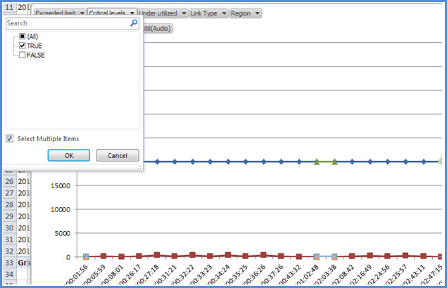

# <a name="skype-for-business-server-2015-resource-kit-tools-documentation"></a>Skype for Business Server 2015 资源工具包文档

本文介绍 Skype for Business Server 2015 资源工具包中的工具，包括每个工具的用途及其使用示例。 Skype for Business Server 2015 资源工具包可帮助部署和管理 Skype for Business Server 2015 的 IT 管理员更轻松地执行常规任务。 例如， **Web Conf 数据** 工具可用于轻松控制用户在联机会议期间上传的数据。 **SEFAUtil** 工具可用于为用户设置委托呼叫转发和应答。 我们鼓励 IT 管理员使用这些工具更有效地管理 2015 Skype for Business Server。

## <a name="installation-of-the-resource-kit-tools"></a>资源工具包工具的安装

若要安装 Skype for Business Server 2015 资源工具包，请从下载中心下载[OCSReskit.msi](https://www.microsoft.com/download/details.aspx?id=52631)。

运行 **OCSResKit.msi** 执行简单的安装。 .msi安装以下路径中的所有工具：**%Program Files%\Skype for Business Server 2015\ResKit**。 自包含可执行文件的工具位于此文件夹中。 还具有支持文件的工具位于其自己的子文件夹中。

## <a name="supported-environments"></a>支持的环境

Skype for Business Server 2015 资源工具包应安装在符合 2015 Skype for Business Server所需的规范的服务器上，通常用于在 2015 Skype for Business Server运行。

## <a name="resource-kit-tools-overview"></a>资源工具包工具概述

下面是 2015 Skype for Business Server资源工具包中提供的工具列表。 以下部分介绍了每个工具的说明，包括要求和示例用法。

- [ABSConfig](resource-kit-tools.md#ABSConfig)

- [带宽策略服务监视器](resource-kit-tools.md#bpsm)

- [带宽利用率分析器](resource-kit-tools.md#bua)

- [呼叫寄存计](resource-kit-tools.md#callpark)

- [DBAnalyze](resource-kit-tools.md#dba)

- [导入存储服务数据](resource-kit-tools.md#Issd)

- [LCSSync](resource-kit-tools.md#LCSSync)

- [查找用户控制台](resource-kit-tools.md#LUC)

- [MsTurnPing](resource-kit-tools.md#MsTurnPing)

- [网络配置查看器](resource-kit-tools.md#NCV)

- [响应组代理实时](resource-kit-tools.md#RGAL)

- [SEFAUtil](resource-kit-tools.md#SEFAUtil)

- [SYSPrep.ps1](resource-kit-tools.md#SYSPrep)

- [未分配的数字公告迁移](resource-kit-tools.md#UNAM)

- [Web Conf 数据](resource-kit-tools.md#WebConfData)

## <a name="absconfig"></a>ABSConfig
<a name="ABSConfig"> </a>

ABSConfig)  (通讯簿服务配置工具是一种管理工具，可帮助管理员在 2015 Skype for Business Server自定义通讯簿服务配置。 此工具还允许Skype for Business Server 2015 管理员还原默认的通讯簿服务设置。

### <a name="description"></a>描述

ABSConfig 是一个图形用户界面应用程序，使管理员能够配置与通讯簿服务相关的Active Directory 域服务属性。

该工具的主要方案如下：

- 使管理员能够将Active Directory 域服务中的属性映射到 Skype for Business Server 2015 的属性。

- 若要使管理员能够指定要包含或排除在通讯簿服务文件中的Active Directory 域服务属性。

- 若要使管理员能够还原，默认的通讯簿服务设置。

可以使用ABSConfig.exe文件启动 ABSConfig 工具。 该工具将打开“**配置属性**”选项卡。此表具有将Active Directory 域服务属性映射到 Skype for Business Server 2015 的属性字段的选项，并根据特定属性筛选器指定要在通讯簿服务文件中包括或排除哪些用户。 它还具有自定义要包含在通讯簿文件中的电话号码值的选项。 “ **还原默认** 值”选项使管理员能够将通讯簿服务设置还原为默认值。

> [!NOTE]
> 将 AD 属性重新映射到不同的 OC 字段名称仅适用于通讯簿文件下载，并且通讯簿 Web 查询不支持。

### <a name="output"></a>输出

ABSConfig 将通讯簿服务配置存储在数据库中。

```console
Path: %ProgramFiles%\Skype for Business Server 2015\Reskit
```

### <a name="purpose"></a>用途

ABSConfig 提供了一种快速且简单的自定义Skype for Business Server 2015 通讯簿服务的方法。

### <a name="requirements"></a>Requirements

#### <a name="computer"></a>计算机

ABSConfig 只能从已安装Skype for Business Server 2015 的已加入域的计算机运行。 对于 Skype for Business Server 2015，Enterprise Edition，此工具可以在设置期间启用了通讯簿服务的任何Front-End服务器上运行。

#### <a name="network"></a>网络

计算机应该能够连接到Front-End池和后端数据库。

#### <a name="software"></a>软件

在运行 ABSConfig 工具之前，必须安装以下软件组件：

- Skype for Business Server 2015

#### <a name="users"></a>用户

具有更新 Skype for Business Server 2015 部署所需的权限的管理员。

### <a name="examples"></a>示例

可以通过在命令提示符处键入 **ABSConfig.exe** 来启动 ABSConfig。 下面显示了 ABSConfig 工具用户界面。


### <a name="summary"></a>摘要

ABSConfig 工具为管理员提供了一种快速且易于使用的工具，用于自定义 2015 Skype for Business Server通讯簿服务。

## <a name="bandwidth-policy-service-monitor"></a>带宽策略服务监视器
<a name="bpsm"> </a>

带宽策略服务监视器工具旨在允许管理员查看以下列表：

1. 所有配置的 Skype for Business Server 2015 带宽策略服务 (拓扑中的身份验证和核心) 

2. 每个服务与其他带宽策略服务和边缘服务器建立的连接

3. 网络配置文档中配置的所有链接以及每个带宽策略服务报告的实时带宽使用情况

### <a name="description"></a>描述

带宽策略服务监视器工具作为基于 GUI 的应用程序实现。 管理员通过运行PDPMonUI.exe启动该工具。

启动该工具时，它会尝试在拓扑中发现带宽策略服务的列表。 完成初始更新后，窗口左侧的窗格将填充一个服务列表，这些服务由它们所属的群集分组。

当管理员选择特定的带宽策略服务时，右侧的窗格将显示有关该特定服务的信息。 该窗格还具有两个显示信息的主要选项卡。

#### <a name="machine-info-tab"></a>“计算机信息”选项卡

“ **计算机信息** ”选项卡显示所选带宽策略服务的详细信息，以及所选带宽策略服务与其他服务建立的所有连接的列表和状态。

#### <a name="topology-info-tab"></a>拓扑信息选项卡

“ **拓扑信息** ”选项卡显示网络配置设置中配置的所有链接的列表。 对于每个链接，将显示音频和视频带宽容量。 此外，当前使用的带宽以 Kbps 和容量的百分比显示。 该工具使用颜色编码突出显示具有接近容量的利用率的链接，这允许管理员快速隔离此类链接。

> [!NOTE]
>  如果带宽策略服务监视器工具连接到任何配置的带宽策略服务时遇到故障，则不会填充 **计算机信息** 和 **拓扑信息** 选项卡中的信息。 但是，该工具可能最初可能会连接，但随后会失去与服务的连接。 在这种情况下，管理员可能会看到过时的信息。 每个选项卡上都有一个 **上次更新** 时间戳，可让管理员查看特定带宽策略服务上次更新数据的时间。

### <a name="output"></a>输出

没有命令行输出;程序输出包含在主要图形用户界面 (GUI) 中。

### <a name="purpose"></a>用途

带宽策略服务监视器工具的目的是让管理员能够查看拓扑中定义的每个带宽策略服务的状态。 此外，管理员可以查看网络配置文档中定义的所有链接的实时带宽使用情况。

### <a name="requirements"></a>Requirements

带宽策略服务监视器工具需要在属于Skype for Business Server拓扑的计算机上运行。

### <a name="summary"></a>摘要

带宽策略服务监视器工具对管理员来说可能是一个有价值的资源，因此他们可以检查拓扑中所有带宽策略服务的状态，更重要的是，他们可以获取网络配置设置中定义的链接的实时带宽利用率。

## <a name="bandwidth-utilization-analyzer"></a>带宽利用率分析器
<a name="bua"> </a>

带宽利用率分析器是一种工具，可通过企业网络中的 WAN 链接创建有关 UC 终结点使用带宽的各种视图的报告。 这些报表可用于了解当前带宽消耗模式，并有助于规划带宽容量。

### <a name="description"></a>描述

带宽利用率分析器作为基于 GUI 的应用程序实现。 此工具专门针对网络中的音频利用率生成报表，并有助于进行容量规划。 它还循环访问分配给各种链接的带宽容量。

### <a name="output"></a>输出

带宽利用率分析器为系统中配置的所有 WAN 链接提供带宽容量和音频利用率的图形绘图。

### <a name="purpose"></a>用途

在任何语音和视频部署中，监视和了解整个企业网络中媒体流量的带宽利用率趋势至关重要。 带宽利用率分析器工具允许管理员实现此目的。 此工具执行以下操作：

- 生成网络中音频利用率的特定报表

- 帮助在分配给各种链接的带宽容量上进行更有效的容量规划和迭代

带宽利用率分析器可以生成带宽容量和利用率报告的图形绘图：它们如下所示：

- 企业网络中的所有 WAN 链接

- 由已选择的选定 WAN 链接筛选

- 按已超出链接容量的 WAN 链接进行筛选

- 由未充分利用预配带宽的 WAN 链接进行筛选

- 按 WAN 链接进行筛选，这些链接已达到关键级别， (超过 WAN 链接带宽容量 90% 的带宽利用率) 

- 按 WAN 链接类型（网络站点链接、区域间链接和网站中的链接）筛选

- 按网络区域筛选

#### <a name="applications"></a>应用程序

带宽利用率分析器具有以下两个应用程序 (工具) ：

- **WanLinkLogCollector.exe** 此工具使其用户能够输入所需的信息。

- **bandwidthUtilizationAnalyzer.xlsm** A Microsoft Excel 电子表格软件报表由 WanLinkLogCollector.exe 自动启动。 此应用程序允许用户将筛选器应用于报表，如本文后面所示。

#### <a name="phases-of-using-bandwidth-utilization-analyzer"></a>使用带宽利用率分析器的阶段

使用带宽利用率分析器时有两个阶段：

- 收集使用WanLinkLogCollector.exe执行的日志

- 自定义使用 BandwidthUtilizationAnalyzer.xlsm 执行的报表

  > [!IMPORTANT]
  > 强烈建议最终用户不要手动启动 BandwidthUtilizationAnalyzer.xlsm。

#### <a name="starting-bandwidth-utilization-analyzer"></a>启动带宽利用率分析器

在命令提示符处或使用Windows资源管理器"开始"菜单 WanLinkLogCollector.exe。

 **使用WanLinkLogCollector.exe**

使用WanLinkLogCollector.exe有三个步骤：

1. **记录时间线** 提供需要为其生成报表的时间线

2. **指定文件目录** 提供文件位置信息

3. **收集日志并启动报表查看器** 执行命令以生成报表

#### <a name="step-1---log-the-timeline"></a>步骤 1 - 记录时间线

记录时间线允许工具用户指定以下内容，如下图所示。

1. **"开始"菜单日期** 这是要为其生成报表的时间线的开始日期;例如，2010 年 8 月 1 日。

2. **结束日期** 这是要为其生成报表的时间线的结束日期;例如，2010 年 9 月 30 日。

     

#### <a name="step-2---specify-the-file-directories"></a>步骤 2 - 指定文件目录

用户可以指定以下文件目录，如下所示。

- **服务器日志文件位置** 存储带宽策略服务器日志的文件夹位置。 这通常在 \<fileserver\>\\ FE\>\AppServerFiles\PDP 的<选择中。

- **临时文件存储位置** 生成报表时存储中间文件的临时文件位置。

  

  > [!NOTE]
  > 确保向工具用户提供对服务器日志和临时文件存储文件夹的足够文件访问权限。

#### <a name="step-3---collect-the-logs-and-start-the-report-viewer"></a>步骤 3 - 收集日志并启动报表查看器

若要收集日志并启动报表查看器，请单击 **“执行** ”，如下所示。 此步骤收集所需的数据。


输入验证成功后，将显示下面显示的消息。


单击“确定”。 BandwidthUtilizationAnalyzer.xlsm 会自动启动。 按照消息框中的说明操作。 有关详细信息，请参阅下一部分中的 **Using BandwidthUtilizationAnalyzer.xlsm** 。


### <a name="using-bandwidthutilizationanalyzerxlsm"></a>使用 BandwidthUtilizationAnalyzer.xlsm

1. 当 BandwidthUtilizationAnalyzer.xlsm 自动启动时，单击 **“刷新** ”，如下所示。

     

2. 打开文件文件夹时，从消息框中指定的位置选择consolidated.csv，如下所示。 它还将位置显示为 **C：\Temp**。

     

3. 单击 **“导入”**。

4. 将自动生成图形绘图。 当后台工作指针消失时，它可用。

     

#### <a name="applying-filters-to-the-report-view"></a>将筛选器应用到报表视图

可应用于报表视图的筛选器如下所示：


1. **名字** 按 WAN 链接筛选， (筛选器位于图形) 右侧。 前缀表示以下链接类型;请参阅垂直 (蓝色) 框：

   - **S 站点** WAN 从网络站点链接到网络区域

   - **IS 站点间** 两个网络站点之间的 WAN 链接

   - **R 区域间** 两个网络区域之间的 WAN 链接

2. **超出限制** 按带宽利用率大于带宽容量的 WAN 链接进行筛选

3. **关键级别** 按带宽利用率达到 90% 或超过带宽容量的 WAN 链接进行筛选

4. **利用不足** 按带宽利用率小于带宽容量 25% 的 WAN 链接进行筛选

5. **链接类型** 按以下 WAN 链接类型进行筛选：

   - **网络站点** 类型

   - **站点间** 类型

   - **区域间链接** 类型

6. **地区** 按网络区域筛选

下图显示了前面描述的筛选器。

按 **名称** 筛选。 选择需要在图形中显示的链接列表。


按 **超出的限制** 进行筛选。 选择 **True** 以强制执行筛选器。


按 **关键级别** 进行筛选。 选择 **True** 以强制执行筛选器。



按 **“使用不足”筛选**。 选择 **True** 以强制执行筛选器。


按 **链接类型** 筛选。 选择需要显示的类型或类型。


按 **区域** 筛选。 选择需要显示其链接的区域列表。


### <a name="requirements"></a>Requirements

- .NET Framework 3.5

- Microsoft Excel 2010或Excel 2007

### <a name="summary"></a>摘要

带宽利用率分析器用于绘制网络中 UC 流量的音频带宽利用率。 此工具也可用于报告网络上视频带宽的使用率。

## <a name="call-parkometer"></a>呼叫寄存计
<a name="callpark"> </a>

呼叫寄存计是一种命令行应用程序，可轻松访问呼叫寄存轨道数据库。

### <a name="description"></a>描述

呼叫寄存器是跟踪当前寄存呼叫的工具。 它还收集有关轨道和呼叫寄存服务器 (CPS) 使用情况的统计信息。 此命令行工具提供从本地或远程连接的计算机对 CPS 轨道SQL Server数据库的读取和写入访问。

所有选项都是互斥的。 命令行语法如下所示：

- **-o** 参数 - 列出为此池配置的所有轨道范围。

- **-n** 参数 - 列出此池中当前使用的所有轨道。 显示的信息如下所示：

  - SIP 统一资源标识符 (寄存器和寄存器的 URI) 。

  - 寄存呼叫的 CPS 的主机名。

  - 停靠呼叫的时间戳。

- **-f** 参数 - 列出池中当前可用的轨道数。

- **-r \<n\>** 参数 - 列出 \<n\> 上次寄存的调用。 显示的信息如下所示：

  - Parkee SIP URI。

  - 帕克 SIP URI。

  - 寄存呼叫的 CPS 的主机名。

  - 检索或删除呼叫的时间戳。

- **-t\<n\>** 参数 - 测试在数据库中保留一个轨道，以显示分配的轨道号的随机性。

### <a name="output"></a>输出

根据在命令提示符处指定的输入参数，调用寄存计将显示以下输出：

- 为此池配置的所有轨道范围

- 当前停放的呼叫

- 可用) 轨道的可用 (数

- 最近停放的呼叫

- 用于测试统一和随机轨道值的保留轨道

### <a name="purpose"></a>用途

CPS 工具的目的是提供对 CPS 数据库的命令行访问权限。 管理员可以查看 CPS 使用情况，并确定分配给池的轨道数。

### <a name="requirements"></a>Requirements

如果此工具在运行 CPS 的同一台计算机上运行，则没有任何要求。 如果此工具在远程计算机上运行，则必须将 Skype for Business Server 2015 使用的SQL Server数据库配置为允许远程访问。 必须使用SQL Server数据库连接字符串配置呼叫寄存器，才能连接到池的SQL Server。 parkometer.exe.config配置文件中定义了此SQL Server数据库连接字符 **串。** 它必须放置在parkometer.exe所在的同一目录中。 以下 XML 文件是parkometer.exe.config的示例。必须配置的参数是用户名 (例如 mydomain\Administrator) 、密码 (（例如 mypassword) ）和主机名 (例如 myserver) 。

```xml
<?xml version="1.0" encoding="utf-8" ?>
<configuration>
  <appSettings>
   <add key="SQL" value="server=myserver\RTC;
database=cpsdyn;
User Id=mydomain\Administrator;
Password=mypassword.;
Integrated Security=false;"/>
  </appSettings>
</configuration>
```

### <a name="examples"></a>示例

已部署的轨道范围：-o 参数列出为此池配置的所有轨道范围，如下所示


当前寄存的调用：-n 参数列出了此池上当前使用的所有轨道，如下所示


自由轨道数：-f 参数列出池中当前可用的轨道数，如下所示


最近寄存的呼叫：-r \<n\> 参数列出了最后一次寄存调用， \<n\> 如下所示


测试轨道预留：-t \<n\> 参数测试在数据库中保留轨道，如下所示


### <a name="summary"></a>摘要

呼叫寄存器是一种命令行工具，提供有关呼叫寄存服务器的详细信息。

## <a name="dbanalyze"></a>DBAnalyze
<a name="dba"> </a>

### <a name="description"></a>说明

DBAnalyze 是一种命令行工具，可帮助管理员收集有关 Skype for Business Server 2015 数据库的分析报告。 DBAnalyze 具有以下模式：诊断、用户数据、会议、MCUs 和磁盘碎片：

- **诊断模式** 创建一个报表，其中包含有关表 (记录数、碎片数、数据大小以及索引大小) 、数据和日志文件大小、上次备份时间、运行Microsoft Office通信服务器的服务器之间的联系人分布、权限的平均数、联系人、容器、订阅、发布、每个用户的终结点、任何不当的托管用户、无法路由的用户、 每个用户组织的平均会议数、计划会议、活动会议和数据库版本。

    > [!NOTE]
    > 运行诊断模式可能会影响服务器性能。

- **用户数据模式** 报告指定用户或其联系人和权限列表中包含该用户的用户的联系人、容器、订阅、发布、权限和联系人组数据。 此模式还会报告用户组织或受邀参加的会议的摘要数据。

- **会议模式** 报告特定会议的详细数据，包括会议的所有日程安排时间详细信息、受邀者列表、会议允许的媒体类型列表、活动 MCUs (多点控制单元) 、活动参与者列表以及每个参与者的信号状态。

- **解码会议 ID** 解码由 **/pstnid** 交换机指定但未连接到后端以获取详细信息的公共交换电话网络 (PSTN) 会议 ID。

- **解决会议** 解码 **由 /pstnid** 开关指定的 PSTN 会议 ID，并显示有关 ID 指示的会议的信息。

- **MCUs 模式** 报告池中每个 MCU 的 ID、媒体类型、URL、检测信号状态、会议负载和参与者负载。

- **磁盘碎片模式** 显示所有磁盘的碎片状态。

此工具可用于诊断各种问题或帮助管理员进行容量规划。 例如，如果托管在服务器 A 上的大多数用户选择服务器 B 上托管的用户作为其联系人，则管理员可以将服务器 A 上的用户移动到服务器 B，以减少跨服务器流量。

### <a name="output"></a>输出

此工具输出有关 Skype for Business Server 2015 数据库的预定义报告。 **路径**：%ProgramFiles%\Skype for Business Server 2015\Reskit

### <a name="purpose"></a>用途

若要安装Dbanalyze.exe，请将其复制到本地文件夹，然后运行该工具。 若要使用该工具，请从命令行运行以下命令。 `dbanalyze.exe [/v] [/report:value] [/sqlserver:value] [/user:user@domain.com] [/conf:value][/pstnid:Value] [/maxcontacts:value]` 命令行选项的说明如下所示。


### <a name="requirements"></a>Requirements

 **计算机** DBAnalyze 只能从已安装Skype for Business Server 2015 的已加入域的计算机运行。

 **网络** 计算机应该能够连接到后端数据库。

 **在** 运行 DBAnalyze 之前，必须安装软件Skype for Business Server 2015 软件组件。

 **用户** 下表显示了具有访问 Skype for Business Server 2015 数据库所需的权限的管理员。


> [!NOTE]
> **/report：disk** 模式需要本地管理员帐户。

### <a name="examples"></a>示例

下面是有效Dbanalyze.exe命令的示例：

```console
dbanalyze.exe /report:diag
dbanalyze.exe /report:user /user:usera@domainb.com
dbanalyze.exe /report:conf /user:bob@example.com /conf:1W9J71SKSX2X
dbanalyze.exe /report:resolve /pstnid:12345
dbanalyze.exe /report:mcus
dbanalyze.exe /report:disk
```

### <a name="summary"></a>摘要

DBAnalyzer 为管理员提供了快速且易于分析Skype for Business Server 2015 数据库。

## <a name="import-storage-service-data"></a>导入存储服务数据
<a name="Issd"> </a>

ImportStorageServiceData 资源工具包工具允许重新传送从存储服务 (LYSS 中刷新) 回存储服务的队列和终结点数据。

### <a name="description"></a>描述

从存储服务中刷新的数据可能是根据队列项状态或数据库大小自动 (定期) 。 这可能是由于池故障转移 cmdlet 的手动调用，或者池故障转移 cmdlet 调用的 StorageServiceFullFlush cmdlet () 。 请注意，如果前端的任何存储服务 (LYSS ) 数据库大小高于正常级别，最好不要重新报告数据，因为这样做可能会导致导出更多数据。此外，应首先解决可能导致导致存储服务队列增长的错误的任何问题，例如Exchange终结点错误、网络问题或其他) 问题 (。

 **方案 1：** 在池故障转移期间，可能会从每个前端的存储服务中刷新文件。 故障转移完成后，应运行该工具来重新传送数据。

 **方案 2：** 每天自动刷新数据，或响应超过特定大小阈值的存储服务数据库 (，例如 60%、80%、90% 的完整) 。 管理员应定期重新报告自动刷新的数据。 在上述情况下，如果未部署监视 SCOM 包，则存在与从存储服务刷新数据相关的Skype for Business Server 存储服务的事件。 事件 ID 为 32075 (完全刷新操作) 启动，32076 (完全刷新已完成) ，32082 (维护级别刷新) 启动，32083 (维护级别刷新完成) ，32089 (刷新因填充数据库) 而发生刷新。 请注意，这些事件 ID 对应于 RTM 版本。 当管理员看到这些事件时，这意味着有些文件已被刷新。应定期使用此工具导入此数据，例如每周导入一次。

对于联机服务版本，如果部署了适用于Skype for Business Server的运行状况监视 SCOM 包，可能会引发新的警报，要求管理员将刷新的数据重新放入存储服务。 在触发警报的Front-End服务器上的事件日志中将有一个相应的事件。 该事件将说明刷新的数据文件所在的父路径，以及有多少文件符合警报条件。 警报条件是，特定父路径下有 X 或多个文件，这些文件至少为 Y 天， (其中 X 和 Y 在 StorageService 中预设，但可以通过更改 APPCONFIG 文件来重写。) 下面显示了可触发运行状况警报的两个事件示例， 差异为其父路径。 一种可能性是在 Web 服务文件共享下，另一种可能性是每个前端的本地应用程序数据目录。  (例如 c：\ProgramData\Microsoft\Skype for Business Server 2015\StorageService) 。 然后，管理员将运行此 reskit 工具。

此工具将增加前端及其上运行的 CPU 和 IO 负载，以及其他前端（在执行工具的前端不拥有数据的情况下）。 建议在前端不负重 CPU 和 IO 负载时运行此工具，例如在高峰时段之外。 其次，此工具可以 2 到 3 分钟导入一个数据文件。 在估算工具将运行多长时间时，请记住这一点。 默认情况下，该工具生成的详细日志文件将显示在文件Microsoft Store上。 如果未报告任何错误，请将其删除，因为日志文件可以是数十 MB 或更多。


### <a name="requirements"></a>Requirements

安装 Skype for Business Server 2015 资源工具包工具。 该工具在已加入域的计算机上运行，其中安装了 Skype for Business Server 和 Skype for Business Server Management Shell。 该工具使用管理外壳中的 cmdlet 来标识池中的所有Front-End服务器。 其次，必须从已安装 **RtcLocal** 数据库的池中的计算机执行该工具。 该工具使用此数据库来检索池的 WEBSERVICE 文件共享位置。 此外，在使用该工具之前，每个Front-End服务器必须首先在每个Front-End服务器上使用 **Enable-PSRemoting** 以及从中执行该工具的计算机启用Windows PowerShell远程处理。 否则，此工具中的远程Windows PowerShell命令将失败。 Windows PowerShell完成后，可以在池中的所有Front-End服务器上关闭远程处理。 最后，调用该工具的帐户或凭据必须具有对其正在执行此工具的池的 Web 服务文件共享的读/写权限。 否则，该工具将失败并出现 IO 权限错误。

> [!NOTE]
> Windows Server 2012，默认情况下启用Windows PowerShell远程处理，但在 Windows Server 2008 操作系统上则不启用远程处理。

### <a name="examples"></a>示例

```console
>  C:\StorageService>ImportStorageServiceData.exe
Description:
This tool will re-import Storage Service (LYSS) flushed queue data back in.  For a pool: you are required to run this tool on a machine inside the pool which has the Lync Server Management Shell installed.  Additionally, all front end machines need to have Windows Powershell Remoting enabled before executing this tool by executing Enable-PSRemoting.  Also, please ensure that all Storage Service instance DB Size are at the 'Normal' level (verify this by viewing Eventlog events). Otherwise re-importing may cause data to be flushed out again if any Storage Service instance DB size level goes above 'Normal'.
Usage: Default behavior is to Import data from web service file share as well as any files on all Front End machines in pool.
Additional Options:
-Verbose                    : Turn verbose output on.

-StorageServiceHostName     : Host Name of Storage Service WCF endpoint.  ( Default=localhost netnamedpipe binding. )

-FileSharePath              : Import only all data from just under the UNC path specified.

ActivityID: cc3b62ff-bb66-4e61-a6e2-96cb3626315c. <-- Use this to correlate with StorageService trace logs if troubleshooting.
Type Server name (TCP binding) or press <enter> for localhost (NamePipe binding):
Using NetNamedPipeBinding...
OnTopologyChanged Event received
Web Service File Share: \\dc.vdomain.com\OcsFileStore\co1-WebServices-1\StorageService

Front Ends:
server.vdomain.com
server2.vdomain.com
server1.vdomain.com
server3.vdomain.com
Looking under directory: \\dc.vdomain.com\OcsFileStore\co1-WebServices-1\StorageService for exported data.
# Files found: 8
Starting Import for file:\\dc.vdomain.com\OcsFileStore\co1-WebServices-1\StorageService\DataExport\2
0120910\SERVER.vdomain.com\944f5724c65c5f93900dc1c8c898b102__0.xml
Items deserialized: 20

All items in file were enqueued successfully, will try to delete file: \\dc.vdomain.com\OcsFileStore\co1-WebServices-1\StorageService\DataExport\20120910\SERVER.vdomain.com\944f5724c65c5f93900dc1c8c898b102__0.xml

All items in file failed to enqueue so file will not be deleted.  File path: \\dc.vdomain.com\OcsFileStore\co1-WebServices-1\StorageService\DataExport\20120910\SERVER.vdomain.com\944f5724c65c5f93900dc1c8c898b102__0.xml

Summary for file \\dc.vdomain.com\OcsFileStore\co1-WebServices-1\StorageService\DataExport\20120910\SERVER.vdomain.com\944f5724c65c5f93900dc1c8c898b102__0.xml: succeeded: 20, failed: 0

Starting Import for file:\\dc.vdomain.com\OcsFileStore\co1-WebServices-1\StorageService\DataExport\20120910\SERVER1.vdomain.com\17d5435ae40259f7bbdf1866776386e4__0.xml
Items deserialized: 20

[cc3b62ff-bb66-4e61-a6e2-96cb3626315c] Send EnqueueMessages to redirected, targetServer=server1.vdomain.com, queueItems=20

All items in file were enqueued successfully, will try to delete file: \\dc.vdomain.com\OcsFileStore\co1-WebServices-1\StorageService\DataExport\20120910\SERVER1.vdomain.com\17d5435ae40259f7bbdf1866776386e4__0.xml

All items in file failed to enqueue so file will not be deleted.  File path: \\dc.vdomain.com\OcsFileStore\co1-WebServices-1\StorageService\DataExport\20120910\SERVER1.vdomain.com\17d5435ae40259f7bbdf1866776386e4__0.xml

Summary for file \\dc.vdomain.com\OcsFileStore\co1-WebServices-1\StorageService\DataExport\20120910\
SERVER1.vdomain.com\17d5435ae40259f7bbdf1866776386e4__0.xml: succeeded: 20, failed: 0

Starting Import for file:\\dc.vdomain.com\OcsFileStore\co1-WebServices-1\StorageService\DataExport\20120910\SERVER1.vdomain.com\904f6c9b8ac951ae8b3c86684d3832e4__0.xml

Items deserialized: 20
[cc3b62ff-bb66-4e61-a6e2-96cb3626315c] Send EnqueueMessages to redirected, targetServer=server1.vdomain.com, queueItems=20

All items in file were enqueued successfully, will try to delete file: \\dc.vdomain.com\OcsFileStore
\co1-WebServices-1\StorageService\DataExport\20120910\SERVER1.vdomain.com\904f6c9b8ac951ae8b3c86684d
3832e4__0.xml

All items in file failed to enqueue so file will not be deleted.  File path: \\dc.vdomain.com\OcsFil
eStore\co1-WebServices-1\StorageService\DataExport\20120910\SERVER1.vdomain.com\904f6c9b8ac951ae8b3c
86684d3832e4__0.xml

Summary for file \\dc.vdomain.com\OcsFileStore\co1-WebServices-1\StorageService\DataExport\20120910\
SERVER1.vdomain.com\904f6c9b8ac951ae8b3c86684d3832e4__0.xml: succeeded: 20, failed: 0

Starting Import for file:\\dc.vdomain.com\OcsFileStore\co1-WebServices-1\StorageService\DataExport\2
0120910\SERVER2.vdomain.com\69844a271e6c5633a1f2b46a42287dd6__0.xml

Items deserialized: 20

[cc3b62ff-bb66-4e61-a6e2-96cb3626315c] Send EnqueueMessages to redirected, targetServer=server2.vdom
ain.com, queueItems=20

All items in file were enqueued successfully, will try to delete file: \\dc.vdomain.com\OcsFileStore
\co1-WebServices-1\StorageService\DataExport\20120910\SERVER2.vdomain.com\69844a271e6c5633a1f2b46a42
287dd6__0.xml

All items in file failed to enqueue so file will not be deleted.  File path: \\dc.vdomain.com\OcsFil
eStore\co1-WebServices-1\StorageService\DataExport\20120910\SERVER2.vdomain.com\69844a271e6c5633a1f2
b46a42287dd6__0.xml

Summary for file \\dc.vdomain.com\OcsFileStore\co1-WebServices-1\StorageService\DataExport\20120910\
SERVER2.vdomain.com\69844a271e6c5633a1f2b46a42287dd6__0.xml: succeeded: 20, failed: 0

Starting Import for file:\\dc.vdomain.com\OcsFileStore\co1-WebServices-1\StorageService\DataExport\2
0120910\SERVER3.vdomain.com\3313935458e35b9b9759e08a15d251e6__0.xml

Items deserialized: 20

[cc3b62ff-bb66-4e61-a6e2-96cb3626315c] Send EnqueueMessages to redirected, targetServer=server3.vdom
ain.com, queueItems=1

All items in file were enqueued successfully, will try to delete file: \\dc.vdomain.com\OcsFileStore
\co1-WebServices-1\StorageService\DataExport\20120910\SERVER3.vdomain.com\3313935458e35b9b9759e08a15
d251e6__0.xml

All items in file failed to enqueue so file will not be deleted.  File path: \\dc.vdomain.com\OcsFil
eStore\co1-WebServices-1\StorageService\DataExport\20120910\SERVER3.vdomain.com\3313935458e35b9b9759
e08a15d251e6__0.xml

Summary for file \\dc.vdomain.com\OcsFileStore\co1-WebServices-1\StorageService\DataExport\20120910\
SERVER3.vdomain.com\3313935458e35b9b9759e08a15d251e6__0.xml: succeeded: 20, failed: 0

Starting Import for file:\\dc.vdomain.com\OcsFileStore\co1-WebServices-1\StorageService\DataExport\2
0120910\SERVER3.vdomain.com\4501e04eae4856059346949ff817c220__0.xml
Items deserialized: 20
[cc3b62ff-bb66-4e61-a6e2-96cb3626315c] Send EnqueueMessages to redirected, targetServer=server3.vdom
ain.com, queueItems=1
All items in file were enqueued successfully, will try to delete file: \\dc.vdomain.com\OcsFileStore
\co1-WebServices-1\StorageService\DataExport\20120910\SERVER3.vdomain.com\4501e04eae4856059346949ff8
17c220__0.xml
All items in file failed to enqueue so file will not be deleted.  File path: \\dc.vdomain.com\OcsFil
eStore\co1-WebServices-1\StorageService\DataExport\20120910\SERVER3.vdomain.com\4501e04eae4856059346
949ff817c220__0.xml

Summary for file \\dc.vdomain.com\OcsFileStore\co1-WebServices-1\StorageService\DataExport\20120910\
SERVER3.vdomain.com\4501e04eae4856059346949ff817c220__0.xml: succeeded: 20, failed: 0
Starting Import for file:\\dc.vdomain.com\OcsFileStore\co1-WebServices-1\StorageService\DataExport\2
0120910\SERVER3.vdomain.com\5ad77443ad955a22a876749be66d5317__0.xml

Items deserialized: 20
[cc3b62ff-bb66-4e61-a6e2-96cb3626315c] Send EnqueueMessages to redirected, targetServer=server3.vdom
ain.com, queueItems=20
All items in file were enqueued successfully, will try to delete file: \\dc.vdomain.com\OcsFileStore
\co1-WebServices-1\StorageService\DataExport\20120910\SERVER3.vdomain.com\5ad77443ad955a22a876749be6
6d5317__0.xml
All items in file failed to enqueue so file will not be deleted.  File path: \\dc.vdomain.com\OcsFil
eStore\co1-WebServices-1\StorageService\DataExport\20120910\SERVER3.vdomain.com\5ad77443ad955a22a876
749be66d5317__0.xml
Summary for file \\dc.vdomain.com\OcsFileStore\co1-WebServices-1\StorageService\DataExport\20120910\
SERVER3.vdomain.com\5ad77443ad955a22a876749be66d5317__0.xml: succeeded: 20, failed: 0
Starting Import for file:\\dc.vdomain.com\OcsFileStore\co1-WebServices-1\StorageService\DataExport\2
0120910\SERVER3.vdomain.com\a11e27ae439a582288d4657eda86b565__0.xml
Items deserialized: 20
[cc3b62ff-bb66-4e61-a6e2-96cb3626315c] Send EnqueueMessages to redirected, targetServer=server3.vdom
ain.com, queueItems=20
All items in file were enqueued successfully, will try to delete file: \\dc.vdomain.com\OcsFileStore
\co1-WebServices-1\StorageService\DataExport\20120910\SERVER3.vdomain.com\a11e27ae439a582288d4657eda
86b565__0.xml
All items in file failed to enqueue so file will not be deleted.  File path: \\dc.vdomain.com\OcsFil
eStore\co1-WebServices-1\StorageService\DataExport\20120910\SERVER3.vdomain.com\a11e27ae439a582288d4
657eda86b565__0.xml
Summary for file \\dc.vdomain.com\OcsFileStore\co1-WebServices-1\StorageService\DataExport\20120910\
SERVER3.vdomain.com\a11e27ae439a582288d4657eda86b565__0.xml: succeeded: 20, failed: 0
All files have been imported into Storage Service for path: \\dc.vdomain.com\OcsFileStore\co1-WebSer
vices-1\StorageService
Importing files for: server.vdomain.com
No files founds.
Importing files for: server2.vdomain.com
No files founds.
Importing files for: server1.vdomain.com
No files founds.
Importing files for: server3.vdomain.com
No files founds.
Writing log: \\dc.vdomain.com\OcsFileStore\co1-WebServices-1\StorageService\ImportStorageServiceData
Log20120910_1609SS
Tool has finished execution.
>  C:\StorageService>
```

## <a name="lcssync"></a>LCSSync
<a name="LCSSync"> </a>

LCSSync 工具有助于在多林环境中部署 Skype for Business Server 2015 通信软件。 此工具用于将不同用户林中的用户和组作为Active Directory 域服务联系人对象同步到安装了 Skype for Business Server 2015 的中央林。

### <a name="description"></a>描述

 LCSSync 使用中央林中的同步Active Directory 域服务联系人对象为用户启用Skype for Business Server。 若要提供单一登录，必须将主要用户帐户映射到 2015 Skype for Business Server中央林中的Active Directory 域服务联系人对象。 此工具有助于执行该映射。 此工具提供用于在 Microsoft Identity Integration Server 中创建管理代理的模板。

### <a name="summary"></a>摘要

LCSSync 工具有助于在多林环境中部署 Skype for Business Server 2015。

## <a name="lookup-user-console"></a>查找用户控制台
<a name="LUC"> </a>

LookupUserConsole 工具显示有关特定用户的内部Skype for Business Server路由信息。 此信息对于 Microsoft 支持个人诊断部署和路由问题可能很有用。

### <a name="description"></a>描述

 执行LookupUserConsole.exe将打开一个命令提示符，该命令提示符接受 SIP 地址，并尝试显示与这些地址相关的内部Skype for Business Server路由信息。 键入 **退出** 以退出 LookupUserConsole 工具。

### <a name="requirements"></a>Requirements

安装 Skype for Business Server 2015 资源工具包。 该工具在已加入域的计算机上运行，其中安装了Skype for Business Server。

### <a name="examples"></a>示例

C：\Program Files\Skype for Business Server 2015\ResKit\>LookupUserConsole.exe

```console
> sip:john.doe@vdomain.com

  Execution time (ms):                            171.094
  Exeuction result:                               Success
  SIP URI:                                        sip:john.doe@vdomain.com
  User info:
    SID:                                          S-1-5-21-2831376166-29632525...    Display name:                                     John Doe
    Grouping ID:                                  00000000-0000-0000-0000-...
    Line URI:                                     <null>
    Policy assignment:                            TenantId={00000000--0000-000....
    SIP enabled:                                  True
    UC enabled:                                   False
    Tenant ID:                                    00000000-0000-0000-0000-...  Cluster info:
    Active cluster:                               pool0.vdomain.com
    Backup registrar cluster:                     <null>
    Deployment location:                          <null>
    Home Front-End FQDN:                          SERVER.vdomain.com
    Primary Registrar cluster:                    pool0.vdomain.com
    Remote Director external SIP FQDN:            <null>
    Remote Director internal SIP FQDN:            <null>
    Remote Director Web FQDN:                     <null>
    Routing group ID:                             4501e04e-ae48-5605-9346...
    Service tag ID:                               1266953005
    User Front-End resolved:                      True
    User in local forest:                         True
    User in remote forest:                        False
    User in split domain:                         False
    User-Services cluster:                        pool0.vdomain.com

> sip:nouser@vdomain.com

  Execution time (ms):                            948.7574
  Exeuction result:                               UserDoesNotExist

> exit
```

## <a name="msturnping"></a>MsTurnPing
<a name="MsTurnPing"> </a>

MSTurnPing 工具允许 Skype for Business Server 2015 通信软件的管理员检查运行音频/视频边缘、音频/视频身份验证服务的服务器以及在拓扑中运行带宽策略服务的服务器的状态。

### <a name="description"></a>描述

MSTurnPing 工具允许 Skype for Business Server 2015 通信软件的管理员检查运行音频/视频边缘、音频/视频身份验证服务的服务器以及在拓扑中运行带宽策略服务的服务器的状态。

该工具允许管理员执行以下测试：

1. A/V Edge Server 测试：该工具通过执行以下操作，对拓扑中的所有 A/V Edge 服务器执行测试：

   - 验证是否已启动Skype for Business Server音频/视频身份验证服务，并可以颁发正确的凭据。

   - 验证是否已启动Skype for Business Server音频/视频边缘服务，并可以成功分配外部边缘上的资源。

2. 带宽策略服务测试：该工具通过执行以下操作，对拓扑中运行带宽策略服务的所有服务器执行测试：

   - 验证是否已启动Skype for Business Server带宽策略服务 (身份验证) ，并可以颁发正确的凭据。

   - 验证Skype for Business Server带宽策略服务 (核心) 是否已启动，并且可以成功执行带宽检查。

此工具必须从属于拓扑的计算机运行，并且已安装本地存储。

### <a name="output"></a>输出

该工具输出每个操作的结果。

- 如果执行 **AudioVideoEdgeServer** 测试，则工具输出如下：

  - 在拓扑中提供 Skype for Business Server 2015 音频/视频身份验证服务的计算机的测试结果

  - 在拓扑中提供 Skype for Business Server 2015 音频/视频边缘服务的计算机的测试结果

- 如果执行 **BandwidthPolicyServer** 测试，则工具输出如下：

  - 在拓扑中提供 Skype for Business Server 2015 带宽策略服务 (身份验证) 的计算机的测试结果

  - 在拓扑中提供 Skype for Business Server 2015 带宽策略服务 (核心) 的计算机的测试结果

### <a name="requirements"></a>Requirements

- 此工具必须从拓扑中且具有本地存储的计算机运行。

- 该工具必须以有权访问本地存储的管理员身份运行。

### <a name="examples"></a>示例

下面是工具输入的示例。

```console
MsTurnPing -ServerRole AudioVideoEdgeServer

MsTurnPing -ServerRole BandwidthPolicyServer
```

### <a name="summary"></a>摘要

对于 Skype for Business Server想要检查运行音频/视频和带宽策略服务的服务器的状态的 2015 管理员来说，此工具可以是一个有价值的资源。

## <a name="network-configuration-viewer"></a>网络配置查看器
<a name="NCV"> </a>

网络配置查看器可由 Skype for Business Server 2015 通信软件管理员使用，以查看为允许实时通信会话（例如基于指定带宽容量的语音或视频呼叫）的企业的呼叫允许控制 (CAC) 网络拓扑。 Skype for Business Server 2015 管理员定义 CAC 策略，这些策略由随 Skype for Business Server 2015 一起安装的带宽策略服务强制实施。

### <a name="description"></a>描述

网络配置查看器 (NetworkConfigurationViewer.exe) 允许管理员执行以下任务：

- 以图形格式从 Skype for Business Server 2015 部署加载和查看 CAC 网络拓扑。

- 以图形格式从带宽策略服务器日志文件加载和查看 CAC 网络拓扑。

- 在磁盘上以 XML 格式保存和存储 CAC 网络拓扑。

- 以 JPG 或 BMP 格式保存和存储 CAC 网络拓扑图。

- 查看 CAC 网络拓扑配置数据。

- 以树视图样式查看 CAC 网络拓扑。

- 为 CAC 网络拓扑链接定义自定义连接器 (例如，站点到区域、区域到区域和站点到站点链接) 。

- 查看 CAC 网络拓扑站点信息、区域信息以及预配的带宽策略和网络链接。

### <a name="purpose"></a>用途

在图形接口中查看企业 CAC 网络拓扑链接。

### <a name="examples"></a>示例

 **以图形格式从 Skype for Business Server 2015 部署加载和查看 CAC 网络拓扑**：Skype for Business Server 2015 管理员可以使用 **2015 Skype for Business Server计算机加载和查看 CAC 网络拓扑配置下载网络配置** 选项，如下图所示。 在未连接到 Skype for Business Server 2015 配置存储的计算机上部署时，该工具将无法下载或查看此类配置。


 **以图形格式从带宽策略服务器日志文件加载和查看 CAC 网络拓扑：** Skype for Business Server 2015 带宽策略服务器将 CAC 网络拓扑保存为 2015 Skype for Business Server文件共享位置下的日志记录机制的一部分。 Skype for Business Server 2015 管理员可以使用 **“打开网络配置**”选项以图形格式查看此类文件，如下所示。


在磁盘上以 XML 格式保存和存储 CAC 网络拓扑：Skype for Business Server 2015 管理员可以使用 **“保存网络配置”选项的副本** 以 XML 格式保存 CAC 网络拓扑配置文件，如下所示。 然后，可以脱机使用保存的配置文件进行图形查看。


以 JPG 或 BMP 格式保存和Microsoft Store CAC 网络拓扑关系图：Skype for Business Server 2015 管理员可以使用 **“保存网络配置”图作为图片** 选项，将 CAC 网络拓扑配置以图形格式 (JPG 和 BMP 文件格式保存) ，如下所示。


 <strong>查看 CAC 网络拓扑配置数据：</strong>Skype for Business Server 2015 管理员可以使用视图网络配置数据选项以文本格式查看相关的网络配置数据，例如网络区域、网络站点、带宽配置文件和站点子网 IP 地址，如下所示。


 **以树视图样式查看 CAC 网络拓扑：** Skype for Business Server 2015 管理员可以使用工具窗口左侧的控制面板查看图形树视图样式中的相关网络配置数据，如下所示。


 **为 CAC 网络拓扑链接定义自定义连接器 (，例如站点到区域、区域到区域和站点到站点链接) ：** Skype for Business Server 2015 管理员可以使用以下设置选项定义 CAC 网络配置 WAN 链接的自定义图形连接器。 这有助于区分在网络配置中预配的各种类型的网络链接。


 **查看 CAC 网络拓扑站点信息、区域信息和预配带宽策略：** Skype for Business Server 2015 管理员可以使用以下选项查看相关的 CAC 网络区域信息、站点信息和 CAC 带宽预配信息。  (例如，单击网络区域或网络站点对象中 **的信息** 。) 


### <a name="summary"></a>摘要

此工具可以是Skype for Business Server 2015 管理员（想要以图形格式查看 CAC 网络拓扑以进行部署）的宝贵资源。

## <a name="response-group-agent-live"></a>响应组代理实时
<a name="RGAL"> </a>

响应组应用程序使代理能够使用其内置 Web 服务访问有用的实时信息。 遗憾的是，应用程序外部没有此数据的图形视图。 响应组代理 Live 资源工具包工具通过提供一种简单且图形化的方式来访问此信息，并使用实时Skype for Business通信软件信息（例如存在其他代理）来增强此问题。

### <a name="description"></a>描述

响应组代理 Live 是一个Windows应用程序，提供登录和注销功能，以及一些实时信息 (，例如组成员身份和响应组代理) 的当前呼叫数。 它是代理组页面的增强版本， (可从Skype for Business访问。

### <a name="purpose"></a>用途

响应组应用程序会对传入调用进行队列，然后将它们路由到代理组。 为了做出有关服务调用的明智决策，代理可以访问有关其代理组的实时信息，例如其他代理可用以及每个队列中正在等待的呼叫数。 此信息最初只能通过响应组服务访问，由响应组代理 Live 以直观的方式提供。

#### <a name="features"></a>功能

响应组代理 Live 工具基于响应组服务和 Skype for Business Server 2015 SDK 构建。 它为响应组代理提供响应组服务 (提供的信息和功能，例如组成员身份、其他代理的存在以及) 的等待呼叫数。

下图说明了响应组代理 Live 的主接口。


响应组代理 Live 中的代理有以下三个主要功能：

- **登录/注销：** 与从 Skype for Business Server 2015) 可访问的代理组页面 (相反，响应组代理 Live 仅允许代理一次登录或注销所有代理组。 此应用程序为代理提供了三种快速登录或注销的方法：

  - 单击应用程序中的“登录/注销” (绿色和红色) 按钮。

  - 右键单击系统托盘图标，然后选择登录或注销。

  - 使用可配置的键盘快捷方式。

- **组成员身份：** 选择代理组时，响应组代理 Live 会在右窗格中显示此组中的代理列表。 如果 Skype for Business Server 2015 与此应用程序在同一台计算机上运行，则状态信息和联系人卡片将显示在响应组代理 Live 中。 代理可以直接从那里发送 IM 或调用其他代理。

- **实时统计信息：** 响应组代理 Live 为所有代理组提供实时统计信息。 更新频率为 1 分钟。 当响应组应答呼叫时，组名称旁边会添加一个视觉指示器，其中包含当前排队的调用数。 在组上暂停指针也会显示最长的等待时间。

### <a name="requirements"></a>Requirements

响应组代理 Live 需要 .NET Framework 4.0。 此外，若要利用状态和联系人卡片功能，必须在本地安装Skype for Business (并运行) 。

#### <a name="configuration"></a>配置

可以使用应用程序中的“选项”对话框，将响应组代理 Live 自定义为单个首选项。 此外，管理员可以通过直接编辑RGAgentLive.exe.config文件的 defaultHostAddress 属性来定义默认主机地址。

下图演示了代理可用于配置主机地址和快捷键的“选项”对话框。 通过单击主接口右上角的“选项”按钮访问此对话框。


可在响应组代理 Live 配置中自定义以下三个不同的设置：

- 主机地址：这通常是属于代理主池的 Web 池 FQDN。 通过在主机) 后追加正确的路径，从此信息 (自动从后台派生确切的响应组服务地址。

- 快捷方式：可以自定义登录/注销的确切快捷方式。 唯一的限制是，除了至少另一个密钥) 之外，这两个快捷方式都必须包含“Windows徽标”密钥 (。

- "开始"菜单Windows：可以将应用程序配置为从Windows自动启动。

### <a name="examples"></a>示例

下图演示了如何通过右键单击右窗格中的联系人来调用或发送 IM 到另一个代理。


下图演示了响应组代理 Live 如何显示队列中的当前呼叫数，以及所有这些传入调用中等待时间最长的情况。


### <a name="summary"></a>摘要

快速登录和注销、组成员身份和基本实时统计信息是有趣的响应组代理功能，仅在响应组服务的应用程序外部可用。 使用响应组代理 Live 资源工具包工具，Skype for Business Server 2015 管理员可以为其代理提供一个Windows应用程序，使他们能够以更快、更图形的方式执行任务。

## <a name="sefautil"></a>SEFAUtil
<a name="SEFAUtil"> </a>

SEFAUtil (辅助扩展功能激活) 是一种命令行工具，使Skype for Business Server 2015 通信软件管理员和支持人员代理能够代表 Skype for Business Server 2015 用户配置委托响铃、呼叫转发、同时响铃、团队呼叫设置和组呼叫取件。 该工具还允许管理员查询为特定用户发布的呼叫路由设置。 SEFAUtil 工具允许管理员启用/禁用/修改呼叫转发或代表用户同时响铃。 管理员可以以 SIP URI) 的形式指定目标 (或使用用户已发布的目标。 此工具还允许管理员代表用户添加或删除委托或团队呼叫组成员。 此工具基于 Microsoft Unified Communications 托管 API (UCMA) 3.0 构建，要求管理员在 SEFAUtil 的中央管理存储中创建受信任的应用程序。

SEFAUtil (辅助扩展功能激活) 使Skype for Business Server 2015 管理员和支持人员代理能够代表 Skype for Business Server 2015 用户配置委托响铃、呼叫转发、同时响铃、团队呼叫设置和组呼叫取件。 此工具还允许管理员查询为特定用户发布的呼叫路由设置。

### <a name="description"></a>描述

当前版本的 SEFAUtil 只是一个命令行工具;没有支持图形用户界面。 此工具基于 Microsoft Unified Communications 托管 API (UCMA) 3.0。 此工具中的功能允许管理员和支持人员代理执行以下操作：

- 查看用户的所有呼叫路由设置 (包括呼叫转接、委派、同时响铃、团队呼叫和组呼叫接机) 

- 启用/禁用/修改呼叫转发设置 (包括目标和无应答计时器) 

- 启用/禁用/修改呼叫转发即时配置

- 启用/禁用/修改委派设置

- 启用/禁用/修改团队呼叫组设置

    > [!NOTE]
    > Skype for Business Server 2015 SEFAUtil 工具中的新增功能

- 启用/禁用/修改同时响铃设置 (包括目标) 

    > [!NOTE]
    > Skype for Business Server 2015 SEFAUtil 工具中的新增功能

- 启用/禁用/修改组呼叫取件设置

    > [!CAUTION]
    > Skype for Business Server 2015 SEFAUtil 工具中的新增功能

此工具具有以下限制：

- 仅支持Skype for Business Server池中的用户

- 不支持为多个用户批量编辑呼叫路由设置

### <a name="output"></a>输出

此工具的当前版本仅在命令提示符窗口中提供输出。 有关详细信息，请参阅本文档后面的“示例”部分。

### <a name="purpose"></a>用途

下面是可以使用此工具的一些关键方案：

- Bob 是一名高管，已Skype for Business Server电话。 他有关于他现有的PBX系统的委派。 在迁移到 Skype for Business Server 2015 的一部分，管理员能够配置 Bob 的路由，以反映其预先存在的委派配置。

- Alice 正在旅行，她意识到她期待来自她的一个客户的重要电话。 然而，她在一家旅馆里，无法访问电脑。 她给帮助台打电话，要求他们转到她的手机号码，所有电话都打到她的工作号码上。 支持人员可以代表她进行配置。

- 乔给工作号码打来的电话每当他上班时都会转到他的手机语音信箱：但是，在大多数其他位置，事情似乎正常工作。 技术员能够查看 Joe 的路由配置，并发现 Joe 已同时拨打配置的手机。 技术人员向 Joe 询问他办公室的移动覆盖情况，并能够确定同时响铃规则是导致乔的移动语音邮件在网络覆盖率差时拨打电话的原因。

- Mike 是 Contoso 的新员工，他正在加入一个新团队，该团队中的所有成员都配置为团队呼叫，当启用 2015 Skype for Business Server时，管理员能够设置他的团队呼叫组设置，以包括他所有的新团队成员，此外，管理员将 Mike 添加为团队中每个成员的团队呼叫组成员。

- Contoso 人力资源部门的客户服务做法是为自第一次呼叫以来的所有呼叫者提供个人服务。 鉴于部门的所有成员都非常靠近对方，让所有电话同时拨打团队电话对团队来说是破坏性的。 若要在不中断团队成员的情况下提供最佳服务，Skype for Business Server 2015 管理员会利用组呼叫取件功能。 管理员将所有部门成员添加到皮卡组，并向部门传达取件组号码。 当萨曼莎不在办公桌前时，乔注意到她的电话响了，他继续接听办公桌上的电话。

### <a name="requirements"></a>Requirements

SEFAUtil 工具只能在属于受信任应用程序池的计算机上运行。 必须在该计算机上安装 UCMA 3.0。 若要运行该工具，必须在该池上创建具有 SEFAUtil 应用程序 ID 的新受信任应用程序。

### <a name="creating-a-new-trusted-application-for-the-sefautil-tool"></a>为 SEFAUtil 工具创建新的受信任应用程序

1. SEFAUTil 工具只能在属于受信任应用程序池的计算机上运行。 如果需要，可以通过具有以下 cmdlet 的 Skype for Business Server Management Shell 将池添加为新的受信任应用程序池：

   ```powershell
   New-CsTrustedApplicationPool -id <Pool FQDN> -Registrar <Pool Registrar FQDN> -site Site:<Pool Site>
   ```

    > [!NOTE]
    > 必须在任何将用于运行 SEFAUtil 工具的计算机上安装 UCMA 3.0。

2. 需要在 SEFAUtil 工具的拓扑中定义受信任的应用程序。 若要将 SEFAUtil 定义为新的受信任应用程序，请使用 Skype for Business Server Management Shell 并执行以下 cmdlet：

   ```powershell
   New-CsTrustedApplication -ApplicationId sefautil -TrustedApplicationPoolFqdn <Pool FQDN> -Port 7489
   ```

    > [!NOTE]
    > 如果需要，可以使用其他端口。
    
    > [!NOTE]
    > 池 FQDN：将托管 SEFAUtil 应用程序的服务器或池的 FQDN 通常 (Skype for Business前端服务器>或池) 。
    > 池注册器 FQDN：与此应用程序池关联的Skype for Business前端服务器或池的 FQDN。
    > 池网站：此池所在的站点的站点 ID。

3. 需要启用拓扑更改。 可以通过 Skype for Business Server Management Shell 执行以下 cmdlet 来启用拓扑更改：

   ```powershell
   Enable-CsToplogy
   ```

4. 如果需要，请在服务器中安装 Skype for Business Server 2015 资源工具包工具，该工具将用于运行 SEFAUtil 工具 (服务器必须是受信任的应用程序池) 的一部分。

5. 验证 SEFAUtil 是否正常运行。 为此，请使用管理员权限从 Windows 命令提示符运行该工具，以显示部署中用户的呼叫转发设置。 默认情况下，该工具将位于：“...\Program Files\Skype for Business Server 2015\Reskit”。 若要显示用户的呼叫转接设置，请使用以下命令：

   ```console
   SEFAUtil.exe <user SIP address> /server:<Skype for Business Server/Pool FQDN>
   ```

    应显示用户的呼叫转接设置。

#### <a name="group-call-pickup"></a>群组代接

组呼叫取件需要在 2015 Skype for Business Server进行其他配置才能完全启用该功能。 在向用户分配取件组之前，请参阅组呼叫取件产品文档，了解此功能的规划和部署步骤。

### <a name="examples"></a>示例

#### <a name="display-current-call-handling-settings"></a>显示当前呼叫处理设置

以下命令显示用户的呼叫处理。  `SEFAUtil.exe /server:SfBS2015server.contoso.com katarina@contoso.com`

> [!NOTE]
> 此示例使用 **/server** 开关指定要连接到的Skype for Business Server。

 "输出"

```console
User Aor: sip:katarina@contoso.com
Display Name: Katarina Larsson
UM Enabled: True
Simulring enabled: False
User Ring time: 00:00:20
Call Forward No Answer to: voicemail
```

#### <a name="set-the-call-forwardno-answer-destination"></a>设置呼叫转发/无应答目标

本示例设置呼叫转发/无应答目标和环延迟。 此处未提供 /server 开关;SEFAUtil 尝试自动发现 2015 Skype for Business Server。

```console
SEFAUtil.exe /server:SfBserver.contoso.com sip:katarina@contoso.com /enablefwdnoanswer /callanswerwaittime:30 /setfwddestination:+14255550126@contoso.com;user=phone
```

 "输出"

```console
User Aor: sip:katarina@contoso.com
Display Name: Katarina Larsson
UM Enabled: True
Simulring enabled: False
User Ring time: 00:00:30
Call Forward No Answer to: sip:+14255550126@contoso.com;user=phone
```

#### <a name="enable-call-forwarding-immediately"></a>立即启用呼叫转接

此示例立即启用向另一个用户的呼叫转发。

```console
SEFAUtil.exe sip:katarina@contoso.com /enablefwdimmediate /setfwddestination:anders@contoso.com
```

 "输出"

```console
User Aor: sip:katarina@contoso.com
Display Name: Katarina Larsson
UM Enabled: True
Simulring enabled: False
Forward immediate to: sip:anders@contoso.com
```

#### <a name="disable-call-forwarding-immediately"></a>立即禁用呼叫转接

此示例立即禁用呼叫转发。

```console
SEFAUtil.exe /server:SfBserver.contoso.com katarina@contoso.com /disablefwdimmediate
```

 "输出"

```console
User Aor: sip:katarina@contoso.com
Display Name: Katarina Larsson
UM Enabled: True
Simulring enabled: False
User Ring time: 00:00:30
Call Forward No Answer to: voicemail
```

#### <a name="add-a-user-as-a-delegate-and-set-up-simultaneous-ringing-of-delegates"></a>将用户添加为委托并设置委托同时响铃

本示例将用户添加为委托，并同时设置委托的响铃。

```console
SEFAUtil.exe /server:SfBserver.contoso.com sip:katarina@contoso.com /adddelegate:joe@contoso.com /simulringdelegates
```

 "输出"

```console
User Aor: sip:katarina@contoso.com
Display Name: Katarina Larsson
UM Enabled: True
Simultaneously Ringing Delegates: sip:joe@contoso.com
```

#### <a name="change-simultaneous-ringing-rule-of-delegates"></a>更改委托的同步响铃规则

此示例将上一示例中设置的同时响铃规则更改为延迟响铃规则。

```console
SEFAUtil.exe /server:SfBserver.contoso.com sip:katarina@contoso.com /delayringdelegates:10
```

 "输出"

```console
User Aor: sip:katarina@contoso.com
Display Name: Katarina Larsson
UM Enabled: True
Simulring enabled: False
Delay Ringing Delegates (delay:10 seconds): sip:joe@contoso.com
```

#### <a name="remove-the-delegate"></a>删除委托

此示例删除委托。

> [!NOTE]
> 删除最后一个委托时，将自动禁用委托响铃。

```console
SEFAUtil.exe /server:SfBserver.contoso.com sip:katarina@contoso.com /removedelegate:joe@contoso.com
```

 "输出"

```console
User Aor: sip:katarina@contoso.com
Display Name: Katarina Larsson
UM Enabled: True
Simulring enabled: False
User Ring time: 00:00:30
Call Forward No Answer to: voicemail
```

#### <a name="add-a-delegate-and-set-up-the-call-forward-to-delegates-rule"></a>添加委托并将Call-Forward设置为委托规则

本示例添加一个委托，并设置向委托的调用规则。

```console
SEFAUtil.exe /server:SfBserver.contoso.com sip:katarina@contoso.com /adddelegate:anders@contoso.com /fwdtodelegates
```

 "输出"

```console
User Aor: sip:katarina@contoso.com
Display Name: Katarina Larsson
UM Enabled: True
Forwarding calls to Delegates: sip:anders@contoso.com
```

#### <a name="enable-simultaneous-ringing-and-set-a-destination-number"></a>启用同时响铃并设置目标编号

此示例启用同时响铃并设置同时响铃的目标编号。

```console
SEFAUtil.exe /server:SfBserver.contoso.com sip:katarina@contoso.com /setsimulringdestination:+14255550126 /enablesimulring
```

> [!NOTE]
> 若要更改已同时启用同时响铃的用户的同时响铃目标号，请将命令保留为 /enablesimulring 开关，否则不会更改目标编号。

 "输出"

```console
User Aor: sip:katarina@contoso.com
Display Name: Katarina Larsson
UM Enabled: True
Simulring enabled: True
Simul_Ringing to: sip:+14255550126@contoso.com;user=phone
```

#### <a name="disable-simultaneous-ringing"></a>禁用同时响铃

此示例禁用同时响铃。

```console
SEFAUtil.exe /server:SfBserver.contoso.com sip:katarina@contoso.com /disablesimulring
```

 "输出"

```console
User Aor: sip:katarina@contoso.com
Display Name: Katarina Larsson
UM Enabled: True
Simulring enabled: False
User Ring time: 00:00:30
Call Forward No Answer to: voicemail
```

#### <a name="add-a-team-member-for-team-call-and-set-up-simultaneous-ringing-to-the-team-call-members-group"></a>为Team-Call添加团队成员，并将同时响铃设置为Team-Call成员组

本示例将团队成员添加到用户的团队呼叫组，并允许同时拨打到团队呼叫组。

```console
SEFAUtil.exe /server:SfBserver.contoso.com sip:katarina@contoso.com /addteammember:anders@contoso.com /simulringteam
```

> [!NOTE]
> 将成员添加到用户的团队呼叫组将自动切换用户的同步响铃设置，以同时拨打他的团队呼叫组。

 "输出"

```console
User Aor: sip:katarina@contoso.com
Display Name: Katarina Larsson
UM Enabled: True
Team ringing enabled. Team: sip:anders@contoso.com
```

#### <a name="remove-a-member-from-the-team-call-group"></a>从Team-Call组中删除成员

本示例删除用户的团队呼叫组的团队成员。

```console
SEFAUtil.exe /server:SfBserver.contoso.com sip:katarina@contoso.com /removeteammember:anders@contoso.com
```

> [!NOTE]
> 如果被删除的成员是团队呼叫组的唯一成员，则会自动禁用同时响铃到团队呼叫组。

 "输出"

```console
User Aor: sip:katarina@contoso.com
Display Name: Katarina Larsson
UM Enabled: True
User Ring time: 00:00:30
Call Forward No Answer to: voicemail
```

#### <a name="set-the-delayed-ring-to-the-team-call-group"></a>将延迟环设置为Team-Call组

本示例将延迟的环更改为团队呼叫组时间设置。

```console
SEFAUtil.exe /server:SfBserver.contoso.com sip:katarina@contoso.com /delayringteam:5
```

 "输出"

```console
User Aor: sip:katarina@contoso.com
Display Name: Katarina Larsson
UM Enabled: True
Delay Ringing Team (delay:5 seconds). Team: sip:anders@contoso.com
```

#### <a name="enable-team-call"></a>启用Team-Call

此示例为给定用户启用团队调用。

```console
SEFAUtil.exe /server:SfBserver.contoso.com sip:katarina@contoso.com /simulringteam
```

> [!NOTE]
> 如果用户的团队呼叫组没有成员，则不会启用团队呼叫。

 "输出"

#### <a name="disable-team-call"></a>禁用Team-Call

此示例禁用给定用户的团队呼叫。

```console
SEFAUtil.exe /server:SfBserver.contoso.com sip:katarina@contoso.com /disableteamcall
```

 "输出"

```console
User Aor: sip:katarina@contoso.com
Display Name: Katarina Larsson
UM Enabled: True
User Ring time: 00:00:30
Call Forward No Answer to: voicemail
```

#### <a name="enable-group-call-pickup-and-assign-a-pickup-group-to-a-user"></a>启用组呼叫取件并将取件组分配给用户

本示例向用户分配一个取件组，并启用组呼叫取件。

```console
SEFAUtil.exe /server:SfBserver.contoso.com sip:katarina@contoso.com /enablegrouppickup:199
```

 "输出"

```console
User Aor: sip:katarina@contoso.com
Display Name: Katarina Larsson
UM Enabled: True
Group Pickup Orbit: sip:199;phone-context=user-default@contoso.com;user=phone
```

#### <a name="disable-group-call-pickup"></a>禁用组呼叫取件

此示例为给定用户禁用组呼叫取件。

```console
SEFAUtil.exe /server:SfBserver.contoso.com sip:katarina@contoso.com /disablegrouppickup
```

> [!NOTE]
> 为用户禁用组呼叫取件时，不会保留分配给用户的组号。 如果随后想要为该用户重新启用组呼叫取件，则必须使用 /enablegrouppickup 开关再次分配组号。

```console
User Aor: sip:katarina@contoso.com
Display Name: Katarina Larsson
UM Enabled: True
```

## <a name="sysprepps1"></a>SYSPrep.ps1
<a name="SYSPrep"> </a>

### <a name="description"></a>说明

SYSPrep.ps1是一个Windows PowerShell脚本，将在 Windows Server 2008 操作系统计算机上安装以下 2015 Skype for Business Server先决条件。

- Microsoft .NET Framework 4.5

- Microsoft SQL Server Express

- Windows PowerShell版本 3.0

- Visual C++ 2010 Redistributable

- Internet 信息服务器更新

- Windows Identity Foundation

- Skype for Business Server 2015 核心文件

  虽然脚本名称类似于 Microsoft Windows操作系统的系统准备工具，但它们是不同的。 此脚本将仅安装 2015 Skype for Business Server所需的先决条件。 安装这些先决条件后，可以使用 Windows SYSPrep 工具创建服务器映像。

### <a name="requirements"></a>Requirements

在运行SYSPrep.ps1脚本之前，必须将先决条件文件复制到 Windows Server 2008 操作系统计算机上的本地文件夹 (例如 **D：\Setup)**。 此文件夹还必须包含 Skype for Business Server 2015 文件的副本，具体 **Setup.exe。** 可以从以下位置下载先决条件文件：


| **先决条件**                                | **Location**                                                            |
|:------------------------------------------------|:------------------------------------------------------------------------|
| Microsoft .NET Framework 4.5  <br/>             | <https://go.microsoft.com/?linkid=9816306>  <br/>                       |
| Microsoft SQL Server Express 2008 R2  <br/>     | <https://www.microsoft.com/download/details.aspx?id=23650>  <br/> |
| Windows PowerShell版本 3.0  <br/>           | <https://www.microsoft.com/download/details.aspx?id=34595>  <br/> |
| Visual C++ 2010 Redistributable  <br/>          | <https://support.microsoft.com/en-us/topic/the-latest-supported-visual-c-downloads-2647da03-1eea-4433-9aff-95f26a218cc0>  <br/>  |
| Internet 信息服务器更新  <br/>      | <https://www.microsoft.com/download/details.aspx?id=34869>  <br/> |
| Windows Identity Foundation  <br/>              | <https://www.microsoft.com/download/details.aspx?id=17331>  <br/> |
| Skype for Business Server 2015 Setup.exe  <br/> | 从 Skype for Business Server 2015 媒体复制  <br/>                   |

### <a name="parameter"></a>参数

**-SetupFolder** 参数将先决条件文件的目录位置作为参数

### <a name="examples"></a>示例

若要运行SYSPrep.ps1脚本并安装 Skype for Business Server 2015 先决条件，请从提升的命令提示符运行以下命令：

```console
./SysPrep.PS1 -SetupFolder D:\Setup
```

## <a name="unassigned-number-announcements-migration"></a>未分配的数字公告迁移
<a name="UNAM"> </a>

使用“未分配的数字公告迁移”工具，Skype for Business Server 2015 管理员可以将公告应用程序服务的未分配号码配置从源Skype for Business Server或池移动到目标Skype for Business Server或池。

### <a name="description"></a>描述

“未分配的数字公告迁移”工具是一个Windows PowerShell脚本，可将源服务器或池的公告应用程序服务的未分配号码配置移动到其他服务器或池。

执行时，未分配的数字公告迁移脚本将执行以下操作：

1. 将源服务器或池中托管的公告应用程序的未分配号码公告所使用的所有音频文件移动到目标服务器或池的文件存储。

    > [!NOTE]
    > 将音频文件复制到目标池后，将从源池中删除这些文件。

2. 将为源服务器或池中托管的公告应用程序配置的所有未分配号码公告移动到目标服务器或池。

3. 将源服务器或池中托管的公告应用程序服务的所有未分配号码范围重新分配到目标服务器或池。

成功运行脚本后，由源服务器或池中托管的公告应用程序服务的所有未分配号码范围现在将由目标服务器或池使用相同的配置进行服务。

### <a name="output"></a>输出

**Move-CsAnnouncementConfiguration** 脚本在 Skype for Business Server Management Shell 窗口中指示它从何处执行迁移操作的成功或失败。

如果操作的执行因任何错误而中断，则成功移动到目标的未分配数量范围将以操作形式保留在目标中，而要迁移的未分配号码范围的其余部分将保留在源中以及以操作形式。 若要完全迁移配置的其余部分，请在解决错误后重新运行脚本。

### <a name="purpose"></a>用途

在以下三种方案中，可以使用“未分配的数字公告迁移”脚本：

- **将配置设置迁移到新版本的 Skype for Business Server：** Contoso 正在迁移到 2015 Skype for Business Server，在迁移过程中Skype for Business Server 管理员希望将公告应用程序服务的未分配号码配置从 Lync Server 2013 部署移动到新的 Skype for Business Server 2015 部署。 若要移动配置设置，Skype for Business Server管理员使用“未分配的数字公告迁移”工具。

- **将部署从 Skype for Business Server 2015 回滚到 Lync Server 2013：** 由于意外因素，Contoso 必须将迁移回滚到新的 Skype for Business Server 2015 部署。 为了最大程度地减少对服务的中断，Skype for Business Server管理员使用“未分配的数字公告迁移”工具将配置从 Skype for Business Server 2015 部署回滚到 Lync Server 2013 部署。

- **在部署之间移动数据：** Contoso 正在将一个池的所有服务器替换为较新的服务器。 他们的策略是部署新的 Skype for Business Server 2015 池，将所有数据从旧池移动到新池，然后弃用旧池。 部署新池后，使用“未分配的数字通知迁移”工具将配置从旧池移动到新池。

#### <a name="requirements"></a>Requirements

以下是成功运行该工具所需的主要要求：

1. 脚本必须从已安装 Skype for Business Server Management Shell 的计算机运行。

2. 必须在源和目标Skype for Business服务器或池中成功部署公告应用程序。

#### <a name="move-csannouncementconfiguration-script"></a>Move-CsAnnouncementConfiguration脚本

Move-CsAnnouncementConfiguration脚本需要下表中所述的两个参数。


### <a name="examples"></a>示例

#### <a name="moving-the-unassigned-number-announcements-configuration-from-a-lync-server-2013-pool-to-a-skype-for-business-server-2015-pool"></a>将未分配的数字公告配置从 Lync Server 2013 池移动到 Skype for Business Server 2015 池

本示例将源池中未分配的数字公告 (Lync Server 2013) 移动到目标池 (Skype for Business Server 2015) 。

```powershell
Move-CsAnnouncementConfiguration.ps1 -Source LS2013Pool.contoso.com -Destination SfBS2015Pool.contoso.com
```

#### <a name="moving-the-unassigned-number-announcements-configuration-from-a-skype-for-business-server-2015-pool-to-a-lync-server-2013-pool"></a>将未分配的数字公告配置从 Skype for Business Server 2015 池移动到 Lync Server 2013 池

本示例将源池中未分配的数字公告 (Skype for Business Server 2015) 移到 Lync Server 2013 (目标池) 。

```powershell
Move-CsAnnouncementConfiguration.ps1 -Source SfBS2015Pool.contoso.com -Destination LS2013Pool.contoso.com
```

## <a name="web-conf-data"></a>Web Conf 数据
<a name="WebConfData"> </a>

Web Conf 数据工具允许 Skype for Business Server 2015 通信软件的管理员更好地控制与组织者的 Web 会议相关联的数据。 方案包括能够根据时间戳条件删除特定用户的会议数据。

### <a name="description"></a>描述

此工具允许管理员执行以下操作：

1. 查找与单个用户关联的所有 Web 会议数据。

2. 删除与单个用户关联的所有 Web 会议数据。

3. 删除与一个早于特定日期的单个用户关联的所有 Web 会议数据。

4. 将该用户从一个池移动到另一个池时，移动与单个用户关联的所有 Web 会议数据。

  > [!NOTE]
  > 当用户从一个池移动到另一个池时，Lync Server 2010 的资源工具包工具支持移动与单个用户关联的所有 Web 会议数据。 此功能现已从此工具中弃用，转而使用 **MoveConferenceData** 参数。 有关此参数的详细信息，请参阅 [Move-CsUser](/powershell/module/skype/move-csuser?) cmdlet。

该工具仅删除非活动会议的会议数据。 无法删除 (会话中的活动会议或会议) 。

此工具必须从与目标用户位于同一池中的计算机运行。 其会议内容数据由此工具管理的用户必须托管在同一用户池中。

### <a name="output"></a>输出

此工具输出每个操作的结果：

- 如果执行了查询，该工具将输出以组织者身份拥有该用户的所有非活动会议数据文件夹的列表。

- 如果执行删除，该工具将输出将删除其数据的所有会议数据文件夹的列表。

### <a name="requirements"></a>Requirements

该工具需要在当前托管组织者所在的同一池中运行。

该工具必须使用管理员权限运行，并有权访问内容文件Microsoft Store。

### <a name="examples"></a>示例

下表描述了参数，其中一些参数在示例中使用。


```console
WebConfDataTool.exe /User:user0@contoso.com /Action:query ""/ExpirationDate:08/09/2010 12:00:00""
```

前面的示例演示查询命令的工作原理。 此类命令的输出将是受此工具影响的所有会议内容文件夹的列表。

```console
WebConfDataTool.exe /User:user0@contoso.com /Action:delete
```

前面是 delete 命令的示例。 删除命令将从此用户中删除所有非活动会议文件夹。

### <a name="summary"></a>摘要

对于需要更精确地控制会议数据的管理员来说，此工具可以是一个有价值的资源。
