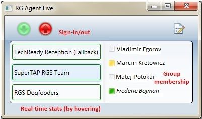

# <a name="skype-for-business-server-2015-resource-kit-tools-documentation"></a>Skype for Business Server 2015 资源管理包工具文档

本主题介绍 Skype for Business Server 2015 资源工具包中的工具，包括每个工具的用途以及它的使用示例。 Skype for Business Server 2015 资源工具包可帮助部署和管理 Skype for business Server 2015 的 IT 管理员更轻松地执行日常任务。 例如，**Web Conf Data** 工具可用于轻松控制召开联机会议期间用户上载的数据。 **SEFAUtil** 工具可用于为用户设置代理人呼叫转接和应答。 我们鼓励 IT 管理员使用这些工具更有效地管理 Skype for Business Server 2015。

## <a name="installation-of-the-resource-kit-tools"></a>安装资源管理包工具

若要安装 Skype for Business Server 2015 资源工具包，请从下载中心下载[OCSReskit](https://www.microsoft.com/en-us/download/details.aspx?id=52631) 。

运行 **OCSResKit.msi** 以执行简单安装。.msi 将在以下路径中安装所有工具：**%Program Files%\Skype for Business Server 2015\ResKit**。属于自包含可执行文件的工具位于此文件夹中。还具有支持文件的工具位于其自己的子文件夹中。

## <a name="supported-environments"></a>支持的环境

Skype for Business Server 2015 资源工具包应安装在满足 Skype for business Server 2015 所需规范（通常用于运行 Skype for Business 服务器2015）的服务器上。

## <a name="resource-kit-tools-overview"></a>资源管理包工具概述

下面是 Skype for Business Server 2015 资源工具包中提供的工具列表。 以下各节涵盖每个工具的描述（包括要求和示例用法）。

- [ABSConfig](resource-kit-tools.md#ABSConfig)

- [带宽策略服务监视器](resource-kit-tools.md#bpsm)

- [带宽用量分析器](resource-kit-tools.md#bua)

- [呼叫寄存时间记录器](resource-kit-tools.md#callpark)

- [DBAnalyze](resource-kit-tools.md#dba)

- [导入存储服务数据](resource-kit-tools.md#Issd)

- [LCSSync](resource-kit-tools.md#LCSSync)

- [查找用户控制台](resource-kit-tools.md#LUC)

- [MsTurnPing](resource-kit-tools.md#MsTurnPing)

- [网络配置查看器](resource-kit-tools.md#NCV)

- [响应组代理实时](resource-kit-tools.md#RGAL)

- [SEFAUtil](resource-kit-tools.md#SEFAUtil)

- [SYSPrep.ps1](resource-kit-tools.md#SYSPrep)

- [未分配号码通知迁移](resource-kit-tools.md#UNAM)

- [Web Conf Data](resource-kit-tools.md#WebConfData)

## <a name="absconfig"></a>ABSConfig
<a name="ABSConfig"> </a>

通讯簿服务配置工具（ABSConfig）是一种管理工具，可帮助管理员自定义 Skype for Business Server 2015 中的通讯簿服务配置。 此工具还支持 Skype for Business Server 2015 管理员还原默认通讯簿服务设置。

### <a name="description"></a>说明

ABSConfig 是一种图形用户界面应用程序，使管理员能够配置与通讯簿服务相关的 Active Directory 域服务属性。

该工具的主要方案如下所示：

- 使管理员能够将 Active Directory 域服务中的属性映射到 Skype for business Server 2015 的属性。

- 使管理员能够指定要在通讯簿服务文件中包括或排除的 Active Directory 域服务属性。

- 使管理员能够还原默认通讯簿服务设置。

可以使用 ABSConfig.exe 文件启动 ABSConfig 工具。 该工具将打开 "**配置属性**" 选项卡。此表具有将 Active Directory 域服务属性映射到 Skype for business Server 2015 的属性字段的选项，并指定哪些用户在通讯簿服务文件中基于特定的属性筛选器包括或排除这些属性。 它还具有用于自定义在通讯簿文件中包括电话号码的哪个值的选项。 “**还原默认值**”选项使管理员能够将通讯簿服务设置还原为默认值。

> [!NOTE]
> 将广告属性重新映射到不同的 OC 字段名称仅适用于通讯簿文件下载，并且不受通讯簿 Web 查询支持。

### <a name="output"></a>输出

ABSConfig 将通讯簿服务配置存储在数据库中。

```PowerShell
Path: %ProgramFiles%\Skype for Business Server 2015\Reskit
```

### <a name="purpose"></a>用途

ABSConfig 提供了一种快速简便的自定义 Skype for Business Server 2015 通讯簿服务的方法。

### <a name="requirements"></a>要求

#### <a name="computer"></a>计算机

ABSConfig 只能从安装了 Skype for business Server 2015 的加入域的计算机运行。 对于 Skype for Business Server 2015，企业版，此工具可在安装期间启用了通讯簿服务的任何前端服务器上运行。

#### <a name="network"></a>网络

计算机应能够连接到前端池和后端数据库。

#### <a name="software"></a>软件

在运行 ABSConfig 工具之前，必须安装以下软件组件：

- Skype for Business Server 2015

#### <a name="users"></a>用户

拥有更新 Skype for Business Server 2015 部署所需权限的管理员。

### <a name="examples"></a>示例

可以通过在命令提示符中键入 **ABSConfig.exe** 来启动 ABSConfig。ABSConfig 工具用户界面如下所示。


### <a name="summary"></a>摘要

ABSConfig 工具为管理员提供了一种快速易用的工具，可用于自定义 Skype for Business Server 2015 通讯簿服务。

## <a name="bandwidth-policy-service-monitor"></a>带宽策略服务监视器
<a name="bpsm"> </a>

带宽策略服务监视器工具旨在使管理员能够查看以下内容的列表：

1. 拓扑中所有已配置的 Skype for business Server 2015 带宽策略服务（身份验证和核心）

2. 每个服务与其他带宽策略服务和边缘服务器的连接

3. 网络配置文档中配置的所有链路以及每个带宽策略服务报告的实时带宽使用量

### <a name="description"></a>说明

带宽策略服务监视器工具作为基于 GUI 的应用程序进行实施。管理员可通过运行 PDPMonUI.exe 启动该工具。

当该工具启动时，它将尝试发现拓扑中的带宽策略服务列表。完成初始更新之后，窗口左侧的窗格将填充服务列表，其中的服务按其所属的群集进行分组。

当管理员选择特定带宽策略服务时，右侧的窗格将显示有关该特定服务的信息。该窗格还包含两个可显示信息的主选项卡。

#### <a name="machine-info-tab"></a>“计算机信息”选项卡

“**计算机信息**”选项卡显示所选带宽策略服务的详细信息以及所选带宽策略服务与其他服务建立的连接的列表和状态。

#### <a name="topology-info-tab"></a>“拓扑信息”选项卡

“**拓扑信息**”选项卡显示在网络配置设置中配置的所有链路的列表。对于每个链路，显示音频和视频带宽容量。此外，以 Kbps 和容量百分比形式显示当前利用的带宽。该工具使用颜色编码突出显示利用率接近容量的链路，这使得管理员可快速隔离此类链路。

> [!NOTE]
>  如果带宽策略服务监视器工具在连接到任何配置的带宽策略服务时遇到故障，将不会填充**计算机信息**和**拓扑信息**选项卡中的信息。 但是，该工具可能最初连接成功，后来却断开与服务的连接。 在这种情况下，管理员可能会看到过时的信息。 每个选项卡上会显示“**上次更新时间**”时间戳，管理员可以通过该时间戳查看特定带宽策略服务的数据的上次更新时间。

### <a name="output"></a>输出

没有命令行输出；程序输出包含在主图形用户界面 (GUI) 中。

### <a name="purpose"></a>用途

带宽策略服务监视器工具旨在使管理员能够查看拓扑中定义的每个带宽策略服务的状态。此外，管理员可以查看网络配置文档中定义的所有链路的实时带宽用量。

### <a name="requirements"></a>要求

带宽策略服务监视器工具需要在属于 Skype for Business 服务器拓扑的计算机上运行。

### <a name="summary"></a>摘要

带宽策略服务监视器工具对于管理员而言是一项宝贵资源，通过该工具，管理员可以检查拓扑中所有带宽策略服务的状态，更重要的是，他们可以获取网络配置设置中定义的链路的实时带宽用量。

## <a name="bandwidth-utilization-analyzer"></a>带宽用量分析器
<a name="bua"> </a>

带宽用量分析器工具可创建有关企业网络中各个 WAN 链路上 UC 端点的带宽消耗的各种视图的报告。这些报告有助于了解当前带宽消耗模式以及进行带宽容量规划。

### <a name="description"></a>说明

带宽用量分析器作为基于 GUI 的应用程序进行实施。此工具可针对网络中的音频利用率生成特定报告，从而帮助进行容量规划。它还会循环访问分配给各个链路的带宽容量。

### <a name="output"></a>输出

带宽用量分析器可将系统中配置的所有 WAN 链路的带宽容量和音频利用率绘制成图形。

### <a name="purpose"></a>用途

在任何语音和视频部署中，监视和理解整个企业网络中媒体流量的带宽利用率趋势非常重要。 带宽用量分析器工具可让管理员达成该目标。 此工具可执行以下操作：

- 针对网络中的音频利用率生成特定报告

- 帮助更高效地进行容量规划并循环访问分配给各个链路的带宽容量

带宽用量分析器可将带宽容量和用量报告绘制成图形；如下所示：

- 企业网络中的所有 WAN 链路

- 按所选 WAN 链路进行筛选

- 按已超过链路容量的 WAN 链路进行筛选

- 按用量低于设置的带宽的 WAN 链路进行筛选

- 按已达到严重级别（带宽用量大于 WAN 链路带宽容量的 90%）的 WAN 链路进行筛选

- 按 WAN 链路类型（网络站点链路、区域间链路以及站点内链路）进行筛选

- 按网络区域进行筛选

#### <a name="applications"></a>应用程序

带宽用量分析器具有以下两个应用程序（工具）：

- **WanLinkLogCollector**此工具使其用户能够输入所需的信息。

- **BandwidthUtilizationAnalyzer .Xlsm** Microsoft Excel 电子表格软件报表由 WanLinkLogCollector 自动启动。 此应用程序允许用户将筛选器应用于报表，如本文后面部分所示。

#### <a name="phases-of-using-bandwidth-utilization-analyzer"></a>使用带宽用量分析器的各个阶段

使用带宽用量分析器时有两个阶段：

- 收集日志，使用 WanLinkLogCollector.exe 执行

- 自定义报告，使用 BandwidthUtilizationAnalyzer.xlsm 执行

> [!IMPORTANT]
> 强烈建议最终用户不要手动启动 BandwidthUtilizationAnalyzer.xlsm。

#### <a name="starting-bandwidth-utilization-analyzer"></a>启动带宽用量分析器

在命令提示符中或使用 Windows 资源管理器启动 WanLinkLogCollector.exe。

 **使用 WanLinkLogCollector.exe**

使用 WanLinkLogCollector.exe 有三个步骤：

1. **记录日程表**提供报表需要生成的日程表

2. **指定文件目录**提供文件位置信息

3. **收集日志并启动报表查看器**执行命令以生成报表

#### <a name="step-1---log-the-timeline"></a>步骤 1 - 记录日程表

通过记录日程表，工具用户可以指定下图所示的信息。

1. **开始日期** - 表示要为其生成报告的日程表的开始日期，例如 2010 年 8 月 1 日。

2. **结束日期** - 表示要为其生成报告的日程表的结束日期，例如 2010 年 9 月 30 日。

     

#### <a name="step-2---specify-the-file-directories"></a>步骤 2 - 指定文件目录

用户可指定如下所示的文件目录。

- **服务器日志文件位置**存储带宽策略服务器日志的文件夹位置。 这通常位于 " \<\> \\<" FE\>\AppServerFiles\PDP. 选择中

- **临时文件存储位置**生成报表时存储中间文件的临时文件位置。


> [!NOTE]
> 确保向工具用户提供对服务器日志和临时文件存储文件夹足够的文件访问权限。

#### <a name="step-3---collect-the-logs-and-start-the-report-viewer"></a>步骤 3 - 收集日志并启动报告查看器

要收集日志并启动报告查看器，请单击如下所示的“**执行**”。此步骤收集所需的数据。


当输入验证成功时，将显示下面所示的消息。


单击“**确定**”。BandwidthUtilizationAnalyzer.xlsm 会自动启动。按照消息框中的说明进行操作。有关详细信息，请参阅下一节中的“**使用 BandwidthUtilizationAnalyzer.xlsm**”。


### <a name="using-bandwidthutilizationanalyzerxlsm"></a>使用 BandwidthUtilizationAnalyzer.xlsm

1. 当 BandwidthUtilizationAnalyzer.xlsm 自动启动时，单击如下所示的“**刷新**”。

     

2. 打开文件夹时，请从如下所示的消息框中指定的位置中选择 consolidated.csv。它也将位置显示为 **C:\Temp**。

     

3. 单击“**导入**”。

4. 将自动生成绘图。当在后台工作的指针消失时，它便可用。

     

#### <a name="applying-filters-to-the-report-view"></a>对报告视图应用筛选器

下面介绍了可对如下所示的报告视图应用的筛选器：


1. **名称** - 按 WAN 链路进行筛选（筛选器位于图形右侧）。前缀表示以下链路类型，请查看垂直（蓝色）框：

   - **S Site** - 从网络站点到网络区域的 WAN 链路

   - **IS Inter-Site** - 两个网络站点之间的 WAN 链路

   - **R Inter-Region** - 两个网络区域之间的 WAN 链路

2. **超出限制** - 按带宽用量超过带宽容量的 WAN 链路进行筛选

3. **严重级别** - 按带宽用量已达到 90% 或超过带宽容量的 WAN 链路进行筛选

4. **利用不足** - 按带宽用量少于带宽容量的 25% 的 WAN 链路进行筛选

5. **链路类型** - 按以下 WAN 链路类型进行筛选：

   - **网络站点**类型

   - **站点间**类型

   - **区域间链路**类型

6. **区域** - 按网络区域进行筛选

以下图显示了上述筛选器。

按**名称**进行筛选。选择需要在图形中显示的链路的列表。


按**超出限制**进行筛选。 选择 **True** 可强制实施筛选器。


按**严重级别**进行筛选。 选择 **True** 可强制实施筛选器。


按**利用不足**进行筛选。 选择 **True** 可强制实施筛选器。


按**链路类型**进行筛选。 选择需要显示的类型。


按**区域**进行筛选。 选择需要显示其链路的区域的列表。


### <a name="requirements"></a>要求

- .NET Framework 3.5

- Microsoft Excel 2010 或 Excel 2007

### <a name="summary"></a>摘要

带宽用量分析器用于将网络中 UC 流量的音频带宽用量绘制成图形。此工具也可用于报告网络上的视频带宽用量。

## <a name="call-parkometer"></a>呼叫寄存时间记录器
<a name="callpark"> </a>

呼叫寄存时间记录器是一个命令行应用程序，可让用户轻松访问呼叫寄存轨道数据库。

### <a name="description"></a>说明

呼叫寄存时间记录器工具可跟踪当前寄存的呼叫。 它还可收集有关轨道和呼叫寄存服务器 (CPS) 使用情况的统计信息。 此命令行工具提供对本地或远程连接的计算机上的 CPS 轨道 SQL Server 数据库的读和写访问。

所有选项相互排斥。 命令行语法如下所示：

- **-o**参数-列出为此池配置的所有轨道范围。

- **-n**参数-列出此池中所有当前使用的 "轨道式"。 显示的信息如下所示：

  - 呼叫被寄存者和寄存者的 SIP 统一资源标识符 (URI)。

  - 在其中寄存呼叫的 CPS 的主机名。

  - 寄存呼叫时的时间戳。

- **-f**参数-列出池中当前空闲的轨道式的数量。

- **-r \<n\> **参数-列出\<n\>个上次寄存的呼叫。 显示的信息如下所示：

  - 呼叫被寄存者的 SIP URI。

  - 呼叫寄存者的 SIP URI。

  - 在其中寄存呼叫的 CPS 的主机名。

  - 取回或丢弃呼叫时的时间戳。

- **-t\<n\> **参数-测试在数据库中保留轨道，以显示分配的轨道编号的随机性。

### <a name="output"></a>输出

根据在命令提示符中指定的输入参数，呼叫寄存时间记录器显示以下输出：

- 为此池配置的所有轨道范围

- 当前寄存的呼叫

- 可用轨道数

- 最近寄存的呼叫

- 保留用于测试统一和随机轨道值的轨道

### <a name="purpose"></a>用途

该 CPS 工具用于提供对 CPS 数据库的命令行访问。管理员可以查看 CPS 使用情况并确定分配给池的轨道数量。

### <a name="requirements"></a>要求

如果此工具在运行 CPS 的相同计算机上运行，则没有任何要求。 如果此工具在远程计算机上运行，则必须将 Skype for business Server 2015 使用的 SQL Server 数据库配置为允许远程访问。 必须使用 SQL Server 数据库连接字符串配置调用 Parkometer，以连接到池的 SQL Server。 此 SQL Server 数据库连接字符串在配置文件**parkometer**中定义。它必须放置在 parkometer 所在的同一目录中。 以下 XML 文件是 parkometer 的示例。必须配置的参数为用户名（例如，mydomain\Administrator）、密码（例如，mypassword）和主机名（例如 myserver）。

```xml
<?xml version="1.0" encoding="utf-8" ?>
<configuration>
  <appSettings>
   <add key="SQL" value="server=myserver\RTC;
database=cpsdyn;
User Id=mydomain\Administrator;
Password=mypassword.;
Integrated Security=false;"/>
  </appSettings>
</configuration>
```

### <a name="examples"></a>示例

已部署的轨道范围：-o 参数列出为此池配置的所有轨道范围，如图所示


当前停用的通话：-n 参数列出此池中所有当前使用的 "轨道式"，如下所示


自由轨道式的数量：-f 参数列出池中当前可用的轨道式的数目，如图所示


最近寄存的通话：-r \<n\>参数列出 n \<\>个最后寄存的呼叫，如下所示


测试轨道保留： t \<n\>参数测试在数据库中保留轨道，如下所示


### <a name="summary"></a>摘要

呼叫寄存时间记录器是一个命令行工具，可提供有关呼叫寄存服务器的详细信息。

## <a name="dbanalyze"></a>DBAnalyze
<a name="dba"> </a>

### <a name="description"></a>说明

DBAnalyze 是一种命令行工具，可帮助管理员收集有关 Skype for Business Server 2015 数据库的分析报告。 DBAnalyze 具有以下模式：诊断、用户数据、会议、MCU 和磁盘碎片：

- **诊断模式**创建一个报表，其中包含有关表的信息（记录数、碎片数、数据大小和索引大小、数据和日志文件大小、数据和日志文件大小、运行 Microsoft Office 通信服务器的服务器之间的联系人分布、每个用户的平均权限数、联系人、容器、订阅、发布、每位用户的平均权限数、无法路由的用户、计划的会议、计划的会议、活动的会议数据库版本。

    > [!NOTE]
    > 运行诊断模式可能会影响服务器性能。

- **用户数据模式**为指定用户或在其联系人和权限列表中拥有该用户的用户报告联系人、容器、订阅、发布、权限和联系人组数据。 此模式还报告用户组织或受邀参加的会议的摘要数据。

- **会议模式**报告特定会议的详细数据，包括会议的所有计划时间详细信息、被邀请者列表、会议所允许的媒体类型的列表、活动的 MCUs （multipoint control units）、活动参与者列表和每个参与者的信号状态。

- **解码会议 ID**解码由 **/pstnid**开关指定的公共交换电话网络（PSTN）会议 ID，但不连接到后端以了解详细信息。

- **解决会议**对由 **/pstnid**开关指定的 PSTN 会议 ID 进行解码，并显示由该 id 指示的会议的相关信息。

- **MCUs 模式**报告池中每个 MCU 的 ID、媒体类型、URL、检测信号状态、会议加载和参与者负载。

- **磁盘碎片模式**显示所有磁盘的碎片状态。

此工具可用于诊断各种问题或帮助管理员进行容量规划。例如，如果驻留在服务器 A 上的大多数用户选择驻留在服务器 B 上的用户作为其联系人，管理员可以将服务器 A 的用户移动到服务器 B，从而减少跨服务器流量。

### <a name="output"></a>输出

此工具输出有关 Skype for Business Server 2015 数据库的预定义报告。 **路径**：%ProgramFiles%\Skype for Business Server 2015\Reskit

### <a name="purpose"></a>用途

若要安装 Dbanalyze，请将其复制到本地文件夹，然后运行该工具。 若要使用该工具，请从命令行运行以下命令。 `dbanalyze.exe [/v] [/report:value] [/sqlserver:value] [/user:user@domain.com] [/conf:value][/pstnid:Value] [/maxcontacts:value]`命令行选项的说明如下所示。


### <a name="requirements"></a>要求

 **计算机**DBAnalyze 只能从安装了 Skype for business Server 2015 的加入域的计算机运行。

 **网络** - 计算机应能够连接到后端数据库。

 **软件**在运行 DBAnalyze 之前，必须安装 Skype for Business Server 2015 软件组件。

 **用户**下表显示了具有访问 Skype for Business Server 2015 数据库所需权限的管理员。


> [!NOTE]
> **/report:disk** 模式要求使用本地管理员帐户。

### <a name="examples"></a>示例

以下是有效 Dbanalyze.exe 命令的示例：

```
dbanalyze.exe /report:diag
dbanalyze.exe /report:user /user:usera@domainb.com
dbanalyze.exe /report:conf /user:bob@example.com /conf:1W9J71SKSX2X
dbanalyze.exe /report:resolve /pstnid:12345
dbanalyze.exe /report:mcus
dbanalyze.exe /report:disk
```

### <a name="summary"></a>摘要

DBAnalyzer 使管理员能够快速轻松地分析 Skype for business Server 2015 数据库。

## <a name="import-storage-service-data"></a>导入存储服务数据
<a name="Issd"> </a>

ImportStorageServiceData 资源管理包工具允许将已从存储服务 (LYSS) 刷出的队列和端点数据重新导入到存储服务中。

### <a name="description"></a>说明

可能已基于队列项目状态或数据库大小自动（定期）从存储服务刷出数据。 发生这种情形是因为手动调用了池故障转移 cmdlet 或 StorageServiceFullFlush cmdlet（由池故障转移 cmdlet 调用）。 请注意，如果前端的任何存储服务（LYSS）数据库大小均高于正常级别，则不应重新导入数据，因为这样做很可能只会导致更多数据要输出回来。此外，可能会首先解决导致存储服务队列增长的错误所产生的任何问题（例如 Exchange 终结点错误、网络问题或其他问题）。

 **方案 1**：池故障转移期间，每个前端的文件可能会从存储服务刷出。 故障转移完成之后，应运行该工具以重新导入数据。

 **方案 2**：数据每天自动刷新或者为响应超过特定大小阈值（例如 60%、80%、90%、已满）的存储服务数据库而自动刷新。 此自动刷新的数据应由管理员定期重新导入。 在上述情况下，如果未部署监视 SCOM 包，则存在与从存储服务刷新的数据相关的 Skype for business Server 存储服务事件。 事件 ID 为 32075（已启动完全刷新操作）、32076（已完成完全刷新）、32082（已启动维护级别刷新）、32083（已完成维护级别刷新）和 32089（由于数据库填满而刷新）。 请注意，这些事件 ID 对应于 RTM 版本。 当管理员看到这些事件时，这意味着有文件已被刷新。此数据应定期使用此工具（例如每周一次）导入。

对于联机服务版本，如果部署了适用于 Skype for Business 服务器的运行状况监视 SCOM 包，则可能会引发新的警报，要求管理员将刷新后的数据重新导入到存储服务中。 在触发警报的前端服务器上的事件日志中将存在相应的事件。 该事件将提供刷新数据文件所在的父路径的说明，以及有多少个文件可以满足警报条件。 警报条件是特定父路径下的 X 或更多文件，这些文件至少为最早的 Y 天（其中 X 和 Y 是在 StorageService 内预设置的，但可以通过更改 APPCONFIG 文件进行替代）。下面显示了可触发运行状况警报的事件的两个示例，区别在于它们的父路径。 其中一种可能性是 Web 服务文件共享，另一种可能性是每个前端的本地应用程序数据目录。 （例如 c:\ProgramData\Microsoft\Skype Business Server 2015 \ StorageService）。 管理员随后将运行此 reskit 工具。

此工具将增加其运行于的前端服务器以及其他前端服务器（如果在其上面执行此工具的前端服务器不拥有数据）的 CPU 和 IO 负载。 建议在前端服务器的 CPU 和 IO 负载不太繁重时运行此工具，例如非高峰时间。 其次，此工具 2 到 3 分钟可导入一个数据文件。 估算此工具的运行时间时必须谨记这一点。 默认情况下，此工具生成的详细日志文件显示在文件存储上。 如果未报告错误，请删除日志文件，因为日志文件的大小会增长到数十 MB 或以上。


### <a name="requirements"></a>要求

安装 Skype for Business Server 2015 资源工具包工具。 该工具在安装了 Skype for business 服务器和 Skype for business Server Management Shell 的已加入域的计算机上运行。 该工具使用来自管理外壳的 cmdlet 来标识池中的所有前端服务器。 其次，该工具必须从安装了**RtcLocal**数据库的池中的计算机执行。 此数据库由工具用于检索池的 WEBSERVICE 文件共享的位置。 此外，在使用该工具之前，每个前端服务器必须首先在每台前端服务器上使用**enable-PSRemoting**以及执行该工具的计算机上启用 Windows PowerShell 远程。 否则，此工具中的远程 Windows PowerShell 命令将失败。 在完成后，将在池中的所有前端服务器上关闭 Windows PowerShell 远程处理。 最后，调用该工具的帐户或凭据必须具有对其执行此工具的池的 webservice 文件共享的读/写权限。 否则，该工具将无法正常工作，并出现 IO 权限错误。

> [!NOTE]
> 在 Windows Server 2012 上，Windows PowerShell 远程处理在默认情况下处于启用状态，而不是在 Windows Server 2008 操作系统上启用。

### <a name="examples"></a>示例

```
>  C:\StorageService>ImportStorageServiceData.exe
Description:
This tool will re-import Storage Service (LYSS) flushed queue data back in.  For a pool: you are required to run this tool on a machine inside the pool which has the Lync Server Management Shell installed.  Additionally, all front end machines need to have Windows Powershell Remoting enabled before executing this tool by executing Enable-PSRemoting.  Also, please ensure that all Storage Service instance DB Size are at the 'Normal' level (verify this by viewing Eventlog events). Otherwise re-importing may cause data to be flushed out again if any Storage Service instance DB size level goes above 'Normal'.
Usage: Default behavior is to Import data from web service file share as well as any files on all Front End machines in pool.
Additional Options:
-Verbose                    : Turn verbose output on.

-StorageServiceHostName     : Host Name of Storage Service WCF endpoint.  ( Default=localhost netnamedpipe binding. )

-FileSharePath              : Import only all data from just under the UNC path specified.

ActivityID: cc3b62ff-bb66-4e61-a6e2-96cb3626315c. <-- Use this to correlate with StorageService trace logs if troubleshooting.
Type Server name (TCP binding) or press <enter> for localhost (NamePipe binding):
Using NetNamedPipeBinding...
OnTopologyChanged Event received
Web Service File Share: \\dc.vdomain.com\OcsFileStore\co1-WebServices-1\StorageService

Front Ends:
server.vdomain.com
server2.vdomain.com
server1.vdomain.com
server3.vdomain.com
Looking under directory: \\dc.vdomain.com\OcsFileStore\co1-WebServices-1\StorageService for exported data.
# Files found: 8
Starting Import for file:\\dc.vdomain.com\OcsFileStore\co1-WebServices-1\StorageService\DataExport\2
0120910\SERVER.vdomain.com\944f5724c65c5f93900dc1c8c898b102__0.xml
Items deserialized: 20

All items in file were enqueued successfully, will try to delete file: \\dc.vdomain.com\OcsFileStore\co1-WebServices-1\StorageService\DataExport\20120910\SERVER.vdomain.com\944f5724c65c5f93900dc1c8c898b102__0.xml

All items in file failed to enqueue so file will not be deleted.  File path: \\dc.vdomain.com\OcsFileStore\co1-WebServices-1\StorageService\DataExport\20120910\SERVER.vdomain.com\944f5724c65c5f93900dc1c8c898b102__0.xml

Summary for file \\dc.vdomain.com\OcsFileStore\co1-WebServices-1\StorageService\DataExport\20120910\SERVER.vdomain.com\944f5724c65c5f93900dc1c8c898b102__0.xml: succeeded: 20, failed: 0

Starting Import for file:\\dc.vdomain.com\OcsFileStore\co1-WebServices-1\StorageService\DataExport\20120910\SERVER1.vdomain.com\17d5435ae40259f7bbdf1866776386e4__0.xml
Items deserialized: 20

[cc3b62ff-bb66-4e61-a6e2-96cb3626315c] Send EnqueueMessages to redirected, targetServer=server1.vdomain.com, queueItems=20

All items in file were enqueued successfully, will try to delete file: \\dc.vdomain.com\OcsFileStore\co1-WebServices-1\StorageService\DataExport\20120910\SERVER1.vdomain.com\17d5435ae40259f7bbdf1866776386e4__0.xml

All items in file failed to enqueue so file will not be deleted.  File path: \\dc.vdomain.com\OcsFileStore\co1-WebServices-1\StorageService\DataExport\20120910\SERVER1.vdomain.com\17d5435ae40259f7bbdf1866776386e4__0.xml

Summary for file \\dc.vdomain.com\OcsFileStore\co1-WebServices-1\StorageService\DataExport\20120910\
SERVER1.vdomain.com\17d5435ae40259f7bbdf1866776386e4__0.xml: succeeded: 20, failed: 0

Starting Import for file:\\dc.vdomain.com\OcsFileStore\co1-WebServices-1\StorageService\DataExport\20120910\SERVER1.vdomain.com\904f6c9b8ac951ae8b3c86684d3832e4__0.xml

Items deserialized: 20
[cc3b62ff-bb66-4e61-a6e2-96cb3626315c] Send EnqueueMessages to redirected, targetServer=server1.vdomain.com, queueItems=20

All items in file were enqueued successfully, will try to delete file: \\dc.vdomain.com\OcsFileStore
\co1-WebServices-1\StorageService\DataExport\20120910\SERVER1.vdomain.com\904f6c9b8ac951ae8b3c86684d
3832e4__0.xml

All items in file failed to enqueue so file will not be deleted.  File path: \\dc.vdomain.com\OcsFil
eStore\co1-WebServices-1\StorageService\DataExport\20120910\SERVER1.vdomain.com\904f6c9b8ac951ae8b3c
86684d3832e4__0.xml

Summary for file \\dc.vdomain.com\OcsFileStore\co1-WebServices-1\StorageService\DataExport\20120910\
SERVER1.vdomain.com\904f6c9b8ac951ae8b3c86684d3832e4__0.xml: succeeded: 20, failed: 0

Starting Import for file:\\dc.vdomain.com\OcsFileStore\co1-WebServices-1\StorageService\DataExport\2
0120910\SERVER2.vdomain.com\69844a271e6c5633a1f2b46a42287dd6__0.xml

Items deserialized: 20

[cc3b62ff-bb66-4e61-a6e2-96cb3626315c] Send EnqueueMessages to redirected, targetServer=server2.vdom
ain.com, queueItems=20

All items in file were enqueued successfully, will try to delete file: \\dc.vdomain.com\OcsFileStore
\co1-WebServices-1\StorageService\DataExport\20120910\SERVER2.vdomain.com\69844a271e6c5633a1f2b46a42
287dd6__0.xml

All items in file failed to enqueue so file will not be deleted.  File path: \\dc.vdomain.com\OcsFil
eStore\co1-WebServices-1\StorageService\DataExport\20120910\SERVER2.vdomain.com\69844a271e6c5633a1f2
b46a42287dd6__0.xml

Summary for file \\dc.vdomain.com\OcsFileStore\co1-WebServices-1\StorageService\DataExport\20120910\
SERVER2.vdomain.com\69844a271e6c5633a1f2b46a42287dd6__0.xml: succeeded: 20, failed: 0

Starting Import for file:\\dc.vdomain.com\OcsFileStore\co1-WebServices-1\StorageService\DataExport\2
0120910\SERVER3.vdomain.com\3313935458e35b9b9759e08a15d251e6__0.xml

Items deserialized: 20

[cc3b62ff-bb66-4e61-a6e2-96cb3626315c] Send EnqueueMessages to redirected, targetServer=server3.vdom
ain.com, queueItems=1

All items in file were enqueued successfully, will try to delete file: \\dc.vdomain.com\OcsFileStore
\co1-WebServices-1\StorageService\DataExport\20120910\SERVER3.vdomain.com\3313935458e35b9b9759e08a15
d251e6__0.xml

All items in file failed to enqueue so file will not be deleted.  File path: \\dc.vdomain.com\OcsFil
eStore\co1-WebServices-1\StorageService\DataExport\20120910\SERVER3.vdomain.com\3313935458e35b9b9759
e08a15d251e6__0.xml

Summary for file \\dc.vdomain.com\OcsFileStore\co1-WebServices-1\StorageService\DataExport\20120910\
SERVER3.vdomain.com\3313935458e35b9b9759e08a15d251e6__0.xml: succeeded: 20, failed: 0

Starting Import for file:\\dc.vdomain.com\OcsFileStore\co1-WebServices-1\StorageService\DataExport\2
0120910\SERVER3.vdomain.com\4501e04eae4856059346949ff817c220__0.xml
Items deserialized: 20
[cc3b62ff-bb66-4e61-a6e2-96cb3626315c] Send EnqueueMessages to redirected, targetServer=server3.vdom
ain.com, queueItems=1
All items in file were enqueued successfully, will try to delete file: \\dc.vdomain.com\OcsFileStore
\co1-WebServices-1\StorageService\DataExport\20120910\SERVER3.vdomain.com\4501e04eae4856059346949ff8
17c220__0.xml
All items in file failed to enqueue so file will not be deleted.  File path: \\dc.vdomain.com\OcsFil
eStore\co1-WebServices-1\StorageService\DataExport\20120910\SERVER3.vdomain.com\4501e04eae4856059346
949ff817c220__0.xml

Summary for file \\dc.vdomain.com\OcsFileStore\co1-WebServices-1\StorageService\DataExport\20120910\
SERVER3.vdomain.com\4501e04eae4856059346949ff817c220__0.xml: succeeded: 20, failed: 0
Starting Import for file:\\dc.vdomain.com\OcsFileStore\co1-WebServices-1\StorageService\DataExport\2
0120910\SERVER3.vdomain.com\5ad77443ad955a22a876749be66d5317__0.xml

Items deserialized: 20
[cc3b62ff-bb66-4e61-a6e2-96cb3626315c] Send EnqueueMessages to redirected, targetServer=server3.vdom
ain.com, queueItems=20
All items in file were enqueued successfully, will try to delete file: \\dc.vdomain.com\OcsFileStore
\co1-WebServices-1\StorageService\DataExport\20120910\SERVER3.vdomain.com\5ad77443ad955a22a876749be6
6d5317__0.xml
All items in file failed to enqueue so file will not be deleted.  File path: \\dc.vdomain.com\OcsFil
eStore\co1-WebServices-1\StorageService\DataExport\20120910\SERVER3.vdomain.com\5ad77443ad955a22a876
749be66d5317__0.xml
Summary for file \\dc.vdomain.com\OcsFileStore\co1-WebServices-1\StorageService\DataExport\20120910\
SERVER3.vdomain.com\5ad77443ad955a22a876749be66d5317__0.xml: succeeded: 20, failed: 0
Starting Import for file:\\dc.vdomain.com\OcsFileStore\co1-WebServices-1\StorageService\DataExport\2
0120910\SERVER3.vdomain.com\a11e27ae439a582288d4657eda86b565__0.xml
Items deserialized: 20
[cc3b62ff-bb66-4e61-a6e2-96cb3626315c] Send EnqueueMessages to redirected, targetServer=server3.vdom
ain.com, queueItems=20
All items in file were enqueued successfully, will try to delete file: \\dc.vdomain.com\OcsFileStore
\co1-WebServices-1\StorageService\DataExport\20120910\SERVER3.vdomain.com\a11e27ae439a582288d4657eda
86b565__0.xml
All items in file failed to enqueue so file will not be deleted.  File path: \\dc.vdomain.com\OcsFil
eStore\co1-WebServices-1\StorageService\DataExport\20120910\SERVER3.vdomain.com\a11e27ae439a582288d4
657eda86b565__0.xml
Summary for file \\dc.vdomain.com\OcsFileStore\co1-WebServices-1\StorageService\DataExport\20120910\
SERVER3.vdomain.com\a11e27ae439a582288d4657eda86b565__0.xml: succeeded: 20, failed: 0
All files have been imported into Storage Service for path: \\dc.vdomain.com\OcsFileStore\co1-WebSer
vices-1\StorageService
Importing files for: server.vdomain.com
No files founds.
Importing files for: server2.vdomain.com
No files founds.
Importing files for: server1.vdomain.com
No files founds.
Importing files for: server3.vdomain.com
No files founds.
Writing log: \\dc.vdomain.com\OcsFileStore\co1-WebServices-1\StorageService\ImportStorageServiceData
Log20120910_1609SS
Tool has finished execution.
>  C:\StorageService>
```

## <a name="lcssync"></a>LCSSync
<a name="LCSSync"> </a>

LCSSync 工具有助于在多林环境中部署 Skype for Business Server 2015 通信软件。 此工具用于将不同用户林的用户和组作为 Active Directory 域服务联系人对象同步到安装了 Skype for Business Server 2015 的中央林。

### <a name="description"></a>说明

 LCSSync 使用中央林中的同步 Active Directory 域服务联系人对象为 Skype for business 服务器启用用户。 若要提供单一登录，主要用户帐户必须映射到 Skype for business Server 2015 的中央林中的 Active Directory 域服务联系人对象。 此工具可帮助执行该映射。 此工具提供用于在 Microsoft Identity Integration Server 中创建管理代理的模板。

### <a name="summary"></a>摘要

LCSSync 工具有助于在多林环境中部署 Skype for Business Server 2015。

## <a name="lookup-user-console"></a>查找用户控制台
<a name="LUC"> </a>

LookupUserConsole 工具显示有关特定用户的内部 Skype for business 服务器路由信息。 Microsoft 支持人员可使用此信息来诊断部署问题和路由问题。

### <a name="description"></a>说明

 执行 LookupUserConsole 将打开一个命令提示符，该命令提示符接受 SIP 地址并尝试显示与它们相关的内部 Skype for Business 服务器路由信息。 键入 **exit** 可退出 LookupUserConsole 工具。

### <a name="requirements"></a>要求

安装 Skype for Business Server 2015 资源工具包。 该工具在安装了 Skype for Business 服务器的已加入域的计算机上运行。

### <a name="examples"></a>示例

C:\Program Files\Skype for Business Server 2015 \ ResKit\>LookupUserConsole

```
> sip:john.doe@vdomain.com

  Execution time (ms):                            171.094
  Exeuction result:                               Success
  SIP URI:                                        sip:john.doe@vdomain.com
  User info:
    SID:                                          S-1-5-21-2831376166-29632525...    Display name:                                     John Doe
    Grouping ID:                                  00000000-0000-0000-0000-...
    Line URI:                                     <null>
    Policy assignment:                            TenantId={00000000--0000-000....
    SIP enabled:                                  True
    UC enabled:                                   False
    Tenant ID:                                    00000000-0000-0000-0000-...  Cluster info:
    Active cluster:                               pool0.vdomain.com
    Backup registrar cluster:                     <null>
    Deployment location:                          <null>
    Home Front-End FQDN:                          SERVER.vdomain.com
    Primary Registrar cluster:                    pool0.vdomain.com
    Remote Director external SIP FQDN:            <null>
    Remote Director internal SIP FQDN:            <null>
    Remote Director Web FQDN:                     <null>
    Routing group ID:                             4501e04e-ae48-5605-9346...
    Service tag ID:                               1266953005
    User Front-End resolved:                      True
    User in local forest:                         True
    User in remote forest:                        False
    User in split domain:                         False
    User-Services cluster:                        pool0.vdomain.com

> sip:nouser@vdomain.com

  Execution time (ms):                            948.7574
  Exeuction result:                               UserDoesNotExist

> exit
```

## <a name="msturnping"></a>MsTurnPing
<a name="MsTurnPing"> </a>

MSTurnPing 工具允许 Skype for Business Server 2015 通信软件的管理员检查运行音频/视频边缘和音频/视频身份验证服务的服务器的状态，以及拓扑中运行带宽策略服务的服务器的状态。

### <a name="description"></a>说明

MSTurnPing 工具允许 Skype for Business Server 2015 通信软件的管理员检查运行音频/视频边缘和音频/视频身份验证服务的服务器的状态，以及拓扑中运行带宽策略服务的服务器的状态。

该工具使管理员能够执行以下测试：

1. A/V 边缘服务器测试：该工具通过执行以下操作来对拓扑中的所有 A/V 边缘服务器执行测试：

   - 验证 Skype for Business Server 音频/视频身份验证服务是否已启动，并且是否可以发出正确的凭据。

   - 验证 Skype for business Server 音频/视频边缘服务是否已启动，是否可以成功分配外部边缘的资源。

2. 带宽策略服务测试：该工具通过执行以下操作来对运行带宽策略服务的所有服务器执行测试：

   - 验证 Skype for Business Server 带宽策略服务（身份验证）是否已启动，并且是否可以颁发正确的凭据。

   - 验证 Skype for business Server 带宽策略服务（Core）是否已启动，并且是否可以成功执行带宽检查。

必须从属于拓扑的一部分并且安装了本地存储的计算机运行此工具。

### <a name="output"></a>输出

该工具会输出每个操作的结果。

- 如果执行了 **AudioVideoEdgeServer** 测试，则工具输出为以下内容：

  - 在拓扑中提供 Skype for Business Server 2015 音频/视频身份验证服务的计算机的测试结果

  - 在拓扑中提供 Skype for Business Server 2015 音频/视频边缘服务的计算机的测试结果

- 如果执行了 **BandwidthPolicyServer** 测试，则工具输出为以下内容：

  - 在拓扑中提供 Skype for Business Server 2015 带宽策略服务（身份验证）的计算机的测试结果

  - 在拓扑中提供 Skype for Business Server 2015 带宽策略服务（Core）的计算机的测试结果

### <a name="requirements"></a>要求

- 必须从拓扑中具有本地存储的计算机运行此工具。

- 必须以具有本地存储的访问权限的管理员身份运行该工具。

### <a name="examples"></a>示例

以下是工具输入的示例。

```
MsTurnPing -ServerRole AudioVideoEdgeServer

MsTurnPing -ServerRole BandwidthPolicyServer
```

### <a name="summary"></a>摘要

对于希望检查运行音频/视频和带宽策略服务的服务器状态的 Skype for business Server 2015 管理员而言，此工具可以是一种有价值的资源。

## <a name="network-configuration-viewer"></a>网络配置查看器
<a name="NCV"> </a>

Skype for Business Server 2015 通信软件管理员可使用网络配置查看器查看配置为允许实时通信会话的企业的呼叫许可控制（CAC）网络拓扑，例如根据指定带宽容量进行语音或视频通话。 Skype for Business Server 2015 管理员定义 CAC 策略，这些策略由使用 Skype for Business Server 2015 安装的带宽策略服务强制执行。

### <a name="description"></a>说明

网络配置查看器 (NetworkConfigurationViewer.exe) 使管理员能够执行以下任务：

- 以图形格式从 Skype for Business Server 2015 部署加载和查看 CAC 网络拓扑。

- 以图形格式从带宽策略服务器日志文件中加载并查看 CAC 网络拓扑。

- 以 XML 格式在磁盘上保存和存储 CAC 网络拓扑。

- 以 JPG 或 BMP 格式保存和存储 CAC 网络拓扑图。

- 查看 CAC 网络拓扑配置数据。

- 以树视图样式查看 CAC 网络拓扑。

- 定义 CAC 网络拓扑链路（例如，站点到区域、区域到区域和站点到站点链路）的自定义连接器。

- 查看 CAC 网络拓扑站点信息、区域信息以及设置的带宽策略和网络链路。

### <a name="purpose"></a>用途

在图形界面中查看企业 CAC 网络拓扑链路。

### <a name="examples"></a>示例

 **以图形格式从 skype for Business server 2015 部署加载和查看 CAC 网络拓扑**： Skype For business server 2015 管理员可以使用 "**下载网络配置**" 选项在任何 Skype for business server 2015 计算机上加载和查看 cac 网络拓扑配置，如下图所示。 在未连接到 Skype for business Server 2015 配置存储的计算机上部署时，该工具将无法下载或查看此类配置。


 **以图形格式从带宽策略服务器日志文件加载和查看 CAC 网络拓扑：** Skype for Business Server 2015 带宽策略服务器将 CAC 网络拓扑保存为 Skype for Business Server 2015 文件共享位置下的日志记录机制的一部分。 Skype for Business Server 2015 管理员可以使用 "**打开网络配置**" 选项以图形格式查看此类文件，如下所示。


在磁盘上以 XML 格式保存和存储 CAC 网络拓扑： Skype for Business Server 2015 管理员可以通过使用 "**保存网络配置**" 选项的副本以 xml 格式保存 cac 网络拓扑配置文件，如下所示。 然后，可以脱机使用已保存的配置文件以图形格式进行查看。


以 JPG 或 BMP 格式保存和存储 CAC 网络拓扑图： Skype for Business Server 2015 管理员可以使用 "**将网络配置图表另存为图片**" 选项将 cac 网络拓扑配置保存为图形格式（JPG 和 BMP 文件格式），如下所示。


 <strong>查看 CAC 网络拓扑配置数据：</strong>Skype for Business Server 2015 管理员可以使用 "查看网络配置数据" 选项查看 "网络区域"、"网络站点"、"带宽配置文件" 和 "站点子网 IP 地址" 等相关网络配置数据，如下所示。


 **在树视图样式中查看 CAC 网络拓扑：** Skype for Business Server 2015 管理员可以使用工具窗口左侧的 "控制面板" 以图形树视图样式查看相关的网络配置数据，如下所示。


 **为 CAC 网络拓扑链接定义自定义连接器（如站点到区域、区域到区域和站点到站点链接）：** Skype for Business Server 2015 管理员可以使用 "设置" 选项定义 CAC 网络配置 WAN 链接的自定义图形连接线，如下所示。 这样做可帮助区分网络配置中设置的各种类型的网络链路。


 **查看 CAC 网络拓扑网站信息、区域信息和预配的带宽策略：** Skype for Business Server 2015 管理员可以使用下面所示的选项查看相关的 CAC 网络区域信息、网站信息和 CAC 带宽设置信息。 （例如，单击 "网络区域" 或 "网络网站" 对象中的 "**信息**"。）


### <a name="summary"></a>摘要

此工具可以是 Skype for Business Server 2015 管理员的重要资源，他们希望以图形形式查看其部署的 CAC 网络拓扑。

## <a name="response-group-agent-live"></a>响应组代理实时
<a name="RGAL"> </a>

响应组应用程序使代理能够使用其内置的 Web 服务访问有用的实时信息。 遗憾的是，在应用程序外部无法以图形格式查看此数据。 响应组代理实时资源工具包工具通过提供一种简单的图形方式来访问此信息，并通过实时 Skype for Business 通信软件信息（如其他代理的存在）进行了改进，从而解决了此问题。

### <a name="description"></a>说明

“响应组代理实时”是一个 Windows 应用程序，向响应组代理提供登录和注销功能以及一些实时信息（例如，组成员身份和当前的呼叫数）。 它应该是 "代理组" 页面的增强版本（可通过 Skype for Business 访问）。

### <a name="purpose"></a>用途

响应组应用程序将传入呼叫排入队列，然后将它们路由到代理组。为针对服务于哪些呼叫做出明智的决策，代理可以访问有关其代理组的实时信息，例如，其他哪些代理组可用以及每个队列中有多少呼叫正在等待。此信息最初只能通过响应组服务进行访问，现在由“响应组代理实时”以直观方式提供。

#### <a name="features"></a>功能

"响应组代理" 实时工具建立在 "响应组服务" 和 "Skype for Business 服务器 2015 SDK" 上。 它向响应组代理提供可从响应组服务访问的信息和功能（例如，组成员身份、其他代理的状态和正在等待的呼叫数）。

下图展示了“响应组代理实时”的主界面。



“响应组代理实时”为代理提供了以下三个主要功能：

- **登录/注销：** 与 "代理组" 页面（可从 Skype for Business 服务器2015访问）相反，响应组代理程序 "实时" 仅允许代理同时登录或注销所有代理组。 此应用程序提供了三种用于代理登录或注销的快速方法：

  - 单击应用程序中的登录/注销（绿色和红色）按钮。

  - 右键单击系统任务栏图标，然后选择登录或注销。

  - 使用可配置的键盘快捷方式。

- **组成员身份：** 如果选择了代理组，则响应组代理会实时在右窗格中显示此组中的代理列表。 如果 Skype for Business Server 2015 与此应用程序在同一台计算机上运行，则状态信息和联系人卡片将显示在 "响应组代理程序" 中。 代理可以直接从那里发送即时消息或呼叫其他代理。

- **实时统计信息**：“响应组代理实时”提供所有代理组的实时统计信息。更新频率为一分钟。当响应组应答呼叫时，将在组名称旁边添加一个可视指示器并显示队列中的当前呼叫数。此外，将指针暂停在某个组上方可显示最长等待时间。

### <a name="requirements"></a>要求

“响应组代理实时”需要 .NET Framework 4.0。 此外，要利用联机状态和联系人卡片功能，必须在本地安装（并运行） Skype for Business。

#### <a name="configuration"></a>配置

可以使用应用程序中的“选项”对话框根据个人偏好自定义“响应组代理实时”。此外，管理员可以通过直接编辑 RGAgentLive.exe.config 文件的 defaultHostAddress 属性来定义默认主机地址。

下图展示了“选项”对话框，代理可以使用此对话框配置主机地址和快捷键。可通过单击主界面右上角的“选项”按钮来访问此对话框。


可以在“响应组代理实时”配置中自定义以下三个不同设置：

- 主机地址：这通常是属于代理主池的 web 池 FQDN。 确切的响应组服务地址将在后台自动从此信息派生（在主机后面附加正确的路径）。

- 快捷方式：可以自定义登录/注销的确切快捷方式。 唯一的限制是，两个快捷方式都必须包含 "Windows 徽标" 键（除了至少一个密钥）。

- 与 Windows 一起启动：该应用程序可配置为自动与 Windows 一起启动。

### <a name="examples"></a>示例

下图展示了如何通过右键单击右窗格中的联系人来呼叫其他代理或向其他代理发送 IM。


下图展示了“响应组代理实时”如何显示队列中的当前呼叫数以及所有这些传入呼叫的最长等待时间。


### <a name="summary"></a>摘要

快速登录和注销、组成员身份和基本的实时统计信息是有趣的响应组代理功能，只能从响应组服务访问并在应用程序外部使用。 使用 "响应组代理" 实时资源工具包工具，Skype for Business Server 2015 管理员可以为其代理提供 Windows 应用程序，使其能够以更快的图形方式执行任务。

## <a name="sefautil"></a>SEFAUtil
<a name="SEFAUtil"> </a>

SEFAUtil （辅助扩展功能激活）是一个命令行工具，它使 Skype for Business Server 2015 通信软件管理员和支持人员可以配置代理响铃、呼叫转发、同时拨打工作组呼叫设置和代表 Skype for Business Server 2015 用户的组呼叫装货。 该工具还允许管理员查询为特定用户发布的呼叫路由设置。管理员可通过 SEFAUtil 工具启用/禁用/修改呼叫转接或同时拨打用户。 管理员可以指定目标（以 SIP URI 的形式）或使用已由用户发布的目标。 此工具还允许管理员代表用户添加或删除代理人或团队呼叫组成员。此工具基于 Microsoft 统一通信托管 API （UCMA）3.0 生成，并且要求管理员在 SEFAUtil 的中央管理存储中创建一个受信任的应用程序。

SEFAUtil （辅助扩展功能激活）使 Skype for Business Server 2015 管理员和支持人员的代理可以通过代表 Skype 来配置代理响铃、呼叫转接、同时拨打、团队呼叫设置和组呼叫。对于 Business Server 2015 用户。 此工具还使管理员能够查询为特定用户发布的呼叫路由设置。

### <a name="description"></a>说明

当前 SEFAUtil 版本仅仅是一个命令行工具；没有支持的图形用户界面。 此工具基于 Microsoft 统一通信托管 API （UCMA）3.0。 此工具中的功能使管理员和支持人员代理能够执行以下操作：

- 查看用户的所有呼叫路由设置（包括呼叫转接、委派、同时响铃、团队呼叫和组呼叫应答）

- 启用/禁用/修改呼叫转接设置（包括目标和无应答计时器）

- 启用/禁用/修改呼叫转接即时配置

- 启用/禁用/修改委派设置

- 启用/禁用/修改团队呼叫组设置

    > [!NOTE]
    > Skype for business Server 2015 SEFAUtil 工具新增版

- 启用/禁用/修改同时响铃设置（包括目标）

    > [!NOTE]
    > Skype for business Server 2015 SEFAUtil 工具新增版

- 启用/禁用/修改组呼叫应答设置

    > [!CAUTION]
    > Skype for business Server 2015 SEFAUtil 工具新增版

此工具存在以下限制：

- 仅支持驻留在 Skype for business 服务器池中的用户

- 不支持对多个用户的呼叫路由设置进行批量编辑

### <a name="output"></a>输出

此工具的当前版本仅在“命令提示符”窗口中提供输出。有关详细信息，请参阅本文档后面的“示例”部分。

### <a name="purpose"></a>用途

以下是此工具一些可能的主要应用场景：

- 王俊元是行政人员，已被移动到 Skype for business 服务器电话。 他在其现有 PBX 系统上设置了委派。 作为移动到 Skype for business 服务器2015的一部分，管理员可以配置 Bob 的路由以反映其预先存在的委派配置。

- Alice 正在出差，意识到她将收到一位客户的重要来电。然而，她住在酒店，没办法使用计算机。她致电支持人员，请求他们将拨打她的工作电话号码的所有呼叫转接到其移动电话号码。支持人员能够代表她执行该配置。

- 当用户在工作时，Joe 对他的工作号码的通话将转到手机上的语音邮件;但是，在大多数其他位置中似乎工作正常。 帮助台技术人员可以查看 Joe 的路由配置，并发现李先生已将来电配置为移动电话。 技术人员向 Joe 提出有关手机的移动范围的要求，并且能够确定同时拨打的规则是，当其网络覆盖范围较差时，将在 Joe 的手机语音邮件中导致呼叫。

- Mike 是 Contoso 的一名新员工，他加入了一个新团队，其中所有成员都针对团队呼叫进行了配置，在启用 Skype for business Server 2015 时，管理员可以将其团队呼叫组设置设置为包括所有新团队成员此外，管理员将 Mike 添加为团队中每个成员的团队呼叫组成员。

- Contoso 人力资源部门的一个客户服务做法是自第一个呼叫开始为所有呼叫者提供个性化服务。 倘若部门所有成员的就坐位置距离非常近，让所有电话与团队呼叫同时响铃会给团队造成极大干扰。 要在不中断团队成员的情况下提供最佳服务，Skype for business Server 2015 管理员将利用组呼叫的装货功能。 管理员将所有部门成员添加到一个应答组并告知他们应答组号码。 当 Samantha 不在座位上时，Joe 注意到其电话响铃，随后从自己的桌面应答呼叫。

### <a name="requirements"></a>要求

SEFAUtil 工具只能在属于受信任应用程序池的一部分的计算机上运行。必须在该计算机上安装 UCMA 3.0。要运行该工具，必须在该池上创建新的具有 SEFAUtil 应用程序 ID 的受信任应用程序。

### <a name="creating-a-new-trusted-application-for-the-sefautil-tool"></a>为 SEFAUtil 工具创建新的受信任应用程序

1. SEFAUTil 工具只能在属于受信任应用程序池的一部分的计算机上运行。 如果需要，可以通过 Skype for Business Server Management Shell 使用以下 cmdlet，将池添加为新的受信任的应用程序池：

   ```PowerShell
   New-CsTrustedApplicationPool -id <Pool FQDN> -Registrar <Pool Registrar FQDN> -site Site:<Pool Site>
   ```

    > [!NOTE]
    > 必须在将用于运行 SEFAUtil 工具的任何计算机上安装 UCMA 3.0。

2. 需要在拓扑中为 SEFAUtil 工具定义受信任的应用程序。 若要将 SEFAUtil 定义为新的受信任的应用程序，请使用 Skype for Business Server 命令行管理程序并执行以下 cmdlet：

   ```PowerShell
   New-CsTrustedApplication -ApplicationId sefautil -TrustedApplicationPoolFqdn <Pool FQDN> -Port 7489
   ```

    > [!NOTE]
    > 如果需要，可以使用其他端口。
    
    > [!NOTE]
    > 池 FQDN：将托管 SEFAUtil 应用程序的服务器或池的 FQDN （通常为 Skype for business 前端服务器 > 或池）。
    > 池注册机构 FQDN：与此应用程序池关联的 Skype for business 前端服务器或池的 FQDN。
    > 池网站：此池所驻留的网站的网站 ID。

3. 需要启用拓扑更改。 通过执行以下 cmdlet，启用拓扑更改可通过 Skype for Business Server Management Shell 执行：

   ```PowerShell
   Enable-CsToplogy
   ```

4. 如果需要，请在将用于运行 SEFAUtil 工具的服务器中安装 Skype for Business Server 2015 资源工具包工具（服务器必须是受信任的应用程序池的一部分）。

5. 验证 SEFAUtil 是否正常运行。 为此，请使用管理员特权从 Windows 命令提示符运行该工具，以显示部署中的用户的呼叫转接设置。 默认情况下，该工具位于： "..\Program Files\Skype for Business Server 2015 \ Reskit" 中。 要显示用户的呼叫转接设置，请使用以下命令：

   ```console
   SEFAUtil.exe <user SIP address> /server:<Skype for Business Server/Pool FQDN>
   ```

    应显示用户的呼叫转接设置。

#### <a name="group-call-pickup"></a>组内呼叫应答

组呼叫分拣需要在 Skype for Business Server 2015 中进行其他配置，才能完全启用该功能。 在向用户分配呼叫应答组之前，请参阅组呼叫应答产品文档，了解此功能的规划和部署步骤。

### <a name="examples"></a>示例

#### <a name="display-current-call-handling-settings"></a>显示当前呼叫处理设置

以下命令可显示用户的呼叫处理。  `SEFAUtil.exe /server:SfBS2015server.contoso.com katarina@contoso.com`

> [!NOTE]
> 此示例使用 **/server**开关指定要连接到的 Skype For business 服务器。

 **输出**

```output
User Aor: sip:katarina@contoso.com
Display Name: Katarina Larsson
UM Enabled: True
Simulring enabled: False
User Ring time: 00:00:20
Call Forward No Answer to: voicemail
```

#### <a name="set-the-call-forwardno-answer-destination"></a>设置呼叫转接/无应答目标

此示例设置呼叫转接/无应答目标和响铃延迟。 此处未提供/server 开关;SEFAUtil 将尝试自动发现 Skype for Business Server 2015。

```
SEFAUtil.exe /server:SfBserver.contoso.com sip:katarina@contoso.com /enablefwdnoanswer /callanswerwaittime:30 /setfwddestination:+1425555 0126@contoso.com;user=phone
```

 **输出**

```output
User Aor: sip:katarina@contoso.com
Display Name: Katarina Larsson
UM Enabled: True
Simulring enabled: False
User Ring time: 00:00:30
Call Forward No Answer to: sip:+14255550126@contoso.com;user=phone
```

#### <a name="enable-call-forwarding-immediately"></a>立即启用呼叫转接

此示例立即启用至其他用户的呼叫转接。

```
SEFAUtil.exe sip:katarina@contoso.com /enablefwdimmediate /setfwddestination:anders@contoso.com
```

 **输出**

```output
User Aor: sip:katarina@contoso.com
Display Name: Katarina Larsson
UM Enabled: True
Simulring enabled: False
Forward immediate to: sip:anders@contoso.com
```

#### <a name="disable-call-forwarding-immediately"></a>立即禁用呼叫转接

此示例立即禁用呼叫转接。

```
SEFAUtil.exe /server:SfBserver.contoso.com katarina@contoso.com  /disablefwdimmediate
```

 **输出**

```output
User Aor: sip:katarina@contoso.com
Display Name: Katarina Larsson
UM Enabled: True
Simulring enabled: False
User Ring time: 00:00:30
Call Forward No Answer to: voicemail
```

#### <a name="add-a-user-as-a-delegate-and-set-up-simultaneous-ringing-of-delegates"></a>将用户添加为代理人并设置代理人的同时响铃

此示例将用户添加为代理人并设置代理人的同时响铃。

```
SEFAUtil.exe /server:SfBserver.contoso.com sip:katarina@contoso.com /adddelegate:joe@contoso.com /simulringdelegates
```

 **输出**

```output
User Aor: sip:katarina@contoso.com
Display Name: Katarina Larsson
UM Enabled: True
Simultaneously Ringing Delegates: sip:joe@contoso.com
```

#### <a name="change-simultaneous-ringing-rule-of-delegates"></a>更改代理人的同时响铃规则

此示例将上一示例中设置的同时响铃规则更改为延迟的响铃规则。

```
SEFAUtil.exe /server:SfBserver.contoso.com sip:katarina@contoso.com /delayringdelegates:10
```

 **输出**

```output
User Aor: sip:katarina@contoso.com
Display Name: Katarina Larsson
UM Enabled: True
Simulring enabled: False
Delay Ringing Delegates (delay:10 seconds): sip:joe@contoso.com
```

#### <a name="remove-the-delegate"></a>删除代理人

此示例将删除代理人。

> [!NOTE]
> 删除了最后一个代理人后，代理人响铃将自动禁用。

```
SEFAUtil.exe /server:SfBserver.contoso.com sip:katarina@contoso.com /removedelegate:joe@contoso.com
```

 **输出**

```output
User Aor: sip:katarina@contoso.com
Display Name: Katarina Larsson
UM Enabled: True
Simulring enabled: False
User Ring time: 00:00:30
Call Forward No Answer to: voicemail
```

#### <a name="add-a-delegate-and-set-up-the-call-forward-to-delegates-rule"></a>添加代理人并设置代理人呼叫转接规则

此示例将添加代理人并设置代理人呼叫转接规则。

```
SEFAUtil.exe /server:SfBserver.contoso.com sip:katarina@contoso.com /adddelegate:anders@contoso.com /fwdtodelegates
```

 **输出**

```output
User Aor: sip:katarina@contoso.com
Display Name: Katarina Larsson
UM Enabled: True
Forwarding calls to Delegates: sip:anders@contoso.com
```

#### <a name="enable-simultaneous-ringing-and-set-a-destination-number"></a>启用同时响铃并设置目标号码

此示例将启用同时响铃并设置同时响铃目标号码。

```
SEFAUtil.exe /server:SfBserver.contoso.com sip:katarina@contoso.com /setsimulringdestination:+14255550126 /enablesimulring
```

> [!NOTE]
> 要更改已经启用了同时响铃的用户的同时响铃目标号码，请在命令中使用 /enablesimulring 开关，否则目标号码不会更改。

 **输出**

```output
User Aor: sip:katarina@contoso.com
Display Name: Katarina Larsson
UM Enabled: True
Simulring enabled: True
Simul_Ringing to: sip:+14255550126@contoso.com;user=phone
```

#### <a name="disable-simultaneous-ringing"></a>禁用同时响铃

此示例将禁用同时响铃。

```
SEFAUtil.exe /server:SfBserver.contoso.com sip:katarina@contoso.com /disablesimulring
```

 **输出**

```output
User Aor: sip:katarina@contoso.com
Display Name: Katarina Larsson
UM Enabled: True
Simulring enabled: False
User Ring time: 00:00:30
Call Forward No Answer to: voicemail
```

#### <a name="add-a-team-member-for-team-call-and-set-up-simultaneous-ringing-to-the-team-call-members-group"></a>为团队呼叫添加团队成员并设置团队呼叫成员组同时响铃

此示例向用户的团队呼叫组添加团队成员，并启用团队呼叫组同时响铃。

```
SEFAUtil.exe /server:SfBserver.contoso.com sip:katarina@contoso.com /addteammember:anders@contoso.com /simulringteam
```

> [!NOTE]
> 向用户的团队呼叫组添加成员会自动将用户的同时响铃设置切换为同时拨打团队呼叫组。

 **输出**

```output
User Aor: sip:katarina@contoso.com
Display Name: Katarina Larsson
UM Enabled: True
Team ringing enabled. Team: sip:anders@contoso.com
```

#### <a name="remove-a-member-from-the-team-call-group"></a>从团队呼叫组中删除成员

此示例将删除用户的团队呼叫组的团队成员。

```
SEFAUtil.exe /server:SfBserver.contoso.com sip:katarina@contoso.com /removeteammember:anders@contoso.com
```

> [!NOTE]
> 如果正在删除的成员是团队呼叫组的唯一成员，那么团队呼叫组同时响铃将自动禁用。

 **输出**

```output
User Aor: sip:katarina@contoso.com
Display Name: Katarina Larsson
UM Enabled: True
User Ring time: 00:00:30
Call Forward No Answer to: voicemail
```

#### <a name="set-the-delayed-ring-to-the-team-call-group"></a>将延迟响铃设置为团队呼叫组

此示例将延迟响铃更改为团队呼叫组时间设置。

```
SEFAUtil.exe /server:SfBserver.contoso.com sip:katarina@contoso.com /delayringteam:5
```

 **输出**

```output
User Aor: sip:katarina@contoso.com
Display Name: Katarina Larsson
UM Enabled: True
Delay Ringing Team (delay:5 seconds). Team: sip:anders@contoso.com
```

#### <a name="enable-team-call"></a>启用团队呼叫

此示例为给定用户启用团队呼叫。

```
SEFAUtil.exe /server:SfBserver.contoso.com sip:katarina@contoso.com /simulringteam
```

> [!NOTE]
> 如果用户的团队呼叫组没有成员，则不会启用团队通话。

 **输出**

#### <a name="disable-team-call"></a>禁用团队呼叫

此示例为给定用户禁用团队呼叫。

```
SEFAUtil.exe /server:SfBserver.contoso.com sip:katarina@contoso.com /disableteamcall
```

 **输出**

```output
User Aor: sip:katarina@contoso.com
Display Name: Katarina Larsson
UM Enabled: True
User Ring time: 00:00:30
Call Forward No Answer to: voicemail
```

#### <a name="enable-group-call-pickup-and-assign-a-pickup-group-to-a-user"></a>启用组呼叫应答并为用户分配应答组

此示例为用户分配应答组并启用组呼叫应答。

```
SEFAUtil.exe /server:SfBserver.contoso.com sip:katarina@contoso.com /enablegrouppickup:199
```

 **输出**

```output
User Aor: sip:katarina@contoso.com
Display Name: Katarina Larsson
UM Enabled: True
Group Pickup Orbit: sip:199;phone-context=user-default@ contoso.com;user=phone
```

#### <a name="disable-group-call-pickup"></a>禁用组呼叫应答

此示例为给定用户禁用组呼叫应答。

```
SEFAUtil.exe /server:SfBserver.contoso.com sip:katarina@contoso.com /disablegrouppickup
```

> [!NOTE]
> 当为某个用户禁用组呼叫应答时，分配给该用户的组号码不再保留。如果你随后想为该用户重新启用组呼叫应答，必须使用 /enablegrouppickup 开关再次分配组号码。

```
User Aor: sip:katarina@contoso.com
Display Name: Katarina Larsson
UM Enabled: True
```

## <a name="sysprepps1"></a>SYSPrep.ps1
<a name="SYSPrep"> </a>

### <a name="description"></a>说明

SYSPrep 是一个 Windows PowerShell 脚本，它将在你的 Windows Server 2008 操作系统计算机上安装以下 Skype for business Server 2015 先决条件。

- Microsoft .Net Framework 4.5

- Microsoft SQL Server Express

- Windows Powershell 3.0 版

- Visual C++ 2010 可再发行软件包

- Internet Information Server 更新

- Windows Identity Foundation

- Skype for Business Server 2015 核心文件

  虽然脚本名称类似于 Microsoft Windows 操作系统的系统准备工具，但是实际上有所不同。 此脚本将仅安装 Skype for Business Server 2015 所需的先决条件。 安装这些必备软件之后，可以使用 Windows SYSPrep 工具创建服务器映像。

### <a name="requirements"></a>要求

在运行 Sysprep.inf 脚本之前，必须将必备文件复制到 Windows Server 2008 操作系统计算机上的本地文件夹（例如**D:\Setup）**。 此文件夹还必须包含 Skype for business Server 2015 文件（特别是 setup.exe）的副本 **。** 可以从以下位置下载必备文件：


| **必备软件**                                | **位置**                                                            |
|:------------------------------------------------|:------------------------------------------------------------------------|
| Microsoft .Net Framework 4.5  <br/>             | <https://go.microsoft.com/?linkid=9816306>  <br/>                       |
| Microsoft SQL Server Express 2008 R2  <br/>     | <https://www.microsoft.com/en-us/download/details.aspx?id=23650>  <br/> |
| Windows Powershell 3.0 版  <br/>           | <https://www.microsoft.com/en-us/download/details.aspx?id=34595>  <br/> |
| Visual C++ 2010 可再发行软件包  <br/>          | <https://www.microsoft.com/en-us/download/details.aspx?id=5555>  <br/>  |
| Internet Information Server 更新  <br/>      | <https://www.microsoft.com/en-us/download/details.aspx?id=34869>  <br/> |
| Windows Identity Foundation  <br/>              | <https://www.microsoft.com/en-us/download/details.aspx?id=17331>  <br/> |
| Skype for Business 服务器 2015 Setup.exe  <br/> | 从 Skype for Business Server 2015 媒体复制  <br/>                   |

### <a name="parameter"></a>参数

**-SetupFolder**参数会将必备文件的目录位置用作参数

### <a name="examples"></a>示例

若要运行 Sysprep.inf 脚本并安装 Skype for Business Server 2015 （先决条件），请从提升的命令提示符处运行以下命令：

```console
./SysPrep.PS1 -SetupFolder D:\Setup
```

## <a name="unassigned-number-announcements-migration"></a>未分配号码通知迁移
<a name="UNAM"> </a>

"未分配的号码" 通知迁移工具使 Skype for business Server 2015 管理员能够将公告应用程序提供的 "未分配的号码" 配置从 "源 Skype for business 服务器或池" 移动到目标 Skype for business 服务器或池。

### <a name="description"></a>说明

未分配号码通知迁移工具是一个 Windows PowerShell 脚本，可将由源服务器或池的通知应用程序提供服务的未分配号码配置移动到其他服务器或池。

执行时，未分配号码通知迁移脚本将执行以下操作：

1. 将源服务器或池中承载的通知应用程序的未分配号码通知所使用的所有音频文件移动到目标服务器或池的文件存储。

    > [!NOTE]
    > 将音频文件复制到目标池中后，会从源池中将其删除。

2. 将为源服务器或池中承载的通知应用程序配置的所有未分配号码通知移动到目标服务器或池。

3. 将由源服务器或池中承载的通知应用程序提供服务的所有未分配号码范围重新分配给目标服务器或池。

成功运行该脚本之后，由源服务器或池中承载的通知应用程序提供服务的所有未分配号码范围现在由目标服务器或池提供服务，并采用相同配置。

### <a name="output"></a>输出

**CsAnnouncementConfiguration**脚本将在 Skype For Business Server Management Shell 窗口中指示其执行迁移操作成功或失败的位置。

如果操作执行过程因错误而中断，则已成功移动到目标的未分配号码范围将保留在目标中并正常工作，其余待迁移的未分配号码范围将保留在源中并正常工作。要完全迁移其余配置，请在解决错误之后重新运行脚本。

### <a name="purpose"></a>用途

未分配号码通知迁移脚本可以应用于以下三种方案：

- **将配置设置迁移到新版本的 Skype For Business 服务器：** Contoso 正在迁移到 Skype for business Server 2015 和迁移过程的一部分，Skype for Business 服务器管理员希望将公告应用程序提供的未分配号码配置从 Lync Server 2013 部署移动到新的 Skype for Business Server 2015 部署。 要移动配置设置，Skype for Business 服务器管理员使用 "未分配的号码" 通知迁移工具。

- **将 Skype For Business Server 2015 中的部署回退到 Lync Server 2013：** 由于意外因素，Contoso 必须将迁移回退到新的 Skype for Business Server 2015 部署。 为了最大程度地减少对服务的中断，Skype for Business 服务器管理员使用 "未分配的号码" 通知迁移工具将配置从 Skype for Business Server 2015 部署回退到 Lync Server 2013 部署。

- **在部署之间移动数据：** Contoso 正在将一个池的所有服务器替换为更新的服务器。 其策略是部署新的 Skype for business Server 2015 池，将旧数据从旧池移动到新池，然后弃用旧池。 部署新池后，将使用 "取消分配的数字公告迁移工具" 将配置从旧池移动到新池。

#### <a name="requirements"></a>要求

下面列出了成功运行该工具所需的主要要求：

1. 必须在安装了 Skype for business Server Management Shell 的计算机上运行该脚本。

2. 必须在源和目标 Skype for business 服务器或池中成功部署公告应用程序。

#### <a name="move-csannouncementconfiguration-script"></a>Move-CsAnnouncementConfiguration 脚本

Move-CsAnnouncementConfiguration 脚本需要下表所述的两个参数。


### <a name="examples"></a>示例

#### <a name="moving-the-unassigned-number-announcements-configuration-from-a-lync-server-2013-pool-to-a-skype-for-business-server-2015-pool"></a>将 "未分配的号码" 通知配置从 Lync Server 2013 池移动到 Skype for business Server 2015 池

此示例将源池（Lync Server 2013）的未分配数字公告移动到目标池（Skype for business Server 2015）。

```PowerShell
Move-CsAnnouncementConfiguration.ps1 -Source LS2013Pool.contoso.com -Destination SfBS2015Pool.contoso.com
```

#### <a name="moving-the-unassigned-number-announcements-configuration-from-a-skype-for-business-server-2015-pool-to-a-lync-server-2013-pool"></a>将 "未分配的号码" 通知配置从 Skype for Business 服务器2015池移动到 Lync Server 2013 池

此示例将 "源池" （Skype for business Server 2015）的 "未分配的号码" 通知移动到目标池（Lync Server 2013）。

```PowerShell
Move-CsAnnouncementConfiguration.ps1 -Source SfBS2015Pool.contoso.com -Destination LS2013Pool.contoso.com
```

## <a name="web-conf-data"></a>Web Conf Data
<a name="WebConfData"> </a>

Web 会议数据工具允许 Skype for business Server 2015 通信软件的管理员更好地控制与组织者的 Web 会议相关联的数据。 方案包括基于时间戳条件删除特定用户的会议数据的功能。

### <a name="description"></a>说明

此工具使管理员能够执行以下操作：

1. 查找与单个用户相关联的所有 Web 会议数据。

2. 删除与单个用户相关联的所有 Web 会议数据。

3. 删除与单个用户相关联且早于特定日期的所有 Web 会议数据。

4. 当单个用户从一个池移动到另一个池时，移动与该用户相关联的所有 Web 会议数据。

> [!NOTE]
> 当用户从一个池移动到另一个时，Lync Server 2010 的资源工具包工具支持移动与单个用户关联的所有 Web 会议数据。 此工具现已弃用该功能，改为使用 **MoveConferenceData** 参数。 有关此参数的详细信息，请参阅[move-csuser](https://docs.microsoft.com/powershell/module/skype/move-csuser.md?view=skype-ps) cmdlet。

该工具仅删除处于非活动状态的会议的会议数据。无法删除活动会议（或正在进行会话的会议）。

必须从与目标用户相同的池中的计算机运行此工具。由此工具管理其会议内容数据的用户必须驻留在同一个用户池中。

### <a name="output"></a>输出

此工具会输出每个操作的结果：

- 如果执行查询，该工具将输出该用户作为其组织者的所有非活动会议数据文件夹的列表。

- 如果执行删除，该工具将输出其数据将被删除的所有会议数据文件夹的列表。

### <a name="requirements"></a>要求

该工具需要在组织者当前驻留的同一个池中运行。

必须使用对内容文件存储具有访问权限的管理员特权运行该工具。

### <a name="examples"></a>示例

下表介绍了参数，其中包含示例中使用的一些参数。


```
WebConfDataTool.exe /User:user0@contoso.com /Action:query ""/ExpirationDate:08/09/2010 12:00:00""
```

上述示例介绍了查询命令如何工作。此类命令的输出是受此工具影响的所有会议内容文件夹的列表。

```
WebConfDataTool.exe /User:user0@contoso.com /Action:delete
```

上述示例是一个 delete 命令示例。delete 命令将删除此用户的所有非活动会议文件夹。

### <a name="summary"></a>摘要

此工具对于需要更精确控制会议数据的管理员而言是一项宝贵资源。


