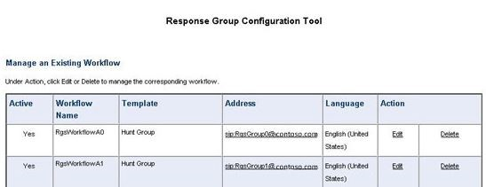

# 配置策略的 Skype 的业务服务器 2015年压力和性能工具
 
业务服务器 2015年压力和性能工具的 Skype 的策略配置。
  
有多个策略，您可以在 Skype for 配置业务服务器 2015年之前运行压力和性能工具的其他方面：
  
- [存档策略](configuring-policies.md#ArchivingPolicy)
    
- [会议策略](configuring-policies.md#ConferencingPolicy)
    
- [联系人策略](configuring-policies.md#ContactsPolicy)
    
- [联合身份验证策略](configuring-policies.md#FederationPolicy)
    
- [呼叫允许控制策略](configuring-policies.md#CACPolicy)
    
- [语音路由规则](configuring-policies.md#VoiceRoutingRules)
    
- [会议助理应用程序](configuring-policies.md#ConfAttendantApp)
    
- [服务器呼叫寄存服务](configuring-policies.md#ServerCallParkServ)
    
- [紧急呼叫](configuring-policies.md#EmergencyCalls)
    
- [配置响应组应用程序](configuring-policies.md#ConfigResponseGroupApp)
    
## 存档策略

如果必须在您 Skype 企业服务器拓扑中部署存档服务器，您可以查看 ArchivingPolicy.ps1 脚本。 如果需要进一步的协助，签出的存档和 Web 会议的 cmdlet。
  
## 会议策略

对于会议，我们已 MeetingPolicy.ps1 脚本。 如果需要进一步的协助，签出的 Web 会议 cmdlet。
  
## 联系人策略

ContactsPolicy.ps1 脚本将查看您所需的示例。 IM 和状态 cmdlet 将帮助如果需要进一步的引用。
  
## 联合身份验证策略

联合身份验证的示例脚本是 FederationPolicy.ps1。 若要查看，如果需要进一步的洞察力 cmdlet 将边缘服务器、 联盟和外部访问。
  
## 呼叫允许控制策略

此策略，可以引用 BandwidthPolicy.ps1。 呼叫允许控制 cmdlet 都将具有进一步的信息以及。
  
## 语音路由规则

您将需要 RoutingRules.ps1 示例脚本，为语音路由。 当您正在配置这些规则时，注意的电话上下文 （即，/Location 配置文件或 /SimpleName） 和内部/外部区域代码，以便您可以创建用户时指定它们。 您还需要这些 LyncPerfTool （特别是对于 PSTN UC 和 UC-PSTN） 的配置过程中。
  
例如，对 RoutingRules.ps1 示例中的**新建 CsDialPlan** cmdlet 的调用中的 SimpleName 参数应使用在下图中的 UserProfileGenerator.exe LocationProfile 值：
  

  
有关详细信息，您可以查看的企业语音 cmdlet。
  
## 会议助理应用程序

首次查看 ConferenceAutoAttendantConfiguration.ps1 脚本。 您需要注意的 ConferencingAutoAttendant 电话号码 (默认情况下 1121111111)，以便您可以将其输入 LyncPerfTool 配置工具配置生成时，如下所示：
  

  
您将找到更多详细信息，在会议和电话拨入式会议 cmdlet。
  
## 服务器呼叫寄存服务

默认情况下，这是实际禁用。 如果您需要对此进行测试，则可以查看 CallParkConfiguration.ps1 示例脚本。 此外，签出的呼叫寄存应用程序 cmdlet，根据需要。
  
## 紧急呼叫

您将需要执行以下步骤来配置压力和性能测试用于紧急呼叫：
  
1. 设置紧急呼叫的语音路由。 您可以使用 RoutingRules.ps1 脚本，并举例说明如何设置该语音路由的注释"**路由到 PSTN 的 E911** "下检查。
    
    > [!CAUTION]
    > RoutingRules.ps1 中的示例命令具有包括 119，而不是 911 的数量的号码模式。 您应避免使用 911 （或实际本地紧急电话号码） 您负载测试过程中阻止意外呼叫您的本地紧急运算符。 请记住，此配置仅用于模拟 ！ 
  
2. 下图中所示填写 UserProvisioningTool，**位置信息服务配置**选项卡上的值，在配置地址：
    
     
  
3. 当您已输入所有 UserProvisioningTool 时，单击**生成 LIS 配置文件**按钮。
    
4. 现在将生成 CSV 文件的端口、 子网、 交换机和无线访问点 (Wap)，以及压力和性能工具 XML 文件。 配置与 LisConfiguration.ps1 脚本的位置信息服务 (LIS) 时，可用于输入 CSV 文件。 若要执行此操作，您需要将 Locations0.xml 文件移动到与压力和性能工具可执行 (LyncPerfTool.exe) 相同的文件夹。 这会让您运行配置文件 （拨号计划） 的方案的位置。
    
## 配置响应组应用程序

示例脚本是 ResponseGroupConfiguration.ps1。 也有响应组应用程序 cmdlet 可查看有关配置的详细信息。 下图将介绍一些配置详细信息：
  

  

