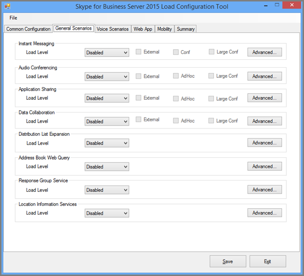
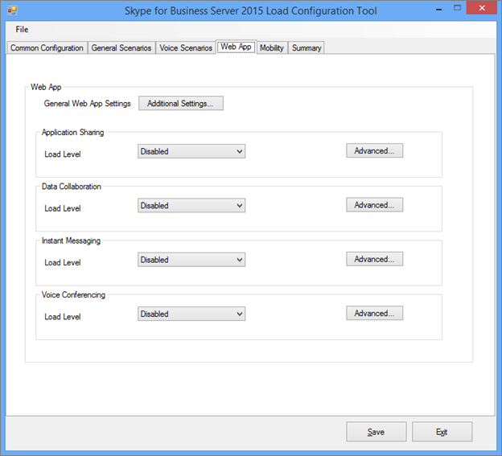

# <a name="using-the-skype-for-business-server-2015-stress-and-performance-tool"></a>使用 Skype 业务服务器 2015年压力和性能工具
 
若要运行 Skype 的业务服务器 2015年压力和性能工具，您将需要能够管理用户、 联系人和用户配置文件配置正在运行，工具，然后检查输出或工具生成的结果。
  
有四个方面所涉及的业务 Server 2015 压力和性能工具 （可执行文件是 LyncPerfTool.exe） 运行 Skype:
  
- [创建用户和联系人](using-the-tool.md#BKMK_CreateUsersAndContacts)
    
- [配置用户配置文件](using-the-tool.md#BKMK_UserProfile)
    
- [运行 LyncPerfTool](using-the-tool.md#BKMK_RunTool)
    
- [解释结果](using-the-tool.md#BKMK_Interpret)
    
## <a name="create-users-and-contacts"></a>创建用户和联系人
<a name="BKMK_CreateUsersAndContacts"> </a>

您需要使用业务服务器 2015 (SB 2015) 用户设置工具 (UserProvisioningTool.exe) Skype 创建用户和联系人以进行压力和性能测试。
  
这是在阅读主题可能有用的有用词的列表：
  
- **组织单位**的 Active Directory 域服务 (AD DS) 的组织单位 (OU)。
    
- **联盟 / 跨池**-用户可以与来自其他即时消息 (IM) 服务的用户通信。
    
- **通讯组列表**的或 Dl。 这些是包含 AD DS 用户的列表的 AD DS 中的对象。 它们用于加快跨组的人员的通信。
    
- **位置信息服务**-业务服务器 2015年服务的增强型 911 (E911) 服务的物理位置检索已启用并配置每个电话，对其时允许 Skype。
    
- **美国电话号码**的电话号码分配给用户除了用于路由入站和出站呼叫中反向号码查找 (RNL) 的 SIP URI。
    
### <a name="create-users-and-contacts-by-using-userprovisioningtoolexe"></a>使用 UserProvisioningTool.exe 创建用户和联系人

> [!NOTE]
> 即使开始之前，请确保绝对登录要运行此工具的 Domain Admins 安全组成员身份。 您需要执行此操作，因为您将创建 Active Directory 用户。 
  
您需要企业服务器用户设置工具 Skype 用于创建用户和负载模拟的联系人。
  
**Skype 业务服务器用户设置工具**安装的**Skype 的业务 Server 压力和性能工具**程序包。 确保已在前端服务器或想要测试的 Standard Edition 服务器上执行的程序包安装程序 (CapacityPlanningTool.msi)。
  
您可以通过运行文件 UserProvisioningTool.exe （位于 %installeddirectory%lyncstressandperftool\lyncstress） 的业务服务器用户设置工具开始 Skype 在前端服务器或 Standard Edition server 上。
  
> [!IMPORTANT]
> 当您创建大量的用户 （例如，10000 或多个），运行 UserProvisioningTool.exe。 您需要执行此操作，因为该工具将创建并配置*新*AD 用户。
  
当用户设置工具打开时，单击配置，然后选择负载配置。 
  
若要开始配置用户和联系人，加载附带的程序包，名为"SampleData.xml"的默认文件。 这将预填充您需要更改以使其与您的部署相关的示例数据的字段。
  
如果您有一个预配置的 XML 文件已包含自定义的设置，您可以改为加载该文件。 填写字段在用户设置工具中，以下各节中所述。
  
### <a name="to-configure-server-options"></a>配置服务器选项：

1. 在**前端池 FQDN**字段中，键入 Standard Edition server 或要承载用户的前端池的完全限定的域名 (FQDN)。
    
2. 在**用户名称前缀**字段中，键入您想要用于 bust 您出于测试目的 （例如"TestUser") 的用户名的前缀。
    
3. 在**密码**字段中，键入将使用的所有测试用户帐户的密码。
    
4. 在**帐户域**字段中，键入您的当前 AD 域的域名 （要在其中创建测试用户的那个）。
    
5. 在**组织单位**字段中，键入名称这些 AD 域您想要创建的测试用户。 （如果尚不存在 OU，则它将为您创建。）
    
6. 在**电话区号**字段中，键入用于跨所有测试用户帐户的三个数字区域代码。 请确保您选择不会发生冲突与其他用户的区域代码区域代码 AD 中。
    
7. 单击以选中**语音启用**复选框，如果您想要测试用户启用企业语音。
    
8. 在**用户数量**字段中，提供您想要创建的测试用户的总数。
    
9. 在**开始的索引**字段中，为将用作用户名称前缀为后缀的起始编号 （例如，前缀是"TestUser"和"0"在下面的示例中将结束第一个名称。）
    
     
  
#### <a name="create-users-button"></a>创建用户按钮

当您单击**创建用户**按钮时，验证您输入的输入的参数。 如果有任何验证错误，将提示您进行修复。 或者，如果所有的值是否正确，用户将启动显示 （无论您指定的 OU) 中的 AD 中。 在运行，您将看到进度栏底部的工具。 进度栏处于活动状态时不关闭应用程序。
  
创建用户需要花费的时间，相应地请计划。 此过程可以花几分钟，以便将一些用户为大型数量的用户的几个小时。
  
如果在测试环境中没有访问 AD 域控制器，您仍可以通过以下方式之一的用户指定要创建范围中的用户验证用户创建。 请记住使用前缀和后缀，以及作为用户名 @sipDomain。 下面是一个示例： <em>TestUser20@contoso.net</em> 。
  
> [!NOTE]
> 如果用户已存在，请单击创建用户按钮将更新它们与任何配置更改。 
  
#### <a name="delete-users-button"></a>删除用户按钮

当您单击**删除用户**按钮时，将验证选项卡的输入的参数。 如果存在验证错误，您将会提示来修复这些，并且正确的输入的值时，将禁用并从 Active Directory 中删除指定的测试用户。 同样，在底部的此选项卡上，将显示进度栏和进度栏处于活动状态时，不应关闭应用程序。
  
> [!NOTE]
> 支持仅美国格式的电话号码。 电话号码始终分配给用户，并通过 UserProvisioningTool.exe 创建的所有用户都启用企业语音默认情况下。 使用的电话号码，如会议自动助理或 UC-PSTN 呼叫的任何方案使用此电话号码以正确路由呼叫。 因此，*每个用户*必须拥有*唯一的电话号码*。
  
> [!NOTE]
> **如果您有两次创建用户，该命令将失败，除非您使用不同的区域代码，或上一用户已禁用使用 Disable-csuser cmdlet。**
  
> [!IMPORTANT]
> 创建联系人之前，首先需要完成用户复制 （这通过用户选项卡）。 
  
> [!IMPORTANT]
> 如果您刚才创建您的用户，您将需要等待，直到 Skype 业务服务器复制完成并填充数据库中的用户帐户。 **如果用户尚未复制完成后，您将看到一个错误。** 您将了解当用户完复制如果 Skype 业务 Server 2015 前端服务已启动，或通过成功运行 Get-csuser cmdlet 的最后一个用户的您指定的总数。
  
#### <a name="contacts-creation-tab"></a>联系人创建选项卡

此选项卡使您的测试授予用户的联系人详细信息。
  

  
### <a name="to-configure-users-contacts-do-the-following"></a>若要配置用户的联系人，请执行以下操作：

1. 在**平均每个用户的联系人**字段中，输入的平均联系人数填充为每个用户的联系人列表中。
    
2. 如果您想要创建的每个用户等于联系人数，请选择**修复**复选框。 如果您想要改变为用户创建的联系人数，请清除该复选框。
    
3. 在**每个用户的平均联系人组**字段中，输入每个用户的联系人组的数目。 此号码必须小于**每个用户的平均联系人**。
    
4. 在**联盟 / 跨池联系人百分比**字段中，为介于 0 和 100 之间的数字。 将与联盟用户创建此联系人的百分比。
    
5. 在**联盟 / 跨池用户前缀**字段中，将添加到本地用户的联系人列表的联盟用户授予用户名。
    
6. 在**联盟 / 跨池用户的 SIP 域**字段中，为联盟用户的 SIP 域名称。
    
7. 在**用户创建**选项卡上确保信息正确无误。 从用户创建选项卡上的值，将创建您的联系人。
    
8. 单击**创建联系人**开始联系人创建。 此过程可能需要几分钟。 它完成邮件，将出现一个对话框后，"操作成功完成。" 您可以验证创建的以从用户创建选项卡中创建用户登录的联系人。
    
> [!NOTE]
> 创建联系人之后，此工具将在重新启动所有前端服务器目标池。 根据多少联系人创建的此操作可能需要更长时间 （最多 2 小时） 开始，前端服务器。 
  
#### <a name="distribution-list"></a>通讯组列表

为业务服务器 2015年压力和性能工具 Skype 可以模拟业务 2015年客户端 Skype 中的通讯组列表 (DL) 扩展功能。 如果您不想要启用用户设置工具中的 DL 扩展，则可以跳过此步骤。
  

  
通讯组列表选项卡，可以创建 Dl 压力和性能工具将使用通讯组列表扩展功能。 创建 Dl 之前, 的业务服务器 2015 Skype 需要部署，包括具有运行 ForestPrep。 如果不这样做，DL 属性将不在 AD 架构中，存在，因此该工具将无法创建 Dl。
  
### <a name="to-configure-distribution-lists"></a>配置通讯组列表：

1. 在**列表的通讯组数**字段中，提供您想要创建的 Dl 的总数 （此处的建议。 您与 double 您具有的用户数的值开始）。
    
2. 在**通讯组列表前缀**字段中，输入您创建的所有 Dl 将都具有，例如*testDL*前缀。 这意味着，在 100 Dl DL 名称将显示如下： testDL0，testDL1，最多为 testDL99。
    
3. 在**最小 Dist.列表中的成员**字段中，输入的最小放入每个 DL 用户数。
    
4. 在**Dist.列表中的最大成员**字段中，输入的最大在每个 DL 中添加的用户数。
    
#### <a name="create-distribution-lists-button"></a>创建通讯组列表的按钮

当您单击创建通讯组列表按钮时，该工具将查询 Active Directory 以查看是否通讯组列表匹配前缀和号码已经存在。 此工具创建尚不存在任何 Dl。 时将成员添加到这些新创建的通讯组列表，它将在用户创建选项卡上指定的区域选择的用户。
  
#### <a name="location-info-service-config-tab"></a>位置信息服务配置选项卡

业务 Server 2015 压力和性能工具 Skype 还可以生成的位置信息服务的虚拟配置文件。 请注意，位置信息服务通常不会显著影响性能的服务器上。 
  

  
如果您选择要测试此功能，填充窗体中的值，然后单击生成 LIS 配置文件按钮，将创建。调用 CSV 文件：
  
- LIS_Subnet.csv
    
- LIS_Switches.csv
    
- LIS_Ports.csv
    
- LIS_WAP.csv
    
若要导入到 LIS 数据库这些文件，请使用以下 PowerShell cmdlet:
  
- 设置 CsLisSubnet
    
- 设置 CsLisSwitch
    
- 设置 CsLisPort
    
- 设置 CsWirelessAccessPoint
    
## <a name="configure-user-profile"></a>配置用户配置文件
<a name="BKMK_UserProfile"> </a>

您的用户 （通过用户创建工具） 创建后您可以配置与业务服务器 2015年负载配置工具 (UserProfileGenerator.exe) Skype 的用户配置文件。
  
### <a name="running-the-skype-for-business-server-2015-load-configuration-tool"></a>运行 Business Server 2015 负载配置工具的 Skype

启动加载配置工具 (UserProfileGenerator.exe)，并填写选项卡。 此工具创建一个目录的每个客户端需要运行您模拟的计算机。 每个客户端目录附带的脚本来启动 Skype 的业务 Server 2015 压力和性能工具 (LyncPerfTool.exe)。 以下各节将提供有关如何填充 Business Server 2015 负载配置工具的 Skype 的每个选项卡上的域中的示例。
  
> [!IMPORTANT]
> 负载配置工具 (UserProfileGenerator.exe) 中使用的特定于用户的值必须为池匹配业务 2015年用户创建工具 (UserProvisioningTool.exe) Skype 中指定的值。 
  
#### <a name="common-configuration-tab"></a>常见配置选项卡

负载配置工具的**通用配置**选项卡如下所示。 填写的通用配置选项卡字段中的以下步骤所述。
  

  
1. 在**可用机号码**字段中，键入您想要用于运行压力和性能工具 (LyncPerfTool.exe) 的计算机数量。 我们建议您有一台计算机，您将模拟，每个 4500 用户，但该号码可能会有所不同，如果减少负载级别，或使用该工具的可用功能 （在常规方案选项卡设置负载级别） 的子集。
    
2. 在**前缀用户名**字段中，输入用户名字段的所有用户的前缀。 若要登录的统一资源标识符 (URI) 将是： *UserPrefix [用户开始索引...（数用户-1）]@User 域*，例如，myUser009@Contoso.com。
    
3. 在**为所有用户的密码**字段中，输入的用户的创建过程中使用的密码。 如果将此字段留空将设置用户名的密码。
    
4. 在**用户启动索引**字段中，输入要配置的第一个用户的索引。 您可以配置不同范围的不同类型或级别的负载，但您想要配置每个范围后，必须运行负载配置工具 (UserProfileGenerator.exe)。
    
5. 在**用户数量**字段中，输入您要配置的用户总数。
    
6. 在**用户域**字段中，输入用于 SIP URI 的域。 这用于构造 SIP URI 的每个用户登录到 Skype 对于业务 Server 2015 前端服务器或 Standard Edition 服务器，并且可能不同帐户的域。
    
7. 在**帐户域**字段中，输入 AD DS 域登录。
    
8. 在**MPOP 百分比**（多个状态点百分比） 字段中，为提供登录来自多个计算机或设备，例如 10%的用户的百分比的值。
    
9. 在**登录每秒 （每个实例）** 字段中输入并发终结点的最大数量。 这是最大数量为您的用户，记录项和建议是小于 / 等于每秒 2 的速率 (< = 2)。
    
10. 在**访问代理服务器或池 FQDN**字段中，输入您希望客户端连接到的服务器的完全限定的域名 (FQDN)。 如果用户要外部登录，您需要键入访问代理服务器。 如果用户是内部，使其企业版池或 Standard Edition 服务器的 FQDN。
    
11. 在**端口**字段中，输入您希望用户使用 SIP 的端口 （此处的默认值为 5061）。
    
12. 对于**外部网络服务器设置**字段中，提供访问代理服务器或池 FQDN，同样，**端口**。 这些设置将用于外部终结点负载模拟。
    
#### <a name="general-scenarios-tab"></a>常规方案选项卡


  
可以为每个常规方案提供通过确定想要运行或离开已禁用配置的负载级别和参数。 下面是常规选项：
  
> [!NOTE]
> 对于所有字段，但本地信息服务负载级别值是**已禁用**、**低**、**中等**、**高**，或**自定义**。 如果选择任何设置，但已禁用，然后配置生成的每个客户端中。 高导致服务器; 中受支持的最大负载medium 为 60%的高负载;低为 30%。 
  
- **即时消息-** 这包括对等和会议;负载级别选择适当的值。
    
- **音频会议-** 选择音频会议*仅*负载级别。 **语音方案**一节中，将稍后处理对等呼叫。 打开**高级**选项卡启用多视图。
    
- **应用程序共享-** 选择应用程序共享负载级别。
    
- **数据协作-** 选择数据协作，其中包括数据会议负载级别。
    
- **通讯组列表扩展-** 单击**高级**按钮，具有相同的用户创建工具 (UserProvisioningTool.exe) 的 DL 选项卡上配置的值填充该字段。 选择负载级别。
    
- **通讯簿 Web 查询-** 这是通讯簿查找服务，而不是通讯簿文件下载。 如果您希望此启用通讯簿文件下载，请单击**高级**按钮，并将**EnableABSDownload**设置为 True。 负载级别赋予一个值。
    
- **响应组服务-** 单击**高级**按钮并指定响应组已设置响应组服务代理时创建的 Uri。 您必须选择至少一个响应组。 若要使用的详细信息，请用分号分隔的响应组。 **RGSUriSuffixStartIndex**和**RGSUriSuffixEndIndex**更新到实际值。 选择负载级别。
    
- **位置信息服务-** 选择启用或禁用负载级别。
    
> [!NOTE]
> 为每个方案具有高级按钮旁边，和一组启用变体设置为默认设置的复选框。 
  
- 选择*临时*将允许生成模拟将整个小时创建的会议的工具。
    
- 选择*大型会议*意味着，将模拟大型会议方案。
    
-  *外部*通知工具还模拟外部用户。
    
这些按钮和复选框是特定于每个方案的额外值将更改压力和性能工具的行为和进行自定义项可能。
  
对于每个方案 （除外位置信息服务） 的常规方案选项卡上，如果负载级别的值为**自定义**，然后对话速率将计算使用高级对话框中的相应字段。 字段名称可能有所不同，具体取决于情况，但将状态字段的说明：*将只使用注意此号码，如果从下拉菜单中选择自定义*。
  
**高**、**中等**和**低**的值将更改每种形式嵌入到用户模型的所有方案的平衡对话率。 如果需要更改每种形式由于预期用法差异的负载级别，请使用自定义对话速度。
  
#### <a name="voice-scenarios-tab"></a>语音方案选项卡

这是您所有语音相关的方案的配置的选项卡。
  

  
是您的选项：
  
- **-VoIP**单击**高级**按钮，并添加 PhoneAreaCode 和 LocationProfile （拨号计划） 字段的值。 您还将负载级别授予一个值。 如果您选择负载级别 VoIP 或 UC/PSTN 网关启用，然后公共交换电话交换网 (PSTN) 与统一通信 (UC) 将生成配置文件以模拟外部呼叫。
    
- **UC/PSTN 网关-** 您需要选择负载级别值，并且当以外禁用选择任何内容，您还需要通过单击**高级**按钮提供 PSTN 区号的值。 在中介服务器和 PSTN 下，单击**添加**。 请确保已配置为区号的路由。
    
    > [!TIP]
    > 您可用于任一 Skype 业务控制面板或 Skype 的业务命令行管理程序来验证语音路由配置。 
  
- **会议助理-** 提供针对负载级别值。 禁用之外的任何值将启用**电话号码**字段。 输入您想要使用的自动助理的电话号码。 单击**高级**，并对**LocationProfile**字段为一个值。
    
- **呼叫驻留服务-** 此处提供负载级别。
    
- **中介服务器和 PSTN-** 您想要使用的每台中介服务器需要其自己的 PSTN 模拟器。 您已确定您要用于模拟器哪些客户端后，配置中介服务器路由到的计算机在呼叫 PSTN 模拟器您配置。 单击**添加**按钮为中介服务器配置值。
    
    > [!NOTE]
    > 每个方案有旁边它位于高级按钮。 高级的对话框包含设置特定于每个方案更改压力和性能工具的行为，并且启用自定义。 通过在高级对话框中使用的相应字段，将计算 > 语音方案选项卡上，如果负载级别的值是**自定义**，则对话率的每个方案。 字段名称可能有所不同，具体取决于情况，但将状态字段的说明：*将只使用注意此号码，如果从下拉菜单中选择自定义*。
  
#### <a name="web-app-tab"></a>Web 应用程序选项卡


  
Web 应用程序支持通过统一通信 Web API (UCWA) 服务器的前端服务器上安装了会议方案。 使用 Web 应用程序选项卡可以配置所有 web 应用程序相关方案。 选项如下：
  
- **常规 Web 应用程序设置-** 单击**其他设置**按钮并设置到目录池虚拟 IP (VIP) 的前端池 VIP 的**ReachTargetServerUrl** 。
    
- **应用程序共享-** 为负载级别选择一个值。
    
- **数据协作-** 为负载级别选择一个值。
    
- **即时消息-** 为负载级别选择一个值。
    
- **语音会议 –** 为负载级别选择一个值。
    
> [!NOTE]
> 为每个方案都有旁边它位于**高级**按钮。 高级的对话框包含特定于每个方案的值将更改压力和性能工具的行为和负载级别**自定义**，然后**中指定的值是否为每个 Web 应用程序方案中，启用 customization.>ConversationsPerHour**而不是默认使用字段。
  
#### <a name="mobility-tab"></a>移动选项卡

使用此选项卡配置的所有 mobility 相关方案。
  

  
此处的选项是：
  
- **常规的移动性设置-** 单击**其他设置**，并将字段 UcwaTargetServerUrl 设置为控制器池虚拟 IP (VIP) 或前端池 VIP。
    
- **状态和 P2P 即时消息/音频-** 选择要启用移动模拟的负载级别值。
    
> [!NOTE]
> 为每个方案都有旁边它位于**高级**按钮。 高级的对话框包含特定于每个方案的值将更改压力和性能工具的行为和负载级别**自定义**，然后**中指定的值是否为每个移动方案中，启用 customization.>ConversationsPerHour**而不是默认使用字段。
  
#### <a name="summary-tab"></a>摘要选项卡

摘要选项卡指示哪些用户用于为每个方案。
  

  
摘要选项卡指示哪些用户用于为每个方案。 
  
就可以通过选择**生成启用自定义用户范围**复选框，然后双击具有您要自定义用户范围的表中的方案中手动配置用户号码范围。
  
检查 **(RunClient.bat) 添加登录延迟启动时**才能在对应的登录速率生成的批处理文件中包含延迟。 这会阻止服务器过载大量用户在登录时很有用。
  
单击**生成文件**，然后选择要用来生成配置的文件夹。 已成功创建您的文件时，将出现一个对话框。
  

  
## <a name="run-lyncperftool"></a>运行 LyncPerfTool
<a name="BKMK_RunTool"> </a>

您需要创建的业务 Server 2015 压力和性能工具 (LyncPerfTool.exe) 运行 Skype 之前的用户、 联系人和方案。 有关使用这些工具才能执行这些操作的详细信息，请参阅[创建用户和联系人](using-the-tool.md#BKMK_CreateUsersAndContacts)和[配置用户配置文件](using-the-tool.md#BKMK_UserProfile)之前本文中。 运行这些工具还将生成的文件将运行的使用压力和性能工具批处理文件的一部分包含所需的参数。
  
### <a name="running-the-skype-for-business-server-2015-stress-and-performance-tool"></a>运行 Business Server 2015 压力和性能工具 Skype

负载配置工具 (UserProfileGenerator.exe) 创建批处理文件，使您能够通过注册性能计数器和加载 XML 配置文件来运行压力和性能工具 (LyncPerfTool.exe)。 批处理文件运行每个配置文件的一个实例 LyncPerfTool.exe。 若要运行的批处理文件，请执行以下步骤：
  
### <a name="run-the-stress-and-performance-test"></a>运行压力和性能测试

1. 将具有的配置文件夹和文件内的文件夹复制到每个客户端计算机具有 LyncPerfTool.exe 的目录。 （例如，如果您在名为 1.28_13.16.16 的文件夹中生成的配置文件，复制该文件夹到与 LyncPerfTool.exe 文件夹中。 执行此操作在每个客户端上。）
    
2. 导航到客户端文件夹，然后运行**RunClient**批处理脚本。 您可以双击在 Windows 资源管理器中的批处理文件，它将为该客户端运行的所有配置文件。 此外可以使用以下语法，从客户端文件夹中运行该脚本：
    
   ```
   RunClient0.bat "C:\Program Files\Skype for Business Server 2015\LyncStressAndPerfTool\LyncStress" 
   ```

若要直接运行压力和性能工具，打开命令提示符并键入以下命令，在命令行 (当第一次执行此操作，请务必注册性能计数器和`regsvr32 /i /n /s LyncPerfToolPerf.dll`，如本主题后面的备注中所示):
  
```
LyncPerfTool.exe /file:IM_client0.xml
```

若要配置文件中显示的值该工具，包括`/displayfile`参数上述命令中，使其类似于此：
  
```
LyncPerfTool.exe /file:IM_client0.xml /displayfile
```

*结束*流程，按 Ctrl + C。
  
> [!NOTE]
> 直接运行压力和性能工具时之前, 必须注册性能计数器通过以下命令：`regsvr32 /i /n /s LyncPerfToolPerf.dll`
  
> [!NOTE]
> 压力和性能工具开始的每个实例将立即开始，通常为用户的每秒的一个用户在登录。 
  
峰值用户登录速率为池为大约每秒的 12。 这意味着，您不应启动超过 12 LyncPerfTool.exe 实例同时时用户仍登录。 一个千用户大约需要 20 分钟完全 1 秒登录。
  
## <a name="interpreting-the-results"></a>解释结果
<a name="BKMK_Interpret"> </a>

为业务服务器 2015年压力和性能工具 Skype 具有许多可帮助您了解客户端执行和是否它会遇到问题的计数器。
  
### <a name="client-counters"></a>客户端计数器

LyncPerfTool.exe 运行每个的实例都具有单独的计数器实例。 每个实例名为通过其进程 id。 如果客户端是重载会发生其他问题。 若要防止这些问题：
  
- 监视客户端计算机上的 CPU 和内存使用情况。 如果 CPU 始终为 90%以上，减少用户的数。
    
- 高的内存需求量后，您可能会遇到问题，如果页面文件开始运行空间不足。 验证提交费用未命中的计算机上的限制。 如果遇到内存限制考虑增加页面文件的大小或减少用户的数量。
    
下面是关键性能计数器的列表：
  
**常规信息**

|**性能计数器**|**说明**|
|:-----|:-----|
|以分钟为单位的时间  <br/> |自从启动以来过程所用时间。  <br/> |
|活动终结点  <br/> |当前连接到服务器的终结点的数目。  <br/> |
|失败的登录  <br/> |终结点登录失败的总数。  <br/> |
|登录尝试次数  <br/> |终结点登录尝试的总数。  <br/> |
|断开连接的终结点  <br/> |已断开的终结点的总数。  <br/> |
   
**状态信息**

|**性能计数器**|**说明**|
|:-----|:-----|
|SetPresence 呼叫  <br/> |总数状态更改尝试。 有关不同类型的状态更改，请参阅 SetPresence （状态类型） 调用性能计数器。  <br/> |
|NNN 响应的 SetPresence  <br/> |Nnn 响应代码从服务器接收的总次数。  <br/> |
|对 GetPresence 呼叫  <br/> |获取状态请求尝试的总数。  <br/> |
|NNN 响应的 GetPresence  <br/> |Nnn 响应代码从服务器接收的总次数。  <br/> |
   
**通讯簿服务信息**

|**性能计数器**|**说明**|
|:-----|:-----|
|尝试 ABS 完全/增量文件下载  <br/> |尝试完全或增量文件下载请求的总数。  <br/> |
|ABS 完全/增量文件下载成功  <br/> |尝试完全或增量文件下载请求的总数。  <br/> |
|通讯簿 Web 查询服务相关的计数器  <br/> |通讯簿文件下载相关的计数器。  <br/> |
|ABS WS 呼叫尝试  <br/> |尝试的通讯簿 Web 查询服务请求的总数。  <br/> |
|ABS WS 呼叫成功  <br/> |返回一个成功的响应代码的通讯簿 Web 查询服务请求的总数。  <br/> |
|ABS WS 呼叫失败  <br/> |返回错误响应代码的通讯簿 Web 查询服务请求的总数。  <br/> |
   
> [!NOTE]
> 此类别包括用于监视通讯簿服务 (ABS) 文件下载和通讯簿 Web 查询服务请求的计数器。 
  
**通讯组列表 (DL) 信息**

|**性能计数器**|**说明**|
|:-----|:-----|
|尝试的呼叫  <br/> |尝试的通讯组列表扩展 (DLX) web 服务请求的总数。  <br/> |
|成功呼叫  <br/> |返回一个成功的响应代码的 DLX web 服务请求的总数。  <br/> |
|失败的呼叫  <br/> |返回错误响应代码的 DLX web 服务请求的总数。  <br/> |
   

  
> [!NOTE]
> 性能计数器下面列出报表编号的所有语音 IP (电话 VoIP) 呼叫，包括呼叫到中介服务器，A / V 会议服务器、 边缘服务器，响应组应用程序和会议自动助理，启用这些方案时。 
  
**VoIP Basic 信息**

|**性能计数器**|**说明**|
|:-----|:-----|
|呼叫活动  <br/> |当前正在进行调用的传入/传出语音总数。  <br/> |
|终止呼叫  <br/> |已终止的传入/传出语音呼叫的总数。  <br/> |
|拒绝呼叫  <br/> |拒绝的传入语音呼叫的总数。  <br/> |
|尝试的传入/传出呼叫  <br/> |传入/传出语音呼叫尝试的总数。  <br/> |
|建立的传入/传出呼叫  <br/> |传入/传出建立语音呼叫的总数。  <br/> |
|呼叫接收到的 NNN  <br/> |Nnn 响应代码从服务器接收的总次数。  <br/> |
|VoIP 通过率 （%）  <br/> |总呼叫尝试建立总呼叫。  <br/> |
   
**响应组服务呼叫信息**

|**性能计数器**|**说明**|
|:-----|:-----|
|呼叫活动  <br/> |对响应组应用程序的活动呼叫的总数。  <br/> |
|尝试的呼叫  <br/> |呼叫尝试的总数。  <br/> |
   
**即时消息 (IM) 呼叫信息**

|**性能计数器**|**说明**|
|:-----|:-----|
|呼叫活动  <br/> |正在进行传入/传出即时消息呼叫的总数。  <br/> |
|终止呼叫  <br/> |已终止的传入/传出即时消息的呼叫的总数。  <br/> |
|呼叫接收到的 NNN  <br/> |Nnn 响应代码从服务器接收的总次数。  <br/> |
|收到发送的 IM 消息  <br/> |消息的总数收到或发送的所有会话。  <br/> |
|尝试的传入/传出呼叫  <br/> |传入/传出即时消息呼叫尝试的总数。  <br/> |
|建立的传入/传出呼叫  <br/> |建立传入/传出即时消息呼叫的总数。  <br/> |
   
**应用程序共享呼叫信息**

|**性能计数器**|**说明**|
|:-----|:-----|
|呼叫活动  <br/> |正在进行的传入/传出的应用程序共享呼叫的总数。  <br/> |
|终止呼叫  <br/> |终止传入/传出的应用程序已共享呼叫的总数。  <br/> |
|呼叫接收到的 NNN  <br/> |Nnn 响应代码从服务器接收的总次数。  <br/> |
|尝试的传入/传出呼叫  <br/> |传入/传出的应用程序共享呼叫尝试的总数。  <br/> |
|建立的传入/传出呼叫  <br/> |传入/传出的应用程序共享建立呼叫的总数。  <br/> |
   
**CAA 呼叫信息**

|**性能计数器**|**说明**|
|:-----|:-----|
|呼叫活动  <br/> |当前正在进行调用的传入/传出公用电话交换网 (PSTN) 的总数。  <br/> |
|终止呼叫  <br/> |已终止的传入/传出 PSTN 呼叫的总数。  <br/> |
|尝试的传入/传出呼叫  <br/> |传入/传出 PSTN 呼叫尝试的总数。  <br/> |
|建立的传入/传出呼叫  <br/> |建立传入/传出 PSTN 呼叫的总数。  <br/> |
   
**会议信息**

|**性能计数器**|**说明**|
|:-----|:-----|
|活动的即时消息会议  <br/> |正在进行的即时消息会议的总数。  <br/> |
|活动的音频/视频会议  <br/> |总数正在进行音频/视频 (A / V) 会议。  <br/> |
|活动应用程序共享会议  <br/> |正在进行的应用程序共享会议的总数。  <br/> |
|参与者数目  <br/> |当前连接到会议的参与者的总数。  <br/> |
|会议计划失败  <br/> |试图安排会议时失败的总数。  <br/> |
|加入会议失败  <br/> |尝试连接到会议时失败的总数。  <br/> |
   
**UCWA 客户端计数器**

|**性能计数器**|**说明**|
|:-----|:-----|
|总数 IMMCU 加入成功  <br/> |加入即时消息会议的总数。  <br/> |
|总数 DMCU 加入成功  <br/> |总数 A / V 会议加入。  <br/> |
   

