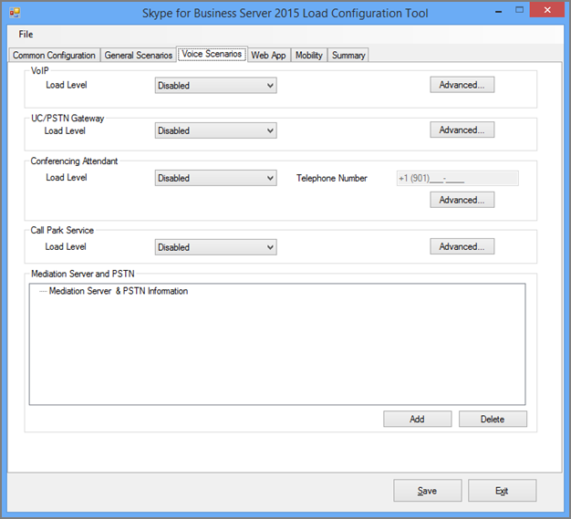

# <a name="using-the-skype-for-business-server-2015-stress-and-performance-tool"></a>使用 Skype for Business Server 2015 应力和性能工具
 
若要运行 Skype for Business Server 2015 应力和性能工具，你需要能够同时管理用户、联系人和用户配置文件、配置工具以运行，然后查看工具生成的输出或结果。
  
运行 Skype for Business Server 2015 应力和性能工具（可执行文件为 LyncPerfTool）有四个区域：
  
- [创建用户和联系人](using-the-tool.md#BKMK_CreateUsersAndContacts)
    
- [配置用户配置文件](using-the-tool.md#BKMK_UserProfile)
    
- [运行 LyncPerfTool](using-the-tool.md#BKMK_RunTool)
    
- [解释结果](using-the-tool.md#BKMK_Interpret)
    
## <a name="create-users-and-contacts"></a>创建用户和联系人
<a name="BKMK_CreateUsersAndContacts"> </a>

你需要使用 Skype for Business Server 2015 （SB 2015）用户预配工具（UserProvisioningTool）为你的压力和性能测试创建用户和联系人。
  
这是在阅读主题时可能有用的有用术语列表：
  
- **组织单位**-Active Directory 域服务（AD DS）组织单位（OU）。
    
- **联盟/跨库**-可以与其他即时消息（IM）服务中的用户进行通信的用户。
    
- **通讯组列表**或 DLs。 这些是 AD DS 中的对象，其中包含广告 DS 用户的列表。 它们用于促进跨用户组的通信。
    
- **位置信息服务**-Skype For business Server 2015 服务，每个电话启用并配置该服务时，都允许检索增强的911（E911）服务的物理位置。
    
- **美国电话号码**-除了用于在反向号码查找（RNL）路由入站和出站呼叫的 SIP URI 之外，还分配给用户的电话号码。
    
### <a name="create-users-and-contacts-by-using-userprovisioningtoolexe"></a>使用 UserProvisioningTool 创建用户和联系人

> [!NOTE]
> 在开始之前，请务必确保你已作为域管理员安全组的成员登录以运行此工具。 你需要执行此操作，因为你将创建 Active Directory 用户。 
  
您必须使用 Skype for Business 服务器用户预配工具为负载模拟创建用户和联系人。
  
Skype for business **Server 用户预配工具**随**Skype For business 服务器压力和性能工具**包一起安装。 请确保程序包安装程序（CapacityPlanningTool）已在前端服务器或你想要测试的标准版服务器上运行。
  
你可以通过在前端服务器或标准版服务器上运行文件 UserProvisioningTool （位于% InstalledDirectory% LyncStressAndPerfTool \ LyncStress）来启动 Skype for Business Server 用户预配工具。
  
> [!IMPORTANT]
> 当创建大量用户（例如，10000或更多）时，请运行 UserProvisioningTool。 你将需要执行此操作，因为该工具将创建和配置*新*的 AD 用户。
  
当用户预配工具打开时，单击 "配置"，然后选择 "加载配置"。 
  
若要开始配置用户和联系人，请加载程序包中包含的默认文件，名为 "SampleData"。 这将预填充示例数据的字段，你需要更改这些字段才能使其与你的部署相关。
  
如果你有一个已经包含自定义设置的预配置 XML 文件，则可以改为加载该文件。 填写 "用户预配" 工具中的字段，如下部分所述。
  
### <a name="to-configure-server-options"></a>要配置服务器选项，请执行以下操作：

1. 在 "**前端池 FQDN** " 字段中，键入标准版服务器的完全限定的域名（FQDN），或者键入要在其中托管用户的前端池的完全限定的域名（FQDN）。
    
2. 在 "**用户名前缀**" 字段中，键入要用于为测试目的 bust 用户名的前缀（如 "TestUser"）。
    
3. 在 "**密码**" 字段中，键入将跨所有测试用户帐户使用的密码。
    
4. 在 "**帐户域**" 字段中，键入当前 AD 域（要在其中创建测试用户）的域名。
    
5. 在 "**组织单位**" 字段中，键入要在其中创建这些测试用户的 AD 域的名称。 （如果该 OU 尚不存在，将为你创建它）。
    
6. 在 "**电话区域代码**" 字段中，键入要在所有测试用户帐户中使用的三位数区域代码。 确保所选区号与广告中的其他用户区域代码不冲突。
    
7. 如果要启用企业语音测试用户，请单击以选中 "**已启用语音**" 复选框。
    
8. 在 "**用户数**" 字段中，给出要创建的测试用户总数。
    
9. 在 "**开始索引**" 字段中，提供将用作用户名前缀的后缀的起始编号（例如，前缀为 "TestUser"，第一个名称将在下面的示例中以 "0" 结尾）。）
    
     
  
#### <a name="create-users-button"></a>"创建用户" 按钮

单击 "**创建用户**" 按钮时，你输入的输入参数将得到验证。 如果存在任何验证错误，系统将提示您修复它们。 或者，如果所有值都是正确的，用户将在广告中显示（在任何指定的 OU 中）。 在工具运行时，你将在工具底部看到一个进度栏。 在进度栏处于活动状态时不要关闭应用程序。
  
用户创建需要花费时间，因此请相应地进行规划。 对于大量用户，此过程可能需要几分钟的时间，几分钟时间才可用于几个用户。
  
如果你无法访问你的测试环境中的 AD 域控制器，你仍然可以通过以你指定要创建的用户范围中的某个用户身份登录来验证用户创建。 请记住使用前缀和后缀以及 @sipDomain 作为用户名。 下面是一个示例： <em>TestUser20@contoso.net</em> 。
  
> [!NOTE]
> 如果用户已存在，单击 "创建用户" 按钮将通过任何配置更改对其进行更新。 
  
#### <a name="delete-users-button"></a>"删除用户" 按钮

单击 "**删除用户**" 按钮时，将验证选项卡的输入参数。 如果存在验证错误，系统将提示您修复这些错误，如果输入值正确，则将禁用指定的测试用户并将其从 Active Directory 中删除。 同样，进度栏将出现在此选项卡的底部，不应在进度栏处于活动状态时关闭该应用程序。
  
> [!NOTE]
> 仅支持美国格式的电话号码。 电话号码始终分配给用户，并且所有由 UserProvisioningTool 创建的用户在默认情况下都启用企业语音。 使用电话号码的任何方案（如会议自动助理或 UC PSTN 呼叫）均可使用此电话号码正确路由呼叫。 出于此原因，*每个用户*都必须有*唯一的电话号码*。
  
> [!NOTE]
> **如果你必须创建两次用户，该命令将失败，除非你使用不同的区号，或者使用 Disable-Move-csuser cmdlet 禁用了以前的用户。**
  
> [!IMPORTANT]
> 在创建联系人之前，您首先需要完成用户复制（从 "用户" 选项卡完成的操作）。 
  
> [!IMPORTANT]
> 如果您刚刚创建了用户，则需要等待，直到 Skype for Business 服务器复制完成，并填充数据库中的用户帐户。 **如果用户尚未完成复制，您将看到一个错误。** 如果 Skype for Business Server 2015 前端服务已启动，或者在你指定的总数的最后一个用户上成功运行 Move-csuser cmdlet，你将知道用户已完成复制的时间。
  
#### <a name="contacts-creation-tab"></a>"创建联系人" 选项卡

此选项卡允许你为你的测试提供用户的联系人详细信息。
  

  
### <a name="to-configure-users-contacts-do-the-following"></a>若要配置用户的联系人，请执行下列操作：

1. 在 "**每位用户平均联系人**" 字段中，输入要在联系人列表中为每位用户填充的平均联系人数。
    
2. 如果要为每位用户创建同等数量的联系人，请选中 "**固定**" 复选框。 如果想要更改为用户创建的联系人数量，请清除该复选框。
    
3. 在 "**每位用户的平均联系人组**" 字段中，输入每位用户的联系人组数。 此号码必须小于**每位用户的平均联系**人数。
    
4. 在 "**联盟/跨池联系人百分比**" 字段中，为介于0和100之间的数字。 此联系人的百分比将与联盟用户一起创建。
    
5. 在 "**联盟/跨池用户前缀**" 字段中，为将添加到本地用户的联系人列表的联盟用户提供用户名。
    
6. 在 "**联盟/跨池用户 SIP 域**" 字段中，为联盟用户提供 SIP 域名称。
    
7. 在 "**用户创建**" 选项卡中，请确保信息正确。 将从 "用户创建" 选项卡上的值创建联系人。
    
8. 单击 "**创建联系人**" 以开始创建联系人。 此过程可能需要几分钟。 完成后，将出现一个对话框，其中显示 "操作已成功完成" 消息。 你可以通过以用户 "创建" 选项卡上创建的用户身份登录来验证已创建的联系人。
    
> [!NOTE]
> 创建联系人后，此工具将重新启动目标池中的所有前端服务器。 可能需要更长时间（最多2小时）才能启动前端服务器，具体取决于此操作创建的联系人数量。 
  
#### <a name="distribution-list"></a>通讯组列表

Skype for Business Server 2015 应力和性能工具可以模拟 Skype for Business 2015 客户端中的通讯组列表（DL）扩展功能。 如果您不打算在用户预配工具中启用 DL 扩展，则可以跳过此步骤。
  

  
通过 "通讯组列表" 选项卡，你可以创建压力和性能工具将用于通讯组列表扩展功能的 DLs。 在创建 Dl 之前，需要部署 Skype for business Server 2015，包括运行 ForestPrep。 如果未执行此操作，则不会在 AD 架构中存在 DL 属性，因此该工具将无法创建 Dl。
  
### <a name="to-configure-distribution-lists"></a>要配置通讯组列表，请执行以下操作：

1. 在 "**通讯组列表数**" 字段中，提供要创建的 DLs 的总数（此处的建议是，您开始的值是您拥有的用户数的两倍。）
    
2. 在 "**通讯组列表前缀**" 字段中，输入你创建的所有 DLs 将具有的前缀，例如*testDL* 。 这意味着，在 100 Dl 中，你的 DL 名称将如下所示： testDL0、testDL1、最高 testDL99。
    
3. 在 Dist 的 "**最少成员" 列表**中，输入要放在每个 DL 中的最小用户数。
    
4. 在 " **Dist" 的最大成员中**，输入要在每个 DL 中添加的最大用户数。
    
#### <a name="create-distribution-lists-button"></a>创建通讯组列表按钮

单击 "创建通讯组列表" 按钮时，该工具将查询 Active Directory 以查看是否存在与前缀和号码相匹配的通讯组列表。 该工具将创建任何尚不存在的 Dl。 将成员添加到这些新创建的通讯组列表时，它将从 "用户创建" 选项卡上指定的范围内选择用户。
  
#### <a name="location-info-service-config-tab"></a>位置信息服务配置选项卡

Skype for Business Server 2015 应力和性能工具还可以为位置信息服务生成虚拟配置文件。 请注意，位置信息服务通常对服务器性能没有显著影响。 
  

  
如果你选择测试此功能，请填写表单中的值，然后单击 "生成 IIS 配置文件" 按钮（将创建该按钮）。名为的 CSV 文件：
  
- LIS_Subnet .csv
    
- LIS_Switches .csv
    
- LIS_Ports .csv
    
- LIS_WAP .csv
    
若要将这些文件导入到 .LIS 数据库中，请使用以下 PowerShell cmdlet：
  
- Set-CsLisSubnet
    
- Set-CsLisSwitch
    
- Set-CsLisPort
    
- Set-CsWirelessAccessPoint
    
## <a name="configure-user-profile"></a>配置用户配置文件
<a name="BKMK_UserProfile"> </a>

创建用户后（通过用户创建工具），您可以使用 Skype for Business Server 2015 加载配置工具（UserProfileGenerator）配置用户配置文件。
  
### <a name="running-the-skype-for-business-server-2015-load-configuration-tool"></a>运行 Skype for Business Server 2015 加载配置工具

启动 "加载配置工具" （UserProfileGenerator）并填写选项卡。 此工具将为每个需要运行模拟的客户端计算机创建一个目录。 每个客户端目录附带一个脚本，用于启动 Skype for Business Server 2015 应力和性能工具（LyncPerfTool）。 下面的部分将提供有关如何在 Skype for Business Server 2015 加载配置工具的每个选项卡上填写字段的示例。
  
> [!IMPORTANT]
> "加载配置工具" （UserProfileGenerator）中使用的特定于用户的值必须与池的 Skype for Business Server 2015 用户创建工具（UserProvisioningTool）中指定的值相匹配。 
  
#### <a name="common-configuration-tab"></a>通用配置选项卡

"加载配置" 工具的 "**通用配置**" 选项卡如下所示。 填写 "通用配置" 选项卡的字段，如以下步骤中所述。
  

  
1. 在 "**可用计算机数**" 字段中，键入要用于运行压力和性能工具（LyncPerfTool）的计算机数。 我们建议你将模拟的每个4500用户拥有一台计算机，但该数字可能因你降低负载级别而异，或者仅使用工具的可用功能子集（在 "常规方案" 选项卡上设置负载级别）。
    
2. 在 "**用户名前缀**" 字段中，为所有用户输入 "用户名" 字段的前缀。 若要登录到 "统一资源标识符（URI）"，请执行以下操作： *UserPrefix [用户开始索引 .。。（用户数-1）]@User 域*，例如 myUser009@Contoso.com。
    
3. 在 "**所有用户的密码**" 字段中，输入创建用户期间使用的密码。 如果将此字段留空，用户名将被设置为密码。
    
4. 在 "**用户起始索引**" 字段中，输入要配置的第一个用户的索引。 你可以为不同类型或不同级别的负载配置不同的范围，但你必须针对要配置的区域运行一次 "加载配置工具" （UserProfileGenerator）。
    
5. 在 "**用户数**" 字段中，输入你要配置的用户总数。
    
6. 在 "**用户域**" 字段中，输入用于 SIP URI 的域。 这用于构造每个用户的 SIP URI 以登录到 Skype for business Server 2015 前端服务器或标准版服务器，并且可能不同于帐户域。
    
7. 在 "**帐户域**" 字段中，输入 AD DS 域登录。
    
8. 在 " **MPOP 百分比**（多点状态百分比）" 域中，为从多台计算机或设备登录的用户的百分比提供一个值，例如10%。
    
9. 在 "**每秒登录次数" （每个实例）** 字段中输入并发终结点的最大数量。 这是您的用户的最大登录次数，建议值为小于/等于每秒2的速率（<= 2）。
    
10. 在 "**访问代理服务器或池 FQDN** " 字段中，输入希望客户端连接到的服务器的完全限定的域名（FQDN）。 如果用户在外部登录，则需要键入访问代理服务器。 如果用户是内部用户，请提供其企业版池或标准版服务器的 FQDN。
    
11. 在 "**端口**" 字段中，输入希望用户用于 SIP 的端口（此处的默认值为5061）。
    
12. 对于 "**外部网络服务器设置**" 字段，请提供访问代理服务器或池 FQDN，然后再次授予该**端口**。 这些设置仅用于外部终结点负载模拟。
    
#### <a name="general-scenarios-tab"></a>"常规方案" 选项卡


  
你可以通过确定你想要运行或保留禁用的内容，为每个常规方案配置负载级别和参数。 下面是您的常规选项：
  
> [!NOTE]
> 为所有字段加载级别值，但本地信息服务**已禁用**、**低**、**中**、**高**或**自定义**。 如果你选择了任何设置但禁用了该设置，则将为每个客户端生成配置。 高导致服务器支持的最大负载;中等是高负载的 60%;"低" 为30%。 
  
- **即时消息-** 这包括对等和会议;为负载级别选择适当的值。
    
- **音频会议-***仅*选择音频会议的负载级别。 对等呼叫稍后将在 "**语音方案**" 部分 tackled。 打开 "**高级**" 选项卡以启用 "各页"。
    
- **应用程序共享-** 选择应用程序共享的负载级别。
    
- **数据协作-** 选择数据协作的负载级别，其中包括数据会议。
    
- **通讯组列表扩展-** 单击 "**高级**" 按钮，并使用在 "用户创建工具" （UserProvisioningTool）的 "DL" 选项卡上配置的相同值填充该字段。 选择一个负载级别。
    
- **通讯簿 Web 查询-** 这是通讯簿查找服务，而不是通讯簿文件下载。 如果要为通讯簿文件下载启用此操作，请单击 "**高级**" 按钮，然后将**EnableABSDownload**设置为 True。 为负载级别提供值。
    
- **响应组服务-** 单击 "**高级**" 按钮，并指定你在设置响应组服务代理时已创建的响应组的 uri。 必须至少选择一个响应组。 若要使用更多，请用分号分隔响应组。 将**RGSUriSuffixStartIndex**和**RGSUriSuffixEndIndex**更新为实际值。 选择一个负载级别。
    
- **位置信息服务-** 选择 "已启用" 或 "已禁用" 的加载级别。
    
> [!NOTE]
> 每个方案都有一个位于它旁边的 "高级" 按钮，以及一组支持默认设置变体的复选框。 
  
- 选择 *"临时"* 将允许工具生成将在整个时间内创建的会议模拟。
    
- 选择 "*大型*会议" 意味着将模拟大型会议方案。
    
-  *外部*告知工具还可模拟外部用户。
    
这些按钮和复选框是特定于每个方案的额外值，并且将更改压力和性能工具的行为，并使自定义成为可能。
  
对于 "常规方案" 选项卡上的每个方案（"位置信息服务" 除外），如果 "负载级别" 的值为 "**自定义**"，则使用 "高级" 对话框中对应的字段计算对话费率。 字段名称可能会有所不同，具体取决于方案，但字段说明将状态：*注意，仅当从下拉菜单中选择 "自定义" 时，才会使用此号码*。
  
值 "**高**"、"**中**" 和 "**低**" 将更改每个模式的会话费率与使用所有方案平衡的用户模型一致。 如果由于预期用法的差异而需要更改每个模态的负载级别，请使用自定义对话费率。
  
#### <a name="voice-scenarios-tab"></a>语音方案选项卡

这是用于配置所有语音相关方案的选项卡。
  

  
选项包括：
  
- **VoIP-** 单击 "**高级**" 按钮，并添加 "PhoneAreaCode" 和 "LocationProfile" （拨号计划）字段的值。 你还将为加载级别提供一个值。 如果你选择启用 VoIP 或 UC/PSTN 网关的负载级别，则将生成一个公共交换电话网络（PSTN）到统一通信（UC）配置文件，以模拟外部呼叫。
    
- **UC/PSTN 网关-** 您需要选择一个负载级别值，并且当您选择 "禁用" 之外的任何内容时，您也可以通过单击 "**高级**" 按钮为 PSTN 区域代码提供一个值。 单击 "中介服务器和 PSTN" 下的 "**添加**"。 请确保您已为区号配置了路线。
    
    > [!TIP]
    > 您可以使用 Skype for Business 控制面板或 Skype for business 管理外壳程序来验证您的语音路线配置。 
  
- **会议助理-** 为负载级别提供一个值。 除 "已禁用" 之外的任何值都将启用 "**电话号码**" 字段。 输入要使用的自动助理的电话号码。 单击 "**高级**"，并为 " **LocationProfile** " 字段提供一个值。
    
- **呼叫停车服务-** 在此处，提供一个负载级别。
    
- **中介服务器和 PSTN-** 要使用的每个中介服务器都需要其自己的 PSTN 模拟器。 确定要用于模拟器的客户端后，配置中介服务器以将呼叫路由到您配置的 PSTN 模拟器上的该计算机。 单击 "**添加**" 按钮以配置中介服务器的值。
    
    > [!NOTE]
    > 每个方案旁边都有一个 "高级" 按钮。 高级对话框包含特定于每个方案的设置，这些设置将更改压力和性能工具的行为并启用自定义。 > 对于 "语音方案" 选项卡上的每个方案，如果 "加载" 级别的值为 "**自定义**"，则将使用 "高级" 对话框中的相应字段计算对话费率。 字段名称可能会有所不同，具体取决于方案，但字段说明将状态：*注意，仅当从下拉菜单中选择 "自定义" 时，才会使用此号码*。
  
#### <a name="web-app-tab"></a>Web App 选项卡


  
Web App 通过安装在前端服务器上的统一通信 Web API （UCWA）服务器支持会议方案。 使用 "Web 应用" 选项卡配置所有与 Web 应用相关的方案。 选项包括：
  
- **常规 Web 应用设置-** 单击 "**其他设置**" 按钮，并将**ReachTargetServerUrl**设置为前端池 VIP 的目录池虚拟 IP （vip）。
    
- **应用程序共享-** 选择 "负载级别" 的值。
    
- **数据协作-** 选择 "负载级别" 的值。
    
- **即时消息-** 选择 "负载级别" 的值。
    
- **语音会议-** 选择 "负载级别" 的值。
    
> [!NOTE]
> 每个方案旁边都有一个 "**高级**" 按钮。 高级对话框包含特定于每个方案的值，这些值将更改压力和性能工具的行为并启用自定义。 > 对于每个 Web 应用方案，如果加载级别为 "**自定义**"，则使用 " **ConversationsPerHour** " 字段中指定的值，而不是默认值。
  
#### <a name="mobility-tab"></a>移动选项卡

使用此选项卡可以配置所有与移动相关的方案。
  

  
此处的选项有：
  
- **常规移动设置-** 单击 "**其他设置**"，然后将 "字段 UcwaTargetServerUrl" 设置为 "控制器池虚拟 IP （vip）" 或 "前端池 VIP"。
    
- **状态和 P2P 即时消息/音频-** 选择 "负载级别" 的值以启用移动模拟。
    
> [!NOTE]
> 每个方案旁边都有一个 "**高级**" 按钮。 高级对话框包含特定于每个方案的值，这些值将更改压力和性能工具的行为并启用自定义。 > 对于每个移动方案，如果加载级别为 "**自定义**"，则使用 " **ConversationsPerHour** " 字段中指定的值，而不是默认值。
  
#### <a name="summary-tab"></a>"摘要" 选项卡

"摘要" 选项卡指示要针对每个方案使用的用户。
  

  
"摘要" 选项卡指示要针对每个方案使用的用户。 
  
通过选中 "**启用自定义用户范围生成**" 复选框，然后双击包含要自定义的用户区域的表中的方案，可以手动配置用户编号范围。
  
检查 **（RunClient）在启动时添加登录延迟**，以便包括所生成的批处理文件中的延迟以对应于登录速率。 这在登录大量用户时避免服务器超载非常有用。
  
单击 "**生成文件**"，然后选择要在其中生成配置的文件夹。 成功创建文件后，将显示一个对话框。
  

  
## <a name="run-lyncperftool"></a>运行 LyncPerfTool
<a name="BKMK_RunTool"> </a>

您需要先创建用户、联系人和方案，然后再运行 Skype for Business Server 2015 应力和性能工具（LyncPerfTool）。 有关使用工具执行这些操作的详细信息，请参阅[创建用户和联系人](using-the-tool.md#BKMK_CreateUsersAndContacts)和配置本文前面的[用户配置文件](using-the-tool.md#BKMK_UserProfile)。 运行这些工具还将生成一个文件，该文件将随压力和性能工具一起运行，作为批处理文件的一部分，其中包括所需的参数。
  
### <a name="running-the-skype-for-business-server-2015-stress-and-performance-tool"></a>运行 Skype for Business Server 2015 应力和性能工具

加载配置工具（UserProfileGenerator）将创建一个批处理文件，通过注册性能计数器并加载 XML 配置文件，可以运行压力和性能工具（LyncPerfTool）。 批处理文件针对每个配置文件运行 LyncPerfTool 的一个实例。 若要运行批处理文件，请按照下列步骤操作：
  
### <a name="run-the-stress-and-performance-test"></a>运行压力测试和性能测试

1. 将包含配置文件夹和文件的文件夹复制到每台客户端计算机上具有 LyncPerfTool 的目录中。 （例如，如果你在名为 1.28 _ 13.16.16 的文件夹中生成了配置文件，请将该文件夹复制到其中包含 LyncPerfTool .exe 的文件夹中。 在每个客户端上执行此操作。）
    
2. 导航到客户端文件夹并运行**RunClient**批处理脚本。 你可以在 Windows 资源管理器中双击批处理文件，它将为该客户端运行所有配置文件。 还可以通过使用以下语法，从客户端文件夹运行脚本：
    
   ```PowerShell
   RunClient0.bat "C:\Program Files\Skype for Business Server 2015\LyncStressAndPerfTool\LyncStress" 
   ```

若要直接运行 "压力和性能" 工具，请打开命令提示符，然后在命令行中键入以下命令（第一次执行此操作时，请确保注册性能计数器`regsvr32 /i /n /s LyncPerfToolPerf.dll`，如本主题后面的说明所示）：
  
```console
LyncPerfTool.exe /file:IM_client0.xml
```

若要让该工具显示配置文件中的值，请在`/displayfile`前面的命令上包含该参数，使其如下所示：
  
```console
LyncPerfTool.exe /file:IM_client0.xml /displayfile
```

若要*结束*进程，请按 Ctrl + C。
  
> [!NOTE]
> 直接运行压力和性能工具之前，必须通过以下命令注册性能计数器：`regsvr32 /i /n /s LyncPerfToolPerf.dll`
  
> [!NOTE]
> 你启动的压力和性能工具的每个实例将立即开始登录用户，通常以每秒一个用户的速率登录。 
  
池的最大用户登录速率为每秒12次。 这意味着，当用户仍在登录时，你不应同时启动超过12个 LyncPerfTool 实例。 1000用户大约需要20分钟才能每秒完全登录一次。
  
## <a name="interpreting-the-results"></a>解释结果
<a name="BKMK_Interpret"> </a>

Skype for Business Server 2015 应力和性能工具具有许多计数器，可帮助你了解客户端正在执行的操作以及是否遇到问题。
  
### <a name="client-counters"></a>客户端计数器

LyncPerfTool 运行的每个实例都有一个单独的计数器实例。 每个实例均按其进程 ID 命名。 如果客户超载，可能会出现其他问题。 若要防止这些问题：
  
- 在客户端计算机上监视 CPU 和内存使用情况。 如果 CPU 持续超过90%，请减少用户数。
    
- 当内存占用空间较高时，如果页面文件开始耗尽空间，则可能会遇到问题。 验证确认费用未达到计算机的限制。 如果运行内存限制，请考虑增加页面文件大小或减少用户数。
    
下面是关键性能计数器的列表：
  
**常规信息**

|**性能计数器**|**说明**|
|:-----|:-----|
|分钟花费的时间  <br/> |启动流程后所花费的时间。  <br/> |
|活动终结点  <br/> |当前连接到服务器的终结点的数量。  <br/> |
|失败的登录  <br/> |终结点登录失败总数。  <br/> |
|登录尝试  <br/> |终结点登录尝试的总数。  <br/> |
|终结点断开连接  <br/> |已断开连接的终结点的总数。  <br/> |
   
**状态信息**

|**性能计数器**|**说明**|
|:-----|:-----|
|SetPresence 通话  <br/> |联机状态更改尝试总数。 对于不同类型的状态更改，请参阅 SetPresence （状态类型）调用性能计数器。  <br/> |
|SetPresence 的 NNN 响应  <br/> |从服务器接收的 nnn 响应代码的总数。  <br/> |
|GetPresence 通话  <br/> |获取状态请求尝试的总次数。  <br/> |
|GetPresence 的 NNN 响应  <br/> |从服务器接收的 nnn 响应代码的总数。  <br/> |
   
**通讯簿服务信息**

|**性能计数器**|**说明**|
|:-----|:-----|
|已尝试绝对值完整/增量文件下载  <br/> |已尝试的完整或增量文件下载请求的总数。  <br/> |
|ABS 完整/增量文件下载成功  <br/> |已尝试的完整或增量文件下载请求的总数。  <br/> |
|通讯簿 Web 查询服务相关计数器  <br/> |通讯簿文件下载相关计数器。  <br/> |
|尝试进行 ABS WS 呼叫  <br/> |尝试的通讯簿 Web 查询服务请求总数。  <br/> |
|ABS WS 呼叫成功  <br/> |返回成功响应代码的通讯簿 Web 查询服务请求的总数。  <br/> |
|ABS WS 呼叫失败  <br/> |返回错误响应代码的通讯簿 Web 查询服务请求的总数。  <br/> |
   
> [!NOTE]
> 此类别包括用于监视通讯簿服务（ABS）文件下载和通讯簿 Web 查询服务请求的计数器。 
  
**通讯组列表（DL）信息**

|**性能计数器**|**说明**|
|:-----|:-----|
|已尝试呼叫  <br/> |尝试的通讯组列表展开（DLX） web 服务请求的总数。  <br/> |
|通话成功  <br/> |返回成功响应代码的 DLX web 服务请求的总数。  <br/> |
|呼叫失败  <br/> |返回了错误响应代码的 DLX web 服务请求的总数。  <br/> |
   

  
> [!NOTE]
> 以下列出的性能计数器将在启用这些方案时针对所有 IP 语音（VoIP）呼叫（包括中介服务器、A/V 会议服务器、边缘服务器、响应组应用程序和会议自动助理）的报告编号。 
  
**VoIP 基本信息**

|**性能计数器**|**说明**|
|:-----|:-----|
|通话处于活动状态  <br/> |当前正在进行的传入/传出语音呼叫总数。  <br/> |
|通话终止  <br/> |已终止的传入/传出语音通话总数。  <br/> |
|通话被拒绝  <br/> |已拒绝的传入语音呼叫总数。  <br/> |
|已尝试拨入/拨出电话  <br/> |已尝试传入/传出语音通话的总数。  <br/> |
|已建立传入/传出呼叫  <br/> |已建立的传入/传出语音通话的总数。  <br/> |
|呼叫接收的 NNN  <br/> |从服务器接收的 nnn 响应代码的总数。  <br/> |
|VoIP 传递率（%）  <br/> |已建立通话总次数/尝试的通话总次数。  <br/> |
   
**响应组服务呼叫信息**

|**性能计数器**|**说明**|
|:-----|:-----|
|通话处于活动状态  <br/> |对响应组应用程序的活动呼叫总数。  <br/> |
|已尝试呼叫  <br/> |尝试的通话总次数。  <br/> |
   
**即时消息（IM）呼叫信息**

|**性能计数器**|**说明**|
|:-----|:-----|
|通话处于活动状态  <br/> |正在进行的传入/传出即时消息呼叫总数。  <br/> |
|通话终止  <br/> |已终止的传入/传出即时消息呼叫总数。  <br/> |
|呼叫接收的 NNN  <br/> |从服务器接收的 nnn 响应代码的总数。  <br/> |
|接收/发送的 IM 消息  <br/> |所有会话的已接收或已发送邮件的总数。  <br/> |
|已尝试拨入/拨出电话  <br/> |尝试的传入/传出即时消息呼叫总数。  <br/> |
|已建立传入/传出呼叫  <br/> |已建立的传入/传出即时消息呼叫总数。  <br/> |
   
**应用共享呼叫信息**

|**性能计数器**|**说明**|
|:-----|:-----|
|通话处于活动状态  <br/> |正在进行的传入/传出应用程序共享呼叫总数。  <br/> |
|通话终止  <br/> |已终止的传入/传出应用程序共享呼叫总数。  <br/> |
|呼叫接收的 NNN  <br/> |从服务器接收的 nnn 响应代码的总数。  <br/> |
|已尝试拨入/拨出电话  <br/> |尝试的传入/传出应用程序共享呼叫总数。  <br/> |
|已建立传入/传出呼叫  <br/> |已建立的传入/传出应用程序共享呼叫总数。  <br/> |
   
**CAA 通话信息**

|**性能计数器**|**说明**|
|:-----|:-----|
|通话处于活动状态  <br/> |当前正在进行的传入/传出公共交换电话网络（PSTN）呼叫总数。  <br/> |
|通话终止  <br/> |已终止的传入/传出 PSTN 呼叫总数。  <br/> |
|已尝试拨入/拨出电话  <br/> |尝试的传入/传出 PSTN 呼叫总数。  <br/> |
|已建立传入/传出呼叫  <br/> |已建立的传入/传出 PSTN 呼叫总数。  <br/> |
   
**会议信息**

|**性能计数器**|**说明**|
|:-----|:-----|
|活动即时消息会议  <br/> |正在进行的即时消息会议总数。  <br/> |
|活动音频/视频会议  <br/> |正在进行的音频/视频（A/V）会议总数。  <br/> |
|活动应用程序共享会议  <br/> |正在进行的应用程序共享会议总数。  <br/> |
|参与者的人数  <br/> |当前连接到会议的参与者总数。  <br/> |
|会议计划失败  <br/> |尝试安排会议时失败的总次数。  <br/> |
|加入会议失败  <br/> |尝试连接到会议时失败的总次数。  <br/> |
   
**UCWA 客户端计数器**

|**性能计数器**|**说明**|
|:-----|:-----|
|已成功联接的 IMMCU 总数  <br/> |已加入的即时消息会议的总数。  <br/> |
|已成功联接的 DMCU 总数  <br/> |已加入/V 会议的总数。  <br/> |
   

