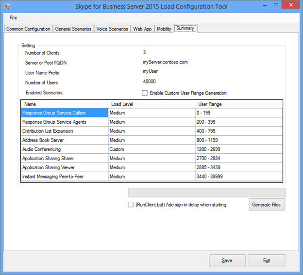

# <a name="using-the-skype-for-business-server-2015-stress-and-performance-tool"></a>使用 Skype for Business Server 2015 压力和性能工具
 
若要运行 Skype for Business Server 2015 压力和性能工具，需要能够管理用户、联系人和用户配置文件，配置运行工具，然后查看该工具生成的输出或结果。
  
运行 Skype for Business Server 2015 压力和性能工具涉及四个方面 (可执行文件LyncPerfTool.exe) ：
  
- [创建用户和联系人](using-the-tool.md#BKMK_CreateUsersAndContacts)
    
- [配置用户配置文件](using-the-tool.md#BKMK_UserProfile)
    
- [运行 LyncPerfTool](using-the-tool.md#BKMK_RunTool)
    
- [解释结果](using-the-tool.md#BKMK_Interpret)
    
## <a name="create-users-and-contacts"></a>创建用户和联系人
<a name="BKMK_CreateUsersAndContacts"> </a>

需要使用 Skype for Business Server 2015 (SB 2015) 用户预配工具 (UserProvisioningTool.exe) ，为压力和性能测试创建用户和联系人。
  
这是在阅读主题时可能有用的有用术语列表：
  
- **组织单位** - Active Directory 域服务 (AD DS) OU)  (组织单位。
    
- **联合/跨池** - 可以与其他即时消息 (即时消息) 服务的用户进行通信。
    
- **分发列表** - 或 DLL。 这些是 AD DS 中包含 AD DS 用户列表的对象。 它们用于促进人员组之间的通信。
    
- **位置信息服务** - Skype for Business Server 2015 服务，在每个手机启用和配置后，允许检索增强型 911 (E911) 服务的物理位置。
    
- **美国电话号码** - 电话分配给用户的数字，以及用于在反向号码查找 (RNL) 中路由入站和出站调用的 SIP URI。
    
### <a name="create-users-and-contacts-by-using-userprovisioningtoolexe"></a>使用UserProvisioningTool.exe创建用户和联系人

> [!NOTE]
> 在开始之前，请确保已以域管理员安全组的成员身份登录以运行此工具。 需要执行此操作，因为要创建 Active Directory 用户。 
  
必须使用Skype for Business Server用户预配工具创建用户和联系人以进行负载模拟。
  
**Skype for Business Server用户预配工具** 随 **Skype for Business Server压力和性能工具** 包一起安装。 请确保包安装程序 (CapacityPlanningTool.msi) 已在前端服务器或要测试的Standard Edition服务器上运行。
  
可以通过在前端服务器或Standard Edition服务器上运行位于 %InstalledDirectory%LyncStressAndPerfTool\LyncStress) 的文件UserProvisioningTool.exe (启动Skype for Business Server用户预配工具。
  
> [!IMPORTANT]
> 创建大量用户 (（例如，10，000 个或更多) ）时，请运行UserProvisioningTool.exe。 需要执行此操作，因为该工具将创建和配置  *新的*  AD 用户。
  
打开“用户预配工具”后，单击“配置”并选择“负载配置”。 
  
若要开始配置用户和联系人，请加载包中包含的默认文件，称为“SampleData.xml”。 这将预先填充需要更改的示例数据的字段，使其与部署相关。
  
如果有一个已包含自定义设置的预配置 XML 文件，则可以改为加载该文件。 填写“用户预配工具”中的字段，如以下部分所述。
  
### <a name="to-configure-server-options"></a>若要配置服务器选项，请执行以下操作：

1. 在前 **端池 FQDN** 字段中，键入完全限定的域名 (Standard Edition服务器的 FQDN) 或要在其中托管用户的前端池。
    
2. 在 **“用户名前缀** ”字段中，键入要用于中断用户名以进行测试的前缀， (如“TestUser”) 。
    
3. 在 **“密码** ”字段中，键入将在所有测试用户帐户中使用的密码。
    
4. 在 **“帐户域** ”字段中，键入当前 AD 域的域名 (要在其中创建测试用户的域名) 。
    
5. 在 **“组织单元”** 字段中，键入要在其中创建这些测试用户的 AD 域的名称。  (如果 OU 尚不存在，则会为你创建) 。
    
6. 在 **“电话区代码”** 字段中，键入要在所有测试用户帐户中使用的三位数区域代码。 确保所选的区域代码不会与其他用户在 AD 中的区域代码冲突。
    
7. 如果要为企业语音启用测试用户，请单击此选项选中 **“已启用语音**”复选框。
    
8. 在 **“用户数”** 字段中，提供要创建的测试用户总数。
    
9. 在 **"开始"菜单索引** 字段中，为将用作用户名前缀后缀的起始编号 (例如，前缀为“TestUser”，名字以下面的示例中的“0”结尾。) 
    
     
  
#### <a name="create-users-button"></a>“创建用户”按钮

单击“ **创建用户** ”按钮时，将验证输入的输入参数。 如果存在任何验证错误，系统会提示你修复这些错误。 或者，如果所有值都正确，则用户将开始出现在 AD (中，以你指定) 的 OU 为准。 在工具运行时，你将看到工具底部的进度栏。 在进度栏处于活动状态时，请勿关闭应用程序。
  
用户创建需要时间，因此请进行相应的计划。 对于大量用户，此过程可能需要几分钟，从几分钟到几个小时。
  
如果在测试环境中没有对 AD 域控制器的访问权限，仍可以通过登录为指定要创建的用户范围中的用户之一来验证用户创建。 请记得使用前缀和后缀，以及@sipDomain作为用户名。 下面是一个示例：  <em>TestUser20@contoso.net</em>  。
  
> [!NOTE]
> 如果用户已存在，单击“创建用户”按钮将使用任何配置更改更新用户。 
  
#### <a name="delete-users-button"></a>“删除用户”按钮

单击 **“删除用户** ”按钮时，将验证选项卡的输入参数。 如果存在验证错误，系统会提示你修复这些错误，如果输入值正确，则指定的测试用户将被禁用并从 Active Directory 中删除。 同样，此选项卡底部会显示一个进度栏，在进度栏处于活动状态时不应关闭应用程序。
  
> [!NOTE]
> 仅支持美国格式的电话号码。 电话号码始终分配给用户，并且默认情况下，UserProvisioningTool.exe创建的所有用户都已启用企业语音。 使用电话号码的任何方案（例如会议自动助理或 UC-PSTN 呼叫）都使用此电话号码正确路由呼叫。 因此，  *每个用户*  都必须有唯一 *的电话号码*  。
  
> [!NOTE]
> **如果必须创建两次用户，则命令将失败，除非你使用其他区域代码，或者之前的用户已使用Disable-CsUser cmdlet 禁用。**
  
> [!IMPORTANT]
> 在创建联系人之前，首先需要完成从“用户”选项卡) 完成的用户复制 (。 
  
> [!IMPORTANT]
> 如果刚刚创建了用户，则需要等到Skype for Business Server复制完成并填充数据库中的用户帐户。 **如果用户尚未完成复制，你将看到错误。** 如果 Skype for Business Server 2015 前端服务已启动，或者通过在指定总数的最后一个用户上成功运行Get-CsUser cmdlet，你将知道用户何时完成复制。
  
#### <a name="contacts-creation-tab"></a>“联系人创建”选项卡

此选项卡允许你为测试提供用户的联系人详细信息。
  

  
### <a name="to-configure-users-contacts-do-the-following"></a>若要配置用户的联系人，请执行以下操作：

1. 在 **“每个用户的平均联系人** ”字段中，输入要在每个用户的联系人列表中填充的平均联系人数。
    
2. 如果要为每个用户创建相同数量的联系人，请选中 **“固定** ”复选框。 如果要更改为用户创建的联系人数，请清除该复选框。
    
3. 在 **“每个用户的平均联系人组** ”字段中，输入每个用户的联系人组数。 此数字需要小于 **每个用户的平均联系人** 数。
    
4. 在 **联合/跨池联系人百分比** 字段中，提供介于 0 和 100 之间的数字。 此百分比的联系人将与联合用户一起创建。
    
5. 在 **联合/跨池用户前缀** 字段中，为将添加到本地用户的联系人列表的联合用户提供用户名。
    
6. 在 **联合/跨池用户 SIP 域** 字段中，为联合用户提供 SIP 域名。
    
7. 在 **“用户创建”** 选项卡中，请确保信息正确。 联系人将从“用户创建”选项卡上的值创建。
    
8. 单击 **“创建联系人** ”以开始创建联系人。 此过程可能需要几分钟时间。 完成后，将显示一个对话框，其中包含消息“已成功完成操作”。 可以验证通过登录为从“用户创建”选项卡创建的用户创建的联系人。
    
    > [!NOTE]
    > 创建联系人后，此工具将重启目标池中的所有前端服务器。 前端服务器可能需要更长 () 2 小时才能启动，具体取决于此操作创建的联系人数。 
  
#### <a name="distribution-list"></a>通讯组列表

Skype for Business Server 2015 压力和性能工具可以模拟 Skype for Business 2015 客户端中的分发列表 (DL) 扩展功能。 如果不打算在用户预配工具中启用 DL 扩展，则可以跳过此步骤。
  

  
“分发列表”选项卡允许创建压力和性能工具将用于分发列表扩展功能的 DLL。 在创建 DLL 之前，需要部署 Skype for Business Server 2015，包括运行 ForestPrep。 如果未完成此操作，则 AD 架构中将不存在 DL 属性，因此该工具将无法创建 DLL。
  
### <a name="to-configure-distribution-lists"></a>若要配置通讯组列表，请执行下列操作：

1. 在 **“通讯组列表数** ”字段中，提供要创建的 DLL 总数 (此处的建议是，从一个值开始，该值是你拥有的用户数的两倍。) 。
    
2. 在 **“分发列表前缀** ”字段中，输入你创建的所有 DLL 将具有的前缀，例如 *testDL*  。 这意味着，在 100 个 DLL 中，DL 名称将如下所示：testDL0、testDL1，最高可达 testDL99。
    
3. 在 **Dist 中的“最小成员”。列表** 字段中，输入要放入每个 DL 的最低用户数。
    
4. 在 **Dist 中的最大成员数。列表** 字段中，输入要在每个 DL 中添加的最大用户数。
    
#### <a name="create-distribution-lists-button"></a>“创建通讯组列表”按钮

单击“创建通讯组列表”按钮时，该工具将查询 Active Directory，以查看与前缀和数字匹配的通讯组列表是否已存在。 该工具创建尚不存在的任何 DLL。 将成员添加到这些新创建的通讯组列表时，它将从“用户创建”选项卡上指定的范围中选择用户。
  
#### <a name="location-info-service-config-tab"></a>“位置信息服务配置”选项卡

Skype for Business Server 2015 压力和性能工具还可以生成位置信息服务的虚拟配置文件。 请注意，位置信息服务通常不会对服务器产生显著的性能影响。 
  

  
如果选择测试此功能，请填写窗体中的值，然后单击“生成 LIS 配置文件”按钮，这将创建.CSV名为：
  
- LIS_Subnet.csv
    
- LIS_Switches.csv
    
- LIS_Ports.csv
    
- LIS_WAP.csv
    
若要将这些文件导入 LIS 数据库，请使用以下 PowerShell cmdlet：
  
- Set-CsLisSubnet
    
- Set-CsLisSwitch
    
- Set-CsLisPort
    
- Set-CsWirelessAccessPoint
    
## <a name="configure-user-profile"></a>配置用户配置文件
<a name="BKMK_UserProfile"> </a>

通过用户创建工具 (创建用户后) 可以使用 Skype for Business Server 2015 负载配置工具 (UserProfileGenerator.exe) 配置用户配置文件。
  
### <a name="running-the-skype-for-business-server-2015-load-configuration-tool"></a>运行 Skype for Business Server 2015 负载配置工具

"开始"菜单负载配置工具 (UserProfileGenerator.exe) 并填写选项卡。 此工具为运行模拟所需的每个客户端计算机创建一个目录。 每个客户端目录都附带一个脚本，用于启动 Skype for Business Server 2015 压力和性能工具 (LyncPerfTool.exe) 。 以下部分将提供有关如何在 Skype for Business Server 2015 负载配置工具的每个选项卡上填写字段的示例。
  
> [!IMPORTANT]
> 负载配置工具 (UserProfileGenerator.exe) 中使用的特定于用户的值必须与池的 Skype for Business Server 2015 用户创建工具 (UserProvisioningTool.exe) 中指定的值匹配。 
  
#### <a name="common-configuration-tab"></a>“常见配置”选项卡

“负载配置工具的 **常见配置** ”选项卡如下所示。 填写“通用配置”选项卡的字段，如以下步骤中所述。
  

  
1. 在 **“可用计算机数”** 字段中，键入要用于运行压力和性能工具 (LyncPerfTool.exe) 的计算机数。 建议为要模拟的每个 4500 个用户使用一台计算机，但如果降低负载级别，该数字可能会有所不同，或者仅使用工具可用功能的子集 (“常规方案”选项卡) 上设置负载级别。
    
2. 在 **“用户名”字段的前缀** 中，输入所有用户的用户名字段的前缀。 若要登录统一资源标识符 (URI) 将是：*UserPrefix[用户"开始"菜单索引... (用户数-1) ]@User域*，例如 myUser009@Contoso.com。
    
3. 在 **“所有用户的密码”** 字段中，输入创建用户期间使用的密码。 如果将此字段留空，则用户名将设置为密码。
    
4. 在 **“用户"开始"菜单索引**”字段中，输入要配置的第一个用户的索引。 可以为不同类型或负载级别配置不同的范围，但必须根据要配置的范围运行一次负载配置工具 (UserProfileGenerator.exe) 。
    
5. 在 **“用户数”** 字段中，输入要配置的用户总数。
    
6. 在 **“用户域** ”字段中，输入用于 SIP URI 的域。 这用于构造每个用户的 SIP URI，以便登录到 Skype for Business Server 2015 前端服务器或Standard Edition服务器，并且可能与帐户域不同。
    
7. 在 **“帐户域** ”字段中，输入 AD DS 域登录。
    
8. 在 **MPOP 百分比** (多点状态百分比) 字段中，为从多台计算机或设备登录的用户百分比提供值，例如 10%。
    
9. **在每个实例) 字段的“每秒登录” (** 中输入最大并发终结点数。 这是用户的最大登录次数，建议的速率小于/等于每秒 2 (<=2) 。
    
10. 在 **“访问代理”或“池 FQDN”** 字段中，输入要将客户端连接到的服务器的完全限定域名 (FQDN) 。 如果用户在外部登录，则需要键入访问代理。 如果用户是内部用户，请提供其Enterprise池或Standard Edition服务器的 FQDN。
    
11. 在 **“端口** ”字段中，输入希望用户用于 SIP 的端口 (此处的默认值为 5061) 。
    
12. 对于 **外部网络服务器设置** 字段，请提供访问代理或池 FQDN，并再次提供 **端口**。 这些设置仅用于外部终结点负载模拟。
    
#### <a name="general-scenarios-tab"></a>“常规方案”选项卡


  
可以通过确定要运行或禁用的内容来配置每个常规方案的负载级别和参数。 下面是常规选项：
  
> [!NOTE]
> 除本地信息服务之外的所有字段的负载级别值为 **“禁用**”、“**低**”、“**中**”、“高”或 **“****自定义**”。 如果选择任何设置但已禁用，则会为每个客户端生成配置。 高生成服务器上支持的最大负载;中等负载占高负载的 60%：低值为 30%。 
  
- **即时消息 -** 这包括对等会议和会议;选择负载级别的相应值。
    
- **音频会议 -** *仅* 为音频会议选择负载级别。 稍后将在 **“语音方案** ”部分处理对等呼叫。 打开 **“高级** ”选项卡以启用 MultiView。
    
- **应用程序共享 -** 选择应用程序共享的负载级别。
    
- **数据协作 -** 为数据协作选择负载级别，其中包括数据会议。
    
- **分发列表扩展 -** 单击 **“高级** ”按钮，并在“用户创建工具” (UserProvisioningTool.exe“) 的”DL“选项卡上使用相同的值填充字段。 选择负载级别。
    
- **通讯簿 Web 查询 -** 这是通讯簿查找服务，而不是通讯簿文件下载。 如果要为通讯簿文件下载启用此功能，请单击 **“高级** ”按钮并将 **EnableABSDownload** 设置为 True。 为负载级别提供一个值。
    
- **响应组服务 -** 单击 **“高级** ”按钮，并指定预配响应组服务代理时已创建的响应组的 URI。 必须至少选择一个响应组。 若要使用更多信息，请使用分号分隔响应组。 将 **RGSUriSuffixStartIndex** 和 **RGSUriSuffixEndIndex** 更新为实际值。 选择负载级别。
    
- **位置信息服务 -** 选择“已启用”或“已禁用”的负载级别。
    
> [!NOTE]
> 每个方案旁边都有一个“高级”按钮，以及一组启用默认设置变体的复选框。 
  
- 选择  *“临时*  ”将允许该工具生成整个小时将创建的会议模拟。
    
- 选择  *大型 Conf*  意味着将模拟大型会议方案。
    
-  *外部*  指示该工具还模拟外部用户。
    
这些按钮和复选框是特定于每个方案的额外值，将更改压力和性能工具的行为，并使自定义成为可能。
  
对于“常规方案”选项卡 (除位置信息服务) 之外的每个方案，如果负载级别的值为 **“自定义**”，则会使用“高级”对话框中的相应字段计算会话速率。 字段名称可能有所不同，具体取决于方案，但字段说明会显示：  *请注意，仅当从下拉菜单中选择“自定义”时，才会使用此数字*  。
  
**值“高**”、“**中**”和“**低**”将根据用户模型更改每种模式的会话速率，该模式是所有方案的平衡。 如果由于预期使用率的差异而需要更改每个模式的负载级别，请使用自定义会话速率。
  
#### <a name="voice-scenarios-tab"></a>“语音方案”选项卡

这是配置所有与语音相关的方案的选项卡。
  

  
可用的选项包括：
  
- **VoIP -** 单击 **“高级** ”按钮并添加 PhoneAreaCode 和 LocationProfile (拨号计划) 字段的值。 你还将为负载级别提供一个值。 如果为启用了 VoIP 或 UC/PSTN 网关选择负载级别，则会生成公共交换电话网络 (PSTN) 到统一通信 (UC) 配置文件，以模拟外部呼叫。
    
- **UC/PSTN 网关 -** 需要选择负载级别值，选择“已禁用”以外的任何值时，还必须单击“ **高级** ”按钮为 PSTN 区域代码提供值。 单击中介服务器和 PSTN 下的 **“添加** ”。 请确保为区域代码配置了路由。
    
    > [!TIP]
    > 可以使用 Skype for Business 控制面板 或 Skype for Business Management Shell 来验证语音路由配置。 
  
- **会议助理 -** 提供负载级别的值。 除“已禁用”之外的任何值都将启用 **“电话号码** ”字段。 输入要使用的自动助理的电话号码。 单击 **“高级** ”并为 **LocationProfile** 字段提供值。
    
- **呼叫停车服务 -** 在这里，提供负载级别。
    
- **中介服务器和 PSTN -** 要使用的每个中介服务器都需要自己的 PSTN 模拟器。 确定要用于模拟器的客户端后，请将中介服务器配置为将调用路由到你配置的 PSTN 模拟器上的该计算机。 单击 **“添加** ”按钮可配置中介服务器的值。
    
    > [!NOTE]
    > 每个方案旁边都有一个“高级”按钮。 高级对话框包含特定于每个方案的设置，这些设置可更改压力和性能工具的行为并启用自定义。 > 对于“语音方案”选项卡上的每个方案，如果负载级别的值为 **“自定义**”，则会使用“高级”对话框中的相应字段计算会话速率。 字段名称可能有所不同，具体取决于方案，但字段说明会显示：  *请注意，仅当从下拉菜单中选择“自定义”时，才会使用此数字*  。
  
#### <a name="web-app-tab"></a>“Web 应用”选项卡


  
Web 应用通过安装在前端服务器上的统一通信 Web API (UCWA) 服务器支持会议方案。 使用“Web 应用”选项卡配置所有与 Web 应用相关的方案。 选项有：
  
- **常规 Web 应用设置 -** 单击 **“附加设置**”按钮并将 **ReachTargetServerUrl** 设置为前端池 VIP 的目录池虚拟 IP (VIP) 。
    
- **应用程序共享 -** 为负载级别选择一个值。
    
- **数据协作 -** 为负载级别选择一个值。
    
- **即时消息 -** 为负载级别选择一个值。
    
- **语音会议 -** 为负载级别选择一个值。
    
> [!NOTE]
> 每个方案旁边都有一个 **“高级** ”按钮。 高级对话框包含特定于每个方案的值，这些值将更改压力和性能工具的行为并启用自定义。>对于每个 Web 应用方案，如果负载级别为 **“自定义**”，则使用 **对话器和性能工具** 字段中指定的值，而不是默认值。
  
#### <a name="mobility-tab"></a>“移动性”选项卡

使用此选项卡可配置所有与移动性相关的方案。
  

  
下面的选项包括：
  
- **常规移动性设置 -** 单击 **“其他设置**”并将字段 UcwaTargetServerUrl 设置为 Director Pool 虚拟 IP (VIP) 或前端池 VIP。
    
- **状态和 P2P 即时消息/音频 -** 选择负载级别的值以启用移动模拟。
    
> [!NOTE]
> 每个方案旁边都有一个 **“高级** ”按钮。 高级对话框包含特定于每个方案的值，这些值将更改压力和性能工具的行为并启用自定义。>对于每个移动方案，如果负载级别为 **“自定义**”，则使用 **ConversationsPerHour** 字段中指定的值而不是默认值。
  
#### <a name="summary-tab"></a>“摘要”选项卡

“摘要”选项卡指示要用于每个方案的用户。
  

  
“摘要”选项卡指示要用于每个方案的用户。 
  
可以通过选中 **“启用自定义用户范围生成** ”复选框手动配置用户编号范围，然后双击表中包含要自定义的用户范围的方案。
  
检查 **(RunClient.bat) 启动时添加登录延迟** ，以便在生成的批处理文件中包含与登录速率相对应的延迟。 这对于在登录大量用户时防止服务器重载非常有用。
  
单击 **“生成文件** ”，然后选择要在其中生成配置的文件夹。 成功创建文件后，将显示一个对话框。
  

  
## <a name="run-lyncperftool"></a>运行 LyncPerfTool
<a name="BKMK_RunTool"> </a>

运行 Skype for Business Server 2015 压力和性能工具 (LyncPerfTool.exe) 之前，需要创建用户、联系人和方案。 有关使用工具执行这些操作的详细信息，请参阅本文前面的 [“创建用户和联系人](using-the-tool.md#BKMK_CreateUsersAndContacts) ”和 [“配置用户配置文件](using-the-tool.md#BKMK_UserProfile) ”。 运行这些工具还会生成一个文件，该文件将使用压力和性能工具作为包含所需参数的批处理文件的一部分运行。
  
### <a name="running-the-skype-for-business-server-2015-stress-and-performance-tool"></a>运行 Skype for Business Server 2015 压力和性能工具

负载配置工具 (UserProfileGenerator.exe) 创建一个批处理文件，通过注册性能计数器并加载 XML 配置文件，可以运行压力和性能工具 (LyncPerfTool.exe) 。 批处理文件运行每个配置文件LyncPerfTool.exe一个实例。 若要运行批处理文件，请执行以下步骤：
  
### <a name="run-the-stress-and-performance-test"></a>运行压力和性能测试

1. 将包含配置文件夹和文件的文件夹复制到每个客户端计算机上LyncPerfTool.exe的目录。  (例如，如果在名为 1.28_13.16.16 的文件夹中生成了配置文件，请将该文件夹复制到文件夹，其中包含LyncPerfTool.exe。 在每个客户端上执行此操作。) 
    
2. 导航到客户端文件夹并运行 **RunClient** 批处理脚本。 可以双击Windows资源管理器中的批处理文件，并运行该客户端的所有配置文件。 还可以使用以下语法从客户端文件夹运行脚本：
    
   ```console
   RunClient0.bat "C:\Program Files\Skype for Business Server 2015\LyncStressAndPerfTool\LyncStress" 
   ```

若要直接运行压力和性能工具，请在命令行 (打开命令提示符并键入以下命令;首次执行此操作时，请务必注册性能计数器  `regsvr32 /i /n /s LyncPerfToolPerf.dll`，如本主题后面的说明中所示) ：
  
```console
LyncPerfTool.exe /file:IM_client0.xml
```

若要让工具在配置文件中显示值，请在前面的命令中包含  `/displayfile` 参数，以便如下所示：
  
```console
LyncPerfTool.exe /file:IM_client0.xml /displayfile
```

若要  *结束*  此过程，请按 Ctrl+C。
  
> [!NOTE]
> 在直接运行压力和性能工具之前，必须通过以下命令注册性能计数器：  `regsvr32 /i /n /s LyncPerfToolPerf.dll`
  
> [!NOTE]
> 启动的压力和性能工具的每个实例将立即开始登录用户，通常以每秒一个用户的速度登录。 
  
池的峰值用户登录速率约为每秒 12 次。 这意味着在用户仍在登录时，不应同时启动超过 12 个LyncPerfTool.exe实例。 一千名用户大约需要 20 分钟才能以每秒 1 次的速度完全登录。
  
## <a name="interpreting-the-results"></a>解释结果
<a name="BKMK_Interpret"> </a>

Skype for Business Server 2015 压力和性能工具具有许多计数器，可帮助你了解客户端正在执行的操作，以及客户端是否遇到问题。
  
### <a name="client-counters"></a>客户端计数器

运行LyncPerfTool.exe的每个实例都有一个单独的计数器实例。 每个实例都按其进程 ID 命名。 如果客户端重载，则可能会出现其他问题。 若要防止出现这些问题，请执行以下操作：
  
- 监视客户端计算机上的 CPU 和内存使用情况。 如果 CPU 始终高于 90%，请减少用户数。
    
- 当内存占用量较高时，如果页面文件开始耗尽空间，可能会遇到问题。 验证提交费用是否未达到计算机上的限制。 如果遇到内存限制，请考虑增加页面文件大小或减少用户数。
    
下面是关键性能计数器的列表：
  
**常规信息**

|**性能计数器**|**说明**|
|:-----|:-----|
|花费的时间（以分钟为单位）  <br/> |此过程启动后所用的时间。  <br/> |
|活动终结点  <br/> |当前连接到服务器的终结点数。  <br/> |
|登录失败  <br/> |终结点登录失败总数。  <br/> |
|登录尝试  <br/> |终结点登录尝试总数。  <br/> |
|已断开连接的终结点  <br/> |已断开连接的终结点总数。  <br/> |
   
**状态信息**

|**性能计数器**|**说明**|
|:-----|:-----|
|SetPresence 调用  <br/> |状态更改尝试总数。 有关不同类型的状态更改，请参阅 SetPresence (状态类型) 调用性能计数器。  <br/> |
|SetPresence 的 NNN 响应  <br/> |从服务器收到的 nnn 响应代码总数。  <br/> |
|GetPresence 调用  <br/> |获取状态请求尝试总数。  <br/> |
|GetPresence 的 NNN 响应  <br/> |从服务器收到的 nnn 响应代码总数。  <br/> |
   
**通讯簿服务信息**

|**性能计数器**|**说明**|
|:-----|:-----|
|ABS 完整/增量文件下载尝试  <br/> |尝试的完整或增量文件下载请求总数。  <br/> |
|ABS 完整/增量文件下载成功  <br/> |尝试的完整或增量文件下载请求总数。  <br/> |
|通讯簿 Web 查询服务相关计数器  <br/> |通讯簿文件下载相关计数器。  <br/> |
|尝试的 ABS WS 调用  <br/> |尝试的通讯簿 Web 查询服务请求总数。  <br/> |
|ABS WS 调用成功  <br/> |返回成功响应代码的通讯簿 Web 查询服务请求总数。  <br/> |
|ABS WS 调用失败  <br/> |返回错误响应代码的通讯簿 Web 查询服务请求总数。  <br/> |
   
> [!NOTE]
> 此类别包括用于监视通讯簿服务 (ABS) 文件下载和通讯簿 Web 查询服务请求的计数器。 
  
**DL) 信息 (分发列表**

|**性能计数器**|**说明**|
|:-----|:-----|
|尝试调用  <br/> |尝试 (DLX) Web 服务请求的分发列表扩展总数。  <br/> |
|调用成功  <br/> |返回成功响应代码的 DLX Web 服务请求总数。  <br/> |
|调用失败  <br/> |返回错误响应代码的 DLX Web 服务请求总数。  <br/> |
   

  
> [!NOTE]
> 启用这些方案时，下面列出的所有语音 (VoIP) 调用的性能计数器，包括调用中介服务器、A/V 会议服务器、边缘服务器、响应组应用程序和会议自动助理。 
  
**VoIP 基本信息**

|**性能计数器**|**说明**|
|:-----|:-----|
|呼叫活动  <br/> |当前正在进行的传入/传出语音呼叫总数。  <br/> |
|呼叫已终止  <br/> |已终止的传入/传出语音呼叫总数。  <br/> |
|呼叫被拒绝  <br/> |传入语音呼叫总数下降。  <br/> |
|尝试传入/传出呼叫  <br/> |尝试的传入/传出语音呼叫总数。  <br/> |
|已建立传入/传出调用  <br/> |已建立的传入/传出语音呼叫总数。  <br/> |
|收到的 NNN 呼叫  <br/> |从服务器收到的 nnn 响应代码总数。  <br/> |
|VoIP 传递率 (%)   <br/> |已建立的呼叫总数/尝试的呼叫总数。  <br/> |
   
**响应组服务呼叫信息**

|**性能计数器**|**说明**|
|:-----|:-----|
|呼叫活动  <br/> |响应组应用程序的活动调用总数。  <br/> |
|尝试调用  <br/> |尝试的呼叫总数。  <br/> |
   
**即时消息 (即时消息) 呼叫信息**

|**性能计数器**|**说明**|
|:-----|:-----|
|呼叫活动  <br/> |正在进行的传入/传出即时消息呼叫总数。  <br/> |
|呼叫已终止  <br/> |已终止的传入/传出即时消息调用总数。  <br/> |
|收到的 NNN 呼叫  <br/> |从服务器收到的 nnn 响应代码总数。  <br/> |
|接收/发送的 IM 消息  <br/> |所有会话接收或发送的消息总数。  <br/> |
|尝试传入/传出呼叫  <br/> |尝试的传入/传出即时消息呼叫总数。  <br/> |
|已建立传入/传出调用  <br/> |已建立的传入/传出即时消息调用总数。  <br/> |
   
**应用共享呼叫信息**

|**性能计数器**|**说明**|
|:-----|:-----|
|呼叫活动  <br/> |正在进行的传入/传出应用程序共享调用总数。  <br/> |
|呼叫已终止  <br/> |已终止的传入/传出应用程序共享调用总数。  <br/> |
|收到的 NNN 呼叫  <br/> |从服务器收到的 nnn 响应代码总数。  <br/> |
|尝试传入/传出呼叫  <br/> |尝试的传入/传出应用程序共享调用总数。  <br/> |
|已建立传入/传出调用  <br/> |已建立的传入/传出应用程序共享调用总数。  <br/> |
   
**CAA 呼叫信息**

|**性能计数器**|**说明**|
|:-----|:-----|
|呼叫活动  <br/> |目前， (PSTN) 呼叫的传入/传出公用电话网络总数正在进行中。  <br/> |
|呼叫已终止  <br/> |传入/传出 PSTN 调用总数已终止。  <br/> |
|尝试传入/传出呼叫  <br/> |尝试的传入/传出 PSTN 调用总数。  <br/> |
|已建立传入/传出调用  <br/> |已建立的传入/传出 PSTN 调用总数。  <br/> |
   
**会议信息**

|**性能计数器**|**说明**|
|:-----|:-----|
|活动即时消息会议  <br/> |正在进行的即时消息会议总数。  <br/> |
|活动音频/视频会议  <br/> |正在进行的音频/视频 (A/V) 会议总数。  <br/> |
|活动应用程序共享会议  <br/> |正在进行的应用程序共享会议总数。  <br/> |
|参与者数  <br/> |当前连接到会议的参与者总数。  <br/> |
|会议日程安排失败  <br/> |尝试安排会议时的故障总数。  <br/> |
|加入会议失败  <br/> |尝试连接到会议时的故障总数。  <br/> |
   
**UCWA 客户端计数器**

|**性能计数器**|**说明**|
|:-----|:-----|
|IMMCU 联接总数成功  <br/> |加入的即时消息会议总数。  <br/> |
|DMCU 联接总数成功  <br/> |已加入的 A/V 会议总数。  <br/> |
   

