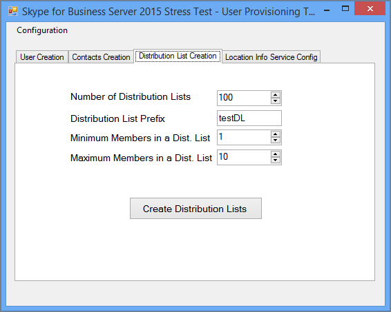
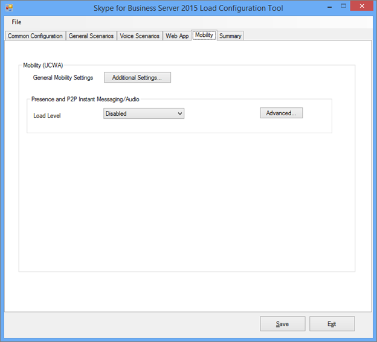

# <a name="using-the-skype-for-business-server-2015-stress-and-performance-tool"></a><span data-ttu-id="afc71-103">使用 Skype for Business Server 2015 压力和性能工具</span><span class="sxs-lookup"><span data-stu-id="afc71-103">Using the Skype for Business Server 2015 Stress and Performance Tool</span></span>
 
<span data-ttu-id="afc71-104">若要运行 Skype for Business Server 2015 压力和性能工具，你需要能够管理用户、联系人和用户配置文件，配置该工具以运行，然后查看该工具产生的输出或结果。</span><span class="sxs-lookup"><span data-stu-id="afc71-104">To run the Skype for Business Server 2015 Stress and Performance Tool, you'll need to be able to manage both users, contacts and user profiles, configure the tool for running, and then review the output or results that are produced by the tool.</span></span>
  
<span data-ttu-id="afc71-105">运行 Skype for Business Server 2015 压力和性能工具涉及四个方面 (可执行文件LyncPerfTool.exe) ：</span><span class="sxs-lookup"><span data-stu-id="afc71-105">There are four areas involved with running the Skype for Business Server 2015 Stress and Performance Tool (the executable is LyncPerfTool.exe):</span></span>
  
- [<span data-ttu-id="afc71-106">创建用户和联系人</span><span class="sxs-lookup"><span data-stu-id="afc71-106">Create Users and Contacts</span></span>](using-the-tool.md#BKMK_CreateUsersAndContacts)
    
- [<span data-ttu-id="afc71-107">配置用户配置文件</span><span class="sxs-lookup"><span data-stu-id="afc71-107">Configure User Profile</span></span>](using-the-tool.md#BKMK_UserProfile)
    
- [<span data-ttu-id="afc71-108">运行 LyncPerfTool</span><span class="sxs-lookup"><span data-stu-id="afc71-108">Run LyncPerfTool</span></span>](using-the-tool.md#BKMK_RunTool)
    
- [<span data-ttu-id="afc71-109">解释结果</span><span class="sxs-lookup"><span data-stu-id="afc71-109">Interpreting the Results</span></span>](using-the-tool.md#BKMK_Interpret)
    
## <a name="create-users-and-contacts"></a><span data-ttu-id="afc71-110">创建用户和联系人</span><span class="sxs-lookup"><span data-stu-id="afc71-110">Create Users and Contacts</span></span>
<span data-ttu-id="afc71-111"><a name="BKMK_CreateUsersAndContacts"> </a></span><span class="sxs-lookup"><span data-stu-id="afc71-111"><a name="BKMK_CreateUsersAndContacts"> </a></span></span>

<span data-ttu-id="afc71-112">你需要使用 Skype for Business Server 2015 (SB 2015) 用户预配工具 (UserProvisioningTool.exe) 为压力和性能测试创建用户和联系人。</span><span class="sxs-lookup"><span data-stu-id="afc71-112">You need to use the Skype for Business Server 2015 (SB 2015) User Provisioning Tool (UserProvisioningTool.exe) to create users and contacts for your stress and performance testing.</span></span>
  
<span data-ttu-id="afc71-113">这是在阅读主题时可能很有用的有用术语列表：</span><span class="sxs-lookup"><span data-stu-id="afc71-113">This is a list of helpful terms that might be useful as you read through the topics:</span></span>
  
- <span data-ttu-id="afc71-114">**组织单位** - Active Directory 域服务 (OU) 组织单位 (AD DS) 。</span><span class="sxs-lookup"><span data-stu-id="afc71-114">**Organizational Unit** - The Active Directory Domain Services (AD DS) organizational unit (OU).</span></span>
    
- <span data-ttu-id="afc71-115">**联合/跨池** - 可以与其他即时消息服务中的用户通信的用户 (IM) 服务。</span><span class="sxs-lookup"><span data-stu-id="afc71-115">**Federated / Cross Pool** - Users who can communicate with users from other Instant Messaging (IM) services.</span></span>
    
- <span data-ttu-id="afc71-116">**通讯组列表** - 或 DLS。</span><span class="sxs-lookup"><span data-stu-id="afc71-116">**Distribution Lists** - Or DLs.</span></span> <span data-ttu-id="afc71-117">这些对象是 AD DS 中包含 AD DS 用户列表的对象。</span><span class="sxs-lookup"><span data-stu-id="afc71-117">These are objects in AD DS that contain a list of AD DS users.</span></span> <span data-ttu-id="afc71-118">它们用于促进各组人员之间的通信。</span><span class="sxs-lookup"><span data-stu-id="afc71-118">They're used to facilitate communications across groups of people.</span></span>
    
- <span data-ttu-id="afc71-119">**位置信息** 服务 - Skype for Business Server 2015 服务，在按电话启用和配置该服务时，允许检索增强型 911 (E911) 服务的物理位置。</span><span class="sxs-lookup"><span data-stu-id="afc71-119">**Location Info Service** - The Skype for Business Server 2015 service that, when it's enabled and configured per phone, allows for the retrieval of physical location for Enhanced 911 (E911) services.</span></span>
    
- <span data-ttu-id="afc71-120">**美国** 电话号码 - 分配给用户的电话号码以及用于路由反向号码查找 RNL 呼叫中的入站和出站呼叫的 SIP URI (RNL) 。</span><span class="sxs-lookup"><span data-stu-id="afc71-120">**U.S. Phone Numbers** - Phone numbers assigned to user in addition to the SIP URI that's used for routing inbound and outbound calls in Reverse Number Lookup (RNL).</span></span>
    
### <a name="create-users-and-contacts-by-using-userprovisioningtoolexe"></a><span data-ttu-id="afc71-121">使用"用户"和"联系人"UserProvisioningTool.exe</span><span class="sxs-lookup"><span data-stu-id="afc71-121">Create Users and Contacts by using UserProvisioningTool.exe</span></span>

> [!NOTE]
> <span data-ttu-id="afc71-122">在开始之前，请务必确保以 Domain Admins 安全组的成员身份登录以运行此工具。</span><span class="sxs-lookup"><span data-stu-id="afc71-122">Before you even begin, be absolutely sure you're logged in as a member of the Domain Admins security group to run this tool.</span></span> <span data-ttu-id="afc71-123">需要这样做，因为您将创建 Active Directory 用户。</span><span class="sxs-lookup"><span data-stu-id="afc71-123">You need to do this, because you're going to be creating Active Directory users.</span></span> 
  
<span data-ttu-id="afc71-124">你必须使用 Skype for Business Server 用户预配工具创建用于负载模拟的用户和联系人。</span><span class="sxs-lookup"><span data-stu-id="afc71-124">You have to use the Skype for Business Server User Provisioning Tool to create users and contacts for load simulation.</span></span>
  
<span data-ttu-id="afc71-125">Skype **for Business Server 用户预配工具** 随 **Skype for Business Server 压力和性能工具包一起** 安装。</span><span class="sxs-lookup"><span data-stu-id="afc71-125">The **Skype for Business Server User Provisioning Tool** is installed with the **Skype for Business Server Stress and Performance Tool** package.</span></span> <span data-ttu-id="afc71-126">请确保程序包安装程序 (CapacityPlanningTool.msi) 已在要测试的前端服务器或 Standard Edition 服务器上运行。</span><span class="sxs-lookup"><span data-stu-id="afc71-126">Be sure that the package installer (CapacityPlanningTool.msi) has been run on the Front End Server or the Standard Edition server you intend to test.</span></span>
  
<span data-ttu-id="afc71-127">可以通过在前端服务器或 Standard Edition 服务器上运行位于 %InstalledDirectory%LyncStressAndPerfTool\LyncStress) 中的文件 UserProvisioningTool.exe (来启动 Skype for Business Server 用户预配工具。</span><span class="sxs-lookup"><span data-stu-id="afc71-127">You can start the Skype for Business Server User Provisioning Tool by running the file UserProvisioningTool.exe (located at %InstalledDirectory%LyncStressAndPerfTool\LyncStress) on the Front End Server or on the Standard Edition server.</span></span>
  
> [!IMPORTANT]
> <span data-ttu-id="afc71-128">创建大量用户时 (，例如，10，000) ，请运行UserProvisioningTool.exe。</span><span class="sxs-lookup"><span data-stu-id="afc71-128">When you create a large number of users (for example, 10,000 or more), run the UserProvisioningTool.exe.</span></span> <span data-ttu-id="afc71-129">你将需要这样做，因为该工具将创建  *和配置新的*  AD 用户。</span><span class="sxs-lookup"><span data-stu-id="afc71-129">You'll need to do this because the tool will be creating and configuring  *new*  AD users.</span></span>
  
<span data-ttu-id="afc71-130">When the User Provisioning Tool opens， click Configuration and select the Load Configuration.</span><span class="sxs-lookup"><span data-stu-id="afc71-130">When the User Provisioning Tool opens, click Configuration and select the Load Configuration.</span></span> 
  
<span data-ttu-id="afc71-131">若要开始配置用户和联系人，请加载程序包中包含的默认文件，称为"SampleData.xml"。</span><span class="sxs-lookup"><span data-stu-id="afc71-131">To begin configuring users and contacts, load the default file included with the package, called "SampleData.xml".</span></span> <span data-ttu-id="afc71-132">这将使用需要更改的示例数据预填充字段，使其与部署相关。</span><span class="sxs-lookup"><span data-stu-id="afc71-132">This will prepopulate fields with sample data that you'll need to change to make it relevant for your deployment.</span></span>
  
<span data-ttu-id="afc71-133">如果您具有已包含自定义设置的预配置 XML 文件，您可以改为加载该文件。</span><span class="sxs-lookup"><span data-stu-id="afc71-133">If you have a preconfigured XML file that already contains your customized settings, you can load that file instead.</span></span> <span data-ttu-id="afc71-134">填写用户预配工具中的字段，如以下各节所述。</span><span class="sxs-lookup"><span data-stu-id="afc71-134">Fill in the fields in the User Provisioning Tool, as described in the sections below.</span></span>
  
### <a name="to-configure-server-options"></a><span data-ttu-id="afc71-135">配置服务器选项：</span><span class="sxs-lookup"><span data-stu-id="afc71-135">To configure server options:</span></span>

1. <span data-ttu-id="afc71-136">在前端池 **FQDN** 字段中，键入 Standard Edition server 的完全限定域名 (FQDN) 或要承载用户的前端池。</span><span class="sxs-lookup"><span data-stu-id="afc71-136">In the **Front End Pool FQDN** field, type the fully qualified domain name (FQDN) of the Standard Edition server, or the Front End pool where you want to host the users.</span></span>
    
2. <span data-ttu-id="afc71-137">在 **"用户名前缀** "字段中，键入要用于设置用户名的前缀， ("TestUser") 。</span><span class="sxs-lookup"><span data-stu-id="afc71-137">In the **User Name Prefix** field, type a prefix that you want to use to bust your user names for testing purposes (such as "TestUser").</span></span>
    
3. <span data-ttu-id="afc71-138">在 **"密码** "字段中，键入将用于所有测试用户帐户的密码。</span><span class="sxs-lookup"><span data-stu-id="afc71-138">In the **Password** field, type a password that will be used across all the test user accounts.</span></span>
    
4. <span data-ttu-id="afc71-139">在 **"帐户** 域"字段中，键入当前 AD (要创建测试用户的域名) 。</span><span class="sxs-lookup"><span data-stu-id="afc71-139">In the **Account Domain** field, type the domain name of your current AD domain (the one in which you want to create your test users).</span></span>
    
5. <span data-ttu-id="afc71-140">在 **"组织单位"** 字段中，键入要创建这些测试用户的 AD 域的名称。</span><span class="sxs-lookup"><span data-stu-id="afc71-140">In the **Organizational Unit** field, type the name of the AD domain where you want to create these test users.</span></span> <span data-ttu-id="afc71-141"> (如果 OU 不存在，系统将会为用户创建) 。</span><span class="sxs-lookup"><span data-stu-id="afc71-141">(If the OU doesn't already exist, it'll be created for you).</span></span>
    
6. <span data-ttu-id="afc71-142">在 **"电话区代码"** 字段中，键入要在所有测试用户帐户中使用的三位数区号。</span><span class="sxs-lookup"><span data-stu-id="afc71-142">In the **Phone Area Code** field, type the three-digit area code to be used across all test user accounts.</span></span> <span data-ttu-id="afc71-143">确保你选择的区号不会与 AD 中其他用户的区号冲突。</span><span class="sxs-lookup"><span data-stu-id="afc71-143">Make certain that the area code you chose doesn't conflict with other users' area codes in AD.</span></span>
    
7. <span data-ttu-id="afc71-144">如果要 **为测试用户** 启用语音，请单击"启用语音"复选框企业语音。</span><span class="sxs-lookup"><span data-stu-id="afc71-144">Click to select the **Voice Enabled** check box, if you want to enable the test users for Enterprise Voice.</span></span>
    
8. <span data-ttu-id="afc71-145">在 **"用户数"** 字段中，提供要创建的测试用户的总数。</span><span class="sxs-lookup"><span data-stu-id="afc71-145">In the **Number of Users** field, give the total number of test users you want to create.</span></span>
    
9. <span data-ttu-id="afc71-146">在 **"** 开始索引"字段中，将用作用户名前缀后缀的起始号码赋予 (例如，前缀为"TestUser"，在下面的示例中，名字以"0"结尾。) </span><span class="sxs-lookup"><span data-stu-id="afc71-146">In the **Start Index** field, give the starting number that'll be used as a suffix to the user name prefix (for example, the prefix is "TestUser", and the first name will end in "0" in the example below.)</span></span>
    
     
  
#### <a name="create-users-button"></a><span data-ttu-id="afc71-148">创建用户按钮</span><span class="sxs-lookup"><span data-stu-id="afc71-148">Create Users button</span></span>

<span data-ttu-id="afc71-149">单击"创建 **用户"** 按钮时，将验证您输入的输入参数。</span><span class="sxs-lookup"><span data-stu-id="afc71-149">When you click on the **Create Users** button, the input parameters you've entered are validated.</span></span> <span data-ttu-id="afc71-150">如果有任何验证错误，系统将提示你修复这些错误。</span><span class="sxs-lookup"><span data-stu-id="afc71-150">If there are any validation errors, you'll be prompted to fix them.</span></span> <span data-ttu-id="afc71-151">或者，如果所有值都正确，用户将在你指定的任何 OU 中 (AD) 。</span><span class="sxs-lookup"><span data-stu-id="afc71-151">Or, if all the values are correct, users will start appearing in AD (in whichever OU you specified).</span></span> <span data-ttu-id="afc71-152">在工具运行时，你将在工具底部看到一个进度栏。</span><span class="sxs-lookup"><span data-stu-id="afc71-152">You'll see a progress bar at the bottom of the tool as it runs.</span></span> <span data-ttu-id="afc71-153">当进度栏处于活动状态时，不要关闭应用程序。</span><span class="sxs-lookup"><span data-stu-id="afc71-153">Don't close the application while the progress bar is active.</span></span>
  
<span data-ttu-id="afc71-154">用户创建需要时间，因此请进行相应的规划。</span><span class="sxs-lookup"><span data-stu-id="afc71-154">User creation takes time, so please plan accordingly.</span></span> <span data-ttu-id="afc71-155">对于少数用户，此过程可能需要几分钟，对于大量用户，此过程可能需要几个小时。</span><span class="sxs-lookup"><span data-stu-id="afc71-155">This process can take anywhere from several minutes for a few users, to a few hours for a large number of users.</span></span>
  
<span data-ttu-id="afc71-156">如果您无法访问测试环境中 AD 域控制器，您仍可以通过以指定要创建的用户范围中的用户之一登录来验证用户创建。</span><span class="sxs-lookup"><span data-stu-id="afc71-156">If you don't have access to the AD Domain Controller in your test environment, you can still validate user creation by logging in as one of the users in the range of users you specified to create.</span></span> <span data-ttu-id="afc71-157">请记住，使用前缀和后缀以及@sipDomain作为用户名。</span><span class="sxs-lookup"><span data-stu-id="afc71-157">Remember to use the prefix, and the suffix, along with the @sipDomain as the username.</span></span> <span data-ttu-id="afc71-158">下面是一<em>个示例：TestUser20@contoso.net。</em></span><span class="sxs-lookup"><span data-stu-id="afc71-158">Here is an example:  <em>TestUser20@contoso.net</em>  .</span></span>
  
> [!NOTE]
> <span data-ttu-id="afc71-159">如果用户已存在，单击"创建用户"按钮将用任何配置更改来更新用户。</span><span class="sxs-lookup"><span data-stu-id="afc71-159">If the users already exist, clicking the Create Users button will update them with any configuration changes.</span></span> 
  
#### <a name="delete-users-button"></a><span data-ttu-id="afc71-160">删除用户按钮</span><span class="sxs-lookup"><span data-stu-id="afc71-160">Delete Users button</span></span>

<span data-ttu-id="afc71-161">单击"删除 **用户"** 按钮时，将验证选项卡的输入参数。</span><span class="sxs-lookup"><span data-stu-id="afc71-161">When you click on the **Delete Users** button, the tab's input parameters will be validated.</span></span> <span data-ttu-id="afc71-162">如果存在验证错误，系统将提示你修复错误，如果输入值正确，指定的测试用户将被禁用，并删除 Active Directory。</span><span class="sxs-lookup"><span data-stu-id="afc71-162">If there are validation errors, you'll be prompted to fix them, and if the input values are correct, the specified test users will be disabled and deleted from Active Directory.</span></span> <span data-ttu-id="afc71-163">同样，进度栏将显示在此选项卡的底部，并且不应在进度栏处于活动状态时关闭应用程序。</span><span class="sxs-lookup"><span data-stu-id="afc71-163">Again, a progress bar will appear on the bottom of this tab, and you shouldn't close the application while the progress bar is active.</span></span>
  
> [!NOTE]
> <span data-ttu-id="afc71-164">仅支持美国格式的电话号码。</span><span class="sxs-lookup"><span data-stu-id="afc71-164">Only U.S.-formatted phone numbers are supported.</span></span> <span data-ttu-id="afc71-165">电话号码始终分配给用户，默认情况下，UserProvisioningTool.exe创建的企业语音用户。</span><span class="sxs-lookup"><span data-stu-id="afc71-165">Phone numbers are always assigned to users, and all users created by UserProvisioningTool.exe are enabled for Enterprise Voice by default.</span></span> <span data-ttu-id="afc71-166">使用电话号码的任何方案（如会议自动助理 UC-PSTN 呼叫）使用此电话号码来正确路由呼叫。</span><span class="sxs-lookup"><span data-stu-id="afc71-166">Any scenarios that use the phone number, such as Conferencing Auto Attendant or UC-PSTN calls, use this phone number to properly route calls.</span></span> <span data-ttu-id="afc71-167">因此，  *每个用户都必须*  有唯一 *的电话号码*  。</span><span class="sxs-lookup"><span data-stu-id="afc71-167">For this reason,  *every user*  must have a *unique phone number*  .</span></span>
  
> [!NOTE]
> <span data-ttu-id="afc71-168">**如果您必须创建用户两次，该命令将失败，除非您使用不同的区号，或者之前的用户已使用 Disable-CsUser cmdlet 禁用。**</span><span class="sxs-lookup"><span data-stu-id="afc71-168">**If you have to create users twice, the command will fail unless you use a different area code, or if the previous users have been disabled by using the Disable-CsUser cmdlet.**</span></span>
  
> [!IMPORTANT]
> <span data-ttu-id="afc71-169">创建联系人之前，首先需要完成用户复制 (从"用户"选项卡) 。</span><span class="sxs-lookup"><span data-stu-id="afc71-169">Before you create contacts, you first need to complete user replication (which is done from the Users tab).</span></span> 
  
> [!IMPORTANT]
> <span data-ttu-id="afc71-170">如果你刚刚创建了用户，则需要等到 Skype for Business Server 复制完成并在数据库中填充用户帐户。</span><span class="sxs-lookup"><span data-stu-id="afc71-170">If you've just created your users, you'll need to wait until Skype for Business Server replication completes and populates the user accounts in the database.</span></span> <span data-ttu-id="afc71-171">**如果用户尚未完成复制，你将看到一个错误。**</span><span class="sxs-lookup"><span data-stu-id="afc71-171">**If the users haven't finished replicating, you'll see an error.**</span></span> <span data-ttu-id="afc71-172">如果 Skype for Business Server 2015 前端服务已启动，或者对指定总数的最后一个用户成功运行 Get-CsUser cmdlet，你将知道用户何时完成复制。</span><span class="sxs-lookup"><span data-stu-id="afc71-172">You'll know when users have finished replicating if the Skype for Business Server 2015 Front End service has started, or by successfully running the Get-CsUser cmdlet on the last user of the total number you specified.</span></span>
  
#### <a name="contacts-creation-tab"></a><span data-ttu-id="afc71-173">"联系人创建"选项卡</span><span class="sxs-lookup"><span data-stu-id="afc71-173">Contacts Creation tab</span></span>

<span data-ttu-id="afc71-174">通过此选项卡，你可以为用户提供测试的联系人详细信息。</span><span class="sxs-lookup"><span data-stu-id="afc71-174">This tab lets you give users' contacts details for your testing.</span></span>
  

  
### <a name="to-configure-users-contacts-do-the-following"></a><span data-ttu-id="afc71-176">若要配置用户的联系人，请执行下列操作：</span><span class="sxs-lookup"><span data-stu-id="afc71-176">To configure users' contacts, do the following:</span></span>

1. <span data-ttu-id="afc71-177">在 **"每个用户的平均联系人数"** 字段中，输入每个用户的联系人列表中要填充的平均联系人数。</span><span class="sxs-lookup"><span data-stu-id="afc71-177">In the **Average Contacts per User** field, enter the average number of contacts to populate in contact lists for each user.</span></span>
    
2. <span data-ttu-id="afc71-178">如果要 **为** 每个用户创建同等数量的联系人，请选中"固定"复选框。</span><span class="sxs-lookup"><span data-stu-id="afc71-178">Select the **Fixed** check box if you want to create an equal number of contacts for every user.</span></span> <span data-ttu-id="afc71-179">如果要更改为用户创建的联系人数，请清除该复选框。</span><span class="sxs-lookup"><span data-stu-id="afc71-179">If you want to vary the number of contacts created for users, clear that check box.</span></span>
    
3. <span data-ttu-id="afc71-180">在 **"每个用户的平均联系人组数"** 字段中，输入每个用户的联系人组数。</span><span class="sxs-lookup"><span data-stu-id="afc71-180">In the **Average Contact Groups per User** field, enter the number of contact groups per user.</span></span> <span data-ttu-id="afc71-181">此数字需要小于每个用户 **的平均联系人** 数。</span><span class="sxs-lookup"><span data-stu-id="afc71-181">This number needs to be smaller than **Average Contacts per User**.</span></span>
    
4. <span data-ttu-id="afc71-182">在 **"联盟/跨池** 联系人百分比"字段中，提供一个介于 0 和 100 之间的数字。</span><span class="sxs-lookup"><span data-stu-id="afc71-182">In the **Federated / Cross Pool Contacts Percentage** field, give a number between 0 and 100.</span></span> <span data-ttu-id="afc71-183">将用联盟用户创建此百分比的联系人。</span><span class="sxs-lookup"><span data-stu-id="afc71-183">This percentage of contacts will be created with the federated users.</span></span>
    
5. <span data-ttu-id="afc71-184">在 **"联合/跨** 池用户前缀"字段中，为将添加到本地用户的联系人列表的联合用户提供用户名。</span><span class="sxs-lookup"><span data-stu-id="afc71-184">In the **Federated / Cross Pool User Prefix** field, give the username for federated users that will be added to the contact lists of local users.</span></span>
    
6. <span data-ttu-id="afc71-185">在 **"联盟/跨池用户 SIP 域** "字段中，提供联盟用户的 SIP 域名。</span><span class="sxs-lookup"><span data-stu-id="afc71-185">In the **Federated / Cross Pool User SIP Domain** field, give the SIP Domain Name of the federated users.</span></span>
    
7. <span data-ttu-id="afc71-186">在 **"用户** 创建"选项卡中，确保信息正确。</span><span class="sxs-lookup"><span data-stu-id="afc71-186">In **User Creation** tab make sure the information is correct.</span></span> <span data-ttu-id="afc71-187">您的联系人将基于"用户创建"选项卡上的值创建。</span><span class="sxs-lookup"><span data-stu-id="afc71-187">Your contacts will be created from values on the User Creation tab.</span></span>
    
8. <span data-ttu-id="afc71-188">单击 **"创建联系人** "开始创建联系人。</span><span class="sxs-lookup"><span data-stu-id="afc71-188">Click **Create Contacts** to begin the contact creation.</span></span> <span data-ttu-id="afc71-189">此过程可能需要几分钟时间。</span><span class="sxs-lookup"><span data-stu-id="afc71-189">This process can take several minutes.</span></span> <span data-ttu-id="afc71-190">完成后，将显示一个对话框，消息为"操作已成功完成"。</span><span class="sxs-lookup"><span data-stu-id="afc71-190">After it completes, a dialog box will appear with the message, "Operation Completed Successfully."</span></span> <span data-ttu-id="afc71-191">您可以验证通过以用户创建选项卡创建的用户登录所创建的联系人。</span><span class="sxs-lookup"><span data-stu-id="afc71-191">You can validate the contacts that were created by logging on as a user that was created from the User Creation tab.</span></span>
    
    > [!NOTE]
    > <span data-ttu-id="afc71-192">创建联系人后，此工具将重新启动目标池中的所有前端服务器。</span><span class="sxs-lookup"><span data-stu-id="afc71-192">After the contacts are created, this tool will restart all the Front End Servers in the target pool.</span></span> <span data-ttu-id="afc71-193">前端服务器启动 (最多需要 2) ，具体取决于此操作创建的联系人数。</span><span class="sxs-lookup"><span data-stu-id="afc71-193">It may take longer (up to 2 hours) for the Front End Servers to start, depending on how many contacts were created by this operation.</span></span> 
  
#### <a name="distribution-list"></a><span data-ttu-id="afc71-194">通讯组列表</span><span class="sxs-lookup"><span data-stu-id="afc71-194">Distribution List</span></span>

<span data-ttu-id="afc71-195">Skype for Business Server 2015 压力和性能工具可以模拟 Skype for Business 2015 客户端中的通讯组列表 (DL) 扩展功能。</span><span class="sxs-lookup"><span data-stu-id="afc71-195">The Skype for Business Server 2015 Stress and Performance Tool can simulate the Distribution List (DL) expansion feature in the Skype for Business 2015 client.</span></span> <span data-ttu-id="afc71-196">如果不打算在用户预配工具中启用 DL 扩展，可以跳过此步骤。</span><span class="sxs-lookup"><span data-stu-id="afc71-196">You can skip this step if you don't intend to enable DL expansion in the User Provisioning tool.</span></span>
  

  
<span data-ttu-id="afc71-198">"通讯组列表"选项卡允许您创建压力和性能工具将用于通讯组列表扩展功能的 DLS。</span><span class="sxs-lookup"><span data-stu-id="afc71-198">The Distribution List tab allows you to create DLs that the Stress and Performance Tool will use for Distribution List Expansion feature.</span></span> <span data-ttu-id="afc71-199">在创建 DLS 之前，需要部署 Skype for Business Server 2015，包括运行 ForestPrep。</span><span class="sxs-lookup"><span data-stu-id="afc71-199">Before creating DLs, Skype for Business Server 2015 needs to be deployed, including having run ForestPrep.</span></span> <span data-ttu-id="afc71-200">如果不这样做，则 AD 架构中将不存在 DL 属性，因此该工具无法创建 DLS。</span><span class="sxs-lookup"><span data-stu-id="afc71-200">If this isn't done, the DL attributes will not exist in the AD schema, so the tool won't be able to create DLs.</span></span>
  
### <a name="to-configure-distribution-lists"></a><span data-ttu-id="afc71-201">配置通讯组列表：</span><span class="sxs-lookup"><span data-stu-id="afc71-201">To configure Distribution Lists:</span></span>

1. <span data-ttu-id="afc71-202">在"通讯组列表数"字段中，提供要创建的 DLL 的总数 (此处的建议是，从一个比拥有的用户数翻倍的值开始) 。</span><span class="sxs-lookup"><span data-stu-id="afc71-202">In the **Number of Distribution Lists** field, give the total number of DLs you want to create (The recommendation here is that you start with a value that is double the number of users you have.).</span></span>
    
2. <span data-ttu-id="afc71-203">在 **"通讯组列表前缀**"字段中，输入创建的所有 DLS 将具有的前缀，例如 *testDL。*</span><span class="sxs-lookup"><span data-stu-id="afc71-203">In the **Distribution List Prefix** field, enter a prefix that all the DLs you create will have, for example *testDL*  .</span></span> <span data-ttu-id="afc71-204">这意味着，在 100 个 DLL 中，DLL 名称将如下所示：testDL0，testDL1，最多为 testDL99。</span><span class="sxs-lookup"><span data-stu-id="afc71-204">That means, at 100 DLs, your DL names will look like: testDL0, testDL1, up to testDL99.</span></span>
    
3. <span data-ttu-id="afc71-205">在 **"Dist.List"** 字段中的"最小成员数"字段中，输入要放入每个 DL 的最小用户数。</span><span class="sxs-lookup"><span data-stu-id="afc71-205">In the **Minimum Members in a Dist. List** field, enter the minimum number of users to put in each DL.</span></span>
    
4. <span data-ttu-id="afc71-206">在 **"Dist.List"** 字段中的"最大成员数"字段中，输入要在每个 DL 中添加的最大用户数。</span><span class="sxs-lookup"><span data-stu-id="afc71-206">In the **Maximum Members in a Dist. List** field, enter the maximum number of users to add in each DL.</span></span>
    
#### <a name="create-distribution-lists-button"></a><span data-ttu-id="afc71-207">创建通讯组列表按钮</span><span class="sxs-lookup"><span data-stu-id="afc71-207">Create Distribution Lists button</span></span>

<span data-ttu-id="afc71-208">单击"创建通讯组列表"按钮时，该工具会查询 Active Directory，以查看通讯组列表是否与前缀和号码匹配。</span><span class="sxs-lookup"><span data-stu-id="afc71-208">When you click the Create Distribution Lists button, the tool queries Active Directory to see if distribution lists matching the prefix and numbers already exist.</span></span> <span data-ttu-id="afc71-209">该工具将创建任何不存在的 DLL。</span><span class="sxs-lookup"><span data-stu-id="afc71-209">The tool creates any DLs that don't already exist.</span></span> <span data-ttu-id="afc71-210">向这些新创建的通讯组列表添加成员时，它将从"用户创建"选项卡上指定的范围中选择用户。</span><span class="sxs-lookup"><span data-stu-id="afc71-210">When adding members to these newly created Distribution Lists, it'll choose the users from the range specified on the User Creation tab.</span></span>
  
#### <a name="location-info-service-config-tab"></a><span data-ttu-id="afc71-211">"位置信息服务配置"选项卡</span><span class="sxs-lookup"><span data-stu-id="afc71-211">Location Info Service Config tab</span></span>

<span data-ttu-id="afc71-212">Skype for Business Server 2015 压力和性能工具还可以为位置信息服务生成虚拟配置文件。</span><span class="sxs-lookup"><span data-stu-id="afc71-212">The Skype for Business Server 2015 Stress and Performance Tool can also generate dummy configuration files for the Location Information Service.</span></span> <span data-ttu-id="afc71-213">请注意，位置信息服务通常不会对服务器产生明显的性能影响。</span><span class="sxs-lookup"><span data-stu-id="afc71-213">Note that the Location Information Service typically doesn't have significant performance impact on the servers.</span></span> 
  

  
<span data-ttu-id="afc71-215">如果选择测试此功能，请填写表单中的值，然后单击将创建"生成 LIS 配置文件"按钮。名为：</span><span class="sxs-lookup"><span data-stu-id="afc71-215">If you choose to test this feature, fill in the values in the form and click the Generate LIS Config Files button, which will create .CSV files called:</span></span>
  
- <span data-ttu-id="afc71-216">LIS_Subnet.csv</span><span class="sxs-lookup"><span data-stu-id="afc71-216">LIS_Subnet.csv</span></span>
    
- <span data-ttu-id="afc71-217">LIS_Switches.csv</span><span class="sxs-lookup"><span data-stu-id="afc71-217">LIS_Switches.csv</span></span>
    
- <span data-ttu-id="afc71-218">LIS_Ports.csv</span><span class="sxs-lookup"><span data-stu-id="afc71-218">LIS_Ports.csv</span></span>
    
- <span data-ttu-id="afc71-219">LIS_WAP.csv</span><span class="sxs-lookup"><span data-stu-id="afc71-219">LIS_WAP.csv</span></span>
    
<span data-ttu-id="afc71-220">若要将这些文件导入 LIS 数据库，请使用以下 PowerShell cmdlet：</span><span class="sxs-lookup"><span data-stu-id="afc71-220">To import these files into the LIS database use these PowerShell cmdlets:</span></span>
  
- <span data-ttu-id="afc71-221">Set-CsLisSubnet</span><span class="sxs-lookup"><span data-stu-id="afc71-221">Set-CsLisSubnet</span></span>
    
- <span data-ttu-id="afc71-222">Set-CsLisSwitch</span><span class="sxs-lookup"><span data-stu-id="afc71-222">Set-CsLisSwitch</span></span>
    
- <span data-ttu-id="afc71-223">Set-CsLisPort</span><span class="sxs-lookup"><span data-stu-id="afc71-223">Set-CsLisPort</span></span>
    
- <span data-ttu-id="afc71-224">Set-CsWirelessAccessPoint</span><span class="sxs-lookup"><span data-stu-id="afc71-224">Set-CsWirelessAccessPoint</span></span>
    
## <a name="configure-user-profile"></a><span data-ttu-id="afc71-225">配置用户配置文件</span><span class="sxs-lookup"><span data-stu-id="afc71-225">Configure User Profile</span></span>
<span data-ttu-id="afc71-226"><a name="BKMK_UserProfile"> </a></span><span class="sxs-lookup"><span data-stu-id="afc71-226"><a name="BKMK_UserProfile"> </a></span></span>

<span data-ttu-id="afc71-227">通过用户创建工具 (创建用户后) 可以使用 Skype for Business Server 2015 Load Configuration 工具 (UserProfileGenerator.exe) 。</span><span class="sxs-lookup"><span data-stu-id="afc71-227">After your users are created (via the User Creation Tool) you can configure user profiles with the Skype for Business Server 2015 Load Configuration tool (UserProfileGenerator.exe).</span></span>
  
### <a name="running-the-skype-for-business-server-2015-load-configuration-tool"></a><span data-ttu-id="afc71-228">运行 Skype for Business Server 2015 Load Configuration 工具</span><span class="sxs-lookup"><span data-stu-id="afc71-228">Running the Skype for Business Server 2015 Load Configuration tool</span></span>

<span data-ttu-id="afc71-229">启动加载配置工具 (UserProfileGenerator.exe) 并填写选项卡。</span><span class="sxs-lookup"><span data-stu-id="afc71-229">Start the Load Configuration tool (UserProfileGenerator.exe) and fill in the tabs.</span></span> <span data-ttu-id="afc71-230">此工具为运行模拟所需的每台客户端计算机创建一个目录。</span><span class="sxs-lookup"><span data-stu-id="afc71-230">This tool creates a directory for each of the client computers that you'll need to run your simulations.</span></span> <span data-ttu-id="afc71-231">每个客户端目录都附带一个脚本，用于启动 Skype for Business Server 2015 Stress and Performance tool (LyncPerfTool.exe) 。</span><span class="sxs-lookup"><span data-stu-id="afc71-231">Each client directory comes with a script to start the Skype for Business Server 2015 Stress and Performance tool (LyncPerfTool.exe).</span></span> <span data-ttu-id="afc71-232">以下各节将举例说明如何填写 Skype for Business Server 2015 Load Configuration 工具的每个选项卡上的字段。</span><span class="sxs-lookup"><span data-stu-id="afc71-232">The sections below will give examples of how to fill in the fields on each tab of the Skype for Business Server 2015 Load Configuration tool.</span></span>
  
> [!IMPORTANT]
> <span data-ttu-id="afc71-233">负载配置工具 (UserProfileGenerator.exe) 中使用的用户特定值必须与在池的 Skype for Business Server 2015 用户创建工具 (UserProvisioningTool.exe) 中指定的值匹配。</span><span class="sxs-lookup"><span data-stu-id="afc71-233">The user-specific values used in the Load Configuration tool (UserProfileGenerator.exe) must match the values specified in the Skype for Business Server 2015 User Creation Tool (UserProvisioningTool.exe) for the pool.</span></span> 
  
#### <a name="common-configuration-tab"></a><span data-ttu-id="afc71-234">"常用配置"选项卡</span><span class="sxs-lookup"><span data-stu-id="afc71-234">Common Configuration tab</span></span>

<span data-ttu-id="afc71-235">" **负载配置** 工具的常见配置"选项卡如下所示。</span><span class="sxs-lookup"><span data-stu-id="afc71-235">The **Common Configuration** tab of the Load Configuration Tool is shown below.</span></span> <span data-ttu-id="afc71-236">按照以下步骤所述填写"常用配置"选项卡的字段。</span><span class="sxs-lookup"><span data-stu-id="afc71-236">Fill in the fields of the Common Configuration tab, as described in the following steps.</span></span>
  

  
1. <span data-ttu-id="afc71-238">在 **"** 可用计算机数"字段中，键入要用于运行"压力和性能"工具的计算机 (LyncPerfTool.exe) 。</span><span class="sxs-lookup"><span data-stu-id="afc71-238">In the **Number of Available Machines** field, type the number of computers you want to use to run the Stress and Performance tool (LyncPerfTool.exe).</span></span> <span data-ttu-id="afc71-239">我们建议你每 4500 个用户有一台计算机进行模拟，但如果减少负载级别，或者只使用工具的可用功能的子集 ("常规方案"选项卡上设置了"负载级别") ，则此数字可能会有所不同。</span><span class="sxs-lookup"><span data-stu-id="afc71-239">We recommend that you have one computer for every 4500 users you'll be simulating, but that number may vary if you reduce the load level, or use only a subset of the tool's available features (Load levels are set on the General Scenarios tab).</span></span>
    
2. <span data-ttu-id="afc71-240">在 **"用户名前缀"** 字段中，为所有用户的用户名字段输入前缀。</span><span class="sxs-lookup"><span data-stu-id="afc71-240">In the **Prefix for User Names** field, enter a prefix for the user name field of all users.</span></span> <span data-ttu-id="afc71-241">要登录统一资源标识符 (URI) 将为 *：UserPrefix[User Start Index... (Number Of Users-1) ]@User Domain，*  例如 myUser009@Contoso.com。</span><span class="sxs-lookup"><span data-stu-id="afc71-241">To log in the Uniform Resource Identifier (URI) will be: *UserPrefix[User Start Index…(Number Of Users-1)]@User Domain*  , for example, myUser009@Contoso.com.</span></span>
    
3. <span data-ttu-id="afc71-242">在 **"所有用户的密码"** 字段中，输入创建用户期间使用的密码。</span><span class="sxs-lookup"><span data-stu-id="afc71-242">In the **Password for All Users** field, enter the password used during creation of the users.</span></span> <span data-ttu-id="afc71-243">如果将此字段留空，用户名将被设置为密码。</span><span class="sxs-lookup"><span data-stu-id="afc71-243">If you leave this field empty the username will be set as the password.</span></span>
    
4. <span data-ttu-id="afc71-244">在 **"用户开始索引** "字段中，输入要配置的第一个用户的索引。</span><span class="sxs-lookup"><span data-stu-id="afc71-244">In the **User Start Index** field, enter the index of the first user to be configured.</span></span> <span data-ttu-id="afc71-245">您可以为不同类型的负载配置不同的范围，但必须为每个要配置的范围运行一次负载配置工具 (UserProfileGenerator.exe) 。</span><span class="sxs-lookup"><span data-stu-id="afc71-245">You can configure different ranges for different types or levels of load, but you must run the Load Configuration tool (UserProfileGenerator.exe) once per the range you want to configure.</span></span>
    
5. <span data-ttu-id="afc71-246">在 **"用户数"** 字段中，输入要配置的用户总数。</span><span class="sxs-lookup"><span data-stu-id="afc71-246">In the **Number of Users** field, enter the total number of users you're going to configure.</span></span>
    
6. <span data-ttu-id="afc71-247">在 **"用户域"** 字段中，输入用于 SIP URI 的域。</span><span class="sxs-lookup"><span data-stu-id="afc71-247">In the **User Domain** field, enter the domain used for the SIP URI.</span></span> <span data-ttu-id="afc71-248">这用于构造每个用户的 SIP URI 以登录到 Skype for Business Server 2015 前端服务器或 Standard Edition Server，并且可能不同于帐户域。</span><span class="sxs-lookup"><span data-stu-id="afc71-248">This is used to construct the SIP URI of each user to log on to the Skype for Business Server 2015 Front End Server or Standard Edition server, and may be different from the Account Domain.</span></span>
    
7. <span data-ttu-id="afc71-249">在 **"帐户域"** 字段中，输入 AD DS 域登录名。</span><span class="sxs-lookup"><span data-stu-id="afc71-249">In the **Account Domain** field, enter the AD DS domain logon.</span></span>
    
8. <span data-ttu-id="afc71-250">在 **"MPOP** (多点状态百分比) "字段中，为从多台计算机或设备登录的用户百分比提供一个值，例如 10%。</span><span class="sxs-lookup"><span data-stu-id="afc71-250">In the **MPOP Percentage** (Multiple Point of Presence percentage) field, give a value for the percentage of users that are logged on from multiple machines or devices, for example 10 percent.</span></span>
    
9. <span data-ttu-id="afc71-251">在"每个实例登录每秒登录数"字段中 **(最大** 并发) 个。</span><span class="sxs-lookup"><span data-stu-id="afc71-251">Enter the maximum number of concurrent endpoints in the **Sign in Per Second (per Instance)** field.</span></span> <span data-ttu-id="afc71-252">这是用户的最大登录数，建议是小于/等于每秒 2 (<=2) 。</span><span class="sxs-lookup"><span data-stu-id="afc71-252">This is the maximum number of log ins for your users, and the recommendation is a rate of less than/equal to 2 per second (<=2).</span></span>
    
10. <span data-ttu-id="afc71-253">在"访问代理"或"池 **FQDN"** 字段中，输入 (要) 的服务器的 FQDN 的完全限定域名。</span><span class="sxs-lookup"><span data-stu-id="afc71-253">In the **Access Proxy or Pool FQDN** field, enter the fully qualified domain name (FQDN) of the server you want the clients to connect to.</span></span> <span data-ttu-id="afc71-254">如果用户在外部登录，则需要键入访问代理。</span><span class="sxs-lookup"><span data-stu-id="afc71-254">If the users are logging on externally, you'll need to type the access proxy.</span></span> <span data-ttu-id="afc71-255">如果用户是内部用户，则提供其企业池或 Standard Edition Server 的 FQDN。</span><span class="sxs-lookup"><span data-stu-id="afc71-255">If the users are internal, give the FQDN of their Enterprise Pool or Standard Edition server.</span></span>
    
11. <span data-ttu-id="afc71-256">在 **"端口** "字段中，输入希望用户用于 SIP (默认值为 5061) 。</span><span class="sxs-lookup"><span data-stu-id="afc71-256">In the **Port** field, enter the port that you want users to use for SIP (the default here is 5061).</span></span>
    
12. <span data-ttu-id="afc71-257">对于 **"外部网络服务器设置**"字段，为访问代理或池 FQDN 提供 **端口。**</span><span class="sxs-lookup"><span data-stu-id="afc71-257">For the **External Network Server Settings** field, give the Access Proxy or Pool FQDN and, again, the **Port**.</span></span> <span data-ttu-id="afc71-258">这些设置仅用于外部终结点负载模拟。</span><span class="sxs-lookup"><span data-stu-id="afc71-258">These settings are used only for External endpoints load simulation.</span></span>
    
#### <a name="general-scenarios-tab"></a><span data-ttu-id="afc71-259">"常规方案"选项卡</span><span class="sxs-lookup"><span data-stu-id="afc71-259">General Scenarios tab</span></span>


  
<span data-ttu-id="afc71-261">通过确定要运行或保持禁用状态，您可以为提供的每个常规方案配置负载级别和参数。</span><span class="sxs-lookup"><span data-stu-id="afc71-261">You can configure the load levels and parameters for each of the general scenarios offered by determining what you want to run or leave disabled.</span></span> <span data-ttu-id="afc71-262">以下是常规选项：</span><span class="sxs-lookup"><span data-stu-id="afc71-262">Here are your general options:</span></span>
  
> [!NOTE]
> <span data-ttu-id="afc71-263">所有字段的负载级别值，但本地信息服务 **已禁用**、**低**、**中\*\*\*\*、高** 或 **自定义**。</span><span class="sxs-lookup"><span data-stu-id="afc71-263">Load level values for all fields but Local Information Services are **Disabled**, **Low**, **Medium**, **High**, or **Custom**.</span></span> <span data-ttu-id="afc71-264">如果选择任何已禁用的设置，则针对每个客户端生成配置。</span><span class="sxs-lookup"><span data-stu-id="afc71-264">If you select any setting but Disabled, then configurations are generated for each client.</span></span> <span data-ttu-id="afc71-265">高导致服务器上支持的最大负载;中是高负载的 60% ;低为 30%。</span><span class="sxs-lookup"><span data-stu-id="afc71-265">High results in the max supported load on the server; medium is 60% of high load; low is 30%.</span></span> 
  
- <span data-ttu-id="afc71-266">**即时消息 -** 这包括对等和会议;为"负载级别"选择适当的值。</span><span class="sxs-lookup"><span data-stu-id="afc71-266">**Instant Messaging -** This includes peer-to-peer and conferencing; choose the appropriate value for Load Level.</span></span>
    
- <span data-ttu-id="afc71-267">**音频会议 -** 仅选择音频会议负载 *级别*  。</span><span class="sxs-lookup"><span data-stu-id="afc71-267">**Audio Conferencing -** Choose a load level for audio conferencing *only*  .</span></span> <span data-ttu-id="afc71-268">稍后将在"语音方案"部分处理 **对等呼叫。**</span><span class="sxs-lookup"><span data-stu-id="afc71-268">Peer-to-peer calls will be tackled a little later in the **Voice Scenarios** section.</span></span> <span data-ttu-id="afc71-269">打开 **"高级"** 选项卡以启用 MultiView。</span><span class="sxs-lookup"><span data-stu-id="afc71-269">Open the **Advanced** tab to enable MultiView.</span></span>
    
- <span data-ttu-id="afc71-270">**应用程序共享 -** 选择应用程序共享的负载级别。</span><span class="sxs-lookup"><span data-stu-id="afc71-270">**Application Sharing -** Choose a load level for application sharing.</span></span>
    
- <span data-ttu-id="afc71-271">**数据协作 -** 选择数据协作的负载级别，其中包括数据会议。</span><span class="sxs-lookup"><span data-stu-id="afc71-271">**Data Collaboration -** Choose a load level for data collaboration, which includes data conferencing.</span></span>
    
- <span data-ttu-id="afc71-272">**通讯组列表扩展 -** 单击 **"高级** "按钮，使用用户创建工具 (UserProvisioningTool.exe 的 DL 选项卡上配置的相同值填充) 。</span><span class="sxs-lookup"><span data-stu-id="afc71-272">**Distribution List Expansion -** Click the **Advanced** button and fill in the field with the same values configured on the DL tab of the User Creation Tool (UserProvisioningTool.exe).</span></span> <span data-ttu-id="afc71-273">选择加载级别。</span><span class="sxs-lookup"><span data-stu-id="afc71-273">Choose a load level.</span></span>
    
- <span data-ttu-id="afc71-274">**通讯簿 Web 查询 -** 这是通讯簿查找服务，而不是通讯簿文件下载。</span><span class="sxs-lookup"><span data-stu-id="afc71-274">**Address Book Web Query -** This is the address book lookup service rather than the address book file download.</span></span> <span data-ttu-id="afc71-275">如果要为通讯簿文件下载启用此功能，请单击"高级"按钮，将 **EnableABSDownload** 设置为 True。</span><span class="sxs-lookup"><span data-stu-id="afc71-275">If you want to enable this for address book file downloads, click the **Advanced** button and set **EnableABSDownload** to True.</span></span> <span data-ttu-id="afc71-276">为负载级别提供值。</span><span class="sxs-lookup"><span data-stu-id="afc71-276">Give a value for load level.</span></span>
    
- <span data-ttu-id="afc71-277">**响应组服务 -** 单击 **"高级** "按钮，并指定在预配代理时已创建的响应响应组服务 URI。</span><span class="sxs-lookup"><span data-stu-id="afc71-277">**Response Group Service -** Click the **Advanced** button and specify the URIs of the response groups you already created when you provisioned Response Group Service agents.</span></span> <span data-ttu-id="afc71-278">必须至少选择一个响应组。</span><span class="sxs-lookup"><span data-stu-id="afc71-278">You must choose at least one response group.</span></span> <span data-ttu-id="afc71-279">若要使用更多信息，请使用分号分隔响应组。</span><span class="sxs-lookup"><span data-stu-id="afc71-279">To use more, separate the response groups with semicolons.</span></span> <span data-ttu-id="afc71-280">将 **RGSUriSuffixStartIndex** 和 **RGSUriSuffixEndIndex** 更新为实际值。</span><span class="sxs-lookup"><span data-stu-id="afc71-280">Update **RGSUriSuffixStartIndex** and **RGSUriSuffixEndIndex** to the actual values.</span></span> <span data-ttu-id="afc71-281">选择加载级别。</span><span class="sxs-lookup"><span data-stu-id="afc71-281">Choose a load level.</span></span>
    
- <span data-ttu-id="afc71-282">**位置信息服务 -** 选择"已启用"或"已禁用"的加载级别。</span><span class="sxs-lookup"><span data-stu-id="afc71-282">**Location Information Services -** Select a load level of either Enabled or Disabled.</span></span>
    
> [!NOTE]
> <span data-ttu-id="afc71-283">每个方案旁边都有一个"高级"按钮，以及一组启用默认设置变体的复选框。</span><span class="sxs-lookup"><span data-stu-id="afc71-283">Each of the scenarios has an Advanced button located next to it, and a set of check boxes that enable variations to the default setting.</span></span> 
  
- <span data-ttu-id="afc71-284">选择  *临时将*  允许该工具生成将在一小时内创建的会议的模拟。</span><span class="sxs-lookup"><span data-stu-id="afc71-284">Choosing  *Ad-hoc*  will allow the tool to generate simulation of conferences that will be created throughout the hour.</span></span>
    
- <span data-ttu-id="afc71-285">选择  *大*  会议意味着将模拟大型会议方案。</span><span class="sxs-lookup"><span data-stu-id="afc71-285">Choosing  *Large Conf*  means that a Large Conference Scenario will be simulated.</span></span>
    
-  <span data-ttu-id="afc71-286">*外部*  指示工具还模拟外部用户。</span><span class="sxs-lookup"><span data-stu-id="afc71-286">*External*  tells the tool to also simulate external users.</span></span>
    
<span data-ttu-id="afc71-287">这些按钮和复选框是特定于每个方案的额外值，将更改压力和性能工具的行为，并可能进行自定义。</span><span class="sxs-lookup"><span data-stu-id="afc71-287">These buttons and check boxes are extra values specific to each scenario and will change the behavior of the Stress and Performance Tool and make customization possible.</span></span>
  
<span data-ttu-id="afc71-288">对于"常规方案"选项卡上的每个方案 (位置信息服务) 除外，如果"负载级别"的值为 **"** 自定义"，则使用"高级"对话框中的相应字段计算对话速率。</span><span class="sxs-lookup"><span data-stu-id="afc71-288">For each scenario on the General Scenarios tab (except for Location Information Services), if the value of Load Level is **Custom**, then the conversation rate will be calculated using the corresponding field in the Advanced dialog box.</span></span> <span data-ttu-id="afc71-289">字段名称可能会有所不同，具体取决于方案，但字段说明将状态： 注意，只有在从下拉菜单中选择了自定义时  *，才使用此编号*  。</span><span class="sxs-lookup"><span data-stu-id="afc71-289">The field name may differ, depending on the scenario, but the field description will state:  *NOTE This number will only be used if Custom is selected from the drop-down menu*  .</span></span>
  
<span data-ttu-id="afc71-290">值 **"高**"、"中"和"**低**"将改变每个形式的对话速率，以符合作为所有方案平衡的用户模型。 </span><span class="sxs-lookup"><span data-stu-id="afc71-290">The values **High**, **Medium**, and **Low**, will alter the conversation rates per modality in line with the User Model that is a balance of all the scenarios.</span></span> <span data-ttu-id="afc71-291">如果由于预期使用率不同而需要更改每个模态的负载级别，请使用自定义对话速率。</span><span class="sxs-lookup"><span data-stu-id="afc71-291">If there's a need to change the load level per modality due to a difference in expected usage, use a Custom conversation rate.</span></span>
  
#### <a name="voice-scenarios-tab"></a><span data-ttu-id="afc71-292">"语音方案"选项卡</span><span class="sxs-lookup"><span data-stu-id="afc71-292">Voice Scenarios tab</span></span>

<span data-ttu-id="afc71-293">这是配置所有语音相关方案的选项卡。</span><span class="sxs-lookup"><span data-stu-id="afc71-293">This is the tab for configuration of all your voice-related scenarios.</span></span>
  

  
<span data-ttu-id="afc71-295">可用的选项包括：</span><span class="sxs-lookup"><span data-stu-id="afc71-295">Your options are:</span></span>
  
- <span data-ttu-id="afc71-296">**VoIP -** 单击 **"高级** "按钮，并添加 PhoneAreaCode 和 LocationProfile (拨号计划) 字段。</span><span class="sxs-lookup"><span data-stu-id="afc71-296">**VoIP -** Click the **Advanced** button and add values for the PhoneAreaCode and LocationProfile (dial plan) fields.</span></span> <span data-ttu-id="afc71-297">你还将为负载级别提供值。</span><span class="sxs-lookup"><span data-stu-id="afc71-297">You'll also give a value for Load Level.</span></span> <span data-ttu-id="afc71-298">如果选择 VoIP 或 UC/PSTN 网关的负载级别，将生成公用电话交换网 (PSTN) 到统一通信 (UC) 配置文件以模拟外部呼叫。</span><span class="sxs-lookup"><span data-stu-id="afc71-298">If you choose a load level for VoIP or UC/PSTN Gateway enabled, then a public-switched telephone network (PSTN) to unified communications (UC) configuration file will be generated to simulate external calls.</span></span>
    
- <span data-ttu-id="afc71-299">**UC/PSTN 网关 -** 你需要选择一个"负载级别"值，当你选择"禁用"外的其他内容时，你还必须通过单击"高级"按钮为 PSTN 区号 **提供** 值。</span><span class="sxs-lookup"><span data-stu-id="afc71-299">**UC/PSTN Gateway -** You need to choose a Load Level value, and when you choose anything other than Disabled, you've also got to supply a value for PSTN area code by clicking the **Advanced** button.</span></span> <span data-ttu-id="afc71-300">单击 **中介** 服务器和 PSTN 下的"添加"。</span><span class="sxs-lookup"><span data-stu-id="afc71-300">Click **Add** under the Mediation Server and PSTN.</span></span> <span data-ttu-id="afc71-301">确保已针对区号配置了路由。</span><span class="sxs-lookup"><span data-stu-id="afc71-301">Make sure you have a route configured for the area code.</span></span>
    
    > [!TIP]
    > <span data-ttu-id="afc71-302">可以使用 Skype for Business 控制面板或 Skype for Business 命令行管理程序 验证语音路由配置。</span><span class="sxs-lookup"><span data-stu-id="afc71-302">You can use either the Skype for Business Control Panel or Skype for Business Management Shell to verify your voice route configuration.</span></span> 
  
- <span data-ttu-id="afc71-303">**会议助理 -** 提供负载级别的值。</span><span class="sxs-lookup"><span data-stu-id="afc71-303">**Conferencing Attendant -** Supply a value for Load Level.</span></span> <span data-ttu-id="afc71-304">"禁用"外的任何值都将启用 **"电话号码"** 字段。</span><span class="sxs-lookup"><span data-stu-id="afc71-304">Any value other than Disabled will enable the **Telephone Number** field.</span></span> <span data-ttu-id="afc71-305">输入要自动助理的电话号码。</span><span class="sxs-lookup"><span data-stu-id="afc71-305">Enter the phone number of the Auto Attendant you want to use.</span></span> <span data-ttu-id="afc71-306">单击 **"** 高级"，然后为 **LocationProfile** 字段提供值。</span><span class="sxs-lookup"><span data-stu-id="afc71-306">Click **Advanced** and give a value for the **LocationProfile** field.</span></span>
    
- <span data-ttu-id="afc71-307">**呼叫收费服务 -** 在此处，提供一个负载级别。</span><span class="sxs-lookup"><span data-stu-id="afc71-307">**Call Parking Service -** Here, supply a Load Level.</span></span>
    
- <span data-ttu-id="afc71-308">**中介服务器和 PSTN -** 想要使用的每个中介服务器都需要自己的 PSTN 模拟器。</span><span class="sxs-lookup"><span data-stu-id="afc71-308">**Mediation Server and PSTN -** Each Mediation Server that you want to use needs its own PSTN simulator.</span></span> <span data-ttu-id="afc71-309">确定要用于模拟器的客户端后，将中介服务器配置为在配置的 PSTN 模拟器上将呼叫路由到该计算机。</span><span class="sxs-lookup"><span data-stu-id="afc71-309">After you've determined which client you're going to use for the simulator, configuration your Mediation Server to route calls to that computer on the PSTN Simulator you configured.</span></span> <span data-ttu-id="afc71-310">单击 **"添加** "按钮以配置中介服务器的值。</span><span class="sxs-lookup"><span data-stu-id="afc71-310">Click the **Add** button to configure a value for the Mediation Server.</span></span>
    
    > [!NOTE]
    > <span data-ttu-id="afc71-311">每个方案旁边都有一个"高级"按钮。</span><span class="sxs-lookup"><span data-stu-id="afc71-311">Each scenario has an Advanced button located next to it.</span></span> <span data-ttu-id="afc71-312">高级对话框包含特定于每个方案的设置，这些设置可更改压力和性能工具的行为并启用自定义。</span><span class="sxs-lookup"><span data-stu-id="afc71-312">Advanced dialog boxes contain settings specific to each scenario that change the behavior of the Stress and Performance Tool and enable customization.</span></span> <span data-ttu-id="afc71-313">>"语音方案"选项卡上的每个方案，如果"负载级别"的值为 **"** 自定义"，则使用"高级"对话框中的相应字段计算对话速率。</span><span class="sxs-lookup"><span data-stu-id="afc71-313">> For each scenario on the Voice Scenarios tab, if the value of Load Level is **Custom**, then the conversation rate will be calculated by using the corresponding field in the Advanced dialog box.</span></span> <span data-ttu-id="afc71-314">字段名称可能会有所不同，具体取决于方案，但字段说明将状态： 注意，只有在从下拉菜单中选择了自定义时  *，才使用此编号*  。</span><span class="sxs-lookup"><span data-stu-id="afc71-314">The field name may differ, depending on the scenario, but the field description will state:  *NOTE This number will only be used if Custom is selected from the drop-down menu*  .</span></span>
  
#### <a name="web-app-tab"></a><span data-ttu-id="afc71-315">"Web 应用"选项卡</span><span class="sxs-lookup"><span data-stu-id="afc71-315">Web App tab</span></span>


  
<span data-ttu-id="afc71-317">Web App 通过安装在前端服务器上 (UCWA) 统一通信 Web API 支持会议方案。</span><span class="sxs-lookup"><span data-stu-id="afc71-317">Web App supports conferencing scenarios through the Unified Communications Web API (UCWA) server that's installed on a Front End server.</span></span> <span data-ttu-id="afc71-318">使用"Web 应用"选项卡配置所有与 Web 应用相关的方案。</span><span class="sxs-lookup"><span data-stu-id="afc71-318">Use the Web App tab to configure all web app-related scenarios.</span></span> <span data-ttu-id="afc71-319">选项包括：</span><span class="sxs-lookup"><span data-stu-id="afc71-319">Options are:</span></span>
  
- <span data-ttu-id="afc71-320">**常规 Web 应用设置 -** 单击 **"其他设置"** 按钮，将 **ReachTargetServerUrl** 设置为前端池 VIP (VIP) 的目录池虚拟 IP。</span><span class="sxs-lookup"><span data-stu-id="afc71-320">**General Web App Settings -** Click the **Additional Settings** button and set the **ReachTargetServerUrl** to the Directory Pool virtual IP (VIP) of the Front End pool VIP.</span></span>
    
- <span data-ttu-id="afc71-321">**应用程序共享 -** 为"负载级别"选择一个值。</span><span class="sxs-lookup"><span data-stu-id="afc71-321">**Application Sharing -** Select a value for Load Level.</span></span>
    
- <span data-ttu-id="afc71-322">**数据协作 -** 为"负载级别"选择一个值。</span><span class="sxs-lookup"><span data-stu-id="afc71-322">**Data Collaboration -** Select a value for Load Level.</span></span>
    
- <span data-ttu-id="afc71-323">**即时消息 -** 为"负载级别"选择一个值。</span><span class="sxs-lookup"><span data-stu-id="afc71-323">**Instant Messaging -** Select a value for Load Level.</span></span>
    
- <span data-ttu-id="afc71-324">**语音会议 -** 为"负载级别"选择一个值。</span><span class="sxs-lookup"><span data-stu-id="afc71-324">**Voice Conferencing -** Select a value for Load Level.</span></span>
    
> [!NOTE]
> <span data-ttu-id="afc71-325">每个方案 **旁边都有一** 个"高级"按钮。</span><span class="sxs-lookup"><span data-stu-id="afc71-325">Each of the scenarios has an **Advanced** button located next to it.</span></span> <span data-ttu-id="afc71-326">高级对话框包含特定于每个方案的值，这些值将更改压力和性能工具的行为并启用自定义。> 对于每个 Web 应用方案，如果负载级别为 **"** 自定义"，则使用 **ConversationsPerHour** 字段中指定的值，而不是默认值。</span><span class="sxs-lookup"><span data-stu-id="afc71-326">Advanced dialogs contain values specific to each scenario that will change the behavior of the Stress and Performance Tool and enable customization.> For each of the Web App scenarios, if the Load Level is **Custom**, then the value specified in the **ConversationsPerHour** field is used instead of the default.</span></span>
  
#### <a name="mobility-tab"></a><span data-ttu-id="afc71-327">移动选项卡</span><span class="sxs-lookup"><span data-stu-id="afc71-327">Mobility tab</span></span>

<span data-ttu-id="afc71-328">使用此选项卡配置所有与移动相关的方案。</span><span class="sxs-lookup"><span data-stu-id="afc71-328">Use this tab to configure all of the mobility-related scenarios.</span></span>
  

  
<span data-ttu-id="afc71-330">此处的选项包括：</span><span class="sxs-lookup"><span data-stu-id="afc71-330">The options here are:</span></span>
  
- <span data-ttu-id="afc71-331">**常规移动性设置 -** 单击 **"其他设置** "，将字段 UcwaTargetServerUrl 设置为控制器池虚拟 IP (VIP) 或前端池 VIP。</span><span class="sxs-lookup"><span data-stu-id="afc71-331">**General Mobility Settings -** Click **Additional Settings** and set the field UcwaTargetServerUrl to the Director Pool virtual IP (VIP) or the Front End pool VIP.</span></span>
    
- <span data-ttu-id="afc71-332">**状态和 P2P 即时消息/音频 -** 选择负载级别的值以启用移动模拟。</span><span class="sxs-lookup"><span data-stu-id="afc71-332">**Presence and P2P Instant Messaging/Audio -** Select a value for Load Level to enable the Mobility simulation.</span></span>
    
> [!NOTE]
> <span data-ttu-id="afc71-333">每个方案 **旁边都有一** 个"高级"按钮。</span><span class="sxs-lookup"><span data-stu-id="afc71-333">Each of the scenarios has an **Advanced** button located next to it.</span></span> <span data-ttu-id="afc71-334">高级对话框包含特定于每个方案的值，这些值将更改压力和性能工具的行为并启用自定义。> 对于每种移动方案，如果负载级别为 **"** 自定义"，则使用 **ConversationsPerHour** 字段中指定的值，而不是默认值。</span><span class="sxs-lookup"><span data-stu-id="afc71-334">Advanced dialogs contain values specific to each scenario that will change the behavior of the Stress and Performance Tool and enable customization.> For each of the Mobility scenarios, if the Load Level is **Custom**, then the value specified in the **ConversationsPerHour** field is used instead of the default.</span></span>
  
#### <a name="summary-tab"></a><span data-ttu-id="afc71-335">"摘要"选项卡</span><span class="sxs-lookup"><span data-stu-id="afc71-335">Summary tab</span></span>

<span data-ttu-id="afc71-336">"摘要"选项卡指示要用于每种方案的用户。</span><span class="sxs-lookup"><span data-stu-id="afc71-336">The Summary tab indicates which users to use for each of the scenarios.</span></span>
  

  
<span data-ttu-id="afc71-338">"摘要"选项卡指示要用于每种方案的用户。</span><span class="sxs-lookup"><span data-stu-id="afc71-338">The Summary tab indicates which users to use for each of the scenarios.</span></span> 
  
<span data-ttu-id="afc71-339">通过选中"启用自定义用户范围生成"复选框，然后双击表中包含要自定义的用户范围的方案，可以手动配置用户编号范围。</span><span class="sxs-lookup"><span data-stu-id="afc71-339">It's possible to manually configure user number ranges by selecting the **Enable Custom User Range Generation** check box, and then double-clicking the scenario in the table that has the User Range that you want to customize.</span></span>
  
<span data-ttu-id="afc71-340">Check **(RunClient.bat) Add sign-in delay when starting** in order to include delay in the generated batch files to correspond to the sign-in rate.</span><span class="sxs-lookup"><span data-stu-id="afc71-340">Check **(RunClient.bat) Add sign-in delay when starting** in order to include delays in the generated batch files to correspond to the sign-in rate.</span></span> <span data-ttu-id="afc71-341">在登录大量用户时，这有助于防止服务器过载。</span><span class="sxs-lookup"><span data-stu-id="afc71-341">This is useful to prevent server overload when signing in a large number of users.</span></span>
  
<span data-ttu-id="afc71-342">单击 **"** 生成文件"，然后选择要生成配置的文件夹。</span><span class="sxs-lookup"><span data-stu-id="afc71-342">Click **Generate Files** and select the folder where you want to generate the configuration.</span></span> <span data-ttu-id="afc71-343">成功创建文件后，将显示一个对话框。</span><span class="sxs-lookup"><span data-stu-id="afc71-343">A dialog box will appear when your files have been successfully created.</span></span>
  

  
## <a name="run-lyncperftool"></a><span data-ttu-id="afc71-346">运行 LyncPerfTool</span><span class="sxs-lookup"><span data-stu-id="afc71-346">Run LyncPerfTool</span></span>
<span data-ttu-id="afc71-347"><a name="BKMK_RunTool"> </a></span><span class="sxs-lookup"><span data-stu-id="afc71-347"><a name="BKMK_RunTool"> </a></span></span>

<span data-ttu-id="afc71-348">在运行 Skype for Business Server 2015 Stress and Performance Tool (LyncPerfTool.exe) 之前，你需要创建用户、联系人和) 。</span><span class="sxs-lookup"><span data-stu-id="afc71-348">You'll need to create users, contacts, and scenarios before running the Skype for Business Server 2015 Stress and Performance Tool (LyncPerfTool.exe).</span></span> <span data-ttu-id="afc71-349">有关使用工具执行这些操作的详细信息，请参阅本文前面介绍[](using-the-tool.md#BKMK_CreateUsersAndContacts)的"创建用户和联系人[和配置用户配置文件](using-the-tool.md#BKMK_UserProfile)"。</span><span class="sxs-lookup"><span data-stu-id="afc71-349">For details about using the tools to perform these actions, see [Create Users and Contacts](using-the-tool.md#BKMK_CreateUsersAndContacts) and [Configure User Profile](using-the-tool.md#BKMK_UserProfile) previously in this article.</span></span> <span data-ttu-id="afc71-350">运行这些工具还会生成一个文件，该文件将随 Stress and Performance 工具一起运行，作为包含所需参数的批处理文件的一部分。</span><span class="sxs-lookup"><span data-stu-id="afc71-350">Running these tools will also generate a file that will run with the Stress and Performance tool as part of a batch file with the required parameters included.</span></span>
  
### <a name="running-the-skype-for-business-server-2015-stress-and-performance-tool"></a><span data-ttu-id="afc71-351">运行 Skype for Business Server 2015 压力和性能工具</span><span class="sxs-lookup"><span data-stu-id="afc71-351">Running the Skype for Business Server 2015 Stress and Performance tool</span></span>

<span data-ttu-id="afc71-352">负载配置工具 (UserProfileGenerator.exe) 通过注册性能计数器和加载 XML 配置文件来创建一个批处理文件，该文件使您能够运行压力和性能工具 (LyncPerfTool.exe) 。</span><span class="sxs-lookup"><span data-stu-id="afc71-352">The Load Configuration tool (UserProfileGenerator.exe) creates a batch file that enables you to run the Stress and Performance tool (LyncPerfTool.exe) by registering performance counters and loading the XML configuration file.</span></span> <span data-ttu-id="afc71-353">批处理文件根据配置文件运行一LyncPerfTool.exe实例。</span><span class="sxs-lookup"><span data-stu-id="afc71-353">The batch file runs one instance of LyncPerfTool.exe per configuration file.</span></span> <span data-ttu-id="afc71-354">若要运行批处理文件，请执行以下步骤：</span><span class="sxs-lookup"><span data-stu-id="afc71-354">To run the batch file follow these steps:</span></span>
  
### <a name="run-the-stress-and-performance-test"></a><span data-ttu-id="afc71-355">运行压力和性能测试</span><span class="sxs-lookup"><span data-stu-id="afc71-355">Run the Stress and Performance test</span></span>

1. <span data-ttu-id="afc71-356">将包含配置文件夹和文件的文件夹复制到每个客户端计算机上LyncPerfTool.exe的目录中。</span><span class="sxs-lookup"><span data-stu-id="afc71-356">Copy the folder with the configuration folders and files inside to the directory that has LyncPerfTool.exe on each client computer.</span></span> <span data-ttu-id="afc71-357"> (例如，如果您在名为 1.28_13.16.16 的文件夹中生成了配置文件，请将其复制到包含 LyncPerfTool.exe 的文件夹。</span><span class="sxs-lookup"><span data-stu-id="afc71-357">(For example, if you generated the configuration files in the folder named 1.28_13.16.16, copy that folder to the folder with LyncPerfTool.exe in it.</span></span> <span data-ttu-id="afc71-358">在每个客户端.) </span><span class="sxs-lookup"><span data-stu-id="afc71-358">Do this on each client.)</span></span>
    
2. <span data-ttu-id="afc71-359">导航到客户端文件夹并运行 **RunClient** 批处理脚本。</span><span class="sxs-lookup"><span data-stu-id="afc71-359">Navigate to the client folder and run the **RunClient** batch script.</span></span> <span data-ttu-id="afc71-360">你可以双击 Windows 资源管理器中的批处理文件，它将运行该客户端的所有配置文件。</span><span class="sxs-lookup"><span data-stu-id="afc71-360">You can double-click the batch file in Windows Explorer and it will run all of the configuration files for that client.</span></span> <span data-ttu-id="afc71-361">您还可以使用以下语法从客户端文件夹运行脚本：</span><span class="sxs-lookup"><span data-stu-id="afc71-361">You can also run the script from a client folder by using the following syntax:</span></span>
    
   ```console
   RunClient0.bat "C:\Program Files\Skype for Business Server 2015\LyncStressAndPerfTool\LyncStress" 
   ```

<span data-ttu-id="afc71-362">若要直接运行 Stress and Performance 工具，请在命令行 (中打开命令提示符并键入以下命令。首次执行此操作时，请务必注册性能计数器，如本主题稍后的注释所示  `regsvr32 /i /n /s LyncPerfToolPerf.dll`) ：</span><span class="sxs-lookup"><span data-stu-id="afc71-362">To run the Stress and Performance tool directly, open a command prompt and type the following command at the command line (and when doing this for the first time, be sure to register the performance counters  `regsvr32 /i /n /s LyncPerfToolPerf.dll`, as shown in the note later in this topic):</span></span>
  
```console
LyncPerfTool.exe /file:IM_client0.xml
```

<span data-ttu-id="afc71-363">若要让该工具显示配置文件中的值，请包含上述命令中的参数，  `/displayfile` 以便其外观如下所示：</span><span class="sxs-lookup"><span data-stu-id="afc71-363">To have the tool display the values in the configuration file, include the  `/displayfile` parameter on the preceding command, so that it looks like this:</span></span>
  
```console
LyncPerfTool.exe /file:IM_client0.xml /displayfile
```

<span data-ttu-id="afc71-364">若要  *结束*  此过程，请按 Ctrl+C。</span><span class="sxs-lookup"><span data-stu-id="afc71-364">To  *end*  the process, press Ctrl+C.</span></span>
  
> [!NOTE]
> <span data-ttu-id="afc71-365">在直接运行 Stress and Performance 工具之前，必须通过以下命令注册性能计数器：  `regsvr32 /i /n /s LyncPerfToolPerf.dll`</span><span class="sxs-lookup"><span data-stu-id="afc71-365">Before running the Stress and Performance tool directly, you must register the performance counters via the following command:  `regsvr32 /i /n /s LyncPerfToolPerf.dll`</span></span>
  
> [!NOTE]
> <span data-ttu-id="afc71-366">你启动的"压力和性能"工具的每一个实例都将立即开始登录用户，通常以每秒一个用户的速度登录。</span><span class="sxs-lookup"><span data-stu-id="afc71-366">Every instance of the Stress and Performance tool that you start will immediately begin signing in users, usually at a rate of one user per second.</span></span> 
  
<span data-ttu-id="afc71-367">池的峰值用户登录速率大约是每秒 12 个。</span><span class="sxs-lookup"><span data-stu-id="afc71-367">The peak user sign-in rate for the pool is about 12 per second.</span></span> <span data-ttu-id="afc71-368">这意味着在用户仍在登录时，不应同时启动 12 LyncPerfTool.exe实例。</span><span class="sxs-lookup"><span data-stu-id="afc71-368">This means that you shouldn't start more than 12 LyncPerfTool.exe instances at the same time while users are still signing in.</span></span> <span data-ttu-id="afc71-369">一千个用户大约需要 20 分钟才能以每秒一个的速度完全登录。</span><span class="sxs-lookup"><span data-stu-id="afc71-369">One thousand users will take about 20 minutes to fully sign in at one per second.</span></span>
  
## <a name="interpreting-the-results"></a><span data-ttu-id="afc71-370">解释结果</span><span class="sxs-lookup"><span data-stu-id="afc71-370">Interpreting the Results</span></span>
<span data-ttu-id="afc71-371"><a name="BKMK_Interpret"> </a></span><span class="sxs-lookup"><span data-stu-id="afc71-371"><a name="BKMK_Interpret"> </a></span></span>

<span data-ttu-id="afc71-372">Skype for Business Server 2015 压力和性能工具具有许多计数器，可帮助你了解客户端正在做什么，以及它是否遇到问题。</span><span class="sxs-lookup"><span data-stu-id="afc71-372">The Skype for Business Server 2015 Stress and Performance Tool has many counters that can help you understand what the client is doing, and whether it's encountering issues.</span></span>
  
### <a name="client-counters"></a><span data-ttu-id="afc71-373">客户端计数器</span><span class="sxs-lookup"><span data-stu-id="afc71-373">Client Counters</span></span>

<span data-ttu-id="afc71-374">每个运行LyncPerfTool.exe实例都有一个单独的计数器实例。</span><span class="sxs-lookup"><span data-stu-id="afc71-374">Each instance of LyncPerfTool.exe running has a separate instance of the counters.</span></span> <span data-ttu-id="afc71-375">每个实例都按其进程 ID 命名。</span><span class="sxs-lookup"><span data-stu-id="afc71-375">Each instance is named by its process ID.</span></span> <span data-ttu-id="afc71-376">如果客户端过载，则可能会发生其他问题。</span><span class="sxs-lookup"><span data-stu-id="afc71-376">If clients are overloaded other issues can occur.</span></span> <span data-ttu-id="afc71-377">若要防止这些问题：</span><span class="sxs-lookup"><span data-stu-id="afc71-377">To prevent these issues:</span></span>
  
- <span data-ttu-id="afc71-378">监视客户端计算机上的 CPU 和内存使用率。</span><span class="sxs-lookup"><span data-stu-id="afc71-378">Monitor CPU and Memory usage on the client computers.</span></span> <span data-ttu-id="afc71-379">如果 CPU 一直超过 90%，请减少用户数。</span><span class="sxs-lookup"><span data-stu-id="afc71-379">If the CPU is consistently above 90 percent, reduce the number of users.</span></span>
    
- <span data-ttu-id="afc71-380">当内存占用量很高时，如果页面文件的空间开始不足，则可能会遇到问题。</span><span class="sxs-lookup"><span data-stu-id="afc71-380">When the Memory footprint is high, you may run into issues if the Page File begins to run out of space.</span></span> <span data-ttu-id="afc71-381">验证"提交费用"未达到计算机上的限制。</span><span class="sxs-lookup"><span data-stu-id="afc71-381">Verify that the Commit Charge is not hitting the limit on the computer.</span></span> <span data-ttu-id="afc71-382">如果运行的是内存限制，请考虑增加页面文件大小或减少用户数。</span><span class="sxs-lookup"><span data-stu-id="afc71-382">If you are running into Memory limits consider increasing the Page File size or reducing the number of users.</span></span>
    
<span data-ttu-id="afc71-383">以下是关键性能计数器的列表：</span><span class="sxs-lookup"><span data-stu-id="afc71-383">Here's a list of key performance counters:</span></span>
  
<span data-ttu-id="afc71-384">**常规信息**</span><span class="sxs-lookup"><span data-stu-id="afc71-384">**General Information**</span></span>

|<span data-ttu-id="afc71-385">**性能计数器**</span><span class="sxs-lookup"><span data-stu-id="afc71-385">**Performance Counter**</span></span>|<span data-ttu-id="afc71-386">**说明**</span><span class="sxs-lookup"><span data-stu-id="afc71-386">**Description**</span></span>|
|:-----|:-----|
|<span data-ttu-id="afc71-387">花费的时间（以分钟数表示）</span><span class="sxs-lookup"><span data-stu-id="afc71-387">Time Spent in Minutes</span></span>  <br/> |<span data-ttu-id="afc71-388">启动过程后所花费的时间。</span><span class="sxs-lookup"><span data-stu-id="afc71-388">Time spent since the process was started.</span></span>  <br/> |
|<span data-ttu-id="afc71-389">活动终结点</span><span class="sxs-lookup"><span data-stu-id="afc71-389">Active Endpoints</span></span>  <br/> |<span data-ttu-id="afc71-390">当前连接到服务器的终结点数。</span><span class="sxs-lookup"><span data-stu-id="afc71-390">Number of endpoints currently connected to the server.</span></span>  <br/> |
|<span data-ttu-id="afc71-391">失败的徽标</span><span class="sxs-lookup"><span data-stu-id="afc71-391">Failed Logons</span></span>  <br/> |<span data-ttu-id="afc71-392">终结点登录失败总数。</span><span class="sxs-lookup"><span data-stu-id="afc71-392">Total number of endpoint sign-in failures.</span></span>  <br/> |
|<span data-ttu-id="afc71-393">登录尝试</span><span class="sxs-lookup"><span data-stu-id="afc71-393">Logon Attempts</span></span>  <br/> |<span data-ttu-id="afc71-394">终结点登录尝试总数。</span><span class="sxs-lookup"><span data-stu-id="afc71-394">Total number of endpoint sign-in attempts.</span></span>  <br/> |
|<span data-ttu-id="afc71-395">Endpoints Disconnected</span><span class="sxs-lookup"><span data-stu-id="afc71-395">Endpoints Disconnected</span></span>  <br/> |<span data-ttu-id="afc71-396">已断开连接的终结点总数。</span><span class="sxs-lookup"><span data-stu-id="afc71-396">Total number of endpoints that have been disconnected.</span></span>  <br/> |
   
<span data-ttu-id="afc71-397">**状态信息**</span><span class="sxs-lookup"><span data-stu-id="afc71-397">**Presence Information**</span></span>

|<span data-ttu-id="afc71-398">**性能计数器**</span><span class="sxs-lookup"><span data-stu-id="afc71-398">**Performance Counter**</span></span>|<span data-ttu-id="afc71-399">**说明**</span><span class="sxs-lookup"><span data-stu-id="afc71-399">**Description**</span></span>|
|:-----|:-----|
|<span data-ttu-id="afc71-400">SetPresence 调用</span><span class="sxs-lookup"><span data-stu-id="afc71-400">SetPresence Calls</span></span>  <br/> |<span data-ttu-id="afc71-401">状态更改尝试总数。</span><span class="sxs-lookup"><span data-stu-id="afc71-401">Total number of presence change attempts.</span></span> <span data-ttu-id="afc71-402">有关不同类型的状态更改，请参阅 SetPresence (状态类型) 调用性能计数器。</span><span class="sxs-lookup"><span data-stu-id="afc71-402">For different types of presence changes, see the SetPresence (Presence Type) Calls Performance Counter.</span></span>  <br/> |
|<span data-ttu-id="afc71-403">SetPresence 的 NNN 响应</span><span class="sxs-lookup"><span data-stu-id="afc71-403">NNN Responses for SetPresence</span></span>  <br/> |<span data-ttu-id="afc71-404">从服务器收到的 nnn 响应代码总数。</span><span class="sxs-lookup"><span data-stu-id="afc71-404">Total number of nnn response codes received from the server.</span></span>  <br/> |
|<span data-ttu-id="afc71-405">GetPresence 调用</span><span class="sxs-lookup"><span data-stu-id="afc71-405">GetPresence Calls</span></span>  <br/> |<span data-ttu-id="afc71-406">获取状态请求尝试总数。</span><span class="sxs-lookup"><span data-stu-id="afc71-406">Total number of get presence request attempts.</span></span>  <br/> |
|<span data-ttu-id="afc71-407">GetPresence 的 NNN 响应</span><span class="sxs-lookup"><span data-stu-id="afc71-407">NNN Responses for GetPresence</span></span>  <br/> |<span data-ttu-id="afc71-408">从服务器收到的 nnn 响应代码总数。</span><span class="sxs-lookup"><span data-stu-id="afc71-408">Total number of nnn response codes received from the server.</span></span>  <br/> |
   
<span data-ttu-id="afc71-409">**通讯簿服务信息**</span><span class="sxs-lookup"><span data-stu-id="afc71-409">**Address Book service information**</span></span>

|<span data-ttu-id="afc71-410">**性能计数器**</span><span class="sxs-lookup"><span data-stu-id="afc71-410">**Performance Counter**</span></span>|<span data-ttu-id="afc71-411">**说明**</span><span class="sxs-lookup"><span data-stu-id="afc71-411">**Description**</span></span>|
|:-----|:-----|
|<span data-ttu-id="afc71-412">ABS Full/Delta File Downloads Attempted</span><span class="sxs-lookup"><span data-stu-id="afc71-412">ABS Full/Delta File Downloads Attempted</span></span>  <br/> |<span data-ttu-id="afc71-413">尝试的完整或增量文件下载请求总数。</span><span class="sxs-lookup"><span data-stu-id="afc71-413">Total number of full or delta file download requests attempted.</span></span>  <br/> |
|<span data-ttu-id="afc71-414">ABS Full/Delta File Downloads Succeeded</span><span class="sxs-lookup"><span data-stu-id="afc71-414">ABS Full/Delta File Downloads Succeeded</span></span>  <br/> |<span data-ttu-id="afc71-415">尝试的完整或增量文件下载请求总数。</span><span class="sxs-lookup"><span data-stu-id="afc71-415">Total number of full or delta file download requests attempted.</span></span>  <br/> |
|<span data-ttu-id="afc71-416">通讯簿 Web 查询服务相关计数器</span><span class="sxs-lookup"><span data-stu-id="afc71-416">Address Book Web Query service related counters</span></span>  <br/> |<span data-ttu-id="afc71-417">通讯簿文件下载相关计数器。</span><span class="sxs-lookup"><span data-stu-id="afc71-417">Address book file download related counters.</span></span>  <br/> |
|<span data-ttu-id="afc71-418">ABS WS 呼叫已尝试</span><span class="sxs-lookup"><span data-stu-id="afc71-418">ABS WS Calls attempted</span></span>  <br/> |<span data-ttu-id="afc71-419">尝试的通讯簿 Web 查询服务请求总数。</span><span class="sxs-lookup"><span data-stu-id="afc71-419">Total number of Address Book Web Query service requests attempted.</span></span>  <br/> |
|<span data-ttu-id="afc71-420">ABS WS 调用成功</span><span class="sxs-lookup"><span data-stu-id="afc71-420">ABS WS Calls Succeeded</span></span>  <br/> |<span data-ttu-id="afc71-421">返回成功响应代码的通讯簿 Web 查询服务请求总数。</span><span class="sxs-lookup"><span data-stu-id="afc71-421">Total number of Address Book Web Query service requests that returned a successful response code.</span></span>  <br/> |
|<span data-ttu-id="afc71-422">ABS WS 调用失败</span><span class="sxs-lookup"><span data-stu-id="afc71-422">ABS WS Calls Failed</span></span>  <br/> |<span data-ttu-id="afc71-423">返回错误响应代码的通讯簿 Web 查询服务请求总数。</span><span class="sxs-lookup"><span data-stu-id="afc71-423">Total number of Address Book Web Query service requests that returned an error response code.</span></span>  <br/> |
   
> [!NOTE]
> <span data-ttu-id="afc71-424">此类别包括用于监视通讯簿服务的计数器 (ABS) 文件下载和通讯簿 Web 查询服务请求。</span><span class="sxs-lookup"><span data-stu-id="afc71-424">This category includes counters used to monitor Address Book service (ABS) file downloads and Address Book Web Query service requests.</span></span> 
  
<span data-ttu-id="afc71-425">**通讯组列表 (DL) 信息**</span><span class="sxs-lookup"><span data-stu-id="afc71-425">**Distribution List (DL) Information**</span></span>

|<span data-ttu-id="afc71-426">**性能计数器**</span><span class="sxs-lookup"><span data-stu-id="afc71-426">**Performance Counter**</span></span>|<span data-ttu-id="afc71-427">**说明**</span><span class="sxs-lookup"><span data-stu-id="afc71-427">**Description**</span></span>|
|:-----|:-----|
|<span data-ttu-id="afc71-428">尝试的呼叫</span><span class="sxs-lookup"><span data-stu-id="afc71-428">Calls Attempted</span></span>  <br/> |<span data-ttu-id="afc71-429">尝试的 DLX (展开) 的通讯组列表扩展总数。</span><span class="sxs-lookup"><span data-stu-id="afc71-429">Total number of distribution list expansion (DLX) web service requests attempted.</span></span>  <br/> |
|<span data-ttu-id="afc71-430">呼叫成功</span><span class="sxs-lookup"><span data-stu-id="afc71-430">Calls Succeeded</span></span>  <br/> |<span data-ttu-id="afc71-431">返回成功响应代码的 DLX Web 服务请求总数。</span><span class="sxs-lookup"><span data-stu-id="afc71-431">Total number of DLX web service requests that returned a successful response code.</span></span>  <br/> |
|<span data-ttu-id="afc71-432">呼叫失败</span><span class="sxs-lookup"><span data-stu-id="afc71-432">Calls Failed</span></span>  <br/> |<span data-ttu-id="afc71-433">返回错误响应代码的 DLX Web 服务请求总数。</span><span class="sxs-lookup"><span data-stu-id="afc71-433">Total number of DLX web service requests that returned an error response code.</span></span>  <br/> |
   

  
> [!NOTE]
> <span data-ttu-id="afc71-434">当启用这些方案时，下面列出的性能计数器报告所有 IP 语音 (VoIP) 呼叫（包括呼叫中介服务器、A/V 会议服务器、边缘服务器、响应组应用程序和会议 自动助理）的号码。</span><span class="sxs-lookup"><span data-stu-id="afc71-434">The performance counters listed below report numbers for all Voice over IP (VoIP) calls, including calls to Mediation Server, A/V Conferencing Server, Edge Server, Response Group application, and Conference Auto Attendant, when these scenarios are enabled.</span></span> 
  
<span data-ttu-id="afc71-435">**VoIP 基本信息**</span><span class="sxs-lookup"><span data-stu-id="afc71-435">**VoIP Basic Information**</span></span>

|<span data-ttu-id="afc71-436">**性能计数器**</span><span class="sxs-lookup"><span data-stu-id="afc71-436">**Performance Counter**</span></span>|<span data-ttu-id="afc71-437">**说明**</span><span class="sxs-lookup"><span data-stu-id="afc71-437">**Description**</span></span>|
|:-----|:-----|
|<span data-ttu-id="afc71-438">呼叫活动</span><span class="sxs-lookup"><span data-stu-id="afc71-438">Calls Active</span></span>  <br/> |<span data-ttu-id="afc71-439">当前正在进行的传入/传出语音呼叫总数。</span><span class="sxs-lookup"><span data-stu-id="afc71-439">Total number of incoming/outgoing voice calls ongoing currently.</span></span>  <br/> |
|<span data-ttu-id="afc71-440">已终止呼叫</span><span class="sxs-lookup"><span data-stu-id="afc71-440">Calls Terminated</span></span>  <br/> |<span data-ttu-id="afc71-441">已终止的传入/传出语音呼叫总数。</span><span class="sxs-lookup"><span data-stu-id="afc71-441">Total number of incoming/outgoing voice calls already terminated.</span></span>  <br/> |
|<span data-ttu-id="afc71-442">呼叫被拒绝</span><span class="sxs-lookup"><span data-stu-id="afc71-442">Calls Declined</span></span>  <br/> |<span data-ttu-id="afc71-443">拒绝的传入语音呼叫总数。</span><span class="sxs-lookup"><span data-stu-id="afc71-443">Total number of incoming voice calls declined.</span></span>  <br/> |
|<span data-ttu-id="afc71-444">已尝试传入/传出呼叫</span><span class="sxs-lookup"><span data-stu-id="afc71-444">Incoming/Outgoing Calls Attempted</span></span>  <br/> |<span data-ttu-id="afc71-445">尝试的传入/传出语音呼叫总数。</span><span class="sxs-lookup"><span data-stu-id="afc71-445">Total number of incoming/outgoing voice calls attempted.</span></span>  <br/> |
|<span data-ttu-id="afc71-446">建立传入/传出呼叫</span><span class="sxs-lookup"><span data-stu-id="afc71-446">Incoming/Outgoing Calls Established</span></span>  <br/> |<span data-ttu-id="afc71-447">建立的传入/传出语音呼叫总数。</span><span class="sxs-lookup"><span data-stu-id="afc71-447">Total number of incoming/outgoing voice calls established.</span></span>  <br/> |
|<span data-ttu-id="afc71-448">呼叫接收 NNN</span><span class="sxs-lookup"><span data-stu-id="afc71-448">Calls Received NNN</span></span>  <br/> |<span data-ttu-id="afc71-449">从服务器收到的 nnn 响应代码总数。</span><span class="sxs-lookup"><span data-stu-id="afc71-449">Total number of nnn response codes received from the server.</span></span>  <br/> |
|<span data-ttu-id="afc71-450">VoIP 通过率 (%) </span><span class="sxs-lookup"><span data-stu-id="afc71-450">VoIP Pass Rate (%)</span></span>  <br/> |<span data-ttu-id="afc71-451">建立呼叫总数/已尝试呼叫总数。</span><span class="sxs-lookup"><span data-stu-id="afc71-451">Total calls established/Total calls attempted.</span></span>  <br/> |
   
<span data-ttu-id="afc71-452">**响应组服务呼叫信息**</span><span class="sxs-lookup"><span data-stu-id="afc71-452">**Response Group service Call Information**</span></span>

|<span data-ttu-id="afc71-453">**性能计数器**</span><span class="sxs-lookup"><span data-stu-id="afc71-453">**Performance Counter**</span></span>|<span data-ttu-id="afc71-454">**说明**</span><span class="sxs-lookup"><span data-stu-id="afc71-454">**Description**</span></span>|
|:-----|:-----|
|<span data-ttu-id="afc71-455">呼叫活动</span><span class="sxs-lookup"><span data-stu-id="afc71-455">Calls Active</span></span>  <br/> |<span data-ttu-id="afc71-456">响应组应用程序的活动呼叫总数。</span><span class="sxs-lookup"><span data-stu-id="afc71-456">Total number of active calls to the Response Group application.</span></span>  <br/> |
|<span data-ttu-id="afc71-457">尝试的呼叫</span><span class="sxs-lookup"><span data-stu-id="afc71-457">Calls Attempted</span></span>  <br/> |<span data-ttu-id="afc71-458">尝试的呼叫总数。</span><span class="sxs-lookup"><span data-stu-id="afc71-458">Total number of calls attempted.</span></span>  <br/> |
   
<span data-ttu-id="afc71-459">**即时消息 (IM) 呼叫信息**</span><span class="sxs-lookup"><span data-stu-id="afc71-459">**Instant Messaging (IM) Call Information**</span></span>

|<span data-ttu-id="afc71-460">**性能计数器**</span><span class="sxs-lookup"><span data-stu-id="afc71-460">**Performance Counter**</span></span>|<span data-ttu-id="afc71-461">**说明**</span><span class="sxs-lookup"><span data-stu-id="afc71-461">**Description**</span></span>|
|:-----|:-----|
|<span data-ttu-id="afc71-462">呼叫活动</span><span class="sxs-lookup"><span data-stu-id="afc71-462">Calls Active</span></span>  <br/> |<span data-ttu-id="afc71-463">正在进行的传入/传出即时消息呼叫总数。</span><span class="sxs-lookup"><span data-stu-id="afc71-463">Total number of ongoing incoming/outgoing instant messaging calls.</span></span>  <br/> |
|<span data-ttu-id="afc71-464">已终止呼叫</span><span class="sxs-lookup"><span data-stu-id="afc71-464">Calls Terminated</span></span>  <br/> |<span data-ttu-id="afc71-465">已终止的传入/传出即时消息呼叫总数。</span><span class="sxs-lookup"><span data-stu-id="afc71-465">Total number of incoming/outgoing instant messaging calls already terminated.</span></span>  <br/> |
|<span data-ttu-id="afc71-466">呼叫接收 NNN</span><span class="sxs-lookup"><span data-stu-id="afc71-466">Calls Received NNN</span></span>  <br/> |<span data-ttu-id="afc71-467">从服务器收到的 nnn 响应代码总数。</span><span class="sxs-lookup"><span data-stu-id="afc71-467">Total number of nnn response codes received from the server.</span></span>  <br/> |
|<span data-ttu-id="afc71-468">IM Messages Received/Sent</span><span class="sxs-lookup"><span data-stu-id="afc71-468">IM Messages Received/Sent</span></span>  <br/> |<span data-ttu-id="afc71-469">所有会话接收或发送的邮件总数。</span><span class="sxs-lookup"><span data-stu-id="afc71-469">Total number of messages received or sent for all sessions.</span></span>  <br/> |
|<span data-ttu-id="afc71-470">已尝试传入/传出呼叫</span><span class="sxs-lookup"><span data-stu-id="afc71-470">Incoming/Outgoing Calls Attempted</span></span>  <br/> |<span data-ttu-id="afc71-471">尝试传入/传出即时消息呼叫的总数。</span><span class="sxs-lookup"><span data-stu-id="afc71-471">Total number of incoming/outgoing instant messaging calls attempted.</span></span>  <br/> |
|<span data-ttu-id="afc71-472">建立传入/传出呼叫</span><span class="sxs-lookup"><span data-stu-id="afc71-472">Incoming/Outgoing Calls Established</span></span>  <br/> |<span data-ttu-id="afc71-473">建立的传入/传出即时消息呼叫总数。</span><span class="sxs-lookup"><span data-stu-id="afc71-473">Total number of incoming/outgoing instant message calls established.</span></span>  <br/> |
   
<span data-ttu-id="afc71-474">**应用共享呼叫信息**</span><span class="sxs-lookup"><span data-stu-id="afc71-474">**App Sharing Call Information**</span></span>

|<span data-ttu-id="afc71-475">**性能计数器**</span><span class="sxs-lookup"><span data-stu-id="afc71-475">**Performance Counter**</span></span>|<span data-ttu-id="afc71-476">**说明**</span><span class="sxs-lookup"><span data-stu-id="afc71-476">**Description**</span></span>|
|:-----|:-----|
|<span data-ttu-id="afc71-477">呼叫活动</span><span class="sxs-lookup"><span data-stu-id="afc71-477">Calls Active</span></span>  <br/> |<span data-ttu-id="afc71-478">正在进行的传入/传出应用程序共享呼叫总数。</span><span class="sxs-lookup"><span data-stu-id="afc71-478">Total number of ongoing incoming/outgoing application sharing calls.</span></span>  <br/> |
|<span data-ttu-id="afc71-479">已终止呼叫</span><span class="sxs-lookup"><span data-stu-id="afc71-479">Calls Terminated</span></span>  <br/> |<span data-ttu-id="afc71-480">已终止的传入/传出应用程序共享呼叫总数。</span><span class="sxs-lookup"><span data-stu-id="afc71-480">Total number of incoming/outgoing application sharing calls already terminated.</span></span>  <br/> |
|<span data-ttu-id="afc71-481">呼叫接收 NNN</span><span class="sxs-lookup"><span data-stu-id="afc71-481">Calls Received NNN</span></span>  <br/> |<span data-ttu-id="afc71-482">从服务器收到的 nnn 响应代码总数。</span><span class="sxs-lookup"><span data-stu-id="afc71-482">Total number of nnn response codes received from the server.</span></span>  <br/> |
|<span data-ttu-id="afc71-483">已尝试传入/传出呼叫</span><span class="sxs-lookup"><span data-stu-id="afc71-483">Incoming/Outgoing Calls Attempted</span></span>  <br/> |<span data-ttu-id="afc71-484">尝试的传入/传出应用程序共享呼叫总数。</span><span class="sxs-lookup"><span data-stu-id="afc71-484">Total number of incoming/outgoing application sharing calls attempted.</span></span>  <br/> |
|<span data-ttu-id="afc71-485">建立传入/传出呼叫</span><span class="sxs-lookup"><span data-stu-id="afc71-485">Incoming/Outgoing Calls Established</span></span>  <br/> |<span data-ttu-id="afc71-486">建立的传入/传出应用程序共享呼叫总数。</span><span class="sxs-lookup"><span data-stu-id="afc71-486">Total number of incoming/outgoing application sharing calls established.</span></span>  <br/> |
   
<span data-ttu-id="afc71-487">**CAA 呼叫信息**</span><span class="sxs-lookup"><span data-stu-id="afc71-487">**CAA Call Information**</span></span>

|<span data-ttu-id="afc71-488">**性能计数器**</span><span class="sxs-lookup"><span data-stu-id="afc71-488">**Performance Counter**</span></span>|<span data-ttu-id="afc71-489">**说明**</span><span class="sxs-lookup"><span data-stu-id="afc71-489">**Description**</span></span>|
|:-----|:-----|
|<span data-ttu-id="afc71-490">呼叫活动</span><span class="sxs-lookup"><span data-stu-id="afc71-490">Calls Active</span></span>  <br/> |<span data-ttu-id="afc71-491">当前正在进行的 PSTN 呼叫的传入/传出 (电话) 呼叫总数。</span><span class="sxs-lookup"><span data-stu-id="afc71-491">Total number of incoming/outgoing public switched telephone network (PSTN) calls ongoing currently.</span></span>  <br/> |
|<span data-ttu-id="afc71-492">已终止呼叫</span><span class="sxs-lookup"><span data-stu-id="afc71-492">Calls Terminated</span></span>  <br/> |<span data-ttu-id="afc71-493">已终止的传入/传出 PSTN 呼叫总数。</span><span class="sxs-lookup"><span data-stu-id="afc71-493">Total number of incoming/outgoing PSTN calls already terminated.</span></span>  <br/> |
|<span data-ttu-id="afc71-494">已尝试传入/传出呼叫</span><span class="sxs-lookup"><span data-stu-id="afc71-494">Incoming/Outgoing Calls Attempted</span></span>  <br/> |<span data-ttu-id="afc71-495">尝试的传入/传出 PSTN 呼叫总数。</span><span class="sxs-lookup"><span data-stu-id="afc71-495">Total number of incoming/outgoing PSTN calls attempted.</span></span>  <br/> |
|<span data-ttu-id="afc71-496">建立传入/传出呼叫</span><span class="sxs-lookup"><span data-stu-id="afc71-496">Incoming/Outgoing Calls Established</span></span>  <br/> |<span data-ttu-id="afc71-497">建立的传入/传出 PSTN 呼叫总数。</span><span class="sxs-lookup"><span data-stu-id="afc71-497">Total number of incoming/outgoing PSTN calls established.</span></span>  <br/> |
   
<span data-ttu-id="afc71-498">**会议信息**</span><span class="sxs-lookup"><span data-stu-id="afc71-498">**Conference Information**</span></span>

|<span data-ttu-id="afc71-499">**性能计数器**</span><span class="sxs-lookup"><span data-stu-id="afc71-499">**Performance Counter**</span></span>|<span data-ttu-id="afc71-500">**说明**</span><span class="sxs-lookup"><span data-stu-id="afc71-500">**Description**</span></span>|
|:-----|:-----|
|<span data-ttu-id="afc71-501">活动即时消息会议</span><span class="sxs-lookup"><span data-stu-id="afc71-501">Active Instant Messaging Conferences</span></span>  <br/> |<span data-ttu-id="afc71-502">正在进行的即时消息会议总数。</span><span class="sxs-lookup"><span data-stu-id="afc71-502">Total number of ongoing instant messaging conferences.</span></span>  <br/> |
|<span data-ttu-id="afc71-503">活动音频/视频会议</span><span class="sxs-lookup"><span data-stu-id="afc71-503">Active Audio/Video Conferences</span></span>  <br/> |<span data-ttu-id="afc71-504">A/V 会议持续 (音频/视频) 总数。</span><span class="sxs-lookup"><span data-stu-id="afc71-504">Total number of ongoing audio/video (A/V) conferences.</span></span>  <br/> |
|<span data-ttu-id="afc71-505">活动应用程序共享会议</span><span class="sxs-lookup"><span data-stu-id="afc71-505">Active Application Sharing Conferences</span></span>  <br/> |<span data-ttu-id="afc71-506">正在进行的应用程序共享会议的总数。</span><span class="sxs-lookup"><span data-stu-id="afc71-506">Total number of ongoing application sharing conferences.</span></span>  <br/> |
|<span data-ttu-id="afc71-507">参与者数量</span><span class="sxs-lookup"><span data-stu-id="afc71-507">Number of Participants</span></span>  <br/> |<span data-ttu-id="afc71-508">当前连接到会议的参与者总数。</span><span class="sxs-lookup"><span data-stu-id="afc71-508">Total number of participants currently connected to conferences.</span></span>  <br/> |
|<span data-ttu-id="afc71-509">会议计划失败</span><span class="sxs-lookup"><span data-stu-id="afc71-509">Conference Schedule Failure</span></span>  <br/> |<span data-ttu-id="afc71-510">尝试安排会议时的总失败次数。</span><span class="sxs-lookup"><span data-stu-id="afc71-510">Total number of failures while trying to schedule a conference.</span></span>  <br/> |
|<span data-ttu-id="afc71-511">加入会议失败</span><span class="sxs-lookup"><span data-stu-id="afc71-511">Join Conference Failure</span></span>  <br/> |<span data-ttu-id="afc71-512">尝试连接到会议时失败的总次数。</span><span class="sxs-lookup"><span data-stu-id="afc71-512">Total number of failures while trying to connect to a conference.</span></span>  <br/> |
   
<span data-ttu-id="afc71-513">**UCWA 客户端计数器**</span><span class="sxs-lookup"><span data-stu-id="afc71-513">**UCWA Client Counters**</span></span>

|<span data-ttu-id="afc71-514">**性能计数器**</span><span class="sxs-lookup"><span data-stu-id="afc71-514">**Performance Counter**</span></span>|<span data-ttu-id="afc71-515">**说明**</span><span class="sxs-lookup"><span data-stu-id="afc71-515">**Description**</span></span>|
|:-----|:-----|
|<span data-ttu-id="afc71-516">IMMCU 联接成功总数</span><span class="sxs-lookup"><span data-stu-id="afc71-516">Total Number of IMMCU Joins Succeeded</span></span>  <br/> |<span data-ttu-id="afc71-517">已加入即时消息会议的总数。</span><span class="sxs-lookup"><span data-stu-id="afc71-517">Total number of instant messaging conferences joined.</span></span>  <br/> |
|<span data-ttu-id="afc71-518">DMCU 联接成功总数</span><span class="sxs-lookup"><span data-stu-id="afc71-518">Total Number of DMCU Joins Succeeded</span></span>  <br/> |<span data-ttu-id="afc71-519">已加入的 A/V 会议总数。</span><span class="sxs-lookup"><span data-stu-id="afc71-519">Total number of A/V conferences joined.</span></span>  <br/> |
   

