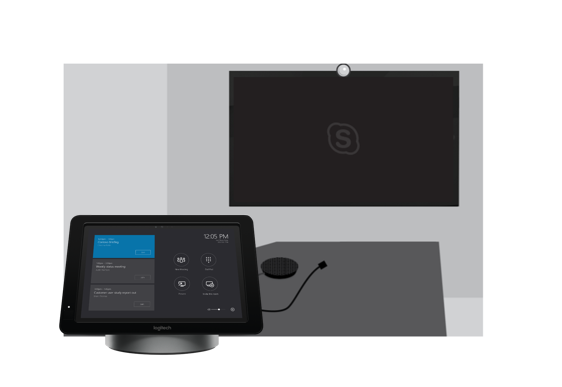

# 规划 Skype 会议室系统 v2Plan Skype Room Systems v2 

本文介绍规划、 提供，和操作系统 Skype 会议室版本 2 (v2) 作为您的总体会议和会议聊天室策略的一部分的端到端方法。This article introduces an end-to-end approach to planning, delivering, and operating Skype Room Systems version 2 (v2) as part of your overall meeting and conference room strategy.

您将找到规划以下介绍建议的方法和您需要进行，并提供支持的技术信息的链接的关键决策信息。You’ll find planning information below covering the recommended approach and key decisions that you need to make, with links to supporting technical information. 我们建议您查看规划、 部署和管理部分，即使已完全正在部署。We recommend that you review the Plan, Deploy, and Manage sections even if you’re already fully deployed.

## Overview of Skype 会议室系统 v2Overview of Skype Room Systems v2

Skype 会议室系统 v2 提供完整的 Skype 业务会议体验，将所有规模的会议从小型 huddle 区域将大型会议室 HD 视频、 音频和共享的内容。Skype Room Systems v2 provides a complete Skype for Business meeting experience that brings HD video, audio, and content sharing to meetings of all sizes, from small huddle areas to large conference rooms.

[Skype 会议室系统 v2 帮助](https://support.office.com/article/Skype-Room-Systems-version-2-help-e667f40e-5aab-40c1-bd68-611fe0002ba2)是很好的资源，以找出有关 Skype 会议室系统 v2 和业务部署您 Skype 的一部分，它就可以添加值的详细信息。[Skype Room Systems v2 help](https://support.office.com/article/Skype-Room-Systems-version-2-help-e667f40e-5aab-40c1-bd68-611fe0002ba2) is a great resource to find out more about Skype Room Systems v2 and how it can add value as part of your Skype for Business deployment. 此外，我们建议观看此[概述视频](https://youtu.be/tNey5KZVCl0)。In addition, we recommend watching this [overview video](https://youtu.be/tNey5KZVCl0). 

## Skype 会议室系统 v2 组件Skype Room Systems v2 components 

Skype 会议室系统 v2 包括以下主要组件来提供出色的用户体验：Skype Room Systems v2 includes the following key components to deliver a great user experience:

-   触摸屏控制面板Touchscreen control panel
-   计算Compute
-   Skype 会议室系统 v2 应用程序Skype Room Systems v2 application
-   停靠/扩展器Dock/extender
-   外围设备 （照相机、 麦克风或扬声器）Peripheral devices (camera, microphone, speaker)
-   外部屏幕 （最多两个）External screens (maximum of two)
-   HDMI 输入HDMI input

可以为预安装捆绑获得这些组件，从大量供应商，或者您可以按照[本文中介绍的要求](requirements.md)单独购买的受支持的组件。You can procure these components as preinstalled bundles from a number of vendors, or you can purchase the supported components individually by following the [requirements documented in this article](requirements.md). 

除了 Surface Pro 的停靠相结合，还可以购买 Skype 会议室系统 v2 触摸屏控制面板、 计算、 停靠，和关键集成的外围设备。In addition to the Surface Pro/dock combination, you can also purchase Skype Room Systems v2 with the touchscreen control panel, compute, dock, and key peripheral devices integrated. 

通常，捆绑和集成的单位包括预安装的软件，而如果购买 Surface Pro 系统为单独的支持的组件，需要安装软件。Typically, the bundles and integrated units include preinstalled software, whereas if you buy supported components individually for the Surface Pro systems, you’ll need to install the software. 有关说明，请参阅[本文中有关安装在设备上的软件](../../deploy/deploy-clients/room-systems-scale.md)。For instructions, see [this article about installing software on devices](../../deploy/deploy-clients/room-systems-scale.md). 

您可以部署与 Skype 的业务联机状态或业务混合或本地部署的 Skype 的 Skype 会议室系统 v2。You can deploy Skype Room Systems v2 with Skype for Business Online, or Skype for Business hybrid or on-premises deployments. Microsoft 团队支持即将非常提供。Microsoft Teams support is coming very soon.

|    |     |
|-----------|------------|
|  决策点Decision points|<ul><li>您将在您的组织中部署 Skype 会议室系统 v2？Will you deploy Skype Room Systems v2 in your organization? </li><li>如何获取 Skype 会议室系统 v2 系统 — 捆绑在一起，作为单独的组件或集成单元？How will you procure your Skype Room Systems v2 systems—bundled, as separate components, or as an integrated unit?</li></ul> |
|  后续步骤Next steps | <ul><li>确定谁将将要包括整个部署的主要活动。Identify who will undertake the key activities throughout your deployment.</li><li>查看会议房间有 （和计划设置） 以了解其中要部署 Skype 会议室系统 v2 和采用的外围设备适合于会议室大小。Review the meeting rooms you have (and plan to set up) to understand where you want to deploy Skype Room Systems v2 and the peripheral devices that would be appropriate for the room size.</li></ul> |

## 确定谁将将要包括整个部署的主要活动Identify who will undertake the key activities throughout your deployment

使用指导您完成您的部署，如下所示的方法和自定义根据需要为您的组织，这些文章中提供的示例输出。Use the approach illustrated below to guide you through your deployment, and customize the sample outputs provided throughout these articles as needed for your organization.

先了解哪些会议聊天室您具有并且构想内容是否适合于您将来、 然后通过选择移动和购买所需的设备，使您的网站上，配置和部署您的服务，管理更改和用户应用和开发操作和维护过程。Begin with understanding what conference rooms you have and envisioning what would work best for you in the future, then move through selecting and procuring the equipment you need, readying your sites, configuring and deploying your service, managing change and user adoption, and developing operations and maintenance procedures.

了解您具有并构想内容是否适合于您，然后通过选择和购买需要将您的网站准备就绪的设备移动![开始配置和部署您的服务，管理更改和用户应用和开发操作和维护过程。]了解您具有并构想内容是否适合于您，然后通过选择和购买需要将您的网站准备就绪的设备移动(../../media/room-systems-image2.png "开始配置和部署您的服务，管理更改和用户应用和开发操作和维护过程。")

您可能需要几个团队中协调这些活动。You might need to coordinate these activities across several teams. 我们提供的主要活动，您应覆盖，以及部署和管理会议房间系统，以帮助您决定由谁需要使用通常时涉及的团队建议的高级视图。We provide a high-level view of the main activities that you should cover, and also suggestions for the teams who are typically involved in deploying and managing conference room systems, to help you decide who you need to work with.

| 任务Task                       | 用户可能执行任务Who might undertake the task           | 分配给Assigned to | 此内容的链接Links to this content |
|----------------------------|----------------------------------------|-------------|-----------------------|
| 库存聊天室Inventory rooms            | 设施 / AV 团队 / IT 项目工作组Facilities / AV team / IT Project Team |             | [会议室清单和功能规划Room inventory and capability planning](#room-inventory-and-capability-planning)        |
| 规划功能Plan capabilities          | IT Project 团队IT Project Team                        |             | [会议室清单和功能规划Room inventory and capability planning](#room-inventory-and-capability-planning)                       |
| 设备所选内容Device selection           | IT 项目团队 / AV 团队IT Project Team / AV Team              |             | [设备所选内容Device selection](#device-selection)                      |
| 采购Procurement                | IT 项目团队 / AV 团队IT Project Team / AV Team              |             | [采购Procurement](#procurement)                      |
| 网站准备工作Site readiness             | 设施 / AV 团队 / IT 项目工作组Facilities / AV team / IT Project Team |             | [网站准备工作Site readiness](../../deploy/deploy-clients/room-systems-v2.md#site-readiness)                      |
| 服务就绪Service readiness          | IT Project 团队IT Project Team                        |             | [服务就绪Service readiness](../../deploy/deploy-clients/room-systems-v2.md#service-readiness)                      |
| 配置Configuration              | IT Project 团队IT Project Team                        |             | [配置和部署Configuration and deployment](../../deploy/deploy-clients/room-systems-v2.md#configuration-and-deployment)                      |
| 部署Deployment                 | 设施 / AV 团队 / IT 项目工作组Facilities / AV team / IT Project Team |             | [部署清单Deployment checklist](../../deploy/deploy-clients/console.md#skype-room-systems-v2-deployment-checklist)                      |
| 采用Adoption                   | 设施 / AV 团队 / IT 项目工作组Facilities / AV team / IT Project Team |             | [采用Adoption](#plan-for-adoption-and-change-management)                      |
| 维护和操作Maintenance and operations | AV 团队 / IT 项目工作组AV team / IT Project Team              |             | [管理概述Management overview](../../manage/skype-room-systems-v2/skype-room-systems-v2.md)                      |

## 会议室清单和功能规划Room inventory and capability planning

第一步是清点您的组织现有会议和会议室了解其环境、 会议室大小、 布局和用途，并可确定所需范围，例如，哪些以后具有中的每个房间更丰富的功能在聊天室中，将启用协作功能。The first step is to inventory your organization’s existing meeting and conference rooms to understand their environment, room size, layout, and purpose, and to identify the capabilities you want each room in scope to have in the future such as which richer collaboration capabilities will be enabled in the room. 

在每个现有房间中创建清单的设备和功能后，该聊天室要求送入您打算创建丰富的会议解决方案的设备选择。After you create an inventory of the equipment and capabilities in each existing room, your requirements for that room feed into your device selection planning to create a rich conferencing solution. 需要为每个房间形式 （音频、 视频） — 除了会议室大小和用途 — 所有扮演重要角色在决定哪种解决方案最适用于每个聊天室。The modalities (audio, video) needed for each room—in addition to room size and purpose—all play an important role in deciding which solution is most appropriate for each room. 

作为您发现的一部分，它的键考虑会议室噪声和布局。As part of your discovery, it’s key to consider room acoustics and layout. 例如，检查房间中的负责人不会阻止相机视图。For example, check that the chairs in the room won’t block the camera view. 验证聊天室都不会有过多回声或空调噪音太大，并且它确实有足够的屏幕和 Skype 会议室系统 v2 的电源。Verify that the room doesn’t have excessive echo or noisy air conditioning, and that it does have sufficient power for the screens and Skype Room Systems v2. 有许多因素考虑您的视听 (AV) 团队或合作伙伴都将能够向提供建议。There are many factors to consider that your audio-visual (AV) team or partner will be able to advise on. 

|    |     |
|-----------|------------|
|   决策点Decision points|<ul><li>在此部署范围中有哪些聊天室？Which rooms are in scope for this deployment?</li><li>哪些网站范围内部署？Which sites are in scope for your deployment?</li><li>谁将将要会议聊天室库存？Who will undertake the meeting rooms inventory?</li></ul> |
|  后续步骤Next steps|<ul><li>查看聊天室的范围，并定义为它们的 Skype 会议室系统 v2 配置。Review the rooms in scope, and define Skype Room Systems v2 configurations for them.</li></ul>|

_示例会议室内库存__Sample meeting/conference room inventory_

| **站点****Site**  | **会议室名称****Room name** | **聊天室类型****Room type** | **人员数量****Number of people**  | **在范围？****In scope?** | **当前聊天室功能****Current room capabilities**       | **将来聊天室功能****Future room capabilities**                             |
|-----------|---------------|---------------|-----------------------|--------------|-------------------------------------|----------------------------------------------------------|
| 伦敦总部London HQ | CurieCurie         | 中Medium        | 6&ndash;126&ndash;12                  | 是Yes          | 免提电话Speakerphone                        | 1 个屏幕上，音频和视频以及演示文稿1 screen, audio and video plus presentation PSTN 访问PSTN Access |
| 悉尼总部Sydney HQ | 峰Hill          | 大Large         | 12&ndash;1612&ndash;16                 | 是Yes          | 旧 AV 单位、 1 屏幕和摄像机Legacy AV unit, 1 screen and camera | 2 屏幕，音频和视频以及演示文稿2 screens, audio and video plus presentation PSTN 访问PSTN Access |

**专业人员提示**– 如果您有多个网站清点，您可能希望下载和使用[网站推出和迁移计划-网站信息的问卷](https://myadvisor.fasttrack.microsoft.com/CloudVoice/Downloads?SelectedIDs=5_1_0_15)。**Pro Tip** – If you have many sites to inventory, you might want to download and use the [Site Rollout and Migration Planning - Site Questionnaire](https://myadvisor.fasttrack.microsoft.com/CloudVoice/Downloads?SelectedIDs=5_1_0_15).

## 设备所选内容Device selection 

评估 Skype 会议室系统 v2 解决方案是最适用于基于未来的能力您希望用于聊天室的每个聊天室。Evaluate which Skype Room Systems v2 solution is the most suitable for each room based on the future capabilities you want for the room. 决定哪些 AV 外围设备是最佳匹配，具体取决于会议室大小和布局。Decide which AV peripheral devices are the best fit, depending on room size and layout. 

由聊天室类型和大小的系统和外围设备类型的指南，请参阅[Skype 会议室系统 v2 要求](requirements.md)文章。For guidance for the type of system and peripheral devices by room type and size, see the [Skype Room Systems v2 requirements](requirements.md) article. 

根据您喜欢的供应商，使用要求一文中提供的信息来定义 Skype 会议室系统 v2 和每个聊天室类型支持的外围设备配置，并使用此模板作为您的部署。Based on the vendor you prefer, use the information provided in the requirements article to define your Skype Room Systems v2 and supported peripheral device configuration per room type, and use this as a template for your deployment. 

**专业人员提示**– 某些聊天室类型可能不是适用于您的部署。**Pro Tip** – Some room types might not be applicable for your deployment.

|    |     |
|-----------|------------|
|   决策点Decision points|<ul><li>从您库存哪些类型的聊天室是范围内部署？From your inventory, which types of rooms are in scope for your deployment?</li><li>对于每个聊天室类型将部署哪些系统？Which systems will you deploy for each room type?</li></ul>|
|  后续步骤Next steps|<ul><li>开始收集密钥操作材料对于您选择的系统，并吸引采购团队。Start to gather key operational material for your chosen systems, and engage your procurement team.</li></ul>|

_您的组织的的示例 Skype 会议室系统 v2 部署模板__Sample Skype Room Systems v2 deployment template for your organization_

| **会议室字号****Room type/size** | **人员数量****Number of people**  | **Skype 会议室系统 v2 系统****Skype Room Systems v2 system** | **外围设备****Peripheral devices**  | **Display(s)****Display(s)** |
|----------------------|-----------------------|----------------------------------|-------------------------|-----------------|
| 焦点 10' by 9Focus 10' by 9'      | 2&ndash;42&ndash;4                   |                                  |                         |                 |
| 小型 16"by 16Small 16' by 16'     | 4&ndash;64&ndash;6                   |                                  |                         |                 |
| 中等 18 by 20Medium 18' by 20'    | 6&ndash;126&ndash;12                  |                                  |                         |                 |
| 大型 15"by 32Large 15' by 32'     | 12&ndash;1612&ndash;16                 |                                  |                         |                 |

**专业人员提示 –** 现在是开始收集信息 Skype 会议室系统 v2 解决方案选择了一个极好。**Pro Tip –** Now is a great time to start gathering information about the Skype Room Systems v2 solution you’ve chosen. 我们建议您处理您的供应商，以讨论完成要捕获将与您的部署; 相关的信息的设计模板您可以从 MyAdvisor[下载此通过单一便捷式模板](https://myadvisor.fasttrack.microsoft.com/CloudVoice/Downloads?SelectedIDs=4_4_0_11)。We recommend that you work with your vendor to discuss completing the design template to capture information that will be relevant to your deployment; you can [download this handy template](https://myadvisor.fasttrack.microsoft.com/CloudVoice/Downloads?SelectedIDs=4_4_0_11) from MyAdvisor. 

## 采购Procurement 

您可以获取绑定或集成的解决方案，通过设备伙伴您选择的系统。You can procure your chosen system as a bundle or an integrated solution via device partners. 您可以获取合作伙伴设备停靠和通过使用 Surface Pro 设备和现有的、_支持_AV 外围设备准备 Skype 会议室系统 v2 解决方案。You can also acquire a partner device dock and prepare your own Skype Room Systems v2 solution by using a Surface Pro device and existing, _supported_ AV peripheral devices. 

您可以获取从大量[requirements 一文](requirements.md)中列出的合作伙伴的 Skype 会议室系统 v2。You can acquire Skype Room Systems v2 from a number of partners who are listed in the [requirements article](requirements.md). 请访问合作伙伴的网站以了解有关这些解决方案和采购选项的详细信息。Please visit the partners’ websites to learn more about these solutions and procurement options. 

根据您的部署规模和方法，您可能决定 Skype 会议室系统 v2 和支持的外围设备传送到的初始配置和分配一个中心位置。Depending on your deployment scale and approach, you might decide to have the Skype Room Systems v2 and supported peripheral devices shipped to a central location for initial configuration and assignment. 跨多个站点，这可能是一种暂存推出好方法。This might be a good approach for a staged rollout across many sites. 或者，您可能选择附带捆绑直接向您的网站。Or, you might choose to ship the bundles directly to your sites. 

|    |     |
|-----------|------------|
|   决策点Decision points|<ul><li>您将附带的组件，直接向网站或向暂存设施？Will you ship the components directly to a site or to a staging facility?</li><li>谁将管理暂存实用工具 （如果您决定使用一个）？Who will manage the staging facility (if you decide to use one)?</li></ul>|
|  后续步骤Next steps|<ul><li>Plan for 操作。Plan for operations.</li><li>规划应用和更改管理。Plan for adoption and change management.</li></ul>|

## 规划操作Plan for operations 

您的组织必须对持续和它的键同意人员将执行这些任务早期部署中的执行监视、 管理和管理任务。Your organization must execute monitoring, administration, and management tasks on an ongoing basis, and it’s key to agree who will undertake these tasks early in your deployment. 

许多组织的 AV 团队或管理及其会议室和设备的合作伙伴。Many organizations have an AV team or partner who manages their conference rooms and devices. 此团队应参与同意谁将管理循序监视性能，并部署软件更新和修补程序的 Skype 会议室系统 v2 设备。This team should be involved in agreeing who will manage the Skype Room Systems v2 devices going forward to monitor performance, and deploy software updates and hotfixes. 

请考虑哪一个支持人员队列将 Skype 会议室系统相关 v2֪ – 将呼叫路由至，并提供给帮助台团队以便他们可以更好的常见问题了解如何使用 Skype 会议室系统 v2 和故障排除的步骤他们可以应答的密钥。Consider which helpdesk queue you’ll route Skype Room Systems v2֪–related calls to, and provide an FAQ to the helpdesk team so they can better understand how to use Skype Room Systems v2 and the key troubleshooting steps they can take. 本常见问题解答良好起始点是[用户帮助](https://support.office.com/article/Skype-Room-Systems-version-2-help-e667f40e-5aab-40c1-bd68-611fe0002ba2)和[已知问题列表](../../manage/skype-room-systems-v2/known-issues.md)。A good starting point for this FAQ is the [user help](https://support.office.com/article/Skype-Room-Systems-version-2-help-e667f40e-5aab-40c1-bd68-611fe0002ba2) and the [known issues list](../../manage/skype-room-systems-v2/known-issues.md).

|    |     |
|-----------|------------|
|   决策点Decision points|<ul><li>决定谁将管理 Skype 会议室系统 v2。Decide who will manage Skype Room Systems v2.</li><li>决定哪一个支持人员队列相关 Skype 会议室系统 – 将呼叫路由至。Decide which helpdesk queue to route Skype Room Systems–related calls to.</li></ul>|
|  后续步骤Next steps|<ul><li>准备承载帐户。Prepare to host accounts. </li></ul>|

## 规划应用和变更管理Plan for adoption and change management

Skype 会议室系统 v2 系统引入到您的用户的新功能。Skype Room Systems v2 systems introduce new capabilities to your users. 务必您认识到，这会有更改为您的用户，您应该确保您的营销标识新的系统会为您的用户的好处和谈话要点潜在顾客可用来讨论与他们的团队。It’s important that you recognize that this will be a change for your users, and you should ensure your campaign identifies the benefits the new system will have for your users and the key talking points leads can use to discuss with their teams. 

请考虑计划 show-and-tell 事件和海报将在每个站点，告知您的新功能的用户。Consider scheduling show-and-tell events and poster drops at each site to inform your users of the new capabilities. 您还可以创建聊天室中"快速启动指南"。You might also create in-room “quick start guides.” 请考虑查找每个站点上会议冠军可帮助加快并开始使用设备的其他人。Consider finding a meetings champion on each site who can help others get up to speed and start using the devices.
