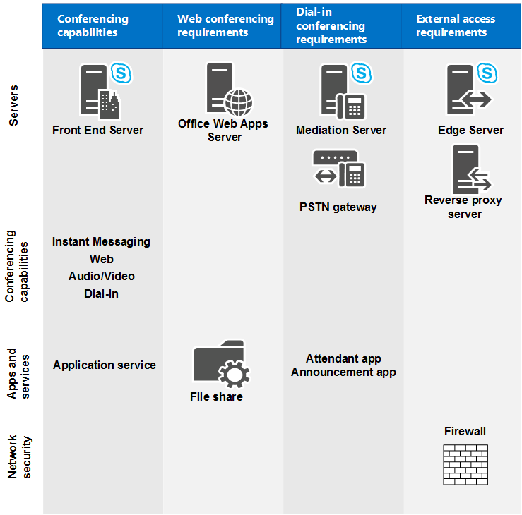

# Skype for business Server 中的会议的硬件和软件要求

**摘要:** 阅读本主题, 了解 Skype for business 服务器中的会议的硬件和软件要求。

本节描述 Web 会议、音频和视频 (A/V) 会议、电话拨入式会议以及即时消息 (IM) 会议的硬件和软件要求。 所有会议功能都在前端服务器上运行；不同类型的会议有额外的要求，具体如下图所示。

例如, 如果你想要允许拨入式会议, 你需要部署一个中介服务器和一个用于连接到公共交换电话网络 (PSTN) 的网关。 如果您想要允许 web 会议, 您需要确保 Skype for business 服务器可以连接到 Office Web Apps 服务器。 如果要允许外部用户参加会议，需要部署边缘服务器。

**会议功能和要求**

 有关拓扑注意事项的详细信息, 请参阅[规划 Skype for Business 服务器的会议拓扑](conferencing-topology.md)。

## 前端服务器的硬件和软件要求

由于 web 会议、A/V 式会议、电话拨入式会议和即时消息会议都与前端服务器 collocated, 因此服务器硬件和软件要求与前端服务器的服务器硬件和软件要求相同。 有关这些要求的详细信息, 请参阅 skype for business server [2015 的服务器要求](../../plan-your-deployment/requirements-for-your-environment/server-requirements.md)和 skype for business server 2015 版 skype for business server 或服务器的[环境](../../plan-your-deployment/requirements-for-your-environment/environmental-requirements.md)要求[2019](../../../SfBServer2019/plan/system-requirements.md)。

## Web 会议的要求

如果您已选择启用 Web 会议，则需计划以下事项：

- 访问文件存储，文件存储用于存储 Web 会议内容。

- 与 Office Web Apps Server 集成，这是在会议期间共享 PowerPoint 文件所必需的。

### 文件存储

Skype for Business Server web 会议服务存储在文件存储中的会议期间共享的内容。 作为部署的一部分, 必须指定要用作标准版服务器或企业版前端池的文件存储的文件共享。 可以将现有的文件共享用作文件存储，也可以通过指定文件共享所在的文件服务器的完全限定域名 (FQDN) 和新文件共享的文件夹名称来指定新的文件共享。 有关详细信息, 请参阅[在 Skype For Business 服务器中创建文件共享](../../deploy/install/create-a-file-share.md)。 Web 会议服务在将内容存储到文件存储中之前对内容进行加密。

Skype for Business 服务器支持在直接连接存储 (DAS) 或存储区域网络 (SAN) 上使用文件共享, 包括分布式文件系统 (DFS) 和文件存储的独立磁盘冗余阵列 (RAID)。 在 Skype for Business 服务器部署向导定义文件共享的位置后, Skype for business 服务器会在文件共享中创建一个类似于以下内容的文件夹结构:

- 1-ApplicationServer-1

- 1-CentralMgmt-1

- 1-WebServices-1

  - CollabContent

  - CollabMetadata

  - DataConf

然后，Web 会议服务在位于 WebServices 文件夹中的 CollabContent 和 CollabMetadata 文件夹中存储诸如 PowerPoint 幻灯片、白板、投票表决和附件之类的内容。

### Office Web Apps Server

为了使用 web 会议功能, 必须安装 Office Web Apps 服务器并配置 Skype for Business 服务器才能与 Office Web Apps 服务器通信。

Office Web Apps 服务器应安装在未运行 Skype for Business Server、SQL Server 或任何其他服务器应用程序的独立计算机上。 (您不能在该计算机上安装任何版本的 Office。)任何用于运行 Office Web Apps 服务器的计算机还必须安装一组特定的软件 (包括 .NET Framework 4.5 和 Windows PowerShell 3.0)。 [Microsoft Office Web Apps 部署网站](https://go.microsoft.com/fwlink/p/?linkid=257525)中详细讨论了有关配置证书和 Internet 信息服务 (IIS) 的这些要求以及有关配置证书和 Internet 信息服务 (IIS) 的信息。

有关如何配置 Skype for Business 服务器以使用 Office Web Apps 服务器的信息, 请参阅[在 Skype For Business server 中配置与 Office Web apps 集成](../../deploy/deploy-conferencing/office-web-app-server.md)服务器的集成。

## 音频和视频会议的要求

要规划 A/V 会议，需了解组织所需会议媒体类型要求的网络带宽。 这包含音频、视频和全景视频。 如果网络带宽不足，用户体验可能大打折扣。

有关会议的音频和视频容量规划的信息，请参阅[Plan network requirements for Skype for Business](../../plan-your-deployment/network-requirements/network-requirements.md)。

可以使用呼叫允许控制 (CAC) 来管理 A/V 会议使用的网络带宽。 这对受限网络（例如中央站点和分支站点之间的受限带宽链接）很重要。 有关详细信息, 请参阅[在 Skype For Business 服务器中计划呼叫许可控制](../../plan-your-deployment/enterprise-voice-solution/call-admission-control.md)。

如果在网络中部署音频会议，用户需要耳机等音频设备来参加音频会议。 如果部署视频会议，需要为用户部署视频设备，如网络摄像头。 对于音频和视频设备，设备部署和用户培训是应该考虑的重要步骤。 有关详细信息, 请参阅[针对客户端和设备进行规划](../../plan-your-deployment/clients-and-devices/clients-and-devices.md)。 Microsoft 建议使用由 Microsoft 针对所有设备类型认证的统一通信 (UC) 设备，以确保达到最佳的用户体验。 有关 UC 认证的设备的详细信息, 请参阅[Skype for business 的电话和设备](https://go.microsoft.com/fwlink/?LinkId=619916)。

## 电话拨入式会议的要求

电话拨入式会议是 Skype for Business Server 会议工作负载的一项可选功能, 包括各种组件。 某些组件特定于电话拨入式会议, 而有些则是企业语音组件。 本部分介绍电话拨入式会议所需组件的要求。 有关中介服务器和公共交换电话网络 (PSTN) 网关要求的详细信息, 请参阅[skype For Business 服务器中的中介服务器组件](../../plan-your-deployment/enterprise-voice-solution/mediation-server.md)和[在 Skype for Business 服务器的拓扑生成器中部署中介服务器](../../deploy/deploy-enterprise-voice/deploy-a-mediation-server.md)。

### 所需组件

在配置拨入式会议之前, 您需要安装以下 Skype for Business 服务器组件:

- 统一通信应用程序服务 (UCAS)（称为“应用程序服务”）

- 会议助理应用程序

- 会议通知应用程序

- 电话拨入式会议设置网页

- 至少一个中介服务器和至少一个 PSTN 网关

对于电话拨入式会议, 应用程序服务、会议助理应用程序和会议公告应用程序与前端服务器具有相同的操作系统要求。 有关信息，请参阅 [Server requirements for Skype for Business Server 2015](../../plan-your-deployment/requirements-for-your-environment/server-requirements.md)。

会议助理应用程序和会议通知应用程序要求 Windows Media 格式运行时安装在前端服务器上。 Windows Media Format Runtime 是播放用作待机音乐、录制的姓名以及提示音的 Windows Media 音频 (WMA) 文件所必需的。 如果你要在 Windows Server 2012 或 Windows Server 2012 R2 (建议) 上安装, 则需要安装 Microsoft Media Foundation 才能获取 Windows Media 格式运行时。 如果安装在 Windows 2012 之前的任何 Windows Server 版本上，则需要确保安装 Windows Desktop Experience 来获得 Windows Media Format Runtime。

### 电话拨入式会议的音频文件要求

Skype for Business 服务器不支持对电话拨入式会议的语音提示和音乐进行自定义。 但是, 如果您有要求更改默认音频文件的强有力的业务需求, 请参阅 Microsoft 知识库文章 961177, 了解[如何自定义语音提示或音乐文件以进行电话拨入式音频会议](https://go.microsoft.com/fwlink/p/?linkid=3052&amp;kbid=961177)。

您还可以使用[Microsoft Lync Server 会议助理自定义语音提示](https://go.microsoft.com/fwlink/p/?LinkId=396880)管理实用程序, 这使管理员可以替换当电话呼叫者加入带有自定义提示的 Skype for business 会议时使用的默认语音提示以提供不同的会议进入体验。 自定义语音提示可以安装在 Enterprise Edition 或 Standard Edition 服务器上。

会议助理应用程序和会议公告应用程序对保留音乐、录制的名称和音频提示文件具有以下要求:

- Windows Media 音频 (WMA) 文件格式

- 16 位单声道

- 48 kbps 2-pass CBR（恒定比特率）

- 语音级别 - 24DB

### 电话拨入式会议的用户要求

电话拨入式会议用户必须为其帐户分配唯一的电话号码或分机。 该要求支持在电话拨入式会议期间进行身份验证。 企业用户 (即具有 Active Directory 域服务凭据的用户和您的组织内的 Skype for Business 服务器帐户) 输入其电话号码 (或分机) 和个人标识号 (PIN), 以拨入会议经过身份验证的用户。

## 会议的端口要求

为了使用会议功能, Skype for Business 服务器要求打开某些端口。 下表列出了会议的端口要求。 有关所有端口要求的详细信息, 请参阅[服务器的端口和协议要求](../../plan-your-deployment/network-requirements/ports-and-protocols.md)。

**所需的服务器端口**

|**服务器角色**|**服务名称**|**端口**|**协议**|**备注**|
|:-----|:-----|:-----|:-----|:-----|
|前端服务器    |Skype for Business 服务器 IM 会议服务    |5062    |TCP    |用于即时消息 (IM) 会议的传入 SIP 请求。    |
|前端服务器    |Skype for Business 服务器 Web 会议服务    |8057    |TCP (TLS)    |用于侦听来自客户端的持续性共享对象模型 (PSOM) 连接。    |
|前端服务器    |Skype for Business 服务器 Web 会议兼容性服务    |8058    |TCP (TLS)    |用于从 Live Meeting 客户端和以前版本的 Skype for Business 服务器侦听永久共享对象模型 (PSOM) 连接。    |
|前端服务器    |Skype for Business 服务器音频/视频会议服务    |5063    |TCP    |用于音频/视频 (A/V) 会议的传入 SIP 请求。    |
|前端服务器    |Skype for Business 服务器音频/视频会议服务    |57501-65535    |TCP/UDP    |用于视频会议的媒体端口范围。    |
|前端服务器    |Skype for Business 服务器会议助理服务 (电话拨入式会议)    |5064    |TCP    |用于电话拨入式会议的传入 SIP 请求。    |
|前端服务器    |Skype for Business 服务器会议助理服务 (电话拨入式会议)    |5072    |TCP    |用于对助理 (拨入式会议) 的传入 SIP 请求。    |
|前端服务器    |Skype for Business 服务器应用程序共享服务    |5065    |TCP    |用于应用程序共享的传入 SIP 侦听请求。    |
|前端服务器    |Skype for Business 服务器应用程序共享服务    |49152-65535    |TCP    |用于应用程序共享的媒体端口范围。    |
|前端服务器    |Skype for Business Server 会议公告服务    |5073    |TCP    |用于 Skype for Business Server 会议公告服务 (即电话拨入式会议) 的传入 SIP 请求。    |
|所有内部服务器    |各种    |49152-57500    |TCP/UDP    |用于所有内部服务器上的音频会议的媒体端口范围。 由终止音频的所有服务器使用: 前端服务器 (适用于 Skype for business Server 会议助理服务、Skype for business Server 会议公告服务和 Skype for Business Server 音频/视频会议服务) 和中介服务器。    |
|Office Web Apps Servers    ||443    ||供 Skype for Business 服务器用于连接到 Office Web Apps 服务器。    |

**所需的客户端端口**

|**端口**|**协议**|**备注**|
|:-----|:-----|:-----|
|443    |TCP (PSOM/TLS)    |用于外部用户访问 Web 会议会话。    |
|443    |TCP (STUN/MSTURN)    |用于外部用户访问 A/V 会话和媒体 (TCP)    |
|3478    |UDP (STUN/MSTURN)    |用于外部用户访问 A/V 会话和媒体 (UDP)。    |
|1024-65535\*    |TCP/UDP    |音频端口范围（最少需要 20 个端口）。    |
|1024-65535\*    |TCP/UDP    |视频端口范围（最少需要 20 个端口）。    |
|1024-65535\*    |TCP    |应用程序共享。    |

