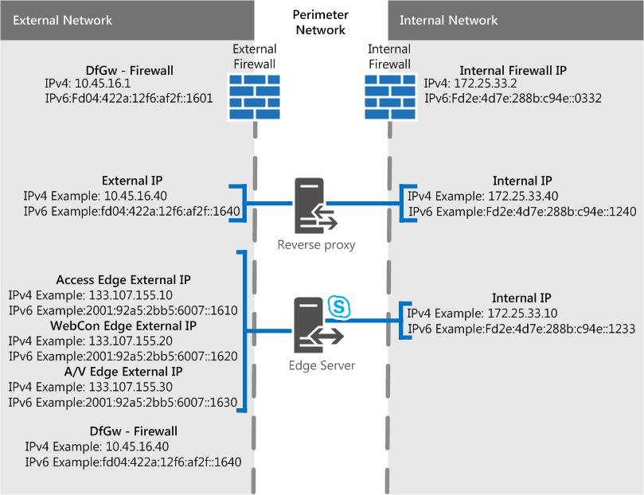

# Skype for Business Server 中的边缘服务器Skype for Business Server
 
**摘要：** 查看这些方案可帮助您在部署中规划边缘服务器Skype for Business Server。
  
我们具有一些方案图，可帮助可视化和确定Skype for Business Server边缘服务器拓扑结构。 选择好候选项后，可以继续阅读需要满足的环境要求。 以下内容适用于任何方案，因此我们首先提到它。
  
这些图（以 (为例）包含示例 IPv4 和 IPv6 数据) ，并不表示实际的通信流，而是可能流量的高级别视图。 还可以在下面每个方案的端口图中查看端口详细信息。
  
图中显示了外部接口的 .com 和内部接口的 .net，这也是示例材料;当然，在将自己的最终边缘计划放在一起时，你自己的条目可能会完全不同。
  
我们未在任何图中包括控制器 (，它是可选组件) ，但你可以单独阅读 (其他规划主题) 。
  
如上所述，图表中有示例 IPv6 数据。 Plan [for Edge Server deployments in Skype for Business Server](edge-server-deployments.md)中的大多数文档将引用 IPv4，但如果要使用 IPv6，则肯定支持你。 请注意，你将需要分配的地址空间中的 IPv6 地址，并且它们将需要与 IPv4 IP 一样用于内部和外部寻址。 借助这一Windows，您可以使用双协议栈功能，这是适用于 IPv4 和 IPv6 的单独且不同的网络堆栈。 如果需要，这将允许您同时分配 IPv4 和 IPv6 地址。
  
一些 NAT 设备允许 NAT64 (IPv6 到 IPv4) ，NAT66 (IPv6 到 IPv6) ) ，这适用于 Skype for Business Server。
  
> [!IMPORTANT]
> 如果使用呼叫允许控制 (CAC) 您必须在内部接口上使用 IPv4，它一直工作。 
  
## 使用专用 IP Skype for Business Server NAT 的单一合并边缘服务器

在此方案中，没有高可用性选项。 这意味着在硬件上花费更少，部署更简单。 如果必须高可用性，请查看下面的扩展合并方案。
  

  
### 端口图

我们还具有单个合并边缘服务器的端口关系图。
  

  
## 使用公用 IP Skype for Business Server单一合并边缘服务器

在此方案中，没有高可用性选项。 这意味着在硬件上花费更少，部署更简单。 如果必须高可用性，请查看下面的扩展合并方案。
  

  
### 端口图

我们还具有单个合并边缘服务器的端口关系图。
  

  
## 扩展的Skype for Business Server边缘池，具有 DNS 负载平衡、专用 IP 地址和 NAT

通过此方案，您可以在边缘部署中实现高可用性，从而为您提供可伸缩性和故障转移支持的优势。
  

  
### 端口图

我们还有一个包含 DNS 负载平衡的扩展合并边缘池的图表。
  

  
## 扩展的Skype for Business Server边缘池，具有 DNS 负载平衡和公共 IP 地址

通过此方案，您可以在边缘部署中实现高可用性，从而为您提供可伸缩性和故障转移支持的优势。
  

  
### 端口图

我们还有一个包含 DNS 负载平衡的扩展合并边缘池的图表。
  

  
## 扩展的Skype for Business Server边缘池，具有硬件负载平衡

通过此方案，您可以在边缘部署中实现高可用性，从而为您提供可伸缩性和故障转移支持的优势。
  

 
