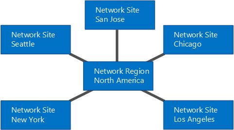

# Skype for Business 中呼叫允许控制的组件和拓扑Components and topologies for call admission control in Skype for Business

规划呼叫允许控制 (CAC) 如果具有 MPLS 网络、SIP 中继或第三方 PSTN 网关或 PBX。Planning for call admission control (CAC) if you have an MPLS network, a SIP trunk, or a third-party PSTN gateway or PBX. 适用于 Skype for Business Server 企业语音。Applies to Skype for Business Server Enterprise Voice.

本节中的主题提供了有关通过各种类型的网络拓扑部署呼叫允许控制 (CAC) 的特殊注意事项的信息。The topics in this section provide information about special considerations for deploying call admission control (CAC) with various types of network topologies.

## MPLS 网络上呼叫允许控制Call admission control on an MPLS network

在多协议标签交换 (MPLS) 网络中，所有站点均以全连通的方式连接。也就是说，所有站点都直接连接到 Internet 服务提供商的 MPLS 主干线，并且每个站点都设置了带宽，以用于通过 WAN 链路连接到 MPLS 云。没有控制 IP 路由的网络集线器或中心站点。下图显示了基于 MPLS 技术的简单网络。In a Multiprotocol Label Switching (MPLS) network, all sites are connected by a full-mesh. That is, all sites are connected directly to the MPLS backbone of the Internet service provider, and each site is provisioned bandwidth to be used across a WAN link to the MPLS cloud. There is no network hub or central site to control IP routing. The following figure shows a simple network based on MPLS technology.

**MPLS 网络示例****Example MPLS network**

要在 MPLS 网络中部署呼叫允许控制 (CAC)，需创建代表 MPLS 云的网络区域，以及代表每个 MPLS 分支站点的网络站点。下图说明如何配置代表上图中的示例 MPLS 网络的网络区域和网络站点。之后，总体带宽限制和带宽会话限制将取决于从每个网络站点连接到代表 MPLS 云的网络区域的 WAN 链路容量。To deploy call admission control (CAC) in an MPLS network, you create a network region to represent the MPLS cloud, and create a network site to represent each MPLS satellite site. The following figure illustrates how the network region and network sites should be configured to represent the example MPLS network in the previous figure. The overall bandwidth limits and bandwidth session limits are then based on the capacity of the WAN link from each network site to the network region that represents the MPLS cloud.

**MPLS 网络的网络区域和网络站点****Network region and network sites for an MPLS network**

## SIP 中继上的呼叫允许控制Call admission control on a SIP trunk

要在 SIP 中继上部署呼叫允许控制 (CAC)，请创建一个代表 Internet 电话服务提供商 (ITSP) 的网络站点。要在 SIP 中继上应用带宽策略值，请创建一个企业内部网络站点和所创建的用于代表 ITSP 的网络站点之间的站点间策略。To deploy call admission control (CAC) on a SIP trunk, you create a network site to represent the Internet telephony service provider (ITSP). To apply bandwidth policy values on the SIP trunk, you create an inter-site policy between the network site in your enterprise and the network site that you create to represent the ITSP.

下图显示 SIP 中继上的 CAC 部署示例。The following figure shows an example CAC deployment on a SIP trunk.

**SIP 中继上的 CAC 配置****CAC configuration on a SIP trunk**

要在 SIP 中继上配置 CAC，必须在 CAC 部署过程中执行以下任务：To configure CAC on a SIP trunk, you will have to perform the following tasks during CAC deployment:

1. 创建一个网络站点，代表 ITSP。Create a network site to represent the ITSP. 将网络站点与相应的网络区域相关联，然后为该网络站点的音频和视频分配零带宽。Associate the network site to an appropriate network region, and allocate bandwidth of zero for audio and video for this network site. 有关详细信息，请参阅部署文档中的[Configure Network Sites for CAC](https://technet.microsoft.com/library/afcea38f-5789-45ec-97af-c6e38364950c.aspx)。For details, see [Configure Network Sites for CAC](https://technet.microsoft.com/library/afcea38f-5789-45ec-97af-c6e38364950c.aspx) in the Deployment documentation.

    > [!NOTE]
    > 对于 ITSP，该网络站点配置不起作用。For the ITSP, this network site configuration is not functional. 带宽策略值实际是在步骤 2 中应用。Bandwidth policy values are actually applied in step 2.

2. 使用在步骤 1 中创建的站点的相关参数值，为 SIP 中继创建站点间链接。Create an inter-site link for the SIP trunk using the relevant parameter values for the site you created in step 1. 例如，使用企业中的网络站点名称作为参数 NetworkSiteID1 的值，并使用 ITSP 网络站点名称作为参数 NetworkSiteID2 的值。For example, use the name of the network site in your enterprise as the value of the NetworkSiteID1 parameter, and the ITSP network site as the value of the NetworkSiteID2 parameter. 有关详细信息，请参阅部署文档中的 [Skype for Business Server](../../deploy/deploy-enterprise-voice/create-network-intersite-policies.md) 和 [New-CsNetworkInterSitePolicy](https://docs.microsoft.com/powershell/module/skype/new-csnetworkintersitepolicy?view=skype-ps)中的"创建网络站点间策略"。For details, see [Create network intersite policies in Skype for Business Server](../../deploy/deploy-enterprise-voice/create-network-intersite-policies.md) in the Deployment documentation, and [New-CsNetworkInterSitePolicy](https://docs.microsoft.com/powershell/module/skype/new-csnetworkintersitepolicy?view=skype-ps).

3. 从 ITSP 获取会话边界控制器 (SCB) 的 IP 地址。Get the IP address of the Session Border Controller's (SCB) Media Termination Point from your ITSP. 将子网掩码为 32 的 IP 地址添加到代表 ITSP 的网络站点。Add that IP address with a subnet mask of 32 to the network site that represents the ITSP. 有关详细信息，请参阅[Associate a Subnet with a Network Site](https://technet.microsoft.com/library/aa69e3ac-542a-4ba1-9582-2e6bee29f633.aspx)。For details, see [Associate a Subnet with a Network Site](https://technet.microsoft.com/library/aa69e3ac-542a-4ba1-9582-2e6bee29f633.aspx).

## 具有第三方 PSTN 网关或 PBX 的呼叫允许控制Call admission control with a third-party PSTN gateway or PBX

本主题介绍如何在中介服务器的网关接口和第三方公用电话交换网 (PSTN) ) 网关或专用交换机 (PBX) 之间的链接上部署呼叫允许控制 (CAC) 的示例。This topic describes examples of how call admission control (CAC) can be deployed on the link between the Mediation Server's gateway interface and a third-party public switched telephone network (PSTN) gateway or private branch exchange (PBX).

### 案例 1：中介服务器和 PSTN 网关之间的 CACCase 1: CAC between the Mediation Server and a PSTN gateway

可以在从中介服务器的网关接口到第三方 PBX 或 PSTN 网关的 WAN 链路上部署 CAC。CAC can be deployed on the WAN link from the Mediation Server's gateway interface to a third-party PBX or PSTN gateway.

**案例 1：中介服务器和 PSTN 网关之间的 CAC****Case 1: CAC between the Mediation Server and a PSTN gateway**

本示例在中介服务器和 PSTN 网关之间应用 CAC。In this example, CAC is applied between the Mediation Server and a PSTN gateway. 如果网络站点 1 的 Skype for Business 客户端用户通过网络站点 2 中的 PSTN 网关进行 PSTN 呼叫，则媒体将流经 WAN 链路。If a Skype for Business client user at Network Site 1 places a PSTN call through the PSTN gateway in Network Site 2, the media flows through the WAN link. 因此，将针对每个 PSTN 会话执行两个 CAC 检查：Therefore, two CAC checks are performed for each PSTN session:

- 在 Skype for Business 客户端应用程序和中介服务器之间Between the Skype for Business client application and the Mediation Server

- 中介服务器和 PSTN 网关之间Between the Mediation Server and the PSTN gateway

这适用于网络站点 1 中的客户端的传入 PSTN 呼叫，以及来自网络站点 1 中的客户端应用程序的传出 PSTN 呼叫。This works for both incoming PSTN calls to a client in Network Site 1, and for outgoing PSTN calls originating from a client application in Network Site 1.

> [!NOTE]
> 确保 PSTN 网关所属的 IP 子网已配置，并且与网络站点 2 关联。Make sure that the IP subnet that the PSTN gateway belongs to is configured and associated with Network Site 2.

> [!NOTE]
> 确保已配置中介服务器两个接口所属的 IP 子网，并且该子网与网络站点 1 关联。Make sure that the IP subnet that both interfaces of the Mediation Server belong to is configured and associated with Network Site 1.

> [!NOTE]
> 有关详细信息，请参阅[Associate a Subnet with a Network Site](https://technet.microsoft.com/library/aa69e3ac-542a-4ba1-9582-2e6bee29f633.aspx)。For details, see [Associate a Subnet with a Network Site](https://technet.microsoft.com/library/aa69e3ac-542a-4ba1-9582-2e6bee29f633.aspx).

### 案例 2：中介服务器与具有媒体终端的第三方 PBX 之间的 CACCase 2: CAC between the Mediation Server and a third-party PBX with Media Termination Point

此配置类似于案例 1。This configuration is similar to Case 1. 在这两种情况下，中介服务器知道在 WAN 链路的另一端终止媒体的设备，并且 PSTN 网关或具有媒体终端点 (MTP) 的 PBX 的 IP 地址在中介服务器上配置为下一个跃点。In both the cases, the Mediation Server knows what device terminates media at the opposite end of the WAN link, and the IP address of the PSTN gateway or PBX with Media Termination Point (MTP) is configured on the Mediation Server as the next hop.

**案例 2：中介服务器和第三方 PBX 与 MTP 之间的 CAC****Case 2: CAC between the Mediation Server and a third-party PBX with MTP**

此示例在中介服务器和 PBX/MTP 之间应用 CAC。In this example, CAC is applied between the Mediation Server and the PBX/MTP. 如果网络站点 1 的 Skype for Business 客户端用户通过位于网络站点 2 的 PBX/MTP 进行 PSTN 呼叫，则媒体将流经 WAN 链路。If a Skype for Business client user at the Network Site 1 places a PSTN call through the PBX/MTP located in Network Site 2, the media flows through the WAN link. 因此，对于每个 PSTN 会话，将执行两个 CAC 检查：Therefore, for each PSTN session two CAC checks are performed:

- 在 Skype for Business 客户端应用程序和中介服务器之间Between the Skype for Business client application and the Mediation Server

- 在中介服务器和 PBX/MTP 之间Between the Mediation Server and the PBX/MTP

这适用于网络站点 1 中客户端的传入 PSTN 呼叫和从网络站点 1 中的客户端发出的传出 PSTN 呼叫。This works for both incoming PSTN calls to a client in Network Site 1, and outgoing PSTN calls originating from a client in Network Site 1.

> [!NOTE]
> 确保 MTP 所属的 IP 子网已配置，并且与网络站点 2 关联。Make sure that the IP subnet that the MTP belongs to is configured and associated with Network Site 2.

> [!NOTE]
> 确保已配置中介服务器两个接口所属的 IP 子网，并且该子网与网络站点 1 关联。Make sure that the IP subnet that both interfaces of the Mediation Server belong to is configured and associated with Network Site 1.

> [!NOTE]
> 有关详细信息，请参阅[Associate a Subnet with a Network Site](https://technet.microsoft.com/library/aa69e3ac-542a-4ba1-9582-2e6bee29f633.aspx)。For details, see [Associate a Subnet with a Network Site](https://technet.microsoft.com/library/aa69e3ac-542a-4ba1-9582-2e6bee29f633.aspx).

### 案例 3：中介服务器和第三方 PBX 之间没有媒体终端的 CACCase 3: CAC between the Mediation Server and a third-party PBX without a Media Termination Point

案例 3 与前两种情况略有不同。Case 3 is slightly different from the first two cases. 如果第三方 PBX 上没有 MTP，则对于向第三方 PBX 发出的传出会话请求，中介服务器不知道媒体在 PBX 边界中的终止位置。If there is no MTP on the third-party PBX, for an outgoing session request to the third-party PBX the Mediation Server does not know where media will terminate in the PBX boundary. 在这种情况下，媒体直接在中介服务器和第三方终结点设备之间流动。In this case, the media flows directly between the Mediation Server and the third-party endpoint device.

**案例 3：中介服务器与没有 MTP 的第三方 PBX 之间的 CAC****Case 3: CAC between the Mediation Server and a third-party PBX without MTP**

在此例中，如果网络站点 1 中的 Skype for Business 客户端用户通过 PBX 向用户呼叫，则中介服务器只能对 Skype for Business 客户端应用程序和中介服务器 (之间的代理代理执行 CAC 检查) 。In this example, if a Skype for Business client user at Network Site 1 places a call to a user through the PBX, the Mediation Server is able to perform CAC checks only on the proxy leg (between the Skype for Business client application and Mediation Server). 由于中介服务器在请求会话时没有有关终结点设备的信息，因此在呼叫建立之前，无法在中介服务器和第三方终结点 (之间的 WAN 链路) 上执行 CAC 检查。Because the Mediation Server does not have information about the endpoint device while the session is being requested, CAC checks cannot be performed on the WAN link (between the Mediation Server and the third-party endpoint) prior to call establishment. 但是，建立会话后，中介服务器可便于计算中继上使用的带宽。After the session is established, however, the Mediation Server facilitates in accounting for the bandwidth used on the trunk.

对于源自第三方终结点的呼叫，有关该终结点设备的信息在会话请求时可用，可以在中介服务器的两侧执行 CAC 检查。For calls that originate from the third-party endpoint, the information about that endpoint device is available at the time of session request and CAC check can be performed on both the sides of the Mediation Server.

> [!NOTE]
> 确保终结点设备所属的 IP 子网已配置，并且与网络站点 2 关联。Make sure that the IP subnet that the endpoint devices belong to is configured and associated with Network Site 2.

> [!NOTE]
> 确保已配置中介服务器两个接口所属的 IP 子网，并且该子网与网络站点 1 关联。Make sure that the IP subnet that both interfaces of the Mediation Server belong to is configured and associated with Network Site 1.

> [!NOTE]
> 有关详细信息，请参阅[Associate a Subnet with a Network Site](https://technet.microsoft.com/library/aa69e3ac-542a-4ba1-9582-2e6bee29f633.aspx)。For details, see [Associate a Subnet with a Network Site](https://technet.microsoft.com/library/aa69e3ac-542a-4ba1-9582-2e6bee29f633.aspx).

