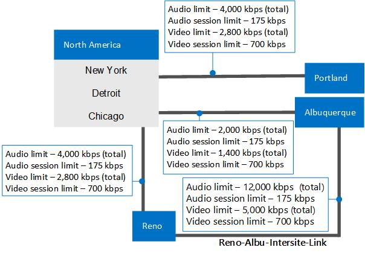

# 示例： 收集的要求的呼叫允许控制的 Skype 业务服务器Example: Gathering requirements for call admission control in Skype for Business Server
 
提供了详细的业务 Server 企业语音，包括收集有关您的网络站点、 区域、 和带宽规划 Skype 中的呼叫允许控制的示例。Provides a detailed example of planning for call admission control in Skype for Business Server Enterprise Voice, including gathering information about your network's sites, regions, and bandwidth.
  
此示例显示如何规划和实现呼叫允许控制 (CAC)。总体来说，包括以下活动：This example shows you how to plan for and implement call admission control (CAC). At a high level, this consists of the following activities:
  
1. 标识所有网络中心和网络中枢（称为网络区域）。Identify all of your network hubs and backbones (known as network regions).
    
2. 标识将管理每个网络区域的 CAC 的业务 Server 中央站点的 Skype。Identify the Skype for Business Server central site that will manage CAC for each network region.
    
3. 标识并定义连接到每个网络区域的网络站点。Identify and define the network sites that are connected to each network region.
    
4. 为每个网络站点其连接到 WAN 带宽限制，介绍的 WAN 连接和带宽限制的带宽容量的到网络管理员已为 Skype 对于业务服务器媒体流量，如果适用。For each network site whose connection to the WAN is bandwidth-constrained, describe the bandwidth capacity of the WAN connection and the bandwidth limits that to the network administrator has set for Skype for Business Server media traffic, if applicable. 不需要包括与 WAN 的连接不受带宽限制的站点。You do not need to include sites whose connection to the WAN is not bandwidth-constrained.
    
5. 将网络中的每个子网与一个网络站点相关联。Associate each subnet in your network with a network site.
    
6. 映射网络区域之间的链路。Map the links between the network regions. 每个链接，介绍了其带宽容量和网络管理员具有在放置 Skype 业务服务器媒体流量任何限制。For each link, describe its bandwidth capacity and any limits that the network administrator has placed on Skype for Business Server media traffic.
    
7. 定义每对网络区域之间的路由。Define a route between every pair of network regions.
    
## 收集所需信息Gather the Required Information

要准备呼叫允许控制，请收集以下步骤中描述的信息：To prepare for call admission control, gather the information described in the following steps:
  
1. 标识网络区域。网络区域代表网络中枢或网络中心。Identify your network regions. A network region represents a network backbone or a network hub. 
    
    网络中枢或网络中心是计算机网络基础结构的一部分，它将网络的各个部分相互连接起来，提供在不同 LAN 或子网之间交换信息的路径。网络中枢可以将各种网络关联在一起，适用范围从较小区域到广阔的地理区域。网络中枢的容量通常大于与其连接的网络的容量。A network backbone or a network hub is a part of computer network infrastructure that interconnects various pieces of network, providing a path for the exchange of information between different LANs or subnets. A backbone can tie together diverse networks, from a small location to a wide geographic area. The backbone's capacity is typically greater than that of the networks connected to it.
    
    示例拓扑具有三个网络区域：北美、EMEA 和 APAC。网络区域包含网络站点的集合。与网络管理员合作以定义企业的网络区域。Our example topology has three network regions: North America, EMEA, and APAC. A network region contains a collection of network sites. Work with your network administrator to define the network regions for your enterprise.
    
2. 标识每个网络区域相关联的中央站点。Identify each network region's associated central site. 中央站点包含至少一个前端服务器，将通过 WAN 连接的网络区域的所有媒体通信的管理 CAC 的业务服务器部署 Skype。A central site contains at least one Front End Server and is the Skype for Business Server deployment that will manage CAC for all media traffic that passes through the network region's WAN connection.
    
   **分为三个网络区域的企业网络示例****An example enterprise network divided into three network regions**

     
  
    > [!NOTE]
    > 多协议标签交换 (MPLS) 网络应代表一个网络区域，在该网络区域中，每个物理位置都具有一个相应的网络站点。A Multiprotocol Label Switching (MPLS) network should be represented as a network region in which each geographic location has a corresponding network site. 有关详细信息，请参阅[的组件和拓扑的呼叫允许控制 Skype for Business 中](components-and-topologies.md)。For details, see [Components and topologies for call admission control in Skype for Business](components-and-topologies.md). 
  
    在上述示例网络拓扑中，有三个网络区域，每个业务 Server 管理中心网站的管理 CAC Skype。In the preceding example network topology, there are three network regions, each with a Skype for Business Server central site that manages CAC. 按地理距离选择网络区域相应的中央站点。The appropriate central site for a network region is chosen by the geographic vicinity. 由于网络区域内的媒体流量最多，按地理距离选择中央站点使网络区域能够独立运行，因此即使其他中央站点不可用，网络区域也可以继续正常工作。Because media traffic will be heaviest within network regions, the ownership by geographic vicinity makes it self-contained and will continue to be functional even if other central sites become unavailable. 
    
    本示例中，名为 Chicago 的业务部署 Skype 是北美区域的中央站点。In this example, a Skype for Business deployment named Chicago is the central site for the North America region.
    
    North America 中的业务用户的所有 Skype 都位于芝加哥部署中的服务器。All Skype for Business users in North America are homed on servers in the Chicago deployment. 下表显示了所有三个网络区域的中央站点。The following table shows central sites for all three network regions.
    
    **网络区域及其关联的中央站点****Network Regions and their Associated Central Sites**

    |**网络区域****Network Region**|**中央站点****Central Site**|
    |:-----|:-----|
    |北美North America    |芝加哥Chicago    |
    |EMEAEMEA    |伦敦London    |
    |APACAPAC    |北京Beijing    |
   
    > [!NOTE]
    > 根据您 Skype 企业服务器拓扑，同一中央站点可分配给多个网络区域。Depending on your Skype for Business Server topology, the same central site can be assigned to multiple network regions. 
  
3. 对于每个网络区域，标识其 WAN 连接不受带宽限制的所有网络站点（办公室或位置）。由于这些站点不受带宽限制，因此无需对其应用 CAC 带宽策略。For each network region, identify all of the network sites (offices or locations) whose WAN connections are not bandwidth-constrained. Because these sites are not bandwidth constrained, you do not need to apply CAC bandwidth policies to them.
    
    在下表显示的示例中，有三个网络站点没有受带宽限制的 WAN 链路：纽约、芝加哥和底特律。In the example shown in the following table, three network sites do not have bandwidth-constrained WAN links: New York, Chicago, and Detroit.
    
   **不受 WAN 带宽限制的网络站点****Network Sites not Constrained by WAN Bandwidth**

   |**网络站点****Network Site**|**网络区域****Network Region**|
   |:-----|:-----|
   |纽约New York    |北美North America    |
   |芝加哥Chicago    |北美North America    |
   |底特律Detroit    |北美North America    |
   
4. 对于每个网络区域，标识所有通过受带宽限制的 WAN 链路连接到网络区域的网络站点。For each network region, identify all of the network sites that connect to the network region through bandwidth-constrained WAN links.
    
    为了帮助确保音频和视频质量，我们建议这些受带宽限制的网络站点监控其 WAN，并拥有限制流入和流出网络区域的媒体（音频或视频）流量的 CAC 带宽策略。To help ensure audio and video quality, we recommend that these bandwidth-constrained network sites have their WANs monitored and CAC bandwidth policies that limit media (voice or video) traffic flow to and from the network region.
    
    在下表显示的示例中，有三个受 WAN 带宽限制的网络站点：波特兰、里诺和阿尔伯克基。In the example shown in the following table, there are three network sites that are constrained by WAN bandwidth: Portland, Reno and Albuquerque.
    
   **受 WAN 带宽限制的网络站点****Network Sites Constrained by WAN Bandwidth**

   |**网络站点****Network Site**|**网络区域****Network Region**|
   |:-----|:-----|
   |阿尔伯克基Albuquerque    |北美North America    |
   |里诺Reno    |北美North America    |
   |波特兰Portland    |北美North America    |
   
   **CAC 网络区域北美拥有三个不受带宽限制的网络站点（芝加哥、纽约和底特律）和三个受 WAN 带宽限制的网络站点（波特兰、里诺和阿尔伯克基）****CAC network region North America with three network sites that are unconstrained by bandwidth (Chicago, New York, and Detroit) and three network sites that are constrained by WAN bandwidth (Portland, Reno, and Albuquerque)**

     
  
5. 对于每个受带宽限制的 WAN 链路，需确定以下事项：For each bandwidth-constrained WAN link, determine the following:
    
  - 要为所有并发音频会话设置的总体带宽限制。Overall bandwidth limit that you want to set for all concurrent audio sessions. 如果新的音频会话将导致超过此限制，业务服务器 Skype 不允许会话，从而启动。If a new audio session will cause this limit to be exceeded, Skype for Business Server does not allow the session to start.
    
  - 要为每个单独的音频会话设置的带宽限制。默认 CAC 带宽限制是 175 kbps，但是管理员可修改该值。Bandwidth limit that you want to set for each individual audio session. The default CAC bandwidth limit is 175 kbps, but it can be modified by the administrator.
    
  - 要为所有并发视频会话设置的总体带宽限制。Overall bandwidth limit that you want to set for all concurrent video sessions. 如果新视频会话将导致超过此限制，业务服务器 Skype 不允许会话，从而启动。If a new video session will cause this limit to be exceeded, Skype for Business Server does not allow the session to start.
    
  - 要为每个单独的视频会话设置的带宽限制。默认 CAC 带宽限制是 700 kbps，但是管理员可修改该值。Bandwidth limit that you want to set for each individual video session. The default CAC bandwidth limit is 700 kbps, but it can be modified by the administrator.
    
    **具有 WAN 带宽限制信息（带宽单位：kbps）的网络站点****Network Sites with WAN Bandwidth Constraint Information (Bandwidth in kbps)**

    |**网络站点****Network Site**|**网络区域****Network Region**|**BW 限制****BW Limit**|**音频限制****Audio Limit**|**音频会话限制****Audio Session Limit**|**视频限制****Video Limit**|**视频会话限制****Video Session Limit**|
    |:-----|:-----|:-----|:-----|:-----|:-----|:-----|
    |阿尔伯克基Albuquerque    |北美North America    |5,000 个5,000    |2,000 个2,000    |175175    |14001,400    |700700    |
    |里诺Reno    |北美North America    |10,000 个10,000    |40004,000    |175175    |2,8002,800    |700700    |
    |波特兰Portland    |北美North America    |5,000 个5,000    |40004,000    |175175    |2,8002,800    |700700    |
    |纽约New York    |北美North America    |（没有限制）(no limit)    |（没有限制）(no limit)    |（没有限制）(no limit)    |（没有限制）(no limit)    |（没有限制）(no limit)    |
    |芝加哥Chicago    |北美North America    |（没有限制）(no limit)    |（没有限制）(no limit)    |（没有限制）(no limit)    |（没有限制）(no limit)    |（没有限制）(no limit)    |
    |底特律Detroit    |北美North America    |（没有限制）(no limit)    |（没有限制）(no limit)    |（没有限制）(no limit)    |（没有限制）(no limit)    |（没有限制）(no limit)    |
   
6. 对于网络中的每个子网，指定其关联的网络站点。For every subnet in your network, specify its associated network site.
    
    > [!IMPORTANT]
    > 即使网络站点不受带宽限制，网络中的每个子网也必须与一个网络站点相关联。这是因为呼叫允许控制使用子网信息来确定终结点所在的网络站点。确定会话双方的位置后，呼叫允许控制可以确定是否有足够的带宽来建立呼叫。当通过没有带宽限制的链路建立会话时，会生成警报。Every subnet in your network must be associated with a network site, even if the network site is not bandwidth constrained. This is because call admission control uses subnet information to determine at which network site an endpoint is located. When the locations of both parties in the session are determined, call admission control can determine if there is sufficient bandwidth to establish a call. When a session is established over a link that has no bandwidth limits, an alert is generated. 
  
    > [!IMPORTANT]
    > 如果部署音频/视频边缘服务器，则每台边缘服务器的公共 IP 地址都必须与部署边缘服务器的网络站点关联。If you deploy Audio/Video Edge Servers, the public IP addresses of each Edge Server must be associated with the network site where the Edge Server is deployed. 必须将 A/V 边缘服务器的每个公共 IP 地址作为子网掩码为 32 的子网添加到网络配置设置中。Each public IP address of the A/V Edge Server must be added to your network configuration settings as a subnet with a subnet mask of 32. 例如，如果在芝加哥部署 A/V 边缘服务器，则为这些服务器的每个外部 IP 地址创建一个子网掩码为 32 的子网，并将网络站点芝加哥与这些子网相关联。For example, if you deploy A/V Edge Servers in Chicago, then for each external IP address of those servers create a subnet with a subnet mask of 32 and associate network site Chicago with those subnets. 有关公用 IP 地址的详细信息，请参阅[Plan for Business 的 Skype 的网络要求](../../plan-your-deployment/network-requirements/network-requirements.md)。For details about public IP addresses, see [Plan network requirements for Skype for Business](../../plan-your-deployment/network-requirements/network-requirements.md). 
  
    生成关键运行状况指示器 (KHI) 警报，指定存在于网络中但不与子网关联的 IP 地址列表，或指定包含 IP 地址的子网不与网络站点关联。该警报在 8 小时内只产生一次。相关的警报信息和示例如下所示：A Key Health Indicator (KHI) alert is raised, specifying a list of IP addresses that are present in your network but are either not associated with a subnet, or the subnet that includes the IP addresses is not associated with a network site. This alert will not be raised more than once within an 8 hour period. The relevant alert information and an example are as follows:
    
    **来源**：CS 带宽策略服务（核心）**Source**: CS Bandwidth Policy Service (Core) 
    
    **事件编号**：36034**Event number**: 36034
    
    **级别**：2**Level**: 2
    
    **说明**： 以下 IP 地址的子网：\<的 IP 地址列表\>未配置，或者子网未与网络站点关联。**Description**: The subnets for the following IP Addresses: \<List of IP Addresses\> are either not configured or the subnets are not associated to a network site. 
    
    **原因**：网络配置设置中缺少相应 IP 地址的子网，或子网未与网络站点相关联。**Cause**: The subnets for the corresponding IP addresses are missing from the network configuration settings or the subnets are not associated to a network site. 
    
    **解决方案**：将与上述 IP 地址列表对应的子网添加到网络配置设置中，并将每个子网关联到网络站点。**Resolution**: Add subnets corresponding to the preceding list of IP addresses into the network configuration settings and associate every subnet to a network site.
    
    例如，如果警报中的 IP 地址列表指定 10.121.248.226 和 10.121.249.20，则可能是这些 IP 地址没有与子网关联，或者与其关联的子网不属于网络站点。如果 10.121.248.0/24 和 10.121.249.0/24 是与这些地址对应的子网，则可按如下所示解决此问题：For example, if the IP address list in the alert specifies 10.121.248.226 and 10.121.249.20, either these IP addresses are not associated with a subnet, or the subnet that they are associated with does not belong to a network site. If 10.121.248.0/24 and 10.121.249.0/24 are the corresponding subnets for these addresses, you can resolve this issue as follows:
    
    a.a. 确保 IP 地址 10.121.248.226 与子网 10.121.248.0/24 相关联，IP 地址 10.121.249.20 与子网 10.121.249.0/24 相关联。Be sure that IP address 10.121.248.226 is associated with the 10.121.248.0/24 subnet and IP address 10.121.249.20 is associated with the 10.121.249.0/24 subnet.
    
    b.b. 确保子网 10.121.248.0/24 和 10.121.249.0/24 分别与一个网络站点相关联。Be sure that the 10.121.248.0/24 and 10.121.249.0/24 subnets are each associated with a network site.
    
   **网络站点和关联子网（带宽单位：kbps）****Network Sites and Associated Subnets (Bandwidth in kbps)**

   |**网络站点****Network Site**|**网络区域****Network Region**|**BW 限制****BW Limit**|**音频限制****Audio Limit**|**音频会话限制****Audio Session Limit**|**视频限制****Video Limit**|**视频会话限制****Video Session Limit**|**子网****Subnets**|
   |:-----|:-----|:-----|:-----|:-----|:-----|:-----|:-----|
   |阿尔伯克基Albuquerque    |北美North America    |5,000 个5,000    |2,000 个2,000    |175175    |14001,400    |700700    |172.29.79.0/23 157.57.215.0/25、 172.29.90.0/23、 172.29.80.0/24172.29.79.0/23, 157.57.215.0/25, 172.29.90.0/23, 172.29.80.0/24    |
   |里诺Reno    |北美North America    |10,000 个10,000    |40004,000    |175175    |2,8002,800    |700700    |157.57.210.0/23、 172.28.151.128/25157.57.210.0/23, 172.28.151.128/25    |
   |波特兰Portland    |北美North America    |5,000 个5,000    |40004,000    |175175    |2,8002,800    |700700    |172.29.77.0/24 10.71.108.0/24、 157.57.208.0/23172.29.77.0/24 10.71.108.0/24, 157.57.208.0/23    |
   |纽约New York    |北美North America    |（没有限制）(no limit)    |（没有限制）(no limit)    |（没有限制）(no limit)    |（没有限制）(no limit)    |（没有限制）(no limit)    |172.29.80.0/23 157.57.216.0/25、 172.29.91.0/23、 172.29.81.0/24172.29.80.0/23, 157.57.216.0/25, 172.29.91.0/23, 172.29.81.0/24    |
   |芝加哥Chicago    |北美North America    |（没有限制）(no limit)    |（没有限制）(no limit)    |（没有限制）(no limit)    |（没有限制）(no limit)    |（没有限制）(no limit)    |157.57.211.0/23、 172.28.152.128/25157.57.211.0/23, 172.28.152.128/25    |
   |底特律Detroit    |北美North America    |（没有限制）(no limit)    |（没有限制）(no limit)    |（没有限制）(no limit)    |（没有限制）(no limit)    |（没有限制）(no limit)    |172.29.78.0/24 10.71.109.0/24、 157.57.209.0/23172.29.78.0/24 10.71.109.0/24, 157.57.209.0/23    |
   
7. 在 Business Server 呼叫允许控制的 Skype，网络区域之间的连接称为区域链接。In Skype for Business Server call admission control, the connections between network regions are called region links. 对于每个区域链路，按照对网络站点执行的操作，确定以下事项：For each region link, determine the following, just as you did for the network sites:
    
   - 要为所有并发音频会话设置的总体带宽限制。Overall bandwidth limit that you want to set for all concurrent audio sessions. 如果新的音频会话将导致超过此限制，业务服务器 Skype 不允许会话，从而启动。If a new audio session will cause this limit to be exceeded, Skype for Business Server does not allow the session to start.
    
   - 要为每个单独的音频会话设置的带宽限制。默认 CAC 带宽限制是 175 kbps，但是管理员可修改该值。Bandwidth limit that you want to set for each individual audio session. The default CAC bandwidth limit is 175 kbps, but it can be modified by the administrator.
    
   - 要为所有并发视频会话设置的总体带宽限制。Overall bandwidth limit that you want to set for all concurrent video sessions. 如果新视频会话将导致超过此限制，业务服务器 Skype 不允许会话，从而启动。If a new video session will cause this limit to be exceeded, Skype for Business Server does not allow the session to start.
    
   - 要为每个单独的视频会话设置的带宽限制。默认 CAC 带宽限制是 700 kbps，但是管理员可修改该值。Bandwidth limit that you want to set for each individual video session. The default CAC bandwidth limit is 700 kbps, but it can be modified by the administrator.
    
   **具有关联带宽限制的网络区域链路****Network Region links with associated bandwidth limits**

     
  
   **区域链路带宽信息（带宽单位：kbps）****Region Link Bandwidth Information (Bandwidth in kbps)**

   |**区域链路名称****Region Link Name**|**First Region****First Region**|**Second Region****Second Region**|**BW 限制****BW Limit**|**音频限制****Audio Limit**|**音频会话限制****Audio Session Limit**|**视频限制****Video Limit**|**视频会话限制****Video Session Limit**|
   |:-----|:-----|:-----|:-----|:-----|:-----|:-----|:-----|
   |NA-EMEA-LINKNA-EMEA-LINK    |北美North America    |EMEAEMEA    |50,000 个50,000    |2000020,000    |175175    |1400014,000    |700700    |
   |EMEA-APAC-LINKEMEA-APAC-LINK    |EMEAEMEA    |APACAPAC    |2500025,000    |10,000 个10,000    |175175    |70007,000    |700700    |
   
8. 定义每对网络区域之间的路由。Define a route between every pair of network regions.
    
    > [!NOTE]
    > 北美和 APAC 区域之间的路由需要两个链路，因为没有直接连接这两个区域的区域链路。Two links are required for the route between the North America and APAC regions because there is no region link that directly connects them. 
  
   **区域路由****Region Routes**

   |**区域路由名称****Region Route Name**|**First Region****First Region**|**Second Region****Second Region**|**区域链路****Region Links**|
   |:-----|:-----|:-----|:-----|
   |NA-EMEA-ROUTENA-EMEA-ROUTE    |北美North America    |EMEAEMEA    |NA-EMEA-LINKNA-EMEA-LINK    |
   |EMEA-APAC-ROUTEEMEA-APAC-ROUTE    |EMEAEMEA    |APACAPAC    |EMEA-APAC-LINKEMEA-APAC-LINK    |
   |NA-APAC-ROUTENA-APAC-ROUTE    |北美North America    |APACAPAC    |NA-EMEA-LINK、EMEA-APAC-LINKNA-EMEA-LINK, EMEA-APAC-LINK    |
   
9. 对于通过单链路（称为站点间链路）直接进行连接的每对网络站点，需确定以下事项：For every pair of network sites that are directly connected by a single link (called an inter-site link), determine the following:
    
     - 要为所有并发音频会话设置的总体带宽限制。Overall bandwidth limit that you want to set for all concurrent audio sessions. 如果新的音频会话将导致超过此限制，业务服务器 Skype 不允许会话，从而启动。If a new audio session will cause this limit to be exceeded, Skype for Business Server does not allow the session to start.
    
     - 要为每个单独的音频会话设置的带宽限制。默认 CAC 带宽限制是 175 kbps，但是管理员可修改该值。Bandwidth limit that you want to set for each individual audio session. The default CAC bandwidth limit is 175 kbps, but it can be modified by the administrator.
    
     - 要为所有并发视频会话设置的总体带宽限制。Overall bandwidth limit that you want to set for all concurrent video sessions. 如果新视频会话将导致超过此限制，业务服务器 Skype 不允许会话，从而启动。If a new video session will cause this limit to be exceeded, Skype for Business Server does not allow the session to start.
    
     - 要为每个单独的视频会话设置的带宽限制。默认 CAC 带宽限制是 700 kbps，但是管理员可修改该值。Bandwidth limit that you want to set for each individual video session. The default CAC bandwidth limit is 700 kbps, but it can be modified by the administrator.
    
   **CAC 网络区域北美显示里诺和阿尔伯克基之间的站点间链路的带宽容量和带宽限制****CAC network region North America showing the bandwidth capacities and bandwidth limits for the inter-site link between Reno and Albuquerque**

     
  
   **两个网络站点间的站点间链路的带宽信息（带宽单位：kbps）****Bandwidth Information for an Inter-Site Link between Two Network Sites (Bandwidth in kbps)**

   |**站点间链路名称****Inter-Site Link Name**|**第一个站点****First Site**|**第二个站点****Second Site**|**BW 限制****BW Limit**|**音频限制****Audio Limit**|**音频会话限制****Audio Session Limit**|**视频限制****Video Limit**|**视频会话限制****Video Session Limit**|
   |:-----|:-----|:-----|:-----|:-----|:-----|:-----|:-----|
   |Reno-Albu-Intersite-LinkReno-Albu-Intersite-Link    |里诺Reno    |阿尔伯克基Albuquerque    |2000020,000    |1200012,000    |175175    |5,000 个5,000    |700700    |
   
### 后续步骤Next Steps

收集所需的信息后，您可以执行 CAC 部署通过使用 Business Server Management Shell 的 Skype 的业务 Server Control Panel。After you have gathered the required information, you can perform CAC deployment either by using the Skype for Business Server Management Shell or Skype for Business Server Control Panel.
  
> [!NOTE]
> 虽然您可以使用适用于业务 Server Control Panel Skype 执行大多数网络配置任务，以创建子网和站点间链接，您必须使用 Skype 业务 Server Management Shell。Although you can perform most network configuration tasks by using Skype for Business Server Control Panel, to create subnets and intersite links, you must use Skype for Business Server Management Shell. 有关详细信息，请参阅[New-csnetworksubnet](https://docs.microsoft.com/powershell/module/skype/new-csnetworksubnet?view=skype-ps)和[新建 CsNetworkInterSitePolicy](https://docs.microsoft.com/powershell/module/skype/new-csnetworkintersitepolicy?view=skype-ps)。For details, see [New-CsNetworkSubnet](https://docs.microsoft.com/powershell/module/skype/new-csnetworksubnet?view=skype-ps) and [New-CsNetworkInterSitePolicy](https://docs.microsoft.com/powershell/module/skype/new-csnetworkintersitepolicy?view=skype-ps). 
  

