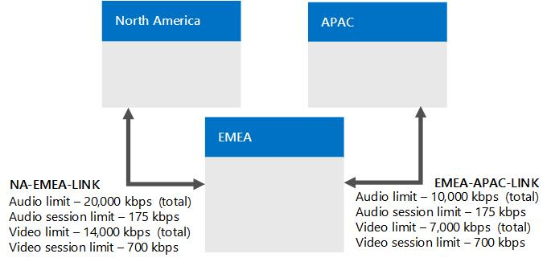

# 示例： 收集的要求的呼叫允许控制的 Skype 业务服务器

提供了详细的业务 Server 企业语音，包括收集有关您的网络站点、 区域、 和带宽规划 Skype 中的呼叫允许控制的示例。

此示例显示如何规划和实现呼叫允许控制 (CAC)。总体来说，包括以下活动：

1. 标识所有网络中心和网络中枢（称为网络区域）。

2. 标识将管理每个网络区域的 CAC 的业务 Server 中央站点的 Skype。

3. 标识并定义连接到每个网络区域的网络站点。

4. 为每个网络站点其连接到 WAN 带宽限制，介绍的 WAN 连接和带宽限制的带宽容量的到网络管理员已为 Skype 对于业务服务器媒体流量，如果适用。 不需要包括与 WAN 的连接不受带宽限制的站点。

5. 将网络中的每个子网与一个网络站点相关联。

6. 映射网络区域之间的链路。 每个链接，介绍了其带宽容量和网络管理员具有在放置 Skype 业务服务器媒体流量任何限制。

7. 定义每对网络区域之间的路由。

## 收集所需信息

要准备呼叫允许控制，请收集以下步骤中描述的信息：

1. 标识网络区域。网络区域代表网络中枢或网络中心。 

    网络中枢或网络中心是计算机网络基础结构的一部分，它将网络的各个部分相互连接起来，提供在不同 LAN 或子网之间交换信息的路径。网络中枢可以将各种网络关联在一起，适用范围从较小区域到广阔的地理区域。网络中枢的容量通常大于与其连接的网络的容量。

    示例拓扑具有三个网络区域：北美、EMEA 和 APAC。网络区域包含网络站点的集合。与网络管理员合作以定义企业的网络区域。

2. 标识每个网络区域相关联的中央站点。 中央站点包含至少一个前端服务器，将通过 WAN 连接的网络区域的所有媒体通信的管理 CAC 的业务服务器部署 Skype。

   **分为三个网络区域的企业网络示例**

     

    > [!NOTE]
    > 多协议标签交换 (MPLS) 网络应代表一个网络区域，在该网络区域中，每个物理位置都具有一个相应的网络站点。 有关详细信息，请参阅[的组件和拓扑的呼叫允许控制 Skype for Business 中](components-and-topologies.md)。 

    在上述示例网络拓扑中，有三个网络区域，每个业务 Server 管理中心网站的管理 CAC Skype。 按地理距离选择网络区域相应的中央站点。 由于网络区域内的媒体流量最多，按地理距离选择中央站点使网络区域能够独立运行，因此即使其他中央站点不可用，网络区域也可以继续正常工作。 

    本示例中，名为 Chicago 的业务部署 Skype 是北美区域的中央站点。

    North America 中的业务用户的所有 Skype 都位于芝加哥部署中的服务器。 下表显示了所有三个网络区域的中央站点。

    **网络区域及其关联的中央站点**

    |**网络区域**|**中央站点**|
    |:-----|:-----|
    |北美    |芝加哥    |
    |EMEA    |伦敦    |
    |APAC    |北京    |

    > [!NOTE]
    > 根据您 Skype 企业服务器拓扑，同一中央站点可分配给多个网络区域。 

3. 对于每个网络区域，标识其 WAN 连接不受带宽限制的所有网络站点（办公室或位置）。由于这些站点不受带宽限制，因此无需对其应用 CAC 带宽策略。

    在下表显示的示例中，有三个网络站点没有受带宽限制的 WAN 链路：纽约、芝加哥和底特律。

   **不受 WAN 带宽限制的网络站点**

   | **网络站点** | **网络区域**   |
   |:-----------------|:---------------------|
   | 纽约     | 北美    |
   | 芝加哥      | 北美    |
   | 底特律      | 北美    |

4. 对于每个网络区域，标识所有通过受带宽限制的 WAN 链路连接到网络区域的网络站点。

    为了帮助确保音频和视频质量，我们建议这些受带宽限制的网络站点监控其 WAN，并拥有限制流入和流出网络区域的媒体（音频或视频）流量的 CAC 带宽策略。

    在下表显示的示例中，有三个受 WAN 带宽限制的网络站点：波特兰、里诺和阿尔伯克基。

   **受 WAN 带宽限制的网络站点**

   |**网络站点**|**网络区域**|
   |:-----|:-----|
   |阿尔伯克基    |北美    |
   |里诺    |北美    |
   |波特兰    |北美    |

   **CAC 网络区域北美拥有三个不受带宽限制的网络站点（芝加哥、纽约和底特律）和三个受 WAN 带宽限制的网络站点（波特兰、里诺和阿尔伯克基）**

     

5. 对于每个受带宽限制的 WAN 链路，需确定以下事项：

   - 要为所有并发音频会话设置的总体带宽限制。 如果新的音频会话将导致超过此限制，业务服务器 Skype 不允许会话，从而启动。

   - 要为每个单独的音频会话设置的带宽限制。默认 CAC 带宽限制是 175 kbps，但是管理员可修改该值。

   - 要为所有并发视频会话设置的总体带宽限制。 如果新视频会话将导致超过此限制，业务服务器 Skype 不允许会话，从而启动。

   - 要为每个单独的视频会话设置的带宽限制。默认 CAC 带宽限制是 700 kbps，但是管理员可修改该值。

     **具有 WAN 带宽限制信息（带宽单位：kbps）的网络站点**

     | **网络站点**   | **网络区域**   | **BW 限制**      | **音频限制**   | **音频会话限制** | **视频限制**   | **视频会话限制** |
     |:-------------------|:---------------------|:------------------|:------------------|:------------------------|:------------------|:------------------------|
     | 阿尔伯克基    | 北美    | 5,000 个         | 2,000 个         | 175                 | 1400         | 700                 |
     | 里诺           | 北美    | 10,000 个        | 4000         | 175                 | 2,800         | 700                 |
     | 波特兰       | 北美    | 5,000 个         | 4000         | 175                 | 2,800         | 700                 |
     | 纽约       | 北美    | （没有限制）    | （没有限制）    | （没有限制）          | （没有限制）    | （没有限制）          |
     | 芝加哥        | 北美    | （没有限制）    | （没有限制）    | （没有限制）          | （没有限制）    | （没有限制）          |
     | 底特律        | 北美    | （没有限制）    | （没有限制）    | （没有限制）          | （没有限制）    | （没有限制）          |

6. 对于网络中的每个子网，指定其关联的网络站点。

    > [!IMPORTANT]
    > 即使网络站点不受带宽限制，网络中的每个子网也必须与一个网络站点相关联。这是因为呼叫允许控制使用子网信息来确定终结点所在的网络站点。确定会话双方的位置后，呼叫允许控制可以确定是否有足够的带宽来建立呼叫。当通过没有带宽限制的链路建立会话时，会生成警报。 

    > [!IMPORTANT]
    > 如果部署音频/视频边缘服务器，则每台边缘服务器的公共 IP 地址都必须与部署边缘服务器的网络站点关联。 必须将 A/V 边缘服务器的每个公共 IP 地址作为子网掩码为 32 的子网添加到网络配置设置中。 例如，如果在芝加哥部署 A/V 边缘服务器，则为这些服务器的每个外部 IP 地址创建一个子网掩码为 32 的子网，并将网络站点芝加哥与这些子网相关联。 有关公用 IP 地址的详细信息，请参阅[Plan for Business 的 Skype 的网络要求](../../plan-your-deployment/network-requirements/network-requirements.md)。 

    生成关键运行状况指示器 (KHI) 警报，指定存在于网络中但不与子网关联的 IP 地址列表，或指定包含 IP 地址的子网不与网络站点关联。该警报在 8 小时内只产生一次。相关的警报信息和示例如下所示：

    **来源**：CS 带宽策略服务（核心） 

    **事件编号**：36034

    **级别**：2

    **说明**： 以下 IP 地址的子网：\<的 IP 地址列表\>未配置，或者子网未与网络站点关联。 

    **原因**：网络配置设置中缺少相应 IP 地址的子网，或子网未与网络站点相关联。 

    **解决方案**：将与上述 IP 地址列表对应的子网添加到网络配置设置中，并将每个子网关联到网络站点。

    例如，如果警报中的 IP 地址列表指定 10.121.248.226 和 10.121.249.20，则可能是这些 IP 地址没有与子网关联，或者与其关联的子网不属于网络站点。如果 10.121.248.0/24 和 10.121.249.0/24 是与这些地址对应的子网，则可按如下所示解决此问题：

    a. 确保 IP 地址 10.121.248.226 与子网 10.121.248.0/24 相关联，IP 地址 10.121.249.20 与子网 10.121.249.0/24 相关联。

    b. 确保子网 10.121.248.0/24 和 10.121.249.0/24 分别与一个网络站点相关联。

   **网络站点和关联子网（带宽单位：kbps）**

   | **网络站点**   | **网络区域**   | **BW 限制**      | **音频限制**   | **音频会话限制** | **视频限制**   | **视频会话限制** | **子网**                                                            |
   |:-------------------|:---------------------|:------------------|:------------------|:------------------------|:------------------|:------------------------|:-----------------------------------------------------------------------|
   | 阿尔伯克基    | 北美    | 5,000 个         | 2,000 个         | 175                 | 1400         | 700                 | 172.29.79.0/23 157.57.215.0/25、 172.29.90.0/23、 172.29.80.0/24    |
   | 里诺           | 北美    | 10,000 个        | 4000         | 175                 | 2,800         | 700                 | 157.57.210.0/23、 172.28.151.128/25                                 |
   | 波特兰       | 北美    | 5,000 个         | 4000         | 175                 | 2,800         | 700                 | 172.29.77.0/24 10.71.108.0/24、 157.57.208.0/23                     |
   | 纽约       | 北美    | （没有限制）    | （没有限制）    | （没有限制）          | （没有限制）    | （没有限制）          | 172.29.80.0/23 157.57.216.0/25、 172.29.91.0/23、 172.29.81.0/24    |
   | 芝加哥        | 北美    | （没有限制）    | （没有限制）    | （没有限制）          | （没有限制）    | （没有限制）          | 157.57.211.0/23、 172.28.152.128/25                                 |
   | 底特律        | 北美    | （没有限制）    | （没有限制）    | （没有限制）          | （没有限制）    | （没有限制）          | 172.29.78.0/24 10.71.109.0/24、 157.57.209.0/23                     |

7. 在 Business Server 呼叫允许控制的 Skype，网络区域之间的连接称为区域链接。 对于每个区域链路，按照对网络站点执行的操作，确定以下事项：

   - 要为所有并发音频会话设置的总体带宽限制。 如果新的音频会话将导致超过此限制，业务服务器 Skype 不允许会话，从而启动。

   - 要为每个单独的音频会话设置的带宽限制。默认 CAC 带宽限制是 175 kbps，但是管理员可修改该值。

   - 要为所有并发视频会话设置的总体带宽限制。 如果新视频会话将导致超过此限制，业务服务器 Skype 不允许会话，从而启动。

   - 要为每个单独的视频会话设置的带宽限制。默认 CAC 带宽限制是 700 kbps，但是管理员可修改该值。

   **具有关联带宽限制的网络区域链路**

     

   **区域链路带宽信息（带宽单位：kbps）**

   | **区域链路名称**  | **First Region**     | **Second Region** | **BW 限制**  | **音频限制** | **音频会话限制** | **视频限制** | **视频会话限制** |
   |:----------------------|:---------------------|:------------------|:--------------|:----------------|:------------------------|:----------------|:------------------------|
   | NA-EMEA-LINK      | 北美    | EMEA          | 50,000 个    | 20000      | 175                 | 14000      | 700                 |
   | EMEA-APAC-LINK    | EMEA             | APAC          | 25000    | 10,000 个      | 175                 | 7000       | 700                 |

8. 定义每对网络区域之间的路由。

    > [!NOTE]
    > 北美和 APAC 区域之间的路由需要两个链路，因为没有直接连接这两个区域的区域链路。 

   **区域路由**

   | **区域路由名称**  | **First Region**     | **Second Region** | **区域链路**                    |
   |:-----------------------|:---------------------|:------------------|:------------------------------------|
   | NA-EMEA-ROUTE      | 北美    | EMEA          | NA-EMEA-LINK                    |
   | EMEA-APAC-ROUTE    | EMEA             | APAC          | EMEA-APAC-LINK                  |
   | NA-APAC-ROUTE      | 北美    | APAC          | NA-EMEA-LINK、EMEA-APAC-LINK    |

9. 对于通过单链路（称为站点间链路）直接进行连接的每对网络站点，需确定以下事项：

     - 要为所有并发音频会话设置的总体带宽限制。 如果新的音频会话将导致超过此限制，业务服务器 Skype 不允许会话，从而启动。

     - 要为每个单独的音频会话设置的带宽限制。默认 CAC 带宽限制是 175 kbps，但是管理员可修改该值。

     - 要为所有并发视频会话设置的总体带宽限制。 如果新视频会话将导致超过此限制，业务服务器 Skype 不允许会话，从而启动。

     - 要为每个单独的视频会话设置的带宽限制。默认 CAC 带宽限制是 700 kbps，但是管理员可修改该值。

   **CAC 网络区域北美显示里诺和阿尔伯克基之间的站点间链路的带宽容量和带宽限制**

     

   **两个网络站点间的站点间链路的带宽信息（带宽单位：kbps）**

   |**站点间链路名称**|**第一个站点**|**第二个站点**|**BW 限制**|**音频限制**|**音频会话限制**|**视频限制**|**视频会话限制**|
   |:-----|:-----|:-----|:-----|:-----|:-----|:-----|:-----|
   |Reno-Albu-Intersite-Link    |里诺    |阿尔伯克基    |20000    |12000    |175    |5,000 个    |700    |

### 后续步骤

收集所需的信息后，您可以执行 CAC 部署通过使用 Business Server Management Shell 的 Skype 的业务 Server Control Panel。

> [!NOTE]
> 虽然您可以使用适用于业务 Server Control Panel Skype 执行大多数网络配置任务，以创建子网和站点间链接，您必须使用 Skype 业务 Server Management Shell。 有关详细信息，请参阅[New-csnetworksubnet](https://docs.microsoft.com/powershell/module/skype/new-csnetworksubnet?view=skype-ps)和[新建 CsNetworkInterSitePolicy](https://docs.microsoft.com/powershell/module/skype/new-csnetworkintersitepolicy?view=skype-ps)。 

