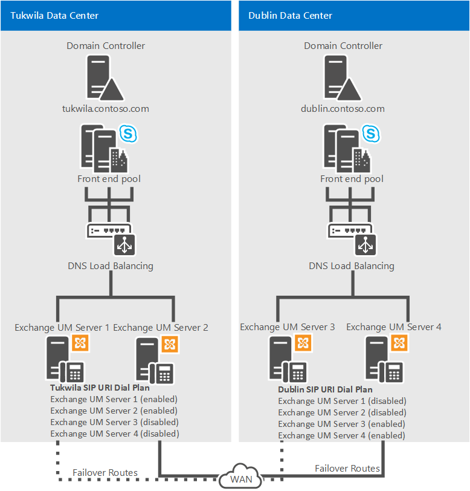

# 规划 Skype for Business 中的 Exchange 统一消息集成

**摘要：** 在计划将 Skype for Business Server 与 Exchange 2013 或 Exchange 2016 集成时，请查看本主题。

Skype for Business Server 支持与 Exchange 统一消息 (UM) 集成，以将语音邮件和电子邮件合并到单个邮件基础结构中。 在 Exchange 中，Exchange 统一 (UM) 是您可以安装和配置的多个 Exchange 服务器角色之一。

在 Microsoft Exchange Server 2013 和 2016 中，Exchange UM 作为服务在 Exchange 邮箱服务器上运行。 对于 Skype for Business Server 企业语音部署，统一消息将语音邮件和电子邮件合并到一个存储中，用户可以从电话 (Outlook Voice Access) 计算机访问。 统一消息和 Skype for Business Server 协同工作，为 Outlook Voice Access 用户提供呼叫应答、企业语音。

> [!NOTE]
> 将 Skype for Business 2019 与 Exchange 2013 或 Exchange 2016 集成后，Exchange UM 在 Skype for Business Server 2019 中仍可用。 由于 Exchange 2019 中支持的变化，Exchange UM 集成的重要性正在减少，以支持云语音邮件和云自动助理功能。  有关详细信息 [，请参阅规划云语音邮件](../../../sfbhybrid/hybrid/plan-cloud-voicemail.md) 服务和 [Skype for Business Server Exchange Server迁移](../../../sfbhybrid/hybrid/plan-um-migration.md) 。

若要在本地 Exchange UM 部署中支持这些功能，必须运行以下项之一：

- Microsoft Exchange Server Skype for Business Server 2015 (2010 或最新的 Service Pack) 
- Microsoft Exchange Server 2013
- Microsoft Exchange Server 2016

> [!NOTE]
> 以前已知的 Exchange 统一消息在 Skype for Business Server 2019 中不再可用，Skype for Business Server 2019 使用电话系统录制语音邮件消息，然后将记录留在用户的 Exchange 邮箱中。 有关详细信息 [，请参阅"](../../../sfbhybrid/hybrid/plan-cloud-voicemail.md) 规划云语音邮件服务"。

## 集成统一消息和 Skype for Business Server 的功能

Skype for Business Server 企业语音 使用 Exchange 统一消息 (UM) 基础结构来提供呼叫应答、呼叫通知、 (包括语音邮件) 和自动助理服务。

- **呼叫应答** 呼叫应答是代表呼叫未应答或忙碌的用户接收语音邮件。 它包括播放个人问候语、录制邮件以及将邮件提交到用户邮箱（存储在 Exchange 邮箱服务器上）排队等待传递。

    如果呼叫者有留言，该留言将路由到用户的收件箱中。如果呼叫者未留言，则将在用户的邮箱中存储一条未接来电通知。然后，用户可以使用 Microsoft Outlook 消息和协作客户端、Outlook Web Access、Exchange ActiveSync 技术或 Outlook Voice Access 来访问其收件箱。可以像显示电子邮件的主题和优先级一样显示呼叫的主题和优先级。

- **Outlook Voice Access** Outlook Voice Access使企业语音用户不仅能够访问语音邮件，还能够访问 Exchange 收件箱，包括电子邮件、日历和电话界面中的联系人。 订阅者访问号码由 Exchange UM 管理员分配。

- **自动助理** 自动助理是一项 Exchange UM 功能，可用于配置外部用户可以拨打以联系公司代表的电话号码。 尤其是，它可以提供一系列语音提示来帮助外部呼叫者导航菜单系统。 可用选项列表由 Exchange UM 管理员在 Exchange UM 服务器上配置。

- **传真服务** Exchange UM 包括传真功能，使用户可以接收其 Exchange 邮箱中的传入传真。 有关详细信息，请参阅统 [一消息文档](https://go.microsoft.com/fwlink/p/?linkId=135652) Microsoft Exchange Server消息。

    > [!NOTE]
    > Exchange UM 服务器提供的传真服务在与 Microsoft Exchange Server 2010、带最新 Service Pack 的 Exchange 2010、Exchange 2013 或 Exchange 2016 集成的 Skype for Business Server 部署中不可用。

## Skype for Business Server 中本地统一消息的组件和拓扑

### Exchange Server 组件

若要向组织中 企业语音 用户提供集成统一消息和 [Skype for Business Server](#features-of-integrated-unified-messaging-and-skype-for-business-server) 的功能中描述的 Exchange UM 功能和服务，必须部署 Microsoft Exchange 邮箱服务器和客户端访问服务器，该服务器承载用户邮箱并为电子邮件和语音邮件提供单个存储位置。 Exchange UM 作为服务在 Exchange 邮箱和客户端访问服务器上运行。

有关 Microsoft Exchange Server 2010 中的 Exchange UM 组件的详细信息，请参阅"部署本地[Exchange UM 以提供 Lync Server 2013 Preview 语音邮件"。](https://technet.microsoft.com/library/9673bd73-a3a3-425d-870f-04d801c6d0d5.aspx)

### 支持的拓扑

可以将 Skype for Business Server 和 Exchange 统一 (UM) 部署在同一林或多个林中。 如果部署跨多个林，则必须针对每个 Exchange UM 林执行 Exchange 集成步骤。 此外，必须将每个 Microsoft Exchange 林配置为信任 Skype for Business Server 林和 Skype for Business Server 林，以信任每个 Exchange UM 林。 除了此林信任之外，还必须在 Skype for Business Server 林中的用户对象上设置所有用户的 Exchange UM 设置。

Skype for Business Server 支持 Exchange UM 集成的以下拓扑：

- 单林

- 单域（即具有单个域的单林）。 Skype for Business Server、Microsoft Exchange 和用户都驻留在同一个域中。

- 多域（即具有一个或多个子域的根域）。 Skype for Business Server 和 Microsoft Exchange 服务器部署在与您创建用户的域不同的域中。 Exchange UM 服务器可以部署在它们支持的 Skype for Business Server 池的不同域中。

- 多林（即资源林）。 Skype for Business Server 部署在单个林中，然后用户分布在多个林中。 用户的 Exchange UM 属性必须复制到 Skype for Business Server 林。

    > [!NOTE]
    > 可在多个林中部署 Exchange。 每个 Exchange 组织都可以向用户提供 Exchange UM，也可以将 Exchange UM 部署在 Skype for Business Server 的同一个林中。

## 集成本地统一消息和 Skype for Business Server 的指南

以下是在部署解决方案时要考虑的指南和企业语音：

> [!IMPORTANT]
> Exchange 统一 (UM) 仅在也使用 UCMA 4 时支持 IPv6。

- 部署 Skype for Business Server Standard Edition Server 或前端池。

- 与 Exchange 管理员一起确认每个人将要执行的任务，以确保顺利、成功地集成。

- 在要为用户启用 Exchange UM 的每个 Exchange 统一 (um) 林中部署 Exchange 邮箱服务器角色。 有关安装 Exchange 服务器角色的详细信息，请参阅Microsoft Exchange Server文档。

    > [!IMPORTANT]
    > 安装 Exchange 统一 (UM) 时，会配置为使用自签名证书。 自签名证书不允许 Skype for Business Server 和 Exchange UM 相互信任，这就是为什么需要从两台服务器信任的证书颁发机构请求单独的证书的原因。

- 如果 Skype for Business Server 和 Exchange UM 安装在不同的林中，请配置每个 Exchange 林以信任 Skype for Business Server 林和 Skype for Business Server 林，以信任每个 Exchange 林。 此外，通常使用脚本或跨林工具（如 Identity Lifecycle Manager (ILM) ）在 Skype for Business Server 林中的用户对象上设置用户的 Exchange UM 设置。

- 必要时，安装 Exchange 管理控制台以管理统一消息服务器。

- 获取有效的电话号码，供 Outlook Voice Access 和自动助理使用。

- 如果使用的是早于 Microsoft Exchange Server 2010 Service Pack 1 (SP1) 的 Exchange UM 版本，请协调 Exchange UM SIP URI 拨号计划和企业语音名称。

### 部署冗余 Exchange UM 服务器

> [!IMPORTANT]
> 我们建议您为为组织配置的每个 Exchange UM SIP URI 拨号计划至少部署两台运行 Exchange UM 服务的服务器。 除了提供扩展容量外，部署冗余服务器还提供高可用性。 如果服务器出现故障，可以将 Skype for Business Server 配置为故障转移到另一台服务器。

以下示例配置提供 Exchange UM 恢复能力。

**示例 1：Exchange UM 恢复能力**

在示例 1 中，Tukwila 数据中心启用了 Exchange UM 服务器 1 和 2，Dublin 数据中心启用了 Exchange UM 服务器 3 和 4。 如果 Tukwila 发生 Exchange UM 中断，域名系统 (DNS) 服务器 1 和 2 的 A 记录应分别配置为指向服务器 3 和服务器 4。 如果 Dublin 发生 Exchange UM 中断，则服务器 3 和 4 的 DNS A 记录应分别配置为指向服务器 1 和服务器 2。

> [!NOTE]
> 对于示例 1，还应在每个 Exchange UM 服务器上分配以下证书之一：使用主题备用名称 (SAN) 中带通配符的证书，或将 SAN 中四个 Exchange UM 服务器中每个服务器的完全限定域名 (FQDN) 放在该证书中。

**示例 2：Exchange UM 恢复能力**

在示例 2 中，一般操作情况下，Tukwila 数据中心启用了 Exchange UM 服务器 1 和 2，Dublin 数据中心启用了 Exchange UM 服务器 3 和 4。Tukwila 用户的 SIP URI 拨号计划中包含全部四台服务器；但服务器 3 和 4 已被禁用。如果 Tukwila 发生 Exchange UM 中断，则应禁用 Exchange UM 服务器 1 和 2，并启用 Exchange UM 服务器 3 和 4，这样才会将 Tukwila Exchange UM 流量路由至 Dublin 的服务器。

若要详细了解如何在 Exchange 2013 上启用或禁用统一消息，请参阅"将[Exchange 2013 UM 与 Lync Server 集成"。](https://go.microsoft.com/fwlink/p/?LinkId=265372) 提供的信息同样适用于 Skype for Business Server。

若要详细了解如何在 2010 上启用或禁用统一Microsoft Exchange Server消息，请参阅：

- [在 Exchange 2010 上启用统一消息](https://go.microsoft.com/fwlink/p/?LinkId=204418)

- [在 Exchange 2010 上禁用统一消息](https://go.microsoft.com/fwlink/p/?LinkId=204416)

### Exchange Server 2019

Exchange 统一消息在 Exchange 2019 中不再存在，如果你有 Exchange 2019，并且希望获得等效功能，则需要使用规划云语音邮件服务中描述的云语音邮件 [服务](../../../sfbhybrid/hybrid/plan-cloud-voicemail.md)。

## 另请参阅

[集成本地统一消息和 Skype for Business 的部署过程概述](deployment-overview.md)
