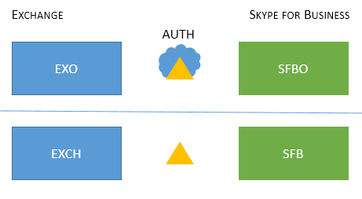

# 新式验证支持的 Skype for Business 拓扑

本文列出了 Skype for Business 中的新式验证支持哪些联机和本地拓扑，以及适用于每个拓扑的安全功能。

## Skype for Business 中的新式验证

Skype for Business 可以利用新式验证的安全优势。 由于 Skype for Business 与 Exchange 紧密配合，因此 Skype for Business 客户端用户将看到的登录行为也将受 Exchange 的 MA 状态影响。 如果你拥有 Skype for Business 拆分域混合，这同样适用。 这有许多移动部件，但此处的目标是轻松直观地显示支持的拓扑列表。

鉴于 Skype for Business、Skype for Business online、Exchange Server和 Exchange Online，MA 支持哪些拓扑？

<!--  > [!TIP] > Not sure what Modern Authentication even is? No worries.  This Skype for Business article  4e6a99cd-7859-4062-8a30-5ac79ba36b52  explains it in the first paragraphs. -->

### Skype for Business 中支持的 MA 拓扑

可能有两个服务器应用程序和两个 Microsoft 365 或 Office 365 工作负载，它们涉及 MA 使用的 Skype for Business 拓扑。

- Skype for Business server (CU 5) 本地部署

- Skype for Business online (SFBO) 

- 内部部署 Exchange 服务器

- Exchange Server online (EXO) 

MA 的另一个重要部分是了解身份验证 (身份验证) 身份验证 (authZ) 将发生。 两个选项是：

- Microsoft 云中的 Azure AD 联机

- Active Directory 联合服务器 (ADFS) 本地部署

因此，它看起来有点类似，在云中使用 Azure AD 的 EXO 和 SFBO，以及 Exchange Server (EXCH) 和 Skype for Business (SFB) 部署。

以下是受支持的拓扑。 请注意图形的键：

- 如果图标灰显或灰显，则不用于此方案。

- EXO 是 Exchange Online。

- SFBO 是 Skype for Business Online。

- EXCH 是 Exchange 内部部署。

- SFB 是本地 Skype for Business。

- 授权服务器由三角形表示，例如，Azure AD 是一个三角形，其后面是云。

- 箭头指向在客户端尝试访问指定的服务器资源时将使用的授权服务器。

首先，让我们在仅本地拓扑或仅云拓扑中介绍 SKYPE for Business 的 MA。

> [!IMPORTANT]
> 准备好在 Skype for Business Online 中设置新式验证了吗？ 此处是启用此功能 [的步骤](https://social.technet.microsoft.com/wiki/contents/articles/34339.skype-for-business-online-enable-your-tenant-for-modern-authentication.aspx)。

|拓扑名称    |示例    |说明    |支持    |
|:-----|:-----|:-----|:-----|
|仅云    |用户所居/邮箱位置：联机    |MA 适用于 EXO 和 SFBO。    因此，授权服务器是 Azure AD。    |多重身份验证 (MFA) 、基于客户端证书的身份验证 (CBA) 、条件访问 (CA) /移动应用程序管理 (MAM) Intune。 \*    |
|仅 On-prem    |用户所定位/邮箱位置：本地    |MA 适用于本地 SFB。    因此，授权服务器是 ADFS。    有关配置的详细信息，请参阅 [本文。](https://technet.microsoft.com/library/mt710548.aspx)   |MFA (Windows 桌面 - 不支持移动客户端) 。 无 Exchange 集成功能。   
 **建议不要采用这种方法。请参阅此处：**[https://aka.ms/ModernAuthOverview](https://aka.ms/ModernAuthOverview)
 |

> [!IMPORTANT]
> 建议 Skype for Business 和 Exchange (及其联机对应设备中的 MA 状态) 减少提示数。

混合拓扑涉及 SFB 拆分域混合的组合。 这些是当前支持的混合拓扑：

|拓扑名称    |示例    |说明    |支持    |
|:-----|:-----|:-----|:-----|
|混合 1    |             用户所在的用户/邮箱：EXO 和 SFB    |未为 SFB 启用 MA;此拓扑中没有任何 SFB MA 功能可用。    |SFB 没有 MA 功能。    |
|混合 2    |             用户所定位/邮箱：EXCH 和 SFBO    |MA 仅适用于 SFBO。 授权服务器是托管在 SFBO 中的用户的 Azure AD，而 EXCH 本地的 AD。    |Intune 的 MFA、CBA、CA/MAM。\*    |
|混合 3    |             用户所在的/邮箱：EXO + SFB 或 EXCH + SFB    |此拓扑中没有任何 SFB MA 功能可用    |SFB 没有 MA 功能。    |
|混合 4    |             用户所在的/邮箱：EXCH +SFBO 或 EXCH + SFB    |MA 适用于 SFBO，因此对于 SFBO 中托管的用户，授权服务器是 Azure AD。 SFB 和 EXO 中的用户使用 AD。    |MFA、CBA、CA/MAM with Intune 仅适用于联机用户。\*    |
|混合 5    |             用户所在的用户/邮箱：EXO + SFBO、EXO + SFB、EXCH + SFBO 或 EXCH + SFB    |MA 在 EXO 和 SFBO 中均打开，因此授权服务器是托管在 SFBO 中的用户的 Azure AD;EXCH 和 SFB 中的用户使用 AD。    |MFA、CBA、CA/MAM with Intune 仅适用于联机用户。\*    |
|混合 6    |             用户所在的用户/邮箱：EXO + SFBO、EXO + SFB、EXCH + SFBO 或 EXCH + SFB    |MA 位于任何地方，因此授权服务器是所有用户的 Azure AD。  (联机和本地)      请参阅 [https://aka.ms/ModernAuthOverview](https://aka.ms/ModernAuthOverview) 部署步骤。   |MFA、CBA 和 CA/MAM (通过 Intune) 适用于所有用户。    |

\* - MFA 包括 Windows 桌面、MAC、iOS、Android 设备和 Windows 手机;CBA 包括 Windows 桌面、iOS 和 Android 设备;使用 Intune 的 CA/MAM 包括 Android 和 iOS 设备。

> [!IMPORTANT]
> 值得注意的是，在某些情况下，用户可能会看到多个提示，尤其是当客户端可能需要和请求的所有服务器资源中的 MA 状态不相同时，与混合拓扑的所有版本的情况一样。

> [!IMPORTANT]
> 另请注意，在某些情况下 (混合 1、3 和 5) 必须设置 [AllowADALForNonLyncIndependentOfLync](https://support.microsoft.com/help/3082803/info-about-the-allowadalfornonlyncindependentoflync-setting-in-skype-for-business,-lync-2013,-and-exchange-online) 注册表项，以便正确配置 Windows 桌面客户端。

