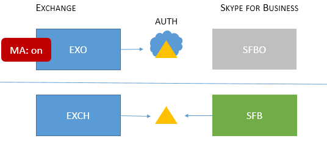

# Skype for Business topologies supported with Modern AuthenticationSkype for Business topologies supported with Modern Authentication
 
本文列出了 Skype for Business 中的新式验证支持的在线和本地拓扑，以及适用于每个拓扑的安全功能。This article lists what online and on-premises topologies are supported with Modern Authentication in Skype for Business, as well as security features that apply to each topology.
  
## Skype for Business 中的新式验证Modern Authentication in Skype for Business

Skype for Business 可以利用新式验证的安全优势。因为 Skype for Business 与 Exchange 密切协作，Skype for Business 客户端用户的登录行为也将受 Exchange 的 MA 状态影响。如果你具有混合 Skype for Business 拆分域，这一点也适用。这其中有很多活动部分，但其目的是为了轻松地将支持的拓扑列表可视化。Skype for Business can leverage security advantages of Modern Authentication. Because Skype for Business works closely with Exchange, the login behaviour Skype for Business client users will see will also be effected by the MA status of Exchange. This will also apply if you have a Skype for Business split-domain hybrid. That's a lot of moving parts, but the aim here is an easy to visualize list of supported topologies.
  
对于 Skype for Business、Skype for Business Online、Exchange Server 和 Exchange Onlin，MA 支持哪些拓扑？Given Skype for Business, Skype for Business online, Exchange Server, and Exchange online, what topologies are supported with MA?
  
<!--  > [!TIP] > Not sure what Modern Authentication even is? No worries.  This Skype for Business article  4e6a99cd-7859-4062-8a30-5ac79ba36b52  explains it in the first paragraphs. --> 
  
### Skype for Business 中支持的 MA 拓扑Supported MA topologies in Skype for Business

MA 使用的 Skype for Business 拓扑可能涉及两个服务器应用程序和两个 Office 365 工作负载。There are potentially two server applications, and two Office 365 workloads, involved with Skype for Business topologies used by MA.
  
- Skype for business 服务器 (CU 5) 内部部署Skype for Business server (CU 5) on-premises
    
- Skype for Business Online (SFBO)Skype for Business online (SFBO)
    
- Exchange Server 本地Exchange server on-premises
    
- Exchange Server Online (EXO)Exchange server online (EXO)
    
MA 的另一个重要部分是了解在何处执行用户身份验证 (authN) 和授权 (authZ)。有两个选项：Another important part of MA is knowing where the authentication (authN) and authorization (authZ) of users will take place. The two options are:
  
- Azure AD，在 Microsoft Cloud 中在线进行Azure AD, online in the Microsoft Cloud
    
- Active Directory Federation Server (ADFS) 本地Active Directory Federation Server (ADFS) on-premises
    
因此, 它看起来有点类似, 在云中使用 EXO 和 SFBO, 使用 Azure AD 以及 Exchange Server (EXCH) 和 Skype for business Server (SFB) on-本地。So it looks a bit like this, with EXO and SFBO in the Cloud with Azure AD, and Exchange Server (EXCH) and Skype for Business server (SFB) on-prem.
  

  
支持的拓扑如下：请注意图形的图例：Here are the supported topologies. Please note the key for the graphics:
  
- 如果图标变暗或灰显，则表明在此情况下无法使用。If the icon is dimmed or grey, it is not used in the scenario.
    
- EXO 是 Exchange Online。EXO is Exchange Online.
    
- SFBO 是 Skype for Business Online。SFBO is Skype for Business Online.
    
- EXCH 是 Exchange 本地。EXCH is Exchange on-premises.
    
- SFB 是 Skype for Business 本地。SFB is Skype for Business on-premises.
    
- 授权服务器用三角形表示，例如，Azure AD 是后面有一朵云的三角形。Authorizing servers are represented by triangles, for example, the Azure AD is a triangle with a cloud behind it.
    
- 箭头指向当客户尝试访问指定的服务器资源时将使用的授权服务器。Arrows point at the authorizing server that will be used when clients try to reach the specified server resource.
    
首先，我们来看看仅本地或仅云拓扑中的 Skype for Business 的 MA。First, let's cover MA with Skype for Business in both On-premises-only or Cloud-only topologies.
  
> [!IMPORTANT]
> 是否已准备好在 Skype for Business Online 中设置新式验证？Are you ready to set up Modern Authentication in Skype for Business Online? 启用此功能的步骤在[这里](https://social.technet.microsoft.com/wiki/contents/articles/34339.skype-for-business-online-enable-your-tenant-for-modern-authentication.aspx)。The steps to enable this feature are right [here](https://social.technet.microsoft.com/wiki/contents/articles/34339.skype-for-business-online-enable-your-tenant-for-modern-authentication.aspx). 
  
|拓扑名称Topology name    |示例Example    |说明Description    |支持Supported    |
|:-----|:-----|:-----|:-----|
|仅云Cloud only    |用户托管/邮箱位置：在线 Users homed/mailboxes located: Online    |MA 对于 EXO 和 SFBO 为启用状态。MA is on for both EXO and SFBO.    因此，授权服务器是 Azure AD。Therefore, the authorization server is Azure AD.    |多重身份验证 (MFA)、基于客户端证书的身份验证 (CBA)、Intune 有条件访问 (CA)/移动应用管理 (MAM)。Multi-factor authentication (MFA), Client-certificate based authentication (CBA), Conditional Access (CA)/Mobile Application Management (MAM) with Intune. \*    |
|仅本地On-prem only    |用户托管/邮箱位置：本地Users homed/mailboxes located: On-premises    |MA 对于 SFB 本地为启用状态。MA is on for SFB on-premises.    因此，授权服务器是 ADFS。Therefore, the authorization server is ADFS.    有关配置的详细信息, 请参阅[本文。](https://technet.microsoft.com/en-us/library/mt710548.aspx)For configuration details, please see [this article.](https://technet.microsoft.com/en-us/library/mt710548.aspx)   |MFA（仅限 Windows 桌面 - 不支持移动客户端）。不提供 Exchange 集成功能。MFA (Windows Desktop only - mobile clients are not supported). No Exchange integration features.    |
   
> [!IMPORTANT]
> 建议 Skype for Business 和 Exchange（及其在线对应项）的 MA 状态应相同，以减少提示数量。It's recommended that the MA state be the same across Skype for Business and Exchange (and their online counterparts) to reduce the number of prompts. 
  
混合拓扑涉及 SFB 拆分域混合组合。当前支持下列混合拓扑：Mixed topologies involve combinations of SFB split-domain hybrids. These are the Mixed topologies currently supported:
  
|拓扑名称Topology name    |示例Example    |说明Description    |支持Supported    |
|:-----|:-----|:-----|:-----|
|混合 1Mixed 1    |             用户托管/邮箱位置：EXO 和 SFBUsers homed/mailboxes located: EXO and SFB    |MA 对 SFB 未启用，此拓扑中不提供 SFB MA 功能。MA is not enabled for SFB; no SFB MA features available in this topology.    |SFB 无 MA 功能。No MA features for SFB.    |
|混合 2Mixed 2    |             用户托管/邮箱位置：EXCH 和 SFBOUsers homed/mailboxes located: EXCH and SFBO    |MA 对于仅 SFBO 为启用状态。MA is on for SFBO only. 授权服务器是托管在 SFBO 中的用户的 Azure AD, 但 EXCH 本地的广告。The authorization server is Azure AD for users homed in SFBO, but AD for EXCH on-premises.    |具有 Intune 的 MFA、CBA、CA/MAM。\*MFA, CBA, CA/MAM with Intune.\*    |
|混合 3Mixed 3    |             用户托管/邮箱位置：EXO + SFB 或 EXCH + SFBUsers homed/mailboxes located: EXO + SFB, or EXCH + SFB    |此拓扑中不提供 SFB MA 功能No SFB MA features available in this topology    |SFB 无 MA 功能。No MA features for SFB.    |
|混合 4Mixed 4    |             用户托管/邮箱位置：EXCH +SFBO 或 EXCH + SFBUsers homed/mailboxes located: EXCH +SFBO or EXCH + SFB    |MA 对于 SFBO 为启用状态，因此对于 SFBO 中托管的用户，授权服务器是 Azure AD。MA is on for SFBO, therefore the authorization server is Azure AD for users homed in SFBO. 本地 SFB 和 EXO 中的用户使用广告。On-prem users in SFB and EXO use AD.    |仅限适用于联机用户的适用于 MFA、CBA、CA/MAM 的 Intune。\*MFA, CBA, CA/MAM with Intune for online users only.\*    |
|混合 5Mixed 5    |             用户托管/邮箱位置：XO + SFBO、EXO + SFB、EXCH + SFBO 或 EXCH + SFBUsers homed/mailboxes located: EXO + SFBO, EXO + SFB, EXCH + SFBO, or EXCH + SFB    |MA 同时在 EXO 和 SFBO 中, 因此授权服务器是托管在 SFBO 中的用户的 Azure AD;本地 EXCH 和 SFB 中的用户使用广告。MA is on in both EXO and SFBO, therefore the authorization server is Azure AD for users homed in SFBO; on-prem users in EXCH and SFB use AD.    |仅限适用于联机用户的适用于 MFA、CBA、CA/MAM 的 Intune。\*MFA, CBA, CA/MAM with Intune for online users only.\*    |
|混合6Mixed 6    |             用户托管/邮箱位置：XO + SFBO、EXO + SFB、EXCH + SFBO 或 EXCH + SFBUsers homed/mailboxes located: EXO + SFBO, EXO + SFB, EXCH + SFBO, or EXCH + SFB    |MA 位于任意位置, 因此授权服务器是适用于所有用户的 Azure AD。MA is on everywhere, therefore the authorization server is Azure AD for all users. (联机和本地)(online and on-premises)     请参阅[https://aka.ms/ModernAuthOverview](https://aka.ms/ModernAuthOverview)了解部署步骤。Please see [https://aka.ms/ModernAuthOverview](https://aka.ms/ModernAuthOverview) for deployment steps.   |对所有用户的 MFA、CBA 和 CA/MAM (通过 Intune)。MFA, CBA and CA/MAM (via Intune) for all users.    |
   
\*-MFA 包括 Windows 桌面版、MAC 版、iOS 版、Android 设备和 Windows phone;CBA 包括 Windows 桌面版、iOS 版和 Android 设备;带有 Intune 的 CA/MAM 包括 Android 和 iOS 设备。\* - MFA includes Windows Desktop, MAC, iOS, Android devices, and Windows Phones; CBA includes Windows Desktop, iOS and Android devices; CA/MAM with Intune, includes Android and iOS devices. 
  
> [!IMPORTANT]
> 必须注意的是，在某些情况下，用户可能会看到**多个提示**，尤其是当客户可能需要和请求的服务器资源的 MA 状态不同时，因为这种情况下包含所有版本的混合拓扑。 It's very important to note that users may see **multiple prompts** in some cases, notably where the MA state is not the same across all the server resources that clients may need and request, as is the case with all versions of the Mixed topologies.

> [!IMPORTANT]
> 另请注意, 在某些情况下 (特别是1、3和 5), 必须为 Windows 桌面客户端设置正确配置的[AllowADALForNonLynIndependentOfLync](https://support.microsoft.com/en-us/help/3082803/info-about-the-allowadalfornonlyncindependentoflync-setting-in-skype-for-business,-lync-2013,-and-exchange-online)注册表项。Also note that in some cases (Mixed 1, 3, and 5 specifically) an [AllowADALForNonLynIndependentOfLync](https://support.microsoft.com/en-us/help/3082803/info-about-the-allowadalfornonlyncindependentoflync-setting-in-skype-for-business,-lync-2013,-and-exchange-online) registry key must be set for proper configuration for Windows Desktop Clients.
  

