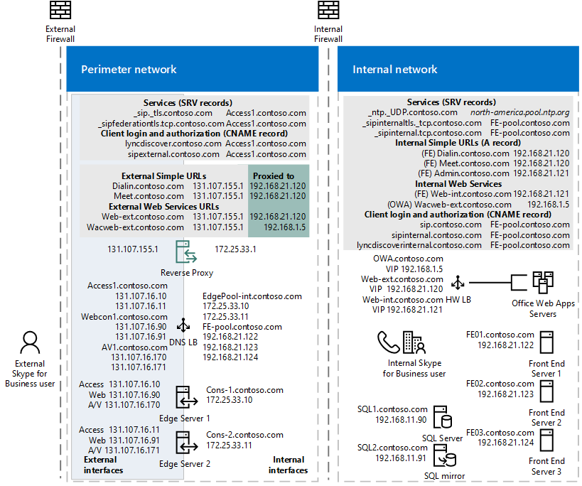

# Skype for Business 的负载平衡要求
 
**摘要：** 查看的负载平衡的企业服务器实现 Skype 之前的注意事项。
  
负载平衡分布在池中的服务器之间的流量。 如果您有前端池、 中介服务器池或边缘服务器池，需要部署负载平衡的这些池。
  
Skype 业务服务器支持的负载平衡的客户端到服务器的通信解决方案的两种类型： 域名系统 (DNS) 负载平衡和硬件负载平衡通常 （缩写为 HLB）。 DNS 负载平衡提供几个优点包括简化管理、 更高效疑难解答、 和隔离何种业务服务器流量从任何潜在的硬件负载平衡器问题您 Skype 的能力。
  
决定为您自己的负载平衡解决方案适合在您部署中，每个池，但请记住以下限制： 
  
- 内部边缘接口和外部边缘接口必须使用同一类型的负载平衡。您不能在一个接口上使用 DNS 负载平衡的同时，在另一个接口上使用硬件负载平衡。
    
- 某些类型的流量需要硬件负载平衡器。例如，HTTP 流量需要硬件平衡负载器而非 DNS 负载平衡。DNS 负载平衡对客户端到服务器的 Web 流量不起作用。
    
如果选择对某个池使用 DNS 负载平衡，但仍需对流量（如 HTTP 流量）实现硬件负载平衡器，则会大大简化硬件负载平衡器的管理。 例如，配置硬件负载平衡器将更简单，因为它仅管理 HTTP 和 HTTPS 流量，而所有其他协议将由 DNS 负载平衡管理。 有关详细信息，请参阅[DNS 负载平衡](load-balancing.md#BKMK_DNSLoadBalancing)。 
  
对于服务器到服务器通信，Skype 业务服务器使用拓扑感知负载平衡。 服务器阅读要获取在拓扑中，服务器的 Fqdn 的中央管理存储中的已发布的拓扑，并自动将在服务器之间的流量分发。 管理员不必设置或管理此类型的负载平衡。 
  
如果使用 DNS 负载平衡并且需要阻止至特定计算机的流量，则仅仅删除池 FQDN 中的 IP 地址条目是不够的。您还必须删除计算机的 DNS 条目。 
  
## 硬件负载平衡器要求

扩展的业务服务器 Skype 的合并的边缘拓扑进行了优化的主要与其他组织使用 Skype 业务服务器或 Lync Server 联盟的新部署的 DNS 负载平衡。 如果任何以下方案需要高可用性，硬件负载平衡器必须使用边缘服务器池上的以下： 
  
- 与使用 Office Communications Server 2007 R2 或 Office Communications Server 2007 的组织建立联盟
    
- Exchange UM sp1 之前 Exchange 2010 UM Exchange 使用的远程用户
    
- 与公共 IM 用户的连接
    
> [!IMPORTANT]
> 不支持对一个接口使用 DNS 负载平衡，而对另一个接口使用硬件负载平衡。必须对两个接口都使用硬件负载平衡，或者对两个接口都使用 DNS 负载平衡。 
  
> [!NOTE]
> 如果使用硬件负载平衡器，则为内部网络连接部署的负载平衡器必须配置为仅对发往运行访问边缘服务和 A/V 边缘服务的服务器的流量进行负载平衡。它不能对发往内部 Web 会议边缘服务或内部 XMPP 代理服务的流量进行负载平衡。 
  
> [!NOTE]
> 直接服务器返回 (DSR) NAT 不支持与 Skype 业务服务器。 
  
若要确定您的硬件负载平衡器是否支持所需的 Skype 业务服务器所需的功能，请参阅[for Business 的 Skype 的基础结构](https://docs.microsoft.com/SkypeForBusiness/certification/infra-gateways)。 
  
### 运行 A/V 边缘服务的边缘服务器的硬件负载平衡器要求

下面是运行 A 的边缘服务器的硬件负载平衡器要求 / V 边缘服务：
  
- 对内部和外部端口 443 关闭 TCP nagling。Nagling 是将若干小数据包整合到单个大数据包以提高传输效率的过程。
    
- 关闭外部端口范围 50000-59999 TCP nagling。 
    
- 请不要对内部或外部防火墙使用 NAT。 
    
- 边缘内部接口必须位于不同网络边缘服务器外部接口上，且必须禁用它们之间的路由。 
    
- 外部接口的边缘服务器运行 A / V 边缘服务必须使用公开可路由 IP 地址和 NAT 或端口上的任何边缘外部 IP 地址的转换。 
    
- 负载平衡器不得更改客户端的源地址。
    
### 其他硬件负载平衡器要求

基于 cookie 的相关性要求将会显著降低中 Skype 业务服务器 Web 服务。 如果您部署 Skype 业务服务器，并将不会保留的所有 Lync Server 2010 前端服务器或前端池，则不需要基于 cookie 的持久性。 但是，如果将临时或永久保留的所有 Lync Server 2010 前端服务器或前端池，您仍使用基于 cookie 的持久性，它为部署和 Lync Server 2010 的配置。 
  
> [!NOTE]
> **如果您决定使用基于 Cookie 的相关性，但您的部署不需要它**，如此做没有任何负面影响。 
  
对于 **不使用**基于 Cookie 的相关性的部署：
  
- 在端口 4443 的反向代理发布规则上，将“**转发主机头**”设置为 True。这可确保转发原始 URL。
    
对于**将使用**基于 Cookie 的相关性的部署：
  
- 在端口 4443 的反向代理发布规则上，将“**转发主机头**”设置为 True。这可确保转发原始 URL。
    
- 不得将硬件负载平衡器 Cookie 标记为 httpOnly
    
- 硬件负载平衡器 Cookie 不得具有过期时间
    
- 硬件负载平衡器 Cookie 必须名为 **MS-WSMAN**（这是 Web 服务预期的值，不能更改）
    
- 必须在其传入 HTTP 请求没有 Cookie 的每个 HTTP 响应中设置硬件负载平衡器 Cookie，无论该同一 TCP 连接上的上一个 HTTP 响应是否已获得 Cookie 都是如此。如果负载平衡器将 Cookie 插入优化为每个 TCP 连接只发生一次，则不得使用该优化
    
> [!NOTE]
> 典型的硬件负载平衡器配置使用源地址相关性和 20 分钟 TCP 会话生存期，因为会话状态维护通过客户端使用这对于 Lync Server 和 Lync 2013 客户端和/或和应用程序交互。 
  
如果部署移动设备，则您的硬件负载平衡器必须能对 TCP 会话中的单个请求进行负载平衡（实际上，您必须能基于目标 IP 地址对单个请求进行负载平衡）。
  
> [!CAUTION]
> F5 硬件负载平衡器具有一个名为 OneConnect 的功能，这可确保一个 TCP 连接中的每个请求是单独进行负载平衡的。如果部署的是移动设备，请确保您的硬件负载平衡器供应商支持这一相同功能。最新的 Apple iOS 移动应用程序要求传输层安全性 (TLS) 1.2 版。F5 提供专门针对这一要求的设置。 
  
> [!CAUTION]
> 有关第三方硬件负载平衡器的详细信息，请参阅[for Business 的 Skype 的基础结构](https://docs.microsoft.com/SkypeForBusiness/certification/infra-gateways)。  
  
以下是控制器和前端池 Web 服务的硬件负载平衡器要求：
  
- 对于内部 Web 服务 VIP，在硬件负载平衡器上设置 Source_addr 持久性（内部端口 80 和 443）。 对于业务服务器 Skype，Source_addr 持久性意味着，来自单个 IP 地址的多个连接始终发送到一台服务器来维护会话状态。
    
- 使用 TCP 空闲超时 1800 秒。
    
- 在反向代理和下一个跃点池的硬件负载平衡器之间防火墙中，创建一个规则来允许 https： 通信端口 4443 上，从反向代理的硬件负载平衡器。 必须将硬件负载平衡器配置为侦听端口 80、443 和 4443。
    
### 硬件负载平衡器关联要求的摘要

|**客户端/用户位置**|**外部 Web 服务 FQDN 关联要求**|**内部 Web 服务 FQDN 关联要求**|
|:-----|:-----|:-----|
|Lync Web App （内部和外部用户）    移动设备（内部和外部用户）    |无相关性    |源地址相关性    |
|Lync Web App （仅外部用户）    移动设备（内部和外部用户）    |无相关性    |源地址相关性    |
|Lync Web App （仅内部用户）    移动设备（未部署）    |无相关性    |源地址相关性    |
   
### 硬件负载平衡器的端口监控

在硬件负载平衡器上定义端口监控来确定特定服务何时由于硬件或通信故障而不再可用。 例如，如果前端服务器服务 (RTCSRV) 停止因为前端服务器或前端池失败，HLB 监控还应该停止接收通信，在 Web 服务。 可在 HLB 上实施端口监控来监控以下各项：
  
**前端服务器用户池 HLB 内部接口**

|**虚拟 IP/端口**|**节点端口**|**节点计算机/监视器**|**持久性配置文件**|**说明**|
|:-----|:-----|:-----|:-----|:-----|
|\<池\>web int_mco_443_vs    443    |443    |前端    5061    |源    |HTTPS    |
|\<池\>web int_mco_80_vs    80    |80    |前端    5061    |源    |HTTP    |
   
**前端服务器用户池 HLB 外部接口**

|**虚拟 IP/端口**|**节点端口**|**节点计算机/监视器**|**持久性配置文件**|**说明**|
|:-----|:-----|:-----|:-----|:-----|
|\<池\>web_mco_443_vs    443    |端口 4443    |前端    5061    |无    |HTTPS    |
|\<池\>web_mco_80_vs    80    |8080    |前端    5061    |无    |HTTP    |
   
## DNS 负载平衡

Skype 业务服务器启用 DNS 负载平衡，可以大幅降低负载平衡在您的网络管理开销的软件解决方案。 DNS 负载平衡平衡是唯一的 Skype 的企业服务器，例如 SIP 流量和媒体流量的网络流量。
  
如果您部署 DNS 负载平衡，就可以最贵组织的管理开销的硬件负载平衡器。 此外，还可以免除解决 SIP 流量负载平衡器配置错误相关问题的复杂过程。 您还可以阻止服务器连接以使服务器脱机。 同时，DNS 负载平衡还可确保硬件负载平衡器问题不会影响 SIP 流量的元素，例如基本呼叫路由。

下图显示了示例同时包含内部和外部 DNS 负载平衡： 
  
**使用公共 IPv4 地址边缘网络图**

  
与为所有类型的流量使用硬件负载平衡器相比，使用 DNS 负载平衡还可以降低您购买硬件负载平衡器的成本。 您应使用过去 Business Server 测试与 Skype 的互操作性认证的负载平衡器。 有关负载平衡器的互操作性测试的详细信息，请参阅[Lync Server 2010 负载平衡器合作伙伴](https://go.microsoft.com/fwlink/p/?linkId=202452)。 为业务 Server 适用于 Skype 中存在的内容。
  
前端池、边缘服务器池、控制器池和独立的中介服务器池都支持 DNS 负载平衡。
  
通常在应用程序级别实现 DNS 负载平衡。 应用程序 （例如，客户端运行 for Business 的 Skype），尝试连接到一个从返回的 IP 地址连接到池中的服务器的 DNS A 和 AAAA （如果使用 IPv6 寻址） 记录查询池完全限定的域名 (FQDN)。 
  
例如，如果名为 pool01.contoso.com 的池中有三台前端服务器，则会发生以下情形：
  
- 运行 for Business 的 Skype 的客户端 DNS 查询 pool01.contoso.com。 此查询将返回三个 IP 地址并将其按如下方式进行缓存（不需要按此顺序）：
    
    pool01.contoso.com 192.168.10.90
    
    pool01.contoso.com 192.168.10.91
    
    pool01.contoso.com 192.168.10.92
    
- 客户端将尝试建立到其中一个 IP 地址的传输控制协议 (TCP) 连接。如果失败，则客户端会尝试缓存中的下一个 IP 地址。
    
- 如果 TCP 连接成功，则客户端与 TLS 协商连接到 pool01.contoso.com 上的主注册器。
    
- 如果客户端尝试了所有缓存的条目不成功连接的情况下，则通知用户当前没有服务器运行 Business Server Skype 此时都已可用。
    
> [!NOTE]
> 基于 DNS 的负载平衡不同于 DNS 循环 (DNS RR)，后者通常是指依靠 DNS 提供与池中服务器对应的不同顺序的 IP 地址来进行负载平衡。通常 DNS RR 只启用负载分配，而不启用故障转移。例如，如果到由 DNS A 和 AAAA（如果使用的是 IPv6 寻址）查询返回的一个 IP 地址的连接失败，则连接失败。因此，DNS 循环自身的可靠性低于基于 DNS 的负载平衡。您可以将 DNS 循环与 DNS 负载平衡结合使用。 
  
DNS 负载平衡用于以下方面：
  
- 对至边缘服务器的服务器到服务器 SIP 进行负载平衡
    
- 对统一通信应用程序服务 (UCAS) 应用程序（如会议自动助理、响应组和呼叫寄存）进行负载平衡
    
- 阻止到 UCAS 应用程序的新连接（也称为“排出”）
    
- 对客户端和边缘服务器之间的所有客户端到服务器的流量进行负载平衡
    
DNS 负载平衡不能用于以下方面：
  
- 客户端到服务器至控制器或前端服务器的 Web 流量
    
DNS 负载平衡和联盟流量：
  
如果一个 DNS SRV 查询返回了多个 DNS 记录，则访问边缘服务始终以最低数值优先级与最高数值权重拾取 DNS SRV 记录。 Internet 工程任务组文档"以指定的服务 (DNS SRV) 位置 DNS RR" [RFC 2782、 DNS SRV RR](https://www.ietf.org/rfc/rfc2782.txt)指定是否有多个 DNS SRV 记录定义，首先使用优先级、 然后重量。 例如 DNS SRV 记录 A 权重为 20，优先级为 40，而 DNS SRV 记录 B 权重为 10，优先级为 50。 优先级为 40 的 DNS SRV 记录 A 将被选中。 下列规则适用于 DNS SRV 记录选择：
  
- 首先考虑优先级。客户端必须尝试联系它可访问的由具有最低编号优先级的 DNS SRV 记录定义的目标主机。应按权重字段定义的顺序尝试具有相同优先级的目标。
    
- 权重字段指定具有相同优先级的条目的相对权重。 权重越大，应赋予的被选中可能性相应越高。 没有选择任何服务器进行时，DNS 管理员应使用权重 0。 相对于包含大于 0 的权重的记录，权重为 0 的记录应具有非常小的被选中机会。
    
如果返回了优先级和权重都相同的多个 DNS SRV 记录，则访问边缘服务将选择首先从 DNS 服务器收到的 SRV 记录。
  
### 前端池和控制器池中的 DNS 负载平衡

您可以使用 DNS 负载平衡来平衡前端池和控制器池中的 SIP 流量。部署 DNS 负载平衡后，仍需要对这些池使用硬件负载平衡器，但仅用于客户端到服务器的 HTTPS 流量。硬件负载平衡器用于通过端口 443 和 80 从客户端传入的 HTTPS 流量。 
  
尽管这些池中仍需要硬件负载平衡器，但这些负载平衡器的安装和管理主要用于硬件负载平衡器管理员熟悉的 HTTPS 流量。
  
#### 支持旧客户端和服务器并对其进行 DNS 负载平衡

DNS 负载平衡支持自动故障转移只有业务客户端运行 Skype 业务服务器或 Lync Server 2010 和 Lync 2013 和 Skype 的服务器。 客户端和 Office Communications Server 的早期版本仍然可以连接到池运行 DNS 负载平衡，但如果不能进行连接到第一台服务器的 DNS 负载平衡引用给，他们不能故障转移到池中的另一台服务器. 
  
此外，如果您使用 Exchange UM，您必须使用 Exchange 2010 SP1 的最少的 Skype 支持获得业务服务器 DNS 负载平衡。 如果使用较早版本的 Exchange，则在以下 Exchange UM 方案中无法为您的用户提供故障转移功能：
  
- 在其电话上播放企业语音邮件
    
- 转接来自 Exchange UM 自动助理的呼叫
    
其他所有 Exchange UM 方案将正常工作。
  
#### 在前端池和控制器池中部署 DNS 负载平衡

在前端池和控制器池中部署 DNS 负载平衡时，需要使用 FQDN 和 DNS 记录执行一些额外步骤。
  
- 使用 DNS 负载平衡池必须具有两个 Fqdn： 正则池 FQDN 由 DNS 负载平衡 （如 pool01.contoso.com)，和解析为池中的服务器的物理 Ip 和 FQDN 另一个池的 Web 服务 （如web01.contoso.com)，它解析为池的虚拟 IP 地址。 
    
    在拓扑生成器中，如果您想要部署 DNS 负载平衡池，要创建此额外的池的 Web 服务 FQDN 必须选择**覆盖内部 Web 服务池 FQDN**复选框并键入 FQDN，在**指定 Web 服务 Url此池**页。
    
- 要支持 DNS 负载平衡使用的 FQDN，必须设置 DNS，以便将池 FQDN（例如 pool01.contoso.com）解析为该池中所有服务器的 IP 地址（例如，192.168.1.1、192.168.1.2 等）。您应该仅包含当前部署的服务器的 IP 地址。
    
    > [!CAUTION]
    > 如果您有多个前端池或前端服务器的外部 Web 服务 FQDN 必须是唯一的。 例如，如果您定义的外部 Web 服务的前端服务器的 FQDN 为**pool01.contoso.com**，不能使用**pool01.contoso.com** ，另一个前端池或前端服务器。 如果还要部署控制器、 外部 Web 服务 FQDN 定义任何控制器或控制器池必须不同于任何其他控制器池以及任何前端池或前端服务器。 如果决定覆盖内部 web 服务与自定义的 FQDN，每个 FQDN 必须是唯一的任何其他前端池、 控制器或控制器池。
  
### 边缘服务器池中的 DNS 负载平衡

您可以在边缘服务器池中部署 DNS 负载平衡。如果要进行部署，则必须了解以下注意事项。
  
在边缘服务器中使用 DNS 负载平衡会导致以下方案中丧失故障转移功能：
  
- 与之前 Lync Server 2010 的业务服务器运行的 Skype 版本的组织建立联盟。
    
- 与公共即时消息 (IM) 服务 AOL 和 yahoo ！，除了基于 XMPP 的提供程序和服务器，如 Google Talk 当前只支持 XMPP 伙伴的用户的即时消息交换。
    
只要池中的所有边缘服务器都在运行，这些方案就会正常工作；但是如果某台边缘服务器不可用，则发送到该服务器的对这些方案的所有请求都将失败，而不会路由到其他边缘服务器。
  
 如果您使用 Exchange UM，您必须使用 Exchange 2013 的最少的 Skype 支持获得业务服务器 DNS 负载平衡的边缘。 如果使用较早版本的 Exchange，则在以下 Exchange UM 方案中无法为您的远程用户提供故障转移功能：
  
- 在其电话上播放企业语音邮件
    
- 转接来自 Exchange UM 自动助理的呼叫
    
其他所有 Exchange UM 方案将正常工作。
  
内部边缘接口和外部边缘接口必须使用同一类型的负载平衡。您不能对一个边缘接口使用 DNS 负载平衡，而对另一个边缘接口使用硬件负载平衡。
  
#### 在边缘服务器池中部署 DNS 负载平衡

要在边缘服务器池的外部接口上部署 DNS 负载平衡，需要具有以下 DNS 条目：
  
- 对于访问边缘服务，池中的每台服务器都需要有一个条目。每个条目必须将访问边缘服务的 FQDN（例如 sip.contoso.com）解析为该池中某台边缘服务器上访问边缘服务的 IP 地址。
    
- 对于 Web 会议边缘服务，池中的每台服务器都需要有一个条目。每个条目必须将 Web 会议边缘服务的 FQDN（例如 webconf.contoso.com）解析为该池中某台边缘服务器上 Web 会议边缘服务的 IP 地址。
    
- 对于音频/视频边缘服务，池中的每台服务器都需要有一个条目。 每个条目必须音频/视频边缘服务 (例如，av.contoso.com) 将 FQDN 解析为的 IP 地址的 A / V 边缘服务上一台边缘服务器池中。
    
要在边缘服务器池的内部接口上部署 DNS 负载平衡，必须添加一条将此边缘服务器池的内部 FQDN 解析为该池中每台服务器的 IP 地址的 DNS A 记录。
  
### 在中介服务器池中使用 DNS 负载平衡

可以在独立的中介服务器池上使用 DNS 负载平衡。所有 SIP 和媒体流量都通过 DNS 负载平衡进行平衡。
  
要在中介服务器池中部署 DNS 负载平衡，必须设置 DNS，以便将池 FQDN（例如 mediationpool1.contoso.com）解析为该池中所有服务器的 IP 地址（例如，192.168.1.1、192.168.1.2 等）。
  
### 使用 DNS 负载平衡阻止到服务器的流量

如果使用 DNS 负载平衡并且需要阻止至特定计算机的流量，则仅仅删除池 FQDN 中的 IP 地址条目是不够的。您还必须删除计算机的 DNS 条目。 
  
请注意，对于服务器到服务器通信，业务服务器 Skype 使用可识别拓扑的负载平衡。 服务器阅读要获取在拓扑中，服务器的 Fqdn 的中央管理存储中的已发布的拓扑，并自动将在服务器之间的流量分发。 若要阻止服务器接收服务器到服务器的流量，则必须从拓扑中删除服务器。 
  

